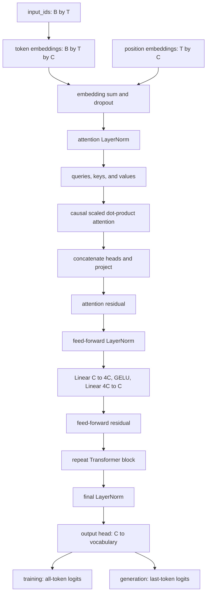
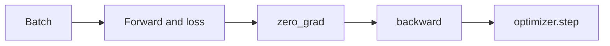

# LearnGPT Course

LearnGPT is a study-first path for building a small decoder-only Transformer in
PyTorch. The course starts with text and token IDs, introduces one mechanism at
a time, and ends with a clean training and generation project.

Python identifiers, command output, examples, diagrams, and explanations use
English throughout the public repository. Complete executable files live in
`study/snapshots/` and `final_project/`; this guide focuses on the purpose of
each change and the connections between the parts.

## Source Map

The implementation is grounded in these sources:

- `nanoGPT/model.py` for the decoder-only Transformer structure;
- `nanoGPT/train.py` for optimization, scheduling, evaluation, and checkpoint
  concepts;
- `nanoGPT/sample.py` for checkpoint-based generation;
- PyTorch modules such as `Embedding`, `Linear`, `LayerNorm`, `GELU`, AdamW,
  scaled dot-product attention, and cross entropy;
- *Attention Is All You Need* for scaled dot-product and multi-head attention;
- *Layer Normalization* for normalization across embedding features;
- FineWeb-Edu for the final text corpus;
- GPT-2 BPE through `tiktoken` for the final tokenizer.

The local code remains the source of truth. External projects explain the
direction, while LearnGPT keeps the implementation deliberately explicit.

## Lesson Index

1. [Lesson 01 - Read the Text](#lesson-01---read-the-text)
2. [Lesson 02 - Character Tokenizer](#lesson-02---character-tokenizer)
3. [Lesson 03 - Encode and Decode](#lesson-03---encode-and-decode)
4. [Lesson 04 - Tokenizer Module](#lesson-04---tokenizer-module)
5. [Lesson 05 - Training and Validation](#lesson-05---training-and-validation)
6. [Lesson 06 - Input and Target](#lesson-06---input-and-target)
7. [Lesson 07 - Random Examples](#lesson-07---random-examples)
8. [Lesson 08 - Python Batch](#lesson-08---python-batch)
9. [Lesson 09 - PyTorch Batch](#lesson-09---pytorch-batch)
10. [Lesson 10 - Batching Module](#lesson-10---batching-module)
11. [Lesson 11 - Verify PyTorch](#lesson-11---verify-pytorch)
12. [Lesson 12 - First Bigram Model](#lesson-12---first-bigram-model)
13. [Lesson 13 - Bigram Loss](#lesson-13---bigram-loss)
14. [Lesson 14 - Bigram Training](#lesson-14---bigram-training)
15. [Lesson 15 - Bigram Generation](#lesson-15---bigram-generation)
16. [Lesson 16 - Bigram Limitation](#lesson-16---bigram-limitation)
17. [Lesson 17 - Token Embeddings](#lesson-17---token-embeddings)
18. [Lesson 18 - Position Embeddings](#lesson-18---position-embeddings)
19. [Lesson 19 - Causal Self-Attention Head](#lesson-19---causal-self-attention-head)
20. [Lesson 20 - Multi-Head Attention](#lesson-20---multi-head-attention)
21. [Lesson 21 - Attention Output Projection](#lesson-21---attention-output-projection)
22. [Lesson 22 - Attention Residual Connection](#lesson-22---attention-residual-connection)
23. [Lesson 23 - LayerNorm Before Attention](#lesson-23---layernorm-before-attention)
24. [Lesson 24 - Feed-Forward Network](#lesson-24---feed-forward-network)
25. [Lesson 25 - Transformer Block](#lesson-25---transformer-block)
26. [Lesson 26 - Multiple Transformer Blocks](#lesson-26---multiple-transformer-blocks)
27. [Lesson 27 - Final LayerNorm](#lesson-27---final-layernorm)
28. [Lesson 28 - Transformer Training](#lesson-28---transformer-training)
29. [Lesson 29 - Loss Estimation](#lesson-29---loss-estimation)
30. [Lesson 30 - Checkpoint](#lesson-30---checkpoint)
31. [Lesson 31 - Generate from a Checkpoint](#lesson-31---generate-from-a-checkpoint)
32. [Lesson 32 - Sampling Controls](#lesson-32---sampling-controls)
33. [Lesson 33 - Best Checkpoint](#lesson-33---best-checkpoint)
34. [Lesson 34 - Optimizer and Scheduler](#lesson-34---optimizer-and-scheduler)
35. [Lesson 35 - Dropout and Weight Tying](#lesson-35---dropout-and-weight-tying)
36. [Lesson 36 - Optimizer Groups](#lesson-36---optimizer-groups)
37. [Lesson 37 - Gradient Accumulation](#lesson-37---gradient-accumulation)
38. [Lesson 38 - Configuration and Resume](#lesson-38---configuration-and-resume)
39. [Lesson 39 - Last-Token Output Head](#lesson-39---last-token-output-head)
40. [Lesson 40 - Scaled Dot-Product Attention](#lesson-40---scaled-dot-product-attention)
41. [Lesson 41 - Performance Flags and DDP](#lesson-41---performance-flags-and-ddp)
42. [Lesson 42 - Final Project](#lesson-42---final-project)

## How to Run Study Scripts

Run every command from the repository root with the project environment:

```bash
.venv/bin/python -B study/lessons/01_read_text.py
```

Replace the filename with the lesson you want to study. `-B` prevents Python
from creating `__pycache__` directories in the teaching tree.

Run the final smoke test with:

```bash
.venv/bin/python -B study/lessons/42_final_project.py
```

Validate the complete structure with:

```bash
.venv/bin/python -B tools/validate_learngpt.py --require-data
```

## How Study Snapshots Work

Each numbered script imports from the snapshot with the same number:

```python
from study.snapshots.lesson_19.model import LanguageModel
```

This rule keeps old lessons executable even after the final project evolves.
The public model name remains `LanguageModel`; the snapshot path identifies the
implementation stage.

The final snapshot is special: all operational files in
`study/snapshots/lesson_42/` must be identical to `final_project/`.

## Complete Project Flow

The concise data and training path is:


The extended model path is:



`B` is batch size, `T` is context size, `C` is embedding size, and the
vocabulary contains 50,257 GPT-2 BPE tokens.

## Lesson 01 - Read the Text

The first script loads the shared FineWeb-Edu sample as plain text. The main
lesson is that language modeling begins with a sequence of symbols, not with a
neural network.

```python
text = DATASET_PATH.read_text(encoding="utf-8")
```

Check that the file exists, the text is not empty, and the first characters are
readable.

## Lesson 02 - Character Tokenizer

A minimal character tokenizer assigns one integer to each unique character.
This is intentionally simple and exists only to make tokenization visible.

```text
character -> integer ID -> character
```

The final project later replaces this tokenizer with GPT-2 BPE.

## Lesson 03 - Encode and Decode

`encode` converts text into IDs and `decode` reconstructs text from IDs.

```python
token_ids = encode("A short example", char_to_id)
reconstructed = decode(token_ids, id_to_char)
```

The round trip must reproduce the original input exactly.

## Lesson 04 - Tokenizer Module

Tokenizer functions move into a reusable snapshot module. This is the first
separation between a study script and reusable project code.

```python
from study.snapshots.lesson_04.tokenizer import decode, encode
```

## Lesson 05 - Training and Validation

The token sequence is split into independent training and validation regions.
Training data updates parameters; validation data measures generalization.

```text
complete token sequence -> training split + validation split
```

## Lesson 06 - Input and Target

For next-token prediction, the target is the input shifted by one position.

```text
input:  [token 0, token 1, token 2]
target: [token 1, token 2, token 3]
```

Every position teaches the model which token followed the current prefix.

## Lesson 07 - Random Examples

Random starting positions create different context windows from the same token
sequence. This prevents every update from seeing only the beginning of the
dataset.

## Lesson 08 - Python Batch

Several input-target examples are grouped into a Python batch. At this stage,
the structure is visible as nested lists:

```text
batch -> examples -> token IDs
```

## Lesson 09 - PyTorch Batch

The Python lists become integer tensors with shape `[batch_size, context_size]`.
Neural layers expect tensors, not arbitrary nested lists.

## Lesson 10 - Batching Module

Batch construction moves into `batching.py`. The reusable function validates
the requested sizes and can place tensors directly on the selected device.

```python
input_tensor, target_tensor = create_batch(
    data=training_data,
    batch_size=4,
    context_size=8,
    device="cpu",
)
```

## Lesson 11 - Verify PyTorch

Before building a model, the script reports the PyTorch version and device
capabilities. This separates environment problems from model problems.

## Lesson 12 - First Bigram Model

The bigram model looks only at the current token and returns one score for every
possible next token.

```text
current token ID -> embedding row -> next-token logits
```

It is a training exercise, not the final architecture.

## Lesson 13 - Bigram Loss

Cross entropy compares the logits with the correct next-token IDs. Logits and
targets are flattened so every batch position contributes one prediction.

## Lesson 14 - Bigram Training

The first complete optimization cycle is introduced:



`loss.backward()` computes gradients; `optimizer.step()` changes the parameters
already owned by the model.

## Lesson 15 - Bigram Generation

Generation repeats four operations: compute last-position logits, convert them
to probabilities, sample a token, and append it to the sequence.

```text
prompt -> logits -> softmax -> sample -> append -> repeat
```

## Lesson 16 - Bigram Limitation

The prompts `all` and `fall` produce the same final scores because both end in
`l`. The prompt `are` can differ because it ends in `e`.

```python
torch.allclose(logits_all, logits_fall)  # True
torch.allclose(logits_all, logits_are)   # Usually False after training
```

The experiment proves that a bigram model cannot use the full context.

## Lesson 17 - Token Embeddings

A token embedding maps each token ID to a trainable vector. The vector is an
internal representation, not a probability distribution.

```text
token ID -> vector of embedding_size values
```

## Lesson 18 - Position Embeddings

Position embeddings tell the model where each token appears inside the current
context. Token and position vectors have the same width and are added together.

## Lesson 19 - Causal Self-Attention Head

One attention head builds queries, keys, and values. The causal mask prevents a
position from reading tokens to its right.

```text
scores = queries @ keys transpose / sqrt(head_size)
scores = causal_mask(scores)
weights = softmax(scores)
output = weights @ values
```

## Lesson 20 - Multi-Head Attention

Several heads run in parallel. Each head can learn a different relationship,
and their outputs are concatenated along the embedding dimension.

## Lesson 21 - Attention Output Projection

After concatenation, a linear projection mixes information from all heads and
returns a tensor with the original embedding width.

## Lesson 22 - Attention Residual Connection

The attention result is added to the block input:

```python
residual_after_attention = embeddings + attention_output
```

The shape remains unchanged, while the representation gains contextual
information.

## Lesson 23 - LayerNorm Before Attention

Pre-normalization stabilizes the input to attention without changing the tensor
shape.

```python
attention_input = self.attention_layer_norm(embeddings)
```

## Lesson 24 - Feed-Forward Network

The feed-forward network transforms each position independently:

```text
C -> 4C -> GELU -> C
```

Attention mixes positions; the feed-forward network transforms the features at
each position.

## Lesson 25 - Transformer Block

A complete block contains two pre-normalized residual branches:

```python
attention_output = attention(layer_norm_1(x))
x = x + attention_output
feed_forward_output = feed_forward(layer_norm_2(x))
x = x + feed_forward_output
```

This expanded form is equivalent in purpose to the compact nanoGPT style.

## Lesson 26 - Multiple Transformer Blocks

Several blocks are applied in sequence. Every block preserves
`[batch_size, context_size, embedding_size]`.

## Lesson 27 - Final LayerNorm

The model applies one final normalization before the output head. The output
head then projects internal features into vocabulary logits.

## Lesson 28 - Transformer Training

The full Transformer enters the optimization loop. With random initialization,
the initial loss should be close to the natural logarithm of the vocabulary
size.

For the 50,257-token GPT-2 vocabulary:

```text
ln(50257) is approximately 10.82
```

## Lesson 29 - Loss Estimation

`estimate_loss` averages multiple batches from both splits under `no_grad` and
evaluation mode. It does not update model parameters.

## Lesson 30 - Checkpoint

A checkpoint stores model parameters, optimizer state, configuration, training
step, metrics, tokenizer metadata, and random-number state.

Checkpoint writes are atomic: a temporary file is replaced only after the save
finishes successfully.

## Lesson 31 - Generate from a Checkpoint

Generation reconstructs a fresh model from the saved configuration and then
loads its parameters. This proves that the checkpoint is self-contained.

## Lesson 32 - Sampling Controls

Temperature changes distribution sharpness. `top_k` keeps only the strongest
candidate logits before sampling.

```text
lower temperature -> more conservative samples
higher temperature -> more varied samples
smaller top_k -> fewer candidate tokens
```

## Lesson 33 - Best Checkpoint

Training writes a best checkpoint when validation loss improves. Later lessons
also preserve a latest checkpoint so interrupted runs can resume.

## Lesson 34 - Optimizer and Scheduler

AdamW uses warm-up followed by cosine decay. Gradient clipping limits the norm
used by the optimizer update.

The final runtime first checks the unmodified raw norm. A non-finite or
implausibly large gradient is retried or rejected; clipping is applied only to
a gradient that passed that integrity check.

```text
warm-up -> maximum learning rate -> cosine decay -> minimum learning rate
```

## Lesson 35 - Dropout and Weight Tying

Dropout is active only during training. Weight tying reuses the token embedding
matrix as the output-head weight matrix, reducing parameters and sharing the
input-output token representation.

## Lesson 36 - Optimizer Groups

Matrix-shaped parameters receive weight decay; bias and normalization vectors
do not. This mirrors the optimizer grouping used in mature GPT training code.

## Lesson 37 - Gradient Accumulation

Several micro-batches contribute gradients before one optimizer update.

```text
effective tokens per update = batch size x context size x accumulation steps
```

## Lesson 38 - Configuration and Resume

Dataclasses collect model, training, and generation settings. Resume restores
model state, optimizer state, random-number state, architecture, tokenizer, and
the saved schedule.

`training_steps` is the total target step, not the number of extra steps.

## Lesson 39 - Last-Token Output Head

Training needs logits for every position. Generation needs only the final
position, so the output head processes `[batch_size, 1, embedding_size]` when no
targets are provided. The final training path also projects the 50,257-token
vocabulary in chunks. Concatenating the chunks gives the same logits and loss,
while avoiding the unstable monolithic MPS output-projection backward path.

## Lesson 40 - Scaled Dot-Product Attention

PyTorch scaled dot-product attention is optional. The manual implementation
remains useful for study; the optimized implementation is used for the real MPS
training recipe.

On this project and hardware, keep
`--use-scaled-dot-product-attention` enabled for MPS training.

The failed training run was also reproduced with manual attention, so scaled
dot-product attention was not its root cause. It remains enabled because it is
the efficient attention implementation for the controlled run.

## Lesson 41 - Performance Flags and DDP

`torch.compile` and mixed precision remain optional because backend support can
vary. DDP is explained as a multi-process, multi-GPU technique but is not part
of the required local Mac workflow.

Do not add `--mixed-precision` to the controlled MPS training recipe.

MPS uses persistent, preallocated gradient buffers in the final training loop.
A discarded warm-up backward initializes the real-shape kernels, and a startup
self-check compares repeated MPS gradients with a CPU reference before any
optimizer update is allowed. Raw gradient norms are checked before clipping;
clipping alone cannot make a corrupted gradient direction correct.

## Lesson 42 - Final Project

The final lesson assembles the complete pipeline:

```text
prepare data -> load memmaps -> configure model -> train -> evaluate
-> save best and latest checkpoints -> generate samples
```

The files under `final_project/` and `study/snapshots/lesson_42/` must remain
identical.

## Controlled Training from Scratch

The canonical processed dataset contains about 5.3 billion training tokens.
The controlled local experiment keeps that dataset unchanged and derives a
reproducible 1 GiB subset. The 45,000-step configuration sees about 368.6
million token positions, or about 20.8 positions per model parameter, while
remaining practical on an 8 GB Apple Silicon Mac.

The local subset used by the current recipe is:

```text
data/processed/fineweb_edu_experiment_1g/
  train.bin
  val.bin
  meta.json
```

### What was wrong with the old training path

The dataset and tokenizer were valid. Two failures occurred in the MPS backward
path. Projecting each 256-dimensional hidden state to all 50,257 vocabulary
logits in one monolithic operation returned the wrong hidden-state gradient
direction even though the forward loss was correct. Separately,
`optimizer.zero_grad(set_to_none=True)` forced MPS to allocate new leaf-gradient
buffers and intermittently produced enormous gradients. Clipping them to `1.0`
hid their magnitude but did not repair their direction, so corrupted updates
pushed the model toward nearly context-free high-frequency output.

The final implementation splits the vocabulary projection into chunks,
preallocates persistent MPS gradient buffers, clears them in place, performs a
discarded warm-up backward, and checks repeated MPS gradients against a CPU
reference. Every training step also rejects a raw gradient norm above `100`,
retries the same batches up to three times, and applies no optimizer update if
the integrity check keeps failing.

Checkpoints made by the affected path already contain corrupted updates. Do
not resume them. Use the new checkpoint name below, verify that it does not
already exist, and start from random GPT-style initialization.

### Complete 45,000-step command

This is the controlled full run:

```bash
caffeinate -i .venv/bin/python -B -m final_project.training \
  --device mps \
  --data-dir data/processed/fineweb_edu_experiment_1g \
  --checkpoint-path checkpoints/learngpt-mps-18m-stable-1g.pt \
  --encoding-name gpt2 \
  --seed 1337 \
  --context-size 256 \
  --embedding-size 256 \
  --num-heads 4 \
  --num-transformer-blocks 6 \
  --dropout 0.0 \
  --use-scaled-dot-product-attention \
  --output-chunk-size 32768 \
  --batch-size 4 \
  --gradient-accumulation-steps 8 \
  --training-steps 45000 \
  --eval-interval 250 \
  --eval-batches 20 \
  --base-learning-rate 3e-4 \
  --min-learning-rate 3e-5 \
  --warmup-steps 1000 \
  --decay-steps 45000 \
  --weight-decay 0.05 \
  --gradient-clip 1.0 \
  --max-grad-norm-before-clip 100 \
  --gradient-retry-attempts 3 \
  --context-sensitivity-contexts 32
```

This command starts from random GPT-style initialization because it does not
contain `--resume-checkpoint-path`.

The first loss should be close to `ln(50257)`, approximately `10.82`. Before
step 1, the output must report that the MPS repeatability and CPU-parity
self-check passed. During training, `grad_norm` is the raw norm before clipping
and `grad_retries=0` is the normal value. If all three retries fail, training
stops without applying that optimizer update.

The verified 100-step MPS integration run passed that self-check with zero
retries. Validation loss moved from `10.834` to `7.697`, raw gradient norm from
`4.238` to `0.773`, and `context_loss_gain` reached `+0.378` at about 4,111
tokens per second.

The context diagnostics have different meanings:

- `context_js` observes how much the predicted distribution changes between
  contexts. It is useful for inspection, but it is not a quality gate.
- `context_loss_gain` is the shuffled-context loss minus the true-context loss.
  It directly tests whether the correct context helps predict the real next
  token. A positive trend is useful evidence of context learning.

Both values can be near zero early in a healthy run because a new model first
learns broad token frequencies. A single noisy evaluation must not abort an
otherwise valid run. Loss, validation loss, gradient integrity, the trend in
`context_loss_gain`, and generated samples should be inspected together.

Do not add `--mixed-precision` or `--compile-model` to this controlled MPS
command. Those optional modes are outside the verified path.

No artificial pause is required between steps. `caffeinate` prevents system
sleep, while macOS manages thermal throttling. Keep the Mac on a hard surface
with clear airflow and stop the run if the operating system reports thermal or
memory pressure.

## Testing a Checkpoint

Training saves the best validation checkpoint at
`checkpoints/learngpt-mps-18m-stable-1g.pt` and the most recent evaluated state
at `checkpoints/learngpt-mps-18m-stable-1g-latest.pt`. Generate several samples
from the best checkpoint after the complete run:

```bash
.venv/bin/python -B -m final_project.generate \
  --device mps \
  --checkpoint-path checkpoints/learngpt-mps-18m-stable-1g.pt \
  --prompt "The purpose of education is" \
  --max-new-tokens 120 \
  --temperature 0.8 \
  --top-k 40 \
  --num-samples 3
```

This is a small base language model trained for next-token prediction. A
successful result should continue English prompts coherently and react to
their content, but it is not yet an instruction-following assistant. Reliable
question answering requires a later instruction-tuning stage with curated
prompt-response examples.

If a valid run is interrupted, resume its `stable-1g-latest.pt` checkpoint and
keep `--training-steps 45000`; that value is the total target. Never resume the
older affected checkpoints.

## Final Mental Model

LearnGPT separates four concerns:

| Concern | Responsibility |
| --- | --- |
| Data | prepare and validate token files |
| Model | map context tokens to next-token logits |
| Training | reduce loss and preserve reproducible checkpoints |
| Generation | load a checkpoint and sample continuations |

The course is complete when every layer can be connected back to this path:

```text
text -> tokens -> context -> logits -> loss -> gradients -> checkpoint -> text
```
