# LearnGPT Course

This file is the English version of the `LearnGPT` study path.

Final goal: understand, step by step, how to build a small didactic GPT model
based on FineWeb-Edu. The course does not contain full copies of every Python
file: complete files live in `study/snapshots/` and `final_project/`. Here we
keep the objective, the reason behind each change, the new code snippets, and
the explanation of the main transformations.

Naming rule: Python code uses English identifiers, for example `text`, `model`,
`create_batch`, and `char_to_id`. The public project surface uses English names
and messages.

## Source Map

These sources support the journey up to lesson 42:

- `nanoGPT/model.py`: local repository used as architectural reference
  for general direction, Transformer blocks, residual connection,
  Final LayerNorm and `lm_head`.
- `nanoGPT/train.py`: local repository used as a reference for management
  of the training loop, of the optimization, of the checkpoints, of the learning rate
  schedule, gradient clipping and AdamW.
- `nanoGPT/sample.py`: local repository used as reference to build
  text starting from an already saved checkpoint, with `temperature` and `top_k`.
- `torch.nn.Embedding`, `torch.nn.Linear`, `torch.nn.LayerNorm`,
  `torch.nn.GELU` and `torch.nn.functional.cross_entropy`: PyTorch APIs used in
  training files for embedding, linear projections, normalization,
  MLP activation and loss.
- `torch.multinomial` and `torch.nn.functional.softmax`: PyTorch APIs used in
  lessons on generation to move from logits to token sampling
  next.
- `torch.no_grad`, `torch.nn.Module.eval` and `torch.nn.Module.train`: API
  PyTorch used in lesson 29 to estimate the loss without updating the weights e
  to distinguish evaluation mode from training mode.
- `torch.save`, `torch.load`, `nn.Module.state_dict` and
  `nn.Module.load_state_dict`: PyTorch API used in lesson 30 to save and
  reload checkpoint.
- `torch.optim.AdamW`, `torch.nn.utils.clip_grad_norm_`, `torch.nn.Dropout` and
  `torch.topk`: PyTorch API used in final lessons for optimization,
  clipping, regularization and controlled sampling.
- `Attention Is All You Need`, Vaswani et al., 2017: technical source for
  self-attention, multi-head attention, scaled dot-product attention, residual
  connection and feed-forward network in Transformers.
- `Layer Normalization`, Ba et al., 2016: technical source for normalization
  applied to the last dimension of the internal vectors.
- `LearnGPT/study/snapshots/lesson_NN/`: local source for code
  executable of the single lesson. Each section of the course must remain
  consistent with your snapshot.

## Lesson Index

This index must be updated every time we add a new lesson.

1. [Lesson 01 - Read the Text](#lesson-01---read-the-text)
2. [Lesson 02 - Character Tokenizer](#lesson-02---character-tokenizer)
3. [Lesson 03 - Encode and Decode](#lesson-03---encode-and-decode)
4. [Lesson 04 - Tokenizer Module](#lesson-04---tokenizer-module)
5. [Lesson 05 - Training and Validation](#lesson-05---training-and-validation)
6. [Lesson 06 - Input and Target](#lesson-06---input-and-target)
7. [Lesson 07 - Random Examples](#lesson-07---random-examples)
8. [Lesson 08 - Batch in Python](#lesson-08---batch-in-python)
9. [Lesson 09 - Batch in PyTorch](#lesson-09---batch-in-pytorch)
10. [Lesson 10 - Batching Module](#lesson-10---batching-module)
11. [Lesson 11 - Verify PyTorch](#lesson-11---verify-pytorch)
12. [Lesson 12 - First Bigram Model](#lesson-12---first-bigram-model)
13. [Lesson 13 - Bigram Model Loss](#lesson-13---bigram-model-loss)
14. [Lesson 14 - First Bigram Training Loop](#lesson-14---first-bigram-training-loop)
15. [Lesson 15 - Bigram Model Generation](#lesson-15---bigram-model-generation)
16. [Lesson 16 - Bigram Model Limit](#lesson-16---bigram-model-limit)
17. [Lesson 17 - Token Embeddings](#lesson-17---token-embeddings)
18. [Lesson 18 - Position Embeddings](#lesson-18---position-embeddings)
19. [Lesson 19 - A Single Causal Self-Attention Head](#lesson-19---a-single-causal-self-attention-head)
20. [Lesson 20 - Multi-Head Attention](#lesson-20---multi-head-attention)
21. [Lesson 21 - Final Projection of Multi-Head Attention](#lesson-21---final-projection-of-multi-head-attention)
22. [Lesson 22 - Residual Connection Around Attention](#lesson-22---residual-connection-around-attention)
23. [Lesson 23 - LayerNorm Before Attention](#lesson-23---layernorm-before-attention)
24. [Lesson 24 - Feed-Forward Network After Attention](#lesson-24---feed-forward-network-after-attention)
25. [Lesson 25 - TransformerBlock](#lesson-25---transformerblock)
26. [Lesson 26 - Multiple TransformerBlocks in Sequence](#lesson-26---multiple-transformerblocks-in-sequence)
27. [Lesson 27 - Final LayerNorm Before output_head](#lesson-27---final-layernorm-before-output_head)
28. [Lesson 28 - Transformer Training Loop](#lesson-28---transformer-training-loop)
29. [Lesson 29 - Training Loss and Validation Loss Estimation](#lesson-29---training-loss-and-validation-loss-estimation)
30. [Lesson 30 - Save and Reload a Checkpoint](#lesson-30---save-and-reload-a-checkpoint)
31. [Lesson 31 - Generate Text from Checkpoint](#lesson-31---generate-text-from-checkpoint)
32. [Lesson 32 - Sampling Controls](#lesson-32---sampling-controls)
33. [Lesson 33 - Training with Best Checkpoint](#lesson-33---training-with-best-checkpoint)
34. [Lesson 34 - Optimizer, Scheduler, and Gradient Clipping](#lesson-34---optimizer-scheduler-and-gradient-clipping)
35. [Lesson 35 - Dropout and Weight Tying](#lesson-35---dropout-and-weight-tying)
36. [Lesson 36 - Optimizer Groups](#lesson-36---optimizer-groups)
37. [Lesson 37 - Gradient Accumulation](#lesson-37---gradient-accumulation)
38. [Lesson 38 - Training Config and Resume](#lesson-38---training-config-and-resume)
39. [Lesson 39 - Output Head Only on the Last Token](#lesson-39---output-head-only-on-the-last-token)
40. [Lesson 40 - Optional Scaled Dot-Product Attention](#lesson-40---optional-scaled-dot-product-attention)
41. [Lesson 41 - Performance Flags and DDP](#lesson-41---performance-flags-and-ddp)
42. [Lesson 42 - Final Project](#lesson-42---final-project)

## How to Run Study Scripts

Every lesson has a numbered script inside `study/lessons/`.

General pattern:

```bash
python -B study/lessons/NN_lesson_name.py
```

Example:

```bash
python -B study/lessons/19_self_attention_head.py
```

Specific commands are not repeated inside every lesson: the rule is always the
same. If a lesson needs processed data, it uses shared files in `data/` instead
of duplicating them inside the snapshot.

## How Study Snapshots Work

Scripts in `study/lessons/` import code from the snapshot folder with the same
lesson number. This makes older lessons readable and runnable without depending
on later changes in the final project.

Example:

```python
from study.snapshots.lesson_19.model import LanguageModel
```

means: use the version of `LanguageModel` that belongs to lesson 19.

The practical rule is:

- `study/lessons/NN_something.py` imports from `study/snapshots/lesson_NN/`;
- inside the snapshot, the main model is always called `LanguageModel`;
- each snapshot contains only the code needed by that lesson;
- `final_project/` contains only the clean final version.

## General map of transformations

This section shows the overall data flow updated to lesson 42.
It should be kept at the beginning of the course because it serves as an overview: every time
we will add a new important piece, we will also update this map.

For now the flow reaches up to:```text
text -> token IDs -> training/validation split -> batch -> embeddings -> more TransformerBlock -> final LayerNorm -> logits -> loss -> backward -> gradient clipping -> optimizer.step -> weights aggiornati -> estimate_loss -> miglior checkpoint -> checkpoint ricaricato -> sampling controllato -> generated text
```

For compute-bounded local training, the canonical corpus can take one optional
step before batching: `prepare_subset.py` selects reproducible random chunks
and writes a separate experimental dataset. The controlled path is described in
the final follow-up section.

Each `TransformerBlock` contains the steps studied in the previous lessons:

```text
LayerNorm -> multi-head attention -> residual connection -> LayerNorm -> feed-forward -> residual connection
```

In lesson 27 we use multiple blocks in sequence and then apply a
`final_layer_norm` before `output_head`. To not make the map too much
dense, the first block is shown in detail, while the second is the
third they are shown in compact form. They all maintain the same internal shape
`[4, 8, 16]`.

In lesson 28 we add the training loop around this model. The
model calculates the loss, `loss.backward()` calculates the gradients e
`optimizer.step()` changes the weights.

In lesson 29 we add `estimate_loss`: a function that measures the loss
averaged over multiple training and validation batches without calling `backward` and without
call `optimizer.step`.

In lesson 30 we add the checkpoint: we save the model weights, lo
state of the optimizer, configuration and tokenizer; then we reload those
data in a new model.

In lesson 31 we separate generation from training: we create a model
starting from the checkpoint and generate text without calling `loss.backward()` e
without calling `optimizer.step()`.

In lesson 32 we add sampling controls: `temperature`, `top_k` and
multiple samples from the same checkpoint.

In lesson 33 we move the training to `train_model` and save only the
best checkpoint measured on validation loss.

In lesson 34 we add AdamW configured in function, learning rate with
warmup/cosine decay and gradient clipping.

In lesson 35 we add dropout and weight tying. In lessons 36-41
we add the final optimizations in a distributed manner. In lesson 42
we consolidate everything into `Final Project`, aligned with `final_project`.

### Base numbers used in the diagram

In lesson 42, i.e. in `Final Project`, we are using these values:

| Name | Value | Meaning |
| --- | ---: | --- |
| `batch_size` | `4` | how many examples are processed together |
| `context_size` | `32` | how many tokens does each example contain |
| `embedding_size` | `64` | how many numbers each token or position represents |
| `num_heads` | `4` | how many self-attention heads do we use in parallel |
| `head_size` | `16` | how many numbers does each head produce for each token |
| `num_transformer_blocks` | `2` | how many TransformerBlocks do we apply in sequence |
| `feed_forward_size` | `256` | how many numbers does the internal MLP temporarily use; `MLP` stands for `Multi-Layer Perceptron` |
| `vocabulary_size` | `50257` | how many possible GPT-2 BPE tokens exist in the vocabulary |
| `learning_rate` | `0.001` | how big is each weight update |
| `min_learning_rate` | `0.0001` | minimum limit of the learning rate after decay |
| `warmup_steps` | `1` | how many steps are needed to gradually increase to the maximum learning rate |
| `decay_steps` | `10` | up to which step the learning rate is lowered |
| `weight_decay` | `0.01` | regularization applied by AdamW to the weights |
| `gradient_clip` | `1.0` | limit to the gradient norm before `optimizer.step()` |
| `gradient_accumulation_steps` | `1` | how many micro-batches do we add before `optimizer.step()` |
| `dropout` | `0.1` | probability of temporarily turning off values ​​during training |
| `temperature` | `0.9` | how much to make sampling more or less random |
| `top_k` | `50` | how many candidate tokens to hold before softmax |
| `training_steps` | `3` | how many updates do we make in the final smoke test |
| `eval_batches` | `1` | how many batches do we use to estimate each average loss in the smoke test |
| `generated_tokens` | `40` | how many new tokens do we generate from the checkpoint |

These values ​​are not interchangeable. Each controls one dimension
different than tensors.

### Flowchart - concise version

This first version is used to quickly orient yourself. Show the route
main without going into the internal details of each block.```mermaid
flowchart TD
    A["FineWeb-Edu"]
    B["prepare_data.py<br/>streaming + BPE"]
    C["train.bin / val.bin<br/>token IDs uint16"]
    D["create_batch<br/>input [4, 32]<br/>target [4, 32]"]
    E["embedding token + position<br/>[4, 32, 64]"]
    F["TransformerBlock x 2<br/>attention + MLP + residual"]
    G["final_layer_norm<br/>[4, 32, 64]"]
    H["output_head<br/>training: [4, 32, 50257]"]
    I["cross_entropy loss"]
    J["backward + AdamW<br/>weights aggiornati"]
    K["checkpoint migliore"]
    L["generate.py<br/>checkpoint + prompt"]
    M["ultimo token -> softmax -> sampling"]
    N["decode BPE<br/>generated text"]

    A --> B --> C --> D --> E --> F --> G --> H --> I --> J --> K
    K --> L --> M --> N
```

In textual form, the same map is:```text
FineWeb-Edu
-> token BPE
-> train.bin / val.bin
-> batch input/target
-> token embeddings + position embeddings
-> TransformerBlock ripetuti
-> final LayerNorm
-> output_head
-> logits
-> loss durante training
-> backward
-> optimizer.step
-> checkpoint
-> prompt
-> logits dell'ultimo token
-> softmax e sampling
-> decode
-> generated text
```### Flowchart - extended version

This second version is the complete map of the final project. It shouldn't be read
all at once: it serves as a reference when you want to understand where a
specific piece of code.

The names `B`, `T`, `C` and `V` mean:```text
B = batch_size = 4
T = context_size = 32
C = embedding_size = 64
V = vocabulary_size = 50257
H = head_size = 16
N = num_transformer_blocks = 2
```

```mermaid
flowchart TD
    subgraph DATA["Preparazione dati"]
        A1["FineWeb-Edu<br/>dataset in streaming"]
        A2["document text"]
        A3["tiktoken GPT-2 BPE<br/>encode_ordinary"]
        A4["aggiunta eot_token<br/>fine documento"]
        A5["token IDs<br/>interi GPT-2 BPE"]
        A6["split documenti<br/>train / validation"]
        A7["train.bin<br/>uint16"]
        A8["val.bin<br/>uint16"]
        A9["meta.json<br/>dataset, tokenizer, contatori"]
    end

    subgraph BATCH["Batching da memmap"]
        B1["np.memmap train.bin / val.bin"]
        B2["start_positions casuali"]
        B3["finestra di T + 1 token"]
        B4["input_tensor<br/>[B, T] = [4, 32]"]
        B5["target_tensor<br/>[B, T] = input spostato di 1"]
        B6["spostamento su device<br/>CPU / CUDA / MPS"]
    end

    subgraph CONFIG["Configurazione e device"]
        C1["ModelConfig<br/>V, T, C, heads, blocks, dropout"]
        C2["TrainingConfig<br/>batch, step, lr, clip, accumulation"]
        C3["GenerationConfig<br/>prompt, temperature, top_k"]
        C4["get_default_device<br/>cuda -> mps -> cpu"]
    end

    subgraph EMB["Embedding iniziali"]
        D1["input_ids<br/>[B, T]"]
        D2["positions<br/>[T]"]
        D3["token_embedding_table<br/>[V, C] = [50257, 64]"]
        D4["position_embedding_table<br/>[T, C] = [32, 64]"]
        D5["token_embeddings<br/>[B, T, C] = [4, 32, 64]"]
        D6["position_embeddings<br/>[T, C] = [32, 64]"]
        D7["somma con broadcasting<br/>token + position"]
        D8["embedding_dropout"]
        D9["block_input<br/>[B, T, C] = [4, 32, 64]"]
    end

    subgraph BLOCK["TransformerBlock ripetuto N volte"]
        E1["attention_layer_norm<br/>[B, T, C]"]
        E2["query / key / value<br/>per ogni head"]
        E3["queries<br/>[B, T, H] = [4, 32, 16]"]
        E4["keys<br/>[B, T, H]"]
        E5["values<br/>[B, T, H]"]
        E6["scores = Q @ K^T<br/>[B, T, T] = [4, 32, 32]"]
        E7["scala / sqrt(H)<br/>scaled dot-product"]
        E8["causal mask<br/>blocca token futuri"]
        E9["softmax + dropout<br/>attention weights"]
        E10["weights @ values<br/>head output [B, T, H]"]
        E11["concat head<br/>[B, T, C]"]
        E12["output_projection<br/>Linear(C -> C)"]
        E13["residual_after_attention<br/>x + attention_output"]
        E14["feed_forward_layer_norm"]
        E15["MLP expand<br/>Linear(C -> 4C) = 64 -> 256"]
        E16["GELU"]
        E17["MLP project<br/>Linear(4C -> C) = 256 -> 64"]
        E18["dropout"]
        E19["residual_after_feed_forward<br/>[B, T, C]"]
    end

    subgraph TRAIN_FORWARD["Forward durante training"]
        F1["final_layer_norm<br/>[B, T, C]"]
        F2["output_head<br/>Linear(C -> V)"]
        F3["logits<br/>[B, T, V] = [4, 32, 50257]"]
        F4["logits_flat<br/>[B*T, V] = [128, 50257]"]
        F5["target_flat<br/>[B*T] = [128]"]
        F6["cross_entropy<br/>loss"]
    end

    subgraph TRAIN_LOOP["Training loop"]
        G1["get_learning_rate<br/>warmup + cosine decay"]
        G2["optimizer.zero_grad"]
        G3["gradient accumulation<br/>loss / micro-batch"]
        G4["loss.backward<br/>gradients nei parametri"]
        G5["gradient clipping"]
        G6["AdamW optimizer groups<br/>decay only on the right weights"]
        G7["optimizer.step<br/>weights aggiornati"]
        G8["estimate_loss<br/>train + validation senza backward"]
        G9["save_checkpoint<br/>model, optimizer, config, tokenizer, step"]
    end

    subgraph GENERATE["Generation from checkpoint"]
        H1["load checkpoint"]
        H2["ricostruisci LanguageModel"]
        H3["prompt_text"]
        H4["encode BPE prompt<br/>[1, prompt_T]"]
        H5["crop ultimo contesto<br/>max T token"]
        H6["forward senza target"]
        H7["final_layer_norm solo ultimo token<br/>[B, 1, C]"]
        H8["output_head solo ultimo token<br/>[B, 1, V]"]
        H9["last_token_logits<br/>[B, V]"]
        H10["temperature<br/>divide i logits"]
        H11["top_k<br/>tiene i candidati migliori"]
        H12["softmax<br/>probabilities"]
        H13["torch.multinomial<br/>next_token_id"]
        H14["cat al congenerated text"]
        H15["ripeti per generated_tokens"]
        H16["decode BPE<br/>generated_text"]
    end

    A1 --> A2 --> A3 --> A4 --> A5 --> A6
    A6 --> A7
    A6 --> A8
    A6 --> A9

    A7 --> B1
    A8 --> B1
    B1 --> B2 --> B3 --> B4 --> B6
    B3 --> B5 --> B6

    C1 --> D3
    C1 --> D4
    C2 --> G1
    C2 --> G2
    C3 --> H3
    C4 --> B6

    B4 --> D1
    D1 --> D3 --> D5
    D2 --> D4 --> D6
    D5 --> D7
    D6 --> D7
    D7 --> D8 --> D9

    D9 --> E1 --> E2
    E2 --> E3 --> E6
    E2 --> E4 --> E6
    E2 --> E5 --> E10
    E6 --> E7 --> E8 --> E9 --> E10 --> E11 --> E12 --> E13
    E13 --> E14 --> E15 --> E16 --> E17 --> E18 --> E19
    E19 --> F1

    F1 --> F2 --> F3
    F3 --> F4 --> F6
    B5 --> F5 --> F6

    F6 --> G3
    G1 --> G6
    G2 --> G3 --> G4 --> G5 --> G6 --> G7 --> G8 --> G9

    G9 --> H1 --> H2
    H3 --> H4 --> H5 --> H6
    H2 --> H6
    H6 --> H7 --> H8 --> H9 --> H10 --> H11 --> H12 --> H13 --> H14 --> H15 --> H5
    H15 --> H16
```

In the extended diagram the `TransformerBlock` block represents a single
repetition. In the final project we repeat this `N = 2` times. Every rep
receives and returns the same internal shape:```text
[4, 32, 64] -> TransformerBlock 1 -> [4, 32, 64]
[4, 32, 64] -> TransformerBlock 2 -> [4, 32, 64]
[4, 32, 64] -> final_layer_norm -> [4, 32, 64]
```### How to read the main transformations

The `batch_size` and the `context_size` create the initial shape:```text
input_tensor.shape = [batch_size, context_size]
input_tensor.shape = [4, 32]
```A shortened facsimile of `input_tensor` might be:```text
[
  [464, 2068, 290, 262, 318, 257, 1332, 13, ... altri 24 token],
  [198, 1212, 318, 281, 1672, 286, 2420, 13, ... altri 24 token],
  [32, 383, 1438, 389, 407, 922, 284, 467, ... altri 24 token],
  [464, 995, 338, 1263, 318, 845, 1593, 13, ... altri 24 token],
]
```

Each row contains 32 integer IDs, although we only show 8 here for non
enlarge the document too much. These IDs are GPT-2 BPE tokens, not characters.
The tensor does not yet contain vectors.

The `token_embedding_table` takes each token ID and returns a long vector
`embedding_size`:```text
token_embeddings.shape = [batch_size, context_size, embedding_size]
token_embeddings.shape = [4, 32, 64]
```

This form reads from left to right:```text
[4, 32, 64]
 |   |   |
 |   |   +-- 64 numbers per rappresentare un singolo token
 |   +------ 32 token dentro ogni esempio
 +--------- 4 esempi dentro il batch
```

So `token_embeddings` is not a single 64-number vector. Contains 128
64-number vectors:```text
4 esempi x 32 token per esempio = 128 token totali nel batch
128 token x 64 numbers per token = 8192 numbers totali nel tensore
```

The nested form is this:```text
token_embeddings =
[
  [  # esempio 0: contiene 32 token embeddings
    [64 numbers],  # token in position 0
    [64 numbers],  # token in position 1
    [64 numbers],  # token in position 2
    ...
    [64 numbers],  # token in position 31
  ],

  [  # esempio 1: altri 32 token embeddings
    [64 numbers],
    [64 numbers],
    ...
  ],

  [  # esempio 2
    ...
  ],

  [  # esempio 3
    ...
  ],
]
```

The indices allow you to choose a precise level:```text
token_embeddings[0]
```takes the whole first example. Its form is:```text
[32, 64]
```that is, 32 token embeddings, each 64 numbers long.```text
token_embeddings[0, 0]
```takes the token embedding of the first token of the first example. Its form is:```text
[64]
```that is, a single vector of 64 numbers.```text
token_embeddings[0, 0, 0]
```takes a single number inside that vector.

Sample of a single token embedding:```text
token_embeddings[0, 0] =
[0.34, -1.12, 0.08, 0.51, ..., -0.27]  # 64 numbers
```

The `position_embedding_table` instead receives the location IDs:```text
positions = [0, 1, 2, ..., 31]

position_embeddings.shape = [context_size, embedding_size]
position_embeddings.shape = [8, 16]
```

Facsimile del vettore della position `0`:

```text
position_embeddings[0] =
[0.10, 0.05, -0.30, 0.70, ..., 0.12]  # 16 numbers
```

Then we add the two vectors. The addition is possible because both are long
`16`:```text
embeddings[0, 0] = token_embeddings[0, 0] + position_embeddings[0]

facsimile:
[0.34, -1.12, 0.08, 0.51, ..., -0.27]
+
[0.10,  0.05, -0.30, 0.70, ...,  0.12]
=
[0.44, -1.07, -0.22, 1.21, ..., -0.15]
```

The form remains:```text
embeddings.shape = [4, 8, 16]
```

In lesson 19 we introduce causal self-attention. Let's create three new ones first
embedding representations:```text
queries.shape = [4, 8, 16]
keys.shape    = [4, 8, 16]
values.shape  = [4, 8, 16]
```

Then we compare each query with all the keys of the same example:```text
attention_scores.shape = [batch_size, context_size, context_size]
attention_scores.shape = [4, 8, 8]
```

This form reads like this:```text
[4, 8, 8]
 |  |  |
 |  |  +-- 8 token che possono fornire informazione
 |  +----- 8 token che stanno ricevendo informazione
 +-------- 4 esempi nel batch
```

Then, for each example in the batch, self-attention creates a `8 x 8` array.
The line indicates the position that is producing a new embedding. The column
indicates from which position information can arrive.

The causal mask sets the probabilities towards future tokens to zero:```text
attention_weights[0] =
[
  [1,    0,    0,    0,    0,    0,    0,    0],
  [0.53, 0.47, 0,    0,    0,    0,    0,    0],
  [0.33, 0.40, 0.27, 0,    0,    0,    0,    0],
  ...
]
```

After multiplication between `attention_weights` and `values`, we get:```text
attended_embeddings.shape = [4, 8, 16]
```

The shape returns to `[4, 8, 16]`, but each vector can now contain information
from the previous tokens allowed by the causal mask.

Finally `output_head` transforms each embedding along `16` into `68` scores, one
for every possible token:```text
logits.shape = [batch_size, context_size, vocabulary_size]
logits.shape = [4, 8, 68]
```

Sample scores for the last position in the first example:```text
last_token_logits[0] =
[-0.30, 1.10, 0.05, -0.90, ..., 0.42]  # 68 punteggi
```

During generation, `softmax` transforms these scores into probabilities:```text
probabilities[0] =
[0.01, 0.04, 0.02, 0.005, ..., 0.03]  # 68 probabilities
```

Then `torch.multinomial` chooses an ID based on those probabilities:```text
next_token_id = 50
```

Infine `decode` trasforma l'ID scelto nel character corrispondente:

```text
decode([50]) -> "r"
```

The numbers shown in the facsimiles serve only to make the shape of the numbers visible
data. The real values change based on the vocabulary, the point of the chosen text,
to initializing weights and training.

---

## Lesson 01 - Read the Text

### What changes and why

Let's create the first numbered script:```text
study/lessons/01_read_text.py
```

The file reads the FineWeb-Edu sample from:```text
data/raw/fineweb_edu_sample.txt
```### Explanation

A language model does not start from a model. It starts from a text. In this one
lesson we only verify that the corpus exists, is readable and contains
characters.

The line:```python
PROJECT_DIR = Path(__file__).resolve().parents[2]
```

parte dal file `study/lessons/01_read_text.py` e risale alla cartella `LearnGPT`.

Poi:

```python
DATASET_PATH = PROJECT_DIR / "data" / "raw" / "fineweb_edu_sample.txt"
```builds the path to the dataset.

## Lesson 02 - Character Tokenizer

### What changes and why

Let's create:```text
study/lessons/02_character_tokenizer.py
```

The new concept is the vocabulary:```python
char_to_id = {}
id_to_char = {}
```### Explanation

A GPT does not work directly with characters or words. Work with numbers. In
this first version each different character receives a numeric ID.

Conceptual example:```text
"a" -> 0
"b" -> 1
"c" -> 2
```

The line:```python
unique_chars = sorted(set(text))
```does two things:

- `set(text)` takes each different character only once;
- `sorted(...)` puts them in stable order.

We then create two opposite dictionaries:```text
character -> number
number -> character
```

The first is for coding. The second is for decoding.

## Lesson 03 - Encode and Decode

### What changes and why

Let's separate the logic into functions:```python
def create_vocabulary(text):
def encode(text, char_to_id):
def decode(token_ids, id_to_char):
```### Explanation

Previously the code was all inside `main`. Now let's make the two explicit
fundamental operations:```text
encode: text -> numbers
decode: numbers -> text
```

The important check is:```python
reconstructed_text == sample
```

If it produces `True`, the tokenizer is reversible.

## Lesson 04 - Tokenizer Module

### What changes and why

We move the reusable functions into the final project and into the snapshot
of the lesson:```text
final_project/tokenizer.py
study/snapshots/lesson_04/tokenizer.py
```and let's create a study file:```text
study/lessons/04_test_tokenizer.py
```### Explanation

This is the first separation between:```text
study/                      esercizi didattici
study/snapshots/lesson_04/ snapshot used by the lesson
final_project/             live final code
```

Study scripts now import from your lesson snapshot:```python
from study.snapshots.lesson_04.tokenizer import create_vocabulary, encode, decode
```### Code added: `study/snapshots/lesson_04/tokenizer.py````python
"""
Difference compared with the previous scripts:
- Previously, tokenizer functions lived inside an exercise file.
- Qui diventano un modulo riutilizzabile da altri script.

Objective del file:
- Contain the shared functions to create the vocabulary, encode text into
  numbers and decode numbers back into text.
"""

def create_vocabulary(text):
    unique_chars = sorted(set(text))

    char_to_id = {}
    id_to_char = {}

    for token_id, char in enumerate(unique_chars):
        char_to_id[char] = token_id
        id_to_char[token_id] = char

    return char_to_id, id_to_char


def encode(text, char_to_id):
    token_ids = []

    for char in text:
        token_id = char_to_id[char]
        token_ids.append(token_id)

    return token_ids


def decode(token_ids, id_to_char):
    text = ""

    for token_id in token_ids:
        char = id_to_char[token_id]
        text += char

    return text

The target is the same as the input, but moved forward one character.

### Extra clarification: `contesto = input_tokens[:position + 1]`

This line takes up an increasingly longer portion of the input.

If:```python
input_tokens = [10, 20, 30, 40, 50]
```

allora:

```python
input_tokens[:1]  # [10]
input_tokens[:2]  # [10, 20]
input_tokens[:3]  # [10, 20, 30]
```

In the loop, `position` starts from `0`. This is why `+ 1` is needed: without `+ 1`, the
first slice would be `input_tokens[:0]`, i.e. an empty list.

Conceptually:```text
'N'     -> prevedi 'e'
'Ne'    -> prevedi 'l'
'Nel'   -> prevedi ' '
'Nel '  -> prevedi 'm'

e restituisce:

```text
input_tokens
target_tokens

Now let's create more together:```text
batch_inputs = [
  esempio 1,
  esempio 2,
  esempio 3,
  esempio 4,
]
```

With:```python
BATCH_SIZE = 4
CONTEXT_SIZE = 32
```

Let's create 4 examples, each 32 tokens long.

## Lesson 09 - Batch in PyTorch

### What changes and why

Let's transform Python lists into tensors:```python
input_tensor = torch.tensor(batch_inputs)
target_tensor = torch.tensor(batch_targets)
```### Explanation

A neural model does not work with normal Python lists. Work with tensors.

With:```python
BATCH_SIZE = 4
CONTEXT_SIZE = 32
```the batch form is:```text
torch.Size([4, 32])
```

Meaning what:```text
4 esempi
32 token per esempio

The main class is:```python
class LanguageModel(nn.Module):
```### Explanation

A bigram model looks at one token and produces scores for the next token.

### Extra clarification: what bigram means

The word `bigram` literally means "two elements".

In our case the elements are characters/tokens.

A bigram model tries to learn relationships like this:```text
dopo "N" spesso arriva "e"
dopo "e" spesso arriva "l"
dopo "l" spesso arriva " "
dopo "q" spesso arriva "u"
```

Then look at just one token at a time and try to predict the next token.

Example:```text
input:  "N"
target: "e"
```

oppure:

```text
input:  "q"
target: "u"
```

The model is not yet reasoning through an entire sentence. He doesn't really see:```text
Nel mezzo del cammin
```as a long context. For each position learn above all:```text
this character -> probable next character
```### Extra clarification: why we start from a bigram model

We start from the bigram because it is the simplest neural model that allows us to
see the entire fundamental cycle of a GPT:```text
token -> logits -> loss -> backward -> weight update -> generation
```

With a bigram we can learn these concepts without introducing them right away
attention, positional embeddings, Transformer blocks and many layers.

The bigram is limited, but educationally it is perfect for understanding:

- that the text becomes numeric tokens;
- that the model produces scores for the next token;
- that the loss measures the error;
- which `backward` calculates gradients;
- that the optimizer updates the weights;
- that the generation repeats the prediction of the next token.

In other words: bigram is not our end goal. It's a gym
minimum to learn the complete cycle before building a real GPT.

The heart of the model is:```python
self.token_embedding_table = nn.Embedding(
    num_embeddings=vocabulary_size,
    embedding_dim=vocabulary_size,
)
```

For now this table is not yet trained. It produces almost starting numbers
random.

### Extra clarification: `batch_size x context_size x vocabulary_size`

With:```text
batch_size = 4
context_size = 8
vocabulary_size = 68
```

i logits hanno forma:

```text
[4, 8, 68]
```

Rappresentazione:

```text
LOGITS
shape = batch_size x context_size x vocabulary_size
shape = 4 x 8 x 68

Batch
│
├── Esempio 0
│   ├── Posizione 0 -> 68 punteggi: [p0, p1, ..., p67]
│   ├── Posizione 1 -> 68 punteggi: [p0, p1, ..., p67]
│   └── ...
│
├── Esempio 1
│   └── 8 posizioni, ciascuna con 68 punteggi
│
├── Esempio 2
│   └── ...
│
└── Esempio 3
    └── ...
```

Quindi:

```python
logits[0, 3]
```

significa:

```text
esempio 0
position 3
tutti i 68 punteggi del prossimo character possibile
```

Mentre:

```python
logits[0, 3, 15]
```

significa:

```text
punteggio assegnato al character con ID 15
per la position 3 dell'esempio 0

If `target_ids` is not passed, the pattern returns only `logits`.

If `target_ids` is passed, the model returns:```python
return logits, loss
```### Extra clarification: what `forward` is called

In code we almost never call `forward` directly.

In our script we write:```python
logits, loss = model(input_tensor, target_tensor)
```

This line uses the `model` object with the function call syntax.
It happens because `LanguageModel` inherits from:```python
nn.Module
```

In PyTorch, when a class inherits from `nn.Module`, the correct way to use
the model is:```python
model(...)
```

PyTorch receives that call and internally executes the method:```python
forward(...)
```

So this line:```python
logits, loss = model(input_tensor, target_tensor)
```

equivale concettualmente a:

```python
logits, loss = model.forward(input_tensor, target_tensor)
```

But in practice it is always preferred:```python
model(input_tensor, target_tensor)
```because PyTorch, before and after `forward`, can handle other things automatically
important features of the model, such as hooks, training/evaluation modes, and mechanisms
interior of `nn.Module`.

We do not pass the `self` parameter. Python passes it automatically.

When we write:```python
model(input_tensor, target_tensor)
```the values ​​arrive inside `forward` like this:```text
self       -> model
input_ids  -> input_tensor
target_ids -> target_tensor
```

Then the signature:```python
def forward(self, input_ids, target_ids=None):
```

vuol dire:

```text
this method belongs to the model itself;
riceve gli input;
it can also receive targets;
if it receives targets, it can also compute the loss.
```### Explanation

The `loss` is a number that measures how wrong the model is.

In our case we use:```python
loss = F.cross_entropy(logits_flat, target_ids_flat)
```

Cross entropy compares:```text
the scores produced by the model
con il token corretto da prevedere
```### Extra clarification: reshape for loss

First we have:```text
logits.shape = [4, 8, 68]
target.shape = [4, 8]
```

Significa:

```text
4 esempi
8 posizioni per esempio
68 punteggi per ogni position
```

Cross entropy instead wants:```text
logits_flat.shape = [32, 68]
target_flat.shape = [32]
```

Why:```text
4 x 8 = 32 previsioni totali
```

Representation before:

```text
[
  [  # esempio 0
    [68 punteggi],  # position 0
    [68 punteggi],  # position 1
    ...
    [68 punteggi],  # position 7
  ],

  [  # esempio 1
    [68 punteggi],
    [68 punteggi],
    ...
  ],

  [  # esempio 2
    ...
  ],

  [  # esempio 3
    ...
  ],
]
```

After `reshape`:

```text
[
  [68 punteggi],  # previsione 0  = esempio 0, position 0
  [68 punteggi],  # previsione 1  = esempio 0, position 1
  ...
  [68 punteggi],  # previsione 7  = esempio 0, position 7
  [68 punteggi],  # previsione 8  = esempio 1, position 0
  ...
  [68 punteggi],  # previsione 31 = esempio 3, position 7
]
```

The target does the same thing:```text
target [4, 8] -> target_flat [32]
```

Final representation:

```text
previsione 0   -> 68 punteggi -> target corretto 0
previsione 1   -> 68 punteggi -> target corretto 1
previsione 2   -> 68 punteggi -> target corretto 2
...
previsione 31  -> 68 punteggi -> target corretto 31
```

Quindi:

```python
logits_flat = logits.reshape(batch_size * context_size, vocabulary_size)
```

vuol dire:

```text
metti tutte le previsioni una sotto l'altra,
ma per ciascuna mantieni i 68 punteggi
```

E:

```python
target_ids_flat = target_ids.reshape(batch_size * context_size)
```

vuol dire:

```text
metti tutti i target corretti in una lista piatta,
uno per ogni previsione

## Lesson 14 - First Bigram Training Loop

### What changes and why

Let's create:```text
study/lessons/14_bigram_training.py
```

This is the first lesson in which the model does not simply produce a loss:
uses that loss to modify its weights.

The new central piece is:```python
optimizer.zero_grad()
loss.backward()
optimizer.step()
```### Explanation

Until the previous lesson the model only did this:```text
input -> logits -> loss
```

Now we add the weight update:

```text
input -> logits -> loss -> gradients -> weight update
```

The complete sequence of each training step is:```text
1. crea un batch
2. run the model forward pass
3. calcola la loss
4. clear the old gradients
5. compute the new gradients
6. update the weights
```

In code:```python
input_tensor, target_tensor = create_batch(...)
logits, loss = model(input_tensor, target_tensor)
optimizer.zero_grad()
loss.backward()
optimizer.step()
```### Clarification: what are gradients

The `loss` tells you how wrong the model is, but by itself it doesn't change anything.

The command:```python
loss.backward()
```calculates, for each parameter of the model, in which direction it must be moved
to reduce the loss.

These directions are called gradients.

### Clarification: why `zero_grad`

PyTorch accumulates gradients. If we don't reset them, the step gradients
previous ones remain added to the new ones.

This is why before `backward()` we do:```python
optimizer.zero_grad()
```

The correct sequence is:```text
azzera gradients vecchi
computes gradients nuovi
aggiorna weights
```### Clarification: What `optimizer.step` does

The command:```python
optimizer.step()
```takes the gradients calculated by `loss.backward()` and actually changes the weights of the
model.

In our case we use:```python
optimizer = torch.optim.AdamW(model.parameters(), lr=LEARNING_RATE)
````model.parameters()` indicates which weights need to be updated.

`lr`, i.e. learning rate, indicates how large each update must be.

### Clarification: Are the weights really changed?

Yes, in Lesson 14 the model weights are indeed changed.

This line creates the pattern:```python
model = LanguageModel(vocabulary_size=vocabulary_size)
```

Inside `model` there are the table weights:

```python
self.token_embedding_table = nn.Embedding(...)
```

At the beginning, those weights are almost-random initial numbers.

Quando facciamo:

```python
logits, loss = model(input_tensor, target_tensor)
```we're just doing a calculation: the model uses the current weights to produce
`logits` and `loss`. At this stage the weights do not change yet.

When we do:```python
loss.backward()
```here too the weights have not yet been changed. PyTorch only calculates gradients,
i.e. indications on how the weights should change to reduce the loss.

The real change happens here:```python
optimizer.step()
```

This line modifies the weights contained within `model`.

It does not create a new model. Does not return an updated model. Update
directly the parameters already present in the `model` object.

So the flow is:```mermaid
flowchart TD
    A["Model with initial weights"]
    B["Forward: calcolo logits e loss"]
    C["backward(): gradient computation"]
    D["optimizer.step(): changes the weights in the same model"]
    E["Model with updated weights"]

    A --> B --> C --> D --> E
```

If we immediately run another forward pass:

```python
logits, loss = model(input_tensor, target_tensor)
```the model will use the updated weights, not the initial ones.

### Clarification: What is the connection between `optimizer` and `model`

The link is created in this line:```python
optimizer = torch.optim.AdamW(model.parameters(), lr=LEARNING_RATE)
```

The important part is:```python
model.parameters()
```

This function returns the trainable parameters of the model. In our case
the main parameter is the internal table of `nn.Embedding`:```python
self.token_embedding_table = nn.Embedding(...)
```

When we create the optimizer, we are telling it:```text
these are the weights you can update
```

So the optimizer is not linked to the model by name. It is related to tensors
of the parameters returned by `model.parameters()`.

The training block:```python
logits, loss = model(input_tensor, target_tensor)

optimizer.zero_grad()
loss.backward()
optimizer.step()
```it works like this:```text
1. model(...) uses the model weights and produces the loss
2. loss.backward() segue il grafo dei calcoli all'indietro
3. PyTorch writes gradients into the model parameters
4. optimizer.step() reads those gradients and updates those same parameters
```

Connection diagram:

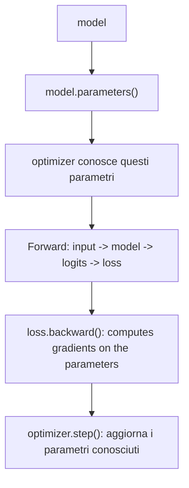

So the connection between `loss.backward()` and `optimizer.step()` is nei
model parameters:```text
loss.backward() riempie parametro.grad
optimizer.step() usa parametro.grad per modificare parametro
```

In forma molto concreta:

```text
model.token_embedding_table.weight        # weights
model.token_embedding_table.weight.grad   # gradients computed by backward
```

L'optimizer aggiorna:

```text
model.token_embedding_table.weight
```

usando:

```text
model.token_embedding_table.weight.grad
```

### Training diagram

```mermaid
flowchart TD
    A["Batch di input"]
    B["Bigram model"]
    C["Logits"]
    D["Cross entropy"]
    E["Loss"]
    F["backward()"]
    G["Gradients"]
    H["optimizer.step()"]
    I["Updated weights"]

    A --> B --> C --> D --> E --> F --> G --> H --> I

## Lesson 15 - Bigram Model Generation

### What changes and why

Let's update:```text
final_project/model.py
study/snapshots/lesson_15/model.py
```

aggiungendo un metodo:

```python
def generate(self, input_ids, max_new_tokens):
```

Poi creiamo:

```text
study/lessons/15_bigram_generation.py
```

This script briefly trains the model and then makes it generate new ones
characters.

### Explanation

Until the previous lesson the model learned, but did not produce text.

Now we want to do this:```text
initial prompt -> model -> prossimo character -> updated text
```

By repeating the process many times we get a generated sequence.

### Piece of code added to the template

```python
def generate(self, input_ids, max_new_tokens):
    generated_ids = input_ids

    for _ in range(max_new_tokens):
        logits = self(generated_ids)
        last_token_logits = logits[:, -1, :]
        probabilities = F.softmax(last_token_logits, dim=-1)
        next_token_ids = torch.multinomial(probabilities, num_samples=1)
        generated_ids = torch.cat((generated_ids, next_token_ids), dim=1)

    return generated_ids
```### Clarification: because we only take the last token

This line:```python
last_token_logits = logits[:, -1, :]
```takes the scores of the last position.

The syntax uses three indices because `logits` has three dimensions:```text
logits[batch, position, vocabulary]
```

Quindi:

```python
logits[:, -1, :]
```it reads like this:```text
:   -> prendi tutti gli esempi del batch
-1  -> prendi solo l'ultima position della sequenza
:   -> take all vocabulary scores
```

Se `logits` ha forma:

```text
batch_size x context_size x vocabulary_size
```

allora:

```python
logits[:, -1, :]
```

vuol dire:

```text
per ogni esempio del batch,
prendi l'ultima position del contesto,
and keep all vocabulary scores
```

Rappresentazione:

```text
generated_ids = [N, e, l]

the model produces:

position 0 -> punteggi per il character dopo N
position 1 -> punteggi per il character dopo e
position 2 -> punteggi per il character dopo l

to continue the text, we only care about:

position 2 -> prossimo character dopo "Nel"
```

More concrete representation with a small shape:```text
logits.shape = [2, 4, 5]

2 esempi nel batch
4 posizioni nel contesto
5 punteggi per ogni position
```

Struttura:

```text
logits =
[
  [  # esempio 0
    [5 punteggi],  # position 0
    [5 punteggi],  # position 1
    [5 punteggi],  # position 2
    [5 punteggi],  # position 3, ultima position
  ],

  [  # esempio 1
    [5 punteggi],  # position 0
    [5 punteggi],  # position 1
    [5 punteggi],  # position 2
    [5 punteggi],  # position 3, ultima position
  ],
]
```

After:

```python
last_token_logits = logits[:, -1, :]
```

otteniamo:

```text
last_token_logits =
[
  [5 punteggi],  # ultima position dell'esempio 0
  [5 punteggi],  # ultima position dell'esempio 1
]
```

The shape becomes:```text
[2, 5]
```

Meaning what:```text
batch_size x vocabulary_size
```

In our case, if we are generating only one text at a time:```text
batch_size = 1
vocabulary_size = 68
```

quindi:

```text
last_token_logits.shape = [1, 68]
```

This is exactly what we need: a list of 68 scores to choose from
the next character.

### Clarification: from logits to probabilities

The `logits` are raw scores. They are not probabilities yet.

To transform them into probabilities we use:```python
probabilities = F.softmax(last_token_logits, dim=-1)
```

The part:```python
F.softmax(...)
```applies the softmax function.

The part:```python
dim=-1
```indicates on which dimension we want to calculate the probabilities.

In our case `last_token_logits` has the form:```text
batch_size x vocabulary_size
```

For example:```text
[1, 68]
```

The last dimension is that of vocabulary, i.e. the 68 possible scores for
the next character.

So:```python
dim=-1
```

vuol dire:

```text
turns vocabulary scores into probabilities
```

Softmax takes any numbers and transforms them into values ​​that:```text
sono tutti positivi
sommano a 1
can be interpreted as probabilities
```

Esempio piccolo:

```text
last_token_logits = [[2.0, 1.0, 0.0]]
```

These are raw scores for three possible tokens:```text
token 0 -> 2.0
token 1 -> 1.0
token 2 -> 0.0
```

After softmax we might get approximately:

```text
probabilities = [[0.665, 0.245, 0.090]]
```

Ora i valori:

```text
sono positivi
sommano a 1
indicate how likely each token is
```

The token with the highest score remains the most probable, but the other tokens do not
are eliminated.

Representation:```text
logits grezzi
[2.0, 1.0, 0.0]
      │
      ▼
softmax(dim=-1)
      │
      ▼
probabilities
[0.665, 0.245, 0.090]
```

If we had more examples in the batch:```text
last_token_logits.shape = [2, 3]

[
  [2.0, 1.0, 0.0],  # esempio 0
  [0.5, 0.5, 3.0],  # esempio 1
]
````dim=-1` applies the softmax separately on each row:```text
[
  [probabilities for example 0],
  [probabilities for example 1],
]
```

Don't mix examples together. Transform only the vocabulary scores of
each example in probability.

### Clarification: why `multinomial`

This line:```python
next_token_ids = torch.multinomial(probabilities, num_samples=1)
```chooses a token randomly, but respecting the probabilities.

If the model assigns:```text
"a" -> 60%
"e" -> 30%
"z" -> 10%
```then `"a"` is more likely, but not guaranteed. This makes the generation
less rigid.

If instead we always chose the maximum with `argmax`, the model would be plus
deterministic and often more repetitive.

### Clarification: How the generated text grows

This line:```python
generated_ids = torch.cat((generated_ids, next_token_ids), dim=1)
```attaches the new token to the already generated sequence.

Representation:```text
inizio:
[N]

dopo 1 token:
[N, e]

dopo 2 token:
[N, e, l]

dopo 3 token:
[N, e, l,  ]
```

Each turn of the loop adds a token.

### Clarification: The complete loop of `generate`, line by line

The heart of generation is this cycle:```python
for _ in range(max_new_tokens):
    logits = self(generated_ids)
    last_token_logits = logits[:, -1, :]
    probabilities = F.softmax(last_token_logits, dim=-1)
    next_token_ids = torch.multinomial(probabilities, num_samples=1)
    generated_ids = torch.cat((generated_ids, next_token_ids), dim=1)
```

This loop is repeated `max_new_tokens` times.

If:```python
max_new_tokens = 300
```then the model adds 300 new tokens to the initial sequence.

The `_` variable indicates that we are not interested in using the lap number. There
all that matters is repeating the block.

#### 1. Calculate logits

```python
logits = self(generated_ids)
```

Here we call the model on the sequence generated so far.

If at the beginning we have:```text
generated_ids = [N]
```the model produces scores for the next character after `N`.

After a few rounds we could have:```text
generated_ids = [N, e, l]
```then the model produces scores for each position in the sequence:```text
position 0 -> prossimo token dopo N
position 1 -> prossimo token dopo e
position 2 -> prossimo token dopo l
```

#### 2. Prendere solo l'ultima position

```python
last_token_logits = logits[:, -1, :]
```

During generation we are interested in continuing the text from the end.

If we have:```text
[N, e, l]
```we are interested in choosing the next token after `l`, not after `N` or after `e`.

For this we only take the last position of the logits.

#### 3. Transform logits into probabilities

```python
probabilities = F.softmax(last_token_logits, dim=-1)
```

Logits are raw scores. Softmax transforms them into probabilities.

Example:```text
logits:       [2.0, 1.0, 0.0]
probabilities:  [0.665, 0.245, 0.090]
```

Now we can choose the next token using a distribution of
probability.

#### 4. Sample the next token

```python
next_token_ids = torch.multinomial(probabilities, num_samples=1)
```

This line chooses a token.

It does not necessarily choose the token with the highest probability. He chooses it in
randomly, but respecting the probabilities.

If:```text
"a" -> 70%
"e" -> 20%
"z" -> 10%
```then `"a"` will come out often, but every now and then `"e"` or `"z"` may also come out.

This makes generation less rigid.

#### 5. Attach the new token to the sequence

```python
generated_ids = torch.cat((generated_ids, next_token_ids), dim=1)
```

Here we add the new token to the sequence.

Example:```text
before:
[N, e, l]

nuovo token:
[ ]

dopo:
[N, e, l,  ]
````dim=1` means we concatenate along the token size of the sequence.

If the initial form is:```text
[1, 3]
```

Meaning what:```text
1 esempio nel batch
3 token nella sequenza
```after adding a token it becomes:```text
[1, 4]
```#### 6. Repeat

The cycle restarts using the updated sequence.

Diagram of the first laps:```mermaid
flowchart TD
    A["Giro 0: [N]"]
    B["Model chooses: e"]
    C["Sequenza: [N, e]"]
    D["Model chooses: l"]
    E["Sequenza: [N, e, l]"]
    F["Model chooses: space"]
    G["Sequenza: [N, e, l, space]"]

    A --> B --> C --> D --> E --> F --> G
```

This is the basic mechanism of autoregressive generation:```text
ogni nuovo token viene aggiunto alla sequenza,
then the updated sequence is used to generate the next token
```

### Generation diagram

```mermaid
flowchart TD
    A["Prompt iniziale"]
    B["Token iniziali"]
    C["Model"]
    D["Logits dell'ultima position"]
    E["Softmax"]
    F["Probabilities"]
    G["torch.multinomial"]
    H["Nuovo token"]
    I["Concatenazione alla sequenza"]
    J["Ripeti"]

    A --> B --> C --> D --> E --> F --> G --> H --> I --> J
    J --> C
## Lesson 16 - Bigram Model Limit

### What changes and why

Let's create:```text
study/lessons/16_bigram_limit.py
```

This lesson does not add new files to the final project. It helps to understand the
limit of the bigram model before moving to a model that actually uses the
context.

### Explanation

The bigram model receives a sequence, but each position is treated differently
independent.

In our `forward`:```python
logits = self.token_embedding_table(input_ids)
```each token is used as an index into a table.

This means that the score produced for a token depends only on that
token, not from previous tokens.

For example, if we compare:```text
Nel
sol
```these two prompts are different, but they both end with:```text
l
```

When we generate the next character, we take:```python
last_token_logits = logits[:, -1, :]
```i.e. the scores of the last position.

For bigram, the last position depends only on the last character. So:```text
Nel -> ultimo character l
sol -> ultimo character l
```produce the same final scores.

### Because this is a limitation

A true GPT should distinguish different contexts.

Example:```text
Nel
sol
```

Even though they both end with `l`, the context before the `l` is different.

A more powerful model should be able to learn that:```text
"Nel" can continuare in un certo modo
"sol" can continuare in un altro modo
```

The bigram, however, cannot do this, because it does not really combine the information
of the previous tokens.

### Lesson experiment

The script makes three comparisons:```text
Nel  -> finisce con l
sol  -> finisce con l
Nea  -> finisce con a
```

Poi controlla:

```python
torch.allclose(logits_nel, logits_sol)
```

If it returns `True`, it means the scores are equal.

In our case we expect:```text
Nel vs sol -> True
Nel vs Nea -> False
```

Why does `Nel` and `sol` end with the same character, while `Nea` ends with
a different character.

### Bigram limit diagram

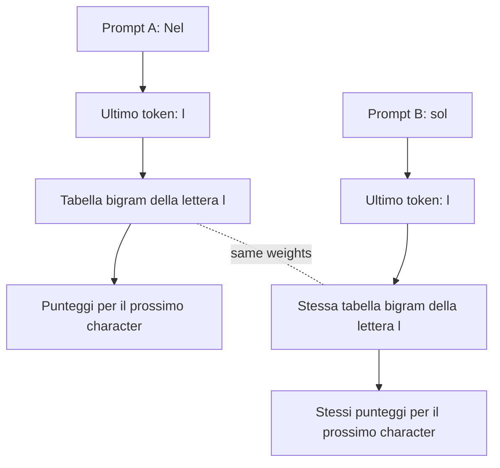

The model doesn't really see:```text
N e l
```as a sequence to interpret together. For the final forecast you only see:```text
l

## Lesson 17 - Token Embeddings

### What changes and why

Let's update:```text
final_project/model.py
study/snapshots/lesson_17/model.py
```

by adding a new class:

```python
class LanguageModel(nn.Module):
```

Poi creiamo:

```text
study/lessons/17_token_embeddings.py
```

This lesson introduces the step:```text
ID numerico del token -> vettore del token -> logits
```### Explanation

Until now the bigram model used a table like this:```python
nn.Embedding(
    num_embeddings=vocabulary_size,
    embedding_dim=vocabulary_size,
)
```

With `vocabulary_size = 68`, each token directly became one long line
68 numbers. Those 68 numbers were already the scores for the next character.

In the new model we separate two phases:```text
1. token id -> embedding vector
2. embedding vector -> logits
```

The new embedding is:```python
self.token_embedding_table = nn.Embedding(
    num_embeddings=vocabulary_size,
    embedding_dim=embedding_size,
)
```

Se:

```text
vocabulary_size = 68
embedding_size = 16
```then each token no longer becomes a list of 68 logits, but a vector of 16
numbers.

Then we use:```python
self.output_head = nn.Linear(
    in_features=embedding_size,
    out_features=vocabulary_size,
)
```to transform the vector from 16 numbers into 68 logits.

### Clarification: ID token vs embedding

An ID token is just an integer.

Example:```text
"s" -> 52
```

The model cannot understand much from the number `52` itself. It's just an index.

Embedding turns that index into a vector:```text
52 -> [-0.2206, 0.7118, 0.3416, ..., 0.3926]
```

That vector is a trainable representation of the token.

Trainable means that the numbers inside the embedding can change during
the training.

### Textual representation: before and now

Previously, in the bigram model, the table looked like this:```python
nn.Embedding(
    num_embeddings=vocabulary_size,
    embedding_dim=vocabulary_size,
)
```

With `vocabulary_size = 68`, each token immediately produced 68 values:```text
BEFORE: model bigram

token ID
  |
  v
tabella bigram
  |
  v
[68 valori]
```

Those 68 values ​​were already the logits. Each location directly corresponded to
a possible token from the vocabulary:```text
token ID 52
  |
  v
[logit per ID 0, logit per ID 1, logit per ID 2, ..., logit per ID 67]
```

Quindi, nel bigram:

```text
valore 0  -> punteggio del prossimo token con ID 0
valore 1  -> punteggio del prossimo token con ID 1
valore 2  -> punteggio del prossimo token con ID 2
...
valore 67 -> punteggio del prossimo token con ID 67
```

Now, in lesson 17, the table looks like this:```python
nn.Embedding(
    num_embeddings=vocabulary_size,
    embedding_dim=embedding_size,
)
```

With `embedding_size = 16`, each token first produces only 16 values:```text
NOW: model con token embeddings

token ID
  |
  v
token_embedding_table
  |
  v
[16 valori interni]
  |
  v
output_head
  |
  v
[68 logits]
```

The 16 values inside the embedding do not match the characters one by one
vocabulary. They are internal model numbers:```text
token ID 52
  |
  v
[embedding_0, embedding_1, embedding_2, ..., embedding_15]
```

Only after `output_head` do we return to having a score for each possible token:```text
[embedding_0, embedding_1, ..., embedding_15]
  |
  v
output_head
  |
  v
[logit per ID 0, logit per ID 1, logit per ID 2, ..., logit per ID 67]
```

Direct comparison:

| Passage | Before: bigram | Now: token embeddings |
| --- | --- | --- |
| Inputs | ID token | ID token |
| First table | produces 68 values ​​| produces 16 values ​​|
| Meaning of those values ​​| already logits in the dictionary | internal representation of the token |
| Connection with vocabulary | direct | comes later, via `output_head` |
| Form after table | `[batch_size, context_size, vocabulary_size]` | `[batch_size, context_size, embedding_size]` |
| Final form of logits | ready after the table | ready after `output_head` |

Facsimile with the token `'s'`, which in the current vocabulary has ID `52`.
The numbers below are an example with a fixed seed and a model not yet trained.
They serve to see the structure of values, not to interpret the meaning of
every single number.

Previously, in the bigram, the token ID `52` directly produced 68 logits:```text
token ID 52, that is 's'
  |
  v
bigram token_embedding_table
  |
  v
[
  -0.5037,  0.5825, -2.6750,  0.1853,
  -1.3125, -0.7756, -0.0946, -1.1716,
   ...
  -0.6592, -0.6763,  0.0772
]
```

Correct reading of the first vector:```text
-0.5037 -> logit per il prossimo token con ID 0
 0.5825 -> logit per il prossimo token con ID 1
-2.6750 -> logit per il prossimo token con ID 2
 0.1853 -> logit per il prossimo token con ID 3
...
 0.0772 -> logit per il prossimo token con ID 67
```

Now, the token ID `52` first produces 16 embedding values:```text
token ID 52, that is 's'
  |
  v
token_embedding_table
  |
  v
[
  -0.2206,  0.7118,  0.3416,  1.5886,
  -0.3489, -0.4579, -1.2322, -0.5981,
  -0.2815,  0.0528,  0.4250,  0.4826,
   0.4881,  1.0082, -0.5950,  0.3926
]
```

Correct reading of the current vector:```text
-0.2206 -> valore interno 0 dell'embedding
 0.7118 -> valore interno 1 dell'embedding
 0.3416 -> valore interno 2 dell'embedding
 1.5886 -> valore interno 3 dell'embedding
...
 0.3926 -> valore interno 15 dell'embedding
```

These 16 values are not logits. After `output_head`, they become 68 logits:

```text
embedding di 16 valori
  |
  v
output_head
  |
  v
[
   0.4328,  0.6938, -1.1515,  0.1807,
   0.3069, -0.2913, -0.7930,  0.5051,
   ...
  -0.1039,  0.4434, -0.1745
]
```

Correct reading of the final vector:

```text
 0.4328 -> logit per il prossimo token con ID 0
 0.6938 -> logit per il prossimo token con ID 1
-1.1515 -> logit per il prossimo token con ID 2
 0.1807 -> logit per il prossimo token con ID 3
...
-0.1745 -> logit per il prossimo token con ID 67
```

For this reason, when we look at the embedding values printed by the
lesson 17, we should not read them as character scores. They are values that
will be combined by the output head to produce the logits.

### Clarification: why you need an output head

The embedding has size 16:```text
embedding_size = 16
```

But to predict the next character we need to produce a score for each
possible character:```text
vocabulary_size = 68
```

Quindi serve una trasformazione:

```text
16 numbers -> 68 logits
```

This transformation is done by:```python
self.output_head = nn.Linear(16, 68)
```### In-depth analysis: what it means to transform an embedding into vocabulary scores

In the lesson code:```python
self.output_head = nn.Linear(
    in_features=embedding_size,
    out_features=vocabulary_size,
)
````nn.Linear` receives an input vector and returns a new in vector
exit. The PyTorch documentation defines `in_features` as the magnitude of
each input element and `out_features` as the size of each input element
exit. In our case:```text
in_features = embedding_size = 16
out_features = vocabulary_size = 68
```

So `output_head` receives an embedding 16 numbers long and returns 68
numbers. These 68 numbers are the logits: a score for each character of the
vocabulary.

Example of shape:```text
un embedding per un token:
[16 numbers]

dopo output_head:
[68 logits]
```

Each position of the final vector corresponds to a possible del token
vocabulary:```text
logits[0]  -> punteggio del token con ID 0
logits[1]  -> punteggio del token con ID 1
logits[2]  -> punteggio del token con ID 2
...
logits[67] -> punteggio del token con ID 67
```

These scores are not yet probabilities. They can be negative, positive,
small or large. To transform them into probabilities we need `softmax`, which we have
already seen in the generation:```python
probabilities = F.softmax(last_token_logits, dim=-1)
```

The important point is this:```text
embedding -> output_head -> logits -> softmax -> probabilities
````output_head` does not directly choose the next character. Produces only i
scores which will then be used by loss during training or by `softmax`
during the generation.

Inside `nn.Linear` there are trainable weights and trainable biases. With ours
numbers:```text
output_head.weight.shape = [68, 16]
output_head.bias.shape   = [68]
```

For each possible output token, the output head learns a row of 16
weights. Each row takes the 16 numbers of the embedding and produces a single logit.

In simplified form:```text
logit_del_token_0 = embedding * pesi_del_token_0 + bias_del_token_0
logit_del_token_1 = embedding * pesi_del_token_1 + bias_del_token_1
...
logit_del_token_67 = embedding * pesi_del_token_67 + bias_del_token_67
```

Here `embedding * weights` indicates a weighted sum: each number of the embedding is
multiplied by a weight, then the results are added and the
bias.

The same transformation is applied to all tokens in the batch. For this
the shape changes only in the last dimension:```text
before output_head:
[batch_size, context_size, embedding_size]
[4,          8,            16]

dopo output_head:
[batch_size, context_size, vocabulary_size]
[4,          8,            68]
```

The first two dimensions remain the same:```text
4 esempi nel batch
8 posizioni per ogni esempio
```

Cambia solo l'ultima dimensione:

```text
16 numbers interni del token -> 68 punteggi sul vocabulary
```

Step diagram:

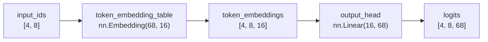

Common mistake: Thinking that `output_head` reads the vocabulary and returns
characters. This doesn't happen. `output_head` works only with numbers. The characters
they come into play later, when an ID is chosen and then converted to text with
`decode`.

Technical sources consulted for this clarification:

- [Documentazione PyTorch di `nn.Linear`](https://docs.pytorch.org/docs/2.12/generated/torch.nn.Linear.html):
  describes `in_features`, `out_features`, input/output shape, weights and biases
  trainable.
- [Documentazione PyTorch di `nn.Embedding`](https://docs.pytorch.org/docs/2.12/generated/torch.nn.Embedding.html):
  describes the embedding table and the shape of the output with respect to the shape
  of the input indices.

### Representation of shapes

Inputs:```text
input_tensor.shape = [4, 8]
```

Meaning what:```text
4 esempi nel batch
8 token per esempio
```

After the token embedding table:```text
token_embeddings.shape = [4, 8, 16]
```

Meaning what:```text
4 esempi
8 token
16 numbers per rappresentare ogni token
```

After output head:```text
logits.shape = [4, 8, 68]
```

Meaning what:```text
4 esempi
8 token
68 punteggi per il prossimo character
```

Diagram:

```mermaid
flowchart TD
    A["Token ID"]
    B["Embedding table"]
    C["Vettore di 16 numbers"]
    D["Output head"]
    E["68 logits"]

    A --> B --> C --> D --> E
```### Because this is a step forward

The direct bigram immediately jumped from:```text
token id -> 68 logits
```

Ora abbiamo uno space intermedio:

```text
token id -> embedding -> logits
```

This is closer to a true GPT because, in Transformers, tokens are first
transformed into vectors. Then those vectors are processed by attention and other
blocks.

The model for this lesson does not really use long context yet, but it
introduces the vector representation that later steps need.

### Code added to `study/snapshots/lesson_17/model.py`

```python
class LanguageModel(nn.Module):
    def __init__(self, vocabulary_size, embedding_size):
        super().__init__()

        self.token_embedding_table = nn.Embedding(
            num_embeddings=vocabulary_size,
            embedding_dim=embedding_size,
        )
        self.output_head = nn.Linear(
            in_features=embedding_size,
            out_features=vocabulary_size,
        )

    def forward(self, input_ids, target_ids=None):
        token_embeddings = self.token_embedding_table(input_ids)
        logits = self.output_head(token_embeddings)

        if target_ids is None:
            return logits

        batch_size, context_size, vocabulary_size = logits.shape

        logits_flat = logits.reshape(batch_size * context_size, vocabulary_size)
        target_ids_flat = target_ids.reshape(batch_size * context_size)

        loss = F.cross_entropy(logits_flat, target_ids_flat)

        return logits, loss

    def generate(self, input_ids, max_new_tokens):
        generated_ids = input_ids

        for _ in range(max_new_tokens):
            logits = self(generated_ids)
            last_token_logits = logits[:, -1, :]
            probabilities = F.softmax(last_token_logits, dim=-1)
            next_token_ids = torch.multinomial(probabilities, num_samples=1)
            generated_ids = torch.cat((generated_ids, next_token_ids), dim=1)

        return generated_ids
## Lesson 18 - Position Embeddings

### What changes and why

Let's update:```text
final_project/model.py
study/snapshots/lesson_18/model.py
```

by adding a new class:

```python
class LanguageModel(nn.Module):
```

Poi creiamo:

```text
study/lessons/18_position_embeddings.py
```

This lesson introduces the step:```text
token embedding + position embedding -> embedding used by the model
```### Difference from lesson 17

In lesson 17 we had:```text
token ID -> token embedding -> logits
```

The model knew which token it was reading, but it didn't have a vector yet
dedicated to the token's position in the context.

In lesson 18 we have:```text
token ID -> token embedding
position -> position embedding
token embedding + position embedding -> logits
```

So each token is represented using two pieces of information:```text
1. which token it is
2. in quale position del contesto si trova
```### Clarification: what context means

In our design, the context is a short sequence of consecutive tokens that
we give to the model as input.

That's not all the text in the FineWeb-Edu sample. It's a small window taken from the
text.

With:```python
CONTEXT_SIZE = 8
```

stiamo dicendo:

```text
each example given to the model contains 8 token di input
```

In the batch code this happens:```python
input_tokens = data[start_position:start_position + context_size]
target_tokens = data[start_position + 1:start_position + context_size + 1]
```

So, if in the text we have a sequence like this:```text
s p a r g o \n r ...
```and `context_size = 8`, the input can be:```text
input:
s p a r g o \n r
```

The target is the same window moved forward by one token:```text
target:
p a r g o \n r ...
```

The model uses the input to learn to predict the next token in each
location.

View as table:

| Location | Context available up to there | Target to predict |
| --- | --- | --- |
| 0 | `s` | `p` |
| 1 | `s p` | `a` |
| 2 | `s p a` | `r` |
| 3 | `s p a r` | `g` |
| 4 | `s p a r g` | `o` |
| 5 | `s p a r g o` | `\n` |
| 6 | `s p a r g o \n` | `r` |

In the code of lesson 18, however, we print the input as an integer tensor:```text
input_tensor.shape = [4, 8]
```

This means:```text
4 esempi nel batch
8 token di contesto per ogni esempio
```

So `context_size` is the length of the time window the model can
receive in a single example.

### Four words to distinguish well

From here on out we will often use these four names:```text
batch_size
context_size
embedding_size
vocabulary_size
```

They look similar because they are all numbers, but they measure different things.

#### `batch_size`

`batch_size` indicates how many examples we process together in a single del call
model.

In our code:```python
BATCH_SIZE = 4
```

significa:

```text
il batch contiene 4 esempi
```

Each example is a sequence of tokens. If we look at `input_tensor`, the
`batch_size` is the first dimension:```text
input_tensor.shape = [4, 8]
                      ^
                      batch_size
```

So the tensor contains 4 rows:```text
esempio 0: [token, token, token, token, token, token, token, token]
esempio 1: [token, token, token, token, token, token, token, token]
esempio 2: [token, token, token, token, token, token, token, token]
esempio 3: [token, token, token, token, token, token, token, token]
```

Common mistake: thinking that `batch_size` increases the memory of the single example.
It's not like that. Increase the number of examples worked together.

#### `context_size`

`context_size` indicates how many tokens each example contains.

In our code:```python
CONTEXT_SIZE = 8
```

significa:

```text
ogni esempio contiene 8 token consecutivi
```

If we look at `input_tensor`, the `context_size` is the second dimension:```text
input_tensor.shape = [4, 8]
                         ^
                         context_size
```

So each row has 8 tokens:```text
esempio 0:
[token 0, token 1, token 2, token 3, token 4, token 5, token 6, token 7]
```

The `context_size` is also why we create 8 positions in lesson 18:```python
positions = torch.arange(CONTEXT_SIZE)
```

Risultato:

```text
tensor([0, 1, 2, 3, 4, 5, 6, 7])
```

Common mistake: thinking that `context_size` is all the text available. It's not
like this. It's just the length of the sequence that the pattern receives in that single
example.

#### `embedding_size`

`embedding_size` indicates how many numbers we use to represent each token or each
position after the embedding table.

In our code:```python
EMBEDDING_SIZE = 16
```

significa:

```text
ogni token embedding contiene 16 numbers
ogni position embedding contiene 16 numbers
```

Esempio:

```text
token ID 52
  |
  v
token embedding lungo 16 numbers
```

After the `token_embedding_table`, the form becomes:```text
token_embeddings.shape = [4, 8, 16]
                              ^
                              embedding_size
```

This form should be read as a three-level structure:```text
[4, 8, 16]
 |  |   |
 |  |   +-- each token is represented by 16 numbers
 |  +------ ogni esempio contiene 8 token
 +--------- il batch contiene 4 esempi
```

The single 16-number vector exists, but it is not the entire tensor. It's just a
internal element of the tensor.

With:```text
token_embeddings.shape = [4, 8, 16]
```

abbiamo:

```text
4 esempi
8 token per esempio
16 numbers per token
```

So the tensor contains:```text
4 x 8 = 32 token embeddings
```

Each embedding token is long:```text
16 numbers
```

Example of reading with indexes:

| Expression | What does it take | Shape |
| --- | --- | --- |
| `token_embeddings` | the whole batch | `[4, 8, 16]` |
| `token_embeddings[0]` | first example of the batch | `[8, 16]` |
| `token_embeddings[0, 0]` | first token of the first example | `[16]` |
| `token_embeddings[0, 0, 0]` | first number of the first token vector | `[]`, i.e. a single value |

Textual representation:```text
token_embeddings[0]              -> primo esempio, forma [8, 16]
token_embeddings[0][0]           -> primo token del primo esempio, forma [16]
token_embeddings[0][0][0]        -> primo number del vettore, forma singola
```

Quindi quando diciamo:

```text
token_embeddings[0, 0] =
[0.34, -1.12, 0.08, 0.51, ..., -0.27]
```we are looking at just one of the 32 vectors inside `token_embeddings`.

The first two dimensions come from the input:```text
4 -> batch_size
8 -> context_size
```

The third dimension comes from embedding:```text
16 -> embedding_size
```

Common mistake: thinking that `embedding_size` tells how many tokens exist. It's not
like this. It tells how many internal numbers we use to represent a token.

#### `vocabulary_size`

`vocabulary_size` indicates how many different tokens exist in the vocabulary.

In our project, for now, tokens are characters. So `vocabulary_size`
is the number of different characters found in the text.

In our output:```text
vocabulary_size = 68
```

significa:

```text
the vocabulary contains 68 token possibili
```

This number serves in two important points.

First: the token embeddings table has a row for every possible token:```python
self.token_embedding_table = nn.Embedding(
    num_embeddings=vocabulary_size,
    embedding_dim=embedding_size,
)
```

With our numbers:```text
token_embedding_table.weight.shape = [68, 16]
```

Second: the final output must produce a score for every possible token:```python
self.output_head = nn.Linear(
    in_features=embedding_size,
    out_features=vocabulary_size,
)
```

This is why logits have the form:```text
logits.shape = [4, 8, 68]
                       ^
                       vocabulary_size
```

Common mistake: confusing `vocabulary_size` with `embedding_size`.```text
embedding_size = 16  -> quanti numbers rappresentano un token
vocabulary_size = 68 -> quanti token possibili possono essere previsti
```#### Compact summary

| Term | Question answered | In our case | Where do you see it |
| --- | --- | --- | --- |
| `batch_size` | How many examples together? | `4` | first dimension of `input_tensor`: `[4, 8]` |
| `context_size` | How many tokens for example? | `8` | second dimension of `input_tensor`: `[4, 8]` |
| `embedding_size` | How many numbers per internal representation? | `16` | last size of `token_embeddings`: `[4, 8, 16]` |
| `vocabulary_size` | How many possible tokens are there? | `68` | last size of logits: `[4, 8, 68]` |

Full view of shapes:```text
input_tensor:
[batch_size, context_size]
[4,          8]

token_embeddings:
[batch_size, context_size, embedding_size]
[4,          8,            16]

position_embeddings:
[context_size, embedding_size]
[8,            16]

logits:
[batch_size, context_size, vocabulary_size]
[4,          8,            68]
```

Diagram:

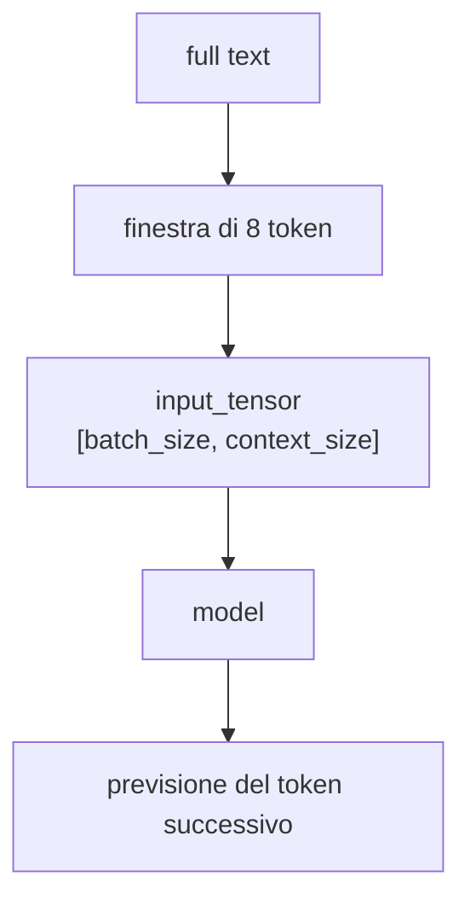

When we use causal self-attention later, the context will be even more
important: each position will be able to use the previous tokens within that window,
but not future tokens.

### Explanation

A token embedding is token dependent.

Example:```text
token ID 52 -> vettore del token 's'
```A position embedding instead depends on the position within the context.

Example with `context_size = 8`:```text
position 0 -> vettore della position 0
position 1 -> vettore della position 1
position 2 -> vettore della position 2
...
position 7 -> vettore della position 7
```

To create these location IDs we use:```python
positions = torch.arange(context_size, device=input_ids.device)
```

With `context_size = 8`, we get:```text
tensor([0, 1, 2, 3, 4, 5, 6, 7])
```

Poi usiamo una seconda tabella `nn.Embedding`:

```python
self.position_embedding_table = nn.Embedding(
    num_embeddings=context_size,
    embedding_dim=embedding_size,
)
```

This table contains a trainable vector for each position allowed by the
context.

With:```text
context_size = 8
embedding_size = 16
```the table produces:```text
position_embeddings.shape = [8, 16]
```### Clarification: They are both `nn.Embedding`, but they do not represent the same thing

In the code we have two modules of the same type:```python
self.token_embedding_table = nn.Embedding(
    num_embeddings=vocabulary_size,
    embedding_dim=embedding_size,
)

self.position_embedding_table = nn.Embedding(
    num_embeddings=context_size,
    embedding_dim=embedding_size,
)
```

They are both `nn.Embedding` because PyTorch uses `nn.Embedding` as the table
general that does this operation:```text
indice intero -> vettore allenabile
```

The difference is not in the type of PyTorch module. The difference is in the meaning
of the indexes that we pass to the table.

In the first case, the indices are token IDs:```text
input_ids:
[52, 49, 32, 50, 38, 47,  1, 50]

significato:
IDs of the characters/tokens present in the text
```

In the second case, the indices are location IDs:```text
positions:
[0, 1, 2, 3, 4, 5, 6, 7]

significato:
posizioni dentro il contesto
```

Quindi:

```text
token_embedding_table[52]
```returns the vector associated with the token with ID `52`, i.e. in our example
the `'s'` character.

Instead:```text
position_embedding_table[0]
```returns the vector associated with the `0` position, regardless of which
token is in that location.

Direct comparison:

| Appearance | Token embedding table | Position embedding table |
| --- | --- | --- |
| PyTorch type | `nn.Embedding` | `nn.Embedding` |
| What you receive | Token ID | Location IDs |
| Input Example | `52` | `0` |
| Meaning of input | token with ID 52 | position 0 in context |
| Number of rows | `vocabulary_size` | `context_size` |
| In our case | `68` lines | `8` lines |
| Size of each row | `embedding_size = 16` | `embedding_size = 16` |
| What you learn | a vector for each token | a vector for each position |
| Does it depend on the content of the text? | yes, because it uses token IDs | no, because it only uses the | position

The reason both tables produce long `16` vectors is practical:
we want to add them.```text
token embedding della position 0:
[16 numbers]

position embedding della position 0:
[16 numbers]

somma:
[16 numbers]
```

If one table produced long vectors `16` and the other produced vectors
long `12`, the element-by-element sum would not make sense in our model.

The most important difference is this:```text
token_embedding_table:
says which symbol is present

position_embedding_table:
serve a dire dove si trova quel simbolo
```

Diagram:

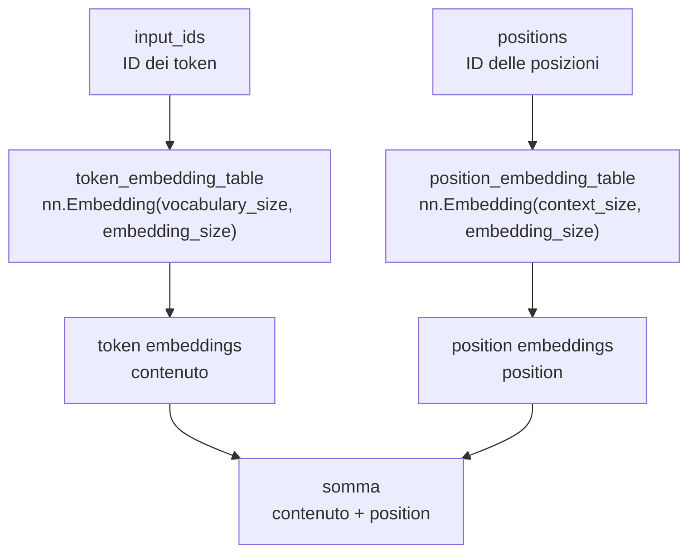

Common mistake: thinking that `nn.Embedding` always means "embedding of
words" or "character embedding". Actually `nn.Embedding` takes indices
integers and returns vectors. In our project we use the same mechanism
for two different sets of indices: tokens and positions.

### Because we can add token embeddings and position embeddings

Token embeddings have the form:```text
token_embeddings.shape = [batch_size, context_size, embedding_size]
token_embeddings.shape = [4, 8, 16]
```

I position embeddings hanno forma:

```text
position_embeddings.shape = [context_size, embedding_size]
position_embeddings.shape = [8, 16]
```

The last two dimensions are the same:```text
[4, 8, 16]
    [8, 16]
```

So PyTorch can apply the same position embeddings to all examples
of the batch. This behavior is called broadcasting: PyTorch can expand
automatically compatible tensors until they have equal shapes for a certain
operation.

The sum is:```python
embeddings = token_embeddings + position_embeddings
```and the result has the form:```text
embeddings.shape = [4, 8, 16]
```### Sample of the sum

For a single position, the addition occurs number by number.

Simplified example with vectors 4 long instead of 16:```text
token embedding:
[ 0.20, -0.10,  0.50,  0.30]

position embedding:
[ 0.70,  0.40, -0.20,  0.10]

somma:
[ 0.90,  0.30,  0.30,  0.40]
```

In our real code, the vectors are 16 long:```text
token embedding del primo token:
[-0.2206,  0.7118,  0.3416,  1.5886, ...,  0.3926]

position embedding della position 0:
[ 0.2348,  0.0886, -0.3477,  0.8491, ..., -0.0406]

sum used by the model:
[ 0.0143,  0.8004, -0.0061,  2.4377, ...,  0.3521]
```

The first position of the sum, for example, is:```text
-0.2206 + 0.2348 = 0.0142 about
```

The sum does not yet produce logits. It still produces a 16. I long embedding
logits come later:```python
logits = self.output_head(embeddings)
```

### Diagram

```mermaid
flowchart TD
    A["input_ids<br/>[4, 8]"]
    B["token_embedding_table<br/>token -> vettore"]
    C["token_embeddings<br/>[4, 8, 16]"]
    D["positions<br/>[0, 1, ..., 7]"]
    E["position_embedding_table<br/>position -> vettore"]
    F["position_embeddings<br/>[8, 16]"]
    G["somma<br/>[4, 8, 16]"]
    H["output_head<br/>Linear(16, 68)"]
    I["logits<br/>[4, 8, 68]"]

    A --> B --> C --> G
    D --> E --> F --> G
    G --> H --> I
```### Code added to `study/snapshots/lesson_18/model.py````python
class LanguageModel(nn.Module):
    def __init__(self, vocabulary_size, context_size, embedding_size):
        super().__init__()

        self.context_size = context_size
        self.token_embedding_table = nn.Embedding(
            num_embeddings=vocabulary_size,
            embedding_dim=embedding_size,
        )
        self.position_embedding_table = nn.Embedding(
            num_embeddings=context_size,
            embedding_dim=embedding_size,
        )
        self.output_head = nn.Linear(
            in_features=embedding_size,
            out_features=vocabulary_size,
        )

    def forward(self, input_ids, target_ids=None):
        current_context_size = input_ids.shape[1]

        if current_context_size > self.context_size:
            raise ValueError(
                f"Il contesto ricevuto contiene {current_context_size} token, "
                f"ma il model supporta al massimo {self.context_size} token."
            )

        positions = torch.arange(current_context_size, device=input_ids.device)

        token_embeddings = self.token_embedding_table(input_ids)
        position_embeddings = self.position_embedding_table(positions)
        embeddings = token_embeddings + position_embeddings
        logits = self.output_head(embeddings)

        if target_ids is None:
            return logits

        batch_size, context_size, vocabulary_size = logits.shape

        logits_flat = logits.reshape(batch_size * context_size, vocabulary_size)
        target_ids_flat = target_ids.reshape(batch_size * context_size)

        loss = F.cross_entropy(logits_flat, target_ids_flat)

        return logits, loss

    def generate(self, input_ids, max_new_tokens):
        generated_ids = input_ids

        for _ in range(max_new_tokens):
            input_ids_limited = generated_ids[:, -self.context_size :]
            logits = self(input_ids_limited)
            last_token_logits = logits[:, -1, :]
            probabilities = F.softmax(last_token_logits, dim=-1)
            next_token_ids = torch.multinomial(probabilities, num_samples=1)
            generated_ids = torch.cat((generated_ids, next_token_ids), dim=1)

        return generated_ids
```

### Explanation of the important lines

```python
self.position_embedding_table = nn.Embedding(
    num_embeddings=context_size,
    embedding_dim=embedding_size,
)
```

Create a table with one row for each context location. If the context is
long 8, the possible positions are from `0` to `7`.```python
positions = torch.arange(context_size, device=input_ids.device)
```

Creates position IDs of the current sequence. If the sequence has 8 tokens,
produces `0, 1, 2, 3, 4, 5, 6, 7`.```python
position_embeddings = self.position_embedding_table(positions)
```

Transform location IDs into vectors.```python
embeddings = token_embeddings + position_embeddings
```

Adds the token vector and the position vector. The result still has
size `embedding_size`, so it can fit into the same `output_head` as the
previous lesson.```python
input_ids_limited = generated_ids[:, -self.context_size :]
```

During generation, the generated text becomes increasingly longer. The model,
however, it has position embeddings only up to `context_size`. For this we only use
the last `context_size` tokens when we ask the model for the next token.

### Conclusion

We added the second type of embedding:```text
token embedding    -> which token it is
position embedding -> dove si trova nel contesto
```

The model now receives:```text
token embedding + position embedding
```

The next step will be to start making the tokens communicate with each other. To arrive
at that point we will introduce the first concept of attention.

---

## Lesson 19 - A Single Causal Self-Attention Head

### What changes and why

Let's update:```text
final_project/model.py
study/snapshots/lesson_19/model.py
```

aggiungendo due nuove classi:

```python
class SelfAttentionHead(nn.Module):
class LanguageModel(nn.Module):
```

Poi creiamo:

```text
study/lessons/19_self_attention_head.py
```

This lesson introduces the step:```text
embeddings -> self-attention causale -> logits
```### Difference from lesson 18

In lesson 18 we had:```text
token embedding + position embedding -> output_head -> logits
```

The model received a vector for each token, but each position was sent
to the output head without an explicit transformation that combined the
information from previous tokens.

In lesson 19 we have:```text
token embedding + position embedding -> self-attention causale -> output_head -> logits
```

Causal self-attention calculates, for each position, how much to use tokens
previous ones and the current token. Cannot use future tokens.

### Why this lesson is important

Until lesson 18, embeddings contained:```text
which token it is
dove si trova
```

With self-attention we begin to add:```text
quali token precedenti vengono usati per aggiornare la rappresentazione corrente
```

This is the first part really close to the heart of GPT. In nanoGPT this logic
is in `CausalSelfAttention`. Here we write it in a smaller version:
a single head, without dropout, without multi-head attention, without residual
connection and without layer normalization.

### Extra clarification: Lesson 19 step by step

Lesson 19 has two levels:```text
1. the study file `study/lessons/19_self_attention_head.py`
2. il codice riutilizzabile in `model.py`
```

The study file is used to see the shapes and print the intermediate steps.
The `model.py` file instead contains the classes that we will use in the final project.

The complete flow is this:```mermaid
flowchart TD
    A["FineWeb-Edu sample text"]
    B["create_vocabulary"]
    C["encode<br/>text -> token IDs"]
    D["create_batch<br/>input_tensor e target_tensor"]
    E["LanguageModel"]
    F["token embeddings"]
    G["position embeddings"]
    H["somma embeddings"]
    I["SelfAttentionHead"]
    J["query, key, value"]
    K["attention scores"]
    L["maschera causale"]
    M["softmax"]
    N["attended embeddings"]
    O["output_head"]
    P["logits"]
    Q["loss"]

    A --> B --> C --> D --> E
    E --> F
    E --> G
    F --> H
    G --> H
    H --> I --> J --> K --> L --> M --> N --> O --> P
    D --> Q
    P --> Q
```#### Step 1: Let's set the lesson numbers

In the study file we have:```python
CONTEXT_SIZE = 8
BATCH_SIZE = 4
EMBEDDING_SIZE = 16
HEAD_SIZE = 16
```

These numbers determine the main shapes:

| Name | Value | Effect |
| --- | ---: | --- |
| `BATCH_SIZE` | `4` | let's work on 4 examples together |
| `CONTEXT_SIZE` | `8` | each example has 8 tokens |
| `EMBEDDING_SIZE` | `16` | each token becomes a vector of 16 numbers |
| `HEAD_SIZE` | `16` | the output of the attention head also has 16 numbers per token |

In this lesson `HEAD_SIZE` is the same as `EMBEDDING_SIZE`. This keeps the
simple shapes:```text
embeddings before attention: [4, 8, 16]
embeddings dopo la attention:    [4, 8, 16]
```

Later, with more heads, we will use this idea in a more structured way.

#### Step 2: we read text, vocabulary and token IDs

These lines prepare the text:```python
text = DATASET_PATH.read_text(encoding="utf-8")

char_to_id, id_to_char = create_vocabulary(text)
vocabulary_size = len(char_to_id)

token_ids = encode(text, char_to_id)
```

The result is:```text
text                      -> long string
char_to_id             -> dizionario character -> ID
id_to_char             -> dizionario ID -> character
vocabulary_size            -> 68
numbers                     -> lista di token IDs
```

Self-attention does not yet work on readable text. Work on tensors
numeric derived from token IDs.

#### Step 3: Let's create inputs and targets

These lines create the batch:```python
input_tensor, target_tensor = create_batch(
    data=training_data,
    batch_size=BATCH_SIZE,
    context_size=CONTEXT_SIZE,
)
```

With our numbers:```text
input_tensor.shape  = [4, 8]
target_tensor.shape = [4, 8]
````input_tensor` contains the tokens given to the model.

`target_tensor` contains the correct tokens to predict. It's the same text
moved forward one token.

Observed example:```text
First example as text:
'spargo\nr'
```

The model receives those tokens as input and must learn to predict the tokens
subsequent ones.

#### Step 4: Let's create the model

This line instantiates the model from lesson 19:```python
model = LanguageModel(
    vocabulary_size=vocabulary_size,
    context_size=CONTEXT_SIZE,
    embedding_size=EMBEDDING_SIZE,
    head_size=HEAD_SIZE,
)
```

Inside the model there are these pieces:```text
token_embedding_table
position_embedding_table
attention_head
output_head
```

The internal flow of the class is:```text
input_ids
-> token embeddings
-> position embeddings
-> somma
-> self-attention
-> output_head
-> logits
```#### Step 5: We transform token IDs into token embeddings

This line:```python
token_embeddings = model.token_embedding_table(input_tensor)
```

trasforma:

```text
input_tensor.shape = [4, 8]
```

in:

```text
token_embeddings.shape = [4, 8, 16]
```

Significa:

```text
4 esempi
8 token per esempio
16 numbers per token
```#### Step 6: Let's add the position embeddings

These lines create the positions and position vectors:```python
positions = torch.arange(CONTEXT_SIZE)
position_embeddings = model.position_embedding_table(positions)
```

With `CONTEXT_SIZE = 8`:```text
positions = [0, 1, 2, 3, 4, 5, 6, 7]
```

The form is:```text
position_embeddings.shape = [8, 16]
```

Poi sommiamo:

```python
embeddings = token_embeddings + position_embeddings
```

Risultato:

```text
embeddings.shape = [4, 8, 16]
```

Now each token has a representation that contains:```text
which token it is
in quale position si trova
```#### Step 7: We create keys, queries and values

These lines enter the very first attention pass:```python
keys = model.attention_head.key(embeddings)
queries = model.attention_head.query(embeddings)
values = model.attention_head.value(embeddings)
```

Inside `SelfAttentionHead`, these three pieces are defined like this:```python
self.key = nn.Linear(embedding_size, head_size, bias=False)
self.query = nn.Linear(embedding_size, head_size, bias=False)
self.value = nn.Linear(embedding_size, head_size, bias=False)
```

Ogni layer riceve vettori lunghi `16` e produce vettori lunghi `16`.

Quindi:

```text
embeddings.shape = [4, 8, 16]
keys.shape       = [4, 8, 16]
queries.shape    = [4, 8, 16]
values.shape     = [4, 8, 16]
```

The important point is that `keys`, `queries` and `values` have the same shape,
but they do not contain the same numerical information. All three start from
same `embeddings`, but they pass through three separate linear layers:
`self.key`, `self.query` and `self.value`. Each layer has its own trainable weights.
For this reason the output maintains the same `[4, 8, 16]` structure, but the numbers
inside the tensors change.

So:```text
stessa forma        -> stessa organizzazione: 4 esempi, 8 token, 16 numbers
different transformation -> different weights, different produced numbers
```

This is necessary because in self-attention the three tensors have different roles:
`queries` and `keys` are used to calculate the attention weights, while `values`
contains the vectors that will be combined using those weights.

#### Step 8: Let's calculate attention scores

This line compares queries to keys:```python
attention_scores = queries @ keys.transpose(-2, -1)
```

Before the transpose:

```text
keys.shape = [4, 8, 16]
```

After:

```text
keys.transpose(-2, -1).shape = [4, 16, 8]
````transpose(-2, -1)` swaps the last two dimensions of the tensor with each other.

In our case:```text
keys.shape = [4, 8, 16]
              |  |  |
              |  |  +-- dimensione -1: i 16 numbers di ogni key
              |  +----- dimensione -2: gli 8 token del contesto
              +-------- dimensione 0: i 4 esempi del batch
```

The negative indices are read starting from the right:```text
dimensione -1 -> ultima dimensione     -> 16
dimensione -2 -> penultima dimensione  -> 8
```

Quindi:

```python
keys.transpose(-2, -1)
```make this exchange:```text
[4, 8, 16]
    |  |
    |  +-- diventa penultima dimensione
    +----- diventa ultima dimensione

risultato:
[4, 16, 8]
```

The first dimension, i.e. `4`, does not change. The number of examples in the batch remains.

What changes is how the last two axes are oriented:```text
before:
per ogni esempio abbiamo 8 token, ognuno con 16 numbers

dopo:
per ogni esempio abbiamo 16 righe numeriche, ognuna lunga 8 posizioni
```

This is because we want to multiply the `queries` by the `keys` and obtain
an array that compares each token to every other token.

So:```text
queries.shape                 = [4, 8, 16]
keys.transpose(-2, -1).shape  = [4, 16, 8]
attention_scores.shape        = [4, 8, 8]
```

The internal `16` disappears because it is the size used to make the product between
vectors. This leaves a `8 x 8` array for each example.

Reading `attention_scores[0]`:```text
first dimension: example 0 of the batch
righe: token che sta cercando informazione
columns: token it can take information from
```

#### Step 9: scale the scores

Immediately after that we do:

```python
attention_scores = attention_scores / (HEAD_SIZE ** 0.5)
```

In reusable code we use the same idea like this:```python
attention_scores = attention_scores / math.sqrt(keys.shape[-1])
```

Since `HEAD_SIZE = 16`:```text
HEAD_SIZE ** 0.5 = 4
```

Then we divide the scores by `4`.

This scaling is part of the scaled dot-product attention.

Scaled dot-product attention is the calculation that compares `queries` and `keys`,
reduce the score scale with `sqrt(head_size)`, apply `softmax` and use i
weights obtained for combining the `values`.

The practical reason is this: `attention_scores` contains scores which then
they pass into `softmax`. `softmax` transforms a list of scores into weights
which add up to `1`.

If the scores are very far apart, the `softmax` can become too much
unbalanced. One score takes almost all the weight and the others become almost
zero.

Example without scaling:```text
punteggi:
[1, 2, 12]

softmax about:
[0.000, 0.000, 1.000]
```

In this case the `12` value dominates almost completely. The attention line
it pretty much only uses one position.

Example with reduced scores:```text
punteggi:
[0.25, 0.50, 3.00]

softmax about:
[0.055, 0.070, 0.875]
```

The highest score remains the most important, but the others do not come
almost completely eliminated.

In our code the reduction is:```python
attention_scores = attention_scores / math.sqrt(keys.shape[-1])
````keys.shape[-1]` is the length of the key vectors. In this lesson `16` applies.
So:```text
sqrt(16) = 4
```

Dividing by `4`, the scores enter `softmax` with less extreme values.
This makes the attention weights less aggressive at the beginning and makes the computation
more stable during training.

The point to remember is:```text
queries @ keys.T        -> produce punteggi grezzi
/ sqrt(head_size)       -> riduce la scala dei punteggi
softmax                 -> turns scores into weights
```#### Step 10: We apply the causal mask

The causal mask is saved in the template:```python
self.register_buffer(
    "causal_mask",
    torch.tril(torch.ones(context_size, context_size)),
)
```

With `context_size = 8`, the mask is:```text
[
  [1, 0, 0, 0, 0, 0, 0, 0],
  [1, 1, 0, 0, 0, 0, 0, 0],
  [1, 1, 1, 0, 0, 0, 0, 0],
  [1, 1, 1, 1, 0, 0, 0, 0],
  [1, 1, 1, 1, 1, 0, 0, 0],
  [1, 1, 1, 1, 1, 1, 0, 0],
  [1, 1, 1, 1, 1, 1, 1, 0],
  [1, 1, 1, 1, 1, 1, 1, 1],
]
```

The `0` row can only use the `0` column.

The `1` row can use the `0` and `1` columns.

The `2` row can use the `0`, `1`, `2` columns.

This prevents the model from reading future tokens.

In the study file:```python
masked_attention_scores = attention_scores.masked_fill(
    causal_mask == 0,
    float("-inf"),
)
```

All future cells become `-inf`.

#### Step 11: We transform the scores into weights

Now let's apply:```python
attention_weights = F.softmax(masked_attention_scores, dim=-1)
````dim=-1` indicates the last dimension, i.e. the columns.

So each row of the `8 x 8` matrix becomes a list of weights that sum to
`1`.

Observed example:```text
riga 3:
[0.204, 0.217, 0.313, 0.266, 0.000, 0.000, 0.000, 0.000]
```

Significa:

```text
la position 3 usa le posizioni 0, 1, 2, 3
la position 3 non usa le posizioni 4, 5, 6, 7
```

The file also prints:```text
Somma di ogni riga degli attention weights:
[1, 1, 1, 1, 1, 1, 1, 1]
```

This confirms that each row is a weight distribution.

#### Step 12: Let's combine the values

Now let's do:```python
attended_embeddings = attention_weights @ values
```

The forms are:```text
attention_weights.shape = [4, 8, 8]
values.shape            = [4, 8, 16]
attended_embeddings     = [4, 8, 16]
```

The last `8` of `attention_weights` indicates which positions to use.

The second `8` of `values` indicates the available value vectors.

The result returns to a vector of `16` numbers for each token:```text
[4, 8, 16]
```

The difference from before is that these vectors have been updated using
the burdens of self-attention.

#### Step 13: We produce the logits

Inside the model, after the attention, we do:```python
logits = self.output_head(attended_embeddings)
```

The `output_head` is:```python
self.output_head = nn.Linear(
    in_features=head_size,
    out_features=vocabulary_size,
)
```

With:```text
head_size = 16
vocabulary_size = 68
```the form goes from:```text
attended_embeddings.shape = [4, 8, 16]
```

a:

```text
logits.shape = [4, 8, 68]
```

For each token in each example, the model produces 68 scores: one for each
possible vocabulary token.

#### Step 14: we calculate the loss

When we also pass `target_tensor`, the model calculates:```python
loss = F.cross_entropy(logits_flat, target_ids_flat)
```

But first it flattens:```text
logits.shape        = [4, 8, 68]
logits_flat.shape   = [32, 68]

target_tensor.shape = [4, 8]
target_flat.shape   = [32]
```

The number `32` comes from:```text
4 esempi x 8 token = 32 previsioni
```

Here each prediction corresponds to a precise position within the batch.

With:```text
batch_size   = 4
context_size = 8
```

abbiamo:

```text
esempio 0: 8 posizioni da prevedere
esempio 1: 8 posizioni da prevedere
esempio 2: 8 posizioni da prevedere
esempio 3: 8 posizioni da prevedere

totale = 4 * 8 = 32 posizioni da prevedere
```

For each of these 32 positions, the model produces a vector along `68`:```text
una position -> 68 logits
```

Each logit is a raw score for a vocabulary token.

Example of structure before flattening:```text
logits.shape = [4, 8, 68]

[
  esempio 0 [
    position 0 -> 68 logits,
    position 1 -> 68 logits,
    ...
    position 7 -> 68 logits
  ],
  esempio 1 [
    position 0 -> 68 logits,
    ...
    position 7 -> 68 logits
  ],
  ...
]
```

The `target_tensor`, however, contains only one correct number for each position:```text
target_tensor.shape = [4, 8]

[
  esempio 0 [target_0, target_1, ..., target_7],
  esempio 1 [target_0, target_1, ..., target_7],
  esempio 2 [target_0, target_1, ..., target_7],
  esempio 3 [target_0, target_1, ..., target_7]
]
```

So the real comparison is:```text
68 logits della position 0  -> target corretto della position 0
68 logits della position 1  -> target corretto della position 1
68 logits della position 2  -> target corretto della position 2
...
68 logits della position 31 -> target corretto della position 31
````F.cross_entropy` wants to receive this data in a more direct way:```text
logits_flat.shape = [32, 68]
target_flat.shape = [32]
```

The meaning is:```text
32 righe di previsione
68 punteggi per ogni riga
32 target corretti, uno per ogni riga
```

Facsimile:

```text
logits_flat
[
  riga 0 -> [68 punteggi per il prossimo token],
  riga 1 -> [68 punteggi per il prossimo token],
  riga 2 -> [68 punteggi per il prossimo token],
  ...
  riga 31 -> [68 punteggi per il prossimo token]
]

target_flat
[
  target corretto della riga 0,
  target corretto della riga 1,
  target corretto della riga 2,
  ...
  target corretto della riga 31
]
```

If on the `0` line the correct target is the token with ID `12`, then the loss
checks if, among the 68 logits of the `0` row, the score of the `12` token is
quite high compared to the other scores.

The same thing is done for all 32 rows.

By default, `F.cross_entropy` returns a single number:
the average of the error over the 32 forecasts.

So, in this lesson, loss does not measure just one token. Measure the error
average of all forecasts contained in the batch.

Important note: we pass `F.cross_entropy` the raw logits, not the
probability. The function internally calculates the transformation needed for
compare those scores with the correct target.

#### Single view of transformations

This table summarizes the entire process of lesson 19.

| Passage | Object | Shape | Operation | Why it is needed |
| --- | --- | --- | --- | --- |
| 1 | `input_tensor` | `[4, 8]` | batch of token IDs | gives the model 4 examples, each 8 tokens long |
| 2 | `target_tensor` | `[4, 8]` | input moved forward by 1 token | contains the correct answers to compare with the logits |
| 3 | `token_embeddings` | `[4, 8, 16]` | `token_embedding_table(input_tensor)` | transforms each discrete ID into a trainable vector |
| 4 | `positions` | `[8]` | `torch.arange(8)` | creates location IDs within the | context
| 5 | `position_embeddings` | `[8, 16]` | `position_embedding_table(positions)` | gives a trainable vector at each position |
| 6 | `embeddings` | `[4, 8, 16]` | `token_embeddings + position_embeddings` | combines token information and location information |
| 7 | `queries` | `[4, 8, 16]` | `query(embeddings)` | creates the vectors that will make the comparison |
| 8 | `keys` | `[4, 8, 16]` | `key(embeddings)` | creates vectors against which to compare queries |
| 9 | `values` | `[4, 8, 16]` | `value(embeddings)` | create the vectors that will be combined |
| 10 | `keys.transpose(-2, -1)` | `[4, 16, 8]` | exchange of the last two dimensions | prepare keys for multiplication with queries |
| 11 | `attention_scores` | `[4, 8, 8]` | `queries @ keys.transpose(-2, -1)` | calculate how much each position looks at every other position |
| 12 | `attention_scores` scaled | `[4, 8, 8]` | division by `sqrt(16)` | keeps scores on a more manageable scale before softmax |
| 13 | `masked_attention_scores` | `[4, 8, 8]` | `masked_fill(..., -inf)` | blocks future positions |
| 14 | `attention_weights` | `[4, 8, 8]` | `softmax(..., dim=-1)` | transforms each row into weights that sum to `1` |
| 15 | `attended_embeddings` | `[4, 8, 16]` | `attention_weights @ values` | combines the value vectors using the weights of the attention |
| 16 | `logits` | `[4, 8, 68]` | `output_head(attended_embeddings)` | produces a score for each possible token |
| 17 | `logits_flat` | `[32, 68]` | `reshape(4 * 8, 68)` | prepare logits for `cross_entropy` |
| 18 | `target_ids_flat` | `[32]` | `reshape(4 * 8)` | prepare targets for `cross_entropy` |
| 19 | `loss` | single number | `F.cross_entropy(...)` | measures the average error over the 32 forecasts |

The most important transformation to understand is this:```text
[4, 8, 16] -> [4, 8, 8] -> [4, 8, 16]
```

Significa:

```text
1. partiamo da un vettore da 16 numbers per ogni token;
2. creiamo una matrice 8 x 8 che dice quali posizioni usare;
3. usiamo quella matrice per ricostruire un nuovo vettore da 16 numbers per ogni token.
```

So self-attention doesn't change the number of tokens in the batch. Change the
contents of the vectors representing those tokens.

#### Why do we redo the steps manually in the script?

In the `study/lessons/19_self_attention_head.py` file we do manually:```python
keys = model.attention_head.key(embeddings)
queries = model.attention_head.query(embeddings)
values = model.attention_head.value(embeddings)
attention_scores = queries @ keys.transpose(-2, -1)
...
```

Poi facciamo anche:

```python
logits, loss = model(input_tensor, target_tensor)
```

This means that part of the calculation is explicitly shown in the
script, but the model redos it inside `forward`.

We do this for educational purposes:```text
study script -> shows the intermediate shapes
model.forward    -> contains the real model flow
```

Later, when the mechanism is clear, we will mainly use the e model
we will not print every intermediate tensor.

### Query, key and value

Let's start with the embeddings:```text
embeddings.shape = [4, 8, 16]
```

Ogni embedding lungo `16` viene trasformato da tre layer lineari:

```python
self.key = nn.Linear(embedding_size, head_size, bias=False)
self.query = nn.Linear(embedding_size, head_size, bias=False)
self.value = nn.Linear(embedding_size, head_size, bias=False)
```

With:```text
embedding_size = 16
head_size = 16
```

otteniamo:

```text
keys.shape    = [4, 8, 16]
queries.shape = [4, 8, 16]
values.shape  = [4, 8, 16]
```

The three tensors have the same shape, but they do not have the same role:

| Tensor | How it is used |
| --- | --- |
| `queries` | is compared to `keys` to calculate attention | scores
| `keys` | is compared with the `queries` |
| `values` | contains vectors that are combined using attention | weights

They are not three identical copies of the embeddings. There are three trainable transformations
several of the same embeddings.

### The form `[4, 8, 8]`

The first important multiplication is:```python
attention_scores = queries @ keys.transpose(-2, -1)
```

Partiamo da:

```text
queries.shape = [4, 8, 16]
keys.shape    = [4, 8, 16]
````keys.transpose(-2, -1)` swaps the last two dimensions:```text
keys.transpose(-2, -1).shape = [4, 16, 8]
```

So the multiplication is:```text
[4, 8, 16] @ [4, 16, 8] -> [4, 8, 8]
```

The first dimension, `4`, remains separate: it indicates that the same operation occurs
made for each of the 4 examples in the batch.

For a single batch example, the actual multiplication is:```text
[8, 16] @ [16, 8] -> [8, 8]
```

To see the calculation with readable numbers, we use a smaller facsimile.

`queries[0]`, with shape `[2, 3]`:

| Row | Column 0 | Column 1 | Column 2 |
| --- | ---: | ---: | ---: |
| 0 | 1 | 2 | 3 |
| 1 | 4 | 5 | 6 |

`keys_transposed[0]`, with shape `[3, 2]`:

| Row | Column 0 | Column 1 |
| --- | ---: | ---: |
| 0 | 10 | 11 |
| 1 | 20 | 21 |
| 2 | 30 | 31 |

Multiplication is:```text
[2, 3] @ [3, 2] -> [2, 2]
```

Each cell of the result comes from a row of the first matrix and a column
of the second matrix:

| Result cell | Calculation | Value |
| --- | --- | ---: |
| row 0, column 0 | `1*10 + 2*20 + 3*30` | 140 |
| row 0, column 1 | `1*11 + 2*21 + 3*31` | 146 |
| row 1, column 0 | `4*10 + 5*20 + 6*30` | 320 |
| row 1, column 1 | `4*11 + 5*21 + 6*31` | 335 |

So the final matrix is:```text
[
  [140, 146],
  [320, 335]
]
```

The first number, `140`, comes from the `0` row of `queries[0]` multiplied by
the `0` column of `keys_transposed[0]`:```text
[1, 2, 3] · [10, 20, 30] = 1*10 + 2*20 + 3*30 = 140
```

In the real case of the lesson, the same rule uses long vectors `16`:```text
una riga di queries[0] lunga 16
@
una colonna di keys_transposed[0] lunga 16
=
un singolo number dentro attention_scores[0]
```

Repeating this comparison for all 8 lines of `queries[0]` and all 8
columns of `keys_transposed[0]`, we get:```text
attention_scores[0].shape = [8, 8]
```

This new shape reads like this:```text
[4, 8, 8]
 |  |  |
 |  |  +-- 8 posizioni confrontate
 |  +----- 8 posizioni che fanno il confronto
 +-------- 4 esempi nel batch
```

For each example in the batch, we have a `8 x 8` array.```text
attention_scores[0].shape = [8, 8]
```

Riga e colonna hanno significati diversi:

```text
riga    -> position che sta producendo il nuovo embedding
column -> position that can be used as information
```

With `context_size = 8`, the array has this structure:```text
          colonna:  0  1  2  3  4  5  6  7
riga 0             x  x  x  x  x  x  x  x
riga 1             x  x  x  x  x  x  x  x
riga 2             x  x  x  x  x  x  x  x
riga 3             x  x  x  x  x  x  x  x
riga 4             x  x  x  x  x  x  x  x
riga 5             x  x  x  x  x  x  x  x
riga 6             x  x  x  x  x  x  x  x
riga 7             x  x  x  x  x  x  x  x
```

Before the mask, each position has a score towards every other position.

### Why the causal mask is needed

In training, the target is the next token. If the location `2` could use
the `3` position, would be using a future token. This is not good for a
autoregressive generative model.

This is why we create:```python
torch.tril(torch.ones(context_size, context_size))
```

With `context_size = 8`, the mask is:```text
[
  [1, 0, 0, 0, 0, 0, 0, 0],
  [1, 1, 0, 0, 0, 0, 0, 0],
  [1, 1, 1, 0, 0, 0, 0, 0],
  [1, 1, 1, 1, 0, 0, 0, 0],
  [1, 1, 1, 1, 1, 0, 0, 0],
  [1, 1, 1, 1, 1, 1, 0, 0],
  [1, 1, 1, 1, 1, 1, 1, 0],
  [1, 1, 1, 1, 1, 1, 1, 1],
]
```

Cells with `1` are allowed. Cells with `0` are future positions from
block.

In the code:```python
attention_scores = attention_scores.masked_fill(
    causal_mask == 0,
    float("-inf"),
)
```let's put `-inf` in the banned scores. After `softmax`, those positions
they become `0` probabilities.

### From scores to weights

After the mask we apply:```python
attention_weights = F.softmax(attention_scores, dim=-1)
````dim=-1` means: apply `softmax` on the last dimension. In our case
the last dimension are the columns of the `8 x 8` matrix.

So each row becomes a probability distribution:```text
somma della riga = 1
```

Esempio osservato:

```text
attention_weights[0][3] =
[0.204, 0.217, 0.313, 0.266, 0.000, 0.000, 0.000, 0.000]
```

The `3` row can only use the `0`, `1`, `2`, `3` columns. The future columns
`4`, `5`, `6`, `7` are worth `0`.

### From weights to new embeddings

The final multiplication of self-attention is:```python
attended_embeddings = attention_weights @ values
```

The forms are:```text
attention_weights.shape = [4, 8, 8]
values.shape            = [4, 8, 16]

[4, 8, 8] @ [4, 8, 16] -> [4, 8, 16]
```

The final form returns to:```text
attended_embeddings.shape = [4, 8, 16]
```

The final number `16` remains `head_size`. In this lesson `head_size` is the same
to `embedding_size`, so the final form is still `[4, 8, 16]`.

In general it doesn't always have to be this way. `head_size` may be different from
`embedding_size`.

In this lesson we chose:```text
embedding_size = 16
head_size      = 16
```to make the first example simpler: the head receives long vectors `16` e
returns long vectors `16`.

However, we could choose:```text
embedding_size = 16
head_size      = 8
```

In that case the shapes would become:```text
embeddings.shape          = [4, 8, 16]
queries.shape             = [4, 8, 8]
keys.shape                = [4, 8, 8]
values.shape              = [4, 8, 8]
attention_weights.shape   = [4, 8, 8]
attended_embeddings.shape = [4, 8, 8]
```

The final part would be `8` because the head output uses `head_size`, not
automatically `embedding_size`.

With `head_size = 8`, `output_head` should also receive long vectors `8`:```python
self.output_head = nn.Linear(
    in_features=head_size,
    out_features=vocabulary_size,
)
```

So the final step would be:```text
[4, 8, 8] -> output_head -> [4, 8, 68]
```

This passage means:```text
4  esempi nel batch
8  posizioni per ogni esempio
8  numbers interni per ogni position
````output_head` does not change the first two dimensions. Work on the last one
size. For each position it takes the long vector `8` and transforms it into a
long vector `68`.

The PyTorch documentation describes `nn.Linear` like this: Input has shape
`[..., in_features]` and the output is of the form `[..., out_features]`. The dimensions
before the last one they remain the same.

In our hypothetical case:```text
in_features  = head_size = 8
out_features = vocabulary_size = 68
```

Quindi:

```text
[4, 8, 8]
     |
     +-- this last dimension goes into output_head

output_head: Linear(8 -> 68)

[4, 8, 68]
      |
      +-- this last dimension contains vocabulary logits
```

Internamente `output_head` avrebbe:

```text
output_head.weight.shape = [68, 8]
output_head.bias.shape   = [68]
```

For each position, the long vector `8` is compared to 68 rows of weights.
Each row produces a logit:```text
vettore_interno = [8 numbers]

logit_token_0  = somma pesata degli 8 numbers + bias_0
logit_token_1  = somma pesata degli 8 numbers + bias_1
logit_token_2  = somma pesata degli 8 numbers + bias_2
...
logit_token_67 = somma pesata degli 8 numbers + bias_67
```

Alla fine otteniamo:

```text
[68 logits]
```for each position in the batch.

These `68` values ​​are not yet probabilities and are not yet characters.
They are raw scores. During training they are used by `cross_entropy`.
During generation they are first transformed with `softmax`.

In the full Transformer we will use more heads. In that case each head will produce one
smallest part of the internal representation. Those parts will come
concatenate to return to the overall size of the model.

This concatenation does not yet produce the logits on the dictionary. Produces one
new internal representation. Only a final `output_head` transforms the
internal representation in `vocabulary_size` logits.

Future example:```text
embedding_size = 16
num_heads      = 4
head_size      = 4

4 head * 4 numbers = 16 numbers finali
```

The future flow will therefore be:```text
head 0 -> [4, 8, 4]
head 1 -> [4, 8, 4]
head 2 -> [4, 8, 4]
head 3 -> [4, 8, 4]

concatenazione -> [4, 8, 16]

output_head: Linear(16 -> 68)

logits -> [4, 8, 68]
```

So:

- in a single head, `head_size` can be equal to or different from
  `embedding_size`;
- in lesson 19 we keep them the same for simplicity;
- with multi-head attention, we will use multiple smaller heads that come together
  to the size of the model;
- later, when we introduce residual connections, we will have to do
  be careful to get the output back to the right size, because a sum between
  tensors requires compatible shapes.

### Diagram

```mermaid
flowchart TD
    A["embeddings<br/>[4, 8, 16]"]
    B["query linear<br/>[4, 8, 16]"]
    C["key linear<br/>[4, 8, 16]"]
    D["value linear<br/>[4, 8, 16]"]
    E["queries @ keys.T<br/>attention_scores [4, 8, 8]"]
    F["maschera causale<br/>blocca token futuri"]
    G["softmax<br/>attention_weights [4, 8, 8]"]
    H["attention_weights @ values<br/>attended_embeddings [4, 8, 16]"]
    I["output_head<br/>logits [4, 8, 68]"]

    A --> B --> E
    A --> C --> E
    A --> D --> H
    E --> F --> G --> H --> I
```### Code added to `model.py`

At the top of the file we also add:```python
import math
```

```python
class SelfAttentionHead(nn.Module):
    def __init__(self, embedding_size, head_size, context_size):
        super().__init__()

        self.key = nn.Linear(embedding_size, head_size, bias=False)
        self.query = nn.Linear(embedding_size, head_size, bias=False)
        self.value = nn.Linear(embedding_size, head_size, bias=False)
        self.register_buffer(
            "causal_mask",
            torch.tril(torch.ones(context_size, context_size)),
        )

    def forward(self, embeddings):
        current_context_size = embeddings.shape[1]

        keys = self.key(embeddings)
        queries = self.query(embeddings)
        values = self.value(embeddings)

        attention_scores = queries @ keys.transpose(-2, -1)
        attention_scores = attention_scores / math.sqrt(keys.shape[-1])

        causal_mask = self.causal_mask[:current_context_size, :current_context_size]
        attention_scores = attention_scores.masked_fill(
            causal_mask == 0,
            float("-inf"),
        )

        attention_weights = F.softmax(attention_scores, dim=-1)
        attended_embeddings = attention_weights @ values

        return attended_embeddings, attention_weights
```

```python
class LanguageModel(nn.Module):
    def __init__(self, vocabulary_size, context_size, embedding_size, head_size):
        super().__init__()

        self.context_size = context_size
        self.token_embedding_table = nn.Embedding(
            num_embeddings=vocabulary_size,
            embedding_dim=embedding_size,
        )
        self.position_embedding_table = nn.Embedding(
            num_embeddings=context_size,
            embedding_dim=embedding_size,
        )
        self.attention_head = SelfAttentionHead(
            embedding_size=embedding_size,
            head_size=head_size,
            context_size=context_size,
        )
        self.output_head = nn.Linear(
            in_features=head_size,
            out_features=vocabulary_size,
        )

    def forward(self, input_ids, target_ids=None):
        current_context_size = input_ids.shape[1]

        if current_context_size > self.context_size:
            raise ValueError(
                f"Il contesto ricevuto contiene {current_context_size} token, "
                f"ma il model supporta al massimo {self.context_size} token."
            )

        positions = torch.arange(current_context_size, device=input_ids.device)

        token_embeddings = self.token_embedding_table(input_ids)
        position_embeddings = self.position_embedding_table(positions)
        embeddings = token_embeddings + position_embeddings
        attended_embeddings, _ = self.attention_head(embeddings)
        logits = self.output_head(attended_embeddings)

        if target_ids is None:
            return logits

        batch_size, context_size, vocabulary_size = logits.shape

        logits_flat = logits.reshape(batch_size * context_size, vocabulary_size)
        target_ids_flat = target_ids.reshape(batch_size * context_size)

        loss = F.cross_entropy(logits_flat, target_ids_flat)

        return logits, loss

    def generate(self, input_ids, max_new_tokens):
        generated_ids = input_ids

        for _ in range(max_new_tokens):
            input_ids_limited = generated_ids[:, -self.context_size :]
            logits = self(input_ids_limited)
            last_token_logits = logits[:, -1, :]
            probabilities = F.softmax(last_token_logits, dim=-1)
            next_token_ids = torch.multinomial(probabilities, num_samples=1)
            generated_ids = torch.cat((generated_ids, next_token_ids), dim=1)

        return generated_ids
```

### Explanation of the important lines

```python
self.register_buffer(
    "causal_mask",
    torch.tril(torch.ones(context_size, context_size)),
)
```

Record the causal mask inside the form. `register_buffer` saves her together
to the model, but does not treat it as a trainable parameter.```python
attention_scores = queries @ keys.transpose(-2, -1)
```

Compare each query with all keys from the same example. Produces a matrix
`context_size x context_size` for each example in the batch.```python
attention_scores = attention_scores / math.sqrt(keys.shape[-1])
```

Divides the scores by the root of the key size. This is the
scaling used in scaled dot-product attention.```python
attention_scores = attention_scores.masked_fill(
    causal_mask == 0,
    float("-inf"),
)
```

Lock in future positions.```python
attention_weights = F.softmax(attention_scores, dim=-1)
```

It turns scores into weights. Each row sums to `1`.

```python
attended_embeddings = attention_weights @ values
```

Combine the value vectors using the weights calculated by attention.

### Conclusion

We have added the first mechanism that makes tokens interact with each other:```text
self-attention causale
```

The model now follows this flow:```text
token IDs
-> token embeddings + position embeddings
-> query, key, value
-> attention scores
-> causal mask
-> attention weights
-> attended embeddings
-> logits
```

The next step will be to move from a single head to multiple heads in parallel.

## Lesson 20 - Multi-Head Attention

### Objective

In this lesson we go from a single self-attention head to multiple heads in
parallel.

Lesson 19 used:```text
1 head
head_size = 16
output della attention = [4, 8, 16]
```

Lesson 20 uses:```text
4 head
head_size = 4
output di ogni head = [4, 8, 4]
concatenazione = [4, 8, 16]
```

The final form before `output_head` remains `[4, 8, 16]`, but now those 16
numbers come from 4 different heads.

### What changes compared to lesson 19

In lesson 19 we had this sequence:```text
embeddings [4, 8, 16]
-> una SelfAttentionHead
-> attended_embeddings [4, 8, 16]
-> output_head
-> logits [4, 8, 68]
```

In lesson 20 we have this sequence:```text
embeddings [4, 8, 16]
-> head 0 [4, 8, 4]
-> head 1 [4, 8, 4]
-> head 2 [4, 8, 4]
-> head 3 [4, 8, 4]
-> concatenazione [4, 8, 16]
-> output_head
-> logits [4, 8, 68]
```

The main difference is that we no longer ask just one head to produce
the whole representation. Let's divide the work into several small heads and then
Let's put the results together.

### Files modified or created

Files modified:```text
LearnGPT/final_project/model.py
LearnGPT/course_it.md
```

File creati:

```text
LearnGPT/study/snapshots/lesson_20/
LearnGPT/study/lessons/20_multi_head_attention.py
```

The lesson script imports from the snapshot:```python
from study.snapshots.lesson_20.model import LanguageModel
```

This keeps lesson 20 stable even when `final_project` changes
in subsequent lessons.

### New lesson values

We use these values:```python
CONTEXT_SIZE = 8
BATCH_SIZE = 4
EMBEDDING_SIZE = 16
NUM_HEADS = 4
HEAD_SIZE = EMBEDDING_SIZE // NUM_HEADS
```

The calculation of `HEAD_SIZE` is:```text
16 // 4 = 4
```

So each head produces 4 numbers for each token.

The important relationship is:```text
NUM_HEADS * HEAD_SIZE = EMBEDDING_SIZE
4 * 4 = 16
```

In this educational version we impose this relationship to obtain:```text
4 head da 4 numbers = 16 numbers finali
```### New piece 1: `MultiHeadAttention`

In the `final_project/model.py` file we add this class:```python
class MultiHeadAttention(nn.Module):
    def __init__(self, embedding_size, head_size, context_size, num_heads):
        super().__init__()

        self.heads = nn.ModuleList(
            [
                SelfAttentionHead(
                    embedding_size=embedding_size,
                    head_size=head_size,
                    context_size=context_size,
                )
                for _ in range(num_heads)
            ]
        )

    def forward(self, embeddings):
        attended_outputs = []
        attention_weights_by_head = []

        for head in self.heads:
            attended_embeddings, attention_weights = head(embeddings)
            attended_outputs.append(attended_embeddings)
            attention_weights_by_head.append(attention_weights)

        concatenated_embeddings = torch.cat(attended_outputs, dim=-1)

        return concatenated_embeddings, attention_weights_by_head
```

The line:```python
self.heads = nn.ModuleList([...])
```create a list of PyTorch modules.

We use `nn.ModuleList` instead of a normal Python list because PyTorch has to
register the heads as parts of the model. If a head is registered, its
weights are included in the model parameters and can be trained.

The part:```python
for _ in range(num_heads)
```create as many heads as we ask for with `num_heads`.

With:```text
num_heads = 4
```

otteniamo:

```text
head 0
head 1
head 2
head 3
```

Each head receives the same `embeddings`:```text
embeddings.shape = [4, 8, 16]
```

Ogni head produce:

```text
head_output.shape = [4, 8, 4]
```

Why:```text
head_size = 4
```### Because each head produces different numbers

The heads have the same structure, but do not share the same objects
`nn.Linear`.

Each `SelfAttentionHead` contains:```python
self.key = nn.Linear(embedding_size, head_size, bias=False)
self.query = nn.Linear(embedding_size, head_size, bias=False)
self.value = nn.Linear(embedding_size, head_size, bias=False)
```

When we create 4 heads, we create 4 separate groups of weights:```text
head 0 -> key/query/value propri
head 1 -> key/query/value propri
head 2 -> key/query/value propri
head 3 -> key/query/value propri
```

This is why heads can produce different results even if they receive it
same input.

### New piece 2: `torch.cat(..., dim=-1)`

After calculating the outputs of the 4 heads, we do:```python
concatenated_embeddings = torch.cat(attended_outputs, dim=-1)
````torch.cat` concatenates multiple tensors along a chosen dimension.

Here we use:```text
dim = -1
```

`-1` significa ultima dimensione.

Nel nostro caso:

```text
head 0 -> [4, 8, 4]
head 1 -> [4, 8, 4]
head 2 -> [4, 8, 4]
head 3 -> [4, 8, 4]
```

The first two dimensions are the same:```text
4 esempi nel batch
8 posizioni per ogni esempio
```

Only the last dimension changes, which is concatenated:```text
4 + 4 + 4 + 4 = 16
```

Quindi:

```text
torch.cat(..., dim=-1)

[4, 8, 4]
[4, 8, 4]
[4, 8, 4]
[4, 8, 4]

-> [4, 8, 16]
```

Sample on a single token:```text
head 0 -> [0.1, 0.2, 0.3, 0.4]
head 1 -> [1.1, 1.2, 1.3, 1.4]
head 2 -> [2.1, 2.2, 2.3, 2.4]
head 3 -> [3.1, 3.2, 3.3, 3.4]

concatenazione ->
[0.1, 0.2, 0.3, 0.4, 1.1, 1.2, 1.3, 1.4, 2.1, 2.2, 2.3, 2.4, 3.1, 3.2, 3.3, 3.4]
```

The result has 16 numbers.

### New piece 3: model with multi-head attention

In the `model.py` file we also add:```python
class LanguageModel(nn.Module):
    def __init__(
        self,
        vocabulary_size,
        context_size,
        embedding_size,
        head_size,
        num_heads,
    ):
        super().__init__()

        if num_heads * head_size != embedding_size:
            raise ValueError(
                "In this didactic version, num_heads * head_size deve "
                "essere uguale a embedding_size."
            )

        self.context_size = context_size
        self.token_embedding_table = nn.Embedding(
            num_embeddings=vocabulary_size,
            embedding_dim=embedding_size,
        )
        self.position_embedding_table = nn.Embedding(
            num_embeddings=context_size,
            embedding_dim=embedding_size,
        )
        self.multi_head_attention = MultiHeadAttention(
            embedding_size=embedding_size,
            head_size=head_size,
            context_size=context_size,
            num_heads=num_heads,
        )
        self.output_head = nn.Linear(
            in_features=embedding_size,
            out_features=vocabulary_size,
        )
```

The control:```python
if num_heads * head_size != embedding_size:
```serves to avoid ambiguous configurations in this phase of the course.

For lesson 20 we want:```text
4 * 4 = 16
```so the head concatenation returns to `embedding_size`.

### Multi-head model forward

The new `forward` does these steps:```python
positions = torch.arange(current_context_size, device=input_ids.device)

token_embeddings = self.token_embedding_table(input_ids)
position_embeddings = self.position_embedding_table(positions)
embeddings = token_embeddings + position_embeddings
multi_head_embeddings, _ = self.multi_head_attention(embeddings)
logits = self.output_head(multi_head_embeddings)
```

The forms are:```text
input_ids              = [4, 8]
token_embeddings       = [4, 8, 16]
position_embeddings    = [8, 16]
embeddings             = [4, 8, 16]
multi_head_embeddings  = [4, 8, 16]
logits                 = [4, 8, 68]
```

The form of `multi_head_embeddings` is still `[4, 8, 16]`, but the content is
different from lesson 19.

In lesson 19:```text
[4, 8, 16] = output di una sola head
```

In lesson 20:```text
[4, 8, 16] = concatenazione di 4 head da 4 numbers
```### Lesson 20 diagram```mermaid
flowchart TD
    A["input_tensor<br/>[4, 8]"]
    B["token embeddings + position embeddings<br/>[4, 8, 16]"]

    C0["head 0<br/>[4, 8, 4]"]
    C1["head 1<br/>[4, 8, 4]"]
    C2["head 2<br/>[4, 8, 4]"]
    C3["head 3<br/>[4, 8, 4]"]

    D["torch.cat(..., dim=-1)<br/>[4, 8, 16]"]
    E["output_head<br/>Linear(16 -> 68)"]
    F["logits<br/>[4, 8, 68]"]
    G["loss<br/>confronto con target_tensor [4, 8]"]

    A --> B
    B --> C0 --> D
    B --> C1 --> D
    B --> C2 --> D
    B --> C3 --> D
    D --> E --> F --> G

Code:```python
"""
Changes compared with the previous file:
- This lesson script uses the English project layout and imports lesson-specific
  snapshot code.
- It belongs to lesson 20 of the guided LearnGPT path.

File purpose:
- Run the lesson example in a reproducible way.
- Print the relevant intermediate values, tensor shapes, losses, or generated
  text for inspection.
"""

from pathlib import Path
import random
import sys

import torch


PROJECT_DIR = Path(__file__).resolve().parents[2]
DATASET_PATH = PROJECT_DIR / "data" / "raw" / "fineweb_edu_sample.txt"

sys.path.append(str(PROJECT_DIR))

from study.snapshots.lesson_20.batching import create_batch
from study.snapshots.lesson_20.model import LanguageModel
from study.snapshots.lesson_20.tokenizer import create_vocabulary, decode, encode


CONTEXT_SIZE = 8
BATCH_SIZE = 4
EMBEDDING_SIZE = 16
NUM_HEADS = 4
HEAD_SIZE = EMBEDDING_SIZE // NUM_HEADS


def main():
    random.seed(42)
    torch.manual_seed(42)
    torch.set_printoptions(precision=3, sci_mode=False)

    text = DATASET_PATH.read_text(encoding="utf-8")

    char_to_id, id_to_char = create_vocabulary(text)
    vocabulary_size = len(char_to_id)

    token_ids = encode(text, char_to_id)

    split_index = int(len(token_ids) * 0.9)
    training_data = token_ids[:split_index]

    input_tensor, target_tensor = create_batch(
        data=training_data,
        batch_size=BATCH_SIZE,
        context_size=CONTEXT_SIZE,
    )

    model = LanguageModel(
        vocabulary_size=vocabulary_size,
        context_size=CONTEXT_SIZE,
        embedding_size=EMBEDDING_SIZE,
        head_size=HEAD_SIZE,
        num_heads=NUM_HEADS,
    )

    positions = torch.arange(CONTEXT_SIZE)
    token_embeddings = model.token_embedding_table(input_tensor)
    position_embeddings = model.position_embedding_table(positions)
    embeddings = token_embeddings + position_embeddings

    head_outputs = []
    attention_weights_by_head = []

    for head in model.multi_head_attention.heads:
        head_output, attention_weights = head(embeddings)
        head_outputs.append(head_output)
        attention_weights_by_head.append(attention_weights)

    multi_head_embeddings, _ = model.multi_head_attention(embeddings)
    logits, loss = model(input_tensor, target_tensor)

    print("Input form:")
    print(input_tensor.shape)
    print()

    print("First example as text:")
    print(repr(decode(input_tensor[0].tolist(), id_to_char)))
    print()

    print("Number of heads:")
    print(NUM_HEADS)
    print()

    print("Head size:")
    print(HEAD_SIZE)
    print()

    print("Form embeddings before multi-head attention:")
    print(embeddings.shape)
    print()

    print("Output form of each head:")
    for index, head_output in enumerate(head_outputs):
        print(f"head {index}: {head_output.shape}")
    print()

    print("Form attention weights of each head:")
    for index, attention_weights in enumerate(attention_weights_by_head):
        print(f"head {index}: {attention_weights.shape}")
    print()

    print("Attention weights of head 0, first example:")
    print(attention_weights_by_head[0][0])
    print()

    print("Sum of each attention-weight row for head 0:")
    print(attention_weights_by_head[0][0].sum(dim=-1))
    print()

    print("Form after head concatenation:")
    print(multi_head_embeddings.shape)
    print()

    print("Logits form:")
    print(logits.shape)
    print()

    print("Initial loss:")
    print(loss.item())


if __name__ == "__main__":
    main()
```
### Common errors

Mistake 1: Thinking that `num_heads = 4` adds a final new dimension to the
model.

In this version we don't get:```text
[4, 8, 4, 4]
```because we are not using a separate size for the heads in the final output.
We are concatenating along the last dimension.

The result is:```text
[4, 8, 16]
```

Mistake 2: Thinking that each head sees a different piece of the input.

In this code each head receives the same starting `embeddings`:```text
embeddings.shape = [4, 8, 16]
```

The difference between the heads arises from the different weights inside `key`, `query` and
`value`.

Mistake 3: thinking that concatenation directly produces words or characters.

Concatenation still produces internal numbers:```text
multi_head_embeddings.shape = [4, 8, 16]
```

Only after `output_head` do we get:

```text
logits.shape = [4, 8, 68]
```### Technical sources consulted

- `nanoGPT/model.py` in local repo: Use causal self-attention with more
  head and maintains the architectural direction we want to follow.
- [Attention Is All You Need](https://arxiv.org/abs/1706.03762):
  introduces multi-head attention as multiple attention functions run in
  parallel and then combined.
- [PyTorch `nn.ModuleList`](https://docs.pytorch.org/docs/2.12/generated/torch.nn.ModuleList.html):
  supports the use of a list of modules registered by PyTorch.
- [PyTorch `torch.cat`](https://docs.pytorch.org/docs/2.12/generated/torch.cat.html):
  supports concatenation of tensors along a chosen dimension.
- [PyTorch `nn.Linear`](https://docs.pytorch.org/docs/2.12/generated/torch.nn.Linear.html):
  supports the final step `Linear(16 -> 68)` used by `output_head`.

### Conclusion

Now the model no longer uses a single attention head. Use multiple heads in parallel:```text
embeddings
-> 4 head di self-attention
-> concatenazione
-> output_head
-> logits
```

The next step will be to add a final projection inside the multi-head
attention. This will prepare us for the residual connections of the blocks
Transformers.

## Lesson 21 - Final Projection of Multi-Head Attention

### Objective

In this lesson we add a linear transformation after concatenation
of the heads.

The new piece is called:```python
output_projection
```

Its task is to transform the representation produced by the multi-head
attention before it gets to `output_head`.

This is the main distinction:

| Component | Where is | Transformation | Purpose |
| --- | --- | --- | --- |
| `output_projection` | inside `MultiHeadAttention` | `16 -> 16` | transforms the internal representation after concatenation |
| `output_head` | in the language model | `16 -> 68` | transforms the internal representation into logits on the vocabulary |

So:```text
output_projection != output_head
```### Why we do it

In this lesson, the concatenation of the heads already produces the right shape:```text
concatenazione -> [4, 8, 16]
```

So from a shape-only perspective, we might as well send this
tensor directly to `output_head`, as in lesson 20:```text
[4, 8, 16] -> output_head -> [4, 8, 68]
```

The code would work.

However, multi-head attention must not be limited to placing side by side the results of the tests
head. It must also produce a new internal representation, always long
`embedding_size`.

After concatenation we have:```text
[head 0 | head 1 | head 2 | head 3]
```

This representation contains the results of the heads in the same last
size, but hasn't yet made a coachable pass that everyone uses together
i `16` concatenated values.

`output_projection` is used precisely for this:```text
16 valori concatenati dalle head
-> Linear(16 -> 16)
-> 16 nuovi valori interni
```

Each output value can depend on all 16 input values. So the
projection allows the model to combine information produced by head
several before moving on to the rest of the model.

The most important reason is that, in the complete Transformer, after the multi-head
attention we will not immediately go to the prediction of the next token. We'll have to first
use residual connections, LayerNorm and MLP.

For this reason attention must return an internal representation:```text
input della attention  -> [4, 8, 16]
output della attention -> [4, 8, 16]
```

This same form will serve us in the next lesson, because the residual
connection will make a sum between attention input and attention output:```text
[4, 8, 16] + [4, 8, 16]
```

If instead we entrusted the entire final transformation to `output_head`, we would exit
from the internal space of the model and we would immediately move to the vocabulary space:```text
[4, 8, 16] -> output_head -> [4, 8, 68]
```

That's useful for calculating logits, losses, and generation, but that's not the way it is
needed inside a Transformer block.

So `output_projection` serves to:

- transform the concatenated values of the heads;
- allow each final value to use information from all
  head;
- keep the representation in the internal dimension `embedding_size`;
- prepare the attention output for the future residual connection;
- follow more closely the structure used in nanoGPT, where the causal
  self-attention has an output projection before returning the result.

### What changes compared to lesson 20

In lesson 20 the flow was:```text
head 0 -> [4, 8, 4]
head 1 -> [4, 8, 4]
head 2 -> [4, 8, 4]
head 3 -> [4, 8, 4]

concatenazione -> [4, 8, 16]

output_head -> [4, 8, 68]
```

In lesson 21 it becomes:```text
head 0 -> [4, 8, 4]
head 1 -> [4, 8, 4]
head 2 -> [4, 8, 4]
head 3 -> [4, 8, 4]

concatenazione -> [4, 8, 16]

output_projection -> [4, 8, 16]

output_head -> [4, 8, 68]
```

The shape after `output_projection` remains `[4, 8, 16]`.

The shape remains the same, but the values change because `output_projection` has weights
trainable.

### Files modified or created

Files modified:```text
LearnGPT/final_project/model.py
LearnGPT/course_it.md
LearnGPT/course_en.md
LearnGPT/study/snapshots/README.md
```

File creati:

```text
LearnGPT/study/snapshots/lesson_21/
LearnGPT/study/lessons/21_attention_projection.py
```### New piece in the model

In the `model.py` file, inside `MultiHeadAttention`, we add:```python
self.output_projection = nn.Linear(
    in_features=num_heads * head_size,
    out_features=embedding_size,
)
```

With the values ​​of the lesson:```text
num_heads = 4
head_size = 4
embedding_size = 16
```

quindi:

```text
in_features  = 4 * 4 = 16
out_features = 16
```

The projection is:```text
Linear(16 -> 16)
```

This means that every vector along `16` enters the projection and leaves it
still long `16`.

### Updated code of `MultiHeadAttention`

The updated complete block is:```python
class MultiHeadAttention(nn.Module):
    def __init__(self, embedding_size, head_size, context_size, num_heads):
        super().__init__()

        self.heads = nn.ModuleList(
            [
                SelfAttentionHead(
                    embedding_size=embedding_size,
                    head_size=head_size,
                    context_size=context_size,
                )
                for _ in range(num_heads)
            ]
        )
        self.output_projection = nn.Linear(
            in_features=num_heads * head_size,
            out_features=embedding_size,
        )

    def forward(self, embeddings):
        attended_outputs = []
        attention_weights_by_head = []

        for head in self.heads:
            attended_embeddings, attention_weights = head(embeddings)
            attended_outputs.append(attended_embeddings)
            attention_weights_by_head.append(attention_weights)

        concatenated_embeddings = torch.cat(attended_outputs, dim=-1)
        projected_embeddings = self.output_projection(concatenated_embeddings)

        return projected_embeddings, attention_weights_by_head
```

The new part is:```python
self.output_projection = nn.Linear(
    in_features=num_heads * head_size,
    out_features=embedding_size,
)
```

e:

```python
projected_embeddings = self.output_projection(concatenated_embeddings)
```

Before:

```text
MultiHeadAttention restituiva concatenated_embeddings
```

Adesso:

```text
MultiHeadAttention restituisce projected_embeddings
```### How to read the transformation

Before the screening:```text
concatenated_embeddings.shape = [4, 8, 16]
```

After the screening:```text
projected_embeddings.shape = [4, 8, 16]
```

So the dimensions do not change:```text
[4, 8, 16] -> Linear(16 -> 16) -> [4, 8, 16]
```

The first two dimensions remain the same:```text
4 esempi nel batch
8 posizioni per ogni esempio
```

L'ultima dimensione viene trasformata da `nn.Linear`:

```text
16 numbers in ingresso -> 16 numbers in uscita
```

The 16 outgoing numbers are not a copy of the 16 incoming numbers. They are new
values calculated with projection weights and biases.

### Numerical specimen

For a single token, before projection we can have:```text
concatenated_token = [
  0.10, 0.20, 0.30, 0.40,
  1.10, 1.20, 1.30, 1.40,
  2.10, 2.20, 2.30, 2.40,
  3.10, 3.20, 3.30, 3.40
]
```

Questi 16 numbers arrivano dalle 4 head concatenate.

`output_projection` prende questi 16 numbers e produce altri 16 numbers:

```text
projected_token = [
  -0.12, 0.48, 0.03, 0.77,
   0.21, -0.35, 0.19, 0.08,
  -0.44, 0.62, 0.11, -0.28,
   0.52, 0.06, -0.17, 0.31
]
```

The number of values ​​is the same, but the content has been transformed.

### Difference between `output_projection` and `output_head`

These two names may sound similar, but they do two different jobs.

`output_projection`:```text
[4, 8, 16] -> [4, 8, 16]
```

It remains within the internal representation of the model.

`output_head`:```text
[4, 8, 16] -> [4, 8, 68]
```

Produces logits on the vocabulary.

So the complete flow of lesson 21 is:```text
embeddings
-> head parallele
-> concatenazione
-> output_projection
-> output_head
-> logits
```### Lesson 21 diagram```mermaid
flowchart TD
    A["embeddings<br/>[4, 8, 16]"]

    H0["head 0<br/>[4, 8, 4]"]
    H1["head 1<br/>[4, 8, 4]"]
    H2["head 2<br/>[4, 8, 4]"]
    H3["head 3<br/>[4, 8, 4]"]

    C["concatenazione<br/>torch.cat dim=-1<br/>[4, 8, 16]"]
    P["output_projection<br/>Linear(16 -> 16)<br/>[4, 8, 16]"]
    O["output_head<br/>Linear(16 -> 68)<br/>[4, 8, 68]"]
    L["loss<br/>confronto con target_tensor"]

    A --> H0 --> C
    A --> H1 --> C
    A --> H2 --> C
    A --> H3 --> C
    C --> P --> O --> L

Code:```python
"""
Changes compared with the previous file:
- This lesson script uses the English project layout and imports lesson-specific
  snapshot code.
- It belongs to lesson 21 of the guided LearnGPT path.

File purpose:
- Run the lesson example in a reproducible way.
- Print the relevant intermediate values, tensor shapes, losses, or generated
  text for inspection.
"""

from pathlib import Path
import random
import sys

import torch


PROJECT_DIR = Path(__file__).resolve().parents[2]
DATASET_PATH = PROJECT_DIR / "data" / "raw" / "fineweb_edu_sample.txt"

sys.path.append(str(PROJECT_DIR))

from study.snapshots.lesson_21.batching import create_batch
from study.snapshots.lesson_21.model import LanguageModel
from study.snapshots.lesson_21.tokenizer import create_vocabulary, decode, encode


CONTEXT_SIZE = 8
BATCH_SIZE = 4
EMBEDDING_SIZE = 16
NUM_HEADS = 4
HEAD_SIZE = EMBEDDING_SIZE // NUM_HEADS


def main():
    random.seed(42)
    torch.manual_seed(42)
    torch.set_printoptions(precision=3, sci_mode=False)

    text = DATASET_PATH.read_text(encoding="utf-8")

    char_to_id, id_to_char = create_vocabulary(text)
    vocabulary_size = len(char_to_id)

    token_ids = encode(text, char_to_id)

    split_index = int(len(token_ids) * 0.9)
    training_data = token_ids[:split_index]

    input_tensor, target_tensor = create_batch(
        data=training_data,
        batch_size=BATCH_SIZE,
        context_size=CONTEXT_SIZE,
    )

    model = LanguageModel(
        vocabulary_size=vocabulary_size,
        context_size=CONTEXT_SIZE,
        embedding_size=EMBEDDING_SIZE,
        head_size=HEAD_SIZE,
        num_heads=NUM_HEADS,
    )

    positions = torch.arange(CONTEXT_SIZE)
    token_embeddings = model.token_embedding_table(input_tensor)
    position_embeddings = model.position_embedding_table(positions)
    embeddings = token_embeddings + position_embeddings

    head_outputs = []

    for head in model.multi_head_attention.heads:
        head_output, _ = head(embeddings)
        head_outputs.append(head_output)

    concatenated_embeddings = torch.cat(head_outputs, dim=-1)
    projected_embeddings = model.multi_head_attention.output_projection(
        concatenated_embeddings
    )
    model_attention_output, _ = model.multi_head_attention(embeddings)

    logits, loss = model(input_tensor, target_tensor)

    max_difference = (projected_embeddings - model_attention_output).abs().max()

    print("Input form:")
    print(input_tensor.shape)
    print()

    print("First example as text:")
    print(repr(decode(input_tensor[0].tolist(), id_to_char)))
    print()

    print("Form embeddings before multi-head attention:")
    print(embeddings.shape)
    print()

    print("Output form of each head:")
    for index, head_output in enumerate(head_outputs):
        print(f"head {index}: {head_output.shape}")
    print()

    print("Form after head concatenation:")
    print(concatenated_embeddings.shape)
    print()

    print("Form after output_projection:")
    print(projected_embeddings.shape)
    print()

    print("Form logits after output_head:")
    print(logits.shape)
    print()

    print("First token after concatenation:")
    print(concatenated_embeddings[0, 0])
    print()

    print("First token after output_projection:")
    print(projected_embeddings[0, 0])
    print()

    print("Maximum difference between manual and forward module calculation:")
    print(max_difference.item())
    print()

    print("Initial loss:")
    print(loss.item())


if __name__ == "__main__":
    main()
```
### Common errors

Mistake 1: Thinking that `Linear(16 -> 16)` does nothing.

It makes a trainable transformation. The shape remains the same, but the values ​​change.

Mistake 2: Confusing `output_projection` with `output_head`.

`output_projection` remains in the internal space of the model:```text
16 -> 16
```

`output_head` maps to vocabulary space:

```text
16 -> 68
```

Mistake 3: thinking that projection is necessary to change shape.

In this lesson the projection is not used to change shape. It is used to add
a trainable transformation after the heads have been concatenated.

### Technical sources consulted

- `nanoGPT/model.py` in the local repository: in the class
  `CausalSelfAttention`, after recomposing the head outputs, use
  `c_proj`, a linear projection from `n_embd` to `n_embd`.
- [Attention Is All You Need](https://arxiv.org/abs/1706.03762):
  describes multi-head attention as parallel then concatenated attention
  projected.
- [PyTorch `nn.Linear`](https://docs.pytorch.org/docs/2.12/generated/torch.nn.Linear.html):
  supports `[..., in_features] -> [..., out_features]` behavior.
- [PyTorch `torch.cat`](https://docs.pytorch.org/docs/2.12/generated/torch.cat.html):
  supports concatenation along the last dimension.

### Conclusion

Now multi-head attention has this structure:```text
head parallele
-> concatenazione
-> output_projection
```

The complete language model follows this flow:```text
token IDs
-> token embeddings + position embeddings
-> multi-head attention con projection
-> output_head
-> logits
```

The next step will be to use this block inside a structure with residual
connection. The residual connection requires that input and output have the same connection
shape, and this lesson prepares just that requirement:```text
embeddings.shape          = [4, 8, 16]
attention_output.shape    = [4, 8, 16]
```## Lesson 22 - Residual connection around the attention

### Objective

In this lesson we add the first residual connection.

The residual connection is a sum between:```text
input della attention
output della attention
```

In our code:```python
residual_embeddings = embeddings + attention_output
```

The fundamental condition is that the two tensors have the same shape.

In this lesson we have:```text
embeddings.shape        = [4, 8, 16]
attention_output.shape  = [4, 8, 16]

residual_embeddings     = embeddings + attention_output
residual_embeddings.shape = [4, 8, 16]
```### What changes compared to lesson 21

In lesson 21 the flow was:```text
embeddings
-> multi-head attention con output_projection
-> output_head
-> logits
```

In lesson 22 it becomes:```text
embeddings
-> multi-head attention con output_projection
-> embeddings + attention_output
-> output_head
-> logits
```

The new step is:```text
embeddings + attention_output
```### Why do we add the residual connection

Multi-head attention computes a transformation of the embeddings.

Without residual connections, the model uses only the attention output:```text
attention_output -> output_head
```

With residual connection, the model also preserves the representation that
entered the attention:```text
embeddings + attention_output -> output_head
```

This is useful because the output of the attention subblock contains two parts:```text
rappresentazione originale
+
modifica calcolata dalla attention
```

In the full Transformer, this structure is used in blocks:```text
x = x + attention(...)
x = x + mlp(...)
```

In nanoGPT the block follows this structure:```python
x = x + self.attn(self.ln_1(x))
x = x + self.mlp(self.ln_2(x))
```

We are only introducing the first piece:```text
x = x + attention(x)
```

LayerNorm and MLP arrive in the next lessons.

### Modified or Created Files

File modificati:

```text
LearnGPT/final_project/model.py
LearnGPT/course_it.md
LearnGPT/course_en.md
LearnGPT/study/snapshots/README.md
```

File creati:

```text
LearnGPT/study/snapshots/lesson_22/
LearnGPT/study/lessons/22_residual_connection.py
```### New model: `LanguageModel`

In the `model.py` file we add a new teaching model:```python
class LanguageModel(nn.Module):
    def __init__(
        self,
        vocabulary_size,
        context_size,
        embedding_size,
        head_size,
        num_heads,
    ):
        super().__init__()

        if num_heads * head_size != embedding_size:
            raise ValueError(
                "In this didactic version, num_heads * head_size deve "
                "essere uguale a embedding_size."
            )

        self.context_size = context_size
        self.token_embedding_table = nn.Embedding(
            num_embeddings=vocabulary_size,
            embedding_dim=embedding_size,
        )
        self.position_embedding_table = nn.Embedding(
            num_embeddings=context_size,
            embedding_dim=embedding_size,
        )
        self.multi_head_attention = MultiHeadAttention(
            embedding_size=embedding_size,
            head_size=head_size,
            context_size=context_size,
            num_heads=num_heads,
        )
        self.output_head = nn.Linear(
            in_features=embedding_size,
            out_features=vocabulary_size,
        )
```

The `forward` contains the new step:```python
token_embeddings = self.token_embedding_table(input_ids)
position_embeddings = self.position_embedding_table(positions)
embeddings = token_embeddings + position_embeddings
attention_output, _ = self.multi_head_attention(embeddings)
residual_embeddings = embeddings + attention_output
logits = self.output_head(residual_embeddings)
```

The new line is:```python
residual_embeddings = embeddings + attention_output
```### How to read the sum

The sum is element by element.

For each example, for each position, for each internal number:```text
residual_embeddings = embeddings + attention_output
```

Forma completa:

```text
[4, 8, 16] + [4, 8, 16] -> [4, 8, 16]
```

Sample on a single token with 4 numbers:```text
embedding_token        = [ 0.10,  0.20, -0.30,  0.40]
attention_output_token = [ 0.05, -0.10,  0.70,  0.20]

residual_token         = [ 0.15,  0.10,  0.40,  0.60]
```

Calcolo:

```text
0.10 + 0.05  = 0.15
0.20 + -0.10 = 0.10
-0.30 + 0.70 = 0.40
0.40 + 0.20  = 0.60
```

In the real model we don't have 4 numbers per token, but 16:```text
embedding_size = 16
```### Lesson 22 diagram```mermaid
flowchart TD
    A["input_tensor<br/>[4, 8]"]
    B["token embeddings + position embeddings<br/>embeddings [4, 8, 16]"]
    C["multi-head attention<br/>attention_output [4, 8, 16]"]
    D["residual connection<br/>embeddings + attention_output"]
    E["residual_embeddings<br/>[4, 8, 16]"]
    F["output_head<br/>Linear(16 -> 68)"]
    G["logits<br/>[4, 8, 68]"]
    H["loss<br/>confronto con target_tensor"]

    A --> B
    B --> C
    B --> D
    C --> D --> E --> F --> G --> H

Code:```python
"""
Changes compared with the previous file:
- This lesson script uses the English project layout and imports lesson-specific
  snapshot code.
- It belongs to lesson 22 of the guided LearnGPT path.

File purpose:
- Run the lesson example in a reproducible way.
- Print the relevant intermediate values, tensor shapes, losses, or generated
  text for inspection.
"""

from pathlib import Path
import random
import sys

import torch


PROJECT_DIR = Path(__file__).resolve().parents[2]
DATASET_PATH = PROJECT_DIR / "data" / "raw" / "fineweb_edu_sample.txt"

sys.path.append(str(PROJECT_DIR))

from study.snapshots.lesson_22.batching import create_batch
from study.snapshots.lesson_22.model import LanguageModel
from study.snapshots.lesson_22.tokenizer import create_vocabulary, decode, encode


CONTEXT_SIZE = 8
BATCH_SIZE = 4
EMBEDDING_SIZE = 16
NUM_HEADS = 4
HEAD_SIZE = EMBEDDING_SIZE // NUM_HEADS


def main():
    random.seed(42)
    torch.manual_seed(42)
    torch.set_printoptions(precision=3, sci_mode=False)

    text = DATASET_PATH.read_text(encoding="utf-8")

    char_to_id, id_to_char = create_vocabulary(text)
    vocabulary_size = len(char_to_id)

    token_ids = encode(text, char_to_id)

    split_index = int(len(token_ids) * 0.9)
    training_data = token_ids[:split_index]

    input_tensor, target_tensor = create_batch(
        data=training_data,
        batch_size=BATCH_SIZE,
        context_size=CONTEXT_SIZE,
    )

    model = LanguageModel(
        vocabulary_size=vocabulary_size,
        context_size=CONTEXT_SIZE,
        embedding_size=EMBEDDING_SIZE,
        head_size=HEAD_SIZE,
        num_heads=NUM_HEADS,
    )

    positions = torch.arange(CONTEXT_SIZE)
    token_embeddings = model.token_embedding_table(input_tensor)
    position_embeddings = model.position_embedding_table(positions)
    embeddings = token_embeddings + position_embeddings

    attention_output, _ = model.multi_head_attention(embeddings)
    residual_embeddings = embeddings + attention_output

    manual_logits = model.output_head(residual_embeddings)
    logits, loss = model(input_tensor, target_tensor)

    max_difference = (manual_logits - logits).abs().max()

    print("Input form:")
    print(input_tensor.shape)
    print()

    print("First example as text:")
    print(repr(decode(input_tensor[0].tolist(), id_to_char)))
    print()

    print("Form embeddings:")
    print(embeddings.shape)
    print()

    print("attention_output form:")
    print(attention_output.shape)
    print()

    print("Form after residual connection:")
    print(residual_embeddings.shape)
    print()

    print("Logits form:")
    print(logits.shape)
    print()

    print("First token before the residual connection:")
    print(embeddings[0, 0])
    print()

    print("Attention output of the first token:")
    print(attention_output[0, 0])
    print()

    print("First token after the residual connection:")
    print(residual_embeddings[0, 0])
    print()

    print("Maximum difference between manual and forward model calculation:")
    print(max_difference.item())
    print()

    print("Initial loss:")
    print(loss.item())


if __name__ == "__main__":
    main()
```
### Common errors

Mistake 1: thinking that the residual connection concatenates the tensors.

It doesn't concatenate. Sum:```text
embeddings + attention_output
```

Mistake 2: thinking that the residual connection changes the shape.

Does not change the shape:```text
[4, 8, 16] + [4, 8, 16] -> [4, 8, 16]
```

Error 3: Trying to add tensors with different shapes.

This sum requires compatible forms. This is why in lesson 21 we have
kept the attention output in the same internal dimension:```text
embedding_size = 16
```### Technical sources consulted

- `nanoGPT/model.py` in the local repository: in the `Block` class, the forward uses
  `x = x + self.attn(self.ln_1(x))`, i.e. a residual connection around the
  causal self-attention.
- [Attention Is All You Need](https://arxiv.org/abs/1706.03762):
  describes the structure of Transformer blocks with residual connections
  around the sublevels.
- PyTorch documentation on operations between tensors: supports summation
  element by element when the shapes are compatible.

### Conclusion

Now the model follows this flow:```text
token IDs
-> token embeddings + position embeddings
-> multi-head attention con projection
-> residual connection
-> output_head
-> logits
```

The next step will be to introduce `LayerNorm`, because in the Transformer blocks the
residual connection is used in conjunction with normalization.

## Lesson 23 - LayerNorm Before Attention

### Objective

In this lesson we add `LayerNorm` before multi-head attention.

The new piece is called:```python
self.attention_layer_norm = nn.LayerNorm(normalized_shape=embedding_size)
```

In `forward`, it is used here:

```python
normalized_embeddings = self.attention_layer_norm(embeddings)
attention_output, _ = self.multi_head_attention(normalized_embeddings)
residual_embeddings = embeddings + attention_output
```

The important point is this:```text
LayerNorm cambia i valori interni, ma non cambia la shape.
```

Nel nostro caso:

```text
embeddings.shape             = [4, 8, 16]
normalized_embeddings.shape  = [4, 8, 16]
```### What changes compared to lesson 22

In lesson 22 the flow was:```text
embeddings
-> multi-head attention
-> embeddings + attention_output
-> output_head
-> logits
```

In lesson 23 it becomes:```text
embeddings
-> LayerNorm
-> multi-head attention
-> embeddings + attention_output
-> output_head
-> logits
```

The new step is:```python
normalized_embeddings = self.attention_layer_norm(embeddings)
```### Why do we put LayerNorm before attention

The attention receives a tensor with the form:```text
[batch_size, context_size, embedding_size]
[4, 8, 16]
```

For each example and for each position, there is an internal vector 16 numbers long.
`LayerNorm(16)` works on these 16 numbers.

For each token normalizes its internal representation:```text
one token before LayerNorm  -> 16 numbers
un token dopo LayerNorm      -> 16 numbers
```

The length remains 16. The values ​​change.

In terms of shape:```text
[4, 8, 16] -> LayerNorm(16) -> [4, 8, 16]
```

Normalization causes the 16 internal numbers of each token to arrive
to attention with more stable values: not too large, not too small e
centered more regularly. This becomes important as we add more
blocks, because each subblock receives more predictable values as input e
can update the representation without depending on too strong oscillations
produced by the previous steps.

### Connection with nanoGPT

In nanoGPT the Transformer block uses this form:```python
x = x + self.attn(self.ln_1(x))
x = x + self.mlp(self.ln_2(x))
```

In this lesson we introduce the first line in the educational version:```text
x = x + attention(layer_norm(x))
```

In our code:```python
normalized_embeddings = self.attention_layer_norm(embeddings)
attention_output, _ = self.multi_head_attention(normalized_embeddings)
residual_embeddings = embeddings + attention_output
````

LayerNorm` is applied to the attention input.

The residual sum still uses the original embeddings:```python
residual_embeddings = embeddings + attention_output
```

This distinction is important:

| Tensor | Does it enter attention? | Does it fit into the residual sum? |
| --- | --- | --- |
| `embeddings` | no, it is normalized first | yes |
| `normalized_embeddings` | yes | no |
| `attention_output` | is the output of attention | yes |
| `residual_embeddings` | no | is the result of the sum |

### Files modified or created

Files modified:```text
LearnGPT/final_project/model.py
LearnGPT/course_it.md
LearnGPT/course_en.md
LearnGPT/study/snapshots/README.md
```

File creati:

```text
LearnGPT/study/snapshots/lesson_23/
LearnGPT/study/lessons/23_layer_norm_attention.py
```### New model: `LanguageModel`

In the `model.py` file we add a new teaching model:```python
class LanguageModel(nn.Module):
    def __init__(
        self,
        vocabulary_size,
        context_size,
        embedding_size,
        head_size,
        num_heads,
    ):
        super().__init__()

        if num_heads * head_size != embedding_size:
            raise ValueError(
                "In this didactic version, num_heads * head_size deve "
                "essere uguale a embedding_size."
            )

        self.context_size = context_size
        self.token_embedding_table = nn.Embedding(
            num_embeddings=vocabulary_size,
            embedding_dim=embedding_size,
        )
        self.position_embedding_table = nn.Embedding(
            num_embeddings=context_size,
            embedding_dim=embedding_size,
        )
        self.attention_layer_norm = nn.LayerNorm(
            normalized_shape=embedding_size,
        )
        self.multi_head_attention = MultiHeadAttention(
            embedding_size=embedding_size,
            head_size=head_size,
            context_size=context_size,
            num_heads=num_heads,
        )
        self.output_head = nn.Linear(
            in_features=embedding_size,
            out_features=vocabulary_size,
        )
```

The new line is:```python
self.attention_layer_norm = nn.LayerNorm(
    normalized_shape=embedding_size,
)
```

Qui `normalized_shape=embedding_size` significa:

```text
normalizza l'ultima dimensione del tensore
```

Nel nostro tensore:

```text
embeddings.shape = [4, 8, 16]
```the last dimension is:```text
16
```

So `LayerNorm(16)` works on the 16 internal numbers of each token.

### Full forward of the new class

```python
def forward(self, input_ids, target_ids=None):
    current_context_size = input_ids.shape[1]

    if current_context_size > self.context_size:
        raise ValueError(
            f"Il contesto ricevuto contiene {current_context_size} token, "
            f"ma il model supporta al massimo {self.context_size} token."
        )

    positions = torch.arange(current_context_size, device=input_ids.device)

    token_embeddings = self.token_embedding_table(input_ids)
    position_embeddings = self.position_embedding_table(positions)
    embeddings = token_embeddings + position_embeddings
    normalized_embeddings = self.attention_layer_norm(embeddings)
    attention_output, _ = self.multi_head_attention(normalized_embeddings)
    residual_embeddings = embeddings + attention_output
    logits = self.output_head(residual_embeddings)

    if target_ids is None:
        return logits

    batch_size, context_size, vocabulary_size = logits.shape

    logits_flat = logits.reshape(batch_size * context_size, vocabulary_size)
    target_ids_flat = target_ids.reshape(batch_size * context_size)

    loss = F.cross_entropy(logits_flat, target_ids_flat)

    return logits, loss
```

The new step is before the attention:```python
normalized_embeddings = self.attention_layer_norm(embeddings)
```

Then attention uses `normalized_embeddings`:```python
attention_output, _ = self.multi_head_attention(normalized_embeddings)
```

The residual connection continues to add the original input and the output of the
attention:```python
residual_embeddings = embeddings + attention_output
```### Procedure on tensors

The flow of lesson 23 is:```text
input_tensor
shape [4, 8]

-> token_embedding_table + position_embedding_table

embeddings
shape [4, 8, 16]

-> attention_layer_norm

normalized_embeddings
shape [4, 8, 16]

-> multi_head_attention

attention_output
shape [4, 8, 16]

-> embeddings + attention_output

residual_embeddings
shape [4, 8, 16]

-> output_head

logits
shape [4, 8, 68]
```### Sample values before and after LayerNorm

We take just one token with 4 numbers to make the calculation readable.
In the real project the numbers are 16.

Before `LayerNorm`:```text
embedding_token = [2.00, 4.00, 6.00, 8.00]
```

The average is:```text
(2.00 + 4.00 + 6.00 + 8.00) / 4 = 5.00
```

Values are centered with respect to the mean and scaled relative to their mean
dispersion. A facsimile after normalization can be:```text
normalized_token = [-1.34, -0.45, 0.45, 1.34]
```

The shape does not change:```text
[4] -> LayerNorm(4) -> [4]
```

In the real model:```text
[4, 8, 16] -> LayerNorm(16) -> [4, 8, 16]
```### Lesson 23 diagram```mermaid
flowchart TD
    A["input_tensor<br/>[4, 8]"]
    B["token embeddings + position embeddings<br/>embeddings [4, 8, 16]"]
    C["attention_layer_norm<br/>LayerNorm(16)<br/>normalized_embeddings [4, 8, 16]"]
    D["multi-head attention<br/>usa normalized_embeddings"]
    E["attention_output<br/>[4, 8, 16]"]
    F["residual connection<br/>embeddings + attention_output"]
    G["residual_embeddings<br/>[4, 8, 16]"]
    H["output_head<br/>Linear(16 -> 68)"]
    I["logits<br/>[4, 8, 68]"]

    A --> B
    B --> C --> D --> E --> F --> G --> H --> I
    B --> F
```

Notice the double link:```text
embeddings -> LayerNorm -> attention
embeddings -> residual connection
```

This shows that the attention receives normalized values, while the sum
residual preserves the original branch.

### Common errors

Mistake 1: Thinking that `LayerNorm` changes `[4, 8, 16]` to `[4, 8]`.

It doesn't happen. `LayerNorm(16)` normalizes the last dimension, but returns a
tensor with the same form:```text
[4, 8, 16] -> [4, 8, 16]
```

Mistake 2: Thinking that `LayerNorm` works on vocabulary.

Does not work on `vocabulary_size`. In this lesson work on
`embedding_size`, i.e. on the 16 internal numbers that represent each token.

Error 3: Adding the wrong tensor in the residual connection.

In this lesson the correct sum is:```python
residual_embeddings = embeddings + attention_output
```

It is not:```python
residual_embeddings = normalized_embeddings + attention_output
```

We use `normalized_embeddings` to calculate the attention, but the residual
connection keeps the original `embeddings` branch.

### Technical sources consulted

- `nanoGPT/model.py` in the local repository: in the `Block` class, the forward uses
  `x = x + self.attn(self.ln_1(x))`.
- PyTorch documentation `nn.LayerNorm`:
  `https://docs.pytorch.org/docs/2.13/generated/torch.nn.LayerNorm.html`.
  Supports the fact that `normalized_shape` indicates the latest size since
  normalize and that the output retains the same shape as the input.
- Paper `Layer Normalization`: `https://arxiv.org/abs/1607.06450`.

### Conclusion

Now the model follows this flow:```text
token IDs
-> token embeddings + position embeddings
-> LayerNorm
-> multi-head attention con projection
-> residual connection
-> output_head
-> logits
```

The next step will be to start enclosing these pieces into an actual block
Educational transformer.

## Lesson 24 - Feed-Forward Network After Attention

### Objective

In this lesson we add the second main subblock of the Transformer:
the feed-forward network.

In the code we call it:```python
class FeedForward(nn.Module):
```

In many GPT designs, including nanoGPT, this same type of subblock comes
called `MLP`.

`MLP` stands for:```text
Multi-Layer Perceptron
```

In our journey, when we say `MLP` here, we mean the
feed-forward network inside the Transformer block:```text
Linear(16 -> 64)
-> GELU
-> Linear(64 -> 16)
```

So in these lessons:

```text
MLP = feed-forward network del Transformer
```

In the teaching code we use the name `FeedForward` because it better describes the
role of the component. In nanoGPT the same role is represented by the class
`MLP`.

Then we use it in the model:```python
feed_forward_input = self.feed_forward_layer_norm(residual_after_attention)
feed_forward_output = self.feed_forward(feed_forward_input)
residual_after_feed_forward = residual_after_attention + feed_forward_output
```

The important point is this:```text
la attention mescola informazioni tra posizioni diverse;
il feed-forward trasforma ogni position lungo la dimensione embedding.
```

Nel nostro caso:

```text
residual_after_attention.shape      = [4, 8, 16]
feed_forward_input.shape            = [4, 8, 16]
feed_forward_hidden.shape           = [4, 8, 64]
feed_forward_output.shape           = [4, 8, 16]
residual_after_feed_forward.shape   = [4, 8, 16]
```### What changes compared to lesson 23

In lesson 23 the flow was:```text
embeddings
-> LayerNorm
-> multi-head attention
-> attention residual
-> output_head
-> logits
```

In lesson 24 it becomes:```text
embeddings
-> LayerNorm
-> multi-head attention
-> attention residual
-> LayerNorm
-> feed-forward network
-> feed-forward residual
-> output_head
-> logits
```

The new block is:```text
LayerNorm -> feed-forward -> residual connection
```### Why we add the feed-forward network

Multi-head attention is used to compute a representation of each token
taking into account previous tokens in context.

After attention, each position still has a long internal vector
`embedding_size`:```text
residual_after_attention.shape = [4, 8, 16]
```

The feed-forward network takes that vector and transforms it with two layers
linear and an activation function:```text
16 -> 64 -> 16
```

In our code `64` comes from:```text
4 * embedding_size = 4 * 16 = 64
```

This choice follows the form used by nanoGPT:```python
self.c_fc = nn.Linear(config.n_embd, 4 * config.n_embd, bias=config.bias)
self.gelu = nn.GELU()
self.c_proj = nn.Linear(4 * config.n_embd, config.n_embd, bias=config.bias)
```

We write it in an educational way, with named layers:```python
self.expand = nn.Linear(
    in_features=embedding_size,
    out_features=4 * embedding_size,
)
self.activation = nn.GELU()
self.project = nn.Linear(
    in_features=4 * embedding_size,
    out_features=embedding_size,
)
```### Difference between feed-forward and output_head

The feed-forward network does not produce final tokens and does not produce probabilities on
vocabulary.

Its output remains in the internal dimension of the model:```text
feed_forward_output.shape = [4, 8, 16]
````output_head`, on the other hand, transforms the internal representation into scores on the
vocabulary:```text
logits.shape = [4, 8, 68]
```

Table:

| Component | Inputs | Output | Purpose |
| --- | --- | --- | --- |
| `feed_forward` | `[4, 8, 16]` | `[4, 8, 16]` | transforms the internal representation |
| `output_head` | `[4, 8, 16]` | `[4, 8, 68]` | produces logits on vocabulary |

So:```text
feed_forward != output_head
```### The new component `FeedForward`

In the `model.py` file we add:```python
class FeedForward(nn.Module):
    def __init__(self, embedding_size):
        super().__init__()

        self.expand = nn.Linear(
            in_features=embedding_size,
            out_features=4 * embedding_size,
        )
        self.activation = nn.GELU()
        self.project = nn.Linear(
            in_features=4 * embedding_size,
            out_features=embedding_size,
        )

    def forward(self, embeddings):
        hidden = self.expand(embeddings)
        activated = self.activation(hidden)
        output = self.project(activated)

        return output
```

The first `Linear` expands the last dimension:```text
[4, 8, 16] -> Linear(16 -> 64) -> [4, 8, 64]
````GELU` keeps the same shape:```text
[4, 8, 64] -> GELU -> [4, 8, 64]
```

The second `Linear` returns the size to `embedding_size`:```text
[4, 8, 64] -> Linear(64 -> 16) -> [4, 8, 16]
```

This return to 16 is necessary because immediately afterwards we make a sum
residual:```python
residual_after_feed_forward = residual_after_attention + feed_forward_output
```

The addition is possible because both have the same shape:```text
[4, 8, 16] + [4, 8, 16] -> [4, 8, 16]
```### Extra Clarification: What is `GELU`

`GELU` means `Gaussian Error Linear Unit`.

It is an activation function. In our feed-forward it is applied after the
before `Linear`:```python
hidden = self.expand(embeddings)
activated = self.activation(hidden)
output = self.project(activated)
```

Nel nostro esempio:

```text
feed_forward_hidden.shape     = [4, 8, 64]
feed_forward_activated.shape  = [4, 8, 64]
```

The shape does not change. Only the values ​​contained in the tensor change.

`GELU` is applied on an element-by-element basis. Each number enters the function e
produces an output number:```text
-2.0 -> -0.0455
-1.0 -> -0.1587
-0.5 -> -0.1543
 0.0 ->  0.0000
 0.5 ->  0.3457
 1.0 ->  0.8413
 2.0 ->  1.9545
```

From these values you can see the practical behavior:

- large positive values remain close to the original value;
- values ​​close to zero are reduced;
- negative values are greatly reduced, but not all of them are cut
  directly to zero.

The formula used to define GELU is:```text
GELU(x) = x * Phi(x)
````

Phi(x)` is the standard normal cumulative distribution function.
For our route there is no need to calculate `Phi(x)` by hand. The point to understand is
that `GELU` introduces a nonlinear transformation between the two `Linear` del
feed forward.

Without a nonlinear function in between, two consecutive linear layers
would still produce an overall linear transformation. With `GELU`, the
feed-forward can transform internal values more richly before
go back from 64 numbers to 16 numbers.

In our block:```text
Linear(16 -> 64)
-> GELU
-> Linear(64 -> 16)
````GELU` is therefore the step that changes the intermediate values after expanding to
64 dimensions and before returning to 16 dimensions.

### The new `LanguageModel` model

In the model we add three components:```python
self.feed_forward_layer_norm = nn.LayerNorm(
    normalized_shape=embedding_size,
)
self.feed_forward = FeedForward(
    embedding_size=embedding_size,
)
self.output_head = nn.Linear(
    in_features=embedding_size,
    out_features=vocabulary_size,
)
```

The new piece from `forward` is:```python
attention_input = self.attention_layer_norm(embeddings)
attention_output, _ = self.multi_head_attention(attention_input)
residual_after_attention = embeddings + attention_output

feed_forward_input = self.feed_forward_layer_norm(residual_after_attention)
feed_forward_output = self.feed_forward(feed_forward_input)
residual_after_feed_forward = residual_after_attention + feed_forward_output

logits = self.output_head(residual_after_feed_forward)
```

This structure corresponds to these two lines of nanoGPT:```python
x = x + self.attn(self.ln_1(x))
x = x + self.mlp(self.ln_2(x))
```

In our code the names are longer to make each step visible:```text
attention_input
attention_output
residual_after_attention
feed_forward_input
feed_forward_output
residual_after_feed_forward
```### Procedure on tensors

The complete flow of lesson 24 is:```text
input_tensor
shape [4, 8]

-> token_embedding_table + position_embedding_table

embeddings
shape [4, 8, 16]

-> attention_layer_norm

attention_input
shape [4, 8, 16]

-> multi_head_attention

attention_output
shape [4, 8, 16]

-> embeddings + attention_output

residual_after_attention
shape [4, 8, 16]

-> feed_forward_layer_norm

feed_forward_input
shape [4, 8, 16]

-> Linear(16 -> 64)

feed_forward_hidden
shape [4, 8, 64]

-> GELU

feed_forward_activated
shape [4, 8, 64]

-> Linear(64 -> 16)

feed_forward_output
shape [4, 8, 16]

-> residual_after_attention + feed_forward_output

residual_after_feed_forward
shape [4, 8, 16]

-> output_head

logits
shape [4, 8, 68]
```### Sample values

We take a single token with 4 numbers to read the passage. In the project
real we use 16 numbers, not 4.

Feed-forward input:```text
feed_forward_input_token = [0.20, -0.10, 0.50, 0.30]
```

First `Linear`, temporary expansion:

```text
hidden_token = [0.70, -0.40, 0.10, 0.90, -0.20, 0.30, 0.05, 0.60]
```

Here the facsimile goes from 4 to 8 numbers. In the real model it goes from 16 to 64.

After `GELU`, the shape remains the same but the values change:```text
activated_token = [0.53, -0.14, 0.05, 0.73, -0.08, 0.19, 0.03, 0.44]
```

Seconda `Linear`, ritorno alla dimensione iniziale:

```text
feed_forward_output_token = [0.12, 0.08, -0.31, 0.22]
```

Poi sommiamo:

```text
residual_after_attention_token = [0.40, 0.10, 0.20, -0.30]
feed_forward_output_token      = [0.12, 0.08, -0.31, 0.22]

residual_after_feed_forward    = [0.52, 0.18, -0.11, -0.08]
```### Lesson 24 diagram```mermaid
flowchart TD
    A["input_tensor<br/>[4, 8]"]
    B["embeddings<br/>[4, 8, 16]"]
    C["LayerNorm attention<br/>[4, 8, 16]"]
    D["multi-head attention<br/>[4, 8, 16]"]
    E["attention residual<br/>embeddings + attention_output<br/>[4, 8, 16]"]
    F["LayerNorm feed-forward<br/>[4, 8, 16]"]
    G["Linear(16 -> 64)<br/>[4, 8, 64]"]
    H["GELU<br/>[4, 8, 64]"]
    I["Linear(64 -> 16)<br/>[4, 8, 16]"]
    J["feed-forward residual<br/>[4, 8, 16]"]
    K["output_head<br/>Linear(16 -> 68)"]
    L["logits<br/>[4, 8, 68]"]

    A --> B
    B --> C --> D --> E
    B --> E
    E --> F --> G --> H --> I --> J
    E --> J
    J --> K --> L
```

The diagram shows two residual sums:```text
embeddings + attention_output
residual_after_attention + feed_forward_output

Code:```python
"""
Changes compared with the previous file:
- This lesson script uses the English project layout and imports lesson-specific
  snapshot code.
- It belongs to lesson 24 of the guided LearnGPT path.

File purpose:
- Run the lesson example in a reproducible way.
- Print the relevant intermediate values, tensor shapes, losses, or generated
  text for inspection.
"""

from pathlib import Path
import random
import sys

import torch


PROJECT_DIR = Path(__file__).resolve().parents[2]
DATASET_PATH = PROJECT_DIR / "data" / "raw" / "fineweb_edu_sample.txt"

sys.path.append(str(PROJECT_DIR))

from study.snapshots.lesson_24.batching import create_batch
from study.snapshots.lesson_24.model import LanguageModel
from study.snapshots.lesson_24.tokenizer import create_vocabulary, decode, encode


CONTEXT_SIZE = 8
BATCH_SIZE = 4
EMBEDDING_SIZE = 16
NUM_HEADS = 4
HEAD_SIZE = EMBEDDING_SIZE // NUM_HEADS


def main():
    random.seed(42)
    torch.manual_seed(42)
    torch.set_printoptions(precision=3, sci_mode=False)

    text = DATASET_PATH.read_text(encoding="utf-8")

    char_to_id, id_to_char = create_vocabulary(text)
    vocabulary_size = len(char_to_id)

    token_ids = encode(text, char_to_id)

    split_index = int(len(token_ids) * 0.9)
    training_data = token_ids[:split_index]

    input_tensor, target_tensor = create_batch(
        data=training_data,
        batch_size=BATCH_SIZE,
        context_size=CONTEXT_SIZE,
    )

    model = LanguageModel(
        vocabulary_size=vocabulary_size,
        context_size=CONTEXT_SIZE,
        embedding_size=EMBEDDING_SIZE,
        head_size=HEAD_SIZE,
        num_heads=NUM_HEADS,
    )

    positions = torch.arange(input_tensor.shape[1])
    token_embeddings = model.token_embedding_table(input_tensor)
    position_embeddings = model.position_embedding_table(positions)
    embeddings = token_embeddings + position_embeddings

    attention_input = model.attention_layer_norm(embeddings)
    attention_output, _ = model.multi_head_attention(attention_input)
    residual_after_attention = embeddings + attention_output

    feed_forward_input = model.feed_forward_layer_norm(residual_after_attention)
    feed_forward_hidden = model.feed_forward.expand(feed_forward_input)
    feed_forward_activated = model.feed_forward.activation(feed_forward_hidden)
    feed_forward_output = model.feed_forward.project(feed_forward_activated)
    residual_after_feed_forward = residual_after_attention + feed_forward_output

    manual_logits = model.output_head(residual_after_feed_forward)
    logits, loss = model(input_tensor, target_tensor)

    max_difference = (manual_logits - logits).abs().max()

    print("Input form:")
    print(input_tensor.shape)
    print()

    print("First example as text:")
    print(repr(decode(input_tensor[0].tolist(), id_to_char)))
    print()

    print("Form embeddings:")
    print(embeddings.shape)
    print()

    print("Form after residual attention:")
    print(residual_after_attention.shape)
    print()

    print("Feedforward input form:")
    print(feed_forward_input.shape)
    print()

    print("Form after before Linear of the feed-forward:")
    print(feed_forward_hidden.shape)
    print()

    print("Form after GELU:")
    print(feed_forward_activated.shape)
    print()

    print("Feed-forward output form:")
    print(feed_forward_output.shape)
    print()

    print("Form after residual connection of the feed-forward:")
    print(residual_after_feed_forward.shape)
    print()

    print("Logits form:")
    print(logits.shape)
    print()

    print("First token before the feed-forward layer:")
    print(feed_forward_input[0, 0])
    print()

    print("First 8 values ​​of the first token after first Linear:")
    print(feed_forward_hidden[0, 0, :8])
    print()

    print("Top 8 values ​​of the first token after GELU:")
    print(feed_forward_activated[0, 0, :8])
    print()

    print("First token output from the feed-forward layer:")
    print(feed_forward_output[0, 0])
    print()

    print("Maximum difference between manual and forward model calculation:")
    print(max_difference.item())
    print()

    print("Initial loss:")
    print(loss.item())


if __name__ == "__main__":
    main()
```
### Common errors

Mistake 1: Thinking that feed-forward changes the number of tokens in the context.

Does not change `context_size`. In our example `context_size` remains `8`.```text
[4, 8, 16] -> [4, 8, 64] -> [4, 8, 16]
```

Mistake 2: thinking that feed-forward works on vocabulary.

Does not work on `vocabulary_size`. Work on the internal dimension
`embedding_size`.

Mistake 3: Forgetting the return from 64 to 16.

The final residual connection requires two compatible tensors:```text
residual_after_attention.shape = [4, 8, 16]
feed_forward_output.shape      = [4, 8, 16]
```

If `feed_forward_output` remained `[4, 8, 64]`, the sum would not be possible.

Mistake 4: Confusing `GELU` with a shape change.

`GELU` changes the values, not the shape:```text
[4, 8, 64] -> GELU -> [4, 8, 64]
```### Technical sources consulted

- `nanoGPT/model.py` in local repository: `MLP` class uses
  `Linear(n_embd -> 4 * n_embd)`, `GELU`, `Linear(4 * n_embd -> n_embd)`.
  The `Block` class then uses `x = x + self.mlp(self.ln_2(x))`.
- [Attention Is All You Need](https://arxiv.org/abs/1706.03762):
  describes the position-wise feed-forward network in Transformer blocks.
- [Gaussian Error Linear Units](https://arxiv.org/abs/1606.08415):
  describes the GELU activation function used in the MLP of nanoGPT.
- [PyTorch `nn.GELU`](https://docs.pytorch.org/docs/stable/generated/torch.nn.GELU.html):
  documents the `GELU` function available in PyTorch.
- [scikit-learn, Neural network models](https://scikit-learn.org/stable/modules/neural_networks_supervised.html):
  use the extended form `Multi-layer Perceptron (MLP)`.

### Conclusion

Now the model follows this flow:```text
token IDs
-> token embeddings + position embeddings
-> LayerNorm
-> multi-head attention con projection
-> attention residual
-> LayerNorm
-> feed-forward network
-> feed-forward residual
-> output_head
-> logits
```

The next step will be to encapsulate attention, MLP, LayerNorm and residual
connections in a `TransformerBlock` class.

## Lesson 25 - TransformerBlock

### Objective

In this lesson we create the class:```python
class TransformerBlock(nn.Module):
```

Its task is to group the pieces we have already studied:```text
LayerNorm
multi-head attention
residual connection
LayerNorm
feed-forward network
residual connection
```

The important point is this:```text
TransformerBlock does not add a new mathematical operation.
TransformerBlock organizes operations we have already written.
```

The incoming and outgoing shape remains the same:```text
embeddings.shape     = [4, 8, 16]
block_output.shape   = [4, 8, 16]
```

This is necessary because later we will be able to place more blocks one after another
the other:```text
[4, 8, 16] -> blocco 1 -> [4, 8, 16] -> blocco 2 -> [4, 8, 16]
```### What changes compared to lesson 24

In lesson 24 the language model directly contained these components:```text
attention_layer_norm
multi_head_attention
feed_forward_layer_norm
feed_forward
output_head
```

In lesson 25 we move the internal part to `TransformerBlock`:```text
TransformerBlock
  attention_layer_norm
  multi_head_attention
  feed_forward_layer_norm
  feed_forward
```

The language model remains simpler:```text
token embeddings + position embeddings
-> transformer_block
-> output_head
-> logits
```### Connection with nanoGPT

In nanoGPT the `Block` class contains this structure:```python
x = x + self.attn(self.ln_1(x))
x = x + self.mlp(self.ln_2(x))
```

In our teaching code we write the same idea with more explicit names:```python
attention_input = self.attention_layer_norm(embeddings)
attention_output, _ = self.multi_head_attention(attention_input)
residual_after_attention = embeddings + attention_output

feed_forward_input = self.feed_forward_layer_norm(residual_after_attention)
feed_forward_output = self.feed_forward(feed_forward_input)
residual_after_feed_forward = residual_after_attention + feed_forward_output
```

The main difference is the level of compactness:

| Version | Style |
| --- | --- |
| nanoGPT | compact code, suitable for an already mature project |
| `LearnGPT` | more verbose code, suitable for following each step |

### Files modified or created

Files modified:```text
LearnGPT/final_project/model.py
LearnGPT/course_it.md
LearnGPT/course_en.md
LearnGPT/study/snapshots/README.md
```

File creati:

```text
LearnGPT/study/snapshots/lesson_25/
LearnGPT/study/lessons/25_transformer_block.py
```

### New class `TransformerBlock`

Nel file `model.py` aggiungiamo:

```python
class TransformerBlock(nn.Module):
    def __init__(self, embedding_size, head_size, context_size, num_heads):
        super().__init__()

        self.attention_layer_norm = nn.LayerNorm(
            normalized_shape=embedding_size,
        )
        self.multi_head_attention = MultiHeadAttention(
            embedding_size=embedding_size,
            head_size=head_size,
            context_size=context_size,
            num_heads=num_heads,
        )
        self.feed_forward_layer_norm = nn.LayerNorm(
            normalized_shape=embedding_size,
        )
        self.feed_forward = FeedForward(
            embedding_size=embedding_size,
        )
```

Qui non compare `output_head`.

Motivo:

```text
TransformerBlock works in the internal model space: [4, 8, 16]
output_head turns the internal space into vocabulary scores: [4, 8, 68]
```

So `output_head` stays in the language model, outside the block.

### Block forward

The `forward` of the block is:```python
def forward(self, embeddings):
    attention_input = self.attention_layer_norm(embeddings)
    attention_output, _ = self.multi_head_attention(attention_input)
    residual_after_attention = embeddings + attention_output

    feed_forward_input = self.feed_forward_layer_norm(residual_after_attention)
    feed_forward_output = self.feed_forward(feed_forward_input)
    residual_after_feed_forward = residual_after_attention + feed_forward_output

    return residual_after_feed_forward
```

The sequence is:```text
1. normalizes embeddings before attention
2. calcola la multi-head attention
3. somma input originale e output della attention
4. normalizes the result before the feed-forward layer
5. calcola il feed-forward
6. somma input del feed-forward e output del feed-forward
7. restituisce il risultato del blocco
```### New model `LanguageModel`

The language model now contains a block:```python
self.transformer_block = TransformerBlock(
    embedding_size=embedding_size,
    head_size=head_size,
    context_size=context_size,
    num_heads=num_heads,
)
```

The `forward` of the model becomes:```python
token_embeddings = self.token_embedding_table(input_ids)
position_embeddings = self.position_embedding_table(positions)
embeddings = token_embeddings + position_embeddings
block_output = self.transformer_block(embeddings)
logits = self.output_head(block_output)
```

This makes the flow cleaner:```text
input_ids
-> embeddings
-> transformer_block
-> output_head
-> logits
```### Procedure on tensors

The complete flow of lesson 25 is:```text
input_tensor
shape [4, 8]

-> token_embedding_table + position_embedding_table

embeddings
shape [4, 8, 16]

-> TransformerBlock

attention_input
shape [4, 8, 16]

attention_output
shape [4, 8, 16]

residual_after_attention
shape [4, 8, 16]

feed_forward_input
shape [4, 8, 16]

feed_forward_output
shape [4, 8, 16]

block_output
shape [4, 8, 16]

-> output_head

logits
shape [4, 8, 68]
```

The shape of the block remains:```text
[4, 8, 16] -> TransformerBlock -> [4, 8, 16]
```### Lesson 25 diagram```mermaid
flowchart TD
    A["input_tensor<br/>[4, 8]"]
    B["token embeddings + position embeddings<br/>embeddings [4, 8, 16]"]
    C["TransformerBlock"]
    D["LayerNorm attention<br/>[4, 8, 16]"]
    E["multi-head attention<br/>[4, 8, 16]"]
    F["attention residual<br/>[4, 8, 16]"]
    G["LayerNorm feed-forward<br/>[4, 8, 16]"]
    H["feed-forward<br/>16 -> 64 -> 16"]
    I["feed-forward residual<br/>block_output [4, 8, 16]"]
    J["output_head<br/>Linear(16 -> 68)"]
    K["logits<br/>[4, 8, 68]"]

    A --> B --> C --> D --> E --> F --> G --> H --> I --> J --> K
    B --> F
    F --> I
```

The diagram shows that `TransformerBlock` takes `embeddings` and returns
again an internal representation with the same shape.

### Common errors

Mistake 1: Thinking that `TransformerBlock` produces logits.

Does not produce logits. It still produces internal representations:```text
[4, 8, 16] -> TransformerBlock -> [4, 8, 16]
```

The logits are produced after:

```text
[4, 8, 16] -> output_head -> [4, 8, 68]
```

Mistake 2: Thinking the block changes `context_size`.

The number of positions does not change. The context remains 8 tokens long.

Mistake 3: Thinking that the block replaces token and position embeddings.

It does not replace them. The block receives the already constructed embeddings:```text
token_embeddings + position_embeddings -> TransformerBlock
```### Technical sources consulted

- `nanoGPT/model.py` in local repository: `Block` class groups
  `LayerNorm`, causal self-attention, MLP and residual connections.
- [Attention Is All You Need](https://arxiv.org/abs/1706.03762):
  describes Transformer blocks as a composition of attention, feed-forward and
  residual connections.

### Conclusion

Now the model follows this flow:```text
token IDs
-> token embeddings + position embeddings
-> TransformerBlock
-> output_head
-> logits
```

The next step will be to use multiple Transformer blocks in sequence.

## Lesson 26 - Multiple TransformerBlocks in Sequence

### Objective

In this lesson we go through just one block:```text
embeddings -> TransformerBlock -> output_head -> logits
```to multiple blocks applied one after the other:```text
embeddings
-> TransformerBlock 1
-> TransformerBlock 2
-> TransformerBlock 3
-> output_head
-> logits
```

The new parameter is:```python
num_transformer_blocks = 3
````num_transformer_blocks` indicates how many `TransformerBlock` we want to put in the model.
Each block has its own weights. So `TransformerBlock 1`, `TransformerBlock 2`
and `TransformerBlock 3` have the same structure, but do not share the same ones
parameters.

The internal shape always remains:```text
[4, 8, 16]
```

This is the property that makes it possible to stack blocks:```text
[4, 8, 16] -> blocco 1 -> [4, 8, 16]
[4, 8, 16] -> blocco 2 -> [4, 8, 16]
[4, 8, 16] -> blocco 3 -> [4, 8, 16]
```### What changes compared to lesson 25

In lesson 25 the model contained only one block:```python
self.transformer_block = TransformerBlock(
    embedding_size=embedding_size,
    head_size=head_size,
    context_size=context_size,
    num_heads=num_heads,
)
```

In `forward` we used it only once:```python
block_output = self.transformer_block(embeddings)
```

In lesson 26 we use more blocks:```python
self.transformer_blocks = nn.ModuleList(
    [
        TransformerBlock(
            embedding_size=embedding_size,
            head_size=head_size,
            context_size=context_size,
            num_heads=num_heads,
        )
        for _ in range(num_transformer_blocks)
    ]
)
```

In `forward` we go through them with a loop:```python
block_output = token_embeddings + position_embeddings

for transformer_block in self.transformer_blocks:
    block_output = transformer_block(block_output)
```

The first block receives the initial embeddings. The second block receives
the output of the first. The third block receives the output of the second.

### Because we use multiple blocks

A single block applies this sequence once:```text
LayerNorm
multi-head attention
residual connection
LayerNorm
feed-forward
residual connection
```

Multiple blocks repeat this sequence multiple times. At each step the model
keeps the same shape, but updates the internal values using new weights.

So the data format does not change:```text
input del blocco  = [4, 8, 16]
output del blocco = [4, 8, 16]
```

Instead, the numbers contained in the tensor change. After each block, each vector
from 16 numbers was transformed by attention, MLP, normalizations and residuals
connections of the current block.

### Connection with nanoGPT

In nanoGPT the number of blocks is configured with `n_layer`:```python
@dataclass
class GPTConfig:
    n_layer: int = 12
```

The block list is constructed like this:```python
h = nn.ModuleList([Block(config) for _ in range(config.n_layer)])
```

In `forward`, nanoGPT traverses the blocks like this:```python
for block in self.transformer.h:
    x = block(x)
```

In our teaching code we write the same idea with more explicit names:```python
self.transformer_blocks = nn.ModuleList(
    [
        TransformerBlock(
            embedding_size=embedding_size,
            head_size=head_size,
            context_size=context_size,
            num_heads=num_heads,
        )
        for _ in range(num_transformer_blocks)
    ]
)

block_output = token_embeddings + position_embeddings

for transformer_block in self.transformer_blocks:
    block_output = transformer_block(block_output)
```

The relationship between the names is:

| nanoGPT | `LearnGPT` | Meaning |
| --- | --- | --- |
| `n_layer` | `num_transformer_blocks` | number of Transformer blocks |
| `Block` | `TransformerBlock` | single block Transformer |
| `self.transformer.h` | `self.transformer_blocks` | block container |
| `x` | `block_output` | internal representation that passes from one block to the next |

The main difference is the level of compactness:

| Version | Style |
| --- | --- |
| nanoGPT | compact code, suitable for an already mature project |
| `LearnGPT` | more verbose code, suitable for following each step |

nanoGPT also applies a final normalization after the block loop:```python
x = self.transformer.ln_f(x)
```

In our course we do not add it in this lesson. Here we want to isolate a
only new concept: multiple blocks in sequence. The final normalization will be possible
be added in a later lesson.

### Why we use `nn.ModuleList`

`nn.ModuleList` is a PyTorch container for saving multiple modules inside one
model. In this lesson the modules are multiple instances of `TransformerBlock`.

The important difference from a regular Python list is that PyTorch sees
the modules contained in `nn.ModuleList` as registered parts of the model. This
it is used so that the block parameters are included in:```python
model.parameters()
```

So when we use an optimizer in a later lesson, the weights of the as well
blocks inside `self.transformer_blocks` will be able to receive gradients and be
updated.

### Files modified or created

Files modified:```text
LearnGPT/final_project/model.py
LearnGPT/course_it.md
LearnGPT/course_en.md
LearnGPT/study/snapshots/README.md
```

File creati:

```text
LearnGPT/study/snapshots/lesson_26/
LearnGPT/study/lessons/26_more_transformer_blocks.py
```### New model `LanguageModel`

In the `model.py` file we add a model that uses multiple blocks:```python
class LanguageModel(nn.Module):
    def __init__(
        self,
        vocabulary_size,
        context_size,
        embedding_size,
        head_size,
        num_heads,
        num_transformer_blocks,
    ):
        super().__init__()

        if num_heads * head_size != embedding_size:
            raise ValueError(
                "In this didactic version, num_heads * head_size deve "
                "essere uguale a embedding_size."
            )

        if num_transformer_blocks < 1:
            raise ValueError("num_transformer_blocks deve essere almeno 1.")

        self.context_size = context_size
        self.token_embedding_table = nn.Embedding(
            num_embeddings=vocabulary_size,
            embedding_dim=embedding_size,
        )
        self.position_embedding_table = nn.Embedding(
            num_embeddings=context_size,
            embedding_dim=embedding_size,
        )
        self.transformer_blocks = nn.ModuleList(
            [
                TransformerBlock(
                    embedding_size=embedding_size,
                    head_size=head_size,
                    context_size=context_size,
                    num_heads=num_heads,
                )
                for _ in range(num_transformer_blocks)
            ]
        )
        self.output_head = nn.Linear(
            in_features=embedding_size,
            out_features=vocabulary_size,
        )
```

The control:```python
if num_transformer_blocks < 1:
    raise ValueError("num_transformer_blocks deve essere almeno 1.")
```avoid a block-free model. In this lesson we want to study the case in
to which at least one `TransformerBlock` is applied.

### Model forward

The complete `forward` of the new model is:```python
def forward(self, input_ids, target_ids=None):
    current_context_size = input_ids.shape[1]

    if current_context_size > self.context_size:
        raise ValueError(
            f"Il contesto ricevuto contiene {current_context_size} token, "
            f"ma il model supporta al massimo {self.context_size} token."
        )

    positions = torch.arange(current_context_size, device=input_ids.device)

    token_embeddings = self.token_embedding_table(input_ids)
    position_embeddings = self.position_embedding_table(positions)
    block_output = token_embeddings + position_embeddings

    for transformer_block in self.transformer_blocks:
        block_output = transformer_block(block_output)

    logits = self.output_head(block_output)

    if target_ids is None:
        return logits

    batch_size, context_size, vocabulary_size = logits.shape

    logits_flat = logits.reshape(batch_size * context_size, vocabulary_size)
    target_ids_flat = target_ids.reshape(batch_size * context_size)

    loss = F.cross_entropy(logits_flat, target_ids_flat)

    return logits, loss
```

The most important line of the lesson is:```python
for transformer_block in self.transformer_blocks:
    block_output = transformer_block(block_output)
```

This line does two things:

1. get the current block from `self.transformer_blocks`;
2. replaces `block_output` with the result produced by that block.

The value of `block_output` changes with each iteration, but its shape remains:```text
[4, 8, 16]
```### Procedure on tensors

With the values of the lesson:```text
batch_size = 4
context_size = 8
embedding_size = 16
num_transformer_blocks = 3
vocabulary_size = 68
```the shape flow is:```text
input_tensor
shape [4, 8]

-> token_embedding_table + position_embedding_table

block_output iniziale
shape [4, 8, 16]

-> TransformerBlock 1

block_output dopo blocco 1
shape [4, 8, 16]

-> TransformerBlock 2

block_output dopo blocco 2
shape [4, 8, 16]

-> TransformerBlock 3

block_output dopo blocco 3
shape [4, 8, 16]

-> output_head

logits
shape [4, 8, 68]
```

The whole point is that the blocks don't change:```text
batch_size
context_size
embedding_size
```

The `batch_size` remains `4`: we are still working on 4 examples.

The `context_size` remains `8`: each example still contains 8 tokens.

The `embedding_size` remains `16`: each token is still represented by 16 numbers.

`output_head` is applied only after the last block:```text
[4, 8, 16] -> output_head -> [4, 8, 68]
```### Lesson 26 diagram```mermaid
flowchart TD
    A["input_tensor<br/>[4, 8]"]
    B["token embeddings + position embeddings<br/>[4, 8, 16]"]
    C["TransformerBlock 1<br/>[4, 8, 16] -> [4, 8, 16]"]
    D["TransformerBlock 2<br/>[4, 8, 16] -> [4, 8, 16]"]
    E["TransformerBlock 3<br/>[4, 8, 16] -> [4, 8, 16]"]
    F["output_head<br/>Linear(16 -> 68)"]
    G["logits<br/>[4, 8, 68]"]
    H["loss<br/>se passiamo anche target_tensor"]

    A --> B --> C --> D --> E --> F --> G --> H
```

The diagram shows that `output_head` stays out of blocks. The blocks
they work in the internal space of the model, i.e. on the shape `[4, 8, 16]`.

### Common errors

Mistake 1: Thinking that `num_transformer_blocks = 3` multiplies the length of the context.

It doesn't happen. The context remains 8 tokens long:```text
[4, 8, 16] -> blocco -> [4, 8, 16]
```

Mistake 2: Thinking that the three blocks automatically share the same weights.

They don't share the same burdens. Each call to `TransformerBlock(...)` creates a
new module with its own parameters.

Mistake 3: Thinking that `nn.ModuleList` automatically executes blocks.

It doesn't run them automatically. It keeps them inside the model. The execution
happens in the cycle:```python
for transformer_block in self.transformer_blocks:
    block_output = transformer_block(block_output)
```

Mistake 4: Thinking that `output_head` goes inside every block.

In this educational architecture `output_head` remains after the last block:```text
TransformerBlock 1
-> TransformerBlock 2
-> TransformerBlock 3
-> output_head
```### Technical sources consulted

- `nanoGPT/model.py` in local repository: use `n_layer`, build a
  `nn.ModuleList` in `Block` and in `forward` loops through blocks.
- [Documentazione PyTorch di `nn.ModuleList`](https://docs.pytorch.org/docs/2.12/generated/torch.nn.ModuleList.html):
  explains that `ModuleList` contains registered submodules and that it can be
  passed through as a module container.

### Conclusion

Now the model follows this flow:```text
token IDs
-> token embeddings + position embeddings
-> TransformerBlock 1
-> TransformerBlock 2
-> TransformerBlock 3
-> output_head
-> logits
```

The next natural step will be to make the model more complete around
this structure, for example by adding the final normalization before the
output head.

## Lesson 27 - Final LayerNorm Before output_head

### Objective

In this lesson we add a final normalization after all the
`TransformerBlock` and before `output_head`.

The new component is called:```python
self.final_layer_norm = nn.LayerNorm(
    normalized_shape=embedding_size,
)
```

The flow becomes:```text
token embeddings + position embeddings
-> TransformerBlock 1
-> TransformerBlock 2
-> TransformerBlock 3
-> final_layer_norm
-> output_head
-> logits
```

The `final_layer_norm` does not change the shape:```text
[4, 8, 16] -> final_layer_norm -> [4, 8, 16]
```

Its role is to normalize the final internal representation before
`output_head` transform it into logits on the dictionary.

### What changes compared to lesson 26

In lesson 26 the model did this:```python
for transformer_block in self.transformer_blocks:
    block_output = transformer_block(block_output)

logits = self.output_head(block_output)
```

In lesson 27 we insert an extra step:```python
for transformer_block in self.transformer_blocks:
    block_output = transformer_block(block_output)

normalized_output = self.final_layer_norm(block_output)
logits = self.output_head(normalized_output)
```

So the difference is:```text
before:
ultimo TransformerBlock -> output_head

adesso:
ultimo TransformerBlock -> final_layer_norm -> output_head
```### Why do we add a final LayerNorm

During previous lessons we have already used `LayerNorm` inside each
`TransformerBlock`:```text
LayerNorm before attention
LayerNorm before the feed-forward layer
```

Those normalizations prepare the input of the internal subblocks.

The `final_layer_norm`, on the other hand, works after all the blocks. Don't prepare one
single attention and does not prepare a single MLP. Prepare the performance
final of the model before the output head.

The distinction is:

| Component | Where is | Inputs | Output | Purpose |
| --- | --- | --- | --- | --- |
| `attention_layer_norm` | inside `TransformerBlock` | `[4, 8, 16]` | `[4, 8, 16]` | normalize before attention |
| `feed_forward_layer_norm` | inside `TransformerBlock` | `[4, 8, 16]` | `[4, 8, 16]` | normalizes before MLP |
| `final_layer_norm` | in the language model | `[4, 8, 16]` | `[4, 8, 16]` | normalizes the final output of blocks before `output_head` |

`final_layer_norm` does not choose tokens and does not produce probabilities. He's still working
in the internal space of the model.

### Connection with nanoGPT

In nanoGPT blocks are traversed like this:```python
for block in self.transformer.h:
    x = block(x)
x = self.transformer.ln_f(x)
```

Then the final head is used:```python
logits = self.lm_head(x)
```

In our teaching code we write the same idea with more explicit names:```python
for transformer_block in self.transformer_blocks:
    block_output = transformer_block(block_output)

normalized_output = self.final_layer_norm(block_output)
logits = self.output_head(normalized_output)
```

The relationship between the names is:

| nanoGPT | `LearnGPT` | Meaning |
| --- | --- | --- |
| `self.transformer.h` | `self.transformer_blocks` | Transformer block list |
| `x` | `block_output` | internal representation after blocks |
| `self.transformer.ln_f` | `self.final_layer_norm` | final normalization |
| `self.lm_head` | `self.output_head` | final transformation towards vocabulary |

The main difference is the level of compactness:

| Version | Style |
| --- | --- |
| nanoGPT | compact code, suitable for an already mature project |
| `LearnGPT` | more verbose code, suitable for following each step |

### Files modified or created

Files modified:```text
LearnGPT/final_project/model.py
LearnGPT/course_it.md
LearnGPT/course_en.md
LearnGPT/study/snapshots/README.md
```

File creati:

```text
LearnGPT/study/snapshots/lesson_27/
LearnGPT/study/lessons/27_final_layer_norm.py
```### New model `LanguageModel`

In the `model.py` file we add a new model:```python
class LanguageModel(nn.Module):
    def __init__(
        self,
        vocabulary_size,
        context_size,
        embedding_size,
        head_size,
        num_heads,
        num_transformer_blocks,
    ):
        super().__init__()

        if num_heads * head_size != embedding_size:
            raise ValueError(
                "In this didactic version, num_heads * head_size deve "
                "essere uguale a embedding_size."
            )

        if num_transformer_blocks < 1:
            raise ValueError("num_transformer_blocks deve essere almeno 1.")

        self.context_size = context_size
        self.token_embedding_table = nn.Embedding(
            num_embeddings=vocabulary_size,
            embedding_dim=embedding_size,
        )
        self.position_embedding_table = nn.Embedding(
            num_embeddings=context_size,
            embedding_dim=embedding_size,
        )
        self.transformer_blocks = nn.ModuleList(
            [
                TransformerBlock(
                    embedding_size=embedding_size,
                    head_size=head_size,
                    context_size=context_size,
                    num_heads=num_heads,
                )
                for _ in range(num_transformer_blocks)
            ]
        )
        self.final_layer_norm = nn.LayerNorm(
            normalized_shape=embedding_size,
        )
        self.output_head = nn.Linear(
            in_features=embedding_size,
            out_features=vocabulary_size,
        )
```

The new part is:```python
self.final_layer_norm = nn.LayerNorm(
    normalized_shape=embedding_size,
)
````normalized_shape=embedding_size` means normalization comes
calculated on the last dimension of the tensor, i.e. on the 16 numbers that
represent each token.

With:```text
block_output.shape = [4, 8, 16]
```the final LayerNorm works separately on each 16-long vector:```text
esempio 1, token 1 -> 16 numbers -> normalizzazione
esempio 1, token 2 -> 16 numbers -> normalizzazione
...
esempio 4, token 8 -> 16 numbers -> normalizzazione
```

It does not mix different examples and it does not mix different positions of the context.

### Model forward

The full `forward` is:```python
def forward(self, input_ids, target_ids=None):
    current_context_size = input_ids.shape[1]

    if current_context_size > self.context_size:
        raise ValueError(
            f"Il contesto ricevuto contiene {current_context_size} token, "
            f"ma il model supporta al massimo {self.context_size} token."
        )

    positions = torch.arange(current_context_size, device=input_ids.device)

    token_embeddings = self.token_embedding_table(input_ids)
    position_embeddings = self.position_embedding_table(positions)
    block_output = token_embeddings + position_embeddings

    for transformer_block in self.transformer_blocks:
        block_output = transformer_block(block_output)

    normalized_output = self.final_layer_norm(block_output)
    logits = self.output_head(normalized_output)

    if target_ids is None:
        return logits

    batch_size, context_size, vocabulary_size = logits.shape

    logits_flat = logits.reshape(batch_size * context_size, vocabulary_size)
    target_ids_flat = target_ids.reshape(batch_size * context_size)

    loss = F.cross_entropy(logits_flat, target_ids_flat)

    return logits, loss
```

The new sequence to read carefully is:```python
for transformer_block in self.transformer_blocks:
    block_output = transformer_block(block_output)

normalized_output = self.final_layer_norm(block_output)
logits = self.output_head(normalized_output)
```

The loop produces the last internal representation. The final LayerNorm the
normalize. `output_head` transforms the normalized representation into logits.

### Procedure on tensors

With the values of the lesson:```text
batch_size = 4
context_size = 8
embedding_size = 16
num_transformer_blocks = 3
vocabulary_size = 68
```the shape flow is:```text
input_tensor
shape [4, 8]

-> token_embedding_table + position_embedding_table

embeddings
shape [4, 8, 16]

-> TransformerBlock 1
shape [4, 8, 16]

-> TransformerBlock 2
shape [4, 8, 16]

-> TransformerBlock 3
shape [4, 8, 16]

-> final_layer_norm
shape [4, 8, 16]

-> output_head
shape [4, 8, 68]
```

The important point:```text
final_layer_norm cambia i valori, non la forma.
```

Before `final_layer_norm`, for a token we might have a facsimile:```text
[0.82, -1.31, 0.14, 2.07, -0.44, 0.63, ...]
```

After `final_layer_norm`, the same token still has 16 values:```text
[0.51, -1.47, -0.12, 1.67, -0.66, 0.33, ...]
```

These numbers are only a facsimile. The point to note is that the quantity of
values remains the same:```text
16 numbers before
16 numbers dopo
```### Lesson 27 diagram```mermaid
flowchart TD
    A["input_tensor<br/>[4, 8]"]
    B["token embeddings + position embeddings<br/>[4, 8, 16]"]
    C["TransformerBlock 1<br/>[4, 8, 16] -> [4, 8, 16]"]
    D["TransformerBlock 2<br/>[4, 8, 16] -> [4, 8, 16]"]
    E["TransformerBlock 3<br/>[4, 8, 16] -> [4, 8, 16]"]
    F["final_layer_norm<br/>LayerNorm(16)<br/>[4, 8, 16] -> [4, 8, 16]"]
    G["output_head<br/>Linear(16 -> 68)"]
    H["logits<br/>[4, 8, 68]"]
    I["loss<br/>se passiamo anche target_tensor"]

    A --> B --> C --> D --> E --> F --> G --> H --> I
```

The diagram separates `final_layer_norm` from `output_head`. There are two operations
different:

| Operation | Input Shape | Outgoing Shape |
| --- | --- | --- |
| `final_layer_norm` | `[4, 8, 16]` | `[4, 8, 16]` |
| `output_head` | `[4, 8, 16]` | `[4, 8, 68]` |

### Common errors

Mistake 1: Thinking that `final_layer_norm` produces logits.

Does not produce logits. It still produces an internal representation:```text
[4, 8, 16] -> final_layer_norm -> [4, 8, 16]
```

The logits are produced after:

```text
[4, 8, 16] -> output_head -> [4, 8, 68]
```

Mistake 2: Thinking that `final_layer_norm` is inside every block.

It's not inside every block. It's in the language model, after all the blocks.

Mistake 3: Thinking that `final_layer_norm` changes vocabulary.

The vocabulary does not change. Vocabulary comes into play in `output_head`,
che ha `out_features=vocabulary_size`.

Mistake 4: Thinking that `final_layer_norm` mixes different examples from the batch.

With `normalized_shape=embedding_size`, normalization works on the latter
size: the 16 numbers of each single token. It does not mix different examples of the
batch and does not mix different context tokens.

### Technical sources consulted

- `nanoGPT/model.py` in the local repository: in the `GPT` class, after the loop
  on blocks use `x = self.transformer.ln_f(x)` before `lm_head`.
- `torch.nn.LayerNorm.__doc__` in the PyTorch version installed in the project:
  documents that `LayerNorm` calculates mean and standard deviation on the latter
  dimensions indicated by `normalized_shape`.
- [Layer Normalization](https://arxiv.org/abs/1607.06450): introducing paper
  the normalization technique used by the `LayerNorm` class.

### Conclusion

Now the model follows this flow:```text
token IDs
-> token embeddings + position embeddings
-> TransformerBlock 1
-> TransformerBlock 2
-> TransformerBlock 3
-> final_layer_norm
-> output_head
-> logits
```

The next natural step will be to start making the part more complete
training around this model closer to the structure of nanoGPT.

---

## Transversal refactor after lesson 27

### Objective

After lesson 27 we did a structural cleaning of the material
study.

The problem was this: there were more advanced lessons in the `model.py` files
accumulate old classes, for example the first bigram model, even when the
lesson he no longer used them. This made it more difficult to reread a lesson,
because inside the snapshot historical pieces appeared that were not necessary at the point of
course.

### What changes

Previously the class name changed often:```text
BigramLanguageModel
TokenEmbeddingLanguageModel
PositionEmbeddingLanguageModel
...
FinalLayerNormTransformerLanguageModel
```

Now the public name is always:```text
LanguageModel
```

The version is determined by the folder:```text
study/snapshots/lesson_12/model.py -> LanguageModel della lesson 12
study/snapshots/lesson_18/model.py -> LanguageModel della lesson 18
study/snapshots/lesson_28/model.py -> LanguageModel della lesson 28
```

So the study code always reads the same way:```python
from study.snapshots.lesson_28.model import LanguageModel

model = LanguageModel(...)
```### Because it's better for learning

The class name doesn't have to tell the whole story of the model. That one
story is already told by the lesson.

When we're in lesson 17, `LanguageModel` means "the pattern that in
this lesson just introduced token embeddings."

When we are in lesson 28, `LanguageModel` means “the pattern that now
is used inside a Transformer training loop."

This allows you to focus on the actual differences in the code, not the names
of the classes.

### New rule for snapshots

Each snapshot must contain only the components necessary for that snapshot
lesson.

Example:```text
lesson_12/model.py
  LanguageModel
```

```text
lesson_19/model.py
  SelfAttentionHead
  LanguageModel
```

```text
lesson_28/model.py
  SelfAttentionHead
  MultiHeadAttention
  FeedForward
  TransformerBlock
  LanguageModel
```

This structure preserves the ability to go back to the lesson
lesson, but avoid bringing dead code with you.

---

## Lesson 28 - Transformer Training Loop

### Objective

In this lesson we train the Transformer model built up to the
previous lesson.

So far we have done two separate things:

- we saw a simple training loop on the bigram model;
- we built a more complete Transformer model.

Now let's combine these two paths:```text
TransformerLanguageModel + training loop -> updated weights
```

In the code the model is always called `LanguageModel`, because the path of the
snapshot indicates the version:```python
from study.snapshots.lesson_28.model import LanguageModel
```

### What changes and why

Creiamo questi file:

```text
LearnGPT/study/snapshots/lesson_28/
LearnGPT/study/lessons/28_transformer_training.py
```

The `lesson_28` snapshot contains the same model as the previous lesson.
The novelty is not in `model.py`, but in the study script:```text
study/lessons/28_transformer_training.py
```

This script:

1. reads the text;
2. create vocabulary and token IDs;
3. create the Transformer model;
4. create a `AdamW` optimizer;
5. repeats multiple training steps;
6. check that at least one parameter has changed;
7. generate a small text after the short training.

### Because the model doesn't change

The `model.py` file from lesson 28 does not introduce new layers.

The model already had everything needed to be trained:

- receives `input_ids`;
- if it also receives `target_ids`, calculate the loss;
- returns `logits, loss`;
- contains updatable PyTorch parameters.

The training loop uses these parameters:```python
optimizer = torch.optim.AdamW(
    model.parameters(),
    lr=LEARNING_RATE,
)
````model.parameters()` returns the trainable tensors of the model.

The optimizer does not contain a separate copy of the model. Holds references to
real parameters of the model. When we call:```python
optimizer.step()
```those parameters are modified.

### Sequence of a training step

Each step follows this order:```python
input_tensor, target_tensor = create_batch(...)
logits, loss = model(input_tensor, target_tensor)

optimizer.zero_grad()
loss.backward()
optimizer.step()
```

The meaning is:

| Line | What it does |
| --- | --- |
| `create_batch(...)` | create input and target examples |
| `model(...)` | calculate logits and loss |
| `optimizer.zero_grad()` | resets old gradients |
| `loss.backward()` | calculate new gradients |
| `optimizer.step()` | update the weights using those gradients |

### Lesson 28 diagram

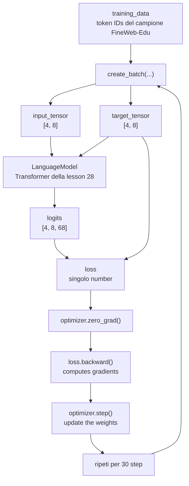

The central point is that the loss is not just used to print a number. In
In this lesson the loss is used to calculate gradients and update the weights.

### Control over weight change

To verify that the training really changed the model, the script
save a copy of the first parameter before training:```python
first_parameter_before = next(model.parameters()).detach().clone()
```

After training it takes the same parameter:```python
first_parameter_after = next(model.parameters()).detach()
```

Then measure the maximum difference:```python
parameter_difference = (first_parameter_after - first_parameter_before).abs().max()
```

If this difference is greater than `0`, at least that parameter has changed.

This check is useful because it shows that:```text
loss.backward() + optimizer.step() -> actual weight update

Code:```python
"""
Changes compared with the previous file:
- This lesson script uses the English project layout and imports lesson-specific
  snapshot code.
- It belongs to lesson 28 of the guided LearnGPT path.

File purpose:
- Run the lesson example in a reproducible way.
- Print the relevant intermediate values, tensor shapes, losses, or generated
  text for inspection.
"""

from pathlib import Path
import random
import sys

import torch


PROJECT_DIR = Path(__file__).resolve().parents[2]
DATASET_PATH = PROJECT_DIR / "data" / "raw" / "fineweb_edu_sample.txt"

sys.path.append(str(PROJECT_DIR))

from study.snapshots.lesson_28.batching import create_batch
from study.snapshots.lesson_28.model import LanguageModel
from study.snapshots.lesson_28.tokenizer import create_vocabulary, decode, encode


CONTEXT_SIZE = 8
BATCH_SIZE = 4
EMBEDDING_SIZE = 16
NUM_HEADS = 4
HEAD_SIZE = EMBEDDING_SIZE // NUM_HEADS
NUM_TRANSFORMER_BLOCKS = 3
LEARNING_RATE = 0.003
TRAINING_STEPS = 30
PRINT_EVERY = 10
GENERATED_TOKENS = 80


def main():
    random.seed(42)
    torch.manual_seed(42)

    text = DATASET_PATH.read_text(encoding="utf-8")

    char_to_id, id_to_char = create_vocabulary(text)
    vocabulary_size = len(char_to_id)

    token_ids = encode(text, char_to_id)

    split_index = int(len(token_ids) * 0.9)
    training_data = token_ids[:split_index]

    model = LanguageModel(
        vocabulary_size=vocabulary_size,
        context_size=CONTEXT_SIZE,
        embedding_size=EMBEDDING_SIZE,
        head_size=HEAD_SIZE,
        num_heads=NUM_HEADS,
        num_transformer_blocks=NUM_TRANSFORMER_BLOCKS,
    )

    optimizer = torch.optim.AdamW(
        model.parameters(),
        lr=LEARNING_RATE,
    )

    check_input, check_target = create_batch(
        data=training_data,
        batch_size=BATCH_SIZE,
        context_size=CONTEXT_SIZE,
    )
    _, initial_loss = model(check_input, check_target)

    first_parameter_before = next(model.parameters()).detach().clone()

    print("Loss on the control batch before training:")
    print(initial_loss.item())
    print()

    for step in range(1, TRAINING_STEPS + 1):
        input_tensor, target_tensor = create_batch(
            data=training_data,
            batch_size=BATCH_SIZE,
            context_size=CONTEXT_SIZE,
        )

        logits, loss = model(input_tensor, target_tensor)

        optimizer.zero_grad()
        loss.backward()
        optimizer.step()

        if step == 1 or step % PRINT_EVERY == 0:
            print(f"Step {step:02d} - loss batch corrente: {loss.item():.4f}")

    _, final_loss = model(check_input, check_target)
    first_parameter_after = next(model.parameters()).detach()
    parameter_difference = (first_parameter_after - first_parameter_before).abs().max()

    prompt_ids = torch.zeros((1, 1), dtype=torch.long)
    generated_ids = model.generate(prompt_ids, max_new_tokens=GENERATED_TOKENS)
    generated_text = decode(generated_ids[0].tolist(), id_to_char)

    print()
    print("Loss on the same control batch after training:")
    print(final_loss.item())
    print()

    print("Maximum difference in the first parameter after training:")
    print(parameter_difference.item())
    print()

    print("Generated text after the short training:")
    print(repr(generated_text))


if __name__ == "__main__":
    main()
```
### Common errors

Mistake 1: Thinking that printing the loss trains the model.

Printing the loss does not change the weights. The weights only change when we get to:```python
loss.backward()
optimizer.step()
```

Error 2: Forget `optimizer.zero_grad()`.

Gradients in PyTorch accumulate. In this simple training we reset them
before each `backward`, so each step only uses the gradients from the current batch.

Mistake 3: expecting the loss to decrease at every single step.

In this lesson each step uses a different random batch. The loss can go up or
go down from one step to the next. The point of the lesson is to check the sequence
training and changing weights.

### Technical sources consulted

- `nanoGPT/train.py` in the local repository: shows the general structure of the
  training loop with batch, forward, backward, optimizer step and reset
  of gradients.
- `torch.optim.AdamW` in the PyTorch version installed in the project: optimizer
  used to update model parameters.
- `LearnGPT/study/snapshots/lesson_28/model.py`: used Transformer model
  from the lesson's training script.

### Conclusion

Now the Transformer model is no longer just run forward. It comes too
trained for some steps.

The added flow is:```text
batch -> model -> loss -> backward -> optimizer.step -> weights aggiornati
```

The next natural lesson will be to better separate training and validation loss,
introducing a more stable loss estimation function.

---

## Lesson 29 - Training Loss and Validation Loss Estimation

### Objective

In this lesson we add a function called:```python
estimate_loss
```

This function is used to measure the loss in a more stable way during the
training.

In lesson 28 we mainly looked at the loss of the current batch. That number
it's useful, but it can change a lot from one step to the next because each batch comes
chosen randomly.

Now let's separate two concepts:

| Concept | What does | mean
| --- | --- |
| training step | update model weights |
| loss estimation | measure the loss without updating the weights |

So the new rule is:```text
training loop -> update the weights
estimate_loss -> measures model quality
```

### What changes and why

Creiamo questi file:

```text
LearnGPT/study/snapshots/lesson_29/training.py
LearnGPT/study/lessons/29_loss_estimation.py
```

We also update the final project:```text
LearnGPT/final_project/training.py
```

The model does not change. The novelty is in the way we evaluate the loss.

The snapshot of lesson 29 contains:```text
lesson_29/
  tokenizer.py
  batching.py
  model.py
  training.py
  data/
    fineweb_edu_sample.txt
```### Because the loss of the current batch is not enough

During training we take a random batch:```python
input_tensor, target_tensor = create_batch(...)
_, loss = model(input_tensor, target_tensor)
```

That `loss` measures only that batch.

A batch can contain an easier or more difficult piece of text. For
this the loss of a single batch can increase even if the model, on average,
it's getting better.

To have a more readable number we measure multiple batches and take the average:```text
loss media = somma delle loss / number di batch valutati
```

In lesson 29 we use:```python
EVAL_BATCHES = 5
```

So, for each split, we measure 5 batches and calculate the average.

### Training loss and validation loss

We have already divided the text into two parts in lesson 05:```python
split_index = int(len(token_ids) * 0.9)
training_data = token_ids[:split_index]
validation_data = token_ids[split_index:]
```

The difference is this:

| Split | Usage |
| --- | --- |
| `training_data` | is used to update the weights |
| `validation_data` | is used to check the model on data not used by the optimizer |

Validation loss is not needed to call `optimizer.step`.

It helps to answer this question:```text
Is the model improving only on training data, or also on separate data?
```

At this stage the training is still very short, so we are not looking for a
perfect result. We are interested in introducing the structure correctly.

### Lesson 29 diagram

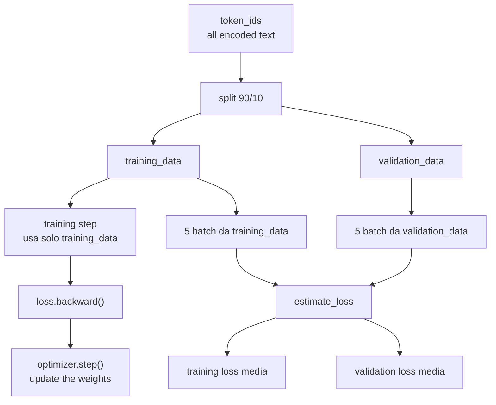

The left branch updates the model. The right branch measures the loss.

### Added piece of code: `training.py`

The new function is:```python
@torch.no_grad()
def estimate_loss(
    model,
    training_data,
    validation_data,
    batch_size,
    context_size,
    eval_batches,
):
```

The parameters are:

| Parameter | Meaning |
| --- | --- |
| `model` | the `LanguageModel` to be evaluated |
| `training_data` | token IDs used for training |
| `validation_data` | token IDs kept separate for evaluation |
| `batch_size` | how many examples per batch |
| `context_size` | how many tokens for example |
| `eval_batches` | how many batches to use to calculate the average |

The function returns a dictionary:```python
{
    "training": ...,
    "validation": ...,
}
```### `@torch.no_grad()` explained

During training, PyTorch must remember the operations performed on tensors
because then `loss.backward()` has to calculate the gradients.

This is not necessary during the evaluation.

`@torch.no_grad()` tells PyTorch:```text
do not build the gradient graph for this function
```

This is correct because `estimate_loss` doesn't call:```python
loss.backward()
optimizer.step()
```

So the function measures the loss, but does not change the weights.

### Explaining `model.eval()` and `model.train()`

Inside `estimate_loss` we do:```python
was_training = model.training
model.eval()
````model.training` is an internal PyTorch flag. Valid `True` when the model is
in training mode.

`model.eval()` switches the model to evaluation mode.

In our current model we don't have layers like dropout yet, so
the output does not change because of this. But using `eval()` is the structure
correct: in complete Transformer models some layers behave this way
different between training and evaluation.

In the end we do:```python
if was_training:
    model.train()
```

This puts the model back into training mode only if it was in training mode before
training.

### Connection with nanoGPT

In `nanoGPT/train.py` there is a `estimate_loss` function with the same idea
general:```python
@torch.no_grad()
def estimate_loss():
    out = {}
    model.eval()
    for split in ['train', 'val']:
        ...
    model.train()
    return out
```

Our version is more explicit:

| nanoGPT | LearnGPT |
| --- | --- |
| use global variables like `eval_iters` and `get_batch` | receives data and parameters as arguments |
| uses splits called `train` and `val` | uses `training` and `validation` | keys
| compact code | more verbose code to follow each step |

The teaching mechanism remains the same:```text
evaluate multiple batches -> average them -> print train loss and validation loss
```### Technical sources consulted

- `nanoGPT/train.py`: local reference for the `estimate_loss` function, with
  `@torch.no_grad()`, `model.eval()` and back to `model.train()`.
- PyTorch documentation installed in the project: behavior of
  `torch.no_grad`, `nn.Module.eval` and `nn.Module.train`.
- `LearnGPT/study/snapshots/lesson_29/training.py`: implementation
  teaching used by this lesson.

### Conclusion

Now the training loop doesn't just print the loss of the current batch. He also has one
more stable measurement:```text
training loss media
validation loss media
```

The next natural step will be to save and reload the model weights with a
checkpoint, so the training doesn't just stay in the Python process' memory.

---

## Lesson 30 - Save and Reload a Checkpoint

### Objective

In this lesson we add the first checkpoint.

A checkpoint is a file that contains the state necessary to reuse a model
trained after the Python process is finished.

Until now, training only changed model weights in memory:```text
training -> weights aggiornati in RAM -> end of process -> lost weights
```

With a checkpoint the flow becomes:```text
training -> weights aggiornati -> checkpoint on disk -> reloaded model
```

### What changes and why

Creiamo questi file:

```text
LearnGPT/study/snapshots/lesson_30/checkpoint.py
LearnGPT/study/lessons/30_checkpoint.py
```

We also update the final project:```text
LearnGPT/final_project/checkpoint.py
```

The model does not change. Change the way we save and reload his
state.

### What the checkpoint contains

In our checkpoint we save a Python dictionary with these keys:

| Key | Contents |
| --- | --- |
| `model_state_dict` | model weights |
| `optimizer_state_dict` | internal state of the optimizer |
| `model_config` | values ​​needed to recreate the model |
| `step` | number of steps already performed |
| `losses` | Estimated training loss and validation loss |
| `char_to_id` | tokenizer: character -> ID |
| `id_to_char` | tokenizer: ID -> character |

This choice is important: we don't just save weight.

To reload a model correctly we also need to know which one with which one
configuration had been built:```python
{
    "vocabulary_size": ...,
    "context_size": ...,
    "embedding_size": ...,
    "head_size": ...,
    "num_heads": ...,
    "num_transformer_blocks": ...,
}
```

If we recreate a model with different dimensions, the saved weights do not enter the
new structure.

### Lesson 30 diagram

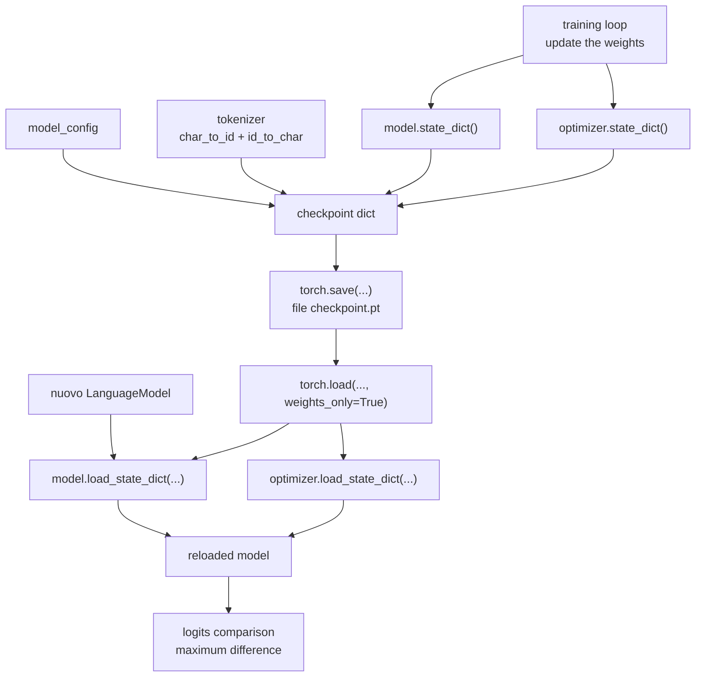

The final check compares the logits of the original model with those of the
model reloaded on the same input.

If the checkpoint was saved and loaded correctly, the difference should
be:```text
0.0
```### Added piece of code: `save_checkpoint`

The save function receives path, model, optimizer and metadata:```python
def save_checkpoint(
    checkpoint_path,
    model,
    optimizer,
    model_config,
    step,
    losses,
    char_to_id,
    id_to_char,
):
```

Inside the function we build the dictionary:```python
checkpoint = {
    "model_state_dict": model.state_dict(),
    "optimizer_state_dict": optimizer.state_dict(),
    "model_config": model_config,
    "step": step,
    "losses": losses,
    "char_to_id": char_to_id,
    "id_to_char": id_to_char,
}
```

Then we save it:```python
torch.save(checkpoint, checkpoint_path)
````model.state_dict()` returns the model weight tensors. It doesn't give back
the `LanguageModel` class: returns the numeric state that can be loaded
in another model with the same structure.

### Added piece of code: `load_checkpoint`

The upload function does three things:

1. reads the file;
2. load the weights into the model;
3. if it receives an optimizer, it also loads the state of the optimizer.```python
def load_checkpoint(checkpoint_path, model, optimizer=None):
    checkpoint = torch.load(checkpoint_path, weights_only=True)

    model.load_state_dict(checkpoint["model_state_dict"])

    if optimizer is not None:
        optimizer.load_state_dict(checkpoint["optimizer_state_dict"])

    return checkpoint
```

Usiamo:

```python
weights_only=True
```because the file contains weights, optimizer state and simple metadata. Not
we need to load arbitrary Python objects.

### Common errors

Mistake 1: Only save logits.

Logits are the output of a single model run. They are not enough for
reconstruct the trained model.

Mistake 2: Only saving weights without configuration.

The weights have precise shapes. To reload them you need to recreate a model with the
same dimensions.

Mistake 3: Reloading weights in a model already initialized differently e
expect the seed to be enough.

The seed is not the checkpoint. The checkpoint contains the actual values of the weights
after the training.

### Connection with nanoGPT

In `nanoGPT/train.py`, when the validation loss improves, a is constructed
dictionary with:```python
checkpoint = {
    'model': raw_model.state_dict(),
    'optimizer': optimizer.state_dict(),
    'model_args': model_args,
    'iter_num': iter_num,
    'best_val_loss': best_val_loss,
    'config': config,
}
```

Then it is saved with:```python
torch.save(checkpoint, os.path.join(out_dir, 'ckpt.pt'))
```

In `nanoGPT/sample.py`, the checkpoint is read and the weights are loaded into the
model with:```python
model.load_state_dict(state_dict)
```

Our version uses more explicit names:

| nanoGPT | LearnGPT |
| --- | --- |
| `model` | `model_state_dict` |
| `optimizer` | `optimizer_state_dict` |
| `model_args` | `model_config` |
| `iter_num` | `step` |
| `best_val_loss` | `losses` |

The structure is smaller, but the idea is the same: saving model state,
optimizer status and information needed to recreate the model.

### Technical sources consulted

- `nanoGPT/train.py`: Local reference for saving checkpoint with
  `state_dict`, optimizer status, configuration and `torch.save`.
- `nanoGPT/sample.py`: local reference to reload a checkpoint e
  call `load_state_dict`.
- PyTorch API installed in the project: signatures of `torch.save`, `torch.load`,
  `nn.Module.state_dict` and `nn.Module.load_state_dict`.
- `LearnGPT/study/snapshots/lesson_30/checkpoint.py`: implementation
  teaching used by this lesson.

### Conclusion

Now the training no longer remains only in the memory of the Python process.

We have this new step:```text
trained model -> checkpoint.pt -> reloaded model
```

The next natural step will be to use checkpointing to better separate two
different moments: model training and text generation from an already model
saved.

---

## Lesson 31 - Generate Text from Checkpoint

### Objective

In this lesson we separate two moments:

| Moment | What it does |
| --- | --- |
| training | update weights and save a checkpoint |
| generation | loads a checkpoint and produces text |

In lesson 30 we already reloaded a checkpoint, but we did it for
verify that the logits were identical.

Now let's use checkpointing for the main practical reason:```text
checkpoint salvato -> reloaded model -> generated text
```

### What changes and why

Creiamo questi file:

```text
LearnGPT/study/snapshots/lesson_31/generate.py
LearnGPT/study/lessons/31_generate.py
```

We also update the final project:```text
LearnGPT/final_project/generate.py
```

The model does not change. The checkpoint does not change. Change the way
we organize the use of the checkpoint.

### Why separate training and generation

During training you need these pieces:```text
training_data
target_tensor
loss
loss.backward()
optimizer.step()
```

During generation, targets and losses are not needed:```text
prompt_text
checkpoint
model.generate(...)
decode(...)
```

The generation must use the weights already saved. It does not have to update the weights.

This separation is the same general direction as nanoGPT:

| nanoGPT Files | Role |
| --- | --- |
| `train.py` | train model and save checkpoint |
| `sample.py` | load checkpoint and generate text |

In our teaching project, lesson 31 introduces the same boundary in a way
smaller.

### Lesson 31 diagram

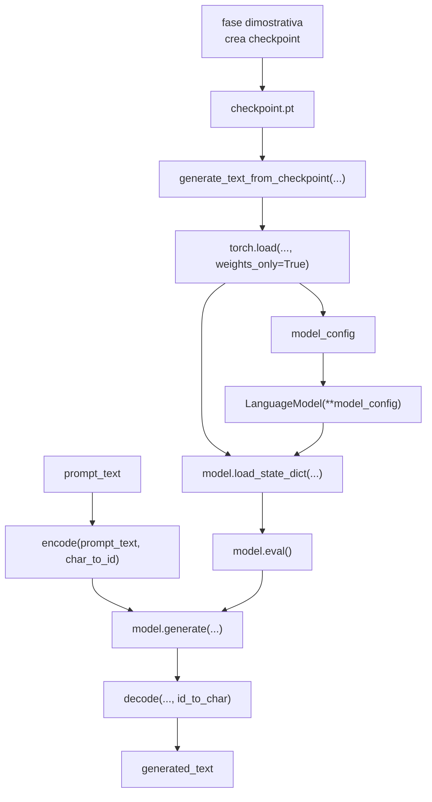

The important part is from `generate_text_from_checkpoint(...)` onwards. That one
part does not perform training.

### New module: `generate.py`

The module contains two functions:```python
load_model_from_checkpoint(...)
generate_text_from_checkpoint(...)
```

The first function loads the checkpoint and rebuilds the model:```python
checkpoint = torch.load(checkpoint_path, weights_only=True)
model = LanguageModel(**checkpoint["model_config"])
model.load_state_dict(checkpoint["model_state_dict"])
model.eval()
```

The second function uses that pattern to generate text:```python
prompt_ids = encode(prompt_text, char_to_id)
input_ids = torch.tensor([prompt_ids], dtype=torch.long)
generated_ids = model.generate(input_ids, max_new_tokens=max_new_tokens)
generated_text = decode(generated_ids[0].tolist(), id_to_char)
```### Because we check the prompt characters

Our tokenizer is character-based. It can only encode characters present in the
vocabulary saved in the checkpoint.

For this we check:```python
unknown_chars = sorted(set(prompt_text) - set(char_to_id))
```

If the prompt contains a character never seen in the training text, the tokenizer
doesn't know how to convert it to ID.

In that case we raise an explicit error:```python
raise ValueError(...)

Then just use the generate function:```python
generated_text, checkpoint = generate_text_from_checkpoint(...)
```

Creating the checkpoint is just to make the lesson executable on its own.
The conceptual part of the lesson is checkpoint generation.

### Common errors

Mistake 1: Using the model still in memory and thinking you have tested the
checkpoint.

To test checkpoint generation you need to rebuild a new model e
load weights from file.

Mistake 2: Using a prompt with characters absent from the vocabulary.

The character tokenizer can only convert characters already present in
`char_to_id`.

Error 3: Calling `optimizer.step()` during build.

The generation does not update the weights. Use already loaded weights.

### Connection with nanoGPT

In `nanoGPT/sample.py`, when `init_from = 'resume'`, the code:

1. reads `ckpt.pt`;
2. recreate the model configuration;
3. load the `state_dict`;
4. puts the model in `eval()`;
5. code the prompt;
6. call `model.generate(...)`;
7. Decode and print the text.

Our lesson does the same sequence in reduced form:

| nanoGPT | LearnGPT |
| --- | --- |
| `sample.py` | `generate.py` + `31_generate.py` |
| `GPTConfig(**checkpoint['model_args'])` | `LanguageModel(**checkpoint["model_config"])` |
| `model.load_state_dict(state_dict)` | `model.load_state_dict(checkpoint["model_state_dict"])` |
| `model.generate(...)` | `model.generate(...)` |
| tokenizer decode | `decode(..., id_to_char)` |

### Technical sources consulted

- `nanoGPT/sample.py`: local reference to generate text from a checkpoint
  saved.
- `nanoGPT/train.py`: Local reference for the checkpoint structure
  produced by the training.
- PyTorch API installed in the project: using `torch.load(..., weights_only=True)`,
  `load_state_dict`, `eval()` and `torch.no_grad()`.
- `LearnGPT/study/snapshots/lesson_31/generate.py`: implementation
  teaching used by this lesson.

### Conclusion

We have now separated the path into two phases:```text
training -> checkpoint
checkpoint -> generation
```

The next natural step will be to improve how we sample the token
next, introducing controls like `temperature` and, later, `top_k`.

---

## Lesson 32 - Sampling Controls

### Objective

In this lesson we improve the generation. First the model chose the
next token always sampling from the full distribution. Now let's add
three checks:

| Parameter | Where it works | Purpose |
| --- | --- | --- |
| `temperature` | about logits | makes sampling more or less random |
| `top_k` | about logits | holds only the most likely candidate tokens |
| `num_samples` | in the generation script | produces multiple texts from the same checkpoint |

The model does not learn anything new. It just changes the way we use i
logits during generation.

### Files modified

```text
LearnGPT/study/snapshots/lesson_32/model.py
LearnGPT/study/snapshots/lesson_32/generate.py
LearnGPT/study/lessons/32_sampling_controls.py
```### New code in the model

The important point is inside `LanguageModel.generate`:```python
def generate(self, input_ids, max_new_tokens, temperature=1.0, top_k=None):
    if temperature <= 0:
        raise ValueError("temperature deve essere maggiore di 0.")

    generated_ids = input_ids

    for _ in range(max_new_tokens):
        input_ids_limited = generated_ids[:, -self.context_size :]
        logits = self(input_ids_limited)
        last_token_logits = logits[:, -1, :] / temperature

        if top_k is not None:
            top_k = min(top_k, last_token_logits.shape[-1])
            top_values, _ = torch.topk(last_token_logits, top_k)
            minimum_top_value = top_values[:, [-1]]
            last_token_logits = last_token_logits.masked_fill(
                last_token_logits < minimum_top_value,
                float("-inf"),
            )

        probabilities = F.softmax(last_token_logits, dim=-1)
        next_token_ids = torch.multinomial(probabilities, num_samples=1)
        generated_ids = torch.cat((generated_ids, next_token_ids), dim=1)

    return generated_ids
```

`temperature` divides the logits before softmax:

```text
low temperature -> stronger differences -> more concentrated choice
high temperature  -> softer differences -> more random choice
```

`top_k` invece taglia via i candidati fuori dai primi `k`:

```text
logits originali
  [2.1, 0.4, 3.0, -1.2, 1.7]

top_k = 3
  [2.1, -inf, 3.0, -inf, 1.7]

softmax
  probabilities only over the 3 remaining candidates
```### Lesson 32 diagram```mermaid
flowchart TD
    A["logits<br/>shape [batch_size, context_size, vocabulary_size]"]
    B["last_token_logits<br/>logits[:, -1, :]"]
    C["temperature<br/>divide i logits"]
    D["top_k<br/>maschera i candidati peggiori"]
    E["softmax<br/>probabilities"]
    F["multinomial<br/>next_token_id"]
    G["cat<br/>aggiunge il token generato"]

    A --> B --> C --> D --> E --> F --> G
```

### Multiple generation

Nel modulo `generate.py` aggiungiamo:

```python
def generate_samples_from_checkpoint(
    checkpoint_path,
    prompt_text,
    max_new_tokens,
    num_samples,
    temperature=1.0,
    top_k=None,
):
    samples = []
    checkpoint = None

    for _ in range(num_samples):
        generated_text, checkpoint = generate_text_from_checkpoint(
            checkpoint_path=checkpoint_path,
            prompt_text=prompt_text,
            max_new_tokens=max_new_tokens,
            temperature=temperature,
            top_k=top_k,
        )
        samples.append(generated_text)

    return samples, checkpoint
```

This function does not train the model. Reload the checkpoint and generate more
texts using the same weights.


Then it must show three samples. They don't have to be the same: sampling is
stochastic.

### Connection with nanoGPT

The direction is the same as `nanoGPT/sample.py`: load a checkpoint e
pass `temperature` and `top_k` to `model.generate`. In our code the steps
they are more explicit because we want to see where the logits are changed.

---

## Lesson 33 - Training with Best Checkpoint

### Objective

In this lesson we stop writing the training cycle directly in the
study script and move it into a reusable function:```python
train_model(...)
```

The function trains, evaluates training loss and validation loss every now and then, and saves
the checkpoint only when the validation loss improves.

### Files modified

```text
LearnGPT/study/snapshots/lesson_33/training.py
LearnGPT/study/lessons/33_best_checkpoint_training.py
```### Why save the best checkpoint

During training the loss may fluctuate. The last step is not always the
better. For this we keep a variable:```python
best_validation_loss = math.inf
```

e salviamo solo quando vediamo un valore migliore:

```python
if losses["validation"] < best_validation_loss:
    best_validation_loss = losses["validation"]
    best_checkpoint_path = save_checkpoint(...)
```

The metric used is validation loss because it measures the model on data that does not
are in the current training batch.

### Structure of the new training

```python
for step in range(1, training_steps + 1):
    input_tensor, target_tensor = create_batch(...)
    _, loss = model(input_tensor, target_tensor)

    optimizer.zero_grad()
    loss.backward()
    optimizer.step()

    should_evaluate = step == 1 or step % eval_interval == 0

    if should_evaluate:
        losses = estimate_loss(...)
        history.append(...)

        if losses["validation"] < best_validation_loss:
            save_checkpoint(...)
```

The connection between optimizer and model remains this:```text
model.parameters() -> optimizer
loss.backward()    -> writes gradients into model parameters
optimizer.step()   -> reads those gradients and updates the same parameters
```### Lesson 33 diagram```mermaid
flowchart TD
    A["train_model(...)"]
    B["create_batch"]
    C["model(input_tensor, target_tensor)"]
    D["loss"]
    E["zero_grad"]
    F["backward"]
    G["optimizer.step"]
    H["estimate_loss"]
    I["validation migliora?"]
    J["save_checkpoint"]
    K["history"]

    A --> B --> C --> D --> E --> F --> G
    G --> H --> I
    I -->|yes| J
    I -->|sempre| K
```

## Lesson 34 - Optimizer, Scheduler, and Gradient Clipping

### Objective

In this lesson we condense three practical optimizations:

| Piece | What it does |
| --- | --- |
| `configure_optimizer` | create AdamW with `learning_rate` and `weight_decay` |
| `get_learning_rate` | calculate warmup and cosine decay |
| `clip_grad_norm_` | limits gradients that are too large |

The model does not change. Change the quality of the training cycle.

### Files modified

```text
LearnGPT/study/snapshots/lesson_34/training.py
LearnGPT/study/lessons/34_optimizer_scheduler.py
```### Optimizer

The code creates AdamW in a function:```python
def configure_optimizer(model, learning_rate, weight_decay):
    return torch.optim.AdamW(
        model.parameters(),
        lr=learning_rate,
        weight_decay=weight_decay,
    )
````

AdamW` is an optimizer widely used in Transformers. The important part for us
is that it receives `model.parameters()`: then works directly on the parameters of the
model.

### Learning rate schedule

The learning rate does not remain fixed:```python
def get_learning_rate(
    step,
    base_learning_rate,
    min_learning_rate,
    warmup_steps,
    decay_steps,
):
    if step < warmup_steps:
        return base_learning_rate * step / warmup_steps

    if step > decay_steps:
        return min_learning_rate

    decay_ratio = (step - warmup_steps) / (decay_steps - warmup_steps)
    cosine_coefficient = 0.5 * (1.0 + math.cos(math.pi * decay_ratio))

    return min_learning_rate + cosine_coefficient * (
        base_learning_rate - min_learning_rate
    )
```

The idea is:```text
inizio training -> warmup graduale
parte centrale  -> learning rate alto ma controllato
final part    -> decay toward min_learning_rate
```### Gradient clipping

After `loss.backward()` the gradients are already in the model parameters. Before
`optimizer.step()` we can limit them:```python
if gradient_clip is not None:
    torch.nn.utils.clip_grad_norm_(model.parameters(), gradient_clip)
```

This is for when an update would be too large. Does not change the loss,
but it changes how much the optimizer can move the weights in the current step.

### Lesson 34 diagram

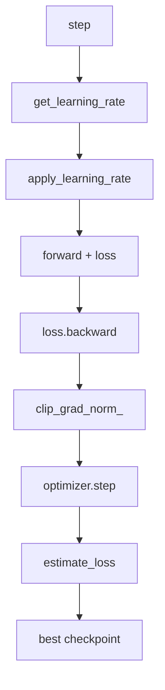

### Connection with nanoGPT

In nanoGPT these pieces are present in a more compact form: configuration of
AdamW, function `get_lr`, `grad_clip` before `optimizer.step`. We keep them here
with longer names to see the exact order of operations.

---

## Lesson 35 - Dropout and Weight Tying

### Objective

In this lesson we add two pattern pieces:

| Piece | Where it comes in | Why it is needed |
| --- | --- | --- |
| `dropout` | embedding, attention, feed-forward | regularizes during training |
| `weight tying` | between token embedding and output head | reuse the same input and output weights |

This is the last major internal change to the model.

### Files modified

```text
LearnGPT/study/snapshots/lesson_35/model.py
LearnGPT/study/lessons/35_dropout_weight_tying.py
```### Dropouts

`nn.Dropout` temporarily turns off part of the values during training.
In `eval()` however it does not modify the input.

In the model we use it in three places:```python
self.embedding_dropout = nn.Dropout(dropout)
self.attention_dropout = nn.Dropout(dropout)
self.output_dropout = nn.Dropout(dropout)
```

e nella MLP:

```python
self.dropout = nn.Dropout(dropout)
```

The flow becomes:```text
token_embeddings + position_embeddings
-> embedding_dropout
-> TransformerBlock
```

Nella attention:

```text
attention_scores -> softmax -> attention_dropout -> values
```

Nel feed-forward:

```text
Linear -> GELU -> Linear -> dropout
```

### Weight tying

Before, we had two different tables:

```text
token_embedding_table.weight  shape [vocabulary_size, embedding_size]
output_head.weight            shape [vocabulary_size, embedding_size]
```

With weight tying we say:```python
self.output_head.weight = self.token_embedding_table.weight
```

So the two names point to the same `Parameter` object.

The reason this is possible is that the shapes match:```text
token_embedding_table:
  token ID -> internal vector
  weight shape [68, 16]

output_head:
  internal vector -> logits sul vocabulary
  weight shape [68, 16]
```

Conceptually the model uses the same weight map to read tokens into
input and to compare the final representation with the possible tokens in
exit.

### Lesson 35 diagram

```mermaid
flowchart TD
    A["input_ids"]
    B["token_embedding_table.weight"]
    C["token_embeddings"]
    D["Transformer con dropout"]
    E["final representation"]
    F["output_head.weight"]
    G["logits"]

    A --> B --> C --> D --> E --> F --> G
    B -. "stesso Parameter" .- F
```### Test in the script

The script checks two things.

First check the weight tying:```python
model.output_head.weight is model.token_embedding_table.weight
```

Poi confronta due forward:

```text
training mode -> due forward possono dare output diversi
eval mode     -> due forward uguali con gli stessi input
```

This happens because dropout is only active in training mode.


## Lesson 36 - Optimizer Groups

### Objective

In this lesson we improve `configure_optimizer`.

Previously we used AdamW like this:```python
torch.optim.AdamW(model.parameters(), lr=learning_rate, weight_decay=weight_decay)
```

This applies `weight_decay` to all parameters. It's simple, but it's not the shape
more correct for a Transformer.

The new form separates:

| Group | Parameters | Weight decay |
| --- | --- | --- |
| decay | weight matrices with `dim() >= 2` | `0.01` |
| no decay | bias and 1D parameters, for example LayerNorm | `0.0` |

This is the same idea used by nanoGPT: regularize the master matrices,
but not biases and normalizations.

### Lesson file

```text
LearnGPT/study/lessons/36_optimizer_groups.py
```

The snapshot is:```text
LearnGPT/study/snapshots/lesson_36/
```### Central code```python
parameter_dict = {
    name: parameter
    for name, parameter in model.named_parameters()
    if parameter.requires_grad
}
decay_parameters = [
    parameter
    for parameter in parameter_dict.values()
    if parameter.dim() >= 2
]
no_decay_parameters = [
    parameter
    for parameter in parameter_dict.values()
    if parameter.dim() < 2
]
```

Poi AdamW riceve due gruppi:

```python
optimizer_groups = [
    {"params": decay_parameters, "weight_decay": weight_decay},
    {"params": no_decay_parameters, "weight_decay": 0.0},
]
```### Note on batching

In this lesson we also fix a small edge of `create_batch`.

Before:```python
high=max_start_position
```

With `torch.randint`, `high` is exclusive. Then the last valid window came
excluded. Now we use:```python
high=max_start_position + 1
```

This didn't change anything on FineWeb-Edu, because the dataset is huge, but it works
the correct helper even on minimal datasets.


The gradients are added before the weights are updated.

### Lesson file

```text
LearnGPT/study/lessons/37_gradient_accumulation.py
```

The snapshot is:```text
LearnGPT/study/snapshots/lesson_37/
```### Central code```python
optimizer.zero_grad(set_to_none=True)

for _ in range(gradient_accumulation_steps):
    input_tensor, target_tensor = create_batch(...)
    _, loss = model(input_tensor, target_tensor)
    loss = loss / gradient_accumulation_steps
    loss.backward()

optimizer.step()
```

Dividing the loss is important: without this division, the gradients sum
it would be bigger just because we accumulated more micro-batches.


Contiene:

```text
ModelConfig
TrainingConfig
GenerationConfig
```### Why do you need a config

Previously the parameters were scattered:```text
BATCH_SIZE
CONTEXT_SIZE
TRAINING_STEPS
LEARNING_RATE
...
```

With a config they become a coherent object:```python
training_config = TrainingConfig()
model_config = ModelConfig(vocabulary_size=50257)
```

This makes it easier to save the configuration in the checkpoint and rebuild
the model reliably.

### Training resume

A complete checkpoint must save:```text
model_state_dict
optimizer_state_dict
model_config
training_config
tokenizer_config
step
best_validation_loss
```

The resume goes:```python
checkpoint = load_checkpoint(
    checkpoint_path=resume_checkpoint_path,
    model=model,
    optimizer=optimizer,
    device=device,
)
start_step = int(checkpoint.get("step", 0)) + 1
```

So the training starts from the next step, not from scratch.

### Lesson file

```text
LearnGPT/study/lessons/38_resume_config.py
```

The snapshot is:```text
LearnGPT/study/snapshots/lesson_38/
```

## Lesson 39 - Output Head Only on the Last Token

### Objective

Logits are needed for all positions during training:```text
[batch_size, context_size, embedding_size]
-> output_head
-> [batch_size, context_size, vocabulary_size]
```

During generation, however, we only use the last position:```python
last_token_logits = logits[:, -1, :]
```

So we can avoid applying `output_head` to the entire context when
we don't pass `target_ids`.

### Central code

```python
if target_ids is None:
    block_output = self.final_layer_norm(block_output[:, [-1], :])
    logits = self.output_head(block_output)
    return logits
```

The shape changes like this:```text
training:    [4, 32, 50257]
generation: [4, 1, 50257]
```

The Transformer still reads the context. Optimization is all about
final projection on the vocabulary.

### Lesson file

```text
LearnGPT/study/lessons/39_last_token_output_head.py
```

The snapshot is:```text
LearnGPT/study/snapshots/lesson_39/
```

## Lesson 40 - Optional Scaled Dot-Product Attention

### Objective

Manual self-attention remains important because it shows the process:```text
queries @ keys.transpose(-2, -1)
-> scala
-> maschera causale
-> softmax
-> weights @ values
```

But PyTorch also offers:```python
F.scaled_dot_product_attention(...)
```

This function performs the same type of attention and can use multiple kernels
efficient when the hardware supports it.

### Educational choice

In our project it remains deactivated by default:```python
use_scaled_dot_product_attention = False
```

We activate it only when we want to test the optimized version:```python
ModelConfig(
    vocabulary_size=50257,
    use_scaled_dot_product_attention=True,
)
```### Lesson file```text
LearnGPT/study/lessons/40_scaled_dot_product_attention.py
```

The snapshot is:```text
LearnGPT/study/snapshots/lesson_40/
```

## Lesson 41 - Performance Flags and DDP

### Objective

In this lesson we add three advanced concepts:

| Concept | Status in the project |
| --- | --- |
| `torch.compile` | optional flag, off by default |
| mixed precision | optional flag, off by default |
| DDP | explained, not started in local smoke test |

### torch.compile

`torch.compile` can speed up a PyTorch model, but it can also render the former
Slower startup and more difficult debugging.

For this the config uses:```python
compile_model = False
```and the code goes:```python
model = maybe_compile_model(
    model=model,
    compile_model=training_config.compile_model,
)
```### Mixed precision

Mixed precision uses lighter numeric types, for example `float16`.

In the project it is optional:```python
mixed_precision = False
precision_dtype = "float16"
```

The context is created only when the flag is active and the device supports it.

### DDP

DDP means `DistributedDataParallel`.

This is useful when training is split across multiple processes, often across multiple GPUs. On the
we don't start the local smoke test: we treat it as a concept to be known, not
as a requirement of the final project.

### MacBook M2 and MPS

On MacBook M2, the desired device is:```text
mps
```

Our code selects it like this:```python
if torch.cuda.is_available():
    return torch.device("cuda")

if torch.backends.mps.is_available():
    return torch.device("mps")

return torch.device("cpu")
```

If `mps_built` is `True` but `mps_available` is `False`, it means that PyTorch is
been compiled with MPS support, but the current environment does not render it
usable. Typical causes are:```text
Python non nativo arm64
wheel PyTorch non adatta
macOS o runtime non compatibile
process avviato in un ambiente che non espone MPS
```

The check to perform is:```bash
python -c "import torch; print(torch.backends.mps.is_built()); print(torch.backends.mps.is_available())"
```

If the second value remains `False`, training automatically switches back to CPU.

### Lesson file

```text
LearnGPT/study/lessons/41_performance_flags_and_ddp.py
```

The snapshot is:```text
LearnGPT/study/snapshots/lesson_41/
```

## Lesson 42 - Final Project

### Objective

This is the final Python lesson of the path.

It doesn't have to be a lesson full of new optimizations. It has to be there
final clean situation: the didactic equivalent of what is found in
`final_project/`.

The final state contains:```text
LearnGPT/final_project/config.py
LearnGPT/final_project/prepare_data.py
LearnGPT/final_project/tokenizer.py
LearnGPT/final_project/batching.py
LearnGPT/final_project/device.py
LearnGPT/final_project/model.py
LearnGPT/final_project/training.py
LearnGPT/final_project/checkpoint.py
LearnGPT/final_project/generate.py
```

The snapshot of lesson 42 is aligned to these files:```text
LearnGPT/study/snapshots/lesson_42/
```### Lesson file```text
LearnGPT/study/lessons/42_final_project.py
```

The script does an end-to-end smoke test:```text
config.py
-> prepare_data.py
-> FineWeb-Edu in streaming
-> train.bin / val.bin
-> memmap
-> batch input/target
-> tokenizer BPE GPT-2
-> LanguageModel
-> device CPU/CUDA/MPS
-> optimizer groups
-> train_model
-> checkpoint completo
-> generate_text_from_checkpoint
-> generated text
```

### Final diagram

```mermaid
flowchart TD
    A["ModelConfig<br/>TrainingConfig<br/>GenerationConfig"]
    M["prepare_data.py"]
    B["FineWeb-Edu processato"]
    C["train.bin / val.bin"]
    D["memmap"]
    E["batch input/target"]
    F["Final LanguageModel"]
    G["device CPU/CUDA/MPS"]
    H["train_model"]
    I["best checkpoint completo"]
    J["generate_text_from_checkpoint"]
    K["decode BPE"]
    L["generated_text"]

    A --> F
    A --> H
    A --> J
    M --> B --> C --> D --> E
    E --> H
    F --> H
    G --> H
    H --> I --> J --> K --> L
```### Central code```python
model_config = ModelConfig(
    vocabulary_size=get_vocabulary_size(DEFAULT_ENCODING_NAME),
)
training_config = TrainingConfig()
generation_config = GenerationConfig()
```

The model is built from the config:```python
model = LanguageModel(**model_config.to_model_kwargs()).to(device)
model = maybe_compile_model(
    model=model,
    compile_model=training_config.compile_model,
)
```

Training uses config instead of sparse constants:```python
history, best_checkpoint_path = train_model(
    model=model,
    optimizer=optimizer,
    training_data=training_data,
    validation_data=validation_data,
    batch_size=training_config.batch_size,
    context_size=model_config.context_size,
    training_steps=training_config.training_steps,
    eval_interval=training_config.eval_interval,
    eval_batches=training_config.eval_batches,
    checkpoint_path=CHECKPOINT_PATH,
    model_config=model_config.to_checkpoint_dict(),
    tokenizer_config=tokenizer_config,
    base_learning_rate=training_config.base_learning_rate,
    min_learning_rate=training_config.min_learning_rate,
    warmup_steps=training_config.warmup_steps,
    decay_steps=training_config.decay_steps,
    gradient_clip=training_config.gradient_clip,
    gradient_accumulation_steps=training_config.gradient_accumulation_steps,
    training_config=training_config.to_checkpoint_dict(),
    mixed_precision=training_config.mixed_precision,
    precision_dtype=training_config.precision_dtype,
    device=device,
)
```

Then the same script reloads the checkpoint:```python
generated_text, checkpoint = generate_text_from_checkpoint(
    checkpoint_path=best_checkpoint_path,
    prompt_text=generation_config.prompt_text,
    max_new_tokens=generation_config.generated_tokens,
    temperature=generation_config.temperature,
    top_k=generation_config.top_k,
    device=device,
    compile_model=training_config.compile_model,
)
```

This is the final check: the text must be generated from a template
rebuilt from the checkpoint, not from the `model` object left in memory.

### Cleanup added by final review

During the final review we added explicit checks on borderline cases.
These checks do not change the architecture of the model, but make it clearer
because an invalid configuration fails.

The main points are:```text
batch_size e context_size devono essere almeno 1
eval_interval ed eval_batches devono essere almeno 1
warmup_steps cannot be negative
decay_steps deve essere maggiore di warmup_steps
embedding_size deve essere divisibile per num_heads
prompt_text deve produrre almeno un token
max_new_tokens cannot be negative
num_samples deve essere almeno 1
torch.compile is used only if available in the PyTorch runtime
```

The reason is educational and practical: if a value is wrong, we prefer an error
clear near the configuration instead of a more confusing error inside PyTorch
or within a multiplication of tensors.


Then it must show the checkpoint, a validation loss and a generated text.

### Final state of the Python path

At the end of lesson 42 we have:```text
FineWeb-Edu processato
tokenizer BPE GPT-2
batching da memmap
gestione device CPU/CUDA/MPS
config.py for model, training and generation
Transformer decoder-only didattico
self-attention causale multi-head
scaled_dot_product_attention opzionale
MLP con GELU
residual connection
LayerNorm
dropout
weight tying
training loop riutilizzabile
optimizer groups AdamW
gradient accumulation
resume da checkpoint
learning rate schedule
gradient clipping
checkpoint completo
checkpoint-based generation
output_head only on the last token during generation
temperature e top_k
torch.compile opzionale
mixed precision opzionale
DDP spiegato ma non obbligatorio
```

This is the final Python part of the `LearnGPT` project.

---

## In-depth analysis after lesson 42 - FineWeb-Edu, common source and device

### Status updated

When we reached the final Python version, these three themes were incorporated
in the final project:

1. where the dataset should live;
2. how to use processed FineWeb-Edu instead of just raw text;
3. how to manage CPU, CUDA and Metal/MPS.

### Current state of the data

Snapshots no longer contain copies of the dataset. This choice was convenient
at first, but becomes wrong as the dataset grows: duplicate a file
small is tolerable, duplicating a multi-GB dataset into dozens of snapshots is not.

The current structure uses a shared data source at the path root:```text
LearnGPT/
  data/
    raw/
      fineweb_edu_sample.txt
    processed/
      fineweb_edu/
        train.bin
        val.bin
        meta.json
  study/
    lessons/
      01_read_text.py
      ...
    snapshot/
      lesson_01/
      lesson_02/
      ...
      lesson_42/
  final_project/
    tokenizer.py
    batching.py
    model.py
    training.py
    checkpoint.py
    generate.py
    device.py
```

In this structure the dataset exists in only one place:```text
LearnGPT/data/
```

The lesson snapshots and final project use that via path
configuration. We no longer copy the dataset into each `lesson_NN/`.

If we want to reduce the space occupied, the preferred method is not to conserve
the complete raw text: we read FineWeb-Edu in streaming and write directly
tokens in `train.bin` and `val.bin`. The `raw/` folder remains useful only for
debug or to maintain a human readable sample.

Refactor updated together:```text
DATASET_PATH in study scripts
course_en.md
course_it.md
tools/validate_learngpt.py
riferimenti al dataset condiviso
```### Which dataset to use

The updated choice is:```text
HuggingFaceFW/fineweb-edu
```

FineWeb-Edu is a very large collection of educational web pages filtered by
FineWeb. The official sheet indicates a version of around 1.3T tokens and versions
smallest sample:```text
sample-350BT
sample-100BT
sample-10BT
```

For us it doesn't mean downloading everything `sample-10BT`. It means to use
`sample-10BT` as the streaming source and stop when we have reached the
decided limit, for example around 10 GB.

The conceptual loading is:```python
from datasets import load_dataset

dataset = load_dataset(
    "HuggingFaceFW/fineweb-edu",
    name="sample-10BT",
    split="train",
    streaming=True,
)
```

Then we read one document at a time, take the `text` field and stop
when the local file reaches the target size.

### Why FineWeb-Edu changes the pipeline type

The FineWeb-Edu textual sample can be read like this:```python
text = DATASET_PATH.read_text(encoding="utf-8")
```

With 10 GB this form is no longer good, because load all the text into RAM and
then converting it to a Python list of tokens becomes too expensive.

The most correct pipeline is more similar to nanoGPT:```text
FineWeb-Edu streaming
-> tokenizzazione BPE
-> train.bin / val.bin
-> batching da file binario o memmap
-> training
```

This introduces an important point: for a dataset of this type it is convenient
switch from character tokenizer to subword tokenization, for example
GPT-2 BPE via `tiktoken`. The character tokenizer remains perfect for
understand the model, but it is not the best practical choice for a web dataset from
GB.

### Tokenization closer to a real GPT

So far we have used character tokenization:```text
"ciao" -> ["c", "i", "a", "o"] -> [token_id, token_id, token_id, token_id]
```

This choice was educationally useful because it made each step visible.
However, a real GPT does not normally work on single characters. Use tokens
subword: word chunks, frequent words, spaces and punctuation encoded in
larger units.

The new direction must be:```text
text -> GPT-2-style BPE tokenizer -> token IDs -> train.bin / val.bin
```

With `tiktoken` the concept becomes:```python
import tiktoken

encoding = tiktoken.get_encoding("gpt2")
token_ids = encoding.encode_ordinary(text)
```

And while decoding:```python
text = encoding.decode(token_ids)
```

The conceptual difference is this:

| Tokenizer | Mental example | Pros | Cons |
| --- | --- | --- | --- |
| characters | `"training"` -> `t r a i n i n g` | very easy to understand | long sequences, slower training |
| BPE / subword | `"training"` -> bigger chunks learned from vocabulary | more similar to real GPT | requires a library and an already defined vocabulary |

This change also modifies `vocabulary_size`.

With the character tokenizer we had a small vocabulary, for example approximately
dozens of characters. With GPT-2 BPE the vocabulary is much larger, approx
50k tokens. Consequentially:```text
output_head
before: Linear(embedding_size -> about 68)
dopo:  Linear(embedding_size -> about 50k)
```

This is more realistic, but also more expensive. This is why we need to increase the
model and train with caution.

### Impact on existing code

The move to the BPE tokenizer should not be slipped in as a small change into the
old `tokenizer.py`, because it changes the way we prepare data.

The final structure separates:```text
tokenizer.py      -> wrapper didattico attorno a tiktoken
prepare_data.py   -> streaming FineWeb-Edu + tokenizzazione + train.bin/val.bin
batching.py       -> legge token da file binario/memmap invece che da lista Python
training.py       -> uses already prepared train.bin/val.bin
generate.py       -> decodes BPE tokens into text
```

This is an important transition: the character tokenizer remains useful in the
very first part of the course, but the BPE tokenizer must be introduced early, before
enter the Transformer. The final project uses the BPE tokenizer.

### What it means to do more realistic training

So far the scripts do short training, designed to verify that the code
functions.

A more realistic training must separate three modalities:

| Mode | Purpose | Duration |
| --- | --- | --- |
| smoke test | check that everything works | a few steps |
| dataset preparation | download/tokenize a part of FineWeb-Edu | depends on the limit chosen |
| real training small | produce a provable checkpoint | hundreds or thousands of steps |

The final project now contains the operational modules to configure:```text
dataset_name
raw_data_path
processed_data_path
checkpoint_path
batch_size
context_size
embedding_size
num_heads
num_transformer_blocks
dropout
training_steps
eval_interval
device
```

With FineWeb-Edu it makes no sense to always use 10 GB during lessons. It's convenient
have two limitations:```text
demo_size_mb = 10 o 50
target_size_gb = 10
```

The first is used to quickly test the pipeline. The second is useful when yes
really wants to prepare the largest dataset.

The practical recommendation is to proceed at levels:

| Level | Processed Size | Usage |
| --- | ---: | --- |
| demo | 50MB | verify streaming, BPE tokenization and batching |
| first real training | 500MB | produce a small but sensible checkpoint |
| recommended default | 1GB | good compromise between space, time and local utility |
| maximum optional | 10 GB | only when the pipeline is stable and you want to keep a larger corpus |

Here "processed size" means above all:```text
train.bin + val.bin
```not necessarily downloaded raw text. With GPT-2 BPE and `uint16`, each token
takes up 2 bytes in the binary file. So a 1GB processed file contains
hundreds of millions of ID tokens. For a small teaching model, this is already a lot.

For this reason the most prudent choice is:```text
demo iniziale: 50 MB
first useful version: 500 MB
default del progetto: 1 GB
opzione esplicita: 10 GB
```

The preparation code must allow this limit to be changed without
touch the rest of the project.

### FineWeb-Edu preparation done

At this stage we have chosen to prepare the maximum limit directly
optional:```text
target_gb = 10
```

The command used is:```bash
python -B LearnGPT/final_project/prepare_data.py \
  --target-gb 10 \
  --output-dir LearnGPT/data/processed/fineweb_edu \
  --overwrite \
  --progress-mb 256
```

The result is:```text
LearnGPT/data/processed/fineweb_edu/train.bin
LearnGPT/data/processed/fineweb_edu/val.bin
LearnGPT/data/processed/fineweb_edu/meta.json
```

Real run numbers:

| Field | Value |
| --- | ---: |
| processed documents | 5,242,061 |
| train tokens | 5,315,384,685 |
| validation tokens | 53,324,435 |
| train bytes | 10,630,769,370 |
| validation bytes | 106,648,870 |
| total bytes | 10,737,418,240 |
| total GiB | 10 |
| tokenizer | GPT-2 BPE via `tiktoken` |
| dataset | `HuggingFaceFW/fineweb-edu`, config `sample-10BT` |

File `meta.json` contains `complete: true`, then `train.bin + val.bin`
they exactly reach the target of 10 GiB processed.

### Device: CPU, CUDA, Metal/MPS

The final code explicitly manages the device.

There are some details already compatible, for example in the model:```python
positions = torch.arange(current_context_size, device=input_ids.device)
```

This is correct because the locations are created on the same device as
`input_ids`.

Management covers:```text
scegliere cuda / mps / cpu
move the model to the device
creare o spostare input_tensor e target_tensor sul device
caricare checkpoint con map_location
create the prompt tensor on the device during generation
```

The shared function is:```python
def get_default_device():
    if torch.cuda.is_available():
        return torch.device("cuda")

    if torch.backends.mps.is_available():
        return torch.device("mps")

    return torch.device("cpu")
```

The training does:```python
model = model.to(device)
input_tensor = input_tensor.to(device)
target_tensor = target_tensor.to(device)
```and generation creates the prompt directly on the device:```python
input_ids = torch.tensor([prompt_ids], dtype=torch.long, device=device)
```### Where to place these changes in your lessons

It is not convenient to simply add a lesson 37 and leave 36 as it is
"final", because the final project would no longer be truly final.

The best choice is to also reorganize the educational path, not just the
final project. The recommended sequence is:

| Lesson | Theme | Note |
| --- | --- | --- |
| 02 | raw character tokenizer | it only serves to understand text -> numbers |
| 03-04 | BPE tokenizer with `tiktoken` | immediately introduces the realistic form of tokens |
| 05-06 | FineWeb-Edu processed and memmap | show `train.bin`, `val.bin` and batch from file |
| 07+ | model and Transformer | uses the real pipeline as a mental reference |
| 42 | Final Project | uses everything: device, processed dataset, training, generation and optional optimizations |

Thus FineWeb and BPE do not remain final arguments: they arrive immediately after the first
raw tokenizer, and the rest of the course builds the model already knowing what it is
the real pipeline.

### Updated route decision

The course needs to be reorganized so that FineWeb-Edu and BPE enter early, not
only in the final phase:```text
Lesson 02 - rough character tokenizer
Lesson 03/04 - tokenizer BPE con tiktoken
Lesson 05/06 - dataset FineWeb-Edu processato e memmap
Later lessons - batching, model and Transformer connected to the real pipeline
Lesson 42 - Final Project consolidato
```

Within this reorganization we must maintain:

1. introduce a single data folder `LearnGPT/data/`;
2. remove the dependency on `data/` copies within each snapshot;
3. use FineWeb-Edu as the designated dataset for the project;
4. first show the character tokenizer as a raw tool;
5. introduce the GPT-2 style BPE tokenizer immediately afterwards;
6. explain `train.bin`, `val.bin` and memmap soon;
7. prepare a small demo mode and a longer training mode;
8. keep `final_project` as the latest working version.

In this way the project remains didactic, but begins to behave like a
real small training project.

### Technical sources consulted

- Official Hugging Face sheet `HuggingFaceFW/fineweb-edu`: dataset in format
  parquet, English language, versions `sample-350BT`, `sample-100BT` e
  `sample-10BT`, use with `datasets` streaming.
- `nanoGPT/data/openwebtext/prepare.py`: local reference for GPT-2 BPE with
  `tiktoken`, adding end-of-text token and writing tokens in
  `train.bin` and `val.bin`.
- `nanoGPT/data/shakespeare/prepare.py`: smallest local reference for
  tokenize text with `tiktoken.get_encoding("gpt2")` and save binary files.
- `nanoGPT/train.py`: local reference for datasets processed in binary files,
  device management and training closer to a real project.
- Official PyTorch documentation on MPS backend: reference to check
  `torch.backends.mps.is_built()`, `torch.backends.mps.is_available()` and lo
  moving tensors/models to `torch.device("mps")`.

---

## In-depth analysis - Final comparison with nanoGPT

### Purpose of comparison

This comparison uses the local repository `nanoGPT/` as a technical reference.
It's not about copying everything, but about understanding which pieces really have value for the
our educational project.

The correct question is not:```text
come facciamo a rendere LearnGPT identico a nanoGPT?
```

ma:

```text
quali idee di nanoGPT migliorano davvero LearnGPT senza rovinare la chiarezza?
```### What we have already taken in the right direction

The final project already contains many important elements from the same family
of nanoGPT:

| Piece | Status in LearnGPT |
| --- | --- |
| GPT-2 style BPE tokenizer | present with `tiktoken` |
| dataset processed into binary files | present with `train.bin` and `val.bin` |
| reading with memmap | present in `batching.py` |
| Transformer decoder-only | present in `model.py` |
| causal self-attention | present |
| multi-head attention | present |
| residual connection | present |
| LayerNorm before subblocks | present |
| Final LayerNorm | present |
| MLP with GELU | present |
| dropout | present |
| weight tying | present |
| GPT-style initialization | present with `0.02` standard deviation and scaled residual projections |
| AdamW | present |
| warmup and cosine decay | present |
| gradient clipping | present |
| checkpoints | present |
| generation with `temperature` and `top_k` | present |
| CPU/CUDA/MPS management | present |

So the base is no longer an isolated toy: it is a real little GPT project,
but still written in a didactic way.

### Important cues applied or left optional

The most useful pieces taken from nanoGPT have been distributed in lessons 36-41 and
consolidated in the `Final Project` of lesson 42:

| Priority | Tip | Why it matters |
| --- | --- | --- |
| high | optimizer groups with and without weight decay | avoid applying weight decay to bias and LayerNorm |
| high | gradient accumulation | simulate larger batches using smaller micro-batches |
| high | training resume | allows you to restart from a checkpoint without losing optimizer and step |
| high | more explicit training configuration | avoid scattered parameters between scripts and functions |
| high | GPT-style weight initialization | prevents out-of-scale logits and initial loss with the GPT-2 vocabulary |
| medium-high | output head only on the last token during generation | reduces unnecessary work in inference |
| average | mixed precision with `autocast` and `GradScaler` | accelerates on compatible GPUs and reduces memory |
| average | `torch.compile` optional | can speed up the model, but should be kept deactivated by default |
| average | `scaled_dot_product_attention` | use optimized attention when PyTorch/hardware supports it |
| not applied now | pin memory and non-blocking transfers | useful especially on CUDA, not very relevant on the local smoke test |
| low hour | DDP / distributed training | serves with multiple GPUs, is not central on a small local machine |
| low hour | external logging like wandb | useful for long experiments, but not necessary for understanding the code |
| optional | import of pretrained GPT-2 weights | interesting, but introduces additional complexity and dependencies |

### Priority chart

```mermaid
flowchart TD
    A["Current LearnGPT"] --> B["More robust training"]
    A --> C["More efficient inference"]
    A --> D["Performance opzionale"]
    A --> E["Advanced scalability"]

    B --> B1["optimizer groups<br/>weight decay only on the right weights"]
    B --> B2["gradient accumulation<br/>larger effective batch"]
    B --> B3["resume checkpoint<br/>ripartenza del training"]
    B --> B4["config di training<br/>more organized parameters"]
    B --> B5["GPT-style initialization<br/>initial loss at the correct scale"]

    C --> C1["output_head solo sull'ultimo token<br/>quando non ci sono target"]
    C --> C2["prompt from file and multiple samples<br/>more convenient generation"]

    D --> D1["mixed precision<br/>autocast e GradScaler"]
    D --> D2["torch.compile<br/>flag opzionale"]
    D --> D3["scaled_dot_product_attention<br/>attention ottimizzata"]

    E --> E1["DDP con torchrun<br/>multiple processes and multiple GPUs"]
    E --> E2["logging esterno<br/>metriche esperimenti lunghi"]
    E --> E3["MFU<br/>metrica utile soprattutto su GPU grandi"]
```### Optimizer with weight decay groups

In the previous version, `weight_decay` was passed to every model parameter.
The current `configure_optimizer` separates them into groups.

In nanoGPT, however, the parameters are separated:```text
parametri 2D      -> weight_decay attivo
parametri non 2D  -> weight_decay = 0
```

The reasoning is:

| Parameter type | Example | Weight decay? |
| --- | --- | --- |
| weight matrix | embedding, Linear weight | yes |
| bias vector | Linear bias | no |
| LayerNorm weights | gamma/beta of normalization | no |

This change was applied in lesson 36. It makes AdamW closer
to real-world use in Transformers.

### Gradient accumulation

The `batch_size` we see in the code is the number of examples processed in one
single forward pass.

With larger datasets and models it may happen that the desired batch does not fit
in memory. nanoGPT solves with gradient accumulation:```text
micro-batch 1 -> loss / accumulation_steps -> backward
micro-batch 2 -> loss / accumulation_steps -> backward
micro-batch 3 -> loss / accumulation_steps -> backward
micro-batch 4 -> loss / accumulation_steps -> backward
optimizer.step()
```

The micro-batch gradients are added before updating the weights. So the
model behaves as if it has seen a larger batch, but without having to
load everything together.

This is very useful even on a small computer, because it allows you to control
the compromise between memory and training stability is better.

### GPT-style initialization

Not every PyTorch default initialization is suitable for this model. In
particular, `nn.Embedding` normally starts with a standard deviation close to
`1.0`. With about 50,000 tokens and weight tying, this creates very large logits
and an initial loss above 160, while a uniform random prediction should start
close to:

```text
ln(50257) = approximately 10.82
```

The final project initializes `Linear` and `Embedding` weights with standard
deviation `0.02`, zeros the biases, and scales projections that close residual
branches with:

```text
0.02 / sqrt(2 * number_of_blocks)
```

This keeps activations, gradients, and loss at the expected scale from the
first step.

### Training resume

Now the checkpoint also saves data useful for training resumes.

The closest version to nanoGPT save and reload:```text
model_state_dict
optimizer_state_dict
model_config
tokenizer_config
step corrente
best_validation_loss
training_config
rng_state
```

This allows you to interrupt a long training session and really start again
same point. Without `optimizer_state_dict`, for example, AdamW loses memory
of its internal moments.

Every evaluation atomically saves two files: the `best` checkpoint selected by
the lowest validation loss, and the `latest` checkpoint containing the most
recent evaluated step, which is the recommended resume source. Resume rebuilds
the architecture, tokenizer, and training configuration from the checkpoint so
forgotten CLI arguments cannot silently change the run.

### Output head only on the last token being generated

In our model, when we call:```python
logits = self(input_ids_limited)
```during generation, the model produces logits for all tokens in the context.
But then we just use:```python
last_token_logits = logits[:, -1, :]
```

So we are also calculating logits which we will not use.

nanoGPT optimizes this point: when there is no `target`, it calculates `lm_head`
only on the last position.

The conceptual transformation is:```text
training:
[batch_size, context_size, embedding_size]
-> output_head
-> [batch_size, context_size, vocabulary_size]

generation:
[batch_size, 1, embedding_size]
-> output_head
-> [batch_size, 1, vocabulary_size]
```

The Transformer part continues to read all the context, but the projection
final on the vocabulary is made only on the last token. With a vocabulary from
around 50k tokens, this difference can weigh.

### Mixed precision

Mixed precision means using lighter numeric types, for example
`float16` or `bfloat16`, in some parts of the calculation.

The objective is:```text
meno memoria
more speed
training ancora stabile
```

In nanoGPT this is handled with:```text
torch.amp.autocast
GradScaler quando si usa float16
```

For `LearnGPT` it is not worth making it mandatory. The best choice is a flag:```text
mixed_precision = False di default
```and then activate it only when the device and PyTorch version support it
good. On CPU or non-accelerated environments it may not provide advantages.

### torch.compile

`torch.compile` try to compile the PyTorch model to make it faster.

This is a useful tip, but should be treated with caution:```text
advantage: can accelerare training e inference
disadvantage: slower first startup, possible incompatibilities, harder debugging
```

For this reason in the final project it is:```text
compile_model = False di default
```

e diventare:

```python
if compile_model:
    model = torch.compile(model)
```only as an advanced option. Didactically it is important to know that it exists, but not
must complicate the first executions.

### scaled_dot_product_attention

Our attention is written explicitly:```text
queries @ keys.transpose(-2, -1)
-> mask causale
-> softmax
-> weights @ values
```

This form is great for learning.

nanoGPT however uses `torch.nn.functional.scaled_dot_product_attention` when it is
available. It is a PyTorch function that wraps the same calculation and can use
more efficient implementations.

The choice applied in the course is:```text
before: manual attention for understanding
poi: attention ottimizzata opzionale
```

Thus we do not lose the didactic value of the formula, but we can get closer to it
real structure used in modern projects.

### Parallel training and DDP

nanoGPT supports DDP, i.e. `DistributedDataParallel`.

DDP is useful when the training runs on multiple processes, often on multiple GPUs:```text
process 0 -> different batch -> gradients
process 1 -> different batch -> gradients
process 2 -> different batch -> gradients
gradient synchronization
optimizer.step()
```

This is important to know, but it is not an operational priority for this project
local. On a machine without multiple CUDA GPUs, DDP adds complexity without giving away
a proportionate practical advantage.

The correct choice is:```text
spiegarlo come concetto avanzato
do not make it a required part of the final project
```### How the latest lessons were distributed

In order not to create a single final lesson that is too full, the ideas have been
distributed like this:

| Lesson | Contents |
| --- | --- |
| 36 | optimizer groups and batching fix |
| 37 | gradient accumulation |
| 38 | config sorted and resume checkpoint |
| 39 | `output_head` only on the last token during generation |
| 40 | `scaled_dot_product_attention` optional |
| 41 | `torch.compile`, optional mixed precision and DDP explained |
| 42 | `Final Project` clean, aligned with `final_project/` |

This sequence keeps the project readable:```text
first we clean up training
then we make generation and attention more efficient
poi documentiamo le ottimizzazioni avanzate non obbligatorie
poi consolidiamo tutto in un final project pulito
```### What shouldn't be brought now

Not everything that exists in nanoGPT needs to be copied right away.

For now I would avoid making central:

| Piece | Reason |
| --- | --- |
| Full DDP | too complex for local practical value |
| wandb required | introduces accounts, network and external dependency |
| MFU as primary metric | designed especially for large GPUs |
| import GPT-2 pretrained | interesting, but shifts the course towards fine-tuning and compatibility Hugging Face |
| `torch.compile` always active | can complicate debugging and first boot |

These elements can live as an advanced section or as optional, non-optional flags
as a mandatory route.

### Final decision

The best direction is:```text
LearnGPT resta didattico nella forma
ma prende da nanoGPT le ottimizzazioni che migliorano davvero training,
checkpoint, generation e resource management
```

The changes applied are therefore:

1. improve `configure_optimizer` with weight decay groups;
2. add gradient accumulation to the training loop;
3. make the checkpoint truly resumable;
4. add a tidier training setup;
5. optimize the generation by calculating `output_head` only on the last token;
6. add `scaled_dot_product_attention` as an option after the release
   manual;
7. add `torch.compile` and mixed precision only as optional flags;
8. explain DDP without making it mandatory.

This brings the project very close to the spirit of nanoGPT, but without losing it
the step-by-step clarity that the course needs. The important point is that
`42_final_project.py` is not a new optimization - it's the clean version that
mirrors `final_project/`.

## Follow-up after Lesson 42 - Controlled retraining

The canonical FineWeb-Edu corpus contains about 5.3 billion tokens. A 45,000
step run with `batch_size=4`, `context_size=256`, and eight accumulated
micro-batches sees about 369 million tokens: less than 7% of the corpus. In the
observed run the model learned mainly common-token frequency, rather than
context-dependent continuation.

The first response is not to make the model larger. We keep the roughly 17.7M
parameter GPT and derive a separate 1 GiB experimental dataset from the 10 GiB
canonical source. Chunks are selected without replacement from a fixed seed, so
the experiment is reproducible.

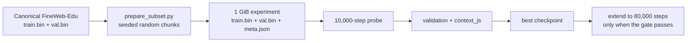

`context_js` compares the next-token distribution across eight fixed validation
contexts. It is not a prose-quality score; it detects collapse. If the model
answers unrelated contexts almost identically, the value becomes very small.
The collapsed checkpoint measured about `2e-6`; the experimental gate stops a
run below `1e-4` after preserving its latest checkpoint for inspection.

The initial recipe is intentionally conservative: `dropout=0`, maximum learning
rate `1e-4`, 1,000 warm-up steps, `0.05` weight decay, and gradient clipping at
`1.0`. Before extending the run, generate several prompts from the best
checkpoint: lower loss and a passing gate do not replace this human check.
