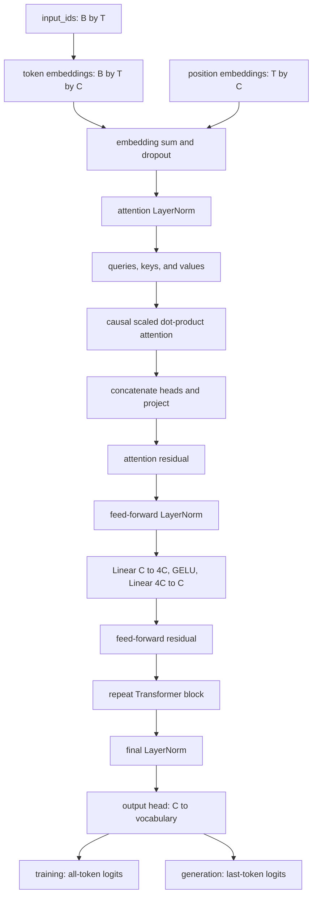

# LearnGPT Course

LearnGPT is a study-first path for building a small decoder-only Transformer in
PyTorch. The course starts with text and token IDs, introduces one mechanism at
a time, and ends with a clean training and generation project.

Python identifiers, command output, examples, diagrams, and explanations use
English throughout the public repository. Complete executable files live in
`study/snapshots/` and `final_project/`; this guide focuses on the purpose of
each change and the connections between the parts.

## Source Map

The implementation is grounded in these sources:

- `nanoGPT/model.py` for the decoder-only Transformer structure;
- `nanoGPT/train.py` for optimization, scheduling, evaluation, and checkpoint
  concepts;
- `nanoGPT/sample.py` for checkpoint-based generation;
- PyTorch modules such as `Embedding`, `Linear`, `LayerNorm`, `GELU`, AdamW,
  scaled dot-product attention, and cross entropy;
- *Attention Is All You Need* for scaled dot-product and multi-head attention;
- *Layer Normalization* for normalization across embedding features;
- FineWeb-Edu for the final text corpus;
- GPT-2 BPE through `tiktoken` for the final tokenizer.

The local code remains the source of truth. External projects explain the
direction, while LearnGPT keeps the implementation deliberately explicit.

## Lesson Index

1. [Lesson 01 - Read the Text](#lesson-01---read-the-text)
2. [Lesson 02 - Character Tokenizer](#lesson-02---character-tokenizer)
3. [Lesson 03 - Encode and Decode](#lesson-03---encode-and-decode)
4. [Lesson 04 - Tokenizer Module](#lesson-04---tokenizer-module)
5. [Lesson 05 - Training and Validation](#lesson-05---training-and-validation)
6. [Lesson 06 - Input and Target](#lesson-06---input-and-target)
7. [Lesson 07 - Random Examples](#lesson-07---random-examples)
8. [Lesson 08 - Python Batch](#lesson-08---python-batch)
9. [Lesson 09 - PyTorch Batch](#lesson-09---pytorch-batch)
10. [Lesson 10 - Batching Module](#lesson-10---batching-module)
11. [Lesson 11 - Verify PyTorch](#lesson-11---verify-pytorch)
12. [Lesson 12 - First Bigram Model](#lesson-12---first-bigram-model)
13. [Lesson 13 - Bigram Loss](#lesson-13---bigram-loss)
14. [Lesson 14 - Bigram Training](#lesson-14---bigram-training)
15. [Lesson 15 - Bigram Generation](#lesson-15---bigram-generation)
16. [Lesson 16 - Bigram Limitation](#lesson-16---bigram-limitation)
17. [Lesson 17 - Token Embeddings](#lesson-17---token-embeddings)
18. [Lesson 18 - Position Embeddings](#lesson-18---position-embeddings)
19. [Lesson 19 - Causal Self-Attention Head](#lesson-19---causal-self-attention-head)
20. [Lesson 20 - Multi-Head Attention](#lesson-20---multi-head-attention)
21. [Lesson 21 - Attention Output Projection](#lesson-21---attention-output-projection)
22. [Lesson 22 - Attention Residual Connection](#lesson-22---attention-residual-connection)
23. [Lesson 23 - LayerNorm Before Attention](#lesson-23---layernorm-before-attention)
24. [Lesson 24 - Feed-Forward Network](#lesson-24---feed-forward-network)
25. [Lesson 25 - Transformer Block](#lesson-25---transformer-block)
26. [Lesson 26 - Multiple Transformer Blocks](#lesson-26---multiple-transformer-blocks)
27. [Lesson 27 - Final LayerNorm](#lesson-27---final-layernorm)
28. [Lesson 28 - Transformer Training](#lesson-28---transformer-training)
29. [Lesson 29 - Loss Estimation](#lesson-29---loss-estimation)
30. [Lesson 30 - Checkpoint](#lesson-30---checkpoint)
31. [Lesson 31 - Generate from a Checkpoint](#lesson-31---generate-from-a-checkpoint)
32. [Lesson 32 - Sampling Controls](#lesson-32---sampling-controls)
33. [Lesson 33 - Best Checkpoint](#lesson-33---best-checkpoint)
34. [Lesson 34 - Optimizer and Scheduler](#lesson-34---optimizer-and-scheduler)
35. [Lesson 35 - Dropout and Weight Tying](#lesson-35---dropout-and-weight-tying)
36. [Lesson 36 - Production Data and Optimizer Groups](#lesson-36---production-data-and-optimizer-groups)
37. [Lesson 37 - Gradient Accumulation](#lesson-37---gradient-accumulation)
38. [Lesson 38 - Configuration and Resume](#lesson-38---configuration-and-resume)
39. [Lesson 39 - Last-Token Output Head](#lesson-39---last-token-output-head)
40. [Lesson 40 - Scaled Dot-Product Attention](#lesson-40---scaled-dot-product-attention)
41. [Lesson 41 - Performance Flags and DDP](#lesson-41---performance-flags-and-ddp)
42. [Lesson 42 - Final Project](#lesson-42---final-project)

## How to Run Study Scripts

Run every command from the repository root with the project environment:

```bash
.venv/bin/python -B study/lessons/01_read_text.py
```

Replace the filename with the lesson you want to study. `-B` prevents Python
from creating `__pycache__` directories in the teaching tree.

On Windows PowerShell, replace `.venv/bin/python` with
`.\.venv\Scripts\python.exe`. Lessons 01–35 use the tracked
`data/study_sample.txt`, and Lesson 42 builds a small in-memory BPE dataset, so
the teaching path works before the real FineWeb-Edu corpus is downloaded.

Run the final smoke test with:

```bash
.venv/bin/python -B study/lessons/42_final_project.py
```

Run all 42 lessons in sequence with:

```bash
.venv/bin/python -B tools/run_all_lessons.py
```

Validate the complete structure with:

```bash
.venv/bin/python -B tools/validate_learngpt.py
```

When you are ready for the controlled 17.7M-parameter experiment, switch to
the [how to train runbook](docs/FINAL_TRAINING_RUNBOOK.md). The
[video series guide](docs/VIDEO_SERIES_GUIDE.md) groups the checkpoints into a
recording-ready narrative without duplicating the operational commands.

## How Study Snapshots Work

Each numbered script imports from the snapshot with the same number:

```python
from study.snapshots.lesson_19.model import LanguageModel
```

This rule keeps old lessons executable even after the final project evolves.
The public model name remains `LanguageModel`; the snapshot path identifies the
implementation stage.

The final snapshot is special: all operational files in
`study/snapshots/lesson_42/` must be identical to `final_project/`.

## Complete Project Flow

The concise data and training path is:


The extended model path is:



`B` is batch size, `T` is context size, `C` is embedding size, and the
vocabulary contains 50,257 GPT-2 BPE tokens.

## How to Read Each Lesson

Every lesson uses the same three-part structure. **Visual explanation** first
connects the checkpoint to the language-modeling pipeline and its interactive
diagram. **Code** then shows the focused implementation introduced at that
checkpoint. **Code syntax and logic** places each relevant expression beside
its explanation and follows the data through it. The number of explanation
rows follows the code rather than a fixed template. The snippets are
intentionally focused extracts; the linked lesson script and snapshot remain
the runnable source of truth.

## Lesson 01 - Read the Text

### Visual explanation

A language model starts from a sequence of text. Before tokenization or neural
networks exist, the program must locate the dataset, decode its bytes correctly,
and verify that it contains readable material.

### Code

```python
PROJECT_DIR = Path(__file__).resolve().parents[2]
DATASET_PATH = PROJECT_DIR / "data" / "study_sample.txt"
text = DATASET_PATH.read_text(encoding="utf-8")
print("Number of characters:", len(text))
print(text[:500])
```

The complete runnable entry point is `study/lessons/01_read_text.py`.

### Code syntax and logic

- `Path(__file__)` represents the current script; `resolve()` makes its path
  absolute, and `parents[2]` reaches the repository root without depending on
  the terminal's current directory.
- The `/` operator on `Path` objects joins path components portably on macOS,
  Linux, and Windows.
- `read_text(encoding="utf-8")` opens, decodes, reads, and closes the file. The
  explicit encoding makes the byte-to-character conversion deterministic.
- `len(text)` counts Python Unicode characters. `text[:500]` is a non-mutating
  slice from index `0` up to, but not including, index `500`.

## Lesson 02 - Character Tokenizer

### Visual explanation

Neural networks operate on numbers, so every symbol needs a stable integer ID.
The character tokenizer is deliberately small enough to inspect by hand; the
final project later replaces it with GPT-2 BPE without changing the basic
text-to-IDs contract.

### Code

```python
unique_chars = sorted(set(text))
char_to_id = {}
id_to_char = {}

for token_id, char in enumerate(unique_chars):
    char_to_id[char] = token_id
    id_to_char[token_id] = char
```

The code is exercised by `study/lessons/02_character_tokenizer.py`.

### Code syntax and logic

- `set(text)` removes duplicates. Because sets have no meaningful vocabulary
  order, `sorted(...)` creates the same ordered character list on every run.
- `{}` constructs an empty dictionary. The two dictionaries implement inverse
  lookups: character to ID for encoding and ID to character for decoding.
- `enumerate(unique_chars)` yields `(index, value)` pairs, so the zero-based
  index becomes the token ID.
- `char_to_id[char] = token_id` and `id_to_char[token_id] = char` build a
  bijection: each character has one ID and each ID maps back to exactly one
  character.

## Lesson 03 - Encode and Decode

### Visual explanation

Encoding is the boundary from human-readable text to model input. Decoding is
the reverse boundary used to inspect data and generated output. An exact round
trip proves that no information was lost for characters in the vocabulary.

### Code

```python
def encode(text, char_to_id):
    return [char_to_id[char] for char in text]


def decode(token_ids, id_to_char):
    return "".join(id_to_char[token_id] for token_id in token_ids)


token_ids = encode(sample, char_to_id)
reconstructed_text = decode(token_ids, id_to_char)
assert reconstructed_text == sample
```

The lesson script uses explicit loops for visibility; the compact expressions
above implement the same logic found in `study/lessons/03_encode_decode.py`.

### Code syntax and logic

- `def` binds a reusable function name; parameters are local names supplied by
  the caller.
- `[char_to_id[char] for char in text]` visits the input left to right and performs one
  dictionary lookup per character, preserving order.
- The generator inside `"".join(...)` converts every ID back to a character;
  `join` concatenates them without inserting a separator.
- `assert condition` raises `AssertionError` when the round trip fails. This
  turns an assumption into an executable invariant.

## Lesson 04 - Tokenizer Module

### Visual explanation

The previous lesson proved the algorithm. This lesson separates reusable
tokenizer behavior from demonstration code, so later lessons can import one
tested implementation instead of copying functions.

### Code

```python
from study.snapshots.lesson_04.tokenizer import (
    create_vocabulary,
    decode,
    encode,
)

char_to_id, id_to_char = create_vocabulary(full_text)
token_ids = encode(sample, char_to_id)
reconstructed_text = decode(token_ids, id_to_char)
```

The reusable implementation lives in `study/snapshots/lesson_04/tokenizer.py`;
`study/lessons/04_test_tokenizer.py` is its executable client.

### Code syntax and logic

- `from package.module import name` loads selected public names from a module;
  parentheses allow a readable multi-line import.
- `char_to_id, id_to_char = ...` is tuple unpacking: the two returned objects
  are assigned to two names in one statement.
- The snapshot path contains `lesson_04`, making the dependency explicit and
  preventing future lesson changes from silently rewriting this checkpoint.
- `create_vocabulary(...)`, `encode(...)`, and `decode(...)` form the tokenizer
  interface, so the script does not depend on its internal loops. That
  is the first module boundary in the project.

## Lesson 05 - Training and Validation

### Visual explanation

Training loss alone cannot tell whether the model learned patterns that extend
beyond examples used for updates. The validation region is kept out of gradient
updates and becomes an independent measure of generalization.

### Code

```python
token_ids = encode(text, char_to_id)
split_index = int(len(token_ids) * 0.9)
training_data = token_ids[:split_index]
validation_data = token_ids[split_index:]
```

This split is demonstrated in `study/lessons/05_split_dataset.py`.

### Code syntax and logic

- `len(token_ids) * 0.9` computes a floating-point position at 90 percent of
  the sequence; `int(...)` truncates it to a legal list index.
- `[:split_index]` selects the prefix and `[split_index:]` selects the remaining
  suffix. Python's half-open slicing makes the two regions adjacent and
  non-overlapping.
- `training_data = token_ids[:split_index]` and
  `validation_data = token_ids[split_index:]` split one continuous sequence and
  avoid accidentally placing identical
  windows in both sets. Later batches sample only from the selected split.
- `split_index = int(len(token_ids) * 0.9)` applies the usual 90/10 ratio, giving
  most tokens to optimization while retaining a
  meaningful held-out measurement.

## Lesson 06 - Input and Target

### Visual explanation

Autoregressive language modeling asks one consistent question at every
position: given the tokens so far, which token comes next? One window of length
`T + 1` therefore supplies `T` supervised predictions.

### Code

```python
input_tokens = token_ids[:CONTEXT_SIZE]
target_tokens = token_ids[1 : CONTEXT_SIZE + 1]

for position in range(CONTEXT_SIZE):
    context = input_tokens[: position + 1]
    next_token = target_tokens[position]
```

See the printed prefix-to-next-token pairs in
`study/lessons/06_input_target.py`.

### Code syntax and logic

- The input slice begins at token `0`; the target slice begins at token `1`, so
  both lists have length `CONTEXT_SIZE` but differ by a one-token shift.
- The stop index is exclusive. `CONTEXT_SIZE + 1` is necessary to include the
  target paired with the last input position.
- `range(CONTEXT_SIZE)` yields positions `0` through `T - 1`.
- `input_tokens[: position + 1]` grows the visible prefix, while
  `target_tokens[position]` selects exactly the next token paired with its last
  position.

## Lesson 07 - Random Examples

### Visual explanation

Random windows expose updates to many regions of the corpus instead of always
training on its beginning. Seeding the pseudo-random generator keeps the lesson
repeatable while preserving random sampling behavior.

### Code

```python
def create_example(data, context_size):
    start_position = random.randint(0, len(data) - context_size - 1)
    input_tokens = data[start_position : start_position + context_size]
    target_tokens = data[start_position + 1 : start_position + context_size + 1]
    return input_tokens, target_tokens


random.seed(42)
```

The function is introduced in `study/lessons/07_random_examples.py`.

### Code syntax and logic

- `random.randint(a, b)` includes both endpoints. The upper bound reserves one
  extra token because targets are shifted by one.
- Adding `context_size` constructs the exclusive end of the input slice; adding
  one to both target bounds preserves equal lengths.
- `return input_tokens, target_tokens` returns a tuple, which callers unpack
  into two names.
- `random.seed(42)` resets Python's generator to a known state. The number has
  no special modeling meaning; consistency is what matters.

## Lesson 08 - Python Batch

### Visual explanation

An optimizer update is more stable and efficient when it estimates the gradient
from several examples. This lesson builds that group explicitly before PyTorch
tensors hide the nested structure.

### Code

```python
def create_batch(data, batch_size, context_size):
    batch_inputs = []
    batch_targets = []

    for _ in range(batch_size):
        input_tokens, target_tokens = create_example(data, context_size)
        batch_inputs.append(input_tokens)
        batch_targets.append(target_tokens)

    return batch_inputs, batch_targets
```

The nested-list representation is visible in
`study/lessons/08_python_batch.py`.

### Code syntax and logic

- `for _ in ...` repeats an action when the loop index itself is intentionally
  unused; `_` communicates that intent.
- `list.append(value)` mutates the list by adding one example at the end.
- Inputs and targets are collected separately but in the same loop, so row `i`
  in one list remains paired with row `i` in the other.
- The result has conceptual shape `[B, T]`: `B` outer-list examples, each with
  `T` token IDs.

## Lesson 09 - PyTorch Batch

### Visual explanation

PyTorch layers and automatic differentiation operate on tensors. Converting the
batch establishes a regular numeric layout that can move to an accelerator and
participate in vectorized model operations.

### Code

```python
input_tensor = torch.tensor(batch_inputs)
target_tensor = torch.tensor(batch_targets)

print(input_tensor.shape)       # torch.Size([B, T])
first_input = input_tensor[0].tolist()
```

The conversion and indexing examples are in
`study/lessons/09_torch_batch.py`.

### Code syntax and logic

- `torch.tensor(nested_list)` copies the rectangular Python data into a tensor;
  integer input is inferred as `torch.int64`, the index type embeddings expect.
- `.shape` returns one size per dimension: batch rows `B` and time positions
  `T`.
- `input_tensor[0]` selects the first row. `.tolist()` converts it back only for
  the character decoder used by this teaching script.
- Operations later act on all `B * T` positions in parallel rather than using
  Python loops over individual tokens.

## Lesson 10 - Batching Module

### Visual explanation

Every training lesson needs correctly aligned batches. Centralizing the logic
removes copy-and-paste drift and gives later CPU, MPS, and CUDA code one place
to validate sizes and choose tensor placement.

### Code

```python
input_tensor, target_tensor = create_batch(
    data=training_data,
    batch_size=4,
    context_size=8,
    device="cpu",
)
```

The implementation moves to `study/snapshots/lesson_10/batching.py`, while
`study/lessons/10_test_batching.py` verifies its public behavior.

### Code syntax and logic

- Keyword arguments such as `data=...` document which value fills each
  parameter and remain clear when several integer sizes are passed together.
- `input_tensor, target_tensor = create_batch(...)` uses multiple assignment to
  unpack the function's two returned tensors.
- `device="cpu"` is a string understood by PyTorch; later it can be replaced by
  `"mps"` or `"cuda"` without changing the caller's data logic.
- The reusable function preserves the invariant that inputs and targets both
  have shape `[batch_size, context_size]` and differ by a one-token shift.

## Lesson 11 - Verify PyTorch

### Visual explanation

This checkpoint separates installation and tensor-indexing problems from model
bugs. It verifies that PyTorch imports, constructs integer tensors, reports the
expected shape, and supports the indexing patterns used later.

### Code

```python
token_ids = [[1, 2, 3, 4], [5, 6, 7, 8]]
tensor = torch.tensor(token_ids)

print(torch.__version__)
print(tensor.shape)
print(tensor[0])
print(tensor[:, 1])
print(tensor.dtype)
```

Run `study/lessons/11_verify_pytorch.py` before introducing a model.

### Code syntax and logic

- `torch.__version__` identifies the installed runtime, which matters when an
  accelerator or optimized operator behaves differently across releases.
- `tensor[0]` selects one row. In `tensor[:, 1]`, `:` selects every row and `1`
  selects the second column because indexing is zero-based.
- `.dtype` reports the stored scalar type; token IDs must stay integral rather
  than becoming floating-point values.
- `tensor.shape`, `tensor[0]`, `tensor[:, 1]`, and `tensor.dtype` do not alter the
  tensor. They inspect the exact dimensions
  and selections the embedding model will receive next.

## Lesson 12 - First Bigram Model

### Visual explanation

The bigram model is the smallest trainable next-token model: each current token
selects one learned row containing a score for every possible next token. It
teaches module construction and logits before adding contextual architecture.

### Code

```python
class LanguageModel(nn.Module):
    def __init__(self, vocabulary_size):
        super().__init__()
        self.token_embedding_table = nn.Embedding(
            num_embeddings=vocabulary_size,
            embedding_dim=vocabulary_size,
        )

    def forward(self, input_ids):
        return self.token_embedding_table(input_ids)
```

This first model is defined in `study/snapshots/lesson_12/model.py` and invoked
by `study/lessons/12_bigram_model.py`.

### Code syntax and logic

- Subclassing `nn.Module` registers layers and parameters for PyTorch.
  `super().__init__()` initializes that registration machinery.
- `nn.Embedding(V, V)` is a trainable matrix with `V` rows and `V` columns.
  Indexing a token ID selects its row; that row is used directly as `V` logits.
- Calling `model(input_ids)` dispatches to `forward` through `nn.Module`'s call
  machinery. For input `[B, T]`, the result is `[B, T, V]`.
- A logit is an unnormalized score. No `softmax` is required yet because loss
  functions can consume logits directly.

## Lesson 13 - Bigram Loss

### Visual explanation

The model now has an objective that measures how much probability it assigns to
the correct next tokens. Cross entropy converts all predictions in the batch
into one differentiable scalar that optimization can minimize.

### Code

```python
def forward(self, input_ids, target_ids=None):
    logits = self.token_embedding_table(input_ids)
    if target_ids is None:
        return logits

    batch_size, context_size, vocabulary_size = logits.shape
    logits_flat = logits.reshape(batch_size * context_size, vocabulary_size)
    target_ids_flat = target_ids.reshape(batch_size * context_size)
    loss = F.cross_entropy(logits_flat, target_ids_flat)
    return logits, loss
```

The implementation is in `study/snapshots/lesson_13/model.py`.

### Code syntax and logic

- `target_ids=None` makes targets optional: inference returns logits, while
  training supplies targets and also receives a loss.
- Tuple unpacking reads `[B, T, V]` from `logits.shape` into named dimensions.
- `reshape(B * T, V)` treats every time position in every batch row as one
  classification example. Targets become the matching vector `[B * T]`.
- `F.cross_entropy` combines log-softmax with negative log likelihood. Passing
  raw logits is both numerically stable and the required PyTorch interface.

## Lesson 14 - Bigram Training

### Visual explanation

This is the first complete learning cycle. Forward computation measures an
error, backward computation attributes that error to parameters, and the
optimizer changes those parameters to reduce future error.

### Code

```python
optimizer = torch.optim.AdamW(model.parameters(), lr=LEARNING_RATE)

for step in range(TRAINING_STEPS):
    input_ids, target_ids = create_batch(training_data, BATCH_SIZE, CONTEXT_SIZE)
    _, loss = model(input_ids, target_ids)
    optimizer.zero_grad()
    loss.backward()
    optimizer.step()
```

The complete loop and before/after loss comparison are in
`study/lessons/14_bigram_training.py`.

### Code syntax and logic

- `model.parameters()` yields every registered trainable tensor. AdamW keeps
  moving statistics for them and applies updates at the chosen learning rate.
- `range(TRAINING_STEPS)` repeats one optimizer update per iteration.
- `optimizer.zero_grad()` clears gradients left by the previous iteration;
  PyTorch otherwise accumulates gradients by default.
- `loss.backward()` traverses the recorded computation graph in reverse and
  fills each parameter's `.grad`. `optimizer.step()` then reads those gradients
  and mutates the parameters; their order is essential.

## Lesson 15 - Bigram Generation

### Visual explanation

Training learns a next-token distribution; generation turns that distribution
into text by feeding each sampled token back as input. This autoregressive loop
is the core decoding pattern retained by the final Transformer.

### Code

```python
def generate(self, input_ids, max_new_tokens):
    generated_ids = input_ids
    for _ in range(max_new_tokens):
        logits = self(generated_ids)
        last_token_logits = logits[:, -1, :]
        probabilities = F.softmax(last_token_logits, dim=-1)
        next_token_ids = torch.multinomial(probabilities, num_samples=1)
        generated_ids = torch.cat((generated_ids, next_token_ids), dim=1)
    return generated_ids
```

Generation is exercised by `study/lessons/15_bigram_generation.py`.

### Code syntax and logic

- `logits[:, -1, :]` keeps every batch row and vocabulary column but selects
  only the final time position. Negative index `-1` means the last element.
- `softmax(..., dim=-1)` normalizes the vocabulary axis into probabilities that
  sum to one.
- `torch.multinomial(..., num_samples=1)` draws one token ID per batch row;
  unlike `argmax`, it permits varied output.
- `torch.cat(..., dim=1)` appends the new `[B, 1]` column to time dimension of
  `[B, T]`, so the next iteration can condition on it.

## Lesson 16 - Bigram Limitation

### Visual explanation

The experiment proves the architectural limitation instead of merely stating
it. Because an embedding lookup processes each token independently, only the
last token can influence the final-position logits used for generation.

### Code

```python
logits_all = model(torch.tensor([encode("all", char_to_id)]))[:, -1, :]
logits_fall = model(torch.tensor([encode("fall", char_to_id)]))[:, -1, :]
logits_are = model(torch.tensor([encode("are", char_to_id)]))[:, -1, :]

torch.allclose(logits_all, logits_fall)  # True
torch.allclose(logits_all, logits_are)   # Usually False after training
```

This controlled comparison is in `study/lessons/16_bigram_limit.py`.

### Code syntax and logic

- The extra outer list gives each prompt a batch dimension, producing input
  shape `[1, T]` rather than `[T]`.
- `[:, -1, :]` compares the next-token scores after the complete prompt.
- `torch.allclose(a, b)` checks elementwise numerical equality with
  floating-point tolerances.
- `all` and `fall` end with the same ID, so the model selects the same embedding
  row. A different prefix cannot matter until attention mixes positions.

## Lesson 17 - Token Embeddings

### Visual explanation

The bigram table forced the hidden width to equal the vocabulary size. A compact
embedding gives each token a learned internal representation of width `C`, and
a separate output head translates that representation into vocabulary scores.

### Code

```python
self.token_embedding_table = nn.Embedding(
    num_embeddings=vocabulary_size,
    embedding_dim=embedding_size,
)
self.output_head = nn.Linear(
    in_features=embedding_size,
    out_features=vocabulary_size,
)

token_embeddings = self.token_embedding_table(input_ids)
logits = self.output_head(token_embeddings)
```

The separated representation and output layers live in
`study/snapshots/lesson_17/model.py`.

### Code syntax and logic

- `nn.Embedding(V, C)` maps `[B, T]` integer IDs to `[B, T, C]` vectors.
- `nn.Linear(C, V)` computes `x @ W.T + b` on the final dimension, producing
  `[B, T, V]` without changing batch or time axes.
- Both layers contain trainable `nn.Parameter` objects automatically registered
  by assignment to `self`.
- `token_embeddings` is an internal vector, not a probability distribution. It
  can contain any
  real values useful for the learned output transformation.

## Lesson 18 - Position Embeddings

### Visual explanation

Token embeddings say what a token is but not where it occurs. Attention itself
is order-agnostic, so learned position vectors inject sequence order and let the
same token acquire a different representation at different locations.

### Code

```python
self.position_embedding_table = nn.Embedding(context_size, embedding_size)

current_context_size = input_ids.shape[1]
positions = torch.arange(current_context_size, device=input_ids.device)
token_embeddings = self.token_embedding_table(input_ids)
position_embeddings = self.position_embedding_table(positions)
embeddings = token_embeddings + position_embeddings
```

Context limiting during generation is also added in
`study/snapshots/lesson_18/model.py`.

### Code syntax and logic

- `input_ids.shape[1]` reads `T`, the current sequence length.
- `torch.arange(T, device=...)` creates position IDs `0` through `T - 1` on the
  same device as the input, avoiding CPU/accelerator placement errors.
- Token embeddings have `[B, T, C]`; position embeddings have `[T, C]`.
  PyTorch broadcasting reuses the latter across all `B` rows during addition.
- Generation keeps only `generated_ids[:, -self.context_size:]`, because the
  position table and attention mask support at most the configured context.

## Lesson 19 - Causal Self-Attention Head

### Visual explanation

Self-attention is the first operation that lets one token representation depend
on earlier positions. The causal mask preserves next-token training: a position
may use its past and itself, never the target tokens to its right.

### Code

```python
self.key = nn.Linear(embedding_size, head_size, bias=False)
self.query = nn.Linear(embedding_size, head_size, bias=False)
self.value = nn.Linear(embedding_size, head_size, bias=False)
self.register_buffer("causal_mask", torch.tril(torch.ones(context_size, context_size)))

attention_scores = queries @ keys.transpose(-2, -1)
attention_scores = attention_scores / math.sqrt(keys.shape[-1])
attention_scores = attention_scores.masked_fill(causal_mask == 0, float("-inf"))
attention_weights = F.softmax(attention_scores, dim=-1)
attended_embeddings = attention_weights @ values
```

The complete `SelfAttentionHead` is in
`study/snapshots/lesson_19/model.py`.

### Code syntax and logic

- Three bias-free linear maps turn `[B, T, C]` into queries, keys, and values of
  shape `[B, T, H]`.
- `transpose(-2, -1)` swaps time and feature axes of keys. Batched `@` therefore
  produces pairwise scores `[B, T, T]`.
- Dividing by `sqrt(H)` controls score magnitude. `torch.tril` constructs the
  lower triangle, and `register_buffer` moves it with the model without training
  it as a parameter.
- Masked future scores become negative infinity, so softmax gives them zero
  weight. Multiplying `[B, T, T] @ [B, T, H]` creates contextual outputs.

## Lesson 20 - Multi-Head Attention

### Visual explanation

One attention map has one learned notion of relevance. Multiple heads can learn
different token relationships in parallel, then join those partial views into
one representation.

### Code

```python
self.heads = nn.ModuleList(
    [SelfAttentionHead(embedding_size, head_size, context_size)
     for _ in range(num_heads)]
)

attended_outputs = [head(embeddings)[0] for head in self.heads]
concatenated_embeddings = torch.cat(attended_outputs, dim=-1)
```

The expanded loop, including per-head attention weights, is in
`study/snapshots/lesson_20/model.py`.

### Code syntax and logic

- The list comprehension constructs `num_heads` independent modules; their
  weights are not shared.
- `nn.ModuleList` is essential: a plain Python list would not register nested
  parameters for optimization, device moves, or checkpointing.
- Each output is `[B, T, H]`. `torch.cat(..., dim=-1)` concatenates the feature
  axis to form `[B, T, num_heads * H]`.
- The constructor enforces `num_heads * head_size == embedding_size`, keeping
  the joined width equal to `C` for later residual connections.

## Lesson 21 - Attention Output Projection

### Visual explanation

Concatenation only places head outputs beside one another. The output projection
learns how to mix information across heads and guarantees the attention module
returns the model width expected by the rest of the network.

### Code

```python
self.output_projection = nn.Linear(
    in_features=num_heads * head_size,
    out_features=embedding_size,
)

concatenated_embeddings = torch.cat(attended_outputs, dim=-1)
projected_embeddings = self.output_projection(concatenated_embeddings)
return projected_embeddings, attention_weights_by_head
```

The projection is introduced in `study/snapshots/lesson_21/model.py`.

### Code syntax and logic

- `in_features` must match the concatenated width `num_heads * head_size`;
  `out_features` restores `embedding_size`.
- `nn.Linear` applies the same learned affine transformation independently at
  every batch and time position.
- The shape changes from `[B, T, num_heads * H]` to `[B, T, C]`.
- `return projected_embeddings, attention_weights_by_head` separates the
  representation used by the model from the attention maps inspected by the
  lesson.

## Lesson 22 - Attention Residual Connection

### Visual explanation

The residual path lets attention refine an existing token representation rather
than replace it completely. It also gives gradients a direct route through deep
networks, which makes stacked Transformer blocks trainable.

### Code

```python
attention_output, attention_weights = self.multi_head_attention(embeddings)
residual_embeddings = embeddings + attention_output
logits = self.output_head(residual_embeddings)
```

The skip connection appears in `study/snapshots/lesson_22/model.py`.

### Code syntax and logic

- `attention_output, attention_weights = self.multi_head_attention(embeddings)`
  uses tuple unpacking to keep both the attention output and diagnostic weights.
- `embeddings + attention_output` is elementwise addition, so both operands
  must have exactly `[B, T, C]`.
- The original `embeddings` form the identity path; the attention module learns
  a correction. If that correction begins near zero, useful input information
  can still pass forward.
- Addition preserves shape, allowing the existing `C -> V` output head to
  consume the result without another adapter.

## Lesson 23 - LayerNorm Before Attention

### Visual explanation

Attention scores are sensitive to activation scale. Layer normalization presents
each position to attention at a more controlled scale, while the untouched
residual branch preserves the original representation.

### Code

```python
self.attention_layer_norm = nn.LayerNorm(normalized_shape=embedding_size)

normalized_embeddings = self.attention_layer_norm(embeddings)
attention_output, attention_weights = self.multi_head_attention(
    normalized_embeddings
)
residual_embeddings = embeddings + attention_output
```

Pre-normalization is introduced in `study/snapshots/lesson_23/model.py`.

### Code syntax and logic

- `normalized_shape=embedding_size` tells LayerNorm to normalize the final `C`
  features independently for every `[batch, time]` position.
- `nn.LayerNorm(normalized_shape=embedding_size)` subtracts a feature mean,
  divides by a stabilized standard
  deviation, then applies learned scale and bias parameters.
- This is pre-norm because normalization occurs before attention. The residual
  addition uses the original `embeddings`, not the normalized copy.
- LayerNorm changes values but preserves `[B, T, C]`, so attention and residual
  addition remain shape-compatible.

## Lesson 24 - Feed-Forward Network

### Visual explanation

Attention moves information between positions; the feed-forward network then
performs a richer nonlinear transformation within each position. Both operations
are required for a Transformer block to model useful sequence patterns.

### Code

```python
class FeedForward(nn.Module):
    def __init__(self, embedding_size):
        super().__init__()
        self.expand = nn.Linear(embedding_size, 4 * embedding_size)
        self.activation = nn.GELU()
        self.project = nn.Linear(4 * embedding_size, embedding_size)

    def forward(self, embeddings):
        return self.project(self.activation(self.expand(embeddings)))
```

The expanded implementation and its second normalized residual branch are in
`study/snapshots/lesson_24/model.py`.

### Code syntax and logic

- `4 * embedding_size` creates a wider hidden feature space, conventionally
  four times `C`; the second linear layer projects it back to `C`.
- `nn.GELU()` is a smooth nonlinear activation. Without it, two consecutive
  linear layers would collapse mathematically into one linear transformation.
- Linear layers act only on the last dimension, so `[B, T, C]` becomes
  `[B, T, 4C]` and then `[B, T, C]`; positions do not mix here.
- `feed_forward_input = self.feed_forward_layer_norm(residual_after_attention)`
  applies a second LayerNorm before this module, while
  `residual_after_feed_forward = residual_after_attention + feed_forward_output`
  adds its output
  to the attention residual, producing the block's second skip connection.

## Lesson 25 - Transformer Block

### Visual explanation

Lessons 22–24 introduced individual operations. Packaging them into one module
makes the architecture composable: the model can create and stack complete
blocks without duplicating their ordering or accidentally changing a residual
path.

### Code

```python
class TransformerBlock(nn.Module):
    def forward(self, embeddings):
        attention_input = self.attention_layer_norm(embeddings)
        attention_output, _ = self.multi_head_attention(attention_input)
        residual_after_attention = embeddings + attention_output

        feed_forward_input = self.feed_forward_layer_norm(residual_after_attention)
        feed_forward_output = self.feed_forward(feed_forward_input)
        return residual_after_attention + feed_forward_output
```

The reusable block boundary is defined in
`study/snapshots/lesson_25/model.py`.

### Code syntax and logic

- The class owns two LayerNorms, one multi-head attention module, and one
  feed-forward module; assigning them to `self` registers the whole hierarchy.
- `_` discards attention weights because normal forward computation only needs
  contextual embeddings.
- Each branch follows `x = x + sublayer(norm(x))`, the pre-norm Transformer
  pattern. The second branch receives the result of the first.
- Input and output are both `[B, T, C]`. This shape-preserving contract is what
  allows an arbitrary number of blocks to be chained.

## Lesson 26 - Multiple Transformer Blocks

### Visual explanation

One block performs one round of contextual mixing and feature transformation.
Stacking blocks lets later layers reason over representations already enriched
by earlier layers, increasing the model's capacity and effective depth.

### Code

```python
self.transformer_blocks = nn.ModuleList(
    [
        TransformerBlock(embedding_size, head_size, context_size, num_heads)
        for _ in range(num_transformer_blocks)
    ]
)

for transformer_block in self.transformer_blocks:
    block_output = transformer_block(block_output)
```

The stack appears in `study/snapshots/lesson_26/model.py`.

### Code syntax and logic

- `[TransformerBlock(...) for _ in range(num_transformer_blocks)]` constructs
  independent blocks; each receives the same
  architectural dimensions but learns its own parameters.
- `nn.ModuleList` registers every block for optimization, serialization, and
  device transfer while still allowing an explicit Python loop.
- On each iteration, the previous output replaces `block_output`, so data flows
  sequentially rather than through blocks in parallel.
- The constructor rejects fewer than one block, and every iteration preserves
  `[B, T, C]`, maintaining a clear stack invariant.

## Lesson 27 - Final LayerNorm

### Visual explanation

Pre-norm blocks normalize only their sublayer inputs; the residual stream can
still drift in scale across the stack. Final LayerNorm standardizes that stream
before the large vocabulary projection and completes the decoder-only model.

### Code

```python
self.final_layer_norm = nn.LayerNorm(normalized_shape=embedding_size)
self.output_head = nn.Linear(embedding_size, vocabulary_size)

for transformer_block in self.transformer_blocks:
    block_output = transformer_block(block_output)
block_output = self.final_layer_norm(block_output)
logits = self.output_head(block_output)
```

The completed model path is in `study/snapshots/lesson_27/model.py`.

### Code syntax and logic

- The loop returns the final residual representation `[B, T, C]`.
- `block_output = self.final_layer_norm(block_output)` normalizes the last
  feature axis and preserves all dimensions.
- The output head maps each `C`-wide position to `V` logits, yielding
  `[B, T, V]` for cross entropy or sampling.
- `self.output_head(self.final_layer_norm(block_output))` expresses that
  normalization sits after all blocks and before the head; moving it would
  describe a different architecture and checkpoint parameter layout.

## Lesson 28 - Transformer Training

### Visual explanation

All architecture pieces now participate in actual optimization. The lesson
checks not only that forward shapes work, but that loss changes, parameters
receive gradients, and autoregressive generation executes after training.

### Code

```python
model = LanguageModel(
    vocabulary_size=vocabulary_size,
    context_size=CONTEXT_SIZE,
    embedding_size=EMBEDDING_SIZE,
    head_size=HEAD_SIZE,
    num_heads=NUM_HEADS,
    num_transformer_blocks=NUM_TRANSFORMER_BLOCKS,
)
optimizer = torch.optim.AdamW(model.parameters(), lr=LEARNING_RATE)

_, loss = model(input_tensor, target_tensor)
optimizer.zero_grad()
loss.backward()
optimizer.step()
```

The short seeded training run is `study/lessons/28_transformer_training.py`.

### Code syntax and logic

- Keyword construction records each architectural choice explicitly;
  `HEAD_SIZE = EMBEDDING_SIZE // NUM_HEADS` uses integer division so heads tile
  the model width exactly.
- `torch.manual_seed(42)` makes parameter initialization and tensor sampling
  repeatable for the lesson.
- `next(model.parameters()).detach().clone()` captures a parameter before
  training without retaining an autograd graph; comparing it afterward proves
  the optimizer changed model state.
- A uniformly guessing model has expected loss near `ln(V)`. For the final
  50,257-token vocabulary that baseline is approximately `10.82`.

## Lesson 29 - Loss Estimation

### Visual explanation

A single random batch is noisy. Averaging several training and validation
batches gives a more reliable trend and reveals overfitting, while evaluation
must not create gradients or permanently alter the model's mode.

### Code

```python
@torch.no_grad()
def estimate_loss(model, training_data, validation_data, batch_size,
                  context_size, eval_batches):
    was_training = model.training
    model.eval()
    losses_by_split = {}

    for split_name, split_data in {
        "training": training_data,
        "validation": validation_data,
    }.items():
        split_losses = []
        for _ in range(eval_batches):
            inputs, targets = create_batch(split_data, batch_size, context_size)
            _, loss = model(inputs, targets)
            split_losses.append(loss.item())
        losses_by_split[split_name] = sum(split_losses) / len(split_losses)

    if was_training:
        model.train()
    return losses_by_split
```

The reusable evaluator is in `study/snapshots/lesson_29/training.py`.

### Code syntax and logic

- `@torch.no_grad()` is a decorator that disables gradient recording for the
  complete function, reducing memory and preventing accidental backward state.
- `model.eval()` switches mode-dependent layers such as dropout; the saved
  `model.training` flag lets the function restore the caller's prior mode.
- `.items()` yields split name/data pairs. `.item()` copies each scalar tensor
  loss into a Python number before averaging.
- `@torch.no_grad()` and `model.eval()` make this a measurement path: no
  `optimizer.step()` appears in the function, so it measures both splits but never
  changes parameters.

## Lesson 30 - Checkpoint

### Visual explanation

A checkpoint turns in-memory learning into a reusable artifact. Saving weights
alone is insufficient for an exact restart, so this first version also keeps
optimizer state, architecture, progress, metrics, and tokenizer mappings.

### Code

```python
checkpoint = {
    "model_state_dict": model.state_dict(),
    "optimizer_state_dict": optimizer.state_dict(),
    "model_config": model_config,
    "step": step,
    "losses": losses,
    "char_to_id": char_to_id,
    "id_to_char": id_to_char,
}
checkpoint_path.parent.mkdir(parents=True, exist_ok=True)
torch.save(checkpoint, checkpoint_path)
```

Save and load functions are in `study/snapshots/lesson_30/checkpoint.py`.

### Code syntax and logic

- `state_dict()` returns named tensor state rather than serializing live Python
  module objects, making reconstruction explicit.
- The dictionary gives every saved component a stable key. `torch.save` writes
  the nested tensors and Python metadata in one file.
- `mkdir(parents=True, exist_ok=True)` creates missing parent directories and
  does not fail when they already exist.
- `load_state_dict(...)` later copies saved values into a compatible instance.
  Lesson 42 extends this foundation with atomic writes, RNG state, best/latest
  state, dataset identity, runtime metadata, and CUDA GradScaler state.

## Lesson 31 - Generate from a Checkpoint

### Visual explanation

The real checkpoint test is loading it in a fresh process without the original
model object. Successful reconstruction proves the saved configuration,
tokenizer, and parameter tensors are sufficient to perform inference.

### Code

```python
checkpoint = torch.load(checkpoint_path, weights_only=True)
model = LanguageModel(**checkpoint["model_config"])
model.load_state_dict(checkpoint["model_state_dict"])
model.eval()

prompt_ids = encode(prompt_text, checkpoint["char_to_id"])
input_ids = torch.tensor([prompt_ids], dtype=torch.long)
with torch.no_grad():
    generated_ids = model.generate(input_ids, max_new_tokens=max_new_tokens)
```

The independent loading path is in `study/snapshots/lesson_31/generate.py`.

### Code syntax and logic

- `**checkpoint["model_config"]` expands a dictionary into named constructor
  arguments, rebuilding the exact architecture expected by the weights.
- `weights_only=True` restricts PyTorch loading to safe tensor-compatible data
  rather than arbitrary pickled objects.
- `model.eval()` selects inference behavior; `torch.no_grad()` additionally
  avoids building a backward graph.
- `[prompt_ids]` creates batch dimension `B=1`; `dtype=torch.long` provides the
  integer type required by embedding lookup. The saved inverse vocabulary then
  decodes generated IDs back into text.

## Lesson 32 - Sampling Controls

### Visual explanation

The same trained model can generate conservative or varied output depending on
how its distribution is sampled. These controls change decoding behavior; they
do not retrain or repair the model.

### Code

```python
last_token_logits = logits[:, -1, :] / temperature

if top_k is not None:
    top_k = min(top_k, last_token_logits.shape[-1])
    top_values, _ = torch.topk(last_token_logits, top_k)
    minimum_top_value = top_values[:, [-1]]
    last_token_logits = last_token_logits.masked_fill(
        last_token_logits < minimum_top_value,
        float("-inf"),
    )
```

The controls are implemented in `study/snapshots/lesson_32/model.py` and passed
through `study/snapshots/lesson_32/generate.py`.

### Code syntax and logic

- Dividing logits by a positive temperature changes their relative scale before
  softmax. Values below `1` sharpen the distribution; values above `1` flatten
  it. The function rejects zero or negative values.
- `torch.topk(..., k)` returns the `k` largest values and their indices. Only
  the values are needed, so `_` discards the indices.
- `top_values[:, [-1]]` keeps the smallest surviving value with shape `[B, 1]`,
  allowing it to broadcast across `[B, V]`.
- Scores below that threshold become negative infinity and therefore receive
  zero probability after softmax. `None` leaves the vocabulary unfiltered.

## Lesson 33 - Best Checkpoint

### Visual explanation

The final training step is not necessarily the model that generalizes best.
Saving only when validation loss reaches a new minimum preserves the strongest
observed checkpoint without being distracted by training-loss fluctuations.

### Code

```python
best_validation_loss = math.inf
best_checkpoint_path = None

if losses["validation"] < best_validation_loss:
    best_validation_loss = losses["validation"]
    best_checkpoint_path = save_checkpoint(
        checkpoint_path=checkpoint_path,
        model=model,
        optimizer=optimizer,
        step=step,
        losses=losses,
        model_config=model_config,
        char_to_id=char_to_id,
        id_to_char=id_to_char,
    )
```

The selection rule is in `study/snapshots/lesson_33/training.py`.

### Code syntax and logic

- `math.inf` is larger than any finite first loss, guaranteeing that the first
  evaluation can become the initial best.
- `losses["validation"]` selects the held-out metric, not the training metric.
- The strict `<` avoids rewriting the file when validation merely ties the
  existing best.
- `best_checkpoint_path = save_checkpoint(...)` records the path returned by the
  save function. Later lessons
  add a separate latest checkpoint for resuming interrupted work; best and
  latest serve different purposes.

## Lesson 34 - Optimizer and Scheduler

### Visual explanation

Warm-up avoids large updates while freshly initialized activations and optimizer
statistics settle. Cosine decay gradually reduces update size, and clipping
limits an otherwise unusually large aggregate gradient.

### Code

```python
def get_learning_rate(step, base_learning_rate, min_learning_rate,
                      warmup_steps, decay_steps):
    if step < warmup_steps:
        return base_learning_rate * step / warmup_steps
    if step > decay_steps:
        return min_learning_rate

    decay_ratio = (step - warmup_steps) / (decay_steps - warmup_steps)
    cosine = 0.5 * (1.0 + math.cos(math.pi * decay_ratio))
    return min_learning_rate + cosine * (
        base_learning_rate - min_learning_rate
    )

torch.nn.utils.clip_grad_norm_(model.parameters(), gradient_clip)
```

The scheduler and optimizer helpers are in
`study/snapshots/lesson_34/training.py`.

### Code syntax and logic

- `if step < warmup_steps` linearly interpolates from zero toward the base rate,
  while `if step > decay_steps` fixes the rate at its configured floor.
  The second branch fixes the rate at its configured floor after decay.
- In the middle branch, `decay_ratio` moves from `0` to `1`; cosine converts it
  into a smooth coefficient moving from `1` to `0`.
- `optimizer.param_groups` receives the computed rate each step, so AdamW uses
  the schedule instead of a constant value.
- `clip_grad_norm_` modifies gradients in place only when their combined norm
  exceeds the threshold. Lesson 42 additionally checks the raw, unclipped norm
  and rejects or retries invalid gradients before any update.

## Lesson 35 - Dropout and Weight Tying

### Visual explanation

Dropout regularizes training by preventing the network from relying on every
activation at every update. Weight tying reduces parameter count and makes the
representation used to read token IDs also define how hidden states score those
tokens at output.

### Code

```python
self.embedding_dropout = nn.Dropout(dropout)
self.attention_dropout = nn.Dropout(dropout)
self.output_head = nn.Linear(embedding_size, vocabulary_size)

if tie_weights:
    self.output_head.weight = self.token_embedding_table.weight
```

Dropout is also applied inside attention, multi-head output, and the
feed-forward path in `study/snapshots/lesson_35/model.py`.

### Code syntax and logic

- `nn.Dropout(p)` randomly zeros elements with probability `p` only while
  `model.training` is true; `model.eval()` disables that randomness.
- `nn.Dropout(dropout)` rescales surviving activations during training so their
  expected magnitude
  remains stable.
- The assignment for weight tying does not copy values. Both modules reference
  the same `Parameter`, so one gradient update changes the shared matrix.
- Tying is shape-valid because the embedding matrix is `[V, C]`, exactly the
  weight shape expected by a `C -> V` linear layer.

## Lesson 36 - Production Data and Optimizer Groups

### Visual explanation

The teaching corpus fits in memory and uses a character vocabulary; real
training does not. This checkpoint switches to GPT-2 BPE, disk-backed `uint16`
token arrays, device-aware batches, portable metadata, and correctly grouped
AdamW parameters without requiring the large corpus for the lesson demo.

### Code

```python
def load_token_data(data_dir, split="train"):
    data_path = Path(data_dir) / f"{split}.bin"
    return np.memmap(data_path, dtype=np.uint16, mode="r")

parameter_dict = {
    name: parameter
    for name, parameter in model.named_parameters()
    if parameter.requires_grad
}
decay_parameters = [p for p in parameter_dict.values() if p.dim() >= 2]
no_decay_parameters = [p for p in parameter_dict.values() if p.dim() < 2]
optimizer_groups = [
    {"params": decay_parameters, "weight_decay": weight_decay},
    {"params": no_decay_parameters, "weight_decay": 0.0},
]
optimizer = torch.optim.AdamW(optimizer_groups, lr=learning_rate)
```

This production boundary spans `batching.py`, `tokenizer.py`, `device.py`,
`checkpoint.py`, and `training.py` under `study/snapshots/lesson_36/`.

### Code syntax and logic

- `f"{split}.bin"` builds `train.bin` or `val.bin`. `np.memmap(..., mode="r")`
  exposes the file as an array without loading it all into RAM.
- `uint16` stores IDs up to 65,535, enough for GPT-2's 50,257-token vocabulary;
  batches convert slices to `int64` because PyTorch embeddings require long IDs.
- `p.dim() >= 2` selects matrices such as linear and embedding weights for
  decay. One-dimensional biases and normalization scales enter the zero-decay
  group.
- `get_default_device()` chooses CUDA, then MPS, then CPU. CUDA may request fused
  AdamW when the installed PyTorch exposes it.

## Lesson 37 - Gradient Accumulation

### Visual explanation

Several small micro-batches can approximate a larger effective batch without
holding all activations in memory at once. This is especially important on
consumer GPUs and Apple Silicon with limited shared memory.

### Code

```python
optimizer.zero_grad(set_to_none=True)
total_loss = 0.0

for _ in range(gradient_accumulation_steps):
    input_tensor, target_tensor = create_batch(
        data=training_data,
        batch_size=batch_size,
        context_size=context_size,
        device=device,
    )
    _, loss = model(input_tensor, target_tensor)
    loss = loss / gradient_accumulation_steps
    total_loss += loss.item()
    loss.backward()

optimizer.step()
```

The accumulation loop is in `study/snapshots/lesson_37/training.py`.

### Code syntax and logic

- Gradients accumulate because `zero_grad` runs once before the inner loop and
  `optimizer.step` once after it.
- `loss = loss / gradient_accumulation_steps` divides each loss by the number of
  micro-batches, making the accumulated
  gradient an average. Without division, its scale would grow with the chosen
  accumulation count.
- `.item()` records the already-scaled scalar for reporting; `backward()` uses
  the tensor that still owns its computation graph.
- Effective tokens per optimizer update equal `B * T * accumulation_steps`;
  accumulation changes update batching, not model context length.

## Lesson 38 - Configuration and Resume

### Visual explanation

Explicit configuration makes experiments explainable and reconstructible.
Resume avoids discarding completed work after interruption, while continuing
from the correct next step prevents repeating an optimizer update.

### Code

```python
@dataclass
class TrainingConfig:
    batch_size: int = 4
    training_steps: int = 3
    gradient_accumulation_steps: int = 2
    resume_from_checkpoint: bool = False

if resume_checkpoint_path is not None:
    checkpoint = load_checkpoint(resume_checkpoint_path, model, optimizer, device)
    start_step = int(checkpoint.get("step", 0)) + 1

for step in range(start_step, training_steps + 1):
    learning_rate = get_learning_rate(
        step=step,
        base_learning_rate=base_learning_rate,
        min_learning_rate=min_learning_rate,
        warmup_steps=warmup_steps,
        decay_steps=decay_steps,
    )
    apply_learning_rate(optimizer, learning_rate)
```

Configuration classes are in `study/snapshots/lesson_38/config.py`; resume is
implemented in the matching `training.py`.

### Code syntax and logic

- `@dataclass` generates an initializer and representation from annotated
  fields such as `batch_size: int`; defaults document the lesson-sized run.
- `asdict(self)` converts nested configuration values into checkpoint-friendly
  dictionaries. A computed `head_size` property derives `C // num_heads`.
- `checkpoint.get("step", 0)` supports older files missing the key; adding one
  resumes at `N + 1`.
- `training_steps` is the total target step, not a number of additional steps.
  Lesson 42 completes the contract with saved config loading, RNG and GradScaler
  restoration, dataset fingerprint checks, and coordinated best/latest files.

## Lesson 39 - Last-Token Output Head

### Visual explanation

Training needs a prediction at every position because each one supplies a loss.
Generation needs only the final prediction. Avoiding `T - 1` unused vocabulary
projections saves substantial inference work when the vocabulary is large.

### Code

```python
if target_ids is None:
    block_output = self.final_layer_norm(block_output[:, [-1], :])
    logits = self.output_head(block_output)
    return logits

block_output = self.final_layer_norm(block_output)
logits = self.output_head(block_output)
batch_size, context_size, vocabulary_size = logits.shape
logits_flat = logits.reshape(batch_size * context_size, vocabulary_size)
target_ids_flat = target_ids.reshape(batch_size * context_size)
loss = F.cross_entropy(logits_flat, target_ids_flat)
```

The conditional path is in `study/snapshots/lesson_39/model.py`.

### Code syntax and logic

- `target_ids is None` is the model's inference signal. Supplying targets keeps
  the full all-position path required by cross entropy.
- `block_output[:, [-1], :]` uses a one-element index list, so the time dimension
  is preserved: `[B, T, C]` becomes `[B, 1, C]`, not `[B, C]`.
- The output head therefore returns `[B, 1, V]`; generation's existing
  `logits[:, -1, :]` remains valid.
- `if target_ids is None` selects the optimized inference-only path.
  Vocabulary-chunked training projection
  is introduced in the guarded final runtime of Lesson 42.

## Lesson 40 - Scaled Dot-Product Attention

### Visual explanation

The manual implementation exposes the mathematics for study. PyTorch's fused
operator can select optimized backend kernels and reduce intermediate memory,
which is preferable for the controlled MPS training recipe.

### Code

```python
if self.use_scaled_dot_product_attention:
    attended_embeddings = F.scaled_dot_product_attention(
        queries,
        keys,
        values,
        dropout_p=self.dropout if self.training else 0.0,
        is_causal=True,
    )
    return attended_embeddings, None

# Otherwise run the explicit scores, mask, softmax, and values path.
```

Both paths coexist in `study/snapshots/lesson_40/model.py`.

### Code syntax and logic

- `if self.use_scaled_dot_product_attention` selects one implementation without
  changing the module's
  external output shape.
- `is_causal=True` asks PyTorch to enforce the same no-future-token rule as the
  explicit triangular mask.
- Dropout probability is forced to `0.0` during evaluation because the functional
  operator does not inspect `model.training` automatically.
- `return attended_embeddings, None` means the optimized path returns no
  attention matrix for inspection. Keep the
  manual path available when attention weights must be examined; use the fused
  path for the controlled run because it reduces intermediate work while
  preserving the same causal-attention contract.

## Lesson 41 - Performance Flags and DDP

### Visual explanation

Compilation and lower-precision arithmetic can improve throughput, but support
and numerical behavior differ across CPU, CUDA, and MPS. Keeping them explicit
flags preserves a dependable baseline. DDP is documented as a multi-process,
multi-GPU strategy rather than required local behavior.

### Code

```python
def maybe_compile_model(model, compile_model):
    if not compile_model:
        return model
    if not hasattr(torch, "compile"):
        raise RuntimeError("torch.compile is not available in this PyTorch version.")
    return torch.compile(model)

with get_autocast_context(device, mixed_precision, precision_dtype):
    _, loss = model(input_tensor, target_tensor)
scaler.scale(loss).backward()
scaler.unscale_(optimizer)
torch.nn.utils.clip_grad_norm_(model.parameters(), gradient_clip)
scaler.step(optimizer)
scaler.update()
```

These optional runtime paths are in `study/snapshots/lesson_41/training.py`.

### Code syntax and logic

- `hasattr(torch, "compile")` guards PyTorch versions that do not expose the
  compiler. Disabled flags return the original model and a no-op context.
- `with get_autocast_context(device, mixed_precision, precision_dtype)` selects
  lower-precision operations only on supported devices, while
  `scaler.scale(loss).backward()` uses GradScaler specifically for CUDA float16
  to reduce underflow.
  GradScaler is enabled specifically for CUDA float16 to reduce underflow.
- Scaling occurs before `backward`; unscaling must occur before clipping, then
  `step` and `update` apply the optimizer action and adjust scale state.
- `mixed_precision=False` is required by the controlled MPS recipe. Lesson 42 adds
  persistent MPS gradient buffers, warm-up, CPU parity self-checks, and raw-norm
  integrity gates before any real update.

## Lesson 42 - Final Project

### Visual explanation

The final lesson turns isolated concepts into one guarded system: data
preparation, memmap batching, validated configuration, GPT-style initialization,
chunked vocabulary projection, stable device-specific gradients, evaluation,
best/latest checkpoints, safe resume, quality diagnostics, and generation. Its
three-step study run proves integration, not final language quality.

### Code

```python
model_config = ModelConfig(
    vocabulary_size=get_vocabulary_size("gpt2"),
    output_chunk_size=32768,
)
training_config = TrainingConfig(
    max_grad_norm_before_clip=100.0,
    gradient_retry_attempts=3,
    context_sensitivity_contexts=2,
)

model = LanguageModel(**model_config.to_model_kwargs()).to(device)
optimizer = configure_optimizer(model, training_config.base_learning_rate,
                                training_config.weight_decay, device=device)
history, best_checkpoint_path = train_model(
    model=model,
    optimizer=optimizer,
    training_data=training_data,
    validation_data=validation_data,
    batch_size=training_config.batch_size,
    context_size=model_config.context_size,
    training_steps=training_config.training_steps,
    eval_interval=training_config.eval_interval,
    eval_batches=training_config.eval_batches,
    checkpoint_path=CHECKPOINT_PATH,
    model_config=model_config.to_checkpoint_dict(),
    tokenizer_config={"encoding_name": "gpt2"},
    base_learning_rate=training_config.base_learning_rate,
    min_learning_rate=training_config.min_learning_rate,
    warmup_steps=training_config.warmup_steps,
    decay_steps=training_config.decay_steps,
    gradient_clip=training_config.gradient_clip,
    max_grad_norm_before_clip=training_config.max_grad_norm_before_clip,
    gradient_retry_attempts=training_config.gradient_retry_attempts,
    gradient_accumulation_steps=training_config.gradient_accumulation_steps,
    context_sensitivity_contexts=training_config.context_sensitivity_contexts,
    training_config=training_config.to_checkpoint_dict(),
    device=device,
)
generated_text, checkpoint = generate_text_from_checkpoint(
    checkpoint_path=best_checkpoint_path,
    prompt_text="The",
    max_new_tokens=40,
    device=device,
)
```

The runnable integration is `study/lessons/42_final_project.py`. The files under
`final_project/` and `study/snapshots/lesson_42/` are kept identical.

### Code syntax and logic

- Configuration objects validate related arguments before expensive training;
  `to_model_kwargs()` expands only fields accepted by the model constructor.
- The final projection can split the `[C, V]` operation into vocabulary chunks
  and concatenate their logits. This avoids one very large MPS backward
  operation while preserving the same mathematical output.
- `preallocate_gradient_buffers(model)` and `clear_gradient_buffers(model)` keep
  MPS gradients allocated and clear them in place. A discarded warm-up
  and CPU comparison verify direction; raw norms above the integrity threshold
  are retried before clipping, so corrupted updates never reach AdamW.
- `save_checkpoint(...)` writes atomic best/latest checkpoints that include
  configs, RNG state, optimizer and
  GradScaler state, best metric, and dataset fingerprint. Resume rejects a
  different dataset unless explicitly overridden.
- CUDA can opt into one combined QKV projection and one batched SDPA call per
  block with `fused_attention=True`; legacy checkpoints keep the separate-head
  layout because the saved model configuration defaults missing fields to
  `False`.
- `log_interval` reports current loss, learning rate, gradient status,
  throughput, and ETA without running the validation/checkpoint path controlled
  by `eval_interval`.
- `training_steps=45_000` identifies the separate controlled experiment, which
  uses the same modules with the seeded
  1 GiB subset, approximately 17.7M parameters, and 45,000 steps. Its workflow
  is: prepare data, load memmaps, train, evaluate, checkpoint, then generate.

## Controlled Training from Scratch

The canonical processed dataset contains about 5.3 billion training tokens.
The controlled local experiment keeps that dataset unchanged and derives a
reproducible 1 GiB subset. The 45,000-step configuration sees about 368.6
million token positions, or about 20.8 positions per model parameter, while
remaining practical on an 8 GB Apple Silicon Mac.

The local subset used by the current recipe is:

```text
data/processed/fineweb_edu_experiment_1g/
  train.bin
  val.bin
  meta.json
```

### What was wrong with the old training path

The dataset and tokenizer were valid. Two failures occurred in the MPS backward
path. Projecting each 256-dimensional hidden state to all 50,257 vocabulary
logits in one monolithic operation returned the wrong hidden-state gradient
direction even though the forward loss was correct. Separately,
`optimizer.zero_grad(set_to_none=True)` forced MPS to allocate new leaf-gradient
buffers and intermittently produced enormous gradients. Clipping them to `1.0`
hid their magnitude but did not repair their direction, so corrupted updates
pushed the model toward nearly context-free high-frequency output.

The final implementation splits the vocabulary projection into chunks,
preallocates persistent MPS gradient buffers, clears them in place, performs a
discarded warm-up backward, and checks repeated MPS gradients against a CPU
reference. Every training step also rejects a raw gradient norm above `100`,
retries the same batches up to three times, and applies no optimizer update if
the integrity check keeps failing.

Checkpoints made by the affected path already contain corrupted updates. Do
not resume them. Use the new checkpoint name below, verify that it does not
already exist, and start from random GPT-style initialization.

### Complete 45,000-step command

This is the controlled full run:

```bash
caffeinate -i .venv/bin/python -B -m final_project.training \
  --device mps \
  --data-dir data/processed/fineweb_edu_experiment_1g \
  --checkpoint-path checkpoints/learngpt-mps-18m-stable-1g-v2.pt \
  --encoding-name gpt2 \
  --seed 1337 \
  --context-size 256 \
  --embedding-size 256 \
  --num-heads 4 \
  --num-transformer-blocks 6 \
  --dropout 0.0 \
  --use-scaled-dot-product-attention \
  --output-chunk-size 32768 \
  --batch-size 4 \
  --gradient-accumulation-steps 8 \
  --training-steps 45000 \
  --eval-interval 250 \
  --eval-batches 20 \
  --base-learning-rate 3e-4 \
  --min-learning-rate 3e-5 \
  --warmup-steps 1000 \
  --decay-steps 45000 \
  --weight-decay 0.05 \
  --gradient-clip 1.0 \
  --max-grad-norm-before-clip 100 \
  --gradient-retry-attempts 3 \
  --context-sensitivity-contexts 32
```

This command starts from random GPT-style initialization because it does not
contain `--resume-checkpoint-path`.

The first loss should be close to `ln(50257)`, approximately `10.82`. Before
step 1, the output must report that the MPS repeatability and CPU-parity
self-check passed. During training, `grad_norm` is the raw norm before clipping
and `grad_retries=0` is the normal value. If all three retries fail, training
stops without applying that optimizer update.

The complete verified 45,000-step MPS run passed that self-check and used zero
retries at its saved evaluations. The best checkpoint occurred at step 42,750
with validation loss `4.2894`; the latest checkpoint reached step 45,000 with
validation loss `4.4524`, raw gradient norm `2.3872`, and
`context_loss_gain=+6.1914`. The exact result is recorded in
`docs/verified_runs/mps-18m-1g-45000.json`.

The context diagnostics have different meanings:

- `context_js` observes how much the predicted distribution changes between
  contexts. It is useful for inspection, but it is not a quality gate.
- `context_loss_gain` is the shuffled-context loss minus the true-context loss.
  It directly tests whether the correct context helps predict the real next
  token. A positive trend is useful evidence of context learning.

Both values can be near zero early in a healthy run because a new model first
learns broad token frequencies. A single noisy evaluation must not abort an
otherwise valid run. Loss, validation loss, gradient integrity, the trend in
`context_loss_gain`, and generated samples should be inspected together.

Do not add `--mixed-precision` or `--compile-model` to this controlled MPS
command. Those optional modes are outside the verified path.

No artificial pause is required between steps. `caffeinate` prevents system
sleep, while macOS manages thermal throttling. Keep the Mac on a hard surface
with clear airflow and stop the run if the operating system reports thermal or
memory pressure.

## Testing a Checkpoint

Training saves the best validation checkpoint at
`checkpoints/learngpt-mps-18m-stable-1g-v2.pt` and the most recent evaluated state
at `checkpoints/learngpt-mps-18m-stable-1g-v2-latest.pt`. Generate several samples
from the best checkpoint after the complete run:

```bash
.venv/bin/python -B -m final_project.generate \
  --device mps \
  --checkpoint-path checkpoints/learngpt-mps-18m-stable-1g-v2.pt \
  --prompt "The purpose of education is" \
  --max-new-tokens 120 \
  --temperature 0.8 \
  --top-k 40 \
  --num-samples 3 \
  --seed 1337
```

This is a small base language model trained for next-token prediction. A
successful result should continue English prompts coherently and react to
their content, but it is not yet an instruction-following assistant. Reliable
question answering requires a later instruction-tuning stage with curated
prompt-response examples.

If a valid run is interrupted, resume its `stable-1g-v2-latest.pt` checkpoint and
keep `--training-steps 45000`; that value is the total target. Never resume the
older affected checkpoints.

The runbook contains the equivalent Windows/CUDA profile, a short hardware
gate, VRAM adjustments, dataset fingerprint behavior, checkpoint overwrite
protection, CUDA FP16 same-step overflow retries, and the exact interpretation
of every printed metric. The measured larger-model CUDA experiments and the
final fused-attention command are documented in
`CUDA_TRAINING_OPTIMIZATIONS.md`.

## Final Mental Model

LearnGPT separates four concerns:

| Concern | Responsibility |
| --- | --- |
| Data | prepare and validate token files |
| Model | map context tokens to next-token logits |
| Training | reduce loss and preserve reproducible checkpoints |
| Generation | load a checkpoint and sample continuations |

The course is complete when every layer can be connected back to this path:

```text
text -> tokens -> context -> logits -> loss -> gradients -> checkpoint -> text
```
