# LearnGPT — Graphic and Mathematical Course

> A single-file, lesson-by-lesson explanation of how raw text becomes a trained
> decoder-only Transformer. This document expands the visual path used by
> LearnGPT Web with explicit tensor shapes, matrix operations, worked numbers,
> implementation links, and architecture maps.

## How to orient yourself in this course

The course opens with Lesson 00, a written orientation for the LearnGPT Web
platform, then follows the same 42 implementation checkpoints as
`course_en.md` and the LearnGPT Web **Course index**. Every implementation
lesson uses the same readability contract. Its opening summary exposes four
facts:

```text
before → goal → after → invariant
```

The summary is followed by one continuous explanation and one ordered
transformation timeline. Every timeline step names its role, the concrete
object being transformed, and what the reader should observe. The same
structure is used from raw text to the final project so the learner never has
to rediscover how a lesson should be read.

The views have a clear division of responsibility:

- The **central lesson** supplies the ordered explanation and the smallest
  concrete text, tensor, matrix, or state calculation needed to understand the
  transformation.
- The **Mathematics** panel generalizes that concrete case through notation,
  tensor shapes, indexed equations, and the complete formal derivation without
  repeating the same worked calculation.
- The **Programming** panel owns syntax and logic, the diff from the previous
  lesson, and the complete lesson code.
- The **Graph** panel shows where the current transformation sits in the whole
  end-to-end system.
- **Programmed versus learned** appears only when that distinction genuinely
  clarifies the lesson.

These views describe the same transformation at different depths, rather than
four separate explanations. Start in the centre and ask: “What entered, why did it
need to change, what operation happened, what exists now, and what stayed
true?” Open a supporting panel only when you want to verify that answer in
mathematics, code, or system context.

Notation used throughout:

| Symbol | Meaning |
|---|---|
| $B$ | batch size: independent sequences processed together |
| $T$ | sequence or context length |
| $V$ | tokenizer vocabulary size |
| $C$ | embedding/model width |
| $H$ | number of attention heads |
| $D=C/H$ | features per attention head |
| $L$ | number of Transformer blocks |
| $N$ | number of tokens in a dataset split |

The small matrices are intentionally tiny enough to calculate by hand. The
production model performs the same operations over larger dimensions.

## Running example used by every lesson

Every visual worked example follows the same sentence:

> **The cat sleeps here.**

The first tokenizer lessons show its exact 20-character representation. From
the batching lessons onward, the course uses the compact teaching shorthand

```learngpt-visual
{"type":"labeled-grid","title":"Running token shorthand","description":"Align each word or punctuation mark in the shared sentence with its compact teaching token ID.","columns":["The","cat","sleeps","here","."],"rows":[{"label":"Token ID","cells":[{"value":"4","state":"default"},{"value":"7","state":"highlighted"},{"value":"1","state":"default"},{"value":"9","state":"default"},{"value":"2","state":"default"}]}]}
```

so the shared token sequence is `[4, 7, 1, 9, 2]`. These five IDs are a small
didactic vocabulary used to keep the calculations readable; they are not the
real GPT-2 BPE IDs. Small embedding vectors, attention scores, logits, and
gradients are likewise illustrative values chosen consistently to expose the
operation. They are not values extracted from the trained checkpoint.

## Course index

| Module | Lessons | Main transformation |
|---|---:|---|
| 0. Platform orientation | 00 | platform layout $\rightarrow$ course path |
| 1. Text and tokens | 01–04 | text $\rightarrow$ token IDs |
| 2. Batches and tensors | 05–11 | token stream $\rightarrow [B,T]$ examples |
| 3. First model | 12–16 | IDs $\rightarrow [B,T,V]$ logits and loss |
| 4. Embeddings | 17–18 | IDs $\rightarrow [B,T,C]$ vectors |
| 5. Attention | 19–21 | token states $\rightarrow$ contextual states |
| 6. Transformer | 22–27 | residual stream $\rightarrow$ vocabulary logits |
| 7. Train and evaluate | 28–29 | loss $\rightarrow$ improved weights |
| 8. Save and generate | 30–35 | state $\leftrightarrow$ checkpoint; logits $\rightarrow$ tokens |
| 9. Production runtime | 36–42 | educational model $\rightarrow$ robust training system |

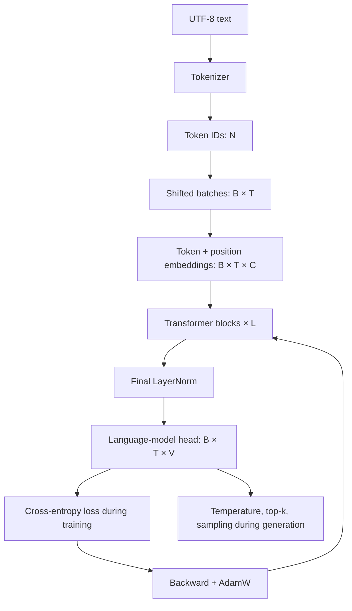

## Exploded end-to-end map

The compact diagram above shows the main route. The following map deliberately
expands the same system into its smallest teaching steps: data preparation,
every relevant tensor transformation, optimization, evaluation, persistence,
resume, and generation are shown in one place.

```mermaid
flowchart TD
    subgraph DATA["1 · Text and tokenizer"]
        D01["Locate dataset path"] --> D02["Read file bytes"]
        D02 --> D03["Decode UTF-8"]
        D03 --> D04["Preserve ordered text"]
        D04 --> D05["Observe symbols or byte fragments"]
        D05 --> D06["Build or load tokenizer vocabulary"]
        D06 --> D07["Create token → ID contract"]
        D07 --> D08["Create ID → token contract"]
        D08 --> D09["Encode text"]
        D09 --> D10["Verify encode/decode round trip"]
        D10 --> D11["Produce ordered token stream N"]
    end

    subgraph PREP["2 · Dataset preparation"]
        P01["Assign documents to train or validation"] --> P02["Tokenize each split"]
        P02 --> P03["Store compact uint16 token IDs"]
        P03 --> P04["Write train.bin"]
        P03 --> P05["Write val.bin"]
        P04 --> P06["Record tokenizer and token counts"]
        P05 --> P06
        P06 --> P07["Hash stable metadata"]
        P04 --> P08["Hash training bytes"]
        P05 --> P09["Hash validation bytes"]
        P07 --> P10["Build dataset fingerprint"]
        P08 --> P10
        P09 --> P10
        P10 --> P11["Validate completeness and identity"]
        P11 --> P12["Open token files with memmap"]
    end

    D11 --> P01

    subgraph RUNTIME["2A · Numerical runtime checks"]
        RT01["Import PyTorch"] --> RT02["Inspect PyTorch version"]
        RT02 --> RT03["Create one known integer tensor"]
        RT03 --> RT04["Verify shape 2 × 4"]
        RT04 --> RT05["Inspect the first row"]
        RT05 --> RT06["Inspect the second column"]
        RT06 --> RT07["Confirm integer dtype"]
        RT07 --> RT08["Establish the educational tensor reference"]
    end

    D11 -. "educational runtime gate" .-> RT01

    subgraph BATCH["3 · Training examples and batches"]
        B01["Choose data split"] --> B02["Check N > context length T"]
        B02 --> B03["Sample B valid start positions"]
        B03 --> B04["Build position grid B × T+1"]
        B04 --> B05["Read token windows"]
        B05 --> B06["Convert stored uint16 to int64"]
        B06 --> B07["Slice input X = window without last token"]
        B06 --> B08["Slice target Y = window without first token"]
        B07 --> B09["X shape B × T"]
        B08 --> B10["Y shape B × T"]
        B09 --> B11["Optionally pin CUDA host memory"]
        B10 --> B11
        B11 --> B12["Transfer batch to selected device"]
    end

    P12 --> B01

    subgraph BIGRAM["3A · Educational bigram path"]
        BG01["Take current token ID"] --> BG02["Use ID as row index in V × V table"]
        BG02 --> BG03["Return V logits for each position"]
        BG03 --> BG04["Flatten B × T × V to BT × V"]
        BG04 --> BG05["Compare with flattened targets"]
        BG05 --> BG06["Compute cross-entropy loss"]
        BG06 --> BG07["Clear old gradients"]
        BG07 --> BG08["Run backward"]
        BG08 --> BG09["Update bigram score table"]
        BG09 --> BG10["Use final-position logits"]
        BG10 --> BG11["Softmax and sample next ID"]
        BG11 --> BG12["Append ID and repeat"]
        BG12 --> BG13["Compare prefixes ending in the same token"]
        BG13 --> BG14["Observe the identical next-token distribution"]
        BG14 --> BG15["Identify one-token-memory limitation"]
        BG15 --> BG16["Replace direct V × V table with embeddings and attention"]
    end

    B09 -. "first complete learning loop" .-> BG01
    B10 -. "correct next-token labels" .-> BG05

    subgraph BUILD["3B · Model construction and initialization"]
        MC01["Load and validate ModelConfig"] --> MC02["Verify C divisible by H"]
        MC02 --> MC03["Compute head size D = C ÷ H"]
        MC03 --> MC04["Allocate token embedding V × C"]
        MC04 --> MC05["Allocate position embedding T × C"]
        MC05 --> MC06["Allocate L Transformer blocks"]
        MC06 --> MC07["Allocate final LayerNorm"]
        MC07 --> MC08["Allocate output head C → V"]
        MC08 --> MC09["Initialize embedding and linear weights"]
        MC09 --> MC10["Scale residual projections by depth"]
        MC10 --> MC11{"Tie input and output token weights?"}
        MC11 -- "yes" --> MC12["Reference token-embedding weight from output head"]
        MC11 -- "no" --> MC13["Keep independent output-head weight"]
        MC12 --> MC14["Move model state to selected device"]
        MC13 --> MC14
        MC14 --> MC15["Create decayed and non-decayed AdamW groups"]
        MC15 --> MC16["Run backend gradient self-check when required"]
        MC16 --> MC17["Model ready for forward and training"]
    end

    RT08 --> MC01
    BG16 --> MC01

    subgraph EMBED["4 · IDs become model states"]
        E01["Input IDs X: B × T"] --> E02["Lookup token embedding rows"]
        E02 --> E03["Token vectors: B × T × C"]
        E04["Create positions 0…T−1"] --> E05["Lookup position embedding rows"]
        E05 --> E06["Position vectors: T × C"]
        E03 --> E07["Broadcast and add token + position"]
        E06 --> E07
        E07 --> E08["Apply embedding dropout during training"]
        E08 --> E09["Initial residual stream R₀: B × T × C"]
    end

    B12 --> E01
    MC17 --> E02

    subgraph BLOCK["5 · One pre-norm Transformer block · repeated L times"]
        T01["Residual stream Rₗ"] --> T02["LayerNorm across C channels"]
        T02 --> T02A{"Q/K/V projection implementation?"}
        T02A -- "fused" --> T03["Project fused QKV: B × T × 3C"]
        T03 --> T04["Split into Q, K, V"]
        T02A -- "separate educational heads" --> T03S["Apply separate query, key, and value projections"]
        T03S --> T04
        T04 --> T05["Reshape heads: B × H × T × D"]
        T05 --> T05A{"Attention implementation?"}
        T05A -- "explicit teaching path" --> T06["Multiply Q by K transpose"]
        T06 --> T07["Attention scores: B × H × T × T"]
        T07 --> T08["Scale scores by 1 ÷ √D"]
        T08 --> T09["Apply lower-triangular causal mask"]
        T09 --> T10["Replace future scores with −∞"]
        T10 --> T11["Apply row-wise softmax"]
        T11 --> T12["Attention weights sum to 1"]
        T12 --> T13["Apply attention dropout during training"]
        T13 --> T14["Multiply attention weights by V"]
        T14 --> T15["Context per head: B × H × T × D"]
        T05A -- "optimized SDPA path" --> T14F["Run scaled-dot-product attention with causal flag"]
        T14F --> T15
        T15 --> T16["Transpose and concatenate heads"]
        T16 --> T17["Merged context: B × T × C"]
        T17 --> T18["Apply attention output projection C → C"]
        T18 --> T19["Apply output dropout during training"]
        T19 --> T20["Add attention update to Rₗ"]
        T01 --> T20
        T20 --> T21["Intermediate residual Uₗ"]
        T21 --> T22["Second LayerNorm across C"]
        T22 --> T23["MLP expansion C → 4C"]
        T23 --> T24["Apply GELU nonlinearity"]
        T24 --> T25["MLP projection 4C → C"]
        T25 --> T26["Apply MLP dropout during training"]
        T26 --> T27["Add MLP update to Uₗ"]
        T21 --> T27
        T27 --> T28["Next residual stream Rₗ₊₁: B × T × C"]
        T28 --> T29{"Another block?"}
        T29 -- "yes" --> T01
    end

    E09 --> T01

    subgraph OUTPUT["6 · Vocabulary prediction"]
        O01["Final residual stream R_L"] --> O02["Apply final LayerNorm"]
        O02 --> O03{"Training or generation?"}
        O03 -- "training" --> O04["Keep every time position"]
        O03 -- "generation" --> O05["Select final time position only"]
        O04 --> O06["Project C → V, optionally in vocabulary chunks"]
        O05 --> O06
        O06 --> O07["Raw vocabulary logits"]
        O07 --> O08["Training shape B × T × V"]
        O07 --> O09["Generation shape B × V"]
    end

    T29 -- "no" --> O01

    subgraph LOSS["7 · Loss and backward pass"]
        L01["Training logits B × T × V"] --> L02["Flatten logits to BT × V"]
        L03["Target IDs Y: B × T"] --> L04["Flatten targets to BT"]
        L02 --> L05["Stable log-softmax inside cross entropy"]
        L04 --> L05
        L05 --> L06["Select correct-token log probabilities"]
        L06 --> L07["Negate and average BT values"]
        L07 --> L08["Scalar loss"]
        L08 --> L09["Divide by accumulation steps K"]
        L09 --> L10["Autograd backward through output head"]
        L10 --> L11["Backward through final norm and blocks"]
        L11 --> L12["Backward through attention, MLP, and embeddings"]
        L12 --> L13["Accumulate parameter gradients"]
    end

    O08 --> L01
    B10 --> L03

    subgraph UPDATE["8 · Gradient safeguards and optimizer update"]
        U01["Accumulated gradients"] --> U02{"All K micro-batches complete?"}
        U02 -- "no" --> B01
        U02 -- "yes" --> U03["Unscale gradients when mixed precision is active"]
        U03 --> U04["Check gradients are finite"]
        U04 --> U05["Measure raw global gradient norm"]
        U05 --> U06{"Below integrity threshold?"}
        U06 -- "no" --> U07["Clear gradients and retry guarded step"]
        U07 --> B01
        U06 -- "yes" --> U08["Clip global norm if configured"]
        U08 --> U09["Compute scheduled learning rate"]
        U09 --> U10["Warmup or cosine decay"]
        U10 --> U11["Update Adam first moment"]
        U11 --> U12["Update Adam second moment"]
        U12 --> U13["Apply bias correction"]
        U13 --> U14["Apply decoupled weight decay to selected groups"]
        U14 --> U15["Update parameters"]
        U15 --> U16["Clear gradient buffers"]
        U16 --> U17["Advance training step"]
    end

    L13 --> U01

    subgraph EVAL["9 · Evaluation and diagnostics"]
        V01["Reach evaluation interval"] --> V02["Switch model to evaluation mode"]
        V02 --> V03["Disable gradient recording"]
        V03 --> V04["Sample K training batches"]
        V03 --> V05["Sample K validation batches"]
        V04 --> V06["Average training losses"]
        V05 --> V07["Average validation losses"]
        V07 --> V08["Measure context-sensitive target gain when enabled"]
        V06 --> V09["Record metrics"]
        V08 --> V09
        V09 --> V10["Restore training mode"]
    end

    U17 --> V01

    subgraph SAVE["10 · Best/latest checkpoint lifecycle"]
        C01["Evaluation metrics"] --> C02["Assemble model state"]
        C02 --> C03["Add optimizer and scaler state"]
        C03 --> C04["Add model, training, and tokenizer config"]
        C04 --> C05["Add step, metrics, and best loss"]
        C05 --> C06["Add RNG states"]
        C06 --> C07["Add dataset fingerprint"]
        C07 --> C08["Write temporary latest checkpoint"]
        C08 --> C09["Atomically replace latest checkpoint"]
        C01 --> C10{"Validation loss improved?"}
        C10 -- "yes" --> C11["Write temporary best checkpoint"]
        C11 --> C12["Atomically replace best checkpoint"]
        C10 -- "no" --> C13["Keep previous best checkpoint"]
    end

    V09 --> C01
    C09 --> B01
    C12 --> B01
    C13 --> B01

    subgraph RESUME["11 · Resume"]
        R01["Choose latest checkpoint from same family"] --> R02["Load payload safely"]
        R02 --> R03["Rebuild structural model configuration"]
        R03 --> R04["Load model parameters"]
        R04 --> R05["Load optimizer and scaler state"]
        R05 --> R06["Restore RNG states"]
        R06 --> R07["Verify tokenizer and dataset fingerprint"]
        R07 --> R08["Continue at saved step + 1"]
    end

    C09 --> R01
    R08 --> B01

    subgraph GENERATE["12 · Autoregressive generation"]
        G01["Choose best checkpoint"] --> G02["Rebuild model from saved config"]
        G02 --> G03["Load learned weights"]
        G03 --> G04["Move model to device and use evaluation mode"]
        G04 --> G05["Encode prompt into token IDs"]
        G05 --> G06["Crop prefix to latest T tokens"]
        G06 --> G07["Run embedding and Transformer forward pass"]
        G07 --> G08["Project final position to V logits"]
        G08 --> G09["Divide logits by temperature"]
        G09 --> G10["Optionally retain top-k logits"]
        G10 --> G11["Set excluded logits to −∞"]
        G11 --> G12["Apply softmax"]
        G12 --> G13["Sample one token with multinomial"]
        G13 --> G14["Append sampled ID to prefix"]
        G14 --> G15{"Requested token count reached?"}
        G15 -- "no" --> G06
        G15 -- "yes" --> G16["Decode all IDs back to text"]
        G16 --> G17["Return generated text"]
    end

    C12 --> G01
    O09 -. "last-position path" .-> G09
```

## The complete mathematical contract

For input IDs $X\in\{0,\ldots,V-1\}^{B\times T}$:

$$
R_0 = E_{tok}[X] + E_{pos}[0:T]
$$

Each pre-normalized Transformer block computes:

$$
U_l = R_l + \operatorname{MHA}(\operatorname{LN}_1(R_l))
$$

$$
R_{l+1} = U_l + \operatorname{MLP}(\operatorname{LN}_2(U_l))
$$

The output distribution is:

$$
Z = \operatorname{LN}_f(R_L)W_{vocab}^{\mathsf T},\qquad
p(y\mid x_{\le t})=\operatorname{softmax}(Z_{b,t,:})
$$

and the mean next-token negative log-likelihood is:

$$
\mathcal L=-\frac{1}{BT}\sum_{b=1}^{B}\sum_{t=1}^{T}
\log p\left(Y_{b,t}\mid X_{b,\le t}\right).
$$

---


# Module 0 — How to use this course


## Lesson 00 — How to use this course

### Lesson summary: goal and result

- **Before:** you have the course open, but you do not yet know what to install,
  what to click, or how the GitHub repository fits into the lessons.
- **Goal:** understand the platform, the companion code repository, and the
  minimum setup before the first technical lesson.
- **After:** you know how to read a lesson, where to find its code, what each
  course section means, and what you need on your computer if you want to run
  the project yourself.
- **Invariant:** you do not need expensive hardware or prior AI expertise to
  start reading. The course is still a step-by-step build from simple text to a
  small GPT.

### Quick orientation

The course has two main parts: the website and the GitHub repository.

The **website** contains the explanations. Each lesson tells you which step you
are studying, why it matters, and what state the project reaches after that
step.

The **GitHub repository** contains the real Python files used by the course.
When a lesson talks about a file such as
`study/lessons/01_read_text.py` or `study/snapshots/lesson_12/model.py`, that
file lives in the repository.

The **Programming** panel shows the exact code for the current lesson, the diff
from the previous lesson, and the complete snapshot of the project at that
point. Use the repository link when you want to open the same code directly on
GitHub.

You can read the course without installing anything. You only need the setup
below if you want to run the code on your own computer.

### What this course actually builds

This course builds a **small decoder-only GPT base model** from first
principles. That means the model learns the pretraining task: given a visible
prefix, predict the next token. It is not yet a ChatGPT-style assistant. The
point is to make the mechanism understandable before adding later adaptation
layers.

| Area | What you build here | What stays outside the core course |
|---|---|---|
| Base model | A small GPT-like Transformer trained on next-token prediction. | A conversational product with roles, tools, memory, moderation, or a hosted chat backend. |
| Pretraining | The data path, tokenizer, batches, loss, optimizer, checkpoints, and generation loop for causal language modeling. | Internet-scale data collection, large distributed training, and production data governance beyond the implemented checks. |
| Inference | Loading a saved checkpoint and sampling continuations from a prompt. | Retrieval, tool use, web browsing, long-term memory, or safety policy systems. |
| Fine-tuning | The place where fine-tuning would fit after a base model exists. | Classification fine-tuning, instruction fine-tuning, RLHF, and LoRA are future paths, not required steps in this build. |

### What you need before you start

You need only a normal computer to read the course. A laptop is enough.

If you want to run the code, the easiest setup is:

| Need | Minimum | Why it matters |
|---|---|---|
| Computer | macOS, Linux, or Windows | The project is ordinary Python and PyTorch code. |
| CPU/RAM | A recent laptop CPU and 8 GB RAM | Enough for the small study scripts and educational examples. |
| GPU | Optional | Helpful for longer training, not required for the first lessons. |
| Python | Python 3.12 recommended | Runs the lesson scripts and final project. |
| Git | Any recent Git install | Downloads the repository and lets you inspect changes. |
| GitHub account | Optional for reading, useful for starring/forking | You can view the code without an account, but an account helps if you want your own copy. |
| Editor | VS Code or any code editor | Useful when you want to open files locally. |

You do **not** need to know deep learning before Lesson 01. You should be
comfortable reading simple Python, installing a package, and using a terminal
at a basic level. The course introduces tokens, tensors, loss, attention, and
training when they become necessary.

### The companion GitHub repository

The code lives here:

[github.com/ferdinandobons/learn-gpt](https://github.com/ferdinandobons/learn-gpt)

Use the repository in three ways:

1. **Read the current lesson script.** Files in `study/lessons/` are small
   runnable scripts for the lesson.
2. **Inspect the lesson snapshot.** Files in `study/snapshots/lesson_XX/` show
   the project state after a specific lesson.
3. **Compare what changed.** The Programming panel shows the diff so you can
   see only the new or modified pieces.

The repository is not separate homework. It is the source code that the course
explains. The website and the repository are meant to be used together: read
the explanation on the website, then open the associated code when you want to
verify the exact implementation.

When a lesson links to code, read the links this way:

| Code location | How to use it |
|---|---|
| `study/lessons/XX_*.py` | Run or inspect the small script that demonstrates the lesson. |
| `study/snapshots/lesson_XX/` | See the whole project state after that lesson is complete. |
| Programming diff | Focus only on what changed since the previous lesson. |
| GitHub repository link | Open the same files outside the course viewer, fork them, or clone them locally. |

### What each part of a lesson means

Every technical lesson repeats the same structure so you never have to guess
how to read it.

| Part | Meaning |
|---|---|
| **Before** | The state of the project before this lesson adds anything. |
| **Goal** | The one job this lesson is trying to accomplish. |
| **After** | The new state once the lesson is complete. |
| **Invariant** | The rule that must stay true while the project changes. |
| **Understand the transformation** | The plain-English explanation. Start here. |
| **Transformation, step by step** | The exact movement from input to output. |
| **Where we are now** | What changed, what stayed true, and what comes next. |
| **Graph** | Where this lesson sits in the whole GPT pipeline. |
| **Mathematics** | Tensor shapes, notation, formulas, and small worked examples. |
| **Programming** | Syntax, code diff, and complete source snapshot. |

If a lesson feels hard, do not open every panel at once. Read the central
lesson first, then open only the panel that answers your current question.

### The best way to move through the course

Use this rhythm:

1. Read **Before**, **Goal**, **After**, and **Invariant**.
2. Read the central explanation.
3. Open **Graph** if you are lost in the big picture.
4. Open **Mathematics** if you need shapes or formulas.
5. Open **Programming** if you want the code.
6. Use the GitHub link for the lesson when you want the repository version.
7. Continue only when you can explain the change in one sentence.

The course is cumulative. Lesson 01 starts with reading text. Later lessons add
token IDs, batches, tensors, a first model, embeddings, attention, Transformer
blocks, training, checkpoints, generation, and a production-ready training
runtime. Nothing appears all at once.

### What happens next

Lesson 01 starts the real build. It reads the small study text file and turns
external text into a Python string. That sounds simple because it is simple.
The point is to make the first contract reliable before adding tokenizer logic,
tensors, models, and training.


# Module 1 — Text becomes tokens


## Lesson 01 — Read the text

### Lesson summary: goal and result

- **Before:** bytes stored in a text file, still outside the program
- **Goal:** bring the text into Python in a deterministic, readable form
- **After:** one ordered Unicode string that later lessons can inspect and transform
- **Invariant:** the characters and their order must keep the same meaning as in the source file

### Understand the transformation

A language model eventually learns from sequences, but at this point the
sequence is not yet available to Python. The runnable script reads the longer
checked-in file `data/study_sample.txt`. To keep the transformation visible,
the course also asks us to imagine a tiny teaching file containing
`The cat sleeps here.`. That sentence is the shared example, not a claim about
the literal first line of the real dataset. In both cases the starting object
is only a collection of bytes on disk. This first lesson establishes the most
basic contract of the course: **read one source of text reliably before trying
to transform it**.

Python needs to know how to interpret the stored numbers. The explicit
`encoding="utf-8"` argument supplies that rule. For the teaching mini-file,
UTF-8 decoding maps the byte sequence to the ordinary Python string
`"The cat sleeps here."`; the real script performs the same operation on the
complete study sample. The content is not learned, cleaned, shuffled, or
split. Only its **representation** changes: from encoded bytes managed by the
filesystem to characters managed by the program.

This distinction matters because bytes and characters are related but are not
the same thing. For the ASCII characters in the running example, one byte
happens to become one character. A character such as `è`, however, needs more
than one UTF-8 byte. That is why `len(text)` should be understood as a count of
decoded Python characters, not necessarily a count of bytes in the file. The
decoder performs this conversion without changing the character order.

At the end of the lesson there are still no token IDs, tensors, model
parameters, or predictions. That is intentional. We now have a trustworthy
starting object that later lessons can transform one step at a time. Preserving
the order is essential because next-token learning depends on prefixes: in the
shared example, `The` must come before `cat`, and `cat` must come before
`sleeps`.

### Transformation, step by step

1. **INPUT — Locate the source file**

   The program resolves the project path to `data/study_sample.txt`. The small
   sentence `The cat sleeps here.` is used alongside it as an inspectable
   stand-in for the same read/decode operation.

   **What to observe:** the path identifies *which* text will become the
   course's source sequence.

2. **OPERATION — Decode the bytes with UTF-8**

   The beginning of the ASCII byte sequence is
   `[84, 104, 101, 32, 99]`. UTF-8 maps it to `[T] [h] [e] [space] [c]`.

   **What to observe:** decoding changes the representation, not the linguistic
   order or meaning.

3. **INTERMEDIATE STATE — Hold one Python string**

   For the teaching mini-file, the result is the ordered object
   `"The cat sleeps here."`. Python can now measure it, slice it, and pass it
   to the next component.

   **What to observe:** the sentence is one string; it has not yet been divided
   into characters, words, or token IDs.

4. **CHECK — Inspect without modifying**

   `len(text)` reports the number of decoded characters and `text[:500]`
   displays a safe preview.

   **What to observe:** inspection confirms that the expected text and order
   arrived intact.

5. **OUTPUT — Establish the canonical sequence**

   The decoded string becomes the input contract for the tokenizer.

   **What to observe:** every later transformation starts from this exact
   ordered sequence.

### Where we are now

The program can now read language deterministically, but it still sees that
language only as a Python string. This is the correct stopping point for the
lesson: we have crossed the boundary from file storage into program memory
without introducing any modeling decision.

- **Changed:** file bytes have become one decoded, inspectable Python string.
- **Preserved:** the sentence content, character order, spaces, and punctuation.
- **Next:** the character tokenizer will define the discrete symbols the model can use.

> **If you remember one thing:** before a model can learn from text, the program
> must decode that text into one trustworthy ordered sequence.

### How to read the mathematics

There is no model equation yet. The letters are only names for sizes, not values being calculated.

| Notation | Read it as | Meaning here |
|---|---|---|
| $M$ | M | number of bytes stored in the source file |
| $N$ | N | number of ordered characters or tokens in a sequence |

### Visual worked example

> **Running example state:** treat the teaching mini-file
> `The cat sleeps here.` as one ordered sequence while distinguishing stored
> bytes from decoded characters; the runnable script applies the same contract
> to `data/study_sample.txt`.

Let the file contain a byte vector
$b=(b_0,\ldots,b_{M-1})$ with $b_i\in\{0,\ldots,255\}$. UTF-8 decoding is a
deterministic mapping

$$
\operatorname{decode}_{\mathrm{UTF8}}:
\{0,\ldots,255\}^{M}\longrightarrow \mathcal U^{N},
$$

where $\mathcal U$ is the set of Unicode characters. The input length is $M$;
the decoded string length is $N$. Decoding preserves sequence order, but it is
not generally a one-byte-to-one-character operation.

| Object | Mathematical view | Count |
|---|---|---:|
| encoded file | $(b_0,\ldots,b_{M-1})$ | $M$ bytes |
| decoded string | $(c_0,\ldots,c_{N-1})$ | $N$ characters |
| ordering contract | earlier source unit remains earlier after decoding | unchanged |

The short string `Aè.` makes the count difference visible:

```learngpt-visual
{"type":"labeled-grid","title":"UTF-8 bytes become decoded characters","description":"The byte count and character count can differ even though decoding preserves the intended order.","columns":["A","è","."],"rows":[{"label":"UTF-8 bytes · M = 4","cells":[{"value":"[65]","state":"default"},{"value":"[195 168]","state":"highlighted"},{"value":"[46]","state":"default"}]},{"label":"Decoded chars · N = 3","cells":[{"value":"A","state":"default"},{"value":"è","state":"highlighted"},{"value":".","state":"default"}]}]}
```

`A` and `.` each use one byte, while `è` uses two. Therefore $M=4$ and $N=3$
even though decoding produces exactly the intended three-character sequence.
For ASCII-only text, $M=N$ happens to hold; it is not the general UTF-8 rule.

The invariant needed by later lessons is positional:

$$
c_0 \prec c_1 \prec \cdots \prec c_{N-1},
$$

where $\prec$ means “appears before.” Tokenization may later group or map these
characters, but reading the file must not permute them.

### Reference code added in this lesson

```python
PROJECT_DIR = Path(__file__).resolve().parents[2]
DATASET_PATH = PROJECT_DIR / "data" / "study_sample.txt"
text = DATASET_PATH.read_text(encoding="utf-8")
print("Number of characters:", len(text))
print(text[:500])
```

The complete runnable entry point is `study/lessons/01_read_text.py`.

### Syntax and logic

- `Path(__file__)` represents the current script; `resolve()` makes its path
  absolute, and `parents[2]` reaches the repository root without depending on
  the terminal's current directory.
- The `/` operator on `Path` objects joins path components portably on macOS,
  Linux, and Windows.
- `read_text(encoding="utf-8")` opens, decodes, reads, and closes the file. The
  explicit encoding makes the byte-to-character conversion deterministic.
- `len(text)` counts Python Unicode characters rather than encoded UTF-8 bytes.
- `text[:500]` is a non-mutating slice from index `0` up to, but not including,
  index `500`; it provides a short inspection sample without changing `text`.

## Lesson 02 — Character tokenizer

### Lesson summary: goal and result

- **Before:** one decoded string whose characters have no numeric addresses
- **Goal:** assign every distinct character one stable integer ID and build the inverse lookup
- **After:** a deterministic, reversible character vocabulary
- **Invariant:** an ID is only a categorical address; it must not change the character it represents

### Understand the transformation

Python can already read the text, but a neural network cannot use a character
such as `c` directly as a row index. It needs an integer address. This lesson
creates that address system without claiming that the number measures meaning:
if `c` receives ID `4` and `a` receives ID `3`, `c` is not larger or more
important than `a`. The IDs simply point to different rows.

Modern GPT systems use the same idea, but with a stronger tokenizer. They do
not usually assign one ID to every character or one ID to every word. A common
production approach is BPE, where frequent byte or text fragments receive
their own token IDs and rare text can still be decomposed into smaller pieces.
Special tokens may also reserve IDs for boundaries such as end-of-text. This
lesson deliberately starts with characters because the entire vocabulary is
visible on the page. The concept to keep is the same one used later with BPE:
the model receives token IDs, and the tokenizer defines what each ID means.

The first operation is `set(text)`, which keeps one copy of every distinct
character. A set deliberately has no vocabulary order, so it cannot by itself
provide reproducible IDs. `sorted(...)` adds the missing rule: the same
collection of characters is placed in the same order on every run. Once that
ordered list exists, `enumerate(...)` can assign addresses `0, 1, ..., V-1`.

Two dictionaries are built together. `char_to_id` answers “which number
represents this character?”, while `id_to_char` answers the reverse question.
They must remain exact inverses. This is the first tokenizer contract: every
known character has one valid ID and every valid ID returns one character.

The running sentence uses a tiny didactic vocabulary so the mapping remains
visible. The runnable script instead builds its vocabulary from the complete
`study_sample.txt`, so its concrete IDs can differ. That script also performs
a manual encode/decode smoke test. Lesson 03 will turn those repeated lookups
into explicit functions and make the round trip the main contract.

### Transformation, step by step

1. **INPUT — Start from the decoded text**

   Use the complete dataset to define which characters are legal. The shared
   sentence `The cat sleeps here.` remains the small visual example.

   **What to observe:** repeated characters still appear many times, and none
   has an ID yet.

2. **OPERATION — Keep one copy of each character**

   ```learngpt-mermaid
   flowchart LR
       A["Text with repeated characters"] -->|"set(text)"| B["Unique characters, unordered"]
   ```

   **What to observe:** duplicates disappear, but an unordered set is not yet
   a safe vocabulary.

3. **OPERATION — Establish a reproducible order**

   `sorted(set(text))` produces one stable list. For the running sentence it
   begins with `space`, `.`, `T`, `a`, `c`, and continues through `t`.

   **What to observe:** sorting is the rule that makes later IDs repeatable.

4. **OPERATION — Build the two inverse maps**

   ```learngpt-mermaid
   flowchart LR
       C["Character"] -->|"char_to_id"| I["Integer ID"]
       I -->|"id_to_char"| C
   ```

   **What to observe:** `enumerate` supplies the IDs, and both dictionaries are
   filled from the same ordered list.

5. **OUTPUT — Obtain a reversible vocabulary**

   The program now has `V` valid addresses from `0` through `V-1` and can smoke
   test them on a short sample.

   **What to observe:** the mapping changes representation, not character
   identity or order.

### Where we are now

The project now has a stable boundary between text symbols and numeric
addresses. It still has no tensors, predictions, or learned values; it has
only defined the legal alphabet and how each symbol is named numerically.

- **Changed:** every distinct character has one deterministic integer ID.
- **Preserved:** character identity and the order of characters in any sequence.
- **Next:** encode and decode complete sequences through these two maps.

> **If you remember one thing:** a token ID is an address in a vocabulary, not
> a quantity or a meaning score.

### How to read the mathematics

Read the mapping arrow as ‘is converted into’. The braces describe the allowed integer IDs.

| Notation | Read it as | Meaning here |
|---|---|---|
| $N$ | N | number of ordered characters or tokens in a sequence |
| $V$ | V | vocabulary size: the number of possible token IDs |

### Visual worked example

> **Running example state:** build the character vocabulary from `The cat sleeps here.`; every character below comes from that sentence.

| Character | space | `.` | `T` | `a` | `c` | `e` | `h` | `l` | `p` | `r` | `s` | `t` |
|---|---:|---:|---:|---:|---:|---:|---:|---:|---:|---:|---:|---:|
| Assigned ID | 0 | 1 | 2 | 3 | 4 | 5 | 6 | 7 | 8 | 9 | 10 | 11 |

The ID is the row position in a stable vocabulary; it is not a numerical measure
of the character.

A character tokenizer builds two inverse maps:

$$
f:\text{character}\rightarrow\{0,\ldots,V-1\},\qquad
f^{-1}:\{0,\ldots,V-1\}\rightarrow\text{character}.
$$

For `cat.` a sorted vocabulary could be `[".", "a", "c", "t"]`:

| Character | `.` | `a` | `c` | `t` |
|---|---:|---:|---:|---:|
| ID | 0 | 1 | 2 | 3 |

Sorting is important for reproducibility: the same corpus produces the same
mapping in every process. Token IDs are **categorical addresses**, not measured
quantities: ID 3 is not three times ID 1.

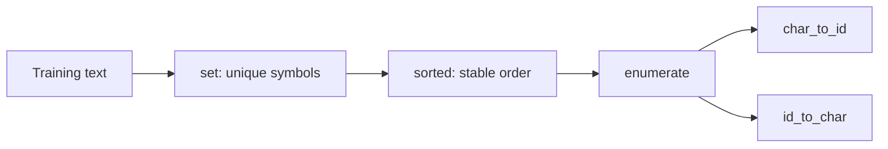

- **Shape:** text length $N\rightarrow$ vocabulary size $V$.
- **Implementation:** `study/lessons/02_character_tokenizer.py`.

### Reference code added in this lesson

```python
unique_chars = sorted(set(text))
char_to_id = {}
id_to_char = {}

for token_id, char in enumerate(unique_chars):
    char_to_id[char] = token_id
    id_to_char[token_id] = char
```

The code is exercised by `study/lessons/02_character_tokenizer.py`.

### Syntax and logic

- `set(text)` removes duplicates. Because sets have no meaningful vocabulary
  order, `sorted(...)` creates the same ordered character list on every run.
- `char_to_id = {}` and `id_to_char = {}` construct two independent empty
  dictionaries before the loop starts.
- `enumerate(unique_chars)` yields `(index, value)` pairs, so the zero-based
  index becomes the token ID.
- `char_to_id[char] = token_id` creates the forward lookup used while encoding.
- `id_to_char[token_id] = char` creates its inverse, so each ID can be decoded
  back to exactly one character.

## Lesson 03 — Encode and decode

### Lesson summary: goal and result

- **Before:** a readable string plus two inverse character/ID maps
- **Goal:** convert a complete sequence to ordered IDs and reconstruct it exactly
- **After:** reusable encode/decode operations with an executable round-trip check
- **Invariant:** sequence length, position, spaces, and punctuation must survive both directions

### Understand the transformation

The vocabulary from Lesson 02 tells us how to translate one character at a
time. A model, however, receives a sequence. `encode` therefore walks through
the input from left to right and performs one dictionary lookup at every
position. The result is a list of integers with the same length and order as
the original string.

For the running sentence, the first characters `T`, `h`, `e`, and `space`
become `[2, 6, 5, 0]` in the didactic vocabulary. The numbers are not added or
averaged; each one replaces exactly one character at the same position. This
ordered list is the first form of text that later batching and model code can
consume.

`decode` crosses the same boundary in reverse. It looks up each ID in
`id_to_char` and joins the recovered characters without inserting anything
between them. A successful result must match spaces, repeated letters, and the
final period—not merely produce a sentence that looks similar.

That is why the round trip is the central check:
`decode(encode(sample)) == sample`. The runnable script prints this boolean
result for inspection. A later automated test could assert the same condition.
An unknown character still fails loudly because this educational tokenizer has
no fallback token; that behavior makes vocabulary mistakes visible.

### Transformation, step by step

1. **INPUT — Pair text with the vocabulary**

   Begin with `"The cat sleeps here."` and the two maps produced by the
   previous lesson.

   **What to observe:** every character in the sample must already exist in
   `char_to_id`.

2. **OPERATION — Encode each position**

   ```learngpt-visual
   {"type":"labeled-grid","title":"Characters align with token IDs","description":"Each position keeps its order while the character representation is replaced by a categorical integer address.","columns":["T","h","e","space","c","a","t","…"],"rows":[{"label":"Token ID","cells":[{"value":"2","state":"default"},{"value":"6","state":"default"},{"value":"5","state":"default"},{"value":"0","state":"default"},{"value":"4","state":"highlighted"},{"value":"3","state":"default"},{"value":"11","state":"default"},{"value":"…","state":"default"}]}]}
   ```

   **What to observe:** one lookup changes the representation at each position;
   it does not reorder the sequence.

3. **INTERMEDIATE STATE — Hold the ordered ID list**

   The complete didactic sequence has length `20`, exactly like the source
   sentence.

   **What to observe:** integer values are now available to later numerical
   code, but they can still be traced back to their characters.

4. **OPERATION — Decode and join**

   Read every ID through `id_to_char` and concatenate the results:
   `[2, 6, 5, 0, ...] → "The cat sleeps here."`.

   **What to observe:** `join` adds no separator; spaces must come from their
   own IDs.

5. **CHECK — Verify the round trip**

   Compare the reconstructed string with the input.

   **What to observe:** equality proves that representation and order survived
   this sample's complete text→IDs→text path.

### Where we are now

Text can now cross the program's symbolic/numeric boundary in both directions.
The functions are still defined inside one lesson script, but their behavior
is concrete: an ordered string becomes ordered IDs and can be recovered
exactly.

- **Changed:** character-by-character lookups are now complete sequence operations.
- **Preserved:** length, order, spaces, punctuation, and character identity.
- **Next:** move these operations into one reusable tokenizer module.

> **If you remember one thing:** encoding is trustworthy only when decoding the
> same IDs reconstructs the same ordered text.

### How to read the mathematics

Function notation means ‘apply this operation’. The equality states the round-trip result that must remain true.

| Notation | Read it as | Meaning here |
|---|---|---|
| $N$ | N | number of ordered characters or tokens in a sequence |
| $f$ | f | lookup from a character to its integer ID |
| $f^{-1}$ | inverse f | lookup from an integer ID back to its character |

### Visual worked example

> **Running example state:** convert `The cat sleeps here.` to its exact character IDs and then reconstruct the same sentence.

```learngpt-mermaid
flowchart TB
    T1["The cat sleeps here."] -->|"encode"| IDS["2, 6, 5, 0, 4, 3, 11, 0, 10, 7, 5, 5, 8, 10, 0, 6, 5, 9, 5, 1"]
    IDS -->|"decode"| T2["The cat sleeps here."]
```

The order is preserved exactly, which is why the final decoded value equals the
starting text.

Encoding applies the lookup independently at every position:

$$
\operatorname{encode}(s_0\ldots s_{N-1})=
[f(s_0),\ldots,f(s_{N-1})].
$$

Using the canonical table above, `cat.` becomes `[4,3,11,1]`; decoding performs the inverse
lookups and joins the results. The key invariant is:

$$
\operatorname{decode}(\operatorname{encode}(text))=text.
$$

An unknown character cannot be encoded because `char_to_id` has no row for it.
This lesson deliberately fails loudly instead of silently changing the text.

- **Input:** `str[N]`.
- **Output:** integer sequence `[N]` and, in reverse, the original string.
- **Implementation:** `study/lessons/03_encode_decode.py`.

### Reference code added in this lesson

```python
def encode(text, char_to_id):
    token_ids = []

    for char in text:
        token_id = char_to_id[char]
        token_ids.append(token_id)

    return token_ids

def decode(token_ids, id_to_char):
    text = ""

    for token_id in token_ids:
        char = id_to_char[token_id]
        text += char

    return text

token_ids = encode(sample, char_to_id)
reconstructed_text = decode(token_ids, id_to_char)
print(reconstructed_text == sample)
```

This is the same explicit-loop implementation used by
`study/lessons/03_encode_decode.py`.

### Syntax and logic

- `def encode(text, char_to_id):` declares the encoding function and binds its
  two caller-supplied arguments to local names.
- `for char in text` visits the input from left to right; `append` preserves
  that order in `token_ids`.
- The decode loop performs the inverse lookup and adds each character to the
  reconstructed string in the same order.
- `token_ids = encode(sample, char_to_id)` and
  `reconstructed_text = decode(token_ids, id_to_char)` exercise the two
  directions in sequence rather than testing either function in isolation.
- `reconstructed_text == sample` compares the reconstructed string with the
  source; `print(...)` exposes the boolean result.

## Lesson 04 — Tokenizer module

### Lesson summary: goal and result

- **Before:** correct vocabulary and round-trip logic duplicated inside lesson scripts
- **Goal:** expose vocabulary creation, encoding, and decoding through one importable module
- **After:** one reusable tokenizer interface shared by later lessons
- **Invariant:** every caller must use the same maps in both encoding and decoding

### Understand the transformation

The tokenizer logic now works, but it lives inside a single script. Copying
those functions into every later lesson would create several independent
versions of the same contract. One copy could sort the vocabulary differently
from another. Both scripts could still run while the same ID referred to
different symbols.

This lesson changes organization rather than mathematics. The functions
`create_vocabulary`, `encode`, and `decode` move into
`study/snapshots/lesson_04/tokenizer.py`. A lesson script imports those public
names and no longer needs to know the loops inside them. The data path remains
text → IDs → text; responsibility for that path now belongs to one module.

The vocabulary must still be created from the complete source text, not from a
short prompt. The sample `The cat sleeps here.` can then be encoded only if all
its characters are present in that shared vocabulary. Both returned maps are
passed to the operations that need them, so their relationship stays explicit.

The module is the first single source of truth for token meaning. Any lesson
that imports it receives the same vocabulary construction and the same two
inverse operations instead of silently reimplementing them.

### Transformation, step by step

1. **INPUT — Identify the repeated logic**

   Vocabulary creation, encoding, and decoding currently exist in the lesson
   script that demonstrates them.

   **What to observe:** the behavior is correct, but its location makes reuse
   depend on copying code.

2. **OPERATION — Move behavior behind a module boundary**

   ```learngpt-mermaid
   flowchart TB
       A["Script-local tokenizer functions"] -->|"extract"| B["lesson_04/tokenizer.py"]
   ```

   **What to observe:** implementation moves; token meaning does not.

3. **INTERMEDIATE STATE — Expose a small public interface**

   The module exports `create_vocabulary`, `encode`, and `decode`.

   **What to observe:** callers depend on these names and return values, not on
   the loops used internally.

4. **OPERATION — Import and use the shared functions**

   The lesson client creates both maps from `full_text`, encodes the sample,
   and decodes the resulting IDs.

   **What to observe:** the same map pair crosses the complete round trip.

5. **OUTPUT — Establish one tokenizer contract**

   Later lessons can import a stable checkpoint-specific implementation.

   **What to observe:** one shared module now protects the meaning of every ID.

### Where we are now

The tokenizer is no longer private setup hidden inside one demonstration. It
is an explicit dependency that later lesson scripts can share while remaining
pinned to this lesson's snapshot.

- **Changed:** duplicated script logic became one importable interface.
- **Preserved:** vocabulary order, encode/decode behavior, and round-trip meaning.
- **Next:** use the shared tokenizer to create separate training and validation streams.

> **If you remember one thing:** reusable tokenization means every component
> agrees on what each integer ID represents.

### How to read the mathematics

This lesson uses software contracts more than equations. Read each arrow as data crossing a module boundary.

| Notation | Read it as | Meaning here |
|---|---|---|
| $V$ | V | vocabulary size: the number of possible token IDs |

### Visual worked example

> **Running example state:** package the encode/decode operations for `The cat sleeps here.` behind one reusable tokenizer interface.

```learngpt-mermaid
flowchart LR
    FULL["full_text"] --> CV["create_vocabulary(full_text)"]
    CV --> C2I["char_to_id"]
    CV --> I2C["id_to_char"]
    SAMPLE["sample"] --> EN["encode(sample, char_to_id)"]
    C2I --> EN
    EN --> IDS["token_ids"]
    IDS --> DE["decode(token_ids, id_to_char)"]
    I2C --> DE
    DE --> TXT["reconstructed_text"]
```

Later lessons call the same interface instead of rebuilding these operations.

This lesson turns the preceding operations into a reusable interface. A correct
tokenizer keeps vocabulary construction, encoding, and decoding connected.
Changing either map would break the round trip that this lesson verifies.

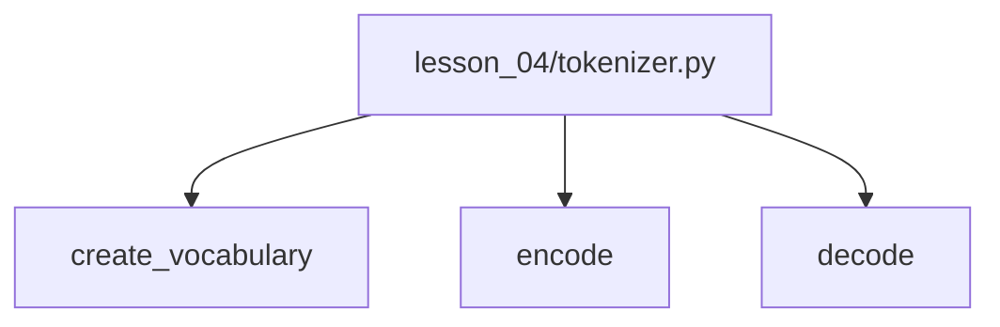

### Reference code added in this lesson

```python
from study.snapshots.lesson_04.tokenizer import create_vocabulary, encode, decode

char_to_id, id_to_char = create_vocabulary(full_text)
token_ids = encode(sample, char_to_id)
reconstructed_text = decode(token_ids, id_to_char)
```

The reusable implementation lives in `study/snapshots/lesson_04/tokenizer.py`;
`study/lessons/04_test_tokenizer.py` is its executable client.

### Syntax and logic

- `from package.module import name` loads selected public names from a module.
- `char_to_id, id_to_char = ...` is tuple unpacking: the two returned objects
  are assigned to two names in one statement.
- The snapshot path contains `lesson_04`, making the dependency explicit and
  preventing future lesson changes from silently rewriting this checkpoint.
- `create_vocabulary(full_text)` builds both lookup tables from the complete
  corpus rather than from the shorter sample being encoded.
- `encode(sample, char_to_id)` and `decode(token_ids, id_to_char)` consume only
  the module's public interface, so the script does not depend on its internal
  loops. That is the first module boundary in the project.

# Module 2 — Sequences become training examples


## Lesson 05 — Training and validation

### Lesson summary: goal and result

- **Before:** one ordered token stream with no separation between learning and measurement
- **Goal:** reserve a prefix for training and a held-out suffix for validation
- **After:** two non-overlapping streams with distinct responsibilities
- **Invariant:** token values and order inside each selected region must not change

### Understand the transformation

If the model learns from every token and is then measured on those same token
positions, the measurement cannot tell us how it behaves on held-out data. We
therefore give the two regions different jobs. The training region may
contribute to parameter updates; the validation region is reserved for later
evaluation and must not create training gradients.

The educational dataset is one ordered character stream, so the lesson uses a
contiguous 90/10 split. For `N` token IDs, `int(0.9 * N)` gives the boundary:
indices before it belong to training and indices from it onward belong to
validation. The boundary is also the number of training tokens and the first
validation index—not the last training index.

Slicing does not shuffle or duplicate the selected positions. Local order
inside each region remains exactly as it was in the source, which is essential
because the next-token task depends on adjacency. Identical text can still
occur naturally in both regions; the guarantee is that the same indexed token
positions are not assigned to both.

This simple contiguous split is appropriate for the small didactic file. A
large document corpus should normally assign whole documents to splits before
concatenating their tokens, otherwise related fragments could leak across the
boundary. The principle remains the same: learning evidence and measurement
evidence need separate ownership.

### Transformation, step by step

1. **INPUT — Start from one ordered stream**

   ```text
   token IDs: d[0], d[1], ... , d[N-1]
   ```

   **What to observe:** all positions currently have the same role.

2. **OPERATION — Calculate the split boundary**

   `split_index = int(len(token_ids) * 0.9)` computes
   `floor(0.9N)` for this non-negative length.

   **What to observe:** the boundary is a legal slice position, not a token
   value.

3. **OPERATION — Select the training prefix**

   `training_data = token_ids[:split_index]`.

   **What to observe:** it contains the first `split_index` positions in their
   original order.

4. **OPERATION — Hold out the validation suffix**

   `validation_data = token_ids[split_index:]`.

   **What to observe:** the two half-open slices are adjacent and do not share
   indexed positions.

5. **OUTPUT — Assign distinct responsibilities**

   ```learngpt-mermaid
   flowchart LR
       A["Token 0"] --> TRAIN["Training region"]
       TRAIN -->|"split_index = floor(0.9N)"| VAL["Validation region"]
       VAL --> Z["End boundary N · exclusive"]
   ```

   **What to observe:** later batches must be sampled from one chosen split;
   only training batches may drive optimizer updates.

### Where we are now

The project now distinguishes data that may teach the model from data that may
only measure it. No model has been trained yet, but the evidence boundary is in
place before any gradient can cross it.

- **Changed:** one undifferentiated stream became training and validation regions.
- **Preserved:** token values, local order, and adjacency within each region.
- **Next:** turn a window from one selected split into inputs and next-token targets.

> **If you remember one thing:** validation is informative only when its token
> positions do not participate in training updates.

### How to read the mathematics

The floor brackets mean ‘round down’. A colon in the mathematical slice has the same role as a Python slice.

| Notation | Read it as | Meaning here |
|---|---|---|
| $N$ | N | number of ordered characters or tokens in a sequence |
| $d$ | d | complete ordered token stream |
| $r$ | r | fraction assigned to training |
| $n_{train}$ | n train | exclusive boundary between the two slices |

### Visual worked example

> **Running example state:** repeat the canonical sentence to form an ordered corpus, then split that stream without shuffling it.

```learngpt-mermaid
flowchart LR
    A["Ordered token stream · index 0"] --> TRAIN["Training tokens"]
    TRAIN -->|"Boundary floor(0.9N)"| VAL["Validation tokens"]
    VAL --> Z["End boundary N · exclusive"]
```

Only the left region contributes gradients; the right region measures the model
without teaching it.

Given a token stream $d=[d_0,\ldots,d_{N-1}]$ and split ratio $r=0.9$:

$$n_{train}=\lfloor rN\rfloor,$$
$$d_{train}=d[:n_{train}],\qquad d_{val}=d[n_{train}:].$$

The optimizer sees only training tokens. Validation estimates behavior on held-
out data. Keeping contiguous order preserves local sequences; for large shuffled
document corpora, the document assignment should be separated before token
concatenation to prevent leakage.

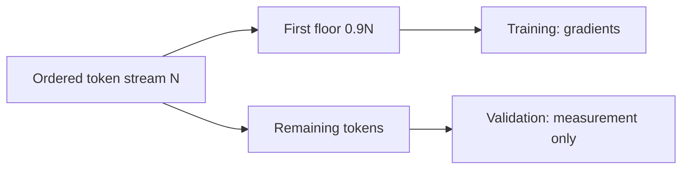

### Reference code added in this lesson

```python
token_ids = encode(text, char_to_id)
split_index = int(len(token_ids) * 0.9)
training_data = token_ids[:split_index]
validation_data = token_ids[split_index:]
```

This split is demonstrated in `study/lessons/05_split_dataset.py`.

### Syntax and logic

- `len(token_ids) * 0.9` computes a floating-point position at 90 percent of
  the sequence; `int(...)` truncates it to a legal list index.
- `[:split_index]` selects the prefix and `[split_index:]` selects the remaining
  suffix. Python's half-open slicing makes the two regions adjacent and
  non-overlapping.
- `training_data = token_ids[:split_index]` and
  `validation_data = token_ids[split_index:]` partition one continuous
  sequence without assigning the same indexed token positions to both sets.
  The same text may still occur naturally in both regions. Later batches
  sample only from the selected split.
- `split_index = int(len(token_ids) * 0.9)` applies the usual 90/10 ratio, giving
  most tokens to optimization while retaining a
  meaningful held-out measurement.

### Code ↔ mathematics ↔ meaning

This section is included here because the code directly implements a mathematical transformation.

| Code | Mathematical reading | Plain meaning |
|---|---|---|
| `int(len(token_ids) * 0.9)` | $n_{train}=\lfloor0.9N\rfloor$ | choose the split boundary, equal to the number of training tokens and the first validation index |

## Lesson 06 — Input and target

### Lesson summary: goal and result

- **Before:** an ordered token stream with no explicit prediction labels
- **Goal:** turn one window of `T+1` tokens into `T` inputs and `T` next-token targets
- **After:** two equally long, position-by-position aligned sequences
- **Invariant:** target position `t` must always be the token immediately after input position `t`

### Understand the transformation

A raw token sequence contains the answers the model should learn, but those
answers are not yet marked. Next-token learning creates labels from the
sequence itself. We take `T+1` consecutive tokens, keep the first `T` as input,
and keep the last `T` as target. The two views overlap, but the target starts
one position later.

Using the shared IDs `[4, 7, 1, 9, 2]`, input becomes `[4, 7, 1, 9]` and target
becomes `[7, 1, 9, 2]`. Read the columns vertically: `4` is paired with `7`,
`7` with `1`, `1` with `9`, and `9` with `2`. A single incorrect offset would
teach a different task even though both arrays could still have the expected
length.

The growing prefixes provide another way to read the same alignment. The first
question is “after `[4]`, what comes next?”; the next is “after `[4,7]`, what
comes next?” and so on. The imminent bigram model will initially use only the
current token at each position, while a later causal Transformer will use the
whole visible prefix. The input/target contract supports both.

Nothing is predicted in this lesson. We are manufacturing supervised examples
from ordered data. That separation matters: the correct answer comes from the
shifted source sequence, not from the model or from a hand-written label.

The same rule scales by sliding a window over the stream. A start index `s`
selects `data[s : s + T + 1]`; the input is everything except the last token
and the target is everything except the first token. If the next start is
`s + 1`, the windows overlap heavily and the stride is one. A larger stride
skips more positions and creates fewer examples. Later random batching chooses
valid starts instead of walking through every stride, but every sampled window
still asks the same question: “given this visible context, what is the token
immediately after each position?”

### Transformation, step by step

1. **INPUT — Select `T+1` consecutive tokens**

   ```text
   window = [4, 7, 1, 9, 2]    T = 4
   ```

   **What to observe:** the extra fifth token is needed to answer the fourth
   prediction question.

2. **OPERATION — Take the first `T` tokens as input**

   `X = window[:-1] = [4, 7, 1, 9]`.

   **What to observe:** input keeps the original order and omits only the final
   answer token.

3. **OPERATION — Shift one position for targets**

   `Y = window[1:] = [7, 1, 9, 2]`.

   **What to observe:** target has the same length as input but begins at the
   following token.

4. **CHECK — Read every aligned column**

   ```learngpt-visual
   {"type":"labeled-grid","title":"One-position target shift","description":"Every input position is aligned with the token that follows it in the same source window.","columns":["t = 0","t = 1","t = 2","t = 3"],"rows":[{"label":"Input X","cells":[{"value":"4","state":"default"},{"value":"7","state":"highlighted"},{"value":"1","state":"default"},{"value":"9","state":"default"}]},{"label":"Target Y","cells":[{"value":"7","state":"highlighted"},{"value":"1","state":"default"},{"value":"9","state":"default"},{"value":"2","state":"default"}]}]}
   ```

   **What to observe:** each column means “predict this next token.”

5. **OUTPUT — Obtain `T` supervised positions**

   The two arrays each have shape `[T]` and together define four prediction
   targets in the example.

   **What to observe:** labels came from shifting the data, not from model
   output.

### Where we are now

The data now contains explicit questions and answers for next-token learning.
The pair is still only one window from one region, so it does not yet expose
the model to the rest of the corpus.

- **Changed:** one unlabeled window became aligned input and target sequences.
- **Preserved:** source order and the immediate-next-token relationship.
- **Next:** sample valid windows from many starting positions.

> **If you remember one thing:** targets are the same ordered sequence shifted
> exactly one token forward.

### How to read the mathematics

Subscripts describe selected positions. Read $w_{0:T}$ as ‘window positions zero up to T, excluding T’.

| Notation | Read it as | Meaning here |
|---|---|---|
| $T$ | T | number of token positions in one context window |
| $X$ | X | input token IDs or the current input matrix |
| $Y$ | Y | correct next-token IDs used as training targets |

### Visual worked example

> **Running example state:** use the shorthand sequence `The cat sleeps here .` → `[4,7,1,9,2]` to pair each token with the token that follows it.

| Time position | 0 | 1 | 2 | 3 |
|---|---:|---:|---:|---:|
| Input $X$ | 4 | 7 | 1 | 9 |
| Target $Y$ | 7 | 1 | 9 | 2 |

Read each column vertically: input `4` must predict target `7`, input prefix
`[4,7]` must predict `1`, and so on.

One window contains $T+1$ tokens. The first $T$ are questions and the last $T$
are the answers shifted by one:

$$x=w_{0:T},\qquad y=w_{1:T+1}.$$

| Time | 0 | 1 | 2 | 3 |
|---|---:|---:|---:|---:|
| input $x$ | 4 | 7 | 1 | 9 |
| target $y$ | 7 | 1 | 9 | 2 |

This single row supplies four nested targets: `4→7`, `[4,7]→1`,
`[4,7,1]→9`, and `[4,7,1,9]→2`. The first bigram model will initially use
only the current token at each position. A later causal Transformer computes
all positions in parallel while a mask prevents access to future tokens.

### Reference code added in this lesson

```python
input_tokens = token_ids[:CONTEXT_SIZE]
target_tokens = token_ids[1 : CONTEXT_SIZE + 1]

for position in range(CONTEXT_SIZE):
    context = input_tokens[: position + 1]
    next_token = target_tokens[position]
```

See the printed prefix-to-next-token pairs in
`study/lessons/06_input_target.py`.

### Syntax and logic

- The input slice begins at token `0`; the target slice begins at token `1`, so
  both lists have length `CONTEXT_SIZE` but differ by a one-token shift.
- The stop index is exclusive. `CONTEXT_SIZE + 1` is necessary to include the
  target paired with the last input position.
- `range(CONTEXT_SIZE)` yields positions `0` through `T - 1`.
- `context = input_tokens[: position + 1]` grows the visible prefix by one token
  on every iteration.
- `next_token = target_tokens[position]` selects exactly the next-token label
  paired with the current prefix.

### Code ↔ mathematics ↔ meaning

This section is included here because the code directly implements a mathematical transformation.

| Code | Mathematical reading | Plain meaning |
|---|---|---|
| `x = window[:-1]` | $x=w_{0:T}$ | keep the first T tokens |
| `y = window[1:]` | $y=w_{1:T+1}$ | shift answers by one token |

## Lesson 07 — Random examples

### Lesson summary: goal and result

- **Before:** one correctly shifted example fixed at one location
- **Goal:** sample different `T+1` windows without ever reading beyond the selected split
- **After:** a reproducible stream of varied, valid input/target examples
- **Invariant:** order inside each window and the one-token input/target shift must remain exact

### Understand the transformation

The previous lesson always used one known location. Training on that same
window repeatedly would expose the model to only a tiny part of the corpus.
`create_example` solves this by drawing a new start index and applying the same
shifted-window rule there. Randomness changes *where* the example comes from,
not the order of tokens inside it.

The upper bound is easy to get wrong because input length is `T` but extraction
needs `T+1` source tokens. For data length `N`, the final legal start is
`N-T-1`. Python's `random.randint(a, b)` includes both endpoints, so the exact
call is `randint(0, N-T-1)`. A start of `N-T` would leave no final target for
the last input position.

Once start `s` is chosen, input is `data[s:s+T]` and target is
`data[s+1:s+T+1]`. These slices refer to adjacent views of the same local
sequence. Random sampling does not shuffle characters within either view and
does not sample across the boundary of the data split passed to the function.

`random.seed(42)` makes the demonstration reproducible: a fresh run produces
the same sequence of sampled starts. The seed does not make every example
identical; it makes the sequence of random choices repeatable for inspection.

### Transformation, step by step

1. **INPUT — Receive one selected data split**

   Let `N=len(data)` and choose a context size `T`.

   **What to observe:** the function can only sample positions contained in
   this argument; it does not choose training versus validation itself.

2. **CONSTRAINT — Calculate the last legal start**

   ```text
   legal starts: 0 ... N-T-1
   invalid tail:             N-T ... N-1
   ```

   **What to observe:** every legal start leaves room for one extra target
   token.

3. **OPERATION — Draw a reproducible random start**

   `s = random.randint(0, N-T-1)`.

   **What to observe:** both endpoints are valid because `randint` is
   inclusive.

4. **OPERATION — Create the shifted pair**

   ```learngpt-visual
   {"type":"tensor-flow","title":"Derive input and target from one source window","description":"A window of T+1 ordered IDs supplies two overlapping T-token views shifted by one position.","stages":[{"label":"Source window · data[s:s+T+1]","shape":"[T+1]","note":"Contains every input token plus the final target."},{"label":"Input X · data[s:s+T]","shape":"[T]","note":"Keeps the first T positions."},{"label":"Target Y · data[s+1:s+T+1]","shape":"[T]","note":"Keeps the last T positions, shifted one step."}]}
   ```

   **What to observe:** the two returned lists have length `T` and remain
   shifted by one.

5. **OUTPUT — Return one varied training example**

   Repeated calls can cover many local contexts while preserving each local
   sequence.

   **What to observe:** variation comes from the start position, not from
   reordering tokens.

### Where we are now

The project can now ask the selected split for many different examples instead
of always reading its beginning. Each call still returns only one pair; the
next lesson will group several calls into a batch.

- **Changed:** one fixed example became a sampler over all valid starts.
- **Preserved:** split boundaries, local token order, and target alignment.
- **Next:** collect several sampled pairs into rectangular Python lists.

> **If you remember one thing:** the highest legal start is `N-T-1` because a
> `T`-token input always needs one additional target token.

### How to read the mathematics

The inequality describes every legal start position; it prevents the final target from falling past the data.

| Notation | Read it as | Meaning here |
|---|---|---|
| $N$ | N | number of ordered characters or tokens in a sequence |
| $T$ | T | number of token positions in one context window |

### Visual worked example

> **Running example state:** draw a random context window from repeated copies of `[4,7,1,9,2]`, the shorthand encoding of the canonical sentence.

```learngpt-visual
{"type":"labeled-grid","title":"Sample a valid shifted window","description":"At start s = 2 with T = 4, the five-token window yields aligned four-token input and target rows.","columns":["0","1","2","3","4"],"rows":[{"label":"Window · data[2:7]","cells":[{"value":"1","state":"highlighted"},{"value":"9","state":"highlighted"},{"value":"2","state":"highlighted"},{"value":"4","state":"highlighted"},{"value":"7","state":"highlighted"}]},{"label":"Input X","cells":[{"value":"1","state":"default"},{"value":"9","state":"default"},{"value":"2","state":"default"},{"value":"4","state":"default"},{"value":"—","state":"masked"}]},{"label":"Target Y","cells":[{"value":"—","state":"masked"},{"value":"9","state":"default"},{"value":"2","state":"default"},{"value":"4","state":"default"},{"value":"7","state":"default"}]}]}
```

The final valid start must still leave room for the extra target token.

For stream length $N$, valid start indices satisfy
$0\le s\le N-T-1$. Sampling $s$ uniformly gives:

$$w=d[s:s+T+1].$$

The last valid start is $N-T-1$ because the target needs the extra token at
$s+T$. This lesson changes only the sampled start; it does not yet introduce an
optimizer or a document-level sampling policy.

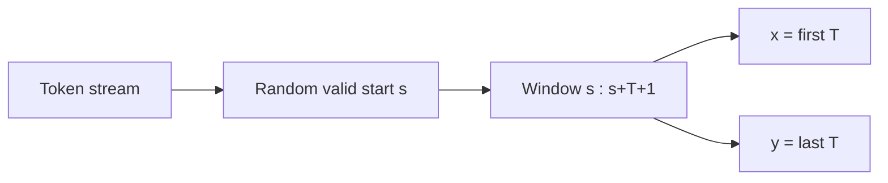

### Reference code added in this lesson

```python
def create_example(data, context_size):
    start_position = random.randint(0, len(data) - context_size - 1)
    input_tokens = data[start_position : start_position + context_size]
    target_tokens = data[start_position + 1 : start_position + context_size + 1]
    return input_tokens, target_tokens

random.seed(42)
```

The function is introduced in `study/lessons/07_random_examples.py`.

### Syntax and logic

- `random.randint(a, b)` includes both endpoints. The upper bound reserves one
  extra token because targets are shifted by one.
- `data[start_position : start_position + context_size]` extracts exactly `T`
  consecutive input IDs from the sampled position.
- `data[start_position + 1 : start_position + context_size + 1]` shifts both
  target bounds by one while preserving the same length as the input window.
- `return input_tokens, target_tokens` returns a tuple, which callers unpack
  into two names.
- `random.seed(42)` resets Python's generator to a known state. The number has
  no special modeling meaning; consistency is what matters.

### Code ↔ mathematics ↔ meaning

This section is included here because the code directly implements a mathematical transformation.

| Code | Mathematical reading | Plain meaning |
|---|---|---|
| `randint(0, N-T-1)` | $0\le s\le N-T-1$ | sample only valid starts; both endpoints are included |

## Lesson 08 — Python batch

### Lesson summary: goal and result

- **Before:** one sampled input/target pair per function call
- **Goal:** collect `B` independent pairs into two rectangular Python lists
- **After:** one input batch and one target batch with conceptual shape `[B,T]`
- **Invariant:** input row `b` must remain paired with target row `b`

### Understand the transformation

One sampled example is enough to inspect alignment, but model training should
process several independent contexts per update. A batch groups those examples
without joining their token sequences together. The new outer list is the
batch axis; each inner list remains one ordered context of length `T`.

The function keeps inputs and targets in separate containers because the model
will receive one and the loss will compare predictions with the other. It calls
`create_example` once per row and appends both members of the returned pair
during the same loop iteration. This preserves the relationship between row
`b` of `batch_inputs` and row `b` of `batch_targets`.

For `B=3` and `T=4`, each container looks like a `3 × 4` grid. Rows are
independent examples; columns are relative positions inside those examples.
Column 0 does not mean that all rows came from the same corpus location. It
means only “the first position of each sampled window.”

This lesson intentionally uses ordinary Python lists. Their nested structure
makes every row and value visible and becomes the reference behavior for the
tensor conversion in Lesson 09. There is no `torch.stack` or tensor operation
yet.

### Transformation, step by step

1. **INPUT — Choose batch and context sizes**

   Ask for `B` examples, each with `T` input positions and `T` targets.

   **What to observe:** every sampled row must have the same length for the
   outer lists to be rectangular.

2. **OPERATION — Sample one aligned pair**

   `create_example(data, context_size)` returns `input_tokens` and
   `target_tokens`.

   **What to observe:** the one-token shift is already correct before batching.

3. **OPERATION — Append both rows together**

   ```text
   batch_inputs.append(input_tokens)
   batch_targets.append(target_tokens)
   ```

   **What to observe:** both lists grow in lockstep, so row identity is
   preserved.

4. **INTERMEDIATE STATE — Form two grids**

   ```learngpt-visual
   {"type":"labeled-grid","title":"A Python batch is a pair of aligned row collections","description":"Each input row and target row occupy the same batch index while target values remain shifted by one token.","columns":["t = 0","t = 1","t = 2","t = 3"],"rows":[{"label":"X row 0","cells":[{"value":"4","state":"default"},{"value":"7","state":"default"},{"value":"1","state":"default"},{"value":"9","state":"default"}]},{"label":"Y row 0","cells":[{"value":"7","state":"highlighted"},{"value":"1","state":"highlighted"},{"value":"9","state":"highlighted"},{"value":"2","state":"highlighted"}]},{"label":"X row 1","cells":[{"value":"7","state":"default"},{"value":"1","state":"default"},{"value":"9","state":"default"},{"value":"2","state":"default"}]},{"label":"Y row 1","cells":[{"value":"1","state":"highlighted"},{"value":"9","state":"highlighted"},{"value":"2","state":"highlighted"},{"value":"4","state":"highlighted"}]},{"label":"X row 2","cells":[{"value":"1","state":"default"},{"value":"9","state":"default"},{"value":"2","state":"default"},{"value":"4","state":"default"}]},{"label":"Y row 2","cells":[{"value":"9","state":"highlighted"},{"value":"2","state":"highlighted"},{"value":"4","state":"highlighted"},{"value":"7","state":"highlighted"}]}]}
   ```

   **What to observe:** the outer dimension is `B=3`; each row length is `T=4`.

5. **OUTPUT — Return the paired Python batches**

   `return batch_inputs, batch_targets`.

   **What to observe:** batching adds an example axis; it does not concatenate
   the three contexts into one long sequence.

### Where we are now

The project now has a readable batch reference: two nested lists with the same
number of rows and the same row lengths. The structure is correct, but it still
lacks tensor metadata and PyTorch operations.

- **Changed:** individual examples became two conceptual `[B,T]` grids.
- **Preserved:** order inside each row and pairing between input/target rows.
- **Next:** convert the same values to PyTorch tensors.

> **If you remember one thing:** a batch adds independent rows; it never merges
> their token prefixes.

### How to read the mathematics

A bracketed grid is a matrix. Rows are examples and columns are time positions.

| Notation | Read it as | Meaning here |
|---|---|---|
| $B$ | B | number of independent examples in one batch |
| $T$ | T | number of token positions in one context window |
| $X$ | X | input token IDs or the current input matrix |
| $Y$ | Y | correct next-token IDs used as training targets |

### Visual worked example

> **Running example state:** stack several windows from the repeated canonical sequence into one Python batch.

$$
X=\begin{bmatrix}
4&7&1&9\\
7&1&9&2\\
1&9&2&4
\end{bmatrix}
$$

Each row is one independent example; columns represent the same relative time
positions. The visual grid therefore has shape $[B,T]=[3,4]$.

Repeat the window operation $B$ times and stack rows:

$$X=\begin{bmatrix}x^{(1)}\\x^{(2)}\\\vdots\\x^{(B)}\end{bmatrix},\qquad
Y=\begin{bmatrix}y^{(1)}\\y^{(2)}\\\vdots\\y^{(B)}\end{bmatrix}.$$

For $B=3,T=4$:

$$X=\begin{bmatrix}4&7&1&9\\7&1&9&2\\1&9&2&4\end{bmatrix}
\in\mathbb Z^{3\times4}.$$

Rows are independent examples; columns are time positions. A Python list shows
the geometry but supplies no dtype, device, automatic differentiation, or fast
matrix kernels.

### Reference code added in this lesson

```python
def create_batch(data, batch_size, context_size):
    batch_inputs = []
    batch_targets = []

    for _ in range(batch_size):
        input_tokens, target_tokens = create_example(data, context_size)
        batch_inputs.append(input_tokens)
        batch_targets.append(target_tokens)

    return batch_inputs, batch_targets
```

The nested-list representation is visible in
`study/lessons/08_python_batch.py`.

### Syntax and logic

- `batch_inputs = []` and `batch_targets = []` create separate row containers
  before any example is sampled.
- `for _ in ...` repeats an action when the loop index itself is intentionally
  unused; `_` communicates that intent.
- `input_tokens, target_tokens = create_example(data, context_size)` samples one
  aligned pair and unpacks the returned tuple.
- `list.append(value)` mutates the list by adding one example at the end.
- Inputs and targets are collected separately but in the same loop, so row `i`
  in one list remains paired with row `i` in the other.
- The result has conceptual shape `[B, T]`: `B` outer-list examples, each with
  `T` token IDs.

### Code ↔ mathematics ↔ meaning

This section is included here because the code directly implements a mathematical transformation.

| Code | Mathematical reading | Plain meaning |
|---|---|---|
| `batch_inputs.append(input_tokens)` | $X\in\mathbb Z^{B\times T}$ conceptually | add one row; the outer Python list becomes the batch axis |

## Lesson 09 — PyTorch batch

### Lesson summary: goal and result

- **Before:** paired rectangular Python lists with only conceptual `[B,T]` structure
- **Goal:** convert both grids to rank-2 PyTorch tensors and inspect their shape
- **After:** CPU tensors with inferred integer dtype and preserved values
- **Invariant:** conversion must not change any ID, row, or input/target pairing

### Understand the transformation

Nested lists make the batch easy to read, but PyTorch layers expect tensors.
`torch.tensor(batch_inputs)` copies the rectangular values into one numerical
object; the same operation converts the target grid. The values do not become
more meaningful. Their representation gains a formal shape and a scalar type
that PyTorch operations can inspect.

Because every source value is a Python integer, this particular call infers
`torch.int64`, also called `torch.long`. That is the type embedding lookups
will require later. The lesson code does not pass `dtype=torch.long`
explicitly, so it is important to describe this as inference rather than as an
explicit selection.

The call also creates the tensors on CPU by default. No `device` argument or
`.to(...)` transfer appears in this snapshot. MPS and CUDA become relevant in
later production lessons. Here the concrete contract is narrower: the same
rectangular IDs are now stored in two rank-2 CPU tensors.

The script converts the first tensor row back to a list only so the existing
character decoder can display it. `.tolist()` creates a readable copy; it does
not change the original tensor. This round-trip inspection confirms that the
tensor conversion preserved the sequence.

### Transformation, step by step

1. **INPUT — Receive two rectangular lists**

   `batch_inputs` and `batch_targets` each contain `B` rows of `T` integers.

   **What to observe:** rectangularity is required; irregular row lengths
   cannot form the intended rank-2 tensor.

2. **OPERATION — Convert the input grid**

   `input_tensor = torch.tensor(batch_inputs)`.

   **What to observe:** PyTorch copies the values in the same row/column order.

3. **OPERATION — Convert the target grid**

   `target_tensor = torch.tensor(batch_targets)`.

   **What to observe:** the paired grids undergo the same representation
   change independently.

4. **CHECK — Inspect shape, dtype, and one row**

   ```text
   shape  → torch.Size([B, T])
   dtype  → torch.int64  (inferred)
   device → cpu          (default)
   ```

   **What to observe:** metadata becomes explicit even though values are
   unchanged.

5. **OUTPUT — Return model-ready integer tensors**

   The result is `input_tensor, target_tensor`, both shaped `[B,T]`.

   **What to observe:** `.tolist()` may create a display copy, but the tensors
   remain intact.

### Where we are now

The batch now has the representation PyTorch model layers expect. This lesson
has verified CPU tensors and inferred integer storage; it has not yet selected
an accelerator or created a reusable batching module.

- **Changed:** nested lists became rank-2 PyTorch tensors.
- **Preserved:** every token ID, row order, and input/target relationship.
- **Next:** extract batch creation into one reusable function.

> **If you remember one thing:** tensor conversion adds a computational
> contract—shape, dtype, and device—without changing the token values.

### How to read the mathematics

Square-bracket shapes list axes from outside to inside: batch first, then time.

| Notation | Read it as | Meaning here |
|---|---|---|
| $B$ | B | number of independent examples in one batch |
| $T$ | T | number of token positions in one context window |
| $X$ | X | input token IDs or the current input matrix |
| $Y$ | Y | correct next-token IDs used as training targets |

### Visual worked example

> **Running example state:** store the same canonical-sentence batches as
> tensors so shape, inferred dtype, and default CPU placement become explicit.

| Property | Before: Python list | After: tensor |
|---|---|---|
| Values | `[[4,7],[7,1]]` | `[[4,7],[7,1]]` |
| Shape | implicit | `[2,2]` |
| Type | Python integers | `torch.int64` |
| Device | none | `cpu` by default |

The numbers do not change; the computational contract becomes explicit.

`torch.tensor(rows)` gives this integer batch a numerical contract:

| Property | Value | Reason |
|---|---|---|
| shape | `[B,T]` | batch and time axes |
| dtype | `torch.int64` / `long`, inferred here | embedding indices must be integers |
| device | `cpu`, selected by default | no device argument or transfer appears in this lesson |
| gradients | not needed for IDs | gradients update tables, not indices |

The values do not change; their representation becomes compatible with indexed
lookup and PyTorch tensor operations.

### Reference code added in this lesson

```python
input_tensor = torch.tensor(batch_inputs)
target_tensor = torch.tensor(batch_targets)

print(input_tensor.shape)
first_input = input_tensor[0].tolist()
```

The conversion and indexing examples are in
`study/lessons/09_torch_batch.py`.

### Syntax and logic

- `input_tensor = torch.tensor(batch_inputs)` and
  `target_tensor = torch.tensor(batch_targets)` copy both rectangular Python
  batches into tensors; integer input is inferred as `torch.int64`, the index
  type embeddings expect.
- `.shape` returns one size per dimension: batch rows `B` and time positions
  `T`.
- `input_tensor[0]` selects the first row. `.tolist()` converts it back only for
  the character decoder used by this teaching script.
- `first_input = input_tensor[0].tolist()` does not change `input_tensor`; it
  creates a Python-list copy for inspection.
- Operations later act on all `B * T` positions in parallel rather than using
  Python loops over individual tokens.

## Lesson 10 — Batching module

### Lesson summary: goal and result

- **Before:** correct sampling and tensor conversion copied inside lesson scripts
- **Goal:** move that exact behavior into one importable `create_batch` function
- **After:** a reusable function returning paired `[B,T]` CPU tensors
- **Invariant:** valid-start bounds, one-token shifting, and row pairing must stay unchanged

### Understand the transformation

The preceding scripts each carried their own copy of `create_example` and
`create_batch`. That made the lessons runnable, but every new model file would
have to repeat the same off-by-one bound, input/target shift, and list-to-tensor
conversion. A copied implementation could drift while still returning
plausible shapes.

This lesson extracts the existing behavior into
`study/snapshots/lesson_10/batching.py`. The public function accepts exactly
three arguments: an already selected `data` split, `batch_size`, and
`context_size`. It does not select training versus validation, and it does not
accept a `device` argument in this snapshot.

Inside the module, the implementation remains intentionally simple. A Python
loop samples `B` examples, appends the paired rows, and converts the two nested
lists with `torch.tensor`. There is no `BatchProvider` class, vectorized index
grid, `uint16` memmap, or accelerator transfer yet. Those are later production
optimizations, not the current lesson's status quo.

The benefit is a stable boundary. Model lessons can ask for two tensors without
knowing how starts are sampled, while the batching module remains responsible
for bounds and alignment. The test script decodes the first rows and prints
their shapes to confirm that extraction did not change behavior.

### Transformation, step by step

1. **INPUT — Pass an already selected split**

   The caller provides `data`, `batch_size=B`, and `context_size=T`.

   **What to observe:** split ownership remains outside the batching function.

2. **OPERATION — Sample `B` aligned examples**

   The module calls `create_example(data, T)` once per batch row.

   **What to observe:** each call still enforces the legal-start bound and
   one-token shift.

3. **INTERMEDIATE STATE — Collect paired Python rows**

   `batch_inputs` and `batch_targets` grow together during the loop.

   **What to observe:** row `b` in both containers comes from the same sampled
   window.

4. **OPERATION — Convert both grids to tensors**

   ```learngpt-visual
   {"type":"tensor-flow","title":"Materialize the batch as tensors","description":"Rectangular Python rows become two rank-2 tensors with explicit batch and time axes.","stages":[{"label":"Python input and target rows","shape":"B lists × T integers","note":"Shape is implicit in nested lists."},{"label":"torch.tensor conversion","shape":"[B,T]","note":"Integer dtype is inferred."},{"label":"Batch tensors X and Y","shape":"[B,T]","note":"Rows remain paired by batch index."}]}
   ```

   **What to observe:** this lesson uses ordinary CPU tensor construction, not
   a vectorized production index grid.

5. **OUTPUT — Return one reusable batch contract**

   The caller receives `input_tensor, target_tensor`.

   **What to observe:** later lessons depend on the function signature and
   output contract rather than copied internal loops.

### Where we are now

Batch creation is now a module dependency instead of repeated setup. Its
interface is deliberately smaller than the later production implementation,
which makes the educational contract easy to inspect.

- **Changed:** copied batching logic became one importable function.
- **Preserved:** bounds, shifted targets, row pairing, and `[B,T]` shapes.
- **Next:** verify the basic PyTorch tensor behavior before adding a model.

> **If you remember one thing:** this lesson extracts the existing loop; it
> does not yet add device transfer or vectorized production batching.

### How to read the mathematics

The position equation says: take each sampled start and add every offset from zero through T.

| Notation | Read it as | Meaning here |
|---|---|---|
| $B$ | B | number of independent examples in one batch |
| $T$ | T | number of token positions in one context window |
| $N$ | N | number of ordered characters or tokens in a sequence |
| $X$ | X | input token IDs or the current input matrix |
| $Y$ | Y | correct next-token IDs used as training targets |

### Visual worked example

> **Running example state:** move the same loop that builds windows from the
> repeated `[4,7,1,9,2]` stream into one reusable function.

For `B=2` and `T=4`, two calls to `create_example` might produce:

```learngpt-visual
{"type":"labeled-grid","title":"Append rows, then create two [2,4] tensors","description":"The same two examples are assembled into aligned X and Y tensors without changing their token order.","columns":["t = 0","t = 1","t = 2","t = 3"],"rows":[{"label":"X · row 0","cells":[{"value":"4","state":"default"},{"value":"7","state":"default"},{"value":"1","state":"default"},{"value":"9","state":"default"}]},{"label":"Y · row 0","cells":[{"value":"7","state":"highlighted"},{"value":"1","state":"highlighted"},{"value":"9","state":"highlighted"},{"value":"2","state":"highlighted"}]},{"label":"X · row 1","cells":[{"value":"1","state":"default"},{"value":"9","state":"default"},{"value":"2","state":"default"},{"value":"4","state":"default"}]},{"label":"Y · row 1","cells":[{"value":"9","state":"highlighted"},{"value":"2","state":"highlighted"},{"value":"4","state":"highlighted"},{"value":"7","state":"highlighted"}]}]}
```

The module still constructs the batch with a Python loop:

$$
X_b=d[s_b:s_b+T],\qquad
Y_b=d[s_b+1:s_b+T+1],\quad b=0,\ldots,B-1.
$$

Each sampled start creates one paired row. Converting the completed lists to
tensors changes their representation, not their values or alignment.

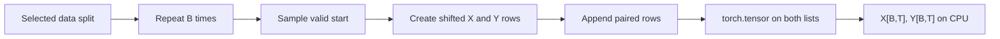

The later production implementation vectorizes these operations, but that
optimization is outside this lesson's snapshot.

### Reference code added in this lesson

```python
CONTEXT_SIZE = 32
BATCH_SIZE = 4

input_tensor, target_tensor = create_batch(
    data=training_data,
    batch_size=BATCH_SIZE,
    context_size=CONTEXT_SIZE,
)
```

The implementation moves to `study/snapshots/lesson_10/batching.py`, while
`study/lessons/10_test_batching.py` verifies its public behavior.

### Syntax and logic

- Keyword arguments such as `data=...` document which value fills each
  parameter and remain clear when several integer sizes are passed together.
- `BATCH_SIZE = 4` controls the number of sampled rows; `CONTEXT_SIZE = 32`
  controls the number of token positions in each row.
- `input_tensor, target_tensor = create_batch(...)` unpacks the two tensors
  returned by the function.
- The caller has already chosen `training_data`; `create_batch` does not
  select a split.
- The function preserves two `[batch_size, context_size]` shapes and the
  one-token shift between every corresponding row. It creates ordinary CPU
  tensors because this snapshot has no `device` parameter.

### Code ↔ mathematics ↔ meaning

This section is included here because the code directly implements a mathematical transformation.

| Code | Mathematical reading | Plain meaning |
|---|---|---|
| `input_tokens, target_tokens = create_example(data, T)` | $X_b=d[s_b:s_b+T]$, $Y_b=d[s_b+1:s_b+T+1]$ | sample one correctly shifted row pair |
| `batch_inputs.append(input_tokens)` | $X=(X_0,\ldots,X_{B-1})$ | add the input row at the matching batch index |
| `torch.tensor(batch_inputs)` | $X\in\mathbb Z^{B\times T}$ | convert the completed rectangular list to a rank-2 tensor |

## Lesson 11 — Verify PyTorch

### Lesson summary: goal and result

- **Before:** Lessons 09–10 already create random `[B,T]` tensor batches and inspect their shapes
- **Goal:** isolate row/column indexing, integer dtype, and the installed PyTorch version on one tiny deterministic tensor
- **After:** a known `[2,4]` reference whose complete values and slices can be checked by eye
- **Invariant:** token values, row order, and the meaning of every inspected axis must remain unchanged

### Understand the transformation

Lessons 09 and 10 have already converted sampled batches to PyTorch tensors and
printed their `[B,T]` shapes. This lesson does not introduce that conversion
again. It removes random sampling, text decoding, and corpus-dependent values so
that one numerical contract can be checked in isolation. We give PyTorch eight
known integers, then compare every inspected result with an answer known in
advance.

Start with the nested list `[[1, 2, 3, 4], [5, 6, 7, 8]]`. The outer list
contains two rows and each row contains four token IDs, so the expected tensor
shape is `[2, 4]`. Converting the list with `torch.tensor(...)` should preserve
all eight integer values and their positions. If the first row is
`[1, 2, 3, 4]`, the second column must be `[2, 6]`: these two views describe
the same underlying rectangular object from different directions.

The shape is more than bookkeeping. In the batching contract, `[B,T]` already
means “`B` independent sequences, each containing `T` token positions.”
Selecting `tensor[0]` keeps one complete sequence, while `tensor[:, 1]` keeps
the same position from every sequence. Reading these selections correctly prevents a common mistake:
confusing the batch axis with the time axis. The `dtype` check is equally
important because token IDs must remain integers when they are used to look up
embedding rows.

The lesson script deliberately stops at inspection. It prints the complete
tensor, its shape, the first row, the second column, and its `dtype`. Because
the input values are known in advance, each print has a known expected result.
This is a small but useful verification loop: construct one object, observe it
from several views, and compare those observations with the contract we meant
to create. No model parameter and no matrix multiplication is introduced by
this lesson.

The reported PyTorch version supplies useful context for the observation.
Library behavior can change across releases, so a reproducible report should
identify the runtime that produced it. The script does not select or verify a
CPU, MPS, or CUDA device yet; that concern is introduced by later lessons. Here
the evidence is narrower and more precise: the installed runtime can create
the expected integer tensor and the printed indexing operations have the
expected meaning.

These checks are deliberately small. If a shape, index, or type is wrong here,
the cause is local and visible. After model parameters are added, the same
mistake could be hidden behind a loss value or a long stack trace. Passing this
lesson does not prove that the future model is correct, and printed output is
not a substitute for a full automated test suite. It does establish one
directly inspectable reference for the tensor structure that the next lesson receives.

### Transformation, step by step

1. **INPUT — Declare a known rectangular batch**

   Begin with `[[1, 2, 3, 4], [5, 6, 7, 8]]`: two ordered rows containing four
   integer token IDs each.

   **What to observe:** because the values and positions are known in advance,
   every later inspection has an unambiguous expected answer.

2. **OPERATION — Convert the nested list to a tensor**

   `torch.tensor(token_ids)` creates one rank-2 tensor.

   **What to observe:** the data becomes suitable for PyTorch operations
   without changing its values or row order.

3. **CHECK — Verify metadata and both axes**

   The expected properties are `shape == [2, 4]` and an integer `dtype`.
   `tensor[0]` gives `[1, 2, 3, 4]`, while `tensor[:, 1]` gives `[2, 6]`.

   **What to observe:** axis `0` counts rows, axis `1` counts positions, and
   indexing exposes existing values without reordering them.

4. **CHECK — Record the runtime and compare the evidence**

   ```text
   torch.__version__  → installed PyTorch release
   tensor.shape       → torch.Size([2, 4])
   tensor.dtype       → integer scalar type
   ```

   **What to observe:** the script prints evidence for a human to compare with
   the expected contract; it does not yet test a device or a matrix operator.

5. **OUTPUT — Accept the runtime contract**

   Tensor construction, shape semantics, row/column indexing, and integer
   storage now have concrete expected results.

   **What to observe:** the next lesson can introduce trainable parameters
   without simultaneously introducing uncertainty about these basics.

### Where we are now

PyTorch has not learned anything yet. What changed is our level of confidence:
the course now has a checked tensor representation and an explicit reading of
its axes on which the first model can safely build.

- **Changed:** the batch is represented as a PyTorch tensor whose shape, slices, `dtype`, and runtime version have known outcomes.
- **Preserved:** token values, order, batch/time interpretation, and integer identity.
- **Next:** the first bigram model will attach trainable scores to token transitions.

> **If you remember one thing:** verify shapes, axes, and known slices before
> trusting a larger neural network to interpret the same tensor.

### How to read the mathematics

Read a shape `[B,T]` as a rectangular tensor with `B` rows and `T` positions
per row. Indexing chooses entries or slices; it does not calculate new token
values.

| Notation | Read it as | Meaning here |
|---|---|---|
| $X$ | X | the rank-2 tensor of input token IDs |
| $B$ | B | number of independent rows or batch examples |
| $T$ | T | number of ordered positions in each row |
| $X_{b,t}$ | X at b, t | one token ID at row $b$ and position $t$ |

### Visual worked example

> **Running example state:** formalize how a batch containing ordered token IDs
> from `The cat sleeps here.` is inspected without changing those IDs.

For an integer tensor

$$
X=(X_{b,t})\in\mathbb Z^{B\times T},
$$

the pair $(b,t)$ is an address: $b$ selects an example and $t$ selects one
position inside it. The course's concrete script uses $B=2$ and $T=4$, but the
index rules do not depend on those particular values.

| PyTorch view | Mathematical view | Result shape | Meaning |
|---|---|---|---|
| `tensor.shape` | $(B,T)$ | two size values | describe the two axes |
| `tensor[b]` | $X_{b,:}$ | `[T]` | all positions from one row |
| `tensor[:, t]` | $X_{:,t}$ | `[B]` | the same position from every row |
| `tensor.dtype` | $X_{b,t}\in\mathbb Z$ | one type descriptor | IDs are stored as integers |

The colon means “keep every valid index on this axis.” Thus `tensor[:, 1]`
fixes the time index to the second position and keeps all batch rows. No
arithmetic combines the selected values, and their order remains the order already
stored in $X$.

Shape and `dtype` protect different contracts. The shape says how values are
organized; the integer type says how each scalar may be used. Later embedding
code will interpret each $X_{b,t}$ as a row address in a learnable table. That
operation would be semantically wrong if these IDs had silently become
continuous floating-point measurements.

### Reference code added in this lesson

```python
print(torch.__version__)

token_ids = [
    [1, 2, 3, 4],
    [5, 6, 7, 8],
]
tensor = torch.tensor(token_ids)

print(tensor.shape)
print(tensor[0])
print(tensor[:, 1])
print(tensor.dtype)
```

Run `study/lessons/11_verify_pytorch.py` before introducing a model.

### Syntax and logic

- `torch.tensor(token_ids)` converts the rectangular nested list to one rank-2
  integer tensor before any indexing checks are performed.
- `torch.__version__` identifies the installed runtime, which matters when an
  accelerator or optimized operator behaves differently across releases.
- `tensor[0]` selects one complete row.
- In `tensor[:, 1]`, `:` selects every row and `1` selects the second column
  because indexing is zero-based.
- `.dtype` reports the stored scalar type; token IDs must stay integral rather
  than becoming floating-point values.
- `tensor.shape`, `tensor[0]`, `tensor[:, 1]`, and `tensor.dtype` do not alter the
  tensor. They inspect the exact dimensions
  and selections the embedding model will receive next.

### Code ↔ mathematics ↔ meaning

This section is included here because the code directly implements a mathematical transformation.

| Code | Mathematical reading | Plain meaning |
|---|---|---|
| `tensor.shape` | $(B,T)$ | expose batch and position sizes |
| `tensor[0]` | $X_{0,:}$ | keep one complete row |
| `tensor[:, 1]` | $X_{:,1}$ | keep one position across every row |
| `tensor.dtype` | $X_{b,t}\in\mathbb Z$ | confirm token IDs remain integers |

---

# Module 3 — The first predictive model

## Lesson 12 — First bigram model

### Lesson summary: goal and result

- **Before:** integer input tensors with no mechanism that scores a next token
- **Goal:** use each current ID to select one trainable row of vocabulary logits
- **After:** a `[B,T,V]` tensor containing one complete score vector per position
- **Invariant:** row and column meanings must use the same vocabulary mapping as the data

### Understand the transformation

The data pipeline can now provide integer tensors, but those integers do not
produce predictions by themselves. The first model introduces a trainable
table `W` with `V` rows and `V` columns. A row represents the current token; a
column represents one possible next token. Every cell is a learnable score for
one transition.

If the current ID is `7` for `cat` in the didactic shorthand, the model selects
row `W[7,:]`. That row must contain `V` logits—one for every legal vocabulary
ID. A high entry in the `sleeps` column means the model currently favors that
transition, but logits are unbounded scores, not probabilities.

`nn.Embedding(V, V)` implements this table efficiently. Although PyTorch calls
the layer an embedding, this first model uses each selected row directly as
next-token logits. For input shape `[B,T]`, vectorized lookup appends the
vocabulary axis and returns `[B,T,V]`.

The model is a bigram because each row depends only on the ID at the same
position. Earlier tokens in the prefix do not affect that prediction. The
table begins with arbitrary trainable values; this lesson only creates and
applies it. Normalization and loss are not performed until the next lesson.

### Transformation, step by step

1. **INPUT — Receive integer IDs**

   The batch has shape `[B,T]`; each scalar is a row address in the vocabulary.

   **What to observe:** ID values are categorical indices, not continuous
   features.

2. **OPERATION — Create the trainable transition table**

   `nn.Embedding(V, V)` allocates `W∈R^(V×V)`.

   **What to observe:** rows name current tokens and columns name candidate next
   tokens.

3. **OPERATION — Select one row per input position**

   ```learngpt-visual
   {"type":"tensor-flow","title":"Look up one row of the bigram table","description":"The current token ID selects one complete row containing a logit for every possible next token.","stages":[{"label":"Current token · cat","shape":"scalar ID 7","note":"A categorical address."},{"label":"Row lookup · W[7,:]","shape":"[V]","note":"Selects, rather than multiplies, the learned row."},{"label":"Next-token logits","shape":"[V]","note":"[z0, z1, …, zV−1]"}]}
   ```

   **What to observe:** the selected row is complete even when a visual shows
   only a few labeled columns.

4. **INTERMEDIATE STATE — Produce raw logits**

   Each `[B,T]` input position now owns `V` scores, giving `[B,T,V]`.

   **What to observe:** no softmax or probability calculation occurs in this
   forward method.

5. **OUTPUT — Return the first model prediction tensor**

   The model returns the logits unchanged to the caller.

   **What to observe:** structure is programmed; the numerical table entries
   are trainable and still untrained.

### Where we are now

LearnGPT now has its first predictive model. It can emit vocabulary scores at
every batch and time position, but it has no measure of whether those scores
favor the correct next IDs.

- **Changed:** `[B,T]` IDs became `[B,T,V]` raw logits.
- **Preserved:** vocabulary meaning, batch/time alignment, and next-token task.
- **Next:** compare logits with targets through cross-entropy.

> **If you remember one thing:** a bigram table selects one complete logit row
> from the current token alone.

### How to read the mathematics

The row subscript means ‘select row i’. The final colon means ‘keep every vocabulary column’.

| Notation | Read it as | Meaning here |
|---|---|---|
| $B$ | B | number of independent examples in one batch |
| $T$ | T | number of token positions in one context window |
| $V$ | V | vocabulary size: the number of possible token IDs |
| $X$ | X | input token IDs or the current input matrix |
| $Z$ | Z | raw vocabulary scores, also called logits |
| $W$ | W | a learned matrix of parameters |

### Visual worked example

> **Running example state:** when the current token is `cat` (course ID 7), select row 7 to score the next token, ideally `sleeps`.

| Cropped view of $W_{7,:}$ | candidate 0 | candidate 1 | `sleeps` | … | candidate $V-1$ |
|---|---:|---:|---:|:---:|---:|
| Logit | 0.2 | -0.4 | **1.1** | … | 0.1 |

This is only a labeled crop of row 7. The actual selected row still contains
exactly `V` logits, including one score for every possible next token.

The bigram model is a trainable table $W\in\mathbb R^{V\times V}$. Current token
$i$ selects row $W_i$, containing one logit for every possible next token:

$$Z_{b,t,:}=W_{X_{b,t},:}.$$

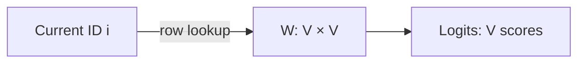

In the cropped view, `1.1` is the largest shown score. Logits are unbounded
evidence values, not probabilities. Shape: `[B,T] → [B,T,V]`.

### Reference code added in this lesson

```python
class LanguageModel(nn.Module):
    def __init__(self, vocabulary_size):
        super().__init__()
        self.token_embedding_table = nn.Embedding(
            num_embeddings=vocabulary_size,
            embedding_dim=vocabulary_size,
        )

    def forward(self, input_ids):
        logits = self.token_embedding_table(input_ids)

        return logits
```

This first model is defined in `study/snapshots/lesson_12/model.py` and invoked
by `study/lessons/12_bigram_model.py`.

### Syntax and logic

- `class LanguageModel(nn.Module):` creates a model type that participates in
  PyTorch parameter registration, device transfer, and serialization.
- `super().__init__()` initializes the `nn.Module` registration mechanism before
  assigning any child layer to `self`.
- `nn.Embedding(V, V)` is a trainable matrix with `V` rows and `V` columns.
  Indexing a token ID selects its row; that row is used directly as `V` logits.
- Calling `model(input_ids)` dispatches to `forward` through `nn.Module`'s call
  mechanism. For input `[B, T]`, the result is `[B, T, V]`.
- `return self.token_embedding_table(input_ids)` performs one vectorized lookup
  for every batch and time position without an explicit Python loop.
- A logit is an unnormalized score. No `softmax` is required yet because loss
  functions can consume logits directly.

### Code ↔ mathematics ↔ meaning

This section is included here because the code directly implements a mathematical transformation.

| Code | Mathematical reading | Plain meaning |
|---|---|---|
| `self.token_embedding_table(input_ids)` | $Z_{b,t,:}=W_{X_{b,t},:}$ | select one learned score row per ID |

### Programmed versus learned

- **Defined by the programmer:** the table lookup and output shape.
- **Learned by gradient training:** the scores stored in the table.

## Lesson 13 — Bigram loss

### Lesson summary: goal and result

- **Before:** `[B,T,V]` logits and aligned `[B,T]` target IDs
- **Goal:** measure how much probability the logits assign to every correct next token
- **After:** the original logits plus one differentiable scalar cross-entropy loss
- **Invariant:** flattening must keep each logit row paired with its original target

### Understand the transformation

Logits say which tokens the model favors, but they do not say whether the
favored token is correct. Cross-entropy compares each vocabulary row with its
aligned target ID. It asks one precise question at every batch/time position:
how much normalized probability did this row assign to the token that actually
came next?

For a closed three-token arithmetic example with candidates `sleeps`, `here`,
and `.`, logits `[1.2, 0.3, -0.1]` become probabilities of approximately
`[0.60, 0.24, 0.16]`. If `sleeps` is the target, its loss is
`-log(0.595) ≈ 0.52`. This tiny vocabulary exists only to make the calculation
complete and readable; the real model normalizes across all `V` columns.

PyTorch's `F.cross_entropy` expects one classification row per example. The
model has `[B,T,V]` rows distributed over two leading axes, so the code reshapes
logits to `[B*T,V]` and targets to `[B*T]`. Both reshapes use the same row-major
order. If one were rearranged differently, valid shapes would hide incorrect
labels.

The function combines a numerically stable log-softmax with the negative log
penalty and averages the position losses. It does not return a probability
tensor. The method returns the original structured logits and one scalar loss,
which the next lesson can differentiate.

### Transformation, step by step

1. **INPUT — Pair logits with targets**

   Receive `Z[B,T,V]` and `Y[B,T]`.

   **What to observe:** each `Y[b,t]` names the correct column in `Z[b,t,:]`.

2. **OPERATION — Flatten matching leading axes**

   ```learngpt-visual
   {"type":"tensor-flow","title":"Flatten matching prediction positions","description":"Batch and time are merged in both tensors so each vocabulary-logit row still aligns with exactly one target ID.","stages":[{"label":"Logits before reshape","shape":"[B,T,V]","note":"One V-wide prediction at every batch and time position."},{"label":"Flattened logits","shape":"[B·T,V]","note":"Batch and time become one example axis."},{"label":"Flattened targets","shape":"[B·T]","note":"Uses the identical position order."}]}
   ```

   **What to observe:** the same ordering preserves every prediction/label
   pair.

3. **INTERMEDIATE STATE — Interpret one row**

   ```learngpt-visual
   {"type":"labeled-grid","title":"Convert logits into a target penalty","description":"Softmax normalizes the three scores; cross-entropy then reads the probability assigned to the correct token sleeps.","columns":["sleeps","here","."],"rows":[{"label":"Logit","cells":[{"value":"1.2","state":"highlighted"},{"value":"0.3","state":"default"},{"value":"−0.1","state":"default"}]},{"label":"Softmax probability","cells":[{"value":"0.60","state":"highlighted"},{"value":"0.24","state":"default"},{"value":"0.16","state":"default"}]},{"label":"Target","cells":[{"value":"✓","state":"highlighted"},{"value":"—","state":"masked"},{"value":"—","state":"masked"}]}]}
   ```

   **What to observe:** probability is an internal interpretation of the full
   row, not an additional tensor returned here.

4. **OPERATION — Penalize and average**

   `F.cross_entropy(logits_flat, target_ids_flat)` computes `-log(p_target)`
   for every row and returns their mean.

   **What to observe:** low probability on the correct ID creates a larger
   penalty.

5. **OUTPUT — Return logits and one scalar loss**

   The training branch returns `(logits, loss)`.

   **What to observe:** the scalar summarizes quality while logits retain
   `[B,T,V]` for inspection.

### Where we are now

The model now has a differentiable quality signal. No parameter has changed
yet; the scalar merely describes the current batch's predictions in a form
that backpropagation can use.

- **Changed:** unjudged logits now produce one scalar cross-entropy loss.
- **Preserved:** target alignment, vocabulary columns, and structured logits.
- **Next:** compute gradients from the loss and let an optimizer update the table.

> **If you remember one thing:** cross-entropy returns a loss from raw logits;
> it does not require the model to return probabilities.

### How to read the mathematics

The fraction is softmax normalization; the minus log reads as a penalty for assigning little probability to the correct token.

| Notation | Read it as | Meaning here |
|---|---|---|
| $B$ | B | number of independent examples in one batch |
| $T$ | T | number of token positions in one context window |
| $V$ | V | vocabulary size: the number of possible token IDs |
| $Z$ | Z | raw vocabulary scores, also called logits |
| $p$ | p | a probability after normalization |
| $Y$ | Y | correct next-token IDs used as training targets |
| $\mathcal L$ | calligraphic L, or loss | one number measuring prediction error |

### Visual worked example

> **Running example state:** evaluate the `cat` → `sleeps` prediction from the canonical sentence and penalize probability assigned elsewhere.

For this arithmetic only, use a **closed three-token toy vocabulary**. The
three rows below are the complete softmax domain, not a crop of the real
model's `V` candidates.

| Candidate | Logit $z$ | Softmax probability $p$ | Target? |
|---|---:|---:|:---:|
| `sleeps` | 1.2 | 0.60 | ✓ |
| `here` | 0.3 | 0.24 |  |
| `.` | -0.1 | 0.16 |  |

Using the unrounded target probability, the example loss is
$-\log(0.595)\approx0.52$. Raising the correct probability makes this number
smaller.

Softmax converts logits $z$ into normalized probabilities:

$$p_j=\frac{e^{z_j}}{\sum_{k=1}^{V}e^{z_k}}.$$

For numerical stability implementations subtract $\max(z)$; this changes no
probability because numerator and denominator receive the same factor.

Cross entropy for target $y$ is $-\log p_y$. PyTorch flattens logits from
`[B,T,V]` to `[BT,V]` and targets from `[B,T]` to `[BT]`, preserving row order.
For logits `[1.2,0.3,-0.1]`, probabilities are approximately
`[0.595,0.242,0.162]`; target 0 gives loss
$-\ln(0.595)\approx0.52$. The real model performs the same calculation across
all `V` vocabulary columns.

For one unreduced row loss $\ell=-\log p_y$, the derivative has a particularly
useful form:

$$\frac{\partial\ell}{\partial z_j}=p_j-\mathbf 1[j=y].$$

`F.cross_entropy` returns the mean over the $B T$ rows in this lesson. For row
$m$, the derivative of that mean is therefore

$$\frac{\partial\mathcal L}{\partial z_{m,j}}
=\frac{1}{BT}\left(p_{m,j}-\mathbf 1[j=y_m]\right).$$

Thus the correct logit is pushed upward and incorrect logits downward.

### Reference code added in this lesson

```python
def forward(self, input_ids, target_ids=None):
    logits = self.token_embedding_table(input_ids)
    if target_ids is None:
        return logits

    batch_size, context_size, vocabulary_size = logits.shape
    logits_flat = logits.reshape(batch_size * context_size, vocabulary_size)
    target_ids_flat = target_ids.reshape(batch_size * context_size)
    loss = F.cross_entropy(logits_flat, target_ids_flat)
    return logits, loss
```

The implementation is in `study/snapshots/lesson_13/model.py`.

### Syntax and logic

- `target_ids=None` makes targets optional: inference returns logits, while
  training supplies targets and also receives a loss.
- `logits = self.token_embedding_table(input_ids)` always computes predictions;
  the target branch changes only what else the method returns.
- `if target_ids is None: return logits` exits early during inference before any
  loss-specific reshape is performed.
- Tuple unpacking reads `[B, T, V]` from `logits.shape` into named dimensions.
- `reshape(B * T, V)` treats every time position in every batch row as one
  classification example. Targets become the matching vector `[B * T]`.
- `F.cross_entropy` combines log-softmax with negative log likelihood. Passing
  raw logits is both numerically stable and the required PyTorch interface.
- `return logits, loss` preserves the structured predictions for inspection and
  exposes the scalar objective used by `backward()`.

### Code ↔ mathematics ↔ meaning

This section is included here because the code directly implements a mathematical transformation.

| Code | Mathematical reading | Plain meaning |
|---|---|---|
| `F.cross_entropy(logits_flat, target_ids_flat)` | mean of $-\log p_y$ over $BT$ rows | penalize low probability on every correct ID and average the penalties |

## Lesson 14 — Bigram training

### Lesson summary: goal and result

- **Before:** a trainable bigram table and a scalar loss, but no update process
- **Goal:** repeatedly compute gradients and let AdamW update the registered parameters
- **After:** parameter values shaped by observed next-token transitions
- **Invariant:** the runtime order must remain sample batch → forward/loss → zero gradients → backward → optimizer step

### Understand the transformation

The loss measures an error but cannot change the table by itself. Training
connects three kinds of mutable state: parameter values in the model, gradient
buffers attached to those parameters, and moving statistics owned by AdamW.
Keeping those objects distinct makes the update loop easier to reason about.

Each iteration samples a fresh batch and runs the model to obtain a scalar
loss. `loss.backward()` follows the recorded computation graph and accumulates
one gradient in every parameter's `.grad` buffer. The gradient describes local
sensitivity: it tells us how a small parameter change would affect this
batch's loss near the current values.

PyTorch adds gradients by default, so the loop clears old buffers before the
next backward pass. `optimizer.step()` then reads the current gradients and
updates the parameter table. This code uses AdamW, whose exact step includes
moving averages, normalization, and decoupled weight decay. It is not exactly
the simple SGD equation `w ← w-ηg`.

A one-parameter SGD calculation can still illustrate the sign: if
`w=0.50`, `g=-0.20`, and `η=0.10`, the simple update would give `0.52`.
That number is an intuition, not the exact AdamW result. Nor does one stochastic
step guarantee that the next measured loss decreases. Across training, the
optimizer uses gradient information with the objective of improving
next-token predictions.

### Transformation, step by step

1. **INPUT — Sample a fresh aligned batch**

   `create_batch(...)` returns input and target tensors for this update.

   **What to observe:** training changes model parameters, not the target IDs.

2. **OPERATION — Run forward and measure loss**

   `_, loss = model(input_ids, target_ids)` evaluates the current table.

   **What to observe:** the scalar belongs to the current parameters and batch.

3. **OPERATION — Clear, then compute gradients**

   ```text
   optimizer.zero_grad()
   loss.backward()
   ```

   **What to observe:** clearing prevents gradients from a previous iteration
   from being added accidentally.

4. **OPERATION — Let AdamW update its parameters**

   `optimizer.step()` combines gradients with its optimizer state and mutates
   the registered table.

   **What to observe:** this is an adaptive AdamW step, not an exact plain-SGD
   subtraction.

5. **OUTPUT — Repeat with changed model state**

   The next iteration computes logits from updated parameter values.

   **What to observe:** improvement is evaluated across the training trace, not
   guaranteed after every individual stochastic step.

### Where we are now

The first model can now learn from data instead of only reporting an error.
The architecture and vocabulary remain fixed while AdamW changes the numerical
transition scores stored in the table.

- **Changed:** arbitrary parameters became values updated from observed gradients.
- **Preserved:** vocabulary mapping, model shape, and next-token objective.
- **Next:** use the trained logits repeatedly to generate tokens.

> **If you remember one thing:** backward computes gradients; AdamW interprets
> those gradients and optimizer state to update parameters.

### How to read the mathematics

The left arrow means ‘replace with an updated value’. The gradient says how the loss changes when parameters change.

| Notation | Read it as | Meaning here |
|---|---|---|
| $\theta$ | theta | all trainable model parameters considered together |
| $\nabla_\theta\mathcal L$ | gradient of the loss with respect to theta | directions in which parameters affect the loss |
| $\eta$ | eta | learning rate: update step size |
| $\mathcal L$ | calligraphic L, or loss | one number measuring prediction error |

### Visual worked example

> **Running example state:** use one plain-SGD scalar calculation to understand
> the sign of a possible update for the `cat` → `sleeps` transition. The actual
> lesson optimizer is AdamW.

| Step | Value |
|---|---:|
| Current weight $w$ | 0.50 |
| Gradient $\partial L/\partial w$ | -0.20 |
| Learning rate $\eta$ | 0.10 |
| Plain-SGD intuition $w-\eta g$ | $0.50-0.10(-0.20)=0.52$ |

In plain SGD, the negative gradient would increase this particular weight.
AdamW also uses moving averages, normalization, and decoupled weight decay, so
`0.52` is not its exact update.

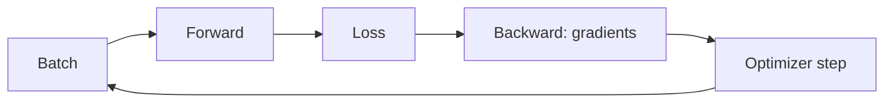

Plain gradient descent updates a parameter $\theta$ as
$\theta\leftarrow\theta-\eta\nabla_\theta\mathcal L$. If $w=0.50$,
$\partial L/\partial w=-0.20$, and $\eta=0.1$, then $w'=0.52$.
`zero_grad()` is required because PyTorch accumulates gradients by addition.

The loop separates three different objects: parameter values, gradient buffers,
and optimizer state. In this lesson AdamW uses moving averages and decoupled
decay; the causal chain remains forward → scalar loss → backward → update.
One stochastic update does not guarantee a lower loss on the next batch.

### Reference code added in this lesson

```python
optimizer = torch.optim.AdamW(model.parameters(), lr=LEARNING_RATE)

for step in range(TRAINING_STEPS):
    input_tensor, target_tensor = create_batch(
        data=training_data,
        batch_size=BATCH_SIZE,
        context_size=CONTEXT_SIZE,
    )

    logits, loss = model(input_tensor, target_tensor)

    optimizer.zero_grad()
    loss.backward()
    optimizer.step()

    if step % 50 == 0:
        print("Step:", step, "Loss:", loss.item())

print("Step:", TRAINING_STEPS, "Final loss:", loss.item())
```

The complete loop and its periodic and final loss reporting are in
`study/lessons/14_bigram_training.py`.

### Syntax and logic

- `model.parameters()` yields every registered trainable tensor. AdamW keeps
  moving statistics for them and applies updates at the chosen learning rate.
- `range(TRAINING_STEPS)` repeats one optimizer update per iteration.
- `input_tensor, target_tensor = create_batch(...)` samples a new aligned batch for
  the current update.
- `logits, loss = model(input_tensor, target_tensor)` keeps the structured
  predictions available, while the gradient update uses the scalar loss.
- `optimizer.zero_grad()` clears gradients left by the previous iteration;
  PyTorch otherwise accumulates gradients by default.
- `loss.backward()` traverses the recorded computation graph in reverse and
  fills each parameter's `.grad`.
- `optimizer.step()` reads those gradients and mutates the parameters; it must
  occur after `backward()` and before the next gradient reset.

### Code ↔ mathematics ↔ meaning

This section is included here because the code directly implements a mathematical transformation.

| Code | Mathematical reading | Plain meaning |
|---|---|---|
| `loss.backward()` | $\nabla_\theta\mathcal L$ | compute every parameter gradient |
| `optimizer.step()` | $\theta\leftarrow\operatorname{AdamW}(\theta,\nabla\mathcal L,\text{optimizer state})$ | apply AdamW's adaptive update, not an exact plain-SGD subtraction |

### Programmed versus learned

- **Defined by the programmer:** the training-loop order and optimizer rule.
- **Learned by gradient training:** the parameter values.

## Lesson 15 — Bigram generation

### Lesson summary: goal and result

- **Before:** a trained bigram model and a fixed prompt
- **Goal:** reuse next-token prediction repeatedly to extend the prompt
- **After:** one sequence containing the prompt and every sampled token
- **Invariant:** vocabulary, model parameters, and left-to-right token order do not change during generation

### Understand the transformation

Training taught the bigram table how to score possible next tokens. Generation
uses that table without changing it. The important shift is from one
prediction to a **loop**: the token sampled now becomes part of the input used
for the next prediction.

Start with `The`. The model produces logits for every prompt position, but only
the final row answers the current question: “what may come after the last
token?” Softmax converts that row into probabilities, sampling chooses one ID,
and concatenation appends it to the time axis. If `cat` is sampled, the state
changes from `[The]` to `[The, cat]`; the next iteration asks what may follow
`cat`.

Sampling is deliberately different from always taking `argmax`. A high
probability makes a continuation more likely, not compulsory, so two runs can
diverge from the same prompt. The parameters remain fixed: generation changes
the sequence, not what the model has learned.

This separation matters when debugging. If a continuation looks poor, first
distinguish a weak probability distribution from an unlucky sample. The model
creates the distribution; `multinomial` makes the random choice. Changing the
sampling rule changes which learned possibilities are explored, but it does
not retrain the bigram table.

### Transformation, step by step

1. **INPUT — Begin with the current prefix**

   ```text
   generated IDs: [The]
   ```

   **What to observe:** this sequence is both the accumulated output and the
   input to the next model call.

2. **OPERATION — Read the final-position distribution**

   ```learngpt-visual
   {"type":"labeled-grid","title":"Read the final-position distribution","description":"The current prefix produces candidate probabilities for the next token; generation uses only the final-position row.","columns":["cat","dog","…"],"rows":[{"label":"Probability after The","cells":[{"value":"0.62","state":"highlighted"},{"value":"0.21","state":"default"},{"value":"…","state":"default"}]}]}
   ```

   **What to observe:** earlier logit rows are ignored for this decision;
   generation selects the row at time index `-1`.

3. **OPERATION — Sample and append one token**

   ```learngpt-mermaid
   flowchart LR
       P["Prefix · The"] --> S["Sampled token · cat"]
       P --> C["Concatenate"]
       S --> C
       C --> N["New prefix · The, cat"]
   ```

   **What to observe:** the sequence grows by one column while the batch
   dimension stays unchanged.

4. **INTERMEDIATE STATE — Use the new sequence as the next input**

   ```learngpt-mermaid
   flowchart LR
       P["Prefix · The, cat"] --> M["Model"]
       M --> D["Next-token distribution · sleeps 0.54, sits 0.18, …"]
       D -->|"sample sleeps"| N["New prefix · The, cat, sleeps"]
   ```

   **What to observe:** every decision uses the sequence available at that
   iteration, although a bigram prediction still depends only on its final
   token.

5. **OUTPUT — Stop after the requested number of additions**

   The result contains the original prompt followed by all sampled IDs.

   **What to observe:** `max_new_tokens` controls stopping; this lesson has no
   learned end condition.

### Where we are now

- **Changed:** a fixed prompt became a sequence extended one sampled token at a time.
- **Preserved:** tokenizer, bigram weights, batch structure, and token order.
- **Next:** **Bigram limitation** will show what this generator cannot remember.

> **If you remember one thing:** autoregressive generation repeatedly performs
> `predict → sample → append`; each new output becomes part of the next input.

### How to read the mathematics

The conditional bar means ‘given this prefix’. Concatenation means append the sampled ID to the existing sequence.

| Notation | Read it as | Meaning here |
|---|---|---|
| $X$ | X | input token IDs or the current input matrix |
| $p$ | p | a probability after normalization |

### Visual worked example

> **Running example state:** begin with `The` and let repeated next-token sampling grow the canonical prefix toward `The cat sleeps…`.

```learngpt-mermaid
flowchart TB
    P1["Prefix · The"] --> M1["Model"]
    M1 --> D1["cat .62 · dog .21 · …"]
    D1 -->|"sample cat"| P2["Prefix · The, cat"]
    P2 --> M2["Model"]
    M2 --> D2["sleeps .54 · sits .18 · …"]
    D2 -->|"sample sleeps"| P3["Prefix · The, cat, sleeps"]
    P3 --> NEXT["Repeat with the longer prefix"]
```

Every sampled ID becomes part of the next input prefix.

Autoregressive generation repeats:

1. run the current prefix through the model;
2. select logits at the final position;
3. softmax into a distribution;
4. sample one token;
5. append it and repeat.

$$x^{(k+1)}=\operatorname{concat}\left(x^{(k)},
\operatorname{sample}(p(\cdot\mid x^{(k)}))\right).$$

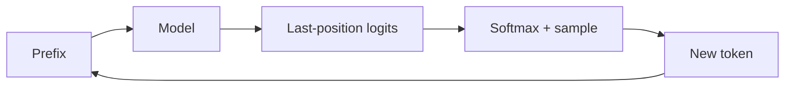

Sampling, unlike `argmax`, can explore multiple plausible continuations.

### Reference code added in this lesson

```python
def generate(self, input_ids, max_new_tokens):
    generated_ids = input_ids
    for _ in range(max_new_tokens):
        logits = self(generated_ids)
        last_token_logits = logits[:, -1, :]
        probabilities = F.softmax(last_token_logits, dim=-1)
        next_token_ids = torch.multinomial(probabilities, num_samples=1)
        generated_ids = torch.cat((generated_ids, next_token_ids), dim=1)
    return generated_ids
```

Generation is exercised by `study/lessons/15_bigram_generation.py`.

### Syntax and logic

- `generated_ids = input_ids` initializes the growing sequence with the prompt
  supplied by the caller.
- `for _ in range(max_new_tokens)` performs exactly one sampling decision per
  requested new token.
- `logits = self(generated_ids)` recomputes next-token scores from the sequence
  produced so far.
- `logits[:, -1, :]` keeps every batch row and vocabulary column but selects
  only the final time position. Negative index `-1` means the last element.
- `softmax(..., dim=-1)` normalizes the vocabulary axis into probabilities that
  sum to one.
- `torch.multinomial(..., num_samples=1)` draws one token ID per batch row;
  unlike `argmax`, it permits varied output.
- `torch.cat(..., dim=1)` appends the new `[B, 1]` column to time dimension of
  `[B, T]`, so the next iteration can condition on it.
- `return generated_ids` returns the original prompt and all appended IDs as one
  tensor.

### Code ↔ mathematics ↔ meaning

This section is included here because the code directly implements a mathematical transformation.

| Code | Mathematical reading | Plain meaning |
|---|---|---|
| `torch.multinomial(probabilities, 1)` | $x' = \operatorname{concat}(x,\operatorname{sample}(p))$ | sample and append one ID |

## Lesson 16 — Bigram limitation

### Lesson summary: goal and result

- **Before:** a generator that can extend a prompt
- **Goal:** expose exactly which part of the prompt the bigram model ignores
- **After:** a controlled demonstration that equal final tokens force equal predictions
- **Invariant:** vocabulary, trained table, and next-token task remain unchanged during the comparison

### Understand the transformation

The generator works, but working is not the same as understanding context. A
bigram model chooses its score row from the **current token ID only**. Passing
a longer tensor does not create communication between positions; the final
logit row still depends only on the final ID.

Compare `The cat` with `A noisy cat`. The prefixes differ, but both sequences
end in `cat`. The model therefore addresses the same table row and returns the
same next-token distribution. This is an architectural limit, not merely a
training error that more iterations will repair: the earlier tokens are not
available to the prediction.

Nothing is added to the model here. We isolate one variable, the prefix, while
holding the final token fixed, then observe whether the output can change.

The comparison also explains why generation can appear locally plausible yet
lose a subject, topic, or longer pattern. It may learn that `cat` is often
followed by `sleeps`, but it cannot make that decision depend on a word two
positions earlier. The missing object is a contextual token state: a
representation whose current features can already contain information gathered
from the visible prefix.

### Transformation, step by step

1. **INPUT — Prepare two different prefixes**

   ```text
   prefix A: [The, cat]
   prefix B: [A, noisy, cat]
   ```

   **What to observe:** the prefixes differ before their last position.

2. **CHECK — Hold the final token constant**

   ```text
   last(A) = cat
   last(B) = cat
   ```

   **What to observe:** both model calls select the same bigram row.

3. **OPERATION — Ask for next-token logits**

   ```learngpt-mermaid
   flowchart LR
       A["The cat"] --> L["Use final token cat"]
       B["A noisy cat"] --> L
       L --> W["Lookup row W[cat]"]
   ```

   **What to observe:** no operation reads `The`, `A`, or `noisy` when the
   final prediction row is produced.

4. **OUTPUT — Compare the distributions**

   ```learngpt-visual
   {"type":"labeled-grid","title":"Different prefixes collapse to the same distribution","description":"Because both prefixes end in cat, the bigram model selects the same row and returns identical next-token probabilities.","columns":["sleeps","sits","runs"],"rows":[{"label":"p(next | The cat)","cells":[{"value":"0.10","state":"default"},{"value":"0.65","state":"highlighted"},{"value":"0.25","state":"default"}]},{"label":"p(next | A noisy cat)","cells":[{"value":"0.10","state":"default"},{"value":"0.65","state":"highlighted"},{"value":"0.25","state":"default"}]}]}
   ```

   **What to observe:** different prefixes collapse to the same output.

5. **CHECK — Name the missing capability**

   The model needs states that can absorb information from other positions,
   not a larger one-token lookup table.

   **What to observe:** the failed comparison identifies an architectural
   requirement, not another value to tune in the existing table.

### Where we are now

- **Changed:** an intuitive suspicion became a reproducible context test.
- **Preserved:** model, vocabulary, final token, and prediction task.
- **Next:** **Token embeddings** will create compact features that attention can compare and combine.

> **If you remember one thing:** equal final tokens force equal predictions in
> this bigram model, regardless of the preceding prefix.

### How to read the mathematics

The equality says that the complete prefix is being reduced to its final token only.

| Notation | Read it as | Meaning here |
|---|---|---|
| $V$ | V | vocabulary size: the number of possible token IDs |
| $p$ | p | a probability after normalization |

### Visual worked example

> **Running example state:** compare `The cat` with another prefix ending in `cat` to expose what the bigram model ignores about the earlier prefix.

| Prefix | Last token | Bigram next-token distribution |
|---|---|---|
| `The cat` | `cat` | `[0.10, 0.65, 0.25]` |
| `A noisy cat` | `cat` | `[0.10, 0.65, 0.25]` |

Different prefixes collapse to the same prediction because the lookup uses only
the final token ID.

The table conditions only on $x_t$:

$$p(x_{t+1}\mid x_0,\ldots,x_t)=p(x_{t+1}\mid x_t).$$

Two prefixes ending in the same token produce identical distributions, however
different their earlier meaning. Its parameter count is $V^2$. The current
character-level lesson has $V=51$, so its direct table contains
$51^2=2{,}601$ values and still has only one-token memory. As an explicitly
future-facing comparison, the final GPT-2 BPE project will use
$V=50{,}257$; the same direct bigram design would then exceed 2.5 billion
values without gaining any additional context. Embeddings plus attention will
replace this direct transition table with a factorized, context-dependent
computation.

### Reference code added in this lesson

```python
logits_all = show_prediction(
    model=model,
    prompt="all",
    char_to_id=char_to_id,
    id_to_char=id_to_char,
)

logits_fall = show_prediction(
    model=model,
    prompt="fall",
    char_to_id=char_to_id,
    id_to_char=id_to_char,
)

logits_are = show_prediction(
    model=model,
    prompt="are",
    char_to_id=char_to_id,
    id_to_char=id_to_char,
)

print(torch.allclose(logits_all, logits_fall))
print(torch.allclose(logits_all, logits_are))
```

This controlled comparison is in `study/lessons/16_bigram_limit.py`.

### Syntax and logic

- The extra outer list gives each prompt a batch dimension, producing input
  shape `[1, T]` rather than `[T]`.
- `encode("all", char_to_id)` and its companion calls apply the same tokenizer
  to every controlled prompt before comparison.
- `[:, -1, :]` compares the next-token scores after the complete prompt.
- `torch.allclose(a, b)` checks elementwise numerical equality with
  floating-point tolerances.
- `all` and `fall` end with the same ID, so the model selects the same embedding
  row. A different prefix cannot matter until attention combines information across positions.

# Module 4 — Meaning and position


## Lesson 17 — Token embeddings

### Lesson summary: goal and result

- **Before:** integer token IDs that identify categories but carry no usable geometry
- **Goal:** replace every ID with a learned C-feature vector
- **After:** one continuous `[C]` representation at every `[B,T]` position
- **Invariant:** token identity, batch membership, and sequence position remain aligned

### Understand the transformation

An ID such as `7` is an address, not a magnitude: token 7 is not “larger” than
token 4. Neural layers need real-valued features that can be projected,
compared, and updated. An embedding table supplies them by storing one
trainable row for every vocabulary item.

Course ID 7 denotes `cat`. Looking up that address returns
`[0.4,-0.1,0.7]`. The coordinates have no programmer-assigned meanings;
training organizes them into useful directions while the tokenizer continues
to map `cat` to the same ID.

Applying the lookup to every ID introduces a feature axis without merging
examples or positions: `[B,T]` becomes `[B,T,C]`.

The table values, unlike the ID mapping, are model parameters. During
backpropagation, gradients reach the rows selected by tokens in the batch and
adjust their coordinates. The programmer chooses `V` and `C`; training chooses
the numbers stored in the `V × C` table. A vector can therefore become useful
without any coordinate being named “animal”, “verb”, or another human concept.

This lesson does not yet give a token information about its neighbours or its
position. It only creates the continuous workspace in which those later
transformations can operate.

### Transformation, step by step

1. **INPUT — Read a categorical address**

   ```text
   token: `cat`
   course token ID: 7
   ```

   **What to observe:** `7` selects a row; it is not a numerical feature.

2. **OPERATION — Look up the matching row**

   ```learngpt-visual
   {"type":"labeled-grid","title":"Look up the embedding row for cat","description":"Course token ID 7 selects three learned feature values; the ID itself is only the address.","columns":["c0","c1","c2"],"rows":[{"label":"E[7]","cells":[{"value":"0.4","state":"highlighted"},{"value":"−0.1","state":"highlighted"},{"value":"0.7","state":"highlighted"}]}]}
   ```

   **What to observe:** one ID becomes exactly `C=3` learned values.

3. **INTERMEDIATE STATE — Repeat for the sequence**

   ```learngpt-visual
   {"type":"labeled-grid","title":"Look up one embedding row per token position","description":"Row lookup preserves The, cat, sleeps order while replacing each categorical ID with a three-feature vector.","columns":["c0","c1","c2"],"rows":[{"label":"The","cells":[{"value":"0.3","state":"default"},{"value":"0.5","state":"default"},{"value":"0.1","state":"default"}]},{"label":"cat","cells":[{"value":"0.4","state":"highlighted"},{"value":"−0.1","state":"highlighted"},{"value":"0.7","state":"highlighted"}]},{"label":"sleeps","cells":[{"value":"0.1","state":"default"},{"value":"0.0","state":"default"},{"value":"−0.2","state":"default"}]}]}
   ```

   **What to observe:** rows stay in the original token order.

4. **CHECK — Protect tensor alignment**

   ```learngpt-visual
   {"type":"tensor-flow","title":"Introduce the feature axis","description":"Embedding lookup preserves batch and time while adding C learned features to every token position.","stages":[{"label":"Input token IDs","shape":"[B,T]","note":"Categorical row addresses."},{"label":"Token embedding table E","shape":"[V,C]","note":"The lookup selects one C-wide row for every ID."},{"label":"Token features","shape":"[B,T,C]","note":"Batch and time stay aligned."}]}
   ```

   **What to observe:** only the feature axis is introduced.

5. **OUTPUT — Pass continuous states onward**

   Every position now has learned features that projections can transform.

   **What to observe:** the output is a real-valued tensor, not a probability
   distribution and not a sequence of replacement IDs.

### Where we are now

- **Changed:** categorical IDs became continuous, trainable feature vectors.
- **Preserved:** which token occupies every batch/time position.
- **Next:** **Position embeddings** will add where each vector occurs.

> **If you remember one thing:** an embedding ID selects a learned row; the row
> is the representation, while the integer is only its address.

### How to read the mathematics

The table expression means ‘use every ID in X as a row address in E’.

| Notation | Read it as | Meaning here |
|---|---|---|
| $B$ | B | number of independent examples in one batch |
| $T$ | T | number of token positions in one context window |
| $V$ | V | vocabulary size: the number of possible token IDs |
| $C$ | C | number of features used to represent one token |
| $X$ | X | input token IDs or the current input matrix |
| $E$ | E | learned token-embedding table |

### Visual worked example

> **Running example state:** look up the learned feature vector for course ID 7, the token `cat` in the canonical shorthand sequence.

| Course token ID | Token | $c_0$ | $c_1$ | $c_2$ |
|---:|---:|---:|---:|---:|
| 1 | `sleeps` | 0.1 | 0.0 | -0.2 |
| 4 | `The` | 0.3 | 0.5 | 0.1 |
| 7 | `cat` | **0.4** | **-0.1** | **0.7** |

Looking up ID 7 returns row `[0.4,-0.1,0.7]`; training changes the row values,
not the integer ID.

An embedding table $E\in\mathbb R^{V\times C}$ maps categorical ID $i$ to a
learned continuous row $E_i$. For a batch:

$$X\in\mathbb Z^{B\times T}\longrightarrow E[X]\in\mathbb R^{B\times T\times C}.$$

Example table excerpt:

$$E=\begin{bmatrix}0.1&0.0&-0.2\\0.3&0.5&0.1\\0.4&-0.1&0.7\end{bmatrix}.$$

Looking up ID 7 returns `[0.4,-0.1,0.7]`. Backpropagation updates only rows used
by the batch (conceptually a sparse routing operation, though optimizer/storage
details may still be dense). Distances and directions can learn useful features;
no coordinate has a predefined human meaning.

### Reference code added in this lesson

```python
self.token_embedding_table = nn.Embedding(
    num_embeddings=vocabulary_size,
    embedding_dim=embedding_size,
)
self.output_head = nn.Linear(
    in_features=embedding_size,
    out_features=vocabulary_size,
)

token_embeddings = self.token_embedding_table(input_ids)
logits = self.output_head(token_embeddings)
```

The separated representation and output layers live in
`study/snapshots/lesson_17/model.py`.

### Syntax and logic

- `nn.Embedding(V, C)` maps `[B, T]` integer IDs to `[B, T, C]` vectors.
- `nn.Linear(C, V)` computes `x @ W.T + b` on the final dimension, producing
  `[B, T, V]` without changing batch or time axes.
- Both layers contain trainable `nn.Parameter` objects automatically registered
  by assignment to `self`.
- `self.token_embedding_table(input_ids)` performs the ID-to-vector lookup,
  while `self.output_head(token_embeddings)` performs the separate
  vector-to-logits projection.
- `token_embeddings` is an internal vector, not a probability distribution. It
  can contain any
  real values useful for the learned output transformation.

### Code ↔ mathematics ↔ meaning

This section is included here because the code directly implements a mathematical transformation.

| Code | Mathematical reading | Plain meaning |
|---|---|---|
| `token_embedding(input_ids)` | $E[X]$ | use IDs as embedding-row addresses |

### Programmed versus learned

- **Defined by the programmer:** the embedding lookup.
- **Learned by gradient training:** the values in every embedding row.

## Lesson 18 — Position embeddings

### Lesson summary: goal and result

- **Before:** token vectors that identify content but not where it appears
- **Goal:** add a learned position vector to every token vector
- **After:** one C-wide state containing token identity and sequence position
- **Invariant:** batch/time alignment and model width C remain unchanged

### Understand the transformation

Equal tokens start from equal token vectors, so `cat` at position 1 and `cat`
at position 4 initially look identical. A position table supplies a second
C-wide vector addressed by the time index.

In `The cat sleeps here.`, `cat` is at position 1. Its token vector
`[0.4,-0.1,0.7]` plus position vector `[0.0,0.2,-0.1]` gives
`[0.4,0.1,0.6]`. Identity and order are added in the shared feature space, not
concatenated into a wider tensor.

Position rows are reused across batch items. Values change, but the
`[B,T,C]` geometry expected by attention does not.

Addition rather than concatenation is an architectural choice with an
important consequence: subsequent layers see one shared residual stream of
fixed width C. They can learn to interpret combinations of identity and
position, but they do not receive two separately labelled halves. The
position-table limit also defines the largest index this model can represent;
generation must crop its input when the sequence grows beyond the configured
context.

No information moves between token positions yet. Each position only enriches
its own starting vector with its own index.

### Transformation, step by step

1. **INPUT — Keep token and position addresses separate**

   ```text
   token address:    cat → 7
   position address:       1
   ```

   **What to observe:** the addresses select different learned tables.

2. **OPERATION — Retrieve both vectors**

   ```learngpt-visual
   {"type":"labeled-grid","title":"Retrieve compatible token and position vectors","description":"Both lookups return width-C vectors, so their corresponding features can be added directly.","columns":["c0","c1","c2"],"rows":[{"label":"E[cat]","cells":[{"value":"0.4","state":"highlighted"},{"value":"−0.1","state":"default"},{"value":"0.7","state":"default"}]},{"label":"P[1]","cells":[{"value":"0.0","state":"default"},{"value":"0.2","state":"highlighted"},{"value":"−0.1","state":"default"}]}]}
   ```

   **What to observe:** compatible widths allow elementwise addition.

3. **OPERATION — Add feature by feature**

   ```learngpt-visual
   {"type":"matrix-operation","title":"Add token identity and position feature by feature","description":"Elementwise addition enriches cat with position 1 without mixing it with another token.","operands":[{"label":"Token embedding E[cat]","shape":"[1,3]","values":[["0.4","−0.1","0.7"]]},{"label":"Position embedding P[1]","shape":"[1,3]","values":[["0.0","0.2","−0.1"]]}],"operators":["+"],"result":{"label":"Combined state","shape":"[1,3]","values":[["0.4","0.1","0.6"]]}}
   ```

   **What to observe:** no token position is mixed with another.

4. **CHECK — Preserve the model shape**

   ```learngpt-visual
   {"type":"tensor-flow","title":"Broadcast positions without changing the model shape","description":"The position table is reused across the batch and added to token embeddings, preserving the residual-stream contract.","stages":[{"label":"Token embeddings","shape":"[B,T,C]","note":"Token identity at every batch and time position."},{"label":"Position embeddings","shape":"[T,C]","note":"Broadcast across B."},{"label":"Combined residual states","shape":"[B,T,C]","note":"Same axes, enriched values."}]}
   ```

   **What to observe:** broadcasting reuses positions across B.

5. **OUTPUT — Name the residual-stream input**

   Every token now enters attention with identity and order information.

   **What to observe:** the new state still belongs to the same token position;
   contextual communication begins only in the next lesson.

### Where we are now

- **Changed:** token-only vectors became token-plus-position states.
- **Preserved:** batch/time positions and feature width C.
- **Next:** **Causal self-attention** will exchange information within the visible prefix.

> **If you remember one thing:** position is added as another learned C-vector;
> the tensor keeps its shape while its values gain order information.

### How to read the mathematics

The two table lookups have compatible feature width C; addition happens feature by feature and broadcasts positions across the batch.

| Notation | Read it as | Meaning here |
|---|---|---|
| $B$ | B | number of independent examples in one batch |
| $T$ | T | number of token positions in one context window |
| $C$ | C | number of features used to represent one token |
| $E$ | E | learned token-embedding table |
| $P$ | P | learned position-embedding table |
| $R_l$ | R sub l | residual-stream tensor entering block l |

### Visual worked example

> **Running example state:** combine the `cat` token vector with position 1, its position in `The cat sleeps here .`.

| Component for `cat` at position 1 | $c_0$ | $c_1$ | $c_2$ |
|---|---:|---:|---:|
| Token embedding | 0.4 | -0.1 | 0.7 |
| Position embedding | 0.0 | 0.2 | -0.1 |
| Sum entering block | **0.4** | **0.1** | **0.6** |

Addition preserves width $C=3$ while combining identity and order.

Self-attention alone is permutation-equivariant: without positions, rearranging
tokens rearranges outputs but supplies no notion of earlier/later. LearnGPT uses
a learned table $P\in\mathbb R^{T_{max}\times C}$ and adds it by broadcasting:

$$R_{b,t,:}=E_{X_{b,t},:}+P_{t,:}.$$

If token vector is `[0.4,-0.1,0.7]` and position vector is
`[0.0,0.2,-0.1]`, the residual-stream state is `[0.4,0.1,0.6]`.

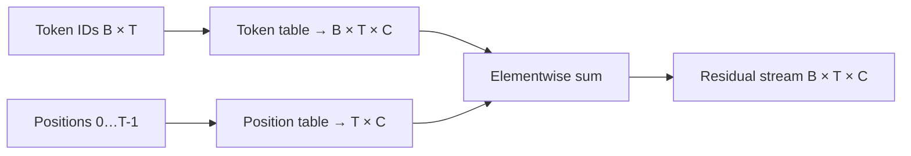

### Reference code added in this lesson

```python
self.position_embedding_table = nn.Embedding(
    num_embeddings=context_size,
    embedding_dim=embedding_size,
)

current_context_size = input_ids.shape[1]
positions = torch.arange(current_context_size, device=input_ids.device)
token_embeddings = self.token_embedding_table(input_ids)
position_embeddings = self.position_embedding_table(positions)
embeddings = token_embeddings + position_embeddings
```

Context limiting during generation is also added in
`study/snapshots/lesson_18/model.py`.

### Syntax and logic

- `nn.Embedding(context_size, embedding_size)` allocates one learned `C`-wide
  vector for every supported position from `0` through `context_size - 1`.
- `input_ids.shape[1]` reads `T`, the current sequence length.
- `torch.arange(T, device=...)` creates position IDs `0` through `T - 1` on the
  same device as the input, avoiding CPU/accelerator placement errors.
- Token embeddings have `[B, T, C]`; position embeddings have `[T, C]`.
  PyTorch broadcasting reuses the latter across all `B` rows during addition.
- `embeddings = token_embeddings + position_embeddings` combines token identity
  and order without concatenating or changing the model width.
- Generation keeps only `generated_ids[:, -self.context_size:]`, because the
  position table and attention mask support at most the configured context.

### Code ↔ mathematics ↔ meaning

This section is included here because the code directly implements a mathematical transformation.

| Code | Mathematical reading | Plain meaning |
|---|---|---|
| `token_embeddings + position_embeddings` | $R=E[X]+P$ | combine token identity and position |

### Programmed versus learned

- **Defined by the programmer:** the addition and position indices.
- **Learned by gradient training:** the position vectors and token vectors.

# Module 5 — Tokens share context


## Lesson 19 — Causal self-attention head

### Lesson summary: goal and result

- **Before:** each token has identity and position, but its state is still independent of the surrounding words
- **Goal:** let every token compute a weighted combination of useful information from itself and visible earlier tokens
- **After:** one contextualized state per token and attention head
- **Invariant:** sequence order, batch structure, and the causal rule that forbids using future positions

### Understand the transformation

Before attention, the state for `sleeps` tells the model which token occupies
that position and where it appears, but it does not yet contain information
from `The` or `cat`. This is a serious limitation: the meaning and likely
continuation of a word depend on its prefix. A causal self-attention head solves
that problem by allowing each position to collect information from positions
it is permitted to see. For `sleeps` in `The cat sleeps here.`, the visible
prefix is `The cat sleeps`; `here` and `.` are still future tokens and must not
influence this state.

Before adding trainable query, key, and value projections, imagine the simpler
shape of the idea. Pick one token position, score the visible tokens, turn
those scores into weights that sum to one, and take a weighted average of the
visible information. That is self-attention in its most basic reading: a token
builds a new context vector by weighting information from itself and from
earlier tokens. The learned Q/K/V mechanism below is the parameterized
way a Transformer creates those scores and chooses which information can be
combined.

The head creates three different views of every token state: a **query**, a
**key**, and a **value**. A query encodes the comparison pattern for the
current token. A key expresses what each candidate token offers for matching.
A value carries the information that can actually be transferred. These roles
are separate on purpose. The query and keys decide *which positions receive
weight*; they do not perform the final weighted combination of information.

Follow only the row belonging to `sleeps`. In this small numerical example its
query is `q_sleeps = [1, 1]`. The key columns for
`The`, `cat`, `sleeps`, `here`, and `.` are respectively
`[1,0]`, `[0,1]`, `[1,1]`, `[2,0]`, and `[0,2]`. Multiplying the query by
`Kᵀ` produces the raw comparison row `[1, 1, 2, 2, 2]`. A larger number means
that the query and that key point more strongly in compatible directions; it
does not yet mean “use this percentage.”

The raw scores are divided by `√2`, because this head has width two. That
produces approximately `[0.71, 0.71, 1.41, 1.41, 1.41]` and keeps the score
scale controlled. Causality is then applied **before** normalization. The
entries for `here` and `.` become `−∞`, giving
`[0.71, 0.71, 1.41, −∞, −∞]`. This is a hard constraint, not something the
model is allowed to learn around.

Row-wise softmax converts the allowed scores into non-negative weights that
sum to one. The result is approximately `[0.25, 0.25, 0.50, 0, 0]`. We can now
read the row directly: for this illustrative head, `sleeps` takes one quarter
of the available information from `The`, one quarter from `cat`, and one half
from its own position. The two future positions receive exactly zero weight.
Softmax therefore changes arbitrary comparison scores into interpretable
attention weights.

The numbers in this example are fixed only so that the mechanics can be read
by hand. In the real model, learned projection matrices create the query, key,
and value vectors from the residual stream. Training does not change the order
of operations or the causal mask; it changes which vector directions produce
large matches and which information is carried by the values. The programmer
defines the attention mechanism, while gradient-based learning discovers
useful comparisons inside that mechanism.
The computational structure itself stays fixed.

Only after those weights exist do the values enter the final multiplication.
With value rows `[2,0]`, `[0,3]`, `[1,1]`, `[4,4]`, and `[2,2]`, the rounded
weighted combination is approximately `[1.00, 1.25]`. Using the rounded weights,
the first output feature is
`0.25×2 + 0.25×0 + 0.50×1 ≈ 1.00`; the second is
`0.25×0 + 0.25×3 + 0.50×1 ≈ 1.25`. The future values are present in `V`, but
their zero weights prevent them from contributing.

This ordering is the essential logic of attention. `QKᵀ` decides which
positions receive weight, softmax produces the weights, and `A×V` combines the information. It is
**not** `Q×V`, and `V` is **not simply added** to the query. The rounded result
`[1.00, 1.25]` is a new contextual representation for `sleeps` produced by one
head. Other positions perform the same sequence of operations with their own
queries and their own causal visibility.

Although we followed one row, the implementation performs these comparisons
for all positions and all batch items together. That parallel organization is
why the score tensor has a time-by-time part: one axis identifies the querying
position and the other identifies the candidate key position. Reading those
axes correctly makes the triangular mask intuitive. Every row has its own
boundary between allowed prefix and forbidden future.

### Transformation, step by step

1. **INPUT — Select the query and candidate keys**

   For the row being explained:

   ```learngpt-visual
   {"type":"matrix-operation","title":"q_sleeps × Kᵀ","description":"With q_sleeps = [1 1], a 1×2 query compares with the five 2×1 key columns for The, cat, sleeps, here, and period.","operands":[{"label":"q_sleeps","shape":"1 × 2","values":[["1","1"]]},{"label":"Kᵀ · columns The, cat, sleeps, here, .","shape":"2 × 5","values":[["1","0","1","2","0"],["0","1","1","0","2"]]}],"operators":["×"],"result":{"label":"Raw comparison row","shape":"1 × 5","values":[["1","1","2","2","2"]]}}
   ```

   **What to observe:** the query is one `1 × 2` row and every token contributes
   one `2 × 1` key column.

2. **OPERATION — Compare the query with every key**

   ```learngpt-visual
   {"type":"labeled-grid","title":"Expand every query-key dot product","description":"The aligned calculations expose the complete row q_sleeps × Kᵀ = [1 1 2 2 2], one score for every candidate key position.","columns":["The","cat","sleeps","here","."],"rows":[{"label":"Dot product","cells":[{"value":"1×1 + 1×0 = 1","state":"default"},{"value":"1×0 + 1×1 = 1","state":"default"},{"value":"1×1 + 1×1 = 2","state":"highlighted"},{"value":"1×2 + 1×0 = 2","state":"default"},{"value":"1×0 + 1×2 = 2","state":"default"}]},{"label":"Raw score","cells":[{"value":"1","state":"default"},{"value":"1","state":"default"},{"value":"2","state":"highlighted"},{"value":"2","state":"default"},{"value":"2","state":"default"}]}]}
   ```

   **What to observe:** this is one row of `QKᵀ`; it contains five comparison
   scores, not five value vectors.

3. **OPERATION — Scale the raw scores**

   ```learngpt-visual
   {"type":"labeled-grid","title":"Scale attention scores by the head width","description":"The divide by √2 operation reduces magnitude while preserving the score ordering.","columns":["The","cat","sleeps","here","."],"rows":[{"label":"Raw scores","cells":[{"value":"1.00","state":"default"},{"value":"1.00","state":"default"},{"value":"2.00","state":"highlighted"},{"value":"2.00","state":"default"},{"value":"2.00","state":"default"}]},{"label":"divide by √2","cells":[{"value":"0.71","state":"default"},{"value":"0.71","state":"default"},{"value":"1.41","state":"highlighted"},{"value":"1.41","state":"default"},{"value":"1.41","state":"default"}]}]}
   ```

   **What to observe:** scaling changes the magnitude but preserves which
   comparisons are larger.

4. **CONSTRAINT — Hide future positions**

   ```learngpt-visual
   {"type":"labeled-grid","title":"Apply the causal mask","description":"For the sleeps query, future keys here and period are replaced by negative infinity before normalization.","columns":["The","cat","sleeps","here","."],"rows":[{"label":"before the causal mask","cells":[{"value":"0.71","state":"default"},{"value":"0.71","state":"default"},{"value":"1.41","state":"highlighted"},{"value":"1.41","state":"default"},{"value":"1.41","state":"default"}]},{"label":"after the causal mask","cells":[{"value":"0.71","state":"default"},{"value":"0.71","state":"default"},{"value":"1.41","state":"highlighted"},{"value":"−∞","state":"masked"},{"value":"−∞","state":"masked"}]}]}
   ```

   **What to observe:** `here` and `.` are later than `sleeps`, so their scores
   are excluded before normalization.

5. **OPERATION — Turn scores into attention weights**

   ```learngpt-visual
   {"type":"labeled-grid","title":"softmax creates normalized attention weights","description":"softmax       ≈  [0.25 0.25 0.50 0.00 0.00]; allowed positions sum to 1.00 and masked future positions receive zero weight.","columns":["The","cat","sleeps","here","."],"rows":[{"label":"masked scores","cells":[{"value":"0.71","state":"default"},{"value":"0.71","state":"default"},{"value":"1.41","state":"highlighted"},{"value":"−∞","state":"masked"},{"value":"−∞","state":"masked"}]},{"label":"softmax weight A_sleeps","cells":[{"value":"0.25","state":"default"},{"value":"0.25","state":"default"},{"value":"0.50","state":"highlighted"},{"value":"0.00","state":"masked"},{"value":"0.00","state":"masked"}]}]}
   ```

   **What to observe:** the allowed weights sum to `1.00`, while masked future
   tokens receive zero.

6. **OPERATION — Mix the value rows with those weights**

   ```learngpt-visual
   {"type":"matrix-operation","title":"Mix value rows with attention weights","description":"The weighted matrix product is [0.25 0.25 0.50 0 0] × V ≈ [1.00 1.25]; masked rows contribute nothing.","operands":[{"label":"A_sleeps","shape":"1 × 5","values":[["0.25","0.25","0.50","0","0"]]},{"label":"V · rows The, cat, sleeps, here, .","shape":"5 × 2","values":[["2","0"],["0","3"],["1","1"],["4","4"],["2","2"]]}],"operators":["×"],"result":{"label":"Contextualized sleeps state","shape":"1 × 2","values":[["1.00","1.25"]]}}
   ```

   **What to observe:** the weights select and combine `V`; the operation is
   `A×V`, not `Q×V`.

7. **OUTPUT — Produce the contextualized state**

   Feature by feature:

   ```learngpt-visual
   {"type":"labeled-grid","title":"OUTPUT feature calculation","description":"Each output feature is the weighted sum of the matching V column.","columns":["Expanded weighted sum","Result"],"rows":[{"label":"Feature 1","cells":[{"value":"0.25×2 + 0.25×0 + 0.50×1 + 0×4 + 0×2","state":"default"},{"value":"≈ 1.00","state":"highlighted"}]},{"label":"Feature 2","cells":[{"value":"0.25×0 + 0.25×3 + 0.50×1 + 0×4 + 0×2","state":"default"},{"value":"≈ 1.25","state":"highlighted"}]}]}
   ```

   With the displayed rounded weights, the head returns approximately
   `[1.00, 1.25]` for `sleeps` in this worked slice.

   **What to observe:** the output has the head's feature width, but now it
   contains information gathered from the visible prefix.

### Where we are now

One attention head can now turn independent token states into causal,
context-aware states. The example followed only the `sleeps` row so that every
number remained visible; the same pipeline is applied in parallel to every
query position.

- **Changed:** each token representation can include a learned weighted combination of visible contextual information.
- **Preserved:** token order, batch and time axes, head width, and the prohibition against future information.
- **Next:** multi-head attention will run several such information-gathering views in parallel.

> **If you remember one thing:** queries and keys create the lookup weights;
> those weights, not the queries, combine the value vectors.

### How to read the mathematics

Read $QK^T$ as every query compared with every key. Softmax turns those comparisons into attention weights for the values.

| Notation | Read it as | Meaning here |
|---|---|---|
| $B$ | B | number of independent examples in one batch |
| $T$ | T | number of token positions in one context window |
| $C$ | C | number of features used to represent one token |
| $D=C/H$ | D equals C divided by H | feature width of one attention head |
| $Q$ | Q | queries: comparison patterns produced for each token |
| $K$ | K | keys: what each token makes available for matching |
| $V'$ | V prime | values: information that attention can combine |
| $S$ | S | raw attention-comparison scores |
| $A$ | A | normalized attention weights |

### Visual worked example

> **Running example state:** generalize the `sleeps` calculation for
> `The cat sleeps here.` into the full tensor and index rules applied to every
> batch item and query position.

The three projections begin from the same residual stream but serve different
mathematical roles:

| Projection | Shape | Role in the operation |
|---|---|---|
| $Q=RW_Q$ | `[B,T,D]` | provide one query row for every token position |
| $K=RW_K$ | `[B,T,D]` | provide one candidate key row for every position |
| $V'=RW_V$ | `[B,T,D]` | provide the information rows that can be combined |

Here $R\in\mathbb R^{B\times T\times C}$ and
$W_Q,W_K,W_V\in\mathbb R^{C\times D}$. For each batch item $b$, query position
$i$, and key position $j$, the scaled comparison score is

$$
S_{bij}
=\frac{1}{\sqrt D}
\sum_{d=1}^{D}Q_{bid}K_{bjd}.
$$

The feature index $d$ is contracted, so the result retains the two time
indices:

$$
[B,T,D]\ @\ [B,D,T]\longrightarrow[B,T,T].
$$

Rows of $S$ identify querying positions; columns identify candidate key
positions. Causality is a positional condition on those two indices:

$$
M_{ij}=
\begin{cases}
0,&j\le i,\\
-\infty,&j>i,
\end{cases}
\qquad
\widetilde S_{bij}=S_{bij}+M_{ij}.
$$

For the running sentence, the visibility structure is therefore:

| Query position | Keys allowed by the mask | Keys excluded |
|---|---|---|
| `The` | `The` | `cat`, `sleeps`, `here`, `.` |
| `cat` | `The`, `cat` | `sleeps`, `here`, `.` |
| `sleeps` | `The`, `cat`, `sleeps` | `here`, `.` |
| `here` | `The`, `cat`, `sleeps`, `here` | `.` |
| `.` | all five positions | none |

Softmax acts independently along the key axis of every allowed row:

$$
A_{bij}
=
\frac{\exp(\widetilde S_{bij})}
{\sum_{k=1}^{T}\exp(\widetilde S_{bik})}.
$$

Because $\exp(-\infty)=0$, masked positions receive zero weight. For every
query row, $A_{bij}\ge0$ and $\sum_j A_{bij}=1$. The scale factor $\sqrt D$
keeps dot-product magnitudes from growing directly with head width, reducing
the risk that softmax saturates too early.

The contextual output contracts the key-position index and preserves the
query-position and feature indices:

$$
O_{bid}
=\sum_{j=1}^{T}A_{bij}V'_{bjd},
\qquad
[B,T,T]\ @\ [B,T,D]\longrightarrow[B,T,D].
$$

This equation formalizes the role separation: $Q$ and $K$ determine the
coefficients $A$, while $V'$ supplies the feature content those coefficients
combine.

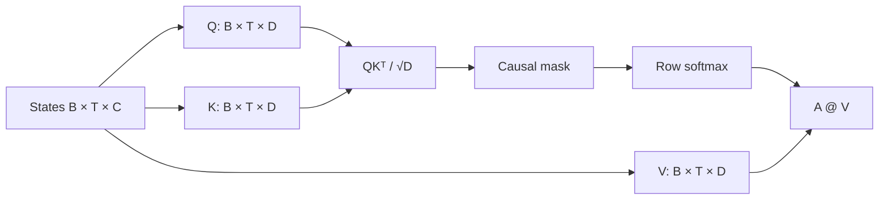

### Reference code added in this lesson

```python
self.key = nn.Linear(embedding_size, head_size, bias=False)
self.query = nn.Linear(embedding_size, head_size, bias=False)
self.value = nn.Linear(embedding_size, head_size, bias=False)
self.register_buffer(
    "causal_mask",
    torch.tril(torch.ones(context_size, context_size)),
)

attention_scores = queries @ keys.transpose(-2, -1)
attention_scores = attention_scores / math.sqrt(keys.shape[-1])
causal_mask = self.causal_mask[:current_context_size, :current_context_size]
attention_scores = attention_scores.masked_fill(
    causal_mask == 0,
    float("-inf"),
)
attention_weights = F.softmax(attention_scores, dim=-1)
attended_embeddings = attention_weights @ values
```

The complete `SelfAttentionHead` is in
`study/snapshots/lesson_19/model.py`.

### Syntax and logic

- `self.key`, `self.query`, and `self.value` are three independent bias-free
  linear maps from `[B, T, C]` to `[B, T, D]`.
- `register_buffer("causal_mask", ...)` stores the mask in the module state and
  moves it with the model without training it as a parameter.
- `transpose(-2, -1)` swaps time and feature axes of keys. Batched `@` therefore
  produces pairwise scores `[B, T, T]`.
- Dividing by `math.sqrt(keys.shape[-1])` controls score magnitude as head width
  grows.
- `masked_fill(causal_mask == 0, float("-inf"))` replaces all future-position
  scores before normalization.
- `F.softmax(attention_scores, dim=-1)` turns each allowed score row into weights
  that sum to one; masked positions receive zero weight.
- `attention_weights @ values` combines the value vectors into contextual outputs
  of shape `[B, T, D]`.

### Code ↔ mathematics ↔ meaning

This section is included here because the code directly implements a mathematical transformation.

| Code | Mathematical reading | Plain meaning |
|---|---|---|
| `queries @ keys.transpose(-2, -1)` | $QK^{\mathsf T}$ | compare every query with every key |
| `weights @ values` | $AV'$ | combine information using normalized weights |

## Lesson 20 — Multi-head attention

### Lesson summary: goal and result

- **Before:** one contextual view
- **Goal:** Run several attention views in parallel
- **After:** H contextual views joined into C features
- **Invariant:** the batch/time axes and causal constraint stay intact while features change

### Understand the transformation

One head gives each token one learned way to gather context. Multi-head
attention runs several independent heads on the same residual states so the
model is not restricted to one query/key/value projection space.

Follow `sleeps`. Suppose two width-2 heads return `[1.00,1.25]` and
`[-0.20,0.80]`. Concatenation does not average them:

```learngpt-visual
{"type":"matrix-operation","title":"Concatenate independent attention-head outputs","description":"The two D-wide head results are placed side by side without averaging, restoring the full C-wide feature vector.","operands":[{"label":"Head 1","shape":"[1,2]","values":[["1.00","1.25"]]},{"label":"Head 2","shape":"[1,2]","values":[["−0.20","0.80"]]}],"operators":["concat"],"result":{"label":"Multi-head state","shape":"[1,4]","values":[["1.00","1.25","−0.20","0.80"]]}}
```

Each slice keeps the result of one attention calculation. With `H=2` and
`D=2`, the joined width is `HD=4=C`. Token positions and causal visibility do
not change; only the feature axis is assembled from several views. The labels
“nearby” or “long-range” are possible learned behaviours, never roles assigned
by the code.

Every head receives the same input states but owns different Q, K, and V
parameters. Consequently, two heads can produce different attention weights
and different value combinations for `sleeps`. Concatenation preserves those
differences so the next projection can combine them. Heads run in parallel
conceptually; their outputs are not fed from head 1 into head 2.

### Transformation, step by step

1. **INPUT — Identify the available state**

   The starting point is **one contextual view**. Before applying an operation,
   identify exactly which object already exists and what information it
   contains.

   **What to observe:** this is the input to the transformation, not the result
   we are trying to produce.

2. **OPERATION — Multi-head attention**

   Apply the operation **Run several attention views in parallel**. The trace below shows the objects
   in the order in which they are read, transformed, and handed to the next
   operation:

   ```learngpt-mermaid
   flowchart TB
       R["Shared token states"] --> H1["Head 1 · one relationship view"]
       R --> H2["Head 2 · another relationship view"]
       R --> HR["Remaining heads"]
       H1 --> C["Concatenate feature slices"]
       H2 --> C
       HR --> C
       C --> O["Multi-view token state"]
   ```

   **What to observe:** every arrow represents a concrete operation; an
   intermediate line is both the output of the previous step and the input to
   the next one.

3. **INTERMEDIATE STATE — Follow each hand-off**

   Pause at every middle line in the trace. These values are not decoration:
   they expose what the program must already have produced before it can
   continue.

   **What to observe:** if an intermediate state is missing or has a different
   meaning, the next arrow does not receive the input it expects.

4. **CHECK — Protect the lesson constraint**

   Verify that **the batch/time axes and causal constraint stay intact while features change**. This check separates a correct transformation
   from a result that only looks plausible because its shape happens to fit.

   **What to observe:** the operation changes only what it claims to change;
   information needed by later lessons remains aligned.

5. **OUTPUT — Name the new state**

   The final result is **H contextual views joined into C features**. This becomes the course's new
   starting point rather than a disposable temporary value.

   **What to observe:** the output answers the opening summary and can be passed
   to the next lesson without rebuilding the process from scratch.

### Where we are now

The transformation is complete when **H contextual views joined into C features** is available and the
lesson constraint still holds. This is the right place to stop: performing the
next operation already would blur the boundary of what this lesson is
responsible for.

- **Changed:** one contextual view became **H contextual views joined into C features**.
- **Preserved:** the batch/time axes and causal constraint stay intact while features change.
- **Next:** **Attention output projection** will use this result as its new input.

> **If you remember one thing:** the important result is not the operation's
> name; it is the new checkable state that the operation produces:
> **H contextual views joined into C features**.

### How to read the mathematics

Concatenation means place head outputs side by side along their feature axis; $HD=C$ restores the model width.

| Notation | Read it as | Meaning here |
|---|---|---|
| $B$ | B | number of independent examples in one batch |
| $T$ | T | number of token positions in one context window |
| $C$ | C | number of features used to represent one token |
| $H$ | H | number of attention heads running in parallel |
| $D=C/H$ | D equals C divided by H | feature width of one attention head |

### Visual worked example

> **Running example state:** let multiple heads inspect different relationships inside the same visible prefix `The cat sleeps`.

| Head | Example focus | Output width |
|---:|---|---:|
| 1 | nearby token relation | $D=2$ |
| 2 | longer contextual relation | $D=2$ |
| Concatenated | both feature slices side by side | $HD=4=C$ |

The labels describe a possible learned behavior, not roles assigned in code.

$H$ heads learn different projection matrices and therefore different
relationships. Each yields `[B,T,D]`; concatenation restores width $HD=C$:

$$O_{cat}=\operatorname{Concat}(O_1,\ldots,O_H)
\in\mathbb R^{B\times T\times C}.$$

Heads are not assigned grammar roles in code; any specialization emerges from
training. Production fused attention reshapes to `[B,H,T,D]` so all heads run in
batched kernels rather than Python loops.

### Reference code added in this lesson

```python
self.heads = nn.ModuleList(
    [
        SelfAttentionHead(
            embedding_size=embedding_size,
            head_size=head_size,
            context_size=context_size,
        )
        for _ in range(num_heads)
    ]
)

attended_outputs = []
attention_weights_by_head = []

for head in self.heads:
    attended_embeddings, attention_weights = head(embeddings)
    attended_outputs.append(attended_embeddings)
    attention_weights_by_head.append(attention_weights)

concatenated_embeddings = torch.cat(attended_outputs, dim=-1)
return concatenated_embeddings, attention_weights_by_head
```

This is the literal multi-head loop in
`study/snapshots/lesson_20/model.py`.

### Syntax and logic

- The list comprehension constructs `num_heads` independent modules; their
  weights are not shared.
- `nn.ModuleList` is essential: a plain Python list would not register nested
  parameters for optimization, device moves, or checkpointing.
- `for head in self.heads` runs the registered modules in sequence in this
  educational Python implementation; the heads are mathematically independent,
  not runtime inputs to one another.
- Tuple unpacking retains both each contextual output and its diagnostic
  attention weights in separate lists.
- Each output is `[B, T, D]`. `torch.cat(..., dim=-1)` concatenates the feature
  axis to form `[B, T, num_heads * D] = [B, T, C]`.
- The constructor enforces `num_heads * head_size == embedding_size`, keeping
  the joined width equal to `C` for later residual connections.

### Code ↔ mathematics ↔ meaning

This section is included here because the code directly implements a mathematical transformation.

| Code | Mathematical reading | Plain meaning |
|---|---|---|
| `torch.cat(head_outputs, dim=-1)` | $\operatorname{Concat}(O_1,\ldots,O_H)$ | join head feature slices |

### Programmed versus learned

- **Defined by the programmer:** head splitting and concatenation.
- **Learned by gradient training:** the different projections used by each head.

## Lesson 21 — Attention output projection

### Lesson summary: goal and result

- **Before:** separate head feature slices
- **Goal:** Mix the concatenated attention heads back into the residual-stream feature space
- **After:** one projected attention update
- **Invariant:** the batch/time axes and causal constraint stay intact while features change

### Understand the transformation

Concatenation places head slices side by side, but it does not let their
features interact. The output projection applies one learned affine
transformation to the joined C-vector, so every output feature can use evidence
from every head.

This layer exists because multiple heads are useful only if the model can
recombine them. Without the projection, later layers would receive fixed
feature slices that still remember which head produced them. With the
projection, the model can learn statements such as “use part of head 1 and
part of head 3 together for this output feature” while keeping the same
`[B,T,C]` interface.

For `sleeps`, use the concatenated vector `[1.00,1.25,-0.20,0.80]`. A small
illustrative projection makes the operation visible:

```learngpt-visual
{"type":"matrix-operation","title":"Project concatenated heads back into residual width","description":"A learned C×C matrix and C-wide bias combine every head slice into every output coordinate.","operands":[{"label":"Concatenated heads","shape":"[1,4]","values":[["1.00","1.25","−0.20","0.80"]]},{"label":"W_O","shape":"[4,4]","values":[["w00","w01","w02","w03"],["w10","w11","w12","w13"],["w20","w21","w22","w23"],["w30","w31","w32","w33"]]},{"label":"b_O","shape":"[1,4]","values":[["b0","b1","b2","b3"]]}],"operators":["×","+"],"result":{"label":"Projected attention update","shape":"[1,4]","values":[["0.90","0.55","0.35","0.70"]]}}
```

The exact numbers are learned. What matters is that the input and output are
both C-wide while the output coordinates are learned combinations, not untouched
head-specific slices. This produces one update compatible with the residual
stream; the addition to that stream belongs to the next lesson.

Calling this layer a projection can hide the concrete operation. At every
batch/time position, the same matrix and bias transform one row independently;
no token reads another token here. Cross-token communication already happened
inside the heads. This layer only reorganizes the evidence they returned. Its
shape contract is what permits a later elementwise residual addition.

### Transformation, step by step

1. **INPUT — Identify the available state**

   The starting point is **separate head feature slices**. Before applying an operation,
   identify exactly which object already exists and what information it
   contains.

   **What to observe:** this is the input to the transformation, not the result
   we are trying to produce.

2. **OPERATION — Attention output projection**

   Apply the operation **Mix the concatenated attention heads back into the residual-stream feature space**. The trace below shows the objects
   in the order in which they are read, transformed, and handed to the next
   operation:

   ```learngpt-visual
   {"type":"tensor-flow","title":"Preserve shape while projecting head features","description":"The output projection changes feature values at every position but keeps the [B,T,C] interface needed by the residual stream.","stages":[{"label":"Concatenated head outputs","shape":"[B,T,C]","note":"Head slices occupy fixed feature ranges."},{"label":"Learned output projection","shape":"[B,T,C]","note":"Every output feature may use every head."},{"label":"Compatible attention update","shape":"[B,T,C]","note":"Ready for elementwise residual addition."}]}
   ```

   **What to observe:** every arrow represents a concrete operation; an
   intermediate line is both the output of the previous step and the input to
   the next one.

3. **INTERMEDIATE STATE — Follow each hand-off**

   Pause at every middle line in the trace. These values are not decoration:
   they expose what the program must already have produced before it can
   continue.

   **What to observe:** if an intermediate state is missing or has a different
   meaning, the next arrow does not receive the input it expects.

4. **CHECK — Protect the lesson constraint**

   Verify that **the batch/time axes and causal constraint stay intact while features change**. This check separates a correct transformation
   from a result that only looks plausible because its shape happens to fit.

   **What to observe:** the operation changes only what it claims to change;
   information needed by later lessons remains aligned.

5. **OUTPUT — Name the new state**

   The final result is **one projected attention update**. This becomes the course's new
   starting point rather than a disposable temporary value.

   **What to observe:** the output answers the opening summary and can be passed
   to the next lesson without rebuilding the process from scratch.

### Where we are now

The transformation is complete when **one projected attention update** is available and the
lesson constraint still holds. This is the right place to stop: performing the
next operation already would blur the boundary of what this lesson is
responsible for.

- **Changed:** separate head feature slices became **one projected attention update**.
- **Preserved:** the batch/time axes and causal constraint stay intact while features change.
- **Next:** **Attention residual connection** will use this result as its new input.

> **If you remember one thing:** the important result is not the operation's
> name; it is the new checkable state that the operation produces:
> **one projected attention update**.

### How to read the mathematics

Multiplication by $W_O$ maps C input features to C output features while preserving batch and time axes.

| Notation | Read it as | Meaning here |
|---|---|---|
| $B$ | B | number of independent examples in one batch |
| $T$ | T | number of token positions in one context window |
| $C$ | C | number of features used to represent one token |
| $W$ | W | a learned matrix of parameters |

### Visual worked example

> **Running example state:** concatenate the head outputs computed for `sleeps`, then project them into one update for that token.

```learngpt-visual
{"type":"tensor-flow","title":"Join head slices, then apply a learned projection","description":"Concatenation restores C channels and W_O converts those fixed slices into one projected C-wide update.","stages":[{"label":"Head outputs · [0.8, −0.2] and [0.1, 0.6]","shape":"2 × [D=2]","note":"Two independent contextual outputs."},{"label":"Concatenated state · [0.8, −0.2, 0.1, 0.6]","shape":"[C=4]","note":"Slices are adjacent before projection."},{"label":"Multiply by W_O","shape":"[C]","note":"Learned feature combination."},{"label":"Projected C-wide update","shape":"[C]","note":"Compatible with the residual stream."}]}
```

$W_O$ lets every output feature use information from every head.

Concatenated heads occupy fixed channel slices. A learned matrix
$W_O\in\mathbb R^{C\times C}$ combines them:

$$\operatorname{MHA}(R)=\operatorname{Concat}(O_1,\ldots,O_H)W_O+b_O.$$

The shape remains `[B,T,C]`, which is required for addition to the residual
stream. The projection lets every output feature combine evidence from all
heads. This lesson's snapshot does not yet apply dropout to the update.

### Reference code added in this lesson

```python
self.output_projection = nn.Linear(
    in_features=num_heads * head_size,
    out_features=embedding_size,
)

concatenated_embeddings = torch.cat(attended_outputs, dim=-1)
projected_embeddings = self.output_projection(concatenated_embeddings)
return projected_embeddings, attention_weights_by_head
```

The projection is introduced in `study/snapshots/lesson_21/model.py`.

### Syntax and logic

- `in_features` must match the concatenated width `num_heads * head_size`;
  `out_features` restores `embedding_size`.
- `nn.Linear` applies the same learned affine transformation independently at
  every batch and time position.
- `torch.cat(attended_outputs, dim=-1)` first joins the head outputs into
  `[B, T, num_heads * D] = [B, T, C]`.
- `self.output_projection(concatenated_embeddings)` combines that joined feature
  axis and restores `[B, T, C]`.
- `return projected_embeddings, attention_weights_by_head` separates the
  representation used by the model from the attention maps inspected by the
  lesson.

### Code ↔ mathematics ↔ meaning

This section is included here because the code directly implements a mathematical transformation.

| Code | Mathematical reading | Plain meaning |
|---|---|---|
| `self.output_projection(concatenated)` | $O_{cat}W_O$ | combine all head features |

### Programmed versus learned

- **Defined by the programmer:** the output projection.
- **Learned by gradient training:** how evidence from heads is recombined.

# Module 6 — Assemble the Transformer


## Lesson 22 — Attention residual connection

### Lesson summary: goal and result

- **Before:** a state and a separate attention result
- **Goal:** Add the attention update instead of replacing the existing state
- **After:** one residual stream containing both
- **Invariant:** the batch/time axes and causal constraint stay intact while features change

### Understand the transformation

Attention has produced a contextual update, but replacing the old state with
that update would discard the direct representation path. A residual
connection treats attention as a correction: it adds the update to the state
that entered the branch.

The important idea is “add, do not overwrite.” Deep networks need a reliable
path for information and gradients to cross many layers. The residual stream
provides that path: each branch proposes an update, and the original state can
continue forward even when an update is still poorly learned.

For one `sleeps` vector, the operation is ordinary feature-wise addition:

```learngpt-visual
{"type":"matrix-operation","title":"Add the attention update to the existing state","description":"Elementwise residual addition enriches the token while preserving the direct information path and feature width.","operands":[{"label":"Existing state R","shape":"[1,3]","values":[["0.40","−0.20","0.70"]]},{"label":"Attention update","shape":"[1,3]","values":[["0.10","0.30","−0.10"]]}],"operators":["+"],"result":{"label":"Residual result","shape":"[1,3]","values":[["0.50","0.10","0.60"]]}}
```

Both tensors must have `[B,T,C]`. Addition preserves that shape and creates an
identity path: even if the learned attention update is initially small, the
original state and a direct gradient route remain available.

The two operands play different roles. The residual source is the state that
existed before attention; the branch output is newly calculated contextual
information. Neither is a percentage or a replacement target. After the sum,
there is only one residual stream, and subsequent layers no longer need to
carry the two tensors separately. Preserving C is therefore both a mathematical
requirement and an architectural interface.

The result is now the single source passed to the next sublayer.

### Transformation, step by step

1. **INPUT — Identify the available state**

   The starting point is **a state and a separate attention result**. Before applying an operation,
   identify exactly which object already exists and what information it
   contains.

   **What to observe:** this is the input to the transformation, not the result
   we are trying to produce.

2. **OPERATION — Attention residual connection**

   Apply the operation **Add the attention update instead of replacing the existing state**. The trace below shows the objects
   in the order in which they are read, transformed, and handed to the next
   operation:

   ```learngpt-visual
   {"type":"tensor-flow","title":"Merge the branch back into one residual stream","description":"The source state and attention update share [B,T,C], so elementwise addition returns one tensor with the same interface.","stages":[{"label":"Existing residual state R","shape":"[B,T,C]","note":"Identity path."},{"label":"Attention update MHA(R)","shape":"[B,T,C]","note":"New contextual information."},{"label":"Elementwise addition","shape":"[B,T,C]","note":"Adds matching features."},{"label":"Residual state containing both","shape":"[B,T,C]","note":"Single source for the next sublayer."}]}
   ```

   **What to observe:** every arrow represents a concrete operation; an
   intermediate line is both the output of the previous step and the input to
   the next one.

3. **INTERMEDIATE STATE — Follow each hand-off**

   Pause at every middle line in the trace. These values are not decoration:
   they expose what the program must already have produced before it can
   continue.

   **What to observe:** if an intermediate state is missing or has a different
   meaning, the next arrow does not receive the input it expects.

4. **CHECK — Protect the lesson constraint**

   Verify that **the batch/time axes and causal constraint stay intact while features change**. This check separates a correct transformation
   from a result that only looks plausible because its shape happens to fit.

   **What to observe:** the operation changes only what it claims to change;
   information needed by later lessons remains aligned.

5. **OUTPUT — Name the new state**

   The final result is **one residual stream containing both**. This becomes the course's new
   starting point rather than a disposable temporary value.

   **What to observe:** the output answers the opening summary and can be passed
   to the next lesson without rebuilding the process from scratch.

### Where we are now

The transformation is complete when **one residual stream containing both** is available and the
lesson constraint still holds. This is the right place to stop: performing the
next operation already would blur the boundary of what this lesson is
responsible for.

- **Changed:** a state and a separate attention result became **one residual stream containing both**.
- **Preserved:** the batch/time axes and causal constraint stay intact while features change.
- **Next:** **LayerNorm before attention** will use this result as its new input.

> **If you remember one thing:** the important result is not the operation's
> name; it is the new checkable state that the operation produces:
> **one residual stream containing both**.

### How to read the mathematics

The plus sign is elementwise tensor addition; both sides must have the same B-by-T-by-C shape.

| Notation | Read it as | Meaning here |
|---|---|---|
| $B$ | B | number of independent examples in one batch |
| $T$ | T | number of token positions in one context window |
| $C$ | C | number of features used to represent one token |
| $R_l$ | R sub l | residual-stream tensor entering block l |

### Visual worked example

> **Running example state:** add the attention update for `sleeps` back to its existing residual-stream state.

| Feature | Existing state $R$ | Attention update | Residual result |
|---:|---:|---:|---:|
| 0 | 0.40 | 0.10 | **0.50** |
| 1 | -0.20 | 0.30 | **0.10** |
| 2 | 0.70 | -0.10 | **0.60** |

The shortcut is ordinary elementwise addition across matching features.

Instead of replacing the stream, attention contributes an update:

$$R'=R+\operatorname{MHA}(R).$$

Elementwise addition requires identical `[B,T,C]` shapes. The shortcut creates
an identity path: if the learned update is initially small, information and
gradients can still cross the block. The derivative contains an identity term,
$\partial R'/\partial R=I+\partial\operatorname{MHA}/\partial R$.

### Reference code added in this lesson

```python
attention_output, _ = self.multi_head_attention(embeddings)
residual_embeddings = embeddings + attention_output
logits = self.output_head(residual_embeddings)
```

The skip connection appears in `study/snapshots/lesson_22/model.py`.

### Syntax and logic

- `attention_output, _ = self.multi_head_attention(embeddings)` uses tuple
  unpacking and deliberately discards diagnostic weights because this forward
  path needs only the contextual update.
- `embeddings + attention_output` is elementwise addition, so both operands
  must have exactly `[B, T, C]`.
- The original `embeddings` form the identity path; the attention module learns
  a correction. If that correction begins near zero, useful input information
  can still pass forward.
- Addition preserves shape, allowing the existing `C -> V` output head to
  consume the result without another adapter.

### Code ↔ mathematics ↔ meaning

This section is included here because the code directly implements a mathematical transformation.

| Code | Mathematical reading | Plain meaning |
|---|---|---|
| `embeddings + attention_output` | $R+\operatorname{MHA}(R)$ | preserve the state and add an update |

### Programmed versus learned

- **Defined by the programmer:** the shortcut addition.
- **Learned by gradient training:** the attention update.

## Lesson 23 — LayerNorm before attention

### Lesson summary: goal and result

- **Before:** features with changing scale
- **Goal:** Normalize each token's feature scale before attention
- **After:** normalized and learned-rescaled branch features entering attention
- **Invariant:** the batch/time axes and causal constraint stay intact while features change

### Understand the transformation

Repeated learned updates can give token features very different scales.
Pre-norm LayerNorm prepares a normalized **branch input** for attention while
the original residual stream bypasses normalization on the skip path.

LayerNorm solves a practical optimization problem. Attention compares vectors
with dot products, so feature scale affects how sharp or flat those comparison
scores become. Normalizing each token's feature vector gives the attention
branch a steadier input distribution, while learned scale and offset let the
model recover useful magnitudes when training discovers them.

For the toy state `[1,2,3]`, LayerNorm first calculates mean `2`, centers to
`[-1,0,1]`, and divides by the stabilized standard deviation:

```learngpt-visual
{"type":"labeled-grid","title":"Normalize one token across its feature axis","description":"LayerNorm centers and scales the three features, then learned gamma and beta can rescale and shift the branch input.","columns":["c0","c1","c2"],"rows":[{"label":"Input","cells":[{"value":"1","state":"default"},{"value":"2","state":"default"},{"value":"3","state":"default"}]},{"label":"Centered · mean 2","cells":[{"value":"−1","state":"default"},{"value":"0","state":"highlighted"},{"value":"1","state":"default"}]},{"label":"Normalized","cells":[{"value":"≈ −1.22","state":"default"},{"value":"0","state":"highlighted"},{"value":"≈ 1.22","state":"default"}]},{"label":"Then learned γ and β","cells":[{"value":"attention","state":"highlighted"},{"value":"branch","state":"highlighted"},{"value":"input","state":"highlighted"}]}]}
```

Normalization is performed across one token's C features, independently for
every batch/time position; it never combines different tokens. Learned `γ` and `β` may
rescale and shift the normalized coordinates, so “normalized branch input” is
more precise than claiming the final values always have mean zero and variance
one.

The placement before attention is essential. Attention reads the normalized
copy, while residual addition later uses the untouched source. Moving
LayerNorm after the addition would define a post-norm block with a different
data path and different optimization behaviour. Here the goal is narrower:
stabilize the learned branch input without interrupting the identity connection.

### Transformation, step by step

1. **INPUT — Identify the available state**

   The starting point is **features with changing scale**. Before applying an operation,
   identify exactly which object already exists and what information it
   contains.

   **What to observe:** this is the input to the transformation, not the result
   we are trying to produce.

2. **OPERATION — LayerNorm before attention**

   Apply the operation **Normalize each token's feature scale before attention**. The trace below shows the objects
   in the order in which they are read, transformed, and handed to the next
   operation:

   ```learngpt-visual
   {"type":"tensor-flow","title":"Prepare a stable branch input with LayerNorm","description":"Normalization acts within each token's C features and never combines batch items or time positions.","stages":[{"label":"Token state with uneven feature scale","shape":"[B,T,C]","note":"One independent C-vector per position."},{"label":"Subtract mean and divide by spread","shape":"[B,T,C]","note":"Normalize across C only."},{"label":"Apply learned scale and offset","shape":"[B,T,C]","note":"Gamma and beta remain trainable."},{"label":"Stable attention-branch input","shape":"[B,T,C]","note":"Residual source remains untouched."}]}
   ```

   **What to observe:** every arrow represents a concrete operation; an
   intermediate line is both the output of the previous step and the input to
   the next one.

3. **INTERMEDIATE STATE — Follow each hand-off**

   Pause at every middle line in the trace. These values are not decoration:
   they expose what the program must already have produced before it can
   continue.

   **What to observe:** if an intermediate state is missing or has a different
   meaning, the next arrow does not receive the input it expects.

4. **CHECK — Protect the lesson constraint**

   Verify that **the batch/time axes and causal constraint stay intact while features change**. This check separates a correct transformation
   from a result that only looks plausible because its shape happens to fit.

   **What to observe:** the operation changes only what it claims to change;
   information needed by later lessons remains aligned.

5. **OUTPUT — Name the new state**

   The final result is **standardized features entering attention**. This becomes the course's new
   starting point rather than a disposable temporary value.

   **What to observe:** the output answers the opening summary and can be passed
   to the next lesson without rebuilding the process from scratch.

### Where we are now

The transformation is complete when **standardized features entering attention** is available and the
lesson constraint still holds. This is the right place to stop: performing the
next operation already would blur the boundary of what this lesson is
responsible for.

- **Changed:** features with changing scale became **standardized features entering attention**.
- **Preserved:** the batch/time axes and causal constraint stay intact while features change.
- **Next:** **Feed-forward network** will use this result as its new input.

> **If you remember one thing:** the important result is not the operation's
> name; it is the new checkable state that the operation produces:
> **standardized features entering attention**.

### How to read the mathematics

Mean and variance summarize one token's C features; subtract, divide, then apply learned scale and offset.

| Notation | Read it as | Meaning here |
|---|---|---|
| $C$ | C | number of features used to represent one token |
| $\mu$ | mu | mean value across one token's features |
| $\sigma^2$ | sigma squared | variance across one token's features |
| $\gamma,\beta$ | gamma and beta | learned LayerNorm scale and offset |
| $R_l$ | R sub l | residual-stream tensor entering block l |

### Visual worked example

> **Running example state:** normalize one toy feature vector representing `sleeps` before attention, without mixing it with other token positions.

For token features $x=[1,2,3]$:

| Step | Result |
|---|---|
| Mean $\mu$ | 2 |
| Center | `[-1, 0, 1]` |
| Divide by standard deviation | approximately `[-1.22, 0, 1.22]` |
| Apply $\gamma,\beta$ | learned rescale and shift |

Other tokens are normalized independently.

For one token vector $x\in\mathbb R^C$:

$$\mu=\frac1C\sum_i x_i,\qquad
\sigma^2=\frac1C\sum_i(x_i-\mu)^2,$$
$$\operatorname{LN}(x)_i=\gamma_i
\frac{x_i-\mu}{\sqrt{\sigma^2+\epsilon}}+\beta_i.$$

Normalization is across channels, independently for every batch/time location;
it does not combine different tokens. LearnGPT uses pre-norm:
$R'=R+\operatorname{MHA}(\operatorname{LN}(R))$, preserving an unnormalized
identity connection while stabilizing the branch input.

### Reference code added in this lesson

```python
self.attention_layer_norm = nn.LayerNorm(
    normalized_shape=embedding_size,
)

normalized_embeddings = self.attention_layer_norm(embeddings)
attention_output, _ = self.multi_head_attention(
    normalized_embeddings
)
residual_embeddings = embeddings + attention_output
```

Pre-normalization is introduced in `study/snapshots/lesson_23/model.py`.

### Syntax and logic

- `normalized_shape=embedding_size` tells LayerNorm to normalize the final `C`
  features independently for every `[batch, time]` position.
- `nn.LayerNorm(normalized_shape=embedding_size)` subtracts a feature mean,
  divides by a stabilized standard
  deviation, then applies learned scale and bias parameters.
- `normalized_embeddings = self.attention_layer_norm(embeddings)` creates a
  normalized branch while leaving the residual source unchanged.
- `_` explicitly discards the diagnostic attention weights returned beside the
  branch output.
- This is pre-norm because normalization occurs before attention. The residual
  addition uses the original `embeddings`, not the normalized copy.
- LayerNorm changes values but preserves `[B, T, C]`, so attention and residual
  addition remain shape-compatible.

### Code ↔ mathematics ↔ meaning

This section is included here because the code directly implements a mathematical transformation.

| Code | Mathematical reading | Plain meaning |
|---|---|---|
| `F.layer_norm(x, ...)` | $\gamma(x-\mu)/\sqrt{\sigma^2+\epsilon}+\beta$ | standardize and re-scale each token |

### Programmed versus learned

- **Defined by the programmer:** the normalization procedure and epsilon.
- **Learned by gradient training:** LayerNorm scale and offset.

## Lesson 24 — Feed-forward network

### Lesson summary: goal and result

- **Before:** contextual features with limited per-position transformation
- **Goal:** Normalize, transform, and add a nonlinear update independently at every token position
- **After:** one residual stream containing the attention state plus the nonlinear update
- **Invariant:** the batch/time axes and causal constraint stay intact while features change

### Understand the transformation

Attention moves information between token positions. The feed-forward network
does the complementary job: it applies the same nonlinear computation to each
position independently, without further communication across time.

For a toy width `C=2`, the complete new branch follows this path:

```learngpt-visual
{"type":"tensor-flow","title":"Normalize, transform, and complete the second residual branch","description":"The snapshot normalizes the state after attention, expands and contracts each token independently, then adds the C-wide update back to the unchanged residual source.","stages":[{"label":"Residual after attention U","shape":"[B,T,C=2]","note":"Source preserved for the skip path."},{"label":"LayerNorm 2","shape":"[B,T,C=2]","note":"Stable feed-forward branch input."},{"label":"Linear expansion","shape":"[B,T,4C=8]","note":"Creates wider hidden features."},{"label":"GELU activation","shape":"[B,T,8]","note":"Introduces nonlinearity."},{"label":"Linear contraction","shape":"[B,T,C=2]","note":"Produces the feed-forward update."},{"label":"U + feed-forward update","shape":"[B,T,C=2]","note":"Second residual result R_next."}]}
```

Expansion gives the network more intermediate features; GELU prevents the two
linear maps from collapsing into one linear map; projection restores C so the
result can be added to the residual stream. The second LayerNorm prepares only
the learned branch; the unchanged state after attention remains available to
the skip path. Their final elementwise addition produces the actual output of
this lesson. Dropout is not part of this lesson's snapshot and will be
introduced later.

Read the MLP as the block's per-token thinking step. Attention decides which
other positions can contribute information; the MLP then transforms each
position's now-contextual vector without moving information between time
steps. GELU matters because it bends the computation: without the activation,
the expansion and contraction would still be only one larger linear map in
disguise.

The same feed-forward parameters are reused at every time position, but each
token is processed independently. If two positions enter with different
contextual vectors, they can receive different updates even though the
function is shared. Conversely, changing `sleeps` here cannot directly alter
the row for `cat`; only attention performs that cross-position exchange. This
division of labour makes the block easier to reason about.

### Transformation, step by step

1. **INPUT — Identify the available state**

   The starting point is **contextual features with limited per-position transformation**. Before applying an operation,
   identify exactly which object already exists and what information it
   contains.

   **What to observe:** this is the input to the transformation, not the result
   we are trying to produce.

2. **OPERATION — Second pre-norm residual branch**

   Apply the operation **Normalize, transform, and add a nonlinear update independently at every token position**. The trace below shows the objects
   in the order in which they are read, transformed, and handed to the next
   operation:

   ```learngpt-visual
   {"type":"tensor-flow","title":"Follow every hand-off in the feed-forward residual branch","description":"The state after attention is normalized, transformed position by position, and reunited with its untouched skip-path source.","stages":[{"label":"U · state after attention","shape":"[B,T,C]","note":"Branch input and residual source."},{"label":"LN₂(U)","shape":"[B,T,C]","note":"Normalized branch copy."},{"label":"Expand → GELU → contract","shape":"[B,T,C]","note":"MLP temporarily visits 4C and returns a C-wide update."},{"label":"U + MLP(LN₂(U))","shape":"[B,T,C]","note":"Elementwise residual addition."},{"label":"R_next","shape":"[B,T,C]","note":"Complete output of the lesson."}]}
   ```

   **What to observe:** every arrow represents a concrete operation; an
   intermediate line is both the output of the previous step and the input to
   the next one.

3. **INTERMEDIATE STATE — Follow each hand-off**

   Pause at every middle line in the trace. These values are not decoration:
   they expose what the program must already have produced before it can
   continue.

   **What to observe:** if an intermediate state is missing or has a different
   meaning, the next arrow does not receive the input it expects.

4. **CHECK — Protect the lesson constraint**

   Verify that **the batch/time axes and causal constraint stay intact while features change**. This check separates a correct transformation
   from a result that only looks plausible because its shape happens to fit.

   **What to observe:** the operation changes only what it claims to change;
   information needed by later lessons remains aligned.

5. **OUTPUT — Name the new state**

   The final result is **one residual stream containing the previous state and its nonlinear update**. This becomes the course's new
   starting point rather than a disposable temporary value.

   **What to observe:** the output answers the opening summary and can be passed
   to the next lesson without rebuilding the process from scratch.

### Where we are now

The transformation is complete when **one residual stream containing the previous state and its nonlinear update** is available and the
lesson constraint still holds. This is the right place to stop: performing the
next operation already would blur the boundary of what this lesson is
responsible for.

- **Changed:** contextual features with limited per-position transformation became **a residual state enriched by a normalized nonlinear update**.
- **Preserved:** the batch/time axes and causal constraint stay intact while features change.
- **Next:** **Transformer block** will use this result as its new input.

> **If you remember one thing:** the important result is not the operation's
> name; it is the new checkable state that the operation produces:
> **the second residual result $R_{next}=U+\operatorname{MLP}(\operatorname{LN}_2(U))$**.

### How to read the mathematics

LayerNorm prepares the branch, the first matrix expands C features to 4C,
GELU bends the values nonlinearly, the second matrix returns to C, and residual
addition combines that update with the unchanged source.

| Notation | Read it as | Meaning here |
|---|---|---|
| $B$ | B | number of independent examples in one batch |
| $T$ | T | number of token positions in one context window |
| $C$ | C | number of features used to represent one token |
| $W$ | W | a learned matrix of parameters |

### Visual worked example

> **Running example state:** transform the normalized `sleeps` features independently at their position, expanding and compressing the channel width.

```learngpt-visual
{"type":"tensor-flow","title":"Trace the MLP tensor shapes","description":"Batch and time remain unchanged while the last axis expands from C to 4C and contracts back to C.","stages":[{"label":"MLP input","shape":"[B,T,C=2]","note":"Two features per token in the toy example."},{"label":"First Linear","shape":"[B,T,4C=8]","note":"Feature expansion."},{"label":"GELU","shape":"[B,T,8]","note":"Same expanded shape."},{"label":"Output Linear","shape":"[B,T,C=2]","note":"Residual-compatible update."}]}
```

Only the final feature axis changes; batch and time positions remain separate.

The MLP transforms every token independently with shared weights:

$$\operatorname{MLP}(x)=
\operatorname{GELU}(xW_1+b_1)W_2+b_2,$$

where $W_1\in\mathbb R^{C\times4C}$ and
$W_2\in\mathbb R^{4C\times C}$. Attention communicates across time; the MLP
computes a richer nonlinear transformation within each position.

The complete lesson transformation is therefore

$$R_{next}=U+\operatorname{MLP}(\operatorname{LN}_2(U)).$$

GELU approximately gates values by their magnitude:

$$\operatorname{GELU}(x)=x\Phi(x)
\approx\tfrac12x\left(1+\tanh\left[\sqrt{2/\pi}
(x+0.044715x^3)\right]\right).$$

### Reference code added in this lesson

```python
class FeedForward(nn.Module):
    def __init__(self, embedding_size):
        super().__init__()

        self.expand = nn.Linear(
            in_features=embedding_size,
            out_features=4 * embedding_size,
        )
        self.activation = nn.GELU()
        self.project = nn.Linear(
            in_features=4 * embedding_size,
            out_features=embedding_size,
        )

    def forward(self, embeddings):
        hidden = self.expand(embeddings)
        activated = self.activation(hidden)
        output = self.project(activated)

        return output

self.feed_forward_layer_norm = nn.LayerNorm(
    normalized_shape=embedding_size,
)
self.feed_forward = FeedForward(
    embedding_size=embedding_size,
)

feed_forward_input = self.feed_forward_layer_norm(residual_after_attention)
feed_forward_output = self.feed_forward(feed_forward_input)
residual_after_feed_forward = residual_after_attention + feed_forward_output
```

These are the literal new module and integration lines from
`study/snapshots/lesson_24/model.py`.

### Syntax and logic

- `class FeedForward(nn.Module):` makes the position-wise network a reusable,
  registered submodule.
- `self.expand = nn.Linear(embedding_size, 4 * embedding_size)` creates a hidden
  feature space conventionally four times wider than `C`.
- `nn.GELU()` is a smooth nonlinear activation. Without it, two consecutive
  linear layers would collapse mathematically into one linear transformation.
- `self.project = nn.Linear(4 * embedding_size, embedding_size)` restores the
  model width required by the residual stream.
- Linear layers act only on the last dimension, so `[B, T, C]` becomes
  `[B, T, 4C]` and then `[B, T, C]`; positions do not mix here.
- `hidden`, `activated`, and `output` expose the exact expand, activate, project
  order used by the snapshot.
- `feed_forward_input = self.feed_forward_layer_norm(residual_after_attention)`
  applies a second LayerNorm before this module, while
  `residual_after_feed_forward = residual_after_attention + feed_forward_output`
  adds its output
  to the attention residual, producing the block's second skip connection.

### Code ↔ mathematics ↔ meaning

This section is included here because the code directly implements a mathematical transformation.

| Code | Mathematical reading | Plain meaning |
|---|---|---|
| `feed_forward(ln2(u))` | $\operatorname{MLP}(\operatorname{LN}_2(U))$ | normalize, expand, transform nonlinearly, and contract |
| `u + feed_forward_output` | $U+\operatorname{MLP}(\operatorname{LN}_2(U))$ | preserve the state and add the nonlinear update |

### Programmed versus learned

- **Defined by the programmer:** the C-to-4C-to-C structure and GELU.
- **Learned by gradient training:** both projection matrices and biases.

## Lesson 25 — Transformer block

### Lesson summary: goal and result

- **Before:** separate neural-network components
- **Goal:** Combine normalization, attention, residuals, and the MLP into one reusable block
- **After:** one composable Transformer block
- **Invariant:** the batch/time axes and causal constraint stay intact while features change

### Understand the transformation

The previous lessons built two complementary update branches. A Transformer
block packages them in a fixed order so `[B,T,C]` can enter and leave through
one reusable boundary.

```learngpt-mermaid
flowchart TB
    R["Residual state R"] --> LN1["LayerNorm 1"]
    LN1 --> MHA["Causal multi-head attention"]
    MHA --> ADD1["Residual add"]
    R --> ADD1
    ADD1 --> U["Context-enriched state U"]
    U --> LN2["LayerNorm 2"]
    LN2 --> MLP["C→4C → GELU → 4C→C"]
    MLP --> ADD2["Residual add"]
    U --> ADD2
    ADD2 --> NEXT["R_next"]
```

The first branch enriches the state with context; the second transforms what
each position now contains. Both use pre-norm inputs and residual additions.
The block preserves shape but not values, which is precisely what makes it
composable. This lesson assembles the operations; it does not re-derive the
individual calculations from lessons 22–24.

Following the state names prevents a common wiring mistake. The MLP branch
must read `U`, the result after the attention residual, and its skip connection
must also add back to `U`; it must not return to the older `R`. Thus the block
contains two consecutive updates, not two independent alternatives. The
causal rule remains inside attention, while LayerNorm and the MLP operate
position by position.

This fixed ordering is the block's reusable contract.
It also gives tests and later snapshots one stable boundary to inspect.

Every piece in the block protects a specific failure mode. LayerNorm keeps
branch inputs controlled, attention communicates across the visible prefix,
residual additions preserve the direct path, and the MLP performs nonlinear
per-position computation. Dropout is introduced later as a training-time
regularizer for these updates; it should change robustness during training,
not the deterministic shape contract of the block.

### Transformation, step by step

1. **INPUT — Identify the available state**

   The starting point is **separate neural-network components**. Before applying an operation,
   identify exactly which object already exists and what information it
   contains.

   **What to observe:** this is the input to the transformation, not the result
   we are trying to produce.

2. **OPERATION — Transformer block**

   Apply the operation **Combine normalization, attention, residuals, and the MLP into one reusable block**. The trace below shows the objects
   in the order in which they are read, transformed, and handed to the next
   operation:

   ```learngpt-mermaid
   flowchart TB
       R["Residual state"] --> A["Normalize → causal attention → add"]
       A --> U["Context-enriched state"]
       U --> M["Normalize → feed-forward → add"]
       M --> O["One Transformer-block output"]
   ```

   **What to observe:** every arrow represents a concrete operation; an
   intermediate line is both the output of the previous step and the input to
   the next one.

3. **INTERMEDIATE STATE — Follow each hand-off**

   Pause at every middle line in the trace. These values are not decoration:
   they expose what the program must already have produced before it can
   continue.

   **What to observe:** if an intermediate state is missing or has a different
   meaning, the next arrow does not receive the input it expects.

4. **CHECK — Protect the lesson constraint**

   Verify that **the batch/time axes and causal constraint stay intact while features change**. This check separates a correct transformation
   from a result that only looks plausible because its shape happens to fit.

   **What to observe:** the operation changes only what it claims to change;
   information needed by later lessons remains aligned.

5. **OUTPUT — Name the new state**

   The final result is **one composable Transformer block**. This becomes the course's new
   starting point rather than a disposable temporary value.

   **What to observe:** the output answers the opening summary and can be passed
   to the next lesson without rebuilding the process from scratch.

### Where we are now

The transformation is complete when **one composable Transformer block** is available and the
lesson constraint still holds. This is the right place to stop: performing the
next operation already would blur the boundary of what this lesson is
responsible for.

- **Changed:** separate neural-network components became **one composable Transformer block**.
- **Preserved:** the batch/time axes and causal constraint stay intact while features change.
- **Next:** **Multiple Transformer blocks** will use this result as its new input.

> **If you remember one thing:** the important result is not the operation's
> name; it is the new checkable state that the operation produces:
> **one composable Transformer block**.

### How to read the mathematics

Read the two equations from top to bottom: first create U with attention, then create the next R with the MLP.

| Notation | Read it as | Meaning here |
|---|---|---|
| $B$ | B | number of independent examples in one batch |
| $T$ | T | number of token positions in one context window |
| $C$ | C | number of features used to represent one token |
| $R_l$ | R sub l | residual-stream tensor entering block l |

### Visual worked example

> **Running example state:** follow the residual state for the canonical prefix through attention and the MLP inside one complete block.

| Stage | Shape | What the state now contains |
|---|---|---|
| Input $R$ | `[B,T,C]` | previous information |
| After attention residual $U$ | `[B,T,C]` | previous + contextual update |
| After MLP residual $R'$ | `[B,T,C]` | previous + contextual + nonlinear update |

The unchanged shape is what makes blocks stackable.

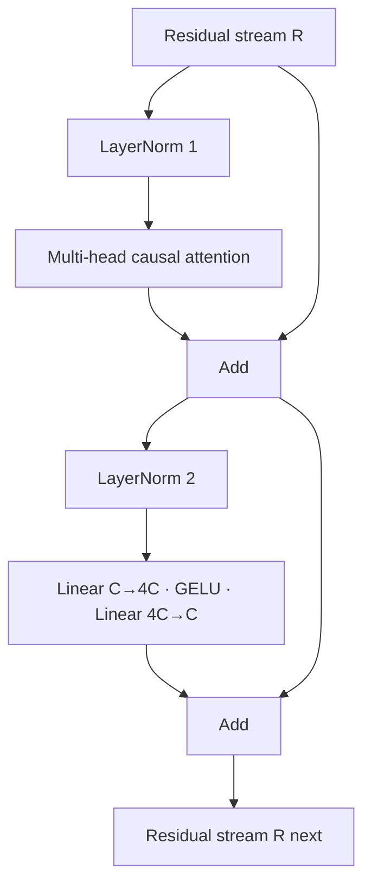

The complete pre-norm block is:

$$U=R+\operatorname{MHA}(\operatorname{LN}_1(R)),$$
$$R_{next}=U+\operatorname{MLP}(\operatorname{LN}_2(U)).$$

Both branches temporarily transform the representation but return to the same
shape, making the block composable.

### Reference code added in this lesson

```python
class TransformerBlock(nn.Module):
    def forward(self, embeddings):
        attention_input = self.attention_layer_norm(embeddings)
        attention_output, _ = self.multi_head_attention(attention_input)
        residual_after_attention = embeddings + attention_output

        feed_forward_input = self.feed_forward_layer_norm(residual_after_attention)
        feed_forward_output = self.feed_forward(feed_forward_input)
        residual_after_feed_forward = residual_after_attention + feed_forward_output

        return residual_after_feed_forward
```

The reusable block boundary is defined in
`study/snapshots/lesson_25/model.py`.

### Syntax and logic

- The class owns two LayerNorms, one multi-head attention module, and one
  feed-forward module; assigning them to `self` registers the whole hierarchy.
- `attention_input = self.attention_layer_norm(embeddings)` normalizes the first
  branch before attention while retaining `embeddings` for the skip path.
- `_` discards attention weights because normal forward computation only needs
  contextual embeddings.
- `residual_after_attention = embeddings + attention_output` completes the first
  pre-norm residual branch.
- `feed_forward_input` and `feed_forward_output` compute the second normalized
  sublayer from the already updated residual stream.
- `residual_after_feed_forward = residual_after_attention + feed_forward_output`
  completes the second skip connection; the following return exposes that
  named block result.
- Input and output are both `[B, T, C]`. This shape-preserving contract is what
  allows an arbitrary number of blocks to be chained.

### Code ↔ mathematics ↔ meaning

This section is included here because the code directly implements a mathematical transformation.

| Code | Mathematical reading | Plain meaning |
|---|---|---|
| `x = x + attention(ln1(x))` | $U=R+\operatorname{MHA}(\operatorname{LN}_1(R))$ | first pre-norm residual branch |
| `x = x + mlp(ln2(x))` | $R'=U+\operatorname{MLP}(\operatorname{LN}_2(U))$ | second pre-norm residual branch |

### Programmed versus learned

- **Defined by the programmer:** the branch order and residual wiring.
- **Learned by gradient training:** all projection, normalization, and MLP parameters.

## Lesson 26 — Multiple Transformer blocks

### Lesson summary: goal and result

- **Before:** one contextual transformation
- **Goal:** Repeat the Transformer block several times
- **After:** a hierarchy of L contextual transformations
- **Invariant:** the batch/time axes and causal constraint stay intact while features change

### Understand the transformation

One block performs one communication-and-computation pass. Depth chains several
blocks so later layers receive states that earlier layers have already
contextualized and transformed.

```learngpt-mermaid
flowchart LR
    R0["R₀ · [B,T,C]"] -->|"Block₁ · θ₁"| R1["R₁ · [B,T,C]"]
    R1 -->|"Block₂ · θ₂"| R2["R₂ · [B,T,C]"]
    R2 -->|"… independent blocks …"| RL["R_L · [B,T,C]"]
```

The blocks share an architecture, not parameters: `θ₁`, `θ₂`, and later
parameter sets are independent. Each output becomes the next input in sequence,
never in parallel. Shape and causal rules remain invariant while feature
content is progressively refined. Claims such as “early layers are local” are
possible empirical tendencies, not programmed responsibilities.

Independent parameters let each layer transform the representation it actually
receives rather than repeating an identical learned function. The Python loop
is therefore a data-flow loop over registered modules, not recurrent weight
sharing. Depth increases both computation and parameter count, but it does not
change the number of token positions or the vocabulary. The next layer always
receives a valid residual stream because every block honours the same interface.

Stacking changes depth and learned content, never the meaning of the tensor axes.

### Transformation, step by step

1. **INPUT — Identify the available state**

   The starting point is **one contextual transformation**. Before applying an operation,
   identify exactly which object already exists and what information it
   contains.

   **What to observe:** this is the input to the transformation, not the result
   we are trying to produce.

2. **OPERATION — Multiple Transformer blocks**

   Apply the operation **Repeat the Transformer block several times**. The trace below shows the objects
   in the order in which they are read, transformed, and handed to the next
   operation:

   ```learngpt-mermaid
   flowchart TB
       E["Embedding states"] -->|"Block 1"| R1["Richer states"]
       R1 -->|"Block 2"| R2["Further contextualized states"]
       R2 -->|"… through block L"| RL["Progressively refined states"]
   ```

   **What to observe:** every arrow represents a concrete operation; an
   intermediate line is both the output of the previous step and the input to
   the next one.

3. **INTERMEDIATE STATE — Follow each hand-off**

   Pause at every middle line in the trace. These values are not decoration:
   they expose what the program must already have produced before it can
   continue.

   **What to observe:** if an intermediate state is missing or has a different
   meaning, the next arrow does not receive the input it expects.

4. **CHECK — Protect the lesson constraint**

   Verify that **the batch/time axes and causal constraint stay intact while features change**. This check separates a correct transformation
   from a result that only looks plausible because its shape happens to fit.

   **What to observe:** the operation changes only what it claims to change;
   information needed by later lessons remains aligned.

5. **OUTPUT — Name the new state**

   The final result is **a hierarchy of L contextual transformations**. This becomes the course's new
   starting point rather than a disposable temporary value.

   **What to observe:** the output answers the opening summary and can be passed
   to the next lesson without rebuilding the process from scratch.

### Where we are now

The transformation is complete when **a hierarchy of L contextual transformations** is available and the
lesson constraint still holds. This is the right place to stop: performing the
next operation already would blur the boundary of what this lesson is
responsible for.

- **Changed:** one contextual transformation became **a hierarchy of L contextual transformations**.
- **Preserved:** the batch/time axes and causal constraint stay intact while features change.
- **Next:** **Final LayerNorm and output head** will use this result as its new input.

> **If you remember one thing:** the important result is not the operation's
> name; it is the new checkable state that the operation produces:
> **a hierarchy of L contextual transformations**.

### How to read the mathematics

The subscript l names the current block; l+1 means the state passed to the next block.

| Notation | Read it as | Meaning here |
|---|---|---|
| $L$ | L | number of Transformer blocks |
| $B$ | B | number of independent examples in one batch |
| $T$ | T | number of token positions in one context window |
| $C$ | C | number of features used to represent one token |
| $R_l$ | R sub l | residual-stream tensor entering block l |

### Visual worked example

> **Running example state:** pass the representation of `The cat sleeps here .` through several blocks while preserving its tensor geometry.

```learngpt-mermaid
flowchart LR
    R0["R₀ · [B,T,C]"] -->|"Block 1"| R1["R₁ · [B,T,C]"]
    R1 -->|"Block 2"| R2["R₂ · [B,T,C]"]
    R2 -->|"Block 3"| R3["R₃ · [B,T,C]"]
```

The geometry stays fixed while each block applies different learned parameters
and changes the information stored in the features.

Stacking $L$ blocks increases the number of sequential transformations while
maintaining `[B,T,C]`. Earlier blocks can form local features; later blocks can
compose them into more contextual ones, but this is an empirical tendency, not
a hard-coded hierarchy.

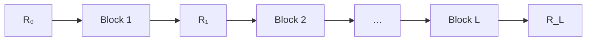

Depth increases parameters and compute roughly linearly. Attention within each
block costs approximately $O(BT^2C)$, while projections/MLP cost approximately
$O(BTC^2)$.

### Reference code added in this lesson

```python
self.transformer_blocks = nn.ModuleList(
    [
        TransformerBlock(
            embedding_size=embedding_size,
            head_size=head_size,
            context_size=context_size,
            num_heads=num_heads,
        )
        for _ in range(num_transformer_blocks)
    ]
)

for transformer_block in self.transformer_blocks:
    block_output = transformer_block(block_output)
```

The stack appears in `study/snapshots/lesson_26/model.py`.

### Syntax and logic

- `[TransformerBlock(...) for _ in range(num_transformer_blocks)]` constructs
  independent blocks; each receives the same
  architectural dimensions but learns its own parameters.
- `nn.ModuleList` registers every block for optimization, serialization, and
  device transfer while still allowing an explicit Python loop.
- `for transformer_block in self.transformer_blocks` visits the registered
  blocks in construction order.
- On each iteration, the previous output replaces `block_output`, so data flows
  sequentially rather than through blocks in parallel.
- The constructor rejects fewer than one block, and every iteration preserves
  `[B, T, C]`, maintaining a clear stack invariant.

### Code ↔ mathematics ↔ meaning

This section is included here because the code directly implements a mathematical transformation.

| Code | Mathematical reading | Plain meaning |
|---|---|---|
| `for block in blocks: x = block(x)` | $R_{l+1}=\operatorname{Block}_l(R_l)$ | feed each block's output to the next |

## Lesson 27 — Final LayerNorm before the existing output head

### Lesson summary: goal and result

- **Before:** contextual vectors sent directly to the output head introduced in lesson 17
- **Goal:** Normalize the completed residual stack before its existing vocabulary projection
- **After:** normalized final states consumed by the existing output head
- **Invariant:** the batch/time axes and causal constraint stay intact while features change

### Understand the transformation

The block stack ends with contextual C-vectors. The affine output head that
maps C features to V logits is not new: lesson 17 introduced it when token
representation width was separated from vocabulary width. Until this point,
however, the completed block stack has fed its final state directly to that
head. This lesson adds one operation only: Final LayerNorm prepares a stable
feature scale immediately before the existing vocabulary projection.

For the position after `cat`, the path is:

```learngpt-visual
{"type":"tensor-flow","title":"Insert Final LayerNorm before the existing vocabulary head","description":"The only new operation stabilizes the final C-vector; the output head already present since lesson 17 then creates V logits, and optional softmax makes their relative evidence readable.","stages":[{"label":"Final state · [0.70, −0.20, 0.40]","shape":"[C=3]","note":"Contextual residual features."},{"label":"New Final LayerNorm · h = [1.07, −1.34, 0.27]","shape":"[C=3]","note":"Normalized feature view."},{"label":"Existing vocabulary head · h × W_vocabᵀ + b_vocab","shape":"[V=4]","note":"Logits [0.20, 1.40, −0.30, 0.70]."},{"label":"Optional softmax","shape":"[V=4]","note":"Probabilities [0.15, 0.50, 0.09, 0.25]."}]}
```

The output head produces logits, not probabilities. Cross-entropy can consume
the logits directly; generation applies softmax later. Batch and time axes stay
fixed while the final feature width changes from C to V.

Each logit corresponds to exactly one tokenizer ID, so vocabulary order is an
invariant interface between tokenizer and output matrix. A large logit is only
relative evidence; it becomes a probability only after comparison with all
other logits. The newly inserted Final LayerNorm and the already existing
output head are applied independently at every position, yielding a complete
next-token training prediction for each row of the context window.

### Transformation, step by step

1. **INPUT — Identify the available state**

   The starting point is **contextual vectors**. Before applying an operation,
   identify exactly which object already exists and what information it
   contains.

   **What to observe:** this is the input to the transformation, not the result
   we are trying to produce.

2. **OPERATION — Insert Final LayerNorm before the existing output head**

   Apply the operation **Normalize the completed residual stack before its existing vocabulary projection**. The trace below shows the objects
   in the order in which they are read, transformed, and handed to the next
   operation:

   ```learngpt-visual
   {"type":"tensor-flow","title":"Add one normalization at the old stack-to-head boundary","description":"The new Final LayerNorm preserves [B,T,C]; the existing output head then performs the familiar C-to-V projection.","stages":[{"label":"Final residual states","shape":"[B,T,C]","note":"Previously sent directly to the head."},{"label":"New Final LayerNorm","shape":"[B,T,C]","note":"The lesson's only new transformation."},{"label":"Existing vocabulary output head","shape":"[B,T,V]","note":"One raw score per token ID."},{"label":"Vocabulary logits","shape":"[B,T,V]","note":"Consumed directly by cross-entropy."}]}
   ```

   **What to observe:** every arrow represents a concrete operation; an
   intermediate line is both the output of the previous step and the input to
   the next one.

3. **INTERMEDIATE STATE — Follow each hand-off**

   Pause at every middle line in the trace. These values are not decoration:
   they expose what the program must already have produced before it can
   continue.

   **What to observe:** if an intermediate state is missing or has a different
   meaning, the next arrow does not receive the input it expects.

4. **CHECK — Protect the lesson constraint**

   Verify that **the batch/time axes and causal constraint stay intact while features change**. This check separates a correct transformation
   from a result that only looks plausible because its shape happens to fit.

   **What to observe:** the operation changes only what it claims to change;
   information needed by later lessons remains aligned.

5. **OUTPUT — Name the new state**

   The final result is **vocabulary logits for every position**. This becomes the course's new
   starting point rather than a disposable temporary value.

   **What to observe:** the output answers the opening summary and can be passed
   to the next lesson without rebuilding the process from scratch.

### Where we are now

The transformation is complete when **vocabulary logits for every position** is available and the
lesson constraint still holds. This is the right place to stop: performing the
next operation already would blur the boundary of what this lesson is
responsible for.

- **Changed:** final contextual vectors are now normalized before the existing output head produces **vocabulary logits for every position**.
- **Preserved:** the batch/time axes and causal constraint stay intact while features change.
- **Next:** **Transformer training** will use this result as its new input.

> **If you remember one thing:** the important result is not the operation's
> name; it is the new checkable state that the operation produces:
> **the new component is Final LayerNorm; the vocabulary head is reused from lesson 17**.

### How to read the mathematics

The transposed vocabulary matrix aligns its C feature dimension with the state and leaves V output scores.

| Notation | Read it as | Meaning here |
|---|---|---|
| $B$ | B | number of independent examples in one batch |
| $T$ | T | number of token positions in one context window |
| $C$ | C | number of features used to represent one token |
| $V$ | V | vocabulary size: the number of possible token IDs |
| $Z$ | Z | raw vocabulary scores, also called logits |
| $W^{\mathsf T}$ | W transpose | the same matrix with rows and columns exchanged |

### Visual worked example

> **Running example state:** turn the final state after `cat` into vocabulary scores, where `sleeps` should receive strong probability.

| Vocabulary candidate | Final logit | Probability |
|---|---:|---:|
| `The` | 0.2 | 0.15 |
| `sleeps` | 1.4 | **0.50** |
| `here` | -0.3 | 0.09 |
| `.` | 0.7 | 0.25 |

The existing output head converts the newly normalized contextual $C$-vector
into $V$ competing scores.

After the last block:

$$F=\operatorname{LN}_f(R_L),\qquad
Z=FW_{vocab}^{\mathsf T}+b_{vocab}.$$

$F$ has shape `[B,T,C]`; $W_{vocab}$ has shape `[V,C]`; logits $Z$ have shape
`[B,T,V]`. For one state `[0.7,-0.2,0.4]`, normalization could yield
`[1.07,-1.34,0.27]`; projection might produce `[0.2,1.4,-0.3,0.7]`, and softmax
approximately `[0.15,0.50,0.09,0.25]`.

The final norm controls the feature scale received by the vocabulary classifier.

### Reference code added in this lesson

```python
self.final_layer_norm = nn.LayerNorm(
    normalized_shape=embedding_size,
)

for transformer_block in self.transformer_blocks:
    block_output = transformer_block(block_output)

block_output = self.final_layer_norm(block_output)
logits = self.output_head(block_output)
```

These are the literal new LayerNorm definition and its integration immediately
before the pre-existing head in `study/snapshots/lesson_27/model.py`.

### Syntax and logic

- `self.final_layer_norm = nn.LayerNorm(...)` registers the normalization that
  closes the residual stack.
- `self.output_head` is not registered here for the first time: the `C -> V`
  vocabulary projection has existed since lesson 17 and is reused unchanged.
- The loop returns the final residual representation `[B, T, C]`.
- `block_output = self.final_layer_norm(block_output)` normalizes the last
  feature axis and preserves all dimensions.
- The output head maps each `C`-wide position to `V` logits, yielding
  `[B, T, V]` for cross entropy or sampling.
- `self.output_head(self.final_layer_norm(block_output))` expresses that
  normalization sits after all blocks and before the head; moving it would
  describe a different architecture and checkpoint parameter layout.

### Code ↔ mathematics ↔ meaning

This section is included here because the code directly implements a mathematical transformation.

| Code | Mathematical reading | Plain meaning |
|---|---|---|
| `output_head(final_layer_norm(x))` | $Z=\operatorname{LN}_f(R_L)W_{vocab}^{\mathsf T}+b_{vocab}$ | score every vocabulary item |

# Module 7 — Train and measure


## Lesson 28 — Transformer training

### Lesson summary: goal and result

- **Before:** a complete model with initial weights
- **Goal:** Train the complete Transformer end to end
- **After:** the same model with weights updated from prediction error
- **Invariant:** architecture, tokenizer, corpus, and train split stay fixed; training batches are resampled while the control batch remains fixed

### Understand the transformation

The architecture is now complete, so the same next-token objective used for
the bigram model can train every embedding, attention projection, LayerNorm,
MLP, and output parameter together. Targets supervise the logits; they are not
features used to compute those logits.

One update has a strict order:

```learngpt-mermaid
flowchart LR
    XY["Input X and targets Y"] --> F["Transformer forward"]
    F --> Z["Logits"]
    Z --> L["Cross-entropy loss"]
    L --> ZERO["Zero old gradients"]
    ZERO --> BW["Backward"]
    BW --> G["Gradients for all parameters"]
    G --> STEP["AdamW step"]
    STEP --> UP["Updated parameters θ′"]
```

For a concrete check, the lesson clones one parameter before training, runs 30
seeded updates, and compares the value afterward. A non-zero difference proves
that optimization changed model state; evaluating the same control batch
before and after shows whether its loss improved. This snapshot contains no
Dropout and performs no gradient clipping—both would be separate operations
that must not appear in this lesson's trace.

“Fixed data” here means a fixed corpus and train split, not one batch repeated
for every update. `create_batch` resamples training windows at each step. A
separate control batch is created once and reused before and after training so
that its loss comparison holds the measured examples constant.

One scalar loss can update the whole network because every operation from the
selected embedding rows to the vocabulary logits participates in one autograd
graph. `zero_grad` clears gradients left by the previous iteration,
`backward` calculates new ones, and `step` mutates parameters. Reversing or
omitting those responsibilities changes the training process even if the
forward logits still have the expected shape.

### Transformation, step by step

1. **INPUT — Identify the available state**

   The starting point is **a complete model with initial weights**. Before applying an operation,
   identify exactly which object already exists and what information it
   contains.

   **What to observe:** this is the input to the transformation, not the result
   we are trying to produce.

2. **OPERATION — Transformer training**

   Apply the operation **Train the complete Transformer end to end**. The trace below shows the objects
   in the order in which they are read, transformed, and handed to the next
   operation:

   ```learngpt-mermaid
   flowchart TB
       XY["Input and target batch"] --> F["Transformer forward"]
       F --> LL["Logits and loss"]
       LL --> U["Backward and optimizer step"]
       U --> P["Updated Transformer parameters"]
   ```

   **What to observe:** every arrow represents a concrete operation; an
   intermediate line is both the output of the previous step and the input to
   the next one.

3. **INTERMEDIATE STATE — Follow each hand-off**

   Pause at every middle line in the trace. These values are not decoration:
   they expose what the program must already have produced before it can
   continue.

   **What to observe:** if an intermediate state is missing or has a different
   meaning, the next arrow does not receive the input it expects.

4. **CHECK — Protect the lesson constraint**

   Verify that **architecture, tokenizer, corpus, and train split stay fixed; training batches are resampled while the control batch remains fixed**. This check separates a correct transformation
   from a result that only looks plausible because its shape happens to fit.

   **What to observe:** the operation changes only what it claims to change;
   information needed by later lessons remains aligned.

5. **OUTPUT — Name the new state**

   The final result is **the same model with weights updated from prediction error**. This becomes the course's new
   starting point rather than a disposable temporary value.

   **What to observe:** the output answers the opening summary and can be passed
   to the next lesson without rebuilding the process from scratch.

### Where we are now

The transformation is complete when **the same model with weights updated from prediction error** is available and the
lesson constraint still holds. This is the right place to stop: performing the
next operation already would blur the boundary of what this lesson is
responsible for.

- **Changed:** a complete model with initial weights became **the same model with weights updated from prediction error**.
- **Preserved:** architecture, tokenizer, corpus, and train split; only sampled training windows and parameter values change, while the control batch is reused.
- **Next:** **Loss estimation** will use this result as its new input.

> **If you remember one thing:** the important result is not the operation's
> name; it is the new checkable state that the operation produces:
> **the same model with weights updated from prediction error**.

### How to read the mathematics

The chain rule means each layer receives the part of the final error attributable to its parameters.

| Notation | Read it as | Meaning here |
|---|---|---|
| $X$ | X | input token IDs or the current input matrix |
| $Y$ | Y | correct next-token IDs used as training targets |
| $Z$ | Z | raw vocabulary scores, also called logits |
| $\mathcal L$ | calligraphic L, or loss | one number measuring prediction error |
| $\theta$ | theta | all trainable model parameters considered together |
| $\nabla_\theta\mathcal L$ | gradient of the loss with respect to theta | directions in which parameters affect the loss |

### Visual worked example

> **Running example state:** train on batched windows of the repeated canonical sentence and backpropagate every next-token error.

```learngpt-mermaid
flowchart LR
    XY["X and Y"] --> E["Embeddings"]
    E --> B["Transformer blocks"]
    B --> Z["Logits"]
    Z --> L["Loss 4.2"]
    L -->|"backward"| GB["Block gradients"]
    GB --> GE["Embedding gradients"]
    GE -->|"optimizer step"| P["Updated parameters"]
```

One scalar error distributes responsibility through every differentiable layer.

One optimization step is a differentiable graph spanning every prior lesson:

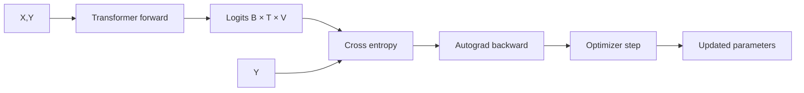

Backpropagation applies the chain rule from loss to the output head, blocks,
attention projections, and embedding rows. If $h=f(x;\theta_1)$ and
$L=g(h;\theta_2)$, then
$\partial L/\partial\theta_1=(\partial L/\partial h)
(\partial h/\partial\theta_1)$.

This snapshot has no dropout yet. Targets are passed to `forward` so it can
compute cross-entropy, but they do not participate in the path that produces
the logits.

### Reference code added in this lesson

```python
model = LanguageModel(
    vocabulary_size=vocabulary_size,
    context_size=CONTEXT_SIZE,
    embedding_size=EMBEDDING_SIZE,
    head_size=HEAD_SIZE,
    num_heads=NUM_HEADS,
    num_transformer_blocks=NUM_TRANSFORMER_BLOCKS,
)
optimizer = torch.optim.AdamW(
    model.parameters(),
    lr=LEARNING_RATE,
)

for step in range(1, TRAINING_STEPS + 1):
    input_tensor, target_tensor = create_batch(
        data=training_data,
        batch_size=BATCH_SIZE,
        context_size=CONTEXT_SIZE,
    )

    logits, loss = model(input_tensor, target_tensor)

    optimizer.zero_grad()
    loss.backward()
    optimizer.step()
```

The short seeded training run is `study/lessons/28_transformer_training.py`.

### Syntax and logic

- Keyword construction records each architectural choice explicitly;
  `HEAD_SIZE = EMBEDDING_SIZE // NUM_HEADS` uses integer division so heads tile
  the model width exactly.
- `optimizer = torch.optim.AdamW(model.parameters(), lr=LEARNING_RATE)` binds
  the complete registered Transformer parameter set to one optimizer.
- `_, loss = model(input_tensor, target_tensor)` verifies the training forward
  path and keeps only the scalar objective.
- `optimizer.zero_grad()`, `loss.backward()`, and `optimizer.step()` perform one
  ordered update: clear, differentiate, then mutate parameters.
- `torch.manual_seed(42)` makes parameter initialization and tensor sampling
  repeatable for the lesson.
- `next(model.parameters()).detach().clone()` captures a parameter before
  training without retaining an autograd graph; comparing it afterward proves
  the optimizer changed model state.
- A uniformly guessing model has expected loss near `ln(V)`. This lesson's
  character vocabulary has `V=51`, so its baseline is
  `ln(51) ≈ 3.93`. The `10.82` baseline for the future 50,257-token GPT-2 BPE
  project does not apply to this experiment.

### Code ↔ mathematics ↔ meaning

This section is included here because the code directly implements a mathematical transformation.

| Code | Mathematical reading | Plain meaning |
|---|---|---|
| `loss = model(x, y)` | $\mathcal L(X,Y;\theta)$ | measure the current model on the batch |
| `loss.backward()` | $\partial\mathcal L/\partial\theta$ | propagate error through all operations |

### Programmed versus learned

- **Defined by the programmer:** forward, backward, guards, and update order.
- **Learned by gradient training:** embeddings, attention, MLP, and output weights.

## Lesson 29 — Loss estimation

### Lesson summary: goal and result

- **Before:** one noisy batch loss
- **Goal:** Average several losses to obtain a more reliable measurement
- **After:** stable train and validation estimates
- **Invariant:** the architecture, tokenizer, and data stay fixed while parameters change or are measured

### Understand the transformation

The training loop already produces a loss, but until now that value has come
from one randomly selected batch. Imagine that the batch happens to contain an
easy continuation of `The cat sleeps here.`. Its loss may be low even though
the model has not improved in general. A different batch may contain rarer
transitions and produce a much higher value. Neither observation is false;
each one is simply too narrow to describe the whole dataset.

This lesson therefore changes **how progress is measured**, not what the model
learns. The evaluator draws several fresh windows from the training split,
computes one forward-only loss for each window, and averages them. It then
repeats the same process on the held-out validation split. The two means answer
different questions: the training estimate describes data the optimizer is
allowed to learn from, while the validation estimate shows how well the same
parameters transfer to data that does not produce updates.

The distinction matters because a useful training run needs both views. A
falling training loss with a rising validation loss can indicate that the
model is becoming too specialized to its training examples. If both estimates
fall, the change is more likely to represent useful learning. The estimates
are still samples rather than exact averages over the complete splits, but
combining several batches makes them less sensitive to one lucky or unlucky
window.

Cross-entropy is the value the optimizer uses, but perplexity is often the
more readable translation for humans. When the loss uses natural logarithms,
`perplexity = exp(loss)`. A perplexity of about 73 can be read loosely as “the
model is as uncertain as choosing among roughly 73 equally plausible next
tokens.” That reading is only comparable when the tokenizer, data split, and
evaluation procedure are the same.

Measurement must also leave the experiment untouched. The evaluator switches
the model to evaluation mode, disables autograd because no gradients are
needed, and performs no `backward()` or `optimizer.step()`. Lesson 29 does not
contain Dropout yet, so `model.eval()` does not currently change a stochastic
layer; establishing the correct evaluation-mode contract now becomes
important when Dropout arrives in lesson 35. When evaluation finishes, the
function restores the mode that the caller was using. The architecture,
tokenizer, data, and parameters therefore mean exactly what they meant before
evaluation; only new summary values have been produced.

The result is not a new model state. It is a more reliable pair of observations
that later code can print, compare, and eventually use when deciding whether a
checkpoint is worth keeping.

### Transformation, step by step

1. **INPUT — Start from one noisy observation**

   The model and both data splits already exist, but the available progress
   signal is the loss of one random batch.

   **What to observe:** the value is valid for that batch; the problem is that
   it may not represent the split as a whole.

2. **OPERATION — Measure both splits repeatedly**

   Run several forward-only measurements for training data and then for
   validation data:

   ```learngpt-mermaid
   flowchart LR
       TR["Training windows"] -->|"forward only"| TL["K training losses"]
       TL -->|"mean"| TE["Training estimate"]
       VA["Validation windows"] -->|"forward only"| VL["K validation losses"]
       VL -->|"mean"| VE["Validation estimate"]
       TE --> NO["No optimizer step"]
       VE --> NO
   ```

   **What to observe:** the two branches use the same model and calculation,
   but they sample from different splits and are averaged separately.

3. **INTERMEDIATE STATE — Keep the individual losses**

   Before a mean can exist, the evaluator has a short list of `K` scalar losses
   for each split.

   **What to observe:** averaging reduces batch-to-batch variation; it does not
   turn a sample into an exact measurement of every token in the corpus.

4. **CHECK — Confirm that evaluation changed nothing**

   Confirm that the evaluator used forward passes only, did not update any
   parameter, and restored the model's previous training or evaluation mode.

   **What to observe:** the comparison is meaningful only if both estimates
   describe the same unchanged model state.

5. **OUTPUT — Report two comparable estimates**

   The evaluator returns one mean training loss and one mean validation loss.

   **What to observe:** these values measure the current model; they are not
   gradients, probabilities, or parameter updates.

### Where we are now

The project can now judge a model state with less dependence on one random
batch. It still has not decided which state to save; it has created the
measurement that will make that later decision defensible.

- **Changed:** one noisy observation became **separate averaged training and validation estimates**.
- **Preserved:** architecture, tokenizer, data splits, model parameters, and the caller's operating mode.
- **Next:** **Checkpoint** will make a measured model state durable.

> **If you remember one thing:** evaluation observes the current model without
> training it; averaging several batches makes that observation more useful.

### How to read the mathematics

The summation says ‘add K batch losses’; dividing by K produces their arithmetic mean.

| Notation | Read it as | Meaning here |
|---|---|---|
| $K$ | K | number of micro-batches or evaluation batches, depending on context |
| $\mathcal L$ | calligraphic L, or loss | one number measuring prediction error |

### Visual worked example

> **Running example state:** average losses measured on train and validation windows produced from the same canonical data pipeline.

| Evaluation batch | Train loss | Validation loss |
|---:|---:|---:|
| 1 | 3.0 | 3.3 |
| 2 | 3.2 | 3.2 |
| 3 | 3.1 | 3.4 |
| 4 | 3.2 | 3.2 |
| **Mean** | **3.125** | **3.275** |

Averaging reduces the influence of one unusually easy or difficult batch.

One random batch is noisy. For $K$ evaluation batches:

$$\widehat L_{split}=\frac1K\sum_{k=1}^{K}L_k.$$

Example train losses `[3.0,3.2,3.1,3.2]` average to 3.125; validation losses
`[3.3,3.2,3.4,3.2]` average to 3.275. The gap is diagnostic, not itself an
optimization target. `torch.no_grad()` avoids building graphs and reduces memory.

Perplexity is $\exp(L)$, the effective branching factor under the model. A loss
of 4.29 corresponds to perplexity about 72.9, though comparisons are meaningful
only under the same tokenizer and evaluation data.

### Reference code added in this lesson

```python
@torch.no_grad()
def estimate_loss(
    model,
    training_data,
    validation_data,
    batch_size,
    context_size,
    eval_batches,
):
    was_training = model.training
    model.eval()

    losses_by_split = {}
    data_by_split = {
        "training": training_data,
        "validation": validation_data,
    }

    for split_name, split_data in data_by_split.items():
        split_losses = []

        for _ in range(eval_batches):
            input_tensor, target_tensor = create_batch(
                data=split_data,
                batch_size=batch_size,
                context_size=context_size,
            )
            _, loss = model(input_tensor, target_tensor)
            split_losses.append(loss.item())

        losses_by_split[split_name] = sum(split_losses) / len(split_losses)

    if was_training:
        model.train()

    return losses_by_split
```

The reusable evaluator is in `study/snapshots/lesson_29/training.py`.

### Syntax and logic

- `@torch.no_grad()` is a decorator that disables gradient recording for the
  complete function, reducing memory and preventing accidental backward state.
- `was_training = model.training` records the caller's mode before the evaluator
  changes it.
- `model.eval()` establishes inference behavior. No layer in lesson 29 changes
  behavior yet, but this mode becomes observable when Dropout is introduced in
  lesson 35; `losses_by_split = {}` prepares the result mapping.
- The dictionary `.items()` loop runs the same measurement procedure over both
  `training_data` and `validation_data` without duplicating code.
- `for _ in range(eval_batches)` samples several independent batches so the
  reported value is not tied to a single random window.
- `split_losses.append(loss.item())` copies each scalar tensor loss into a Python
  number and stores it for aggregation.
- `sum(split_losses) / len(split_losses)` computes the arithmetic mean for the
  current split.
- `if was_training: model.train()` restores training mode only when it was active
  before the call; no optimizer update occurs in this measurement function.

### Code ↔ mathematics ↔ meaning

This section is included here because the code directly implements a mathematical transformation.

| Code | Mathematical reading | Plain meaning |
|---|---|---|
| `sum(split_losses) / len(split_losses)` | $\widehat L=\frac1K\sum_k L_k$ | average noisy batch measurements |

# Module 8 — Save, reload, and generate


## Lesson 30 — Checkpoint

### Lesson summary: goal and result

- **Before:** useful model and optimizer state exists only inside the running process
- **Goal:** collect and save the minimal implemented state needed to reload a compatible model and optimizer
- **After:** one reloadable checkpoint containing seven related fields
- **Invariant:** saved weights, tokenizer IDs, architecture shapes, and training progress must keep the same interpretation after loading

### Understand the transformation

Training has now produced useful parameter values, but those values live in
memory. If the Python process stops, memory disappears. Saving only “some
weights” is not enough, because numbers are useful only when we know which
architecture, tokenizer, optimizer, and training step they belong to. This
lesson turns the current runtime state into a **self-describing checkpoint**:
one artifact that preserves both learned data and the contracts needed to
interpret it.

The model state is the first part of that artifact. It contains named
parameters and registered buffers, so loading it can recreate the learned
function that predicts the next token in `The cat sleeps here.`. That may be
enough for simple generation, but it is not enough for exact continuation of
training. AdamW also maintains moving statistics derived from previous
gradients. If those statistics are discarded, training resumes with the same
weights but with a different update history.

The implemented checkpoint groups exactly seven related fields into one
dictionary: `model_state_dict`, `optimizer_state_dict`, `model_config`, `step`,
`losses`, `char_to_id`, and `id_to_char`. Each field answers a different
restoration question: *what was learned, how was it being updated, which
shapes created it, how far did training progress, and what do the stored token
IDs mean?* Later production lessons add stronger provenance and continuation
state, including random-number states and a dataset fingerprint; those fields
are not part of lesson 30 yet.

Serialization changes this structured in-memory object into bytes on disk.
The lesson implementation creates the parent directory and calls
`torch.save(checkpoint, checkpoint_path)` directly. This establishes
persistence, but it is **not an atomic write**: an interruption during the
save could leave the destination incomplete. Atomic replacement is a later
production hardening step. Keeping that limitation visible is part of reading
the project honestly lesson by lesson.

Loading performs the reverse transformation. `torch.load(...,
weights_only=True)` reconstructs the dictionary, but a compatible model
instance must already exist before `load_state_dict(...)` can copy the saved
values into it. If an optimizer is supplied, its stored state is loaded too.
The configuration and tokenizer maps are available to the caller, but this
small helper does not yet validate dataset identity or restore random-number
generators.

The checkpoint does not improve the model by itself. Its transformation is
about durability: a temporary runtime becomes a named, inspectable handoff
between processes. It can support generation or a basic resume with compatible
code, but it should not yet be called an exact stochastic continuation of the
entire experiment.

A checkpoint is still not a complete copy of the entire software environment.
The code that defines the model and the PyTorch runtime must remain available
and compatible. This boundary is useful: the artifact records the experiment
state, while versioned source code records how that state is interpreted.
Reliable restoration depends on both, so provenance metadata should help a
reader connect the saved file to the code and data that produced it.

### Transformation, step by step

1. **INPUT — Gather the live training state**

   Collect the current model parameters, optimizer statistics, model
   configuration, step, recorded losses, and tokenizer mappings.

   **What to observe:** these objects are mutually related; saving them
   together preserves one coherent moment of the experiment.

2. **OPERATION — Assemble one checkpoint payload**

   ```learngpt-mermaid
   flowchart TB
       C["Checkpoint"] --> M["model_state_dict · learned parameters and buffers"]
       C --> O["optimizer_state_dict · AdamW moving statistics"]
       C --> CFG["model_config · architecture and compatible shapes"]
       C --> S["step · training position"]
       C --> H["losses · recorded loss history"]
       C --> F["char_to_id · text to token-ID meaning"]
       C --> I["id_to_char · token ID to text meaning"]
   ```

   **What to observe:** the file is not “the model weights plus decoration”;
   each branch protects a different part of restoration.

3. **CONSTRAINT — Keep all fields semantically compatible**

   A parameter tensor must fit the architecture that loads it, and token ID
   `4` must decode to the same symbol before and after saving.

   **What to observe:** matching file formats are insufficient if shapes or
   tokenizer meanings differ.

4. **OPERATION — Serialize the complete object**

   `torch.save(checkpoint, checkpoint_path)` converts the dictionary and its
   tensors into a persistent artifact at the requested path.

   **What to observe:** persistence changes where state lives, not the learned
   values it represents; this direct lesson write is not yet atomic.

5. **CHECK — Reload into compatible objects**

   Recreate compatible model and optimizer objects, read the dictionary with
   `weights_only=True`, then call their respective `load_state_dict(...)`
   operations.

   **What to observe:** successful deserialization is only the first check;
   the restored objects must also accept and correctly interpret the state.

6. **OUTPUT — Recover the same experiment state**

   The new process recovers model state, optional optimizer state, recorded
   progress, configuration, and tokenizer maps from the seven-field payload.

   **What to observe:** the original process is gone, but the state explicitly
   saved by this lesson remains available; RNG and dataset identity do not.

### Where we are now

The project can now preserve a learned state beyond the lifetime of one Python
process. The checkpoint is both a container of tensors and a record of the
contracts that make those tensors usable.

- **Changed:** temporary in-memory state has become one durable, reloadable artifact.
- **Preserved:** saved parameter values, tokenizer meaning, model configuration, optimizer history, and recorded progress.
- **Next:** generation will rebuild the model from the checkpoint and test it in a fresh process.

> **If you remember one thing:** a reliable checkpoint preserves the
> experiment needed to interpret the weights, not only the weights themselves.

### How to read the mathematics

No new model equation is introduced. Read the checkpoint as a seven-part state
tuple whose components must be interpreted together.

| Notation | Read it as | Meaning here |
|---|---|---|
| $\theta$ | theta | model parameters and registered buffers |
| $\omega$ | omega | optimizer state |
| $\gamma_m$ | gamma m | model configuration |
| $\tau$ | tau | saved training step |
| $h$ | h | recorded loss history |
| $\phi,\phi^{-1}$ | phi and its inverse | character-to-ID and ID-to-character maps |

### Visual worked example

> **Running example state:** express the saved state for the
> `The cat sleeps here.` training task as one structured tuple whose fields must
> remain mutually compatible.

The implemented payload can be written abstractly as

$$
\mathcal C=
(\theta,\omega,\gamma_m,\tau,h,\phi,\phi^{-1}),
$$

where each component protects a different restoration contract:

| Component | Concrete key | Needed for generation | Needed for a basic resume |
|---|---|:---:|:---:|
| $\theta$ | `model_state_dict` | yes | yes |
| $\omega$ | `optimizer_state_dict` | no | yes |
| $\gamma_m$ | `model_config` | yes | yes |
| $\tau$ | `step` | no | yes |
| $h$ | `losses` | no | useful for continuity |
| $\phi$ | `char_to_id` | yes | yes |
| $\phi^{-1}$ | `id_to_char` | yes | yes |

The central state invariant is not merely “all fields can be deserialized.”
They must describe the same experiment. For every named parameter $k$,

$$
\operatorname{shape}(\theta_k)
=
\operatorname{shape}\!\left(
\operatorname{Model}(\gamma_m)_k
\right),
$$

and the two tokenizer maps must remain inverses:

$$
\phi^{-1}(\phi(c))=c.
$$

Generation needs fewer fields because it evaluates the learned function
without continuing optimizer history. A truly exact resume needs additional
state not present in $\mathcal C$, such as RNG state, schedule details when
they are not derivable from `step`, and a verified dataset identity.

The implemented file operation is simply

$$
\operatorname{serialize}(\mathcal C)\longrightarrow P_{\mathrm{final}}.
$$

Because no temporary path and atomic rename are used yet, a reader must not
infer crash safety from this equation. Later production lessons add that
stronger persistence contract.

### Reference code added in this lesson

```python
checkpoint_path = Path(checkpoint_path)
checkpoint_path.parent.mkdir(parents=True, exist_ok=True)

checkpoint = {
    "model_state_dict": model.state_dict(),
    "optimizer_state_dict": optimizer.state_dict(),
    "model_config": model_config,
    "step": step,
    "losses": losses,
    "char_to_id": char_to_id,
    "id_to_char": id_to_char,
}

torch.save(checkpoint, checkpoint_path)

return checkpoint_path
```

Save and load functions are in `study/snapshots/lesson_30/checkpoint.py`.

### Syntax and logic

- `model.state_dict()` stores named model parameters and buffers rather than a
  live Python module object.
- `optimizer.state_dict()` stores AdamW moving statistics and parameter-group
  state needed to continue optimization.
- `model_config`, `step`, and `losses` preserve the architecture and the exact
  point reached by the run.
- `char_to_id` and `id_to_char` preserve the tokenizer contract required to
  interpret both prompts and generated IDs.
- `mkdir(parents=True, exist_ok=True)` creates missing parent directories and
  does not fail when they already exist.
- `torch.save(checkpoint, checkpoint_path)` serializes the complete dictionary to
  the prepared destination. `load_state_dict(...)` later copies saved values
  into a compatible instance.

## Lesson 31 — Generate from a checkpoint

### Lesson summary: goal and result

- **Before:** a checkpoint plus readable prompt
- **Goal:** Reconstruct a model from a checkpoint and generate independently
- **After:** decoded generated text
- **Invariant:** learned weights and the tokenizer keep their meaning across saving and generation

### Understand the transformation

A checkpoint is useful only if the project can leave the training process,
start again from the saved artifact, and obtain a working model. This lesson
performs that test. It does not reuse the model object that happened to remain
in memory after training. Instead, it reads `model_config`, creates a new
compatible model, loads `model_state_dict`, and switches the reconstructed
model to evaluation mode.

The tokenizer maps stored beside the weights are equally important. The
readable prompt `The` must be converted into the same token IDs that the model
saw during training. If the mapping changed, a valid tensor could still refer
to the wrong characters. Keeping the mappings aligned preserves the meaning
of both the prompt and every generated ID.

Generation then becomes a loop. The current IDs enter the model, the final
position supplies the scores for the next character, one ID is sampled, and
that ID is appended to the context. On the next iteration the enlarged context
is the new input. This repeated feedback is what makes generation
**autoregressive**: the model conditions each new choice on the prompt and on
its own earlier choices.

For the running example, the prompt may grow from `The` toward a sequence such
as `The cat sleeps here.` one character at a time. The exact continuation is
not guaranteed because sampling is random. What this lesson verifies is the
path: checkpoint → compatible model and tokenizer → prompt IDs → generated IDs
→ readable text. The next lesson will expose controls for how conservative
those random choices should be.

### Transformation, step by step

1. **INPUT — Begin with an artifact and a prompt**

   The checkpoint provides saved configuration, weights, and tokenizer maps;
   the user provides readable prompt text.

   **What to observe:** neither input alone is sufficient. The prompt needs the
   tokenizer, and the weights need a compatible model definition.

2. **OPERATION — Reconstruct the generation path**

   Recreate the model, load the saved state, and encode the prompt:

   ```learngpt-mermaid
   flowchart TB
       IN["Checkpoint and readable prompt"] --> R["Restore model and tokenizer"]
       R --> IDS["Prompt IDs"]
       IDS --> S["Autoregressive sampling"]
       S --> G["Generated IDs"]
       G --> D["Decoded text"]
   ```

   **What to observe:** the new process uses only explicit saved information;
   it does not depend on the original in-memory training model.

3. **INTERMEDIATE STATE — Grow the token sequence**

   Each iteration produces one next-token ID and appends it to the IDs already
   available.

   **What to observe:** the output of one iteration becomes part of the next
   iteration's input; generation is not one large independent prediction.

4. **CHECK — Preserve token meaning**

   Decode the IDs with the same mapping that encoded the prompt and was saved
   with the checkpoint.

   **What to observe:** a successful tensor load is not enough if token IDs
   acquire a different textual meaning.

5. **OUTPUT — Return readable generated text**

   Decode the complete prompt-plus-continuation sequence.

   **What to observe:** the text proves that the saved artifact supports an
   independent inference path, not that every sampled continuation is good.

### Where we are now

The checkpoint has crossed its first real boundary: it has been used by a
freshly reconstructed model to turn a readable prompt into readable generated
text.

- **Changed:** a stored artifact and prompt became **an autoregressively generated continuation**.
- **Preserved:** learned parameters, architecture compatibility, and token-ID meaning.
- **Next:** **Sampling controls** will shape the choices made at each generation step.

> **If you remember one thing:** independent generation is the practical test
> that a checkpoint and its tokenizer metadata can be interpreted again.

### How to read the mathematics

The arrows describe reconstruction order rather than arithmetic: config first, then compatible weights, then prompt IDs.

| Notation | Read it as | Meaning here |
|---|---|---|
| $X$ | X | input token IDs or the current input matrix |
| $T$ | T | number of token positions in one context window |
| $Z$ | Z | raw vocabulary scores, also called logits |

### Visual worked example

> **Running example state:** restore the saved model and use the prompt `The` to continue the canonical sentence.

```learngpt-mermaid
flowchart LR
    CFG["Checkpoint config"] --> M["Construct empty model"]
    W["Checkpoint weights"] --> P["Fill model parameters"]
    M --> P
    Q["Prompt · The"] --> E["Encode prompt IDs"]
    P --> G["Generate more IDs"]
    E --> G
    G --> T["Tokenizer decode"]
    T --> O["Readable text"]
```

The new process depends only on saved artifacts and source code, not the old
training process.

Loading reverses construction in a strict order: read payload, reconstruct the
model from saved configuration, load weights, switch to eval,
encode prompt, generate IDs, decode. A shape mismatch is useful evidence that
code/config and weights do not describe the same model.

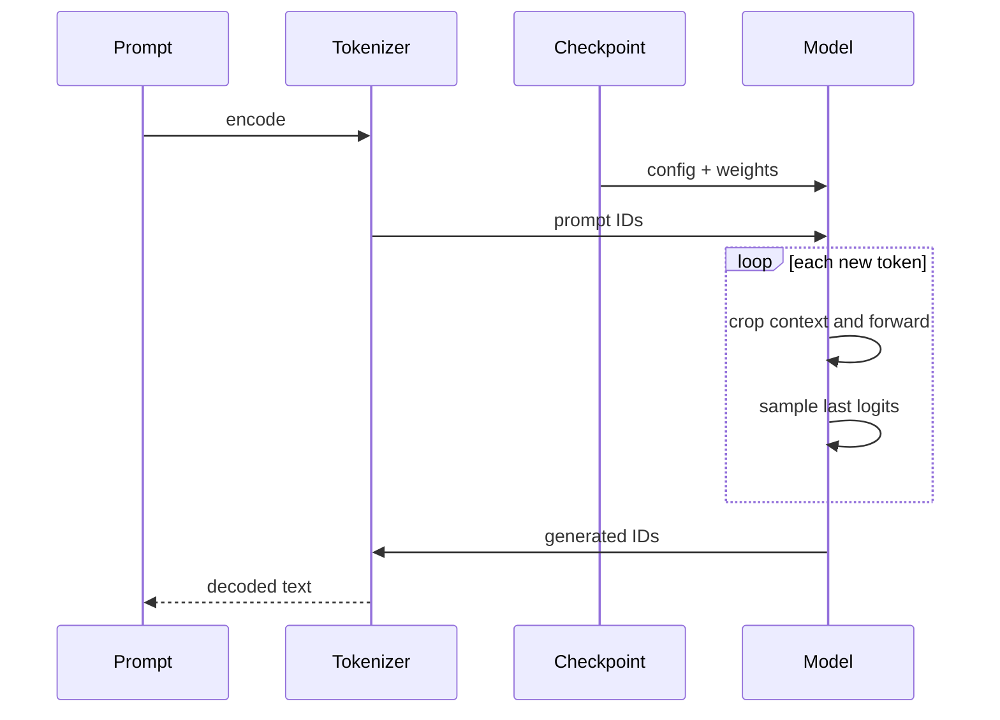

### Reference code added in this lesson

```python
def load_model_from_checkpoint(checkpoint_path):
    checkpoint = torch.load(checkpoint_path, weights_only=True)

    model = LanguageModel(**checkpoint["model_config"])
    model.load_state_dict(checkpoint["model_state_dict"])
    model.eval()

    return model, checkpoint


def generate_text_from_checkpoint(checkpoint_path, prompt_text, max_new_tokens):
    model, checkpoint = load_model_from_checkpoint(checkpoint_path)
    char_to_id = checkpoint["char_to_id"]
    id_to_char = checkpoint["id_to_char"]

    unknown_chars = sorted(set(prompt_text) - set(char_to_id))
    if unknown_chars:
        raise ValueError(f"The prompt contains characters outside the vocabulary: {unknown_chars}")

    prompt_ids = encode(prompt_text, char_to_id)
    input_ids = torch.tensor([prompt_ids], dtype=torch.long)

    with torch.no_grad():
        generated_ids = model.generate(input_ids, max_new_tokens=max_new_tokens)

    generated_text = decode(generated_ids[0].tolist(), id_to_char)

    return generated_text, checkpoint
```

The independent loading path is in `study/snapshots/lesson_31/generate.py`.

### Syntax and logic

- `torch.load(checkpoint_path, weights_only=True)` restricts loading to safe
  tensor-compatible data rather than arbitrary pickled objects.
- `LanguageModel(**checkpoint["model_config"])` expands the saved dictionary into
  named arguments and rebuilds the architecture expected by the weights.
- `model.load_state_dict(checkpoint["model_state_dict"])` copies the saved
  parameter values into that compatible model instance.
- `model.eval()` establishes inference behavior. Lesson 31 has no Dropout yet;
  the call becomes behaviorally visible when mode-dependent layers arrive in
  lesson 35.
- `unknown_chars` checks the prompt before encoding, so the character
  tokenizer fails with an explicit message instead of an indirect lookup
  error.
- `encode(prompt_text, checkpoint["char_to_id"])` applies the vocabulary stored
  with the checkpoint rather than a newly constructed mapping.
- `[prompt_ids]` creates batch dimension `B=1`; `dtype=torch.long` provides the
  integer type required by embedding lookup.
- `with torch.no_grad()` prevents construction of a backward graph while
  `model.generate(...)` produces the continuation. The saved inverse vocabulary
  then decodes generated IDs back into text.

## Lesson 32 — Sampling controls

### Lesson summary: goal and result

- **Before:** one raw next-token score vector
- **Goal:** Control how conservative or varied token sampling is
- **After:** a filtered probability distribution
- **Invariant:** learned weights and the tokenizer keep their meaning across saving and generation

### Understand the transformation

The reconstructed model returns logits: raw scores that rank possible next
tokens but do not yet form probabilities. Sampling controls sit between those
scores and the random choice. They do not retrain the model or change what it
has learned; they change how the generation procedure interprets the model's
preferences at this moment.

**Temperature** acts first. Dividing the logits by a value below `1` increases
their separation, so softmax will concentrate more probability on the
highest-scoring candidates. A value above `1` reduces the separation and makes
the distribution flatter. The model has not become more or less certain in a
learned sense: the sampler is deliberately making its output more conservative
or more exploratory.

**Top-k** then limits which candidates remain available. If `k` is small, only
the highest-scoring token IDs can be selected; all other logits are replaced
by `−∞` before softmax and therefore receive zero probability. This can stop a
very long low-probability tail from producing surprising characters. It can
also remove a token that would occasionally have been useful, so stronger
filtering is a trade-off rather than an automatic improvement.

In `The cat sleeps here.`, the same model may prefer the same few continuations
after `The cat`, yet different temperature and top-k values can make one run
repeat the safest continuation and another explore alternatives. The weights
and tokenizer remain unchanged. The new object is a filtered probability
distribution from which the next token can be sampled.

### Transformation, step by step

1. **INPUT — Read the next-token logits**

   Start from the score vector produced for the final active position.

   **What to observe:** logits express relative preference; they need not be
   positive and do not sum to one.

2. **OPERATION — Reshape and filter the choices**

   Apply temperature, top-k filtering, and softmax in this order:

   ```learngpt-mermaid
   flowchart TB
       Z["Raw next-token logits"] --> T["Divide by temperature"]
       T --> S["Sharper or flatter scores"]
       S --> K["Keep top-k and apply softmax"]
       K --> P["Filtered probabilities"]
       P --> SAMPLE["Sample"]
       SAMPLE --> N["Next token"]
   ```

   **What to observe:** temperature changes every score's scale; top-k changes
   which token IDs remain possible.

3. **INTERMEDIATE STATE — Inspect the filtered probabilities**

   After softmax, the surviving candidates have non-negative probabilities
   that sum to one.

   **What to observe:** filtered-out candidates have probability zero; a
   surviving candidate is possible but not guaranteed.

4. **CHECK — Separate model knowledge from decoding policy**

   Confirm that only the logits used by the sampler are transformed. No model
   parameter or tokenizer mapping is updated.

   **What to observe:** different output text can come from a different policy
   even when the checkpoint is identical.

5. **OUTPUT — Sample one next token**

   Draw one ID from the filtered distribution and append it to the context.

   **What to observe:** sampling converts a distribution into one concrete
   branch of the possible continuation.

### Where we are now

Generation now has an explicit decoding policy instead of an unexplained
random draw. The model supplies preferences; temperature and top-k decide how
those preferences are converted into an actual choice.

- **Changed:** raw logits became **a controlled probability distribution and one sampled ID**.
- **Preserved:** checkpoint weights, vocabulary meaning, and the autoregressive generation loop.
- **Next:** **Best checkpoint** will decide which evaluated model state deserves to be retained.

> **If you remember one thing:** temperature changes how sharply preferences
> are expressed; top-k changes which choices are allowed at all.

### How to read the mathematics

Dividing by temperature changes score spacing; replacing logits with minus infinity means those tokens receive zero probability.

| Notation | Read it as | Meaning here |
|---|---|---|
| $Z$ | Z | raw vocabulary scores, also called logits |
| $p$ | p | a probability after normalization |
| $\tau$ | tau | sampling temperature |
| $V$ | V | vocabulary size: the number of possible token IDs |

### Visual worked example

> **Running example state:** after `The cat`, reshape the candidate distribution so sampling can favor `sleeps` while remaining controllable.

| Candidate | Raw logit | Divide by $\tau=0.7$ | Keep top-2 | Probability |
|---|---:|---:|---:|---:|
| `sleeps` | 2.0 | 2.86 | 2.86 | 0.76 |
| `rests` | 1.2 | 1.71 | 1.71 | 0.24 |
| `runs` | 0.4 | 0.57 | $-\infty$ | 0.00 |
| `.` | -0.1 | -0.14 | $-\infty$ | 0.00 |

Temperature reshapes confidence; top-k removes candidates completely.

Temperature rescales logits before softmax:

$$p_i(\tau)=\frac{\exp(z_i/\tau)}{\sum_j\exp(z_j/\tau)}.$$

$\tau<1$ sharpens; $\tau>1$ flattens; $\tau\to0$ approaches argmax when the
largest logit is unique. The implementation rejects $\tau\leq0$. Top-$k$
uses the $k$-th largest logit as a threshold and sets smaller logits to
$-\infty$; tied logits at the threshold can leave more than $k$ candidates.

For logits `[2.0,1.2,0.4,-0.1]`, $\tau=0.7$ gives
`[2.86,1.71,0.57,-0.14]`; top-2 yields `[2.86,1.71,-∞,-∞]`, whose probabilities
are about `[0.76,0.24,0,0]`.

These controls change decoding, not learned knowledge.

### Reference code added in this lesson

```python
last_token_logits = logits[:, -1, :] / temperature

if top_k is not None:
    top_k = min(top_k, last_token_logits.shape[-1])
    top_values, _ = torch.topk(last_token_logits, top_k)
    minimum_top_value = top_values[:, [-1]]
    last_token_logits = last_token_logits.masked_fill(
        last_token_logits < minimum_top_value,
        float("-inf"),
    )
```

The controls are implemented in `study/snapshots/lesson_32/model.py` and passed
through `study/snapshots/lesson_32/generate.py`.

### Syntax and logic

- Dividing logits by a positive temperature changes their relative scale before
  softmax. Values below `1` sharpen the distribution; values above `1` flatten
  it. The function rejects zero or negative values.
- `if top_k is not None` keeps the filtering branch optional, and
  `min(top_k, last_token_logits.shape[-1])` prevents asking for more entries than
  the vocabulary contains.
- `torch.topk(..., k)` returns the `k` largest values and their indices. Only
  the values are needed, so `_` discards the indices.
- `top_values[:, [-1]]` keeps the smallest surviving value with shape `[B, 1]`,
  allowing it to broadcast across `[B, V]`.
- `last_token_logits < minimum_top_value` creates the boolean mask of values to
  remove.
- `masked_fill(..., float("-inf"))` gives those entries zero probability after
  softmax. `None` leaves the vocabulary unfiltered.

### Code ↔ mathematics ↔ meaning

This section is included here because the code directly implements a mathematical transformation.

| Code | Mathematical reading | Plain meaning |
|---|---|---|
| `logits = logits / temperature` | $z_i/\tau$ | change relative score spacing |
| `logits[below_top_k] = -inf` | $p_i=0$ for excluded IDs | remove candidates before softmax |

### Programmed versus learned

- **Defined by the programmer:** temperature, top-k filtering, and multinomial sampling.
- **Learned by gradient training:** the logits being filtered.

## Lesson 33 — Best checkpoint

### Lesson summary: goal and result

- **Before:** evaluated model states with no retained quality winner
- **Goal:** retain the state with the lowest validation estimate observed so far
- **After:** one best checkpoint selected by a consistent validation rule
- **Invariant:** learned weights and the tokenizer keep their meaning across saving and generation

### Understand the transformation

Compare evaluations produced by the same validation pipeline and retain a
snapshot because its estimated validation loss improved, not because one
generated sample happened to sound good. The implementation samples fresh
validation windows at each evaluation; it does not reuse identical batches and
does not use generation quality as the selection rule.

Training does not guarantee that every later step is better than every earlier
one. An update can help the sampled training batch while slightly hurting the
held-out data. If the project saves only the final evaluated state, it can lose
an earlier set of parameters that generalized better. The lesson therefore
adds a small memory to the evaluation process: `best_validation_loss`, which
starts at infinity and records the lowest estimate observed so far.

At each evaluation, the current validation estimate is compared with that
record. If it is lower, the record is updated and the current model,
optimizer, configuration, progress, and tokenizer are saved to the best
checkpoint path. If it is equal or higher, the existing file remains
untouched. The decision is deliberately mechanical. A sample such as
`The cat sleeps here.` may sound better or worse by chance, but that subjective
impression does not participate in checkpoint selection.

The word **best** must therefore be read narrowly: best according to the
lowest sampled validation-loss estimate seen by this run. Fresh validation
windows introduce some sampling noise, so the file is not proof of an
universally optimal model. It is the winner under one consistent quantitative
rule. This lesson also saves only that winner. A separate `latest` checkpoint
for resuming the most recently evaluated state appears later in the production
project.

### Transformation, step by step

1. **INPUT — Evaluate the current model state**

   Use the lesson 29 pipeline to obtain a validation-loss estimate for the
   parameters that exist at the current training step.

   **What to observe:** selection begins from a measured model state, not from
   the appearance of one generated sample.

2. **OPERATION — Compare with the running record**

   Compare the new estimate with `best_validation_loss`:

   ```learngpt-mermaid
   flowchart LR
       M["Current model"] -->|"fresh validation windows"| L["Estimated validation loss"]
       L --> D{"Loss lower than best so far?"}
       D -->|"yes"| S["Save new best checkpoint"]
       D -->|"no"| K["Keep existing best checkpoint"]
   ```

   **What to observe:** only a strict improvement replaces the checkpoint.

3. **INTERMEDIATE STATE — Update the best value first**

   When the current estimate wins, store it as the new reference value before
   constructing the checkpoint payload.

   **What to observe:** the metric written beside the weights must describe the
   same winning model state.

4. **CHECK — Keep the artifact interpretable**

   Save compatible model, optimizer, configuration, progress, and tokenizer
   information together.

   **What to observe:** replacing the best file must not separate weights from
   the token meanings and shapes needed to reload them.

5. **OUTPUT — Retain one validation winner**

   The checkpoint path points to the state with the lowest validation estimate
   observed so far.

   **What to observe:** this is the best checkpoint only; it is not yet a
   separate record of the latest evaluated step.

### Where we are now

Evaluation can now produce a durable decision instead of only a printed
number. The run retains the strongest state it has observed according to one
explicit rule, even if later training becomes worse.

- **Changed:** evaluated states now compete for **one retained best checkpoint**.
- **Preserved:** the validation rule and the saved model/tokenizer interpretation.
- **Next:** **Optimizer and scheduler** will make the update process safer and time-dependent.

> **If you remember one thing:** “best” means the lowest validation estimate
> observed so far; it does not mean the latest step or the nicest sample.

### How to read the mathematics

The minimum expression means ‘retain the smaller validation loss seen so far’.

| Notation | Read it as | Meaning here |
|---|---|---|
| $\mathcal L$ | calligraphic L, or loss | one number measuring prediction error |

### Visual worked example

> **Running example state:** compare checkpoints on the same validation pipeline and retain the one that best predicts held-out canonical windows.

| Evaluation step | Validation loss | Best checkpoint after comparison |
|---:|---:|---|
| 1000 | 4.50 | step 1000 |
| 2000 | **4.20** | step 2000 |
| 3000 | 4.28 | **still step 2000** |

This lesson implements only the best-checkpoint branch. The production project
later adds a distinct latest checkpoint for resume; that later role must not be
attributed to the lesson 33 snapshot.

The newest model is not guaranteed to generalize best. At evaluation $e$:

$$\text{save best if }L_{val}^{(e)}<L_{best};\qquad
L_{best}\leftarrow\min(L_{best},L_{val}^{(e)}).$$

Because each estimate uses fresh random windows, it is a noisy comparison from
the same validation distribution, not a score on an identical fixed batch.

### Reference code added in this lesson

```python
best_validation_loss = math.inf
best_checkpoint_path = None

if losses["validation"] < best_validation_loss:
    best_validation_loss = losses["validation"]
    best_checkpoint_path = save_checkpoint(
        checkpoint_path=checkpoint_path,
        model=model,
        optimizer=optimizer,
        model_config=model_config,
        step=step,
        losses=losses,
        char_to_id=char_to_id,
        id_to_char=id_to_char,
    )
```

The selection rule is in `study/snapshots/lesson_33/training.py`.

### Syntax and logic

- `math.inf` is larger than any finite first loss, guaranteeing that the first
  evaluation can become the initial best.
- `best_checkpoint_path = None` represents the absence of any saved best model
  before the first successful evaluation.
- `losses["validation"]` selects the held-out metric, not the training metric.
- The strict `<` avoids rewriting the file when validation merely ties the
  existing best.
- `best_validation_loss = losses["validation"]` updates the comparison baseline
  before later evaluations run.
- `best_checkpoint_path = save_checkpoint(...)` records the path returned by the
  save function. Later lessons
  add a separate latest checkpoint for resuming interrupted work; best and
  latest serve different purposes.

## Lesson 34 — Optimizer and scheduler

### Lesson summary: goal and result

- **Before:** raw gradients and one fixed step size
- **Goal:** Make parameter updates adaptive and bounded while the learning rate warms up and then decays
- **After:** clipped, scheduled AdamW updates
- **Invariant:** learned weights and the tokenizer keep their meaning across saving and generation

### Understand the transformation

The previous training loop can already follow gradients, but it uses one fixed
step size and gives every parameter the same immediate treatment. A
Transformer run benefits from more control. This lesson combines three
mechanisms that act at different points: gradient clipping, AdamW, and a
learning-rate schedule.

After backpropagation, all parameter gradients form one global state. Gradient
clipping measures their combined norm and rescales them only when that norm
exceeds the configured limit. The direction is preserved while an unusually
large update is bounded. This is a safety mechanism for the current step; it
does not decide the long-term learning-rate curve.

AdamW then uses moving first- and second-moment estimates to adapt updates to
the recent gradient history of each parameter. Its decoupled weight decay also
shrinks parameters independently of the loss gradient. Parameter grouping is
introduced only in lesson 36; in lesson 34 the single optimizer group receives
the configured decay. For the running
sentence `The cat sleeps here.`, the next-token objective is unchanged: only
the rule that converts its gradients into parameter movement becomes more
stable.

At the beginning of each loop iteration, the scheduler determines the learning
rate from the current step and writes it into the optimizer. During
**warmup**, the rate increases gradually from a small value toward the base
rate. After warmup, cosine decay makes it progressively smaller until it
reaches the configured minimum. The forward pass, backward pass, optional
clipping, and AdamW step then run using that already assigned rate. The
schedule therefore does **not** decrease from the first step onward: it warms
up first and decays afterwards.

### Transformation, step by step

1. **INPUT — Begin with gradients and the current step**

   Backpropagation has produced raw gradients, and the loop knows where it is
   in the configured training schedule.

   **What to observe:** gradients describe a direction; the scheduler supplies
   the scale used at this point in training.

2. **OPERATION — Bound, schedule, and adapt the update**

   Assign the current learning rate first, compute the loss and gradients, then
   clip if necessary before AdamW updates the parameters:

   ```learngpt-mermaid
   flowchart TD
       STEP["Current training step"] --> SCHED["Compute scheduled learning rate"]
       SCHED --> SET["Write rate into optimizer parameter groups"]
       SET --> FWD["Sample batch · forward · loss"]
       FWD --> BWD["Backward creates raw gradients"]
       BWD --> ENABLED{"Gradient clipping enabled?"}
       ENABLED -->|"yes"| N["Compute global gradient norm"]
       ENABLED -->|"no"| KEEP["Keep gradients unchanged"]
       N --> C{"Norm above limit?"}
       C -->|"yes"| CLIP["Rescale gradients"]
       C -->|"no"| KEEP["Keep gradients unchanged"]
       CLIP --> A["AdamW moments and decoupled weight decay"]
       KEEP --> A
       A --> U["Parameter update at the assigned rate"]
   ```

   **What to observe:** the scheduler runs before the forward pass in the
   source; clipping runs after backward and before the AdamW step. They solve
   different problems and must not be read as one combined operation.

3. **INTERMEDIATE STATE — Read the scheduled learning rate**

   The current step maps to a scalar learning rate: increasing during warmup,
   then decreasing along the cosine curve.

   **What to observe:** “later is smaller” applies after warmup, not across the
   complete schedule.

4. **CHECK — Preserve the learning objective**

   Confirm that these controls change only how an accepted gradient becomes an
   update.

   **What to observe:** targets, tokenizer IDs, model outputs, and loss
   semantics are the same as before.

5. **OUTPUT — Apply one controlled AdamW step**

   AdamW applies a bounded update at the learning rate assigned to this step.

   **What to observe:** the parameters change, while the optimizer retains
   moment estimates needed by future steps.

### Where we are now

The training loop now controls both sudden instability and long-term step
size. It can warm up cautiously, learn at the base scale, and then refine with
smaller steps.

- **Changed:** raw gradients and a fixed rate became **clipped, adaptive updates with warmup and decay**.
- **Preserved:** next-token objective, tokenizer meaning, and checkpoint-compatible parameter shapes.
- **Next:** **Dropout and weight tying** will regularize activations and share vocabulary parameters.

> **If you remember one thing:** the learning rate first warms up and only then
> decays; gradient clipping and AdamW control different parts of the update.

### How to read the mathematics

Adam's equations are running averages: one tracks direction, one tracks squared magnitude; the norm compresses all gradients into one size.

| Notation | Read it as | Meaning here |
|---|---|---|
| $\theta$ | theta | all trainable model parameters considered together |
| $\nabla_\theta\mathcal L$ | gradient of the loss with respect to theta | directions in which parameters affect the loss |
| $\eta$ | eta | learning rate: update step size |
| $\beta_1,\beta_2$ | beta one and beta two | Adam memory factors for gradient averages |
| $\lambda$ | lambda | weight-decay strength |
| $\lVert g\rVert_2$ | L2 norm of g | single magnitude summarizing all gradient values |

### Visual worked example

> **Running example state:** control the parameter update produced by errors such as predicting the wrong token after `cat`.

| Protection | Small numerical example |
|---|---|
| Warmup | step 250/1000 uses 25% of peak LR |
| Cosine decay | later steps move toward minimum LR |
| Gradient norm | $\sqrt{6^2+8^2}=10$ |
| Clip to 1 | `[6,8] → [0.6,0.8]` |
| AdamW | moments adapt each parameter's update |

Clipping preserves direction while limiting total magnitude.

AdamW maintains first and second moments:

$$m_t=\beta_1m_{t-1}+(1-\beta_1)g_t,$$
$$v_t=\beta_2v_{t-1}+(1-\beta_2)g_t^2,$$
$$\theta_t=(1-\eta_t\lambda)\theta_{t-1}
-\eta_t\frac{\hat m_t}{\sqrt{\hat v_t}+\epsilon}.$$

Warmup raises the learning rate gradually; cosine decay lowers it toward a
minimum. Gradient clipping computes global norm
$\|g\|_2=\sqrt{\sum_i g_i^2}$ and, if above $c$, rescales
$g\leftarrow g\,c/\|g\|_2$. For `[6,8]`, norm 10 and limit 1 yield `[0.6,0.8]`.

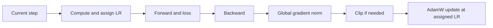

### Reference code added in this lesson

```python
def get_learning_rate(
    step,
    base_learning_rate,
    min_learning_rate,
    warmup_steps,
    decay_steps,
):
    if step < warmup_steps:
        return base_learning_rate * step / warmup_steps

    if step > decay_steps:
        return min_learning_rate

    decay_ratio = (step - warmup_steps) / (decay_steps - warmup_steps)
    cosine_coefficient = 0.5 * (1.0 + math.cos(math.pi * decay_ratio))

    return min_learning_rate + cosine_coefficient * (
        base_learning_rate - min_learning_rate
    )

optimizer.zero_grad()
loss.backward()

if gradient_clip is not None:
    torch.nn.utils.clip_grad_norm_(model.parameters(), gradient_clip)

optimizer.step()
```

The scheduler and optimizer helpers are in
`study/snapshots/lesson_34/training.py`.

### Syntax and logic

- `if step < warmup_steps` linearly interpolates from zero toward the base rate.
- `if step > decay_steps` fixes the learning rate at its configured minimum
  after decay has completed.
- `decay_ratio = (step - warmup_steps) / (decay_steps - warmup_steps)` maps the
  middle interval to the normalized range from `0` to `1`.
- `0.5 * (1.0 + math.cos(math.pi * decay_ratio))` converts that ratio into a
  smooth coefficient that moves from `1` to `0`.
- The final interpolation combines `min_learning_rate` and
  `base_learning_rate - min_learning_rate`, so the schedule never decays below
  its configured floor.
- `optimizer.param_groups` receives the computed rate each step, so AdamW uses
  the schedule instead of a constant value.
- `clip_grad_norm_` modifies gradients in place only when their combined norm
  exceeds the threshold. Lesson 42 additionally checks the raw, unclipped norm
  and rejects or retries invalid gradients before any update.

### Code ↔ mathematics ↔ meaning

This section is included here because the code directly implements a mathematical transformation.

| Code | Mathematical reading | Plain meaning |
|---|---|---|
| `clip_grad_norm_(..., c)` | $g\leftarrow g\min(1,c/\lVert g\rVert_2)$ | limit magnitude only when the norm exceeds the threshold |

### Programmed versus learned

- **Defined by the programmer:** warmup, decay, clipping, moments, and weight-decay policy.
- **Learned by gradient training:** optimizer moments and model parameters.

## Lesson 35 — Dropout and weight tying

### Lesson summary: goal and result

- **Before:** deterministic branches and separate possible tables
- **Goal:** Regularize activations and share the input/output token table
- **After:** regularized branches and a tied vocabulary geometry
- **Invariant:** learned weights and the tokenizer keep their meaning across saving and generation

### Understand the transformation

The optimizer now updates the model in a controlled way, but the network can
still become too dependent on particular activation paths and it can maintain
two large, unrelated vocabulary tables. This lesson addresses those two
problems with mechanisms that are independent but complementary: Dropout and
weight tying.

During training, **Dropout** randomly replaces some activations with zero and
rescales the activations that remain. The model cannot assume that one feature
or branch will always be available, so it is encouraged to distribute useful
information across several paths. When the model is placed in evaluation mode,
Dropout is disabled; a prompt such as `The cat sleeps here.` then follows a
deterministic network for a fixed set of parameters.

**Weight tying** changes parameters rather than temporary activations. The
token embedding table maps each vocabulary ID to a `C`-wide representation.
The output head needs the reverse vocabulary geometry: it compares a `C`-wide
state with every vocabulary entry to produce logits. Instead of learning two
independent matrices for these related roles, the implementation makes the
output head weight refer to the very same `Parameter` as the token embedding
weight.

“Same parameter” is stronger than “same initial values.” A gradient arriving
through the input embedding role and a gradient arriving through the output
projection role both update one shared tensor. This reduces the parameter
count and keeps input and output token geometry connected. The tokenizer
mapping must remain unchanged, because row `i` must represent the same token
when read as an embedding and when scored as a possible output.

### Transformation, step by step

1. **INPUT — Identify two kinds of duplication**

   Training activations always follow the same available paths, and input and
   output vocabulary roles can use separate matrices.

   **What to observe:** Dropout acts on temporary values; weight tying acts on
   persistent parameters.

2. **OPERATION — Regularize paths and tie vocabulary weights**

   Apply both mechanisms at their respective boundaries:

   ```learngpt-mermaid
   flowchart TB
       A["Training activations"] --> D["Dropout removes temporary paths"]
       D --> R["More robust internal representations"]
       E["Input token embedding weights"] <-->|"same Parameter"| H["Output vocabulary-head weights"]
       E --> G["Shared input/output token geometry"]
       H --> G
   ```

   **What to observe:** Dropout changes which training activations survive;
   tying makes two module attributes point to one learned tensor.

3. **INTERMEDIATE STATE — Compare training and evaluation**

   In training mode, masks vary between forward passes. In evaluation mode,
   every activation path is available and no random mask is applied.

   **What to observe:** this difference belongs to runtime mode; it does not
   create two sets of learned weights.

4. **CHECK — Verify real parameter sharing**

   Confirm that the token embedding weight and output-head weight are the same
   `Parameter`, not copied tensors with equal values.

   **What to observe:** vocabulary row indices must keep the same tokenizer
   meaning on both sides of the model.

5. **OUTPUT — Use a regularized, shared geometry**

   The model trains with randomly thinned activation paths and one shared
   input/output vocabulary matrix.

   **What to observe:** evaluation disables Dropout, while weight tying remains
   part of the model in every mode.

### Where we are now

The model now has a runtime regularizer and a structural parameter-sharing
rule. Neither changes the next-token task, but both change how efficiently and
robustly the model learns it.

- **Changed:** deterministic training paths and separate vocabulary roles became **Dropout-regularized activations and one tied matrix**.
- **Preserved:** tokenizer row meaning, model interfaces, and deterministic evaluation behavior.
- **Next:** **Production data and optimizer groups** will scale storage and assign weight decay deliberately.

> **If you remember one thing:** Dropout changes temporary activations; weight
> tying makes two vocabulary roles learn through the same parameter.

### How to read the mathematics

The random mask is zero or one; division by one minus p keeps the expected activation scale unchanged.

| Notation | Read it as | Meaning here |
|---|---|---|
| $V$ | V | vocabulary size: the number of possible token IDs |
| $C$ | C | number of features used to represent one token |
| $E$ | E | learned token-embedding table |
| $p_{drop}$ | p drop | probability that dropout removes one activation during training |

### Visual worked example

> **Running example state:** regularize feature activations produced by the canonical sequence and reuse the token table for its output scores.

| Training activation | Dropout mask | Scaled output for $p_{drop}=0.5$ |
|---:|---:|---:|
| 0.8 | 1 | 1.6 |
| -0.3 | 0 | 0.0 |
| 0.5 | 1 | 1.0 |

The expected scale is preserved. Separately, weight tying makes the input
embedding table and output classifier reference the same $V\times C$ matrix.

For $0\leq p_{drop}<1$, training-time inverted dropout uses mask
$m_i\sim\text{Bernoulli}(1-p_{drop})$:

$$y_i=\frac{m_i}{1-p_{drop}}x_i.$$

The scaling preserves $E[y_i]=x_i$; evaluation uses the full deterministic
vector. The implementation also accepts the boundary value $p_{drop}=1$, for
which PyTorch returns zeros during training instead of applying the fraction
above. Dropout regularizes attention/MLP pathways but cannot compensate for
poor data or evaluation.

Weight tying uses the token embedding matrix as the vocabulary projection. In
this lesson `nn.Linear` keeps its default bias, so the concrete equation is:

$$E\in\mathbb R^{V\times C},\qquad Z=FE^{\mathsf T}+b.$$

Input and output therefore share $VC$ parameters and a common representational
space, saving a separate `[V,C]` matrix.

### Reference code added in this lesson

```python
self.embedding_dropout = nn.Dropout(dropout)
self.attention_dropout = nn.Dropout(dropout)
self.output_head = nn.Linear(
    in_features=embedding_size,
    out_features=vocabulary_size,
)

if tie_weights:
    self.output_head.weight = self.token_embedding_table.weight
```

Dropout is also applied inside attention, multi-head output, and the
feed-forward path in `study/snapshots/lesson_35/model.py`.

### Syntax and logic

- `nn.Dropout(p)` randomly zeros elements with probability `p` only while
  `model.training` is true; `model.eval()` disables that randomness.
- `nn.Dropout(dropout)` rescales surviving activations during training so their
  expected magnitude
  remains stable.
- `self.output_head = nn.Linear(in_features=embedding_size,
  out_features=vocabulary_size)` creates the untied output projection before
  the optional sharing decision.
- `if tie_weights` keeps sharing configurable rather than changing every model
  checkpoint unconditionally.
- The assignment for weight tying does not copy values. Both modules reference
  the same `Parameter`, so one gradient update changes the shared matrix.
- Tying is shape-valid because the embedding matrix is `[V, C]`, exactly the
  weight shape expected by a `C -> V` linear layer.

### Code ↔ mathematics ↔ meaning

This section is included here because the code directly implements a mathematical transformation.

| Code | Mathematical reading | Plain meaning |
|---|---|---|
| `output_head.weight = token_embedding.weight` | $Z=FE^{\mathsf T}+b$ | reuse the token table for output scoring while retaining the output bias |

### Programmed versus learned

- **Defined by the programmer:** dropout probability and weight tying.
- **Learned by gradient training:** the shared embedding values.

# Module 9 — Production-ready training


## Lesson 36 — Production data and optimizer groups

### Lesson summary: goal and result

- **Before:** small in-memory character data
- **Goal:** Replace toy data paths and naive parameter handling with production-oriented ones
- **After:** BPE memmaps and explicit AdamW parameter groups
- **Invariant:** the next-token objective and model semantics stay unchanged while the runtime becomes more robust

### Understand the transformation

Move from the compact lesson setup to production-sized token storage and
explicit parameter grouping. This snapshot does not yet compute a dataset
fingerprint; verified data identity arrives in the final production project.

The earlier character tokenizer and in-memory tensors make every operation
easy to inspect, but they do not represent how a larger language-model run
stores text. This is the transition from the educational tokenizer to the
production tokenizer. The character tokenizer taught the address idea with a
tiny vocabulary created from the current text. The GPT-2 BPE tokenizer brings
a fixed external vocabulary, token IDs for common fragments, and explicit
handling for the allowed special token `<|endoftext|>`. Here the corpus is
encoded with that GPT-2 BPE tokenizer. A phrase
such as `The cat sleeps here.` is no longer necessarily split into one ID per
character: common byte sequences can share one token. The learning objective
is still “predict the next ID,” but the vocabulary and sequence length now
follow BPE rather than the didactic character map.

The prepared training and validation IDs are written to binary files and
opened as `numpy.memmap` arrays. A memmap lets the program read the requested
window without loading the complete token stream into Python memory. Batch
creation still selects a start position and produces shifted `[B,T]` input and
target tensors. Storage changed; the next-token relationship did not.

This is also where “real dataset” begins to mean “preprocessed artifact,” not
just “a text file I opened in Python.” The training loop should consume stable
token files whose tokenizer, split, dtype, and path are known. Later lessons
add stronger identity checks around those artifacts; this lesson establishes
the storage and optimizer conventions first.

The optimizer side becomes explicit too. AdamW should apply weight decay to
matrix-like weights, while biases and one-dimensional normalization parameters
normally belong to a no-decay group. The code inspects named trainable
parameters, separates tensors with two or more dimensions from tensors with
fewer dimensions, and creates two parameter groups with different
`weight_decay` values.

These changes make the path more production-oriented, not fully production
complete. The lesson does not yet fingerprint the token files, so a later run
cannot prove that two paths contain identical data. It also does not yet
accumulate gradients across micro-batches. Those boundaries remain visible so
the reader can distinguish what scaled here from what will be hardened later.

### Transformation, step by step

1. **INPUT — Start from the toy data and optimizer path**

   The project currently uses a small character stream in memory and one
   undifferentiated optimizer policy.

   **What to observe:** the model objective already works; storage scale and
   parameter treatment are the limitations being changed.

2. **OPERATION — Build two production-oriented paths**

   Transform data and optimizer inputs in parallel:

   ```learngpt-mermaid
   flowchart LR
       RAW["Raw corpus"] --> BPE["GPT-2 BPE"]
       BPE --> FILES["Token files"]
       W["Named parameters"] --> GROUPS["Decay and no-decay groups"]
       FILES --> READY["Production-ready data and optimizer inputs"]
       GROUPS --> READY
   ```

   **What to observe:** BPE and memmap change how IDs are created and stored;
   grouping changes which parameters receive weight decay.

3. **INTERMEDIATE STATE — Read a window without loading the corpus**

   The memmap exposes token slices on demand, and batch creation converts only
   the selected windows into `torch.long` tensors.

   **What to observe:** the batch still contains shifted inputs and targets;
   memory mapping does not alter token order.

4. **CHECK — Inspect the optimizer groups**

   Verify that matrix-like parameters enter the decay group and
   one-dimensional parameters enter the no-decay group.

   **What to observe:** every trainable parameter must appear exactly once;
   grouping changes regularization policy, not the loss.

5. **OUTPUT — Expose scalable inputs to training**

   The training loop receives BPE token memmaps and an AdamW optimizer with
   explicit decay and no-decay groups.

   **What to observe:** dataset identity is still trusted from the selected
   path; no fingerprint is computed in this snapshot.

### Where we are now

Data no longer needs to fit entirely in memory, and AdamW no longer treats
every trainable tensor with one decay rule. The model still receives ordered
token windows and learns the same next-token task.

- **Changed:** toy character storage and one optimizer policy became **BPE memmaps and explicit AdamW groups**.
- **Preserved:** split boundaries, token order, shifted targets, and the causal next-token objective.
- **Next:** **Gradient accumulation** will combine several memory-sized micro-batches into one update.

> **If you remember one thing:** token storage and optimizer policy scale here;
> verified dataset identity and gradient accumulation still come later.

### How to read the mathematics

The power-of-two statement only explains storage capacity: uint16 can address IDs from zero through 65,535.

| Notation | Read it as | Meaning here |
|---|---|---|
| $N$ | N | number of ordered characters or tokens in a sequence |
| $V$ | V | vocabulary size: the number of possible token IDs |
| $B$ | B | number of independent examples in one batch |
| $T$ | T | number of token positions in one context window |
| $\theta$ | theta | all trainable model parameters considered together |

### Visual worked example

> **Running example state:** represent the same sentence with a production BPE tokenizer—whose real IDs differ from the course shorthand—and stream it efficiently.

```learngpt-mermaid
flowchart LR
    T["FineWeb-Edu text"] -->|"BPE"| IDS["Token IDs"]
    IDS -->|"uint16"| BIN["train.bin and val.bin"]
    BIN -->|"memory map"| B["int64 batches"]
    MW["Matrix weights"] --> DECAY["AdamW decay group"]
    BN["Biases and norms"] --> NODECAY["AdamW no-decay group"]
    B --> OPT["Production training inputs"]
    DECAY --> OPT
    NODECAY --> OPT
```

Storage and optimizer policy change, but the next-token objective does not.

This lesson replaces the toy character stream with GPT-2 BPE IDs stored in
memory-mapped `uint16` files. Since $50{,}257<2^{16}$, each stored token uses two
bytes. Batches convert IDs to `int64` because PyTorch embedding lookup requires
long indices.

AdamW parameter groups apply decay to parameters with two or more dimensions
while excluding one-dimensional biases and normalization scales. This
dimension rule is the policy implemented by the lesson; it is a useful
heuristic, not a universal semantic classification of every parameter.

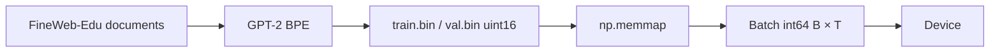

### Reference code added in this lesson

```python
def load_token_data(data_dir=DEFAULT_DATA_DIR, split="train"):
    data_dir = Path(data_dir)
    data_path = data_dir / f"{split}.bin"

    if not data_path.exists():
        raise FileNotFoundError(f"Processed dataset not found: {data_path}")

    return np.memmap(data_path, dtype=np.uint16, mode="r")


def configure_optimizer(
    model,
    learning_rate,
    weight_decay,
    betas=(0.9, 0.95),
    device=None,
):
    parameter_dict = {
        name: parameter
        for name, parameter in model.named_parameters()
        if parameter.requires_grad
    }
    decay_parameters = [
        parameter
        for parameter in parameter_dict.values()
        if parameter.dim() >= 2
    ]
    no_decay_parameters = [
        parameter
        for parameter in parameter_dict.values()
        if parameter.dim() < 2
    ]
    optimizer_groups = [
        {
            "params": decay_parameters,
            "weight_decay": weight_decay,
        },
        {
            "params": no_decay_parameters,
            "weight_decay": 0.0,
        },
    ]

    device = device or get_default_device()
    fused_available = "fused" in inspect.signature(torch.optim.AdamW).parameters
    use_fused = fused_available and torch.device(device).type == "cuda"
    extra_args = {"fused": True} if use_fused else {}

    return torch.optim.AdamW(
        optimizer_groups,
        lr=learning_rate,
        betas=betas,
        **extra_args,
    )
```

This production boundary spans `batching.py`, `tokenizer.py`, `device.py`,
`checkpoint.py`, and `training.py` under `study/snapshots/lesson_36/`.

### Syntax and logic

- `data_dir = Path(data_dir)` normalizes the caller's path, and
  `f"{split}.bin"` builds `train.bin` or `val.bin`.
- The explicit existence check raises a useful `FileNotFoundError` before
  `np.memmap(..., mode="r")` exposes the file as an array without loading it
  all into RAM.
- `uint16` stores IDs up to 65,535, enough for GPT-2's 50,257-token vocabulary;
  batches convert slices to `int64` because PyTorch embeddings require long IDs.
- `model.named_parameters()` yields both stable names and tensors;
  `if parameter.requires_grad` excludes frozen state from optimization.
- `parameter.dim() >= 2` selects matrices such as linear and embedding weights for
  decay.
- `parameter.dim() < 2` sends one-dimensional biases and normalization scales to the
  zero-decay group.
- The two dictionaries in `optimizer_groups` associate each parameter list with
  its own `weight_decay` value.
- `betas=(0.9, 0.95)` is the implemented AdamW moment configuration.
- `get_default_device()` chooses CUDA, then MPS, then CPU. The signature and
  device checks request fused AdamW only when the installed PyTorch exposes
  the option and the selected device is CUDA; otherwise the standard path
  consumes the same parameter groups.

### Programmed versus learned

- **Defined by the programmer:** data format, grouping rules, and transfer policy.
- **Learned by gradient training:** token/model weights and optimizer moments.

## Lesson 37 — Gradient accumulation

### Lesson summary: goal and result

- **Before:** one memory-limited micro-batch
- **Goal:** Build one effective large-batch gradient from several smaller forward passes
- **After:** one averaged effective-batch gradient
- **Invariant:** the next-token objective and model semantics stay unchanged while the runtime becomes more robust

### Understand the transformation

One micro-batch fits in memory, but the desired effective batch may not.
PyTorch solves this without storing all activations at once because parameter
gradients add to the existing gradient buffers on every `backward()` call.

For each of the $K$ equal-sized micro-batches, the loop computes a next-token
loss, divides it by $K$, and runs backward. After the $K$ calls, each parameter
holds the gradient of the mean micro-batch loss. Only then does the loop clip
the completed gradient and execute one optimizer step. Clearing gradients or
stepping inside the inner loop would instead produce $K$ smaller updates and
would not implement the same effective batch.

Accumulation changes the number of tokens contributing to one update, not the
model's context window: every forward pass still sees tensors of shape
`[B,T]`, while one optimizer update represents $B\times T\times K$ tokens.

The simple division by $K$ assumes equal-sized micro-batches whose losses use
the same mean reduction. If their valid-token counts differ, each loss must be
weighted by its token count instead. Stochastic layers can also produce
different masks than one physically large batch, so the two executions need
not be bit-for-bit identical. The essential contract is the update ordering:
clear once, scale and backpropagate $K$ losses, then clip and step once.

### Transformation, step by step

1. **INPUT — Prepare the K micro-batches**

   Draw or receive $K$ equal-sized micro-batches. Each one independently
   produces a loss for the same next-token objective.

   **What to observe:** each forward pass still has batch shape `[B,T]`; the
   model context has not grown to `K * T`.

2. **OPERATION — Scale each loss and run backward**

   For micro-batch $k$, compute $L_k/K$ and call `backward()` before moving to
   the next micro-batch.

   **What to observe:** division happens before backward, so every gradient
   contribution is already scaled by $1/K$.

3. **INTERMEDIATE STATE — Accumulate K gradient contributions**

   The loop does not call `zero_grad()` between micro-batches. Each backward
   pass therefore adds its contribution to the same parameter buffers.

   **What to observe:** after $k$ backward calls, the buffers contain
   $\frac1K\sum_{i=1}^{k}\nabla L_i$; model parameters have not changed yet.

4. **OPERATION — Clip once and step once**

   After all $K$ micro-batches, clip the completed accumulated gradient and
   call `optimizer.step()` exactly once.

   **What to observe:** clipping measures the effective-batch gradient, not one
   partial micro-batch gradient; there is one parameter update for all $K$
   backward calls.

5. **OUTPUT — Start the next update with empty buffers**

   Once the optimizer has consumed the averaged gradient, clear the gradient
   buffers before accumulating the next effective batch.

   **What to observe:** one update used $B\times T\times K$ effective tokens,
   while the loss definition and model outputs stayed unchanged.

### Where we are now

The training loop can now build one averaged gradient from $K$ forward and
backward passes without requiring the full effective batch to fit in memory.
Loss scaling, accumulation, clipping, and stepping have distinct positions in
the loop.

- **Changed:** one optimizer update now combines $K$ micro-batches.
- **Preserved:** every micro-batch uses the same next-token loss and `[B,T]`
  context contract.
- **Next:** **Configuration and resume** will make the longer-running training
  process restartable.

> **If you remember one thing:** divide each loss by $K$, run backward $K$
> times, then clip once and step once.

### How to read the mathematics

The sum adds micro-batch gradients; division by K makes their total equal to a mean rather than K times too large.

| Notation | Read it as | Meaning here |
|---|---|---|
| $B$ | B | number of independent examples in one batch |
| $T$ | T | number of token positions in one context window |
| $K$ | K | number of micro-batches or evaluation batches, depending on context |
| $\mathcal L$ | calligraphic L, or loss | one number measuring prediction error |
| $\nabla_\theta\mathcal L$ | gradient of the loss with respect to theta | directions in which parameters affect the loss |

### Visual worked example

> **Running example state:** divide batches containing canonical-sequence windows into micro-batches while preserving the equivalent total gradient.

| Micro-batch | Raw loss | Backward value $L_k/K$, $K=4$ |
|---:|---:|---:|
| 1 | 4.0 | 1.00 |
| 2 | 3.6 | 0.90 |
| 3 | 3.8 | 0.95 |
| 4 | 4.2 | 1.05 |
| Optimizer steps |  | **one, after all four** |

The accumulated gradient corresponds to the mean micro-batch loss.

When a desired effective batch does not fit in memory, process $K$ micro-batches
before one optimizer step. Divide each loss by $K$:

$$g=\sum_{k=1}^{K}\nabla_\theta\frac{L_k}{K}
=\frac1K\sum_{k=1}^{K}\nabla_\theta L_k.$$

For equal-sized micro-batches whose losses use the same mean reduction, this
equals the gradient of their combined mean loss. Unequal token counts require
weighting by count, and stochastic layers such as dropout can prevent
bit-for-bit equivalence. Effective tokens per update in this single-process
lesson are $B\times T\times K$.

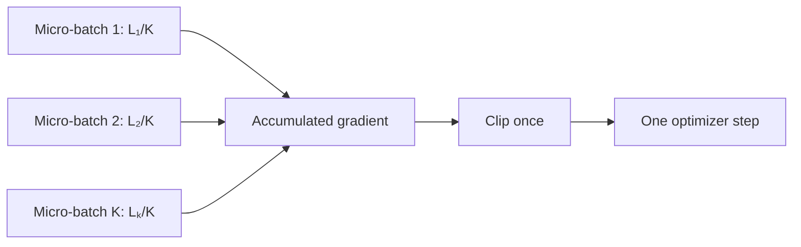

### Reference code added in this lesson

```python
optimizer.zero_grad(set_to_none=True)
total_loss = 0.0

for _ in range(gradient_accumulation_steps):
    input_tensor, target_tensor = create_batch(
        data=training_data,
        batch_size=batch_size,
        context_size=context_size,
        device=device,
    )
    _, loss = model(input_tensor, target_tensor)
    loss = loss / gradient_accumulation_steps
    total_loss += loss.item()
    loss.backward()

if gradient_clip is not None:
    torch.nn.utils.clip_grad_norm_(model.parameters(), gradient_clip)

optimizer.step()
```

The accumulation loop is in `study/snapshots/lesson_37/training.py`.

### Syntax and logic

- Gradients accumulate because `zero_grad` runs once before the inner loop and
  `optimizer.step` once after it.
- `set_to_none=True` releases the old gradient tensors instead of filling them
  with zeros; the next backward pass allocates fresh gradients on supported
  devices.
- Each loop iteration calls `create_batch(...)` to obtain one micro-batch on the
  requested device.
- `_, loss = model(input_tensor, target_tensor)` computes the micro-batch
  objective while discarding logits.
- `loss = loss / gradient_accumulation_steps` divides each loss by the number of
  micro-batches, making the accumulated
  gradient an average. Without division, its scale would grow with the chosen
  accumulation count.
- `.item()` records the already-scaled scalar for reporting; `backward()` uses
  the tensor that still owns its computation graph.
- Repeated `loss.backward()` calls add into the same parameter gradients because
  no reset occurs inside the loop.
- `clip_grad_norm_` runs only after all micro-batches have contributed, so it
  measures and limits the completed effective-batch gradient.
- Effective tokens per optimizer update equal `B * T * accumulation_steps`;
  accumulation changes update batching, not model context length.

### Code ↔ mathematics ↔ meaning

This section is included here because the code directly implements a mathematical transformation.

| Code | Mathematical reading | Plain meaning |
|---|---|---|
| `(loss / K).backward()` | $g=\frac1K\sum_k\nabla L_k$ | accumulate an averaged effective-batch gradient |

### Programmed versus learned

- **Defined by the programmer:** loss scaling and optimizer-step timing.
- **Learned by gradient training:** the accumulated gradient values.

## Lesson 38 — Configuration and resume

### Lesson summary: goal and result

- **Before:** loose model, training, and generation values
- **Goal:** group configuration values for serialization and restore model, optimizer, and step state explicitly
- **After:** serialized grouped configuration plus a basic step-aware resume path
- **Invariant:** the next-token objective and model semantics stay unchanged while the runtime becomes more robust

### Understand the transformation

The lesson first groups model, training, and generation values in three
dataclasses: `ModelConfig`, `TrainingConfig`, and `GenerationConfig`.
`asdict(...)` turns those objects into plain dictionaries that can be written
into a checkpoint; this is organization and serialization, not proof that a
future run has the same model, tokenizer, or dataset. The
`resume_from_checkpoint` boolean is one recorded training field, but the
training helper does not inspect it: only an explicit
`resume_checkpoint_path` activates the resume branch.

Resume begins only when the caller provides a checkpoint path. The loader
copies saved values into an already-created model and optimizer, reads the
saved step $N$, and starts the loop at $N+1$. The learning-rate schedule is
then recomputed from that step. If the parameter layout is incompatible, state
loading may fail, but this lesson performs no separate configuration
comparison before loading.

This is deliberately a basic resume. It does not save or restore RNG state,
GradScaler state, or data-order state, and it does not verify tokenizer or
dataset identity. The continued run therefore resumes model, optimizer, and
step state without claiming exact stochastic continuity.

The distinction matters because the checkpoint dictionaries may contain
configuration fields without the loader enforcing them. Restoring optimizer
state continues its saved moments, and restoring the step places the
learning-rate schedule at the corresponding point, but neither operation
proves that the input data or tokenizer is unchanged. This lesson restores the
implemented progress state; complete experiment-identity checks belong to a
later, stronger checkpoint contract.

### Transformation, step by step

1. **OPERATION — Group and serialize configuration values**

   Store model, training, and generation fields in dataclasses, then convert
   them to checkpoint dictionaries with `asdict(...)`.

   **What to observe:** serialization records field values; it does not compare
   them with a future run or validate experiment identity.

2. **CHECK — Choose a fresh run or an explicit resume**

   If no checkpoint path is supplied, training starts normally. If a path is
   supplied, the resume branch loads that specific file.

   **What to observe:** the code does not silently discover or select a
   checkpoint; fresh and resumed runs remain explicit alternatives.

3. **OPERATION — Restore model and optimizer state**

   Load the saved parameter tensors and optimizer state into the model and
   optimizer objects created by the current program.

   **What to observe:** this is state restoration, not a preflight comparison
   of configurations; an incompatible parameter layout can fail during load.

4. **OPERATION — Continue from the saved step**

   Read saved step $N$, set `start_step = N + 1`, and derive the learning rate
   for each resumed step from the existing schedule function.

   **What to observe:** `training_steps` remains the total target step, not a
   new count of extra steps after the checkpoint.

5. **OUTPUT — Mark the boundary of the basic resume**

   Training continues with restored model, optimizer, and step state.

   **What to observe:** RNG, GradScaler, tokenizer identity, dataset identity,
   and exact sample order are not restored or checked in this lesson.

### Where we are now

Configuration values now have a serializable structure, and an explicit
checkpoint path can restore the three states implemented here: model,
optimizer, and step. The resumed loop starts at $N+1$ and recomputes its
learning rate from the saved progress.

- **Changed:** loose values became grouped dictionaries, and training gained a
  basic explicit resume branch.
- **Preserved:** the model's next-token objective and the configured total-step
  interpretation remain unchanged.
- **Not claimed:** configuration validation, experiment-identity verification,
  RNG/GradScaler restoration, or exact stochastic continuation.
- **Next:** **Last-token output head** will optimize the generation-only output
  path without changing training loss.

> **If you remember one thing:** lesson 38 serializes grouped values and
> restores model, optimizer, and step—nothing more.

### How to read the mathematics

There is no new tensor equation. Read compatibility as a set of invariants: shape-defining values must reconstruct the same parameter layout.

| Notation | Read it as | Meaning here |
|---|---|---|
| $V$ | V | vocabulary size: the number of possible token IDs |
| $T$ | T | number of token positions in one context window |
| $C$ | C | number of features used to represent one token |
| $H$ | H | number of attention heads running in parallel |
| $L$ | L | number of Transformer blocks |

### Visual worked example

> **Running example state:** group the settings associated with the same
> sentence-modeling experiment, while keeping the limits of this basic resume
> path explicit.

| Configuration class | Example | What lesson 38 actually records |
|---|---|---|
| Structural model | $C,H,L,V,T$ | `ModelConfig` and its derived `head_size` |
| Optimization | LR, decay, accumulation | `TrainingConfig` plus optimizer state |
| Generation | prompt, temperature, top-k | `GenerationConfig`, separate from resume logic |
| Tokenizer metadata | `encoding_name` | a separate checkpoint dictionary supplied by the caller |
| Dataset identity | fingerprint | **not present in this lesson snapshot** |

The table separates fields that really exist here from later production
metadata. Lesson 38 records model, training, generation, and tokenizer values,
but it neither stores runtime/compile fields nor computes a dataset
fingerprint.

Configuration values fall into different compatibility classes:

- **structural:** $V,C,H,L,T$ and bias choices determine parameter shapes;
- **optimization:** learning rate, weight decay, accumulation, schedule;
- **generation:** prompt and sampling controls do not determine parameter
  shapes and are not consulted by the resume helper;
- **checkpoint metadata:** tokenizer configuration is saved separately, but
  its identity is not validated;
- **not yet recorded:** runtime/compile fields and a dataset fingerprint.

This lesson builds the model from the available configuration, restores model
and optimizer state, and continues at `saved_step + 1`. A parameter-layout
mismatch can still make loading fail; there is no complete preflight
validation. The learning-rate schedule is recomputed from the step; no
independent scheduler object is loaded. Exact stochastic continuation
additionally requires RNG, GradScaler, and verified dataset state, which
arrive only in the final production project. A fresh run and a resume remain
explicit, separate operations.

### Reference code added in this lesson

```python
@dataclass
class TrainingConfig:
    batch_size: int = 4
    training_steps: int = 3
    eval_interval: int = 1
    eval_batches: int = 1
    base_learning_rate: float = 0.001
    min_learning_rate: float = 0.0001
    warmup_steps: int = 1
    decay_steps: int = 10
    weight_decay: float = 0.01
    gradient_clip: float | None = 1.0
    gradient_accumulation_steps: int = 2
    resume_from_checkpoint: bool = False

    def to_checkpoint_dict(self):
        return asdict(self)

if resume_checkpoint_path is not None:
    checkpoint = load_checkpoint(
        checkpoint_path=resume_checkpoint_path,
        model=model,
        optimizer=optimizer,
        device=device,
    )
    start_step = int(checkpoint.get("step", 0)) + 1
    best_validation_loss = checkpoint.get("best_validation_loss") or math.inf
    best_checkpoint_path = resume_checkpoint_path

for step in range(start_step, training_steps + 1):
    learning_rate = get_learning_rate(
        step=step,
        base_learning_rate=base_learning_rate,
        min_learning_rate=min_learning_rate,
        warmup_steps=warmup_steps,
        decay_steps=decay_steps,
    )
    apply_learning_rate(optimizer=optimizer, learning_rate=learning_rate)
```

Configuration classes are in `study/snapshots/lesson_38/config.py`; resume is
implemented in the matching `training.py`.

### Syntax and logic

- `@dataclass` generates an initializer and representation from the annotated
  configuration fields.
- Fields such as `batch_size: int = 4` combine a type annotation with an explicit
  lesson-sized default.
- `asdict(self)` converts nested configuration values into checkpoint-friendly
  dictionaries. A computed `head_size` property derives `C // num_heads`.
- `if resume_checkpoint_path is not None` keeps fresh training and resumed
  training on separate explicit paths.
- `resume_from_checkpoint` is serialized as configuration metadata, but setting
  that boolean alone does not resume anything; the explicit checkpoint-path
  argument controls the branch.
- `load_checkpoint(checkpoint_path=resume_checkpoint_path, ...)` restores model
  and optimizer state onto the selected runtime device.
- `checkpoint.get("step", 0)` supports older files missing the key; adding one
  resumes at `N + 1`.
- `checkpoint.get("best_validation_loss") or math.inf` restores a truthy saved
  best metric. Missing values, `None`, and the edge case `0.0` all fall back to
  infinity because the implementation uses `or`; this is the literal
  lesson-38 behavior. `best_checkpoint_path = resume_checkpoint_path` keeps a
  valid returned path even if the resumed segment finds no new winner.
- `range(start_step, training_steps + 1)` includes the configured final step, so
  `training_steps` is the total target rather than a number of additional steps.
- `get_learning_rate(...)` and
  `apply_learning_rate(optimizer=optimizer, learning_rate=learning_rate)`
  recompute and apply the schedule after resume instead of restarting it at zero.

## Lesson 39 — Last-token output head

### Lesson summary: goal and result

- **Before:** vocabulary scores at every prefix position
- **Goal:** Project only the final token during generation
- **After:** one `[B,1,V]` model output whose last row becomes `[B,V]` in the sampler
- **Invariant:** the next-token objective and model semantics stay unchanged while the runtime becomes more robust

### Understand the transformation

The Transformer still computes contextual hidden states for the whole prefix,
so its block output has shape `[B,T,C]`. Training needs every position because
each one has a next-token target, but generation needs vocabulary logits only
for position `T-1`.

The inference branch therefore slices the final hidden state before the
vocabulary projection. Using `[:, [-1], :]` preserves a one-position time axis,
so `[B,T,C]` becomes `[B,1,C]`. The output head then produces `[B,1,V]`, and
the sampler selects that single row as `[B,V]`.

This avoids computing the other $T-1$ rows of vocabulary logits. It does not
skip the earlier Transformer states or make attention independent of the
prefix; the saving is specifically in the large `C → V` output projection.
When targets are supplied, the full `[B,T,V]` training path remains unchanged.

The distinction is especially important when $V$ is much larger than $C$.
Every unnecessary prefix row would otherwise require another projection
against the full vocabulary weight matrix. Selecting the final state first
reduces that generation-only work from a projection over $T$ states to a
projection over one state, while preserving the exact hidden representation
used for the next-token decision. Softmax still happens later in the sampler,
after the model has returned raw logits.

### Transformation, step by step

1. **INPUT — Produce contextual states for the prefix**

   Run embeddings and Transformer blocks over the current prefix to obtain
   hidden states `[B,T,C]`.

   **What to observe:** all `T` positions still participate in causal
   attention; this lesson optimizes only the output projection.

2. **CHECK — Keep training and generation separate**

   If `target_ids` are present, normalize and project all positions to
   `[B,T,V]`. If they are absent, enter the generation branch.

   **What to observe:** the training loss still receives all $BT$ predictions;
   only inference takes the shorter path.

3. **OPERATION — Select the final hidden state**

   Slice `block_output[:, [-1], :]` before the final LayerNorm and output head:
   `[B,T,C] → [B,1,C]`.

   **What to observe:** the list index `[-1]` keeps the time dimension; a scalar
   index would instead produce `[B,C]`.

4. **OPERATION — Project one position to the vocabulary**

   Apply the output head to `[B,1,C]` and obtain model logits `[B,1,V]`.

   **What to observe:** the $T-1$ earlier vocabulary-logit rows are never
   computed; these are logits or scores, not probabilities.

5. **OUTPUT — Hand one row to the sampler**

   The sampler applies `logits[:, -1, :]` to obtain `[B,V]`, then performs its
   usual temperature, top-k, softmax, and sampling operations.

   **What to observe:** model output is `[B,1,V]`; `[B,V]` is the sampler's
   view after selecting the only time row.

### Where we are now

Generation now follows the explicit shape sequence
`[B,T,C] → [B,1,C] → [B,1,V] → [B,V]`. The Transformer still processes the
whole causal prefix, while the vocabulary head projects only the position that
the sampler will use.

- **Changed:** generation no longer computes vocabulary logits for the first
  $T-1$ prefix positions.
- **Preserved:** training still produces `[B,T,V]`, and sampling still receives
  the same final-position scores.
- **Next:** **Scaled dot-product attention** will optimize the attention
  implementation rather than the output head.

> **If you remember one thing:** slice `[B,T,C]` to `[B,1,C]` before the
> vocabulary head; the model returns `[B,1,V]`, and the sampler reads `[B,V]`.

### How to read the mathematics

The colon keeps all batches and features; the minus-one index selects the last time position.

| Notation | Read it as | Meaning here |
|---|---|---|
| $B$ | B | number of independent examples in one batch |
| $T$ | T | number of token positions in one context window |
| $C$ | C | number of features used to represent one token |
| $V$ | V | vocabulary size: the number of possible token IDs |
| $Z$ | Z | raw vocabulary scores, also called logits |

### Visual worked example

> **Running example state:** after processing `The cat`, project only the last position to choose the next token, ideally `sleeps`.

```learngpt-visual
{"type":"labeled-grid","title":"Training and generation use different output-head views","description":"Training scores every position, while generation preserves the final time axis through the head and removes it only for sampling.","columns":["Input state","Position selection","Head output","Consumer view"],"rows":[{"label":"Training","cells":[{"value":"[B,T,C]","state":"default"},{"value":"all T positions","state":"highlighted"},{"value":"[B,T,V]","state":"highlighted"},{"value":"supervise all T positions","state":"default"}]},{"label":"Generation","cells":[{"value":"[B,T,C]","state":"default"},{"value":"select [-1] → [B,1,C]","state":"highlighted"},{"value":"[B,1,V]","state":"highlighted"},{"value":"select row → [B,V]","state":"default"}]}]}
```

The generation path avoids $T-1$ vocabulary projections whose logits would
never reach the sampler.

During generation only the final position's next-token logits are needed. The
model can avoid projecting all $T$ states through a huge vocabulary matrix:

$$F\in\mathbb R^{B\times T\times C}
\longrightarrow
F_{:,[-1],:}\in\mathbb R^{B\times1\times C}
\longrightarrow
Z_{\mathrm{model}}\in\mathbb R^{B\times1\times V}
\longrightarrow
Z_{\mathrm{sample}}\in\mathbb R^{B\times V}.$$

Training still requires every position because it supervises $BT$ predictions.
This optimization reduces the output projection from roughly $BTCV$ multiply-
adds to $BCV$ during generation, though attention still processes the context.

### Reference code added in this lesson

```python
if target_ids is None:
    block_output = self.final_layer_norm(block_output[:, [-1], :])
    logits = self.output_head(block_output)
    return logits

block_output = self.final_layer_norm(block_output)
logits = self.output_head(block_output)
batch_size, context_size, vocabulary_size = logits.shape
logits_flat = logits.reshape(batch_size * context_size, vocabulary_size)
target_ids_flat = target_ids.reshape(batch_size * context_size)
loss = F.cross_entropy(logits_flat, target_ids_flat)
```

The conditional path is in `study/snapshots/lesson_39/model.py`.

### Syntax and logic

- `target_ids is None` is the model's inference signal. Supplying targets keeps
  the full all-position path required by cross entropy.
- `block_output[:, [-1], :]` uses a one-element index list, so the time dimension
  is preserved: `[B, T, C]` becomes `[B, 1, C]`, not `[B, C]`.
- The output head therefore returns `[B, 1, V]`; generation's existing
  `logits[:, -1, :]` remains valid.
- `return logits` exits immediately from the inference branch before the
  training-only full-sequence projection.
- When targets exist, `final_layer_norm` and `output_head` process all `T`
  positions and produce `[B, T, V]`.
- The two `reshape` calls align predictions as `[B * T, V]` and labels as
  `[B * T]` for `F.cross_entropy`.

### Code ↔ mathematics ↔ meaning

This section is included here because the code directly implements a mathematical transformation.

| Code | Mathematical reading | Plain meaning |
|---|---|---|
| `x = x[:, [-1], :]` | $F_{:,[-1],:}\in\mathbb R^{B\times1\times C}$ | keep only the final position while preserving its axis |

## Lesson 40 — Scaled dot-product attention

### Lesson summary: goal and result

- **Before:** separate attention operations
- **Goal:** use PyTorch's SDPA operator for the same causal attention equation
- **After:** one backend-dispatched scaled-dot-product attention call
- **Invariant:** the next-token objective and model semantics stay unchanged while the runtime becomes more robust

### Understand the transformation

The explicit path computes attention as separate score, scale, causal-mask,
softmax, dropout, and value-mixing operations. PyTorch SDPA accepts the same
Q, K, and V tensors and implements the same causal equation behind one
operator call.

This call is backend-dispatched. Depending on device, dtype, tensor layout, and
PyTorch version, the dispatcher may select an optimized fused backend or a
mathematical fallback. The lesson therefore claims equivalent attention
semantics within floating-point tolerance, not that one particular kernel
always runs.

`is_causal=True` supplies the no-future-token rule. The functional operator
also receives an explicit dropout probability: the configured value during
training and `0.0` during evaluation. Unlike the teaching path, the SDPA branch
returns `None` instead of an inspectable attention-weight matrix.

The explicit branch therefore remains valuable even after SDPA is available:
it exposes score and probability tensors for teaching, debugging, and
visualization. A clean equivalence check uses the same Q, K, and V tensors in
evaluation mode, disables dropout on both paths, and compares contextual
outputs within a numerical tolerance. During training, independently sampled
dropout masks make a direct element-by-element equality check inappropriate
even though both branches implement the same causal-attention contract.

The runnable lesson deliberately performs a narrower smoke test. It constructs
one manual-path model and one SDPA-path model independently, so their randomly
initialized weights are different. It verifies only that both output shapes
are `[2,32,100]` and both losses are finite. Those logits must **not** be used
as a numerical equivalence test; that would require shared weights or shared
Q, K, and V tensors.

### Transformation, step by step

1. **INPUT — Prepare Q, K, V and execution mode**

   In this snapshot, each `SelfAttentionHead` still uses its own separate key,
   query, and value linear layers, producing Q, K, and V with shape `[B,T,D]`.
   The module also knows whether it is training and whether SDPA is enabled.
   A combined QKV projection and batched `[B,H,T,D]` head layout are optional
   final-project features, not part of lesson 40.

   **What to observe:** selecting SDPA does not change the external input or
   contextual-output shape.

2. **CHECK — Choose explicit attention or SDPA**

   Keep the explicit path when attention weights must be inspected; otherwise
   call `F.scaled_dot_product_attention(...)`.

   **What to observe:** both branches implement scaled causal attention, but
   only the explicit branch exposes its weight matrix.

3. **OPERATION — Supply causality and dropout explicitly**

   Pass `is_causal=True` and set
   `dropout_p=self.dropout if self.training else 0.0`.

   **What to observe:** causal masking is part of the operator contract, while
   evaluation must explicitly disable dropout.

4. **OPERATION — Let PyTorch dispatch the backend**

   PyTorch executes the SDPA call with an eligible optimized implementation or
   with its math fallback.

   **What to observe:** the public call does not identify which backend will
   run; backend choice can vary without changing the attention contract.

5. **OUTPUT — Return contextual values without weights**

   Return `attended_embeddings, None` from the SDPA branch. In evaluation, its
   contextual output can be compared with the explicit branch within a
   floating-point tolerance.

   **What to observe:** output semantics are preserved, but attention weights
   are intentionally unavailable on this path.

### Where we are now

The model now has two implementations of the same scaled causal-attention
contract: an explicit, inspectable teaching path and a backend-dispatched SDPA
path. Evaluation with dropout disabled provides the cleanest equivalence
check.

- **Changed:** SDPA can replace the separately materialized attention
  operations when weights are not required.
- **Preserved:** causal masking, dropout policy, contextual-output shape, and
  next-token semantics.
- **Not promised:** one fixed fused kernel or an inspectable weight matrix.
- **Next:** **Performance flags** will gate compilation and mixed precision
  around the single-process training loop.

> **If you remember one thing:** SDPA preserves the causal attention equation,
> but PyTorch chooses the backend and the branch does not return attention
> weights.

### How to read the mathematics

The equation has not changed: compare, scale, mask, normalize, and mix values; only kernel execution changes.

| Notation | Read it as | Meaning here |
|---|---|---|
| $Q$ | Q | queries: comparison patterns produced for each token |
| $K$ | K | keys: what each token makes available for matching |
| $V'$ | V prime | values: information that attention can combine |
| $D=C/H$ | D equals C divided by H | feature width of one attention head |
| $A$ | A | normalized attention weights |

### Visual worked example

> **Running example state:** compute the same causal attention over `The cat sleeps` through PyTorch's backend-dispatched operator.

| Explicit teaching path | SDPA operator path |
|---|---|
| compute $QK^T$ | handled internally |
| divide by $\sqrt D$ | handled internally |
| apply causal mask | `is_causal=True` |
| softmax and multiply by $V'$ | handled internally |
| inspect weights directly | may not expose weights |

In evaluation mode, where dropout is zero, both columns represent the same
mathematical function within floating-point tolerance. During training,
different dropout realizations prevent a naive output-for-output comparison.

PyTorch SDPA implements the same mathematical expression:

$$\operatorname{Attention}(Q,K,V)=
\operatorname{softmax}\left(\frac{QK^\mathsf T}{\sqrt D}+M\right)V.$$

The explicit lesson path materializes one `[B,T,T]` score and probability
tensor inside each head and returns the `H` attention-weight tensors as a
Python list. Conceptually stacking that list would give `[B,H,T,T]`, but this
snapshot does not perform that stack. The path is excellent for learning and
inspection. The SDPA dispatcher can select an optimized backend that reduces
memory traffic, but it can also use a math fallback. `is_causal=True` supplies
the triangular constraint; dropout must be zero in evaluation.

Equivalence concerns outputs within floating-point tolerance, not bit-for-bit
identity: operation ordering and kernels may differ.

### Reference code added in this lesson

```python
if self.use_scaled_dot_product_attention:
    attended_embeddings = F.scaled_dot_product_attention(
        queries,
        keys,
        values,
        dropout_p=self.dropout if self.training else 0.0,
        is_causal=True,
    )

    return attended_embeddings, None

attention_scores = queries @ keys.transpose(-2, -1)
attention_scores = attention_scores / math.sqrt(keys.shape[-1])

causal_mask = self.causal_mask[:current_context_size, :current_context_size]
attention_scores = attention_scores.masked_fill(
    causal_mask == 0,
    float("-inf"),
)

attention_weights = F.softmax(attention_scores, dim=-1)
attention_weights = self.attention_dropout(attention_weights)
attended_embeddings = attention_weights @ values

return attended_embeddings, attention_weights
```

Both paths coexist in `study/snapshots/lesson_40/model.py`.

### Syntax and logic

- `if self.use_scaled_dot_product_attention` selects one implementation without
  changing the module's
  external output shape.
- `F.scaled_dot_product_attention(queries, keys, values, ...)` performs score
  scaling, normalization, and value mixing through one PyTorch operator.
- `is_causal=True` asks PyTorch to enforce the same no-future-token rule as the
  explicit triangular mask.
- Dropout probability is forced to `0.0` during evaluation because the functional
  operator does not inspect `model.training` automatically.
- `return attended_embeddings, None` means the optimized path returns no
  attention matrix for inspection.
- The lines after the early SDPA return are the literal explicit fallback:
  they materialize scores, scale them, apply the stored causal mask, normalize
  them, apply attention dropout, and mix the values.

### Code ↔ mathematics ↔ meaning

This section is included here because the code directly implements a mathematical transformation.

| Code | Mathematical reading | Plain meaning |
|---|---|---|
| `scaled_dot_product_attention(q,k,v,is_causal=True)` | $\operatorname{softmax}(QK^T/\sqrt D+M)V'$ | execute the same attention contract in one kernel |

### Programmed versus learned

- **Defined by the programmer:** kernel selection and causal/dropout flags.
- **Learned by gradient training:** the Q/K/V projections.

## Lesson 41 — Performance flags

### Lesson summary: goal and result

- **Before:** one correct single-process loop with device-aware fused AdamW selection, but no compilation or mixed precision
- **Goal:** enable supported compilation and mixed-precision paths without changing the training objective
- **After:** one capability-aware single-process training loop
- **Invariant:** the next-token objective and model semantics stay unchanged while the runtime becomes more robust

### Understand the transformation

Lesson 36 already chose fused AdamW when CUDA and the installed PyTorch build
support it. This lesson keeps that optimizer policy and adds three independent
runtime features around the existing single-process loop: optional
`torch.compile`, autocast on supported devices, and CUDA float16
`GradScaler`.

Compilation is requested explicitly and must be available; otherwise the
helper either returns the original model when disabled or raises a clear
error. Autocast controls the precision of eligible forward operations.
GradScaler is narrower: it is enabled only for CUDA float16, where it scales
the loss before backward and restores the real gradient scale before clipping.

Nothing here creates distributed workers. There is no process group, DDP
wrapper, data sharding, or gradient all-reduce. The result remains one
single-process training loop with capability-gated execution paths.

The three new paths are independent rather than one all-or-nothing fast mode.
Compilation can be enabled while mixed precision is disabled; autocast can use
a supported dtype without enabling CUDA float16 loss scaling; unsupported
combinations keep the conservative path or fail explicitly. In particular,
the controlled MPS configuration leaves mixed precision disabled. These features do
not require a different loss definition or optimizer policy. Separately, this
lesson snapshot resets the `TrainingConfig.gradient_accumulation_steps`
default from `2` to `1` for its small demonstration. The accumulation
algorithm is still available, but the default effective tokens per update
change unless the caller overrides that field.

### Transformation, step by step

1. **INPUT — Retain the lesson-36 optimizer policy**

   Start from the existing single-process loop and its device-aware AdamW
   construction, including fused AdamW when lesson 36's capability check
   permits it.

   **What to observe:** fused AdamW is inherited behavior, not a new feature of
   lesson 41.

2. **OPERATION — Gate model compilation**

   If compilation is disabled, keep the original model. If requested, verify
   that `torch.compile` exists before returning the compiled wrapper.

   **What to observe:** unsupported requested compilation fails explicitly;
   the flag does not silently change model semantics.

3. **OPERATION — Select autocast and GradScaler**

   Enter the autocast context only for supported device/dtype combinations.
   Enable GradScaler only for CUDA float16; other paths use an effectively
   unscaled update.

   **What to observe:** mixed precision is a capability-gated forward policy,
   while loss scaling is specifically a CUDA float16 safeguard.

4. **OPERATION — Unscale before clipping**

   Scale the loss, run backward, call `scaler.unscale_(optimizer)`, and only
   then measure or clip the gradient norm.

   **What to observe:** clipping scaled gradients would compare the wrong norm;
   the optimizer must see the recovered real-gradient scale.

5. **OUTPUT — Step and update the scale in one process**

   Let `scaler.step(optimizer)` apply or skip the update as appropriate, then
   call `scaler.update()` for the next iteration.

   **What to observe:** compilation, autocast, and scaling are optional local
   execution paths; no distributed synchronization occurs.

### Where we are now

The single-process loop can now compile the model when requested, use autocast
where supported, and protect CUDA float16 gradients with GradScaler. The
ordering `scale → backward → unscale → clip → step → update` is explicit.

- **Added here:** `torch.compile`, autocast, and CUDA float16 GradScaler paths.
- **Changed:** the original uncompiled, full-precision loop gained optional
  capability-gated compilation and mixed-precision execution.
- **Preserved:** the next-token objective, single-process update semantics, and
  lesson-36 AdamW selection policy.
- **Default made smaller:** `gradient_accumulation_steps` is `1` in this
  snapshot rather than `2`; callers can still request accumulation explicitly.
- **Already present:** device-aware fused AdamW selection from lesson 36.
- **Still absent:** DDP, process groups, data sharding, and all-reduce.
- **Next:** **Final project** will combine these single-process capabilities
  with the production safeguards introduced elsewhere.

> **If you remember one thing:** lesson 41 adds compilation, autocast, and
> GradScaler—not fused AdamW or distributed training.

### How to read the mathematics

No distributed gradient equation is implemented here. The important invariant
is ordering: scaled gradients must be unscaled before their norm is clipped.

| Notation | Read it as | Meaning here |
|---|---|---|
| $s$ | scale | temporary CUDA float16 loss scale |
| $g_s=s\,g$ | scaled gradient | gradient produced by the scaled loss |
| $g=g_s/s$ | unscaled gradient | real gradient used for clipping and update |

### Visual worked example

> **Running example state:** execute the same batch through the safe runtime
> branch supported by the selected device.

| Capability | Implemented decision |
|---|---|
| `torch.compile` | return the original model when disabled; compile only when requested and available |
| autocast | use the configured lower precision only on a supported device |
| GradScaler | enable only for CUDA float16 |
| gradient accumulation | still supported; the lesson-41 config default is `1` |
| fused AdamW | retained from lesson 36: request only when PyTorch exposes it and the device is CUDA |
| DDP | **not implemented in this snapshot** |

```learngpt-mermaid
flowchart LR
    L["Loss"] -->|"scale only for CUDA fp16"| B["Backward"]
    B --> G["Scaled gradient"]
    G --> U["Unscale"]
    U --> N["Real gradient norm"]
    N --> C["Clip if required"]
    C --> O["Optimizer step"]
    O --> S["Update GradScaler"]
    S --> NEXT["Next batch"]
```

Compilation and reduced precision may change execution order and rounding, but
they must preserve the same forward objective and update semantics. The more
specialized MPS integrity checks arrive in lesson 42.

### Reference code added in this lesson

```python
def maybe_compile_model(model, compile_model):
    if not compile_model:
        return model
    if not hasattr(torch, "compile"):
        raise RuntimeError("torch.compile is not available in this PyTorch version.")
    return torch.compile(model)

with get_autocast_context(
    device=device,
    mixed_precision=mixed_precision,
    precision_dtype=precision_dtype,
):
    _, loss = model(input_tensor, target_tensor)
    loss = loss / gradient_accumulation_steps

total_loss += loss.item()
scaler.scale(loss).backward()

if gradient_clip is not None:
    scaler.unscale_(optimizer)
    torch.nn.utils.clip_grad_norm_(model.parameters(), gradient_clip)

scaler.step(optimizer)
scaler.update()
```

These optional runtime paths are in `study/snapshots/lesson_41/training.py`.

### Syntax and logic

- `hasattr(torch, "compile")` guards PyTorch versions that do not expose the
  compiler. Disabled flags return the original model and a no-op context.
- `return torch.compile(model)` returns the compiled wrapper only after both the
  feature flag and runtime capability checks pass.
- `with get_autocast_context(device=device, ...)` selects lower-precision
  operations only on supported devices, and the loss remains divided by the
  gradient-accumulation count before backward.
- `scaler.scale(loss).backward()` scales the CUDA float16 loss before gradient
  computation to reduce underflow.
- When clipping is enabled, `scaler.unscale_(optimizer)` runs before
  `clip_grad_norm_`, so clipping measures real rather than scaled gradients.
  If clipping is disabled, `scaler.step(...)` handles the scaled state through
  GradScaler's own logic.
- `scaler.step(optimizer)` conditionally applies the update, and
  `scaler.update()` adjusts the scale for the next iteration.
- `mixed_precision=False` is required by the controlled MPS configuration. Lesson 42 adds
  persistent MPS gradient buffers, warm-up, CPU parity self-checks, and raw-norm
  integrity gates before any real update.
- `TrainingConfig.gradient_accumulation_steps` defaults to `1` in this snapshot,
  whereas lesson 40's inherited config used `2`. This is a lesson-sized
  default change, not removal of the accumulation loop.

### Code ↔ mathematics ↔ meaning

| Code | Mathematical reading | Plain meaning |
|---|---|---|
| `scaler.unscale_(optimizer)` | $g=g_s/s$ | recover real gradients before clipping |
| `clip_grad_norm_(..., c)` | $\lVert g\rVert_2\leq c$ after clipping | bound the update input |

### Programmed versus learned

- **Defined by the programmer:** capability checks, compilation, autocast, scaling, and fallback policy.
- **Learned by gradient training:** model parameters and optimizer state.

## Lesson 42 — Final project

### Lesson summary: goal and result

- **Before:** every data, model, training, evaluation, and checkpoint component works in isolation
- **Goal:** connect those components into one reproducible train-evaluate-save-generate lifecycle
- **After:** a complete language-model system whose artifacts and transitions can be followed end to end
- **Invariant:** token meaning, tensor-shape contracts, causality, the next-token objective, and checkpoint compatibility

### Understand the transformation

The final lesson does not introduce one more neural-network trick. Its purpose
is to connect every earlier transformation into a single system and make the
boundaries between those transformations visible. A component can be correct
in isolation and still fail when it receives an object with the wrong shape,
token meaning, device, or configuration. The final project is therefore an
exercise in **contract continuity**: the output of each stage must be exactly
the input that the next stage expects.

Begin again with the shared sentence `The cat sleeps here.`. The production
CLI reads prepared text deterministically, validates dataset metadata, computes
a content fingerprint, and uses the configured tokenizer to obtain ordered
IDs. The compact `study/lessons/42_final_project.py` smoke test instead reads
`data/study_sample.txt` directly and does not pass a
`dataset_fingerprint`, so its checkpoint stores `None` for that field.
Conceptually we can write the resulting IDs as
`[t_The, t_cat, t_sleeps, t_here, t_.]`; their exact integers belong to the
tokenizer contract. Training then creates shifted windows. For a four-position
example, `X = [t_The, t_cat, t_sleeps, t_here]` and
`Y = [t_cat, t_sleeps, t_here, t_.]`. Every position in `X` is therefore paired
with the token that should come next.

The model cannot process categorical IDs directly as meaningful continuous
features, so token embeddings turn `[B,T]` into `[B,T,C]`. Position embeddings
with shape `[T,C]` are added to tell identical tokens where they occur. The
result is the residual stream: one `C`-wide state for every token position in
every batch item. The operation changes the representation, but it preserves
the batch and time axes required to keep examples and sequence positions
aligned.

Each Transformer block enriches that same residual stream without changing its
external `[B,T,C]` contract. LayerNorm prepares a stable view of the features.
Causal attention lets a token such as `sleeps` combine information from its
visible prefix while masking `here` and `.`. The attention heads are merged and
projected back to width `C`, then added through a residual connection. The
feed-forward network expands each position to roughly `4C`, applies a
non-linearity, contracts it back to `C`, and contributes another residual
update. Internally many shapes change; at the block boundary the stream is
again `[B,T,C]`, ready for the next block.

After the stack, the final normalization and vocabulary head transform each
contextual state into `V` logits, one raw score for every possible next token.
The tensor now has shape `[B,T,V]`. During training, logits and targets are
flattened in a compatible way so cross-entropy can compare each prediction with
its correct next-token ID. The scalar loss summarizes those local errors.
Backpropagation then assigns gradients to the parameters that contributed to
the loss, safety checks inspect the raw gradient state, and AdamW applies the
accepted update at the scheduled learning rate.

Training and evaluation use the same predictive model but answer different
questions. Training batches produce parameter updates. Periodic validation
batches estimate performance without changing parameters. The recorded metrics
decide whether the current state should become the new best checkpoint, while
the latest checkpoint preserves the most recent **evaluated and saved**
resumable state. It is updated at evaluation intervals, not after every
optimizer step. Keeping those roles separate prevents evaluation data from
silently becoming training data and distinguishes “the last recorded state”
from “the strongest state observed so far.”

Saving completes the training side of the lifecycle. A checkpoint groups model
weights, optimizer state, architecture and training configuration, tokenizer
metadata, random state, progress, best metric, and a dataset-fingerprint field.
That field contains verified identity when the production CLI supplies the
fingerprint; it is `None` in the compact lesson smoke test. Atomic writing
ensures that the final path represents a complete artifact rather than a
partially written file. Resume rejects a different dataset only when both
saved and current fingerprints are available; otherwise it reports the
identity as unverified. Generation can load the selected model state
independently, which proves that the artifact is useful outside the original
training process.

Generation sends a prompt through the same text-to-logit path, but uses only
the logits for the last active position. Sampling controls turn those logits
into a probability distribution, select one next-token ID, append it to the
context, and repeat. The resulting IDs are decoded back into text. The route
from `The cat sleeps here.` to tensors and the route from generated IDs back to
text are opposite boundary transformations held together by the same tokenizer
meaning.

Production controls such as device placement, chunked output projection,
gradient accumulation, retry safeguards, and performance flags make this
lifecycle more robust or efficient. They must not change its semantic core.
Whether the calculation runs on CPU, MPS, or one CUDA device, the model is
still learning the same causal next-token objective from the same ordered IDs.
That invariant lets us reason about a large implementation
as a sequence of small, checkable transformations. Distributed execution is a
possible future extension, not a capability implemented by this project.

This view also gives a practical debugging method. When the lifecycle
fails, ask which object was last known to satisfy its contract: decoded text,
token IDs, a shifted batch, a residual stream, logits, a finite loss, accepted
gradients, or a reloadable checkpoint. The answer narrows the problem to one
arrow instead of treating the whole project as an opaque model. Integration is
successful when every one of those boundaries can be inspected and explained.

### Transformation, step by step

1. **INPUT — Establish trusted text and token meaning**

   ```learngpt-mermaid
   flowchart LR
       DOC["The cat sleeps here."] --> READ["Read trusted text"]
       READ --> TOK["Tokenize with the saved tokenizer contract"]
       TOK --> IDS["t_The · t_cat · t_sleeps · t_here · t_."]
   ```

   **What to observe:** token integers may depend on the tokenizer, but their
   order and decode mapping must remain stable throughout the run.

2. **OPERATION — Build the shifted learning pair**

   ```learngpt-visual
   {"type":"labeled-grid","title":"Build the shifted end-to-end learning pair","description":"Each input token is aligned with the token that immediately follows it in the trusted sequence.","columns":["t = 0","t = 1","t = 2","t = 3"],"rows":[{"label":"Input X","cells":[{"value":"t_The","state":"default"},{"value":"t_cat","state":"highlighted"},{"value":"t_sleeps","state":"default"},{"value":"t_here","state":"default"}]},{"label":"Target Y","cells":[{"value":"t_cat","state":"highlighted"},{"value":"t_sleeps","state":"default"},{"value":"t_here","state":"default"},{"value":"t_.","state":"default"}]}]}
   ```

   With batching, both become `[B,T]`.

   **What to observe:** target position `i` is the token immediately following
   input position `i`; the model is trained on every shift at once.

3. **INTERMEDIATE STATE — Convert IDs into a residual stream**

   ```learngpt-visual
   {"type":"tensor-flow","title":"Create the first residual stream","description":"Token and position embeddings introduce C continuous features while preserving the batch and time axes.","stages":[{"label":"Token IDs","shape":"[B,T]","note":"Categorical tokenizer addresses."},{"label":"Token plus position embedding","shape":"[B,T,C]","note":"Position [T,C] broadcasts across B."},{"label":"Residual stream","shape":"[B,T,C]","note":"One C-wide state per token position."}]}
   ```

   **What to observe:** the feature axis appears, while batch and time stay
   aligned with the original training examples.

4. **OPERATION — Contextualize without breaking the block contract**

   ```learngpt-mermaid
   flowchart TB
       R["Residual stream · [B,T,C]"] --> LN1["LayerNorm"]
       LN1 --> ATT["Causal attention"]
       ATT --> ADD1["Residual add"]
       R --> ADD1
       ADD1 --> LN2["LayerNorm"]
       LN2 --> MLP["Feed-forward network"]
       MLP --> ADD2["Residual add"]
       ADD1 --> ADD2
       ADD2 --> O["Block output · [B,T,C]"]
   ```

   For the `sleeps` position, attention can use `The`, `cat`, and `sleeps`, but
   not `here` or `.`.

   **What to observe:** internal head and MLP shapes change temporarily; every
   block returns the same external stream shape.

5. **OPERATION — Produce predictions and one training signal**

   ```learngpt-visual
   {"type":"tensor-flow","title":"Turn contextual states into one training signal","description":"The vocabulary head produces a prediction at every position and cross-entropy compares those logits with Y to obtain one scalar loss.","stages":[{"label":"Contextual states","shape":"[B,T,C]","note":"Output of the Transformer stack."},{"label":"Vocabulary logits","shape":"[B,T,V]","note":"One score per token ID at every position."},{"label":"Cross-entropy against Y","shape":"scalar loss","note":"Summarizes all B·T prediction errors."}]}
   ```

   **What to observe:** the scalar loss is not the model output used for text;
   it is the training signal that tells parameters how to change.

6. **CHECK — Evaluate and select durable state**

   Validation measures the current parameters without updating them. The run
   writes the latest checkpoint and replaces the best checkpoint only when the
   chosen validation metric improves.

   ```learngpt-mermaid
   flowchart LR
       L["Scalar training loss"] --> B["Backward"]
       B --> G["Gradient integrity checks"]
       G --> U["Accepted AdamW update"]
       U --> V["Periodic validation · forward only"]
       V --> LATEST["Write latest evaluated checkpoint"]
       V --> D{"Validation metric improved?"}
       D -->|"yes"| BEST["Replace best checkpoint"]
       D -->|"no"| KEEP["Keep existing best checkpoint"]
   ```

   **What to observe:** “latest” answers which evaluated state was recorded
   most recently; “best” answers which evaluated state was strongest.

7. **OUTPUT — Reload, sample, and return to text**

   ```learngpt-mermaid
   flowchart LR
       C["Selected best checkpoint"] --> R["Rebuild model from saved config"]
       R --> W["Load model weights and tokenizer config"]
       P["Prompt · The"] --> E["Encode prompt IDs"]
       W --> F["Forward on the active context"]
       E --> F
       F --> Z["Last-position logits · [B,V]"]
       Z --> S["Temperature · top-k · sample one ID"]
       S --> A["Append sampled ID"]
       A -->|"more tokens requested"| F
       A --> IDS["Complete generated IDs"]
       IDS --> D["Decode with saved tokenizer"]
       D --> TXT["Readable prompt plus continuation"]
   ```

   **What to observe:** an independent load-and-generate pass verifies the
   whole artifact boundary, not merely the in-memory training model.

### Where we are now

LearnGPT is now one traceable lifecycle rather than a collection of isolated
lessons. Every important state has a clear predecessor, transformation,
resulting contract, and durable handoff.

- **Changed:** separate educational components now cooperate in one train-evaluate-save-resume-generate system.
- **Preserved:** token identity, causal visibility, tensor compatibility, the next-token objective, and checkpoint semantics.
- **Next:** use this end-to-end mental model to diagnose or extend the project without losing track of where each object comes from.

> **If you remember one thing:** the final system stays understandable when
> every arrow preserves an explicit contract between the object before it and
> the object after it.

#### What you built versus what remains

| Topic | Built in LearnGPT | Future path |
|---|---|---|
| Base model | A decoder-only Transformer trained with causal next-token prediction. | Scale data, training time, context length, and model width/depth carefully. |
| Pretraining pipeline | Token files, batches, loss, optimizer, evaluation, checkpoints, resume, and generation. | Add stronger dataset governance, larger runs, and distributed execution if the project grows. |
| Inference | Load a checkpoint and generate text by autoregressive sampling. | Wrap the model in a hosted service, UI, rate limits, logging, and safety controls. |
| Classification fine-tuning | Not part of the main build. | Add a task-specific head or scoring rule after the base model exists. |
| Instruction fine-tuning | Not part of the main build. | Train on prompt/response examples so the model learns to follow instructions. |
| LoRA | Not part of the main build. | Add low-rank adapters to adapt selected weights without updating the whole model. |
| Loading GPT-2 weights | Not part of the main build. | Map compatible pretrained weights into the implemented architecture as a separate lesson path. |
| ChatGPT-like assistant | Not part of the main build. | Add instruction tuning, safety behavior, conversation formatting, retrieval or tools, serving infrastructure, and product UX. |

### How to read the mathematics

The final shape table is the mathematical guide: each arrow changes selected axes while preserving the others required by the next operation.

| Notation | Read it as | Meaning here |
|---|---|---|
| $B$ | B | number of independent examples in one batch |
| $T$ | T | number of token positions in one context window |
| $V$ | V | vocabulary size: the number of possible token IDs |
| $C$ | C | number of features used to represent one token |
| $H$ | H | number of attention heads running in parallel |
| $D=C/H$ | D equals C divided by H | feature width of one attention head |
| $L$ | L | number of Transformer blocks |
| $X$ | X | input token IDs or the current input matrix |
| $Y$ | Y | correct next-token IDs used as training targets |
| $Z$ | Z | raw vocabulary scores, also called logits |
| $\mathcal L$ | calligraphic L, or loss | one number measuring prediction error |
| $\theta$ | theta | all trainable model parameters considered together |

### Visual worked example

> **Running example state:** trace `The cat sleeps here.` end to end—from text, to IDs and hidden states, to logits and generated text.

| End-to-end checkpoint | Shape or artifact |
|---|---|
| prompt text | string |
| token IDs | `[B,T]` |
| embedded residual stream | `[B,T,C]` |
| attention states | default: `H` tensors `[B,T,D]`; fused path: `[B,H,T,D]` |
| vocabulary logits | `[B,T,V]` |
| loss | scalar |
| learned state | best/latest checkpoint |
| generated result | decoded text |

The final project succeeds only when every row produces exactly the contract
required by the following row.

The final lesson is not a new formula; it is the integration of every invariant:

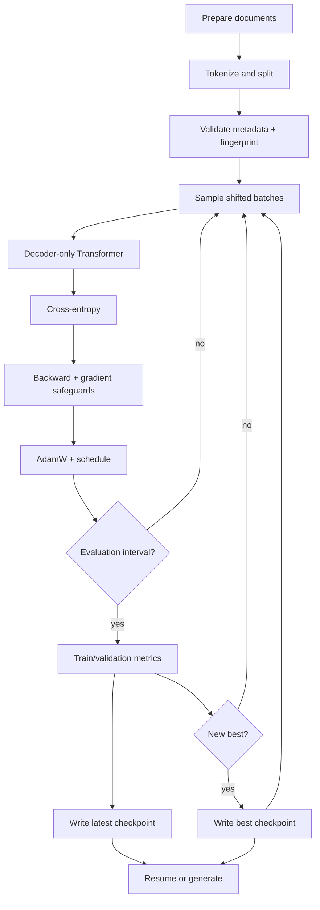

#### End-to-end shape trace

| Checkpoint | Tensor | Shape |
|---|---|---|
| token batch | $X,Y$ | `[B,T]` |
| token embeddings | $E[X]$ | `[B,T,C]` |
| position embeddings | $P$ | `[T,C]` |
| residual stream | $R$ | `[B,T,C]` |
| default separate per-head Q/K/V projections | $Q,K,V'$ | `H` tensors of `[B,T,D]` |
| optional fused Q/K/V projection | $QKV$ | `[B,T,3C]`, then split to `[B,H,T,D]` |
| attention scores | $S$ | default: `H` tensors `[B,T,T]`; conceptual/fused stack: `[B,H,T,T]` |
| contextual values | $O$ | default: `H` tensors `[B,T,D]`; fused path: `[B,H,T,D]` |
| merged heads | $O_{cat}$ | `[B,T,C]` |
| MLP expansion | hidden | `[B,T,4C]` |
| vocabulary logits | $Z$ | `[B,T,V]` training; model output `[B,1,V]` in generation, then sampler view `[B,V]` |
| flattened loss input | $Z'$ | `[BT,V]` |
| loss | $\mathcal L$ | scalar |

#### Parameter map for the LearnGPT scale

Ignoring optional biases, the dominant counts are:

| Component | Approximate parameters |
|---|---:|
| token embedding / tied head | $VC$ |
| position embedding | $TC$ |
| attention per block | $4C^2$ |
| MLP per block | $8C^2$ |
| LayerNorms per block | $4C$ with gain and bias |
| all blocks | roughly $L(12C^2+4C)$ |

With $V=50{,}257$, $T=256$, $C=256$, $H=4$, and $L=6$, vocabulary embeddings
dominate while each block contributes attention and MLP capacity. These values
describe the controlled 1 GiB training profile documented in
`docs/FINAL_TRAINING_RUNBOOK.md`; that profile contains 17,716,049 trainable
parameters. They are **not** the defaults instantiated by the short reference
snippet below: because it omits those size arguments, that script uses
$T=32$, $C=64$, $H=4$, and $L=2$. The exact count in either case follows the
bias and weight-tying choices encoded by the implementation.

### Architecture versus training state

```learngpt-mermaid
flowchart TB
    A["Static architecture"] --> C["Reproducible best checkpoint"]
    S["Learned state"] --> C
    E["External evidence"] --> C
    P["Prompt · The"] --> R["Restore model and tokenizer"]
    C --> R
    R --> OUT["Last-position model output · [B,1,V]"]
    OUT --> ROW["Select last row · sampling logits [B,V]"]
    ROW --> SAMPLE["Sample next token ID"]
    SAMPLE --> APPEND["Append ID to the context"]
    APPEND -->|"repeat"| OUT
    APPEND --> IDS["Generated token IDs"]
    IDS --> D["Decode"]
    D --> TXT["Generated text"]
```

### Reference code added in this lesson

```python
tokenizer_config = {"encoding_name": DEFAULT_ENCODING_NAME}
model_config = ModelConfig(
    vocabulary_size=get_vocabulary_size(DEFAULT_ENCODING_NAME),
    output_chunk_size=32768,
)
training_config = TrainingConfig(
    max_grad_norm_before_clip=100.0,
    gradient_retry_attempts=3,
    context_sensitivity_contexts=2,
)
generation_config = GenerationConfig()

model = LanguageModel(**model_config.to_model_kwargs()).to(device)
model = maybe_compile_model(
    model=model,
    compile_model=training_config.compile_model,
)
optimizer = configure_optimizer(
    model=model,
    learning_rate=training_config.base_learning_rate,
    weight_decay=training_config.weight_decay,
    device=device,
)

history, best_checkpoint_path = train_model(
    model=model,
    optimizer=optimizer,
    training_data=training_data,
    validation_data=validation_data,
    batch_size=training_config.batch_size,
    context_size=model_config.context_size,
    training_steps=training_config.training_steps,
    eval_interval=training_config.eval_interval,
    eval_batches=training_config.eval_batches,
    checkpoint_path=CHECKPOINT_PATH,
    model_config=model_config.to_checkpoint_dict(),
    tokenizer_config=tokenizer_config,
    base_learning_rate=training_config.base_learning_rate,
    min_learning_rate=training_config.min_learning_rate,
    warmup_steps=training_config.warmup_steps,
    decay_steps=training_config.decay_steps,
    gradient_clip=training_config.gradient_clip,
    max_grad_norm_before_clip=training_config.max_grad_norm_before_clip,
    gradient_retry_attempts=training_config.gradient_retry_attempts,
    gradient_accumulation_steps=training_config.gradient_accumulation_steps,
    context_sensitivity_contexts=training_config.context_sensitivity_contexts,
    training_config=training_config.to_checkpoint_dict(),
    mixed_precision=training_config.mixed_precision,
    precision_dtype=training_config.precision_dtype,
    device=device,
)

generated_text, checkpoint = generate_text_from_checkpoint(
    checkpoint_path=best_checkpoint_path,
    prompt_text=generation_config.prompt_text,
    max_new_tokens=generation_config.generated_tokens,
    temperature=generation_config.temperature,
    top_k=generation_config.top_k,
    device=device,
    compile_model=training_config.compile_model,
    seed=generation_config.seed,
)
```

The runnable integration is `study/lessons/42_final_project.py`. The files under
`final_project/` and `study/snapshots/lesson_42/` are kept identical.

### Syntax and logic

- `ModelConfig(...)` groups and validates architectural choices such as
  vocabulary size and output projection chunk size before allocating the model.
- `TrainingConfig(...)` groups optimization and integrity controls such as the
  raw-gradient threshold, retry count, and context diagnostics.
- `tokenizer_config` and `GenerationConfig()` keep tokenizer identity and
  sampling choices explicit instead of repeating string and number literals
  in later calls.
- `LanguageModel(**model_config.to_model_kwargs()).to(device)` expands only
  constructor-compatible model fields, creates the network, and moves its state
  to the selected device.
- `configure_optimizer(model=model, learning_rate=..., weight_decay=...,
  device=device)` builds the device-aware AdamW parameter groups from the
  validated settings.
- `history, best_checkpoint_path = train_model(...)` starts the complete update
  loop and returns both recorded metrics and the strongest validation checkpoint.
- The `train_model` keyword arguments make the run contract explicit: data,
  batch and context sizes, evaluation cadence, learning-rate schedule, gradient
  controls, checkpoint metadata, and device all travel through named values.
- `generate_text_from_checkpoint(checkpoint_path=best_checkpoint_path, ...)`
  reloads the selected artifact for an independent generation test instead of
  reusing the in-memory training model; prompt, token count, temperature,
  top-k, compile flag, and seed come from the two configuration objects.
- The final projection can split the `[C, V]` operation into vocabulary chunks
  and concatenate their logits. This avoids one very large MPS backward
  operation while preserving the same mathematical output.
- `preallocate_gradient_buffers(model)` and `clear_gradient_buffers(model)` keep
  MPS gradients allocated and clear them in place. A discarded warm-up
  and CPU comparison verify direction; raw norms above the integrity threshold
  are retried before clipping, so corrupted updates never reach AdamW.
- `save_checkpoint(...)` writes atomic best/latest checkpoints that include
  configs, RNG state, optimizer and GradScaler state, best metric, and a
  dataset-fingerprint field. The production CLI populates and verifies that
  field; the compact lesson-42 script leaves it `None`, so its dataset identity
  is unverified. When both fingerprints exist, resume rejects a mismatch unless
  the caller explicitly overrides the check.
- CUDA can opt into one combined QKV projection and one batched SDPA call per
  block with `fused_attention=True`; legacy checkpoints keep the separate-head
  layout because the saved model configuration defaults missing fields to
  `False`.
- `log_interval` reports current loss, learning rate, gradient status,
  throughput, and ETA without running the validation/checkpoint path controlled
  by `eval_interval`.
- `training_steps=45_000` identifies the separate controlled experiment, which
  uses the same modules with the seeded
  1 GiB subset, approximately 17.7M parameters, and 45,000 steps. Its workflow
  is: prepare data, load memmaps, train, evaluate, checkpoint, then generate.

## Final mental model

A GPT is a differentiable next-token classifier reused at every position. Text
becomes categorical IDs; tables turn IDs into vectors; causal attention combines
only the visible prefix; MLPs transform each position; residual paths preserve and
accumulate information; the vocabulary head produces scores; cross entropy
measures the correct next token; backpropagation assigns responsibility through
all matrix operations; AdamW updates the parameters; checkpoints preserve the
experiment; autoregressive sampling turns repeated classifications back into
text.

The central loop can be written in one line:

$$
\text{text}\rightarrow\text{IDs}\rightarrow\text{batches}\rightarrow
\text{vectors}\rightarrow\text{context}\rightarrow\text{logits}
\rightarrow\text{loss}\rightarrow\text{gradients}\rightarrow
\text{better logits}\rightarrow\text{new text}.
$$

## Source map

- Educational lessons and runnable checkpoints: `course_en.md` and
  `study/lessons/01_*.py` through `study/lessons/42_*.py`.
- Production architecture: `final_project/model.py`.
- Production tokenizer: `final_project/tokenizer.py`.
- Production batching and dataset identity: `final_project/batching.py`.
- Training, evaluation, safeguards, and checkpoints:
  `final_project/training.py` and `final_project/checkpoint.py`.
- Generation and sampling: `final_project/generate.py`.
- Official interactive visual counterpart: [LearnGPT Web](https://learngpt.ferdinandobonsegna.com/)
  in the sibling [`learn-gpt-web`](https://github.com/ferdinandobons/learn-gpt-web) project.
