# Corso LearnGPT

Questo file è la versione italiana del percorso di studio `LearnGPT`.

Obiettivo finale: capire, passo dopo passo, come si costruisce un piccolo
modello GPT didattico basato su FineWeb-Edu. Il corso non contiene copie
complete di ogni file Python: i file completi vivono in `study/snapshots/` e in
`final_project/`. Qui teniamo l'obiettivo, il perché delle modifiche, i pezzi di
codice nuovi e la spiegazione delle trasformazioni.

Regola sui nomi: il codice Python usa identificatori in inglese, per esempio
`text`, `model`, `create_batch`, `char_to_id`. La superficie pubblica del
progetto usa nomi e messaggi in inglese; questo file resta la versione italiana
del corso.

## Mappa delle fonti

Queste fonti sostengono il percorso fino alla lezione 42:

- `nanoGPT/model.py`: repository locale usato come riferimento architetturale
  per direzione generale, blocchi Transformer, residual connection,
  LayerNorm finale e `lm_head`.
- `nanoGPT/train.py`: repository locale usato come riferimento per la direzione
  del training loop, dell'ottimizzazione, dei checkpoint, del learning rate
  schedule, del gradient clipping e di AdamW.
- `nanoGPT/sample.py`: repository locale usato come riferimento per generare
  testo partendo da un checkpoint già salvato, con `temperature` e `top_k`.
- `torch.nn.Embedding`, `torch.nn.Linear`, `torch.nn.LayerNorm`,
  `torch.nn.GELU` e `torch.nn.functional.cross_entropy`: API PyTorch usate nei
  file didattici per embedding, proiezioni lineari, normalizzazione,
  attivazione della MLP e loss.
- `torch.multinomial` e `torch.nn.functional.softmax`: API PyTorch usate nelle
  lezioni sulla generazione per passare dai logits al campionamento del token
  successivo.
- `torch.no_grad`, `torch.nn.Module.eval` e `torch.nn.Module.train`: API
  PyTorch usate nella lezione 29 per stimare la loss senza aggiornare i pesi e
  per distinguere la modalità di valutazione dalla modalità di training.
- `torch.save`, `torch.load`, `nn.Module.state_dict` e
  `nn.Module.load_state_dict`: API PyTorch usate nella lezione 30 per salvare e
  ricaricare checkpoint.
- `torch.optim.AdamW`, `torch.nn.utils.clip_grad_norm_`, `torch.nn.Dropout` e
  `torch.topk`: API PyTorch usate nelle lezioni finali per ottimizzazione,
  clipping, regolarizzazione e sampling controllato.
- `Attention Is All You Need`, Vaswani et al., 2017: fonte tecnica per
  self-attention, multi-head attention, scaled dot-product attention, residual
  connection e feed-forward network nei Transformer.
- `Layer Normalization`, Ba et al., 2016: fonte tecnica per la normalizzazione
  applicata all'ultima dimensione dei vettori interni.
- `LearnGPT/study/snapshots/lesson_NN/`: fonte locale per il codice
  eseguibile della singola lezione. Ogni sezione del corso deve restare
  coerente con il proprio snapshot.

## Indice delle lezioni

Questo indice va aggiornato ogni volta che aggiungiamo una nuova lezione.

1. [Lezione 01 - Leggere il testo](#lezione-01---leggere-il-testo)
2. [Lezione 02 - Tokenizer a caratteri](#lezione-02---tokenizer-a-caratteri)
3. [Lezione 03 - Encode e decode](#lezione-03---encode-e-decode)
4. [Lezione 04 - Modulo tokenizer](#lezione-04---modulo-tokenizer)
5. [Lezione 05 - Training e validation](#lezione-05---training-e-validation)
6. [Lezione 06 - Input e target](#lezione-06---input-e-target)
7. [Lezione 07 - Esempi casuali](#lezione-07---esempi-casuali)
8. [Lezione 08 - Batch in Python](#lezione-08---batch-in-python)
9. [Lezione 09 - Batch in PyTorch](#lezione-09---batch-in-pytorch)
10. [Lezione 10 - Modulo batching](#lezione-10---modulo-batching)
11. [Lezione 11 - Verifica PyTorch](#lezione-11---verifica-pytorch)
12. [Lezione 12 - Primo modello bigram](#lezione-12---primo-modello-bigram)
13. [Lezione 13 - Loss del modello bigram](#lezione-13---loss-del-modello-bigram)
14. [Lezione 14 - Primo training loop bigram](#lezione-14---primo-training-loop-bigram)
15. [Lezione 15 - Generazione con il modello bigram](#lezione-15---generazione-con-il-modello-bigram)
16. [Lezione 16 - Il limite del modello bigram](#lezione-16---il-limite-del-modello-bigram)
17. [Lezione 17 - Token embeddings](#lezione-17---token-embeddings)
18. [Lezione 18 - Position embeddings](#lezione-18---position-embeddings)
19. [Lezione 19 - Una singola head di self-attention causale](#lezione-19---una-singola-head-di-self-attention-causale)
20. [Lezione 20 - Multi-head attention](#lezione-20---multi-head-attention)
21. [Lezione 21 - Proiezione finale della multi-head attention](#lezione-21---proiezione-finale-della-multi-head-attention)
22. [Lezione 22 - Residual connection attorno alla attention](#lezione-22---residual-connection-attorno-alla-attention)
23. [Lezione 23 - LayerNorm prima della attention](#lezione-23---layernorm-prima-della-attention)
24. [Lezione 24 - Feed-forward network dopo la attention](#lezione-24---feed-forward-network-dopo-la-attention)
25. [Lezione 25 - TransformerBlock](#lezione-25---transformerblock)
26. [Lezione 26 - Più TransformerBlock in sequenza](#lezione-26---più-transformerblock-in-sequenza)
27. [Lezione 27 - LayerNorm finale prima di output_head](#lezione-27---layernorm-finale-prima-di-output_head)
28. [Lezione 28 - Training loop del Transformer](#lezione-28---training-loop-del-transformer)
29. [Lezione 29 - Stima di training loss e validation loss](#lezione-29---stima-di-training-loss-e-validation-loss)
30. [Lezione 30 - Salvare e ricaricare un checkpoint](#lezione-30---salvare-e-ricaricare-un-checkpoint)
31. [Lezione 31 - Generare testo da checkpoint](#lezione-31---generare-testo-da-checkpoint)
32. [Lezione 32 - Controlli di sampling](#lezione-32---controlli-di-sampling)
33. [Lezione 33 - Training con miglior checkpoint](#lezione-33---training-con-miglior-checkpoint)
34. [Lezione 34 - Optimizer, scheduler e gradient clipping](#lezione-34---optimizer-scheduler-e-gradient-clipping)
35. [Lezione 35 - Dropout e weight tying](#lezione-35---dropout-e-weight-tying)
36. [Lezione 36 - Optimizer groups](#lezione-36---optimizer-groups)
37. [Lezione 37 - Gradient accumulation](#lezione-37---gradient-accumulation)
38. [Lezione 38 - Config e resume del training](#lezione-38---config-e-resume-del-training)
39. [Lezione 39 - Output head solo sull'ultimo token](#lezione-39---output-head-solo-sullultimo-token)
40. [Lezione 40 - Scaled dot-product attention opzionale](#lezione-40---scaled-dot-product-attention-opzionale)
41. [Lezione 41 - Performance flags e DDP](#lezione-41---performance-flags-e-ddp)
42. [Lezione 42 - Final Project](#lezione-42---final-project)

## Come eseguire gli script di studio

Ogni lezione ha uno script numerato dentro `study/lessons/`.

Schema generale:

```bash
python -B study/lessons/NN_nome_lezione.py
```

Esempio:

```bash
python -B study/lessons/19_self_attention_head.py
```

I comandi specifici non vengono ripetuti dentro ogni lezione: la regola è sempre
la stessa. Se una lezione richiede dati processati, usa i file condivisi in
`data/` invece di duplicarli nello snapshot.

## Come usare gli snapshot nello studio

Gli script in `study/lessons/` importano il codice dalla cartella snapshot della
stessa lezione. Questo permette di rileggere una lezione vecchia senza dipendere
dalle modifiche fatte dopo nel progetto finale.

Esempio:

```python
from study.snapshots.lesson_19.model import LanguageModel
```

significa: usa la versione di `LanguageModel` valida alla lezione 19.

La regola pratica è:

- `study/lessons/NN_qualcosa.py` importa da `study/snapshots/lesson_NN/`;
- dentro lo snapshot il modello principale si chiama sempre `LanguageModel`;
- lo snapshot contiene solo il codice necessario a quella lezione;
- `final_project/` contiene soltanto la versione finale pulita.

## Mappa generale delle trasformazioni

Questa sezione mostra il flusso complessivo dei dati aggiornato alla lezione 42.
Va mantenuta all'inizio del corso perché serve come panoramica: ogni volta che
aggiungeremo un nuovo pezzo importante, aggiorneremo anche questa mappa.

Per ora il flusso arriva fino a:

```text
testo -> token IDs -> training/validation split -> batch -> embeddings -> più TransformerBlock -> final LayerNorm -> logits -> loss -> backward -> gradient clipping -> optimizer.step -> pesi aggiornati -> estimate_loss -> miglior checkpoint -> checkpoint ricaricato -> sampling controllato -> testo generato
```

Per un training locale con budget limitato, il corpus canonico può avere un
passaggio opzionale in più prima dei batch: `prepare_subset.py` seleziona chunk
casuali riproducibili e scrive un dataset sperimentale separato. La mappa
controllata completa è descritta nell'approfondimento finale.

Ogni `TransformerBlock` contiene i passaggi studiati nelle lezioni precedenti:

```text
LayerNorm -> multi-head attention -> residual connection -> LayerNorm -> feed-forward -> residual connection
```

Nella lezione 27 usiamo più blocchi in sequenza e poi applichiamo una
`final_layer_norm` prima di `output_head`. Per non rendere la mappa troppo
densa, il primo blocco è mostrato in modo dettagliato, mentre il secondo e il
terzo sono mostrati in forma compatta. Tutti mantengono la stessa shape interna
`[4, 8, 16]`.

Nella lezione 28 aggiungiamo il training loop intorno a questo modello. Il
modello calcola la loss, `loss.backward()` calcola i gradienti e
`optimizer.step()` modifica i pesi.

Nella lezione 29 aggiungiamo `estimate_loss`: una funzione che misura la loss
media su più batch di training e di validation senza chiamare `backward` e senza
chiamare `optimizer.step`.

Nella lezione 30 aggiungiamo il checkpoint: salviamo i pesi del modello, lo
stato dell'optimizer, la configurazione e il tokenizer; poi ricarichiamo quei
dati in un nuovo modello.

Nella lezione 31 separiamo la generazione dal training: creiamo un modello
partendo dal checkpoint e generiamo testo senza chiamare `loss.backward()` e
senza chiamare `optimizer.step()`.

Nella lezione 32 aggiungiamo controlli di sampling: `temperature`, `top_k` e
più sample dallo stesso checkpoint.

Nella lezione 33 spostiamo il training in `train_model` e salviamo solo il
miglior checkpoint misurato sulla validation loss.

Nella lezione 34 aggiungiamo AdamW configurato in funzione, learning rate con
warmup/cosine decay e gradient clipping.

Nella lezione 35 aggiungiamo dropout e weight tying. Nelle lezioni 36-41
aggiungiamo le ottimizzazioni finali in modo distribuito. Nella lezione 42
consolidiamo tutto in `Final Project`, allineato a `final_project`.

### Numeri base usati nel diagramma

Nella lezione 42, cioè nel `Final Project`, stiamo usando questi valori:

| Nome | Valore | Significato |
| --- | ---: | --- |
| `batch_size` | `4` | quanti esempi vengono elaborati insieme |
| `context_size` | `32` | quanti token contiene ogni esempio |
| `embedding_size` | `64` | quanti numeri rappresentano ogni token o posizione |
| `num_heads` | `4` | quante head di self-attention usiamo in parallelo |
| `head_size` | `16` | quanti numeri produce ogni head per ogni token |
| `num_transformer_blocks` | `2` | quanti TransformerBlock applichiamo in sequenza |
| `feed_forward_size` | `256` | quanti numeri usa temporaneamente la MLP interna; `MLP` sta per `Multi-Layer Perceptron` |
| `vocabulary_size` | `50257` | quanti token GPT-2 BPE possibili esistono nel vocabolario |
| `learning_rate` | `0.001` | quanto grande è ogni aggiornamento dei pesi |
| `min_learning_rate` | `0.0001` | limite minimo del learning rate dopo il decay |
| `warmup_steps` | `1` | quanti step servono per salire gradualmente al learning rate massimo |
| `decay_steps` | `10` | fino a quale step il learning rate viene fatto scendere |
| `weight_decay` | `0.01` | regolarizzazione applicata da AdamW ai pesi |
| `gradient_clip` | `1.0` | limite alla norma dei gradienti prima di `optimizer.step()` |
| `gradient_accumulation_steps` | `1` | quanti micro-batch sommiamo prima di `optimizer.step()` |
| `dropout` | `0.1` | probabilità di spegnere temporaneamente valori durante il training |
| `temperature` | `0.9` | quanto rendere più o meno casuale il sampling |
| `top_k` | `50` | quanti token candidati tenere prima della softmax |
| `training_steps` | `3` | quanti aggiornamenti facciamo nello smoke test finale |
| `eval_batches` | `1` | quanti batch usiamo per stimare ogni loss media nello smoke test |
| `generated_tokens` | `40` | quanti nuovi token generiamo dal checkpoint |

Questi valori non sono intercambiabili. Ognuno controlla una dimensione
diversa dei tensori.

### Diagramma del flusso - versione concisa

Questa prima versione serve per orientarsi velocemente. Mostra il percorso
principale senza entrare nei dettagli interni di ogni blocco.

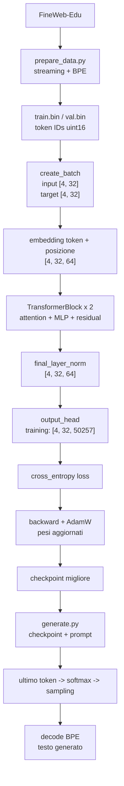

In forma testuale, la stessa mappa è:

```text
FineWeb-Edu
-> token BPE
-> train.bin / val.bin
-> batch input/target
-> token embeddings + position embeddings
-> TransformerBlock ripetuti
-> final LayerNorm
-> output_head
-> logits
-> loss durante training
-> backward
-> optimizer.step
-> checkpoint
-> prompt
-> logits dell'ultimo token
-> softmax e sampling
-> decode
-> testo generato
```

### Diagramma del flusso - versione estesa

Questa seconda versione è la mappa completa del progetto finale. Non va letta
tutta in una volta: serve come riferimento quando vuoi capire dove si trova un
pezzo specifico del codice.

I nomi `B`, `T`, `C` e `V` significano:

```text
B = batch_size = 4
T = context_size = 32
C = embedding_size = 64
V = vocabulary_size = 50257
H = head_size = 16
N = num_transformer_blocks = 2
```

```mermaid
flowchart TD
    subgraph DATA["Preparazione dati"]
        A1["FineWeb-Edu<br/>dataset in streaming"]
        A2["document text"]
        A3["tiktoken GPT-2 BPE<br/>encode_ordinary"]
        A4["aggiunta eot_token<br/>fine documento"]
        A5["token IDs<br/>interi GPT-2 BPE"]
        A6["split documenti<br/>train / validation"]
        A7["train.bin<br/>uint16"]
        A8["val.bin<br/>uint16"]
        A9["meta.json<br/>dataset, tokenizer, contatori"]
    end

    subgraph BATCH["Batching da memmap"]
        B1["np.memmap train.bin / val.bin"]
        B2["start_positions casuali"]
        B3["finestra di T + 1 token"]
        B4["input_tensor<br/>[B, T] = [4, 32]"]
        B5["target_tensor<br/>[B, T] = input spostato di 1"]
        B6["spostamento su device<br/>CPU / CUDA / MPS"]
    end

    subgraph CONFIG["Configurazione e device"]
        C1["ModelConfig<br/>V, T, C, heads, blocks, dropout"]
        C2["TrainingConfig<br/>batch, step, lr, clip, accumulation"]
        C3["GenerationConfig<br/>prompt, temperature, top_k"]
        C4["get_default_device<br/>cuda -> mps -> cpu"]
    end

    subgraph EMB["Embedding iniziali"]
        D1["input_ids<br/>[B, T]"]
        D2["positions<br/>[T]"]
        D3["token_embedding_table<br/>[V, C] = [50257, 64]"]
        D4["position_embedding_table<br/>[T, C] = [32, 64]"]
        D5["token_embeddings<br/>[B, T, C] = [4, 32, 64]"]
        D6["position_embeddings<br/>[T, C] = [32, 64]"]
        D7["somma con broadcasting<br/>token + posizione"]
        D8["embedding_dropout"]
        D9["block_input<br/>[B, T, C] = [4, 32, 64]"]
    end

    subgraph BLOCK["TransformerBlock ripetuto N volte"]
        E1["attention_layer_norm<br/>[B, T, C]"]
        E2["query / key / value<br/>per ogni head"]
        E3["queries<br/>[B, T, H] = [4, 32, 16]"]
        E4["keys<br/>[B, T, H]"]
        E5["values<br/>[B, T, H]"]
        E6["scores = Q @ K^T<br/>[B, T, T] = [4, 32, 32]"]
        E7["scala / sqrt(H)<br/>scaled dot-product"]
        E8["causal mask<br/>blocca token futuri"]
        E9["softmax + dropout<br/>attention weights"]
        E10["weights @ values<br/>head output [B, T, H]"]
        E11["concat head<br/>[B, T, C]"]
        E12["output_projection<br/>Linear(C -> C)"]
        E13["residual_after_attention<br/>x + attention_output"]
        E14["feed_forward_layer_norm"]
        E15["MLP expand<br/>Linear(C -> 4C) = 64 -> 256"]
        E16["GELU"]
        E17["MLP project<br/>Linear(4C -> C) = 256 -> 64"]
        E18["dropout"]
        E19["residual_after_feed_forward<br/>[B, T, C]"]
    end

    subgraph TRAIN_FORWARD["Forward durante training"]
        F1["final_layer_norm<br/>[B, T, C]"]
        F2["output_head<br/>Linear(C -> V)"]
        F3["logits<br/>[B, T, V] = [4, 32, 50257]"]
        F4["logits_flat<br/>[B*T, V] = [128, 50257]"]
        F5["target_flat<br/>[B*T] = [128]"]
        F6["cross_entropy<br/>loss"]
    end

    subgraph TRAIN_LOOP["Training loop"]
        G1["get_learning_rate<br/>warmup + cosine decay"]
        G2["optimizer.zero_grad"]
        G3["gradient accumulation<br/>loss / micro-batch"]
        G4["loss.backward<br/>gradienti nei parametri"]
        G5["gradient clipping"]
        G6["AdamW optimizer groups<br/>decay solo sui pesi giusti"]
        G7["optimizer.step<br/>pesi aggiornati"]
        G8["estimate_loss<br/>train + validation senza backward"]
        G9["save_checkpoint<br/>model, optimizer, config, tokenizer, step"]
    end

    subgraph GENERATE["Generazione da checkpoint"]
        H1["load checkpoint"]
        H2["ricostruisci LanguageModel"]
        H3["prompt_text"]
        H4["encode BPE prompt<br/>[1, prompt_T]"]
        H5["crop ultimo contesto<br/>max T token"]
        H6["forward senza target"]
        H7["final_layer_norm solo ultimo token<br/>[B, 1, C]"]
        H8["output_head solo ultimo token<br/>[B, 1, V]"]
        H9["last_token_logits<br/>[B, V]"]
        H10["temperature<br/>divide i logits"]
        H11["top_k<br/>tiene i candidati migliori"]
        H12["softmax<br/>probabilità"]
        H13["torch.multinomial<br/>next_token_id"]
        H14["cat al contesto generato"]
        H15["ripeti per generated_tokens"]
        H16["decode BPE<br/>generated_text"]
    end

    A1 --> A2 --> A3 --> A4 --> A5 --> A6
    A6 --> A7
    A6 --> A8
    A6 --> A9

    A7 --> B1
    A8 --> B1
    B1 --> B2 --> B3 --> B4 --> B6
    B3 --> B5 --> B6

    C1 --> D3
    C1 --> D4
    C2 --> G1
    C2 --> G2
    C3 --> H3
    C4 --> B6

    B4 --> D1
    D1 --> D3 --> D5
    D2 --> D4 --> D6
    D5 --> D7
    D6 --> D7
    D7 --> D8 --> D9

    D9 --> E1 --> E2
    E2 --> E3 --> E6
    E2 --> E4 --> E6
    E2 --> E5 --> E10
    E6 --> E7 --> E8 --> E9 --> E10 --> E11 --> E12 --> E13
    E13 --> E14 --> E15 --> E16 --> E17 --> E18 --> E19
    E19 --> F1

    F1 --> F2 --> F3
    F3 --> F4 --> F6
    B5 --> F5 --> F6

    F6 --> G3
    G1 --> G6
    G2 --> G3 --> G4 --> G5 --> G6 --> G7 --> G8 --> G9

    G9 --> H1 --> H2
    H3 --> H4 --> H5 --> H6
    H2 --> H6
    H6 --> H7 --> H8 --> H9 --> H10 --> H11 --> H12 --> H13 --> H14 --> H15 --> H5
    H15 --> H16
```

Nel diagramma esteso il blocco `TransformerBlock` rappresenta una singola
ripetizione. Nel progetto finale lo ripetiamo `N = 2` volte. Ogni ripetizione
riceve e restituisce la stessa shape interna:

```text
[4, 32, 64] -> TransformerBlock 1 -> [4, 32, 64]
[4, 32, 64] -> TransformerBlock 2 -> [4, 32, 64]
[4, 32, 64] -> final_layer_norm -> [4, 32, 64]
```

### Come leggere le trasformazioni principali

Il `batch_size` e il `context_size` creano la forma iniziale:

```text
input_tensor.shape = [batch_size, context_size]
input_tensor.shape = [4, 32]
```

Un facsimile abbreviato di `input_tensor` può essere:

```text
[
  [464, 2068, 290, 262, 318, 257, 1332, 13, ... altri 24 token],
  [198, 1212, 318, 281, 1672, 286, 2420, 13, ... altri 24 token],
  [32, 383, 1438, 389, 407, 922, 284, 467, ... altri 24 token],
  [464, 995, 338, 1263, 318, 845, 1593, 13, ... altri 24 token],
]
```

Ogni riga contiene 32 ID interi, anche se qui ne mostriamo solo 8 per non
allargare troppo il documento. Questi ID sono token GPT-2 BPE, non caratteri.
Il tensore non contiene ancora vettori.

La `token_embedding_table` riceve ogni ID di token e restituisce un vettore lungo
`embedding_size`:

```text
token_embeddings.shape = [batch_size, context_size, embedding_size]
token_embeddings.shape = [4, 32, 64]
```

Questa forma si legge da sinistra a destra:

```text
[4, 32, 64]
 |   |   |
 |   |   +-- 64 numeri per rappresentare un singolo token
 |   +------ 32 token dentro ogni esempio
 +--------- 4 esempi dentro il batch
```

Quindi `token_embeddings` non è un solo vettore da 64 numeri. Contiene 128
vettori da 64 numeri:

```text
4 esempi x 32 token per esempio = 128 token totali nel batch
128 token x 64 numeri per token = 8192 numeri totali nel tensore
```

La forma annidata è questa:

```text
token_embeddings =
[
  [  # esempio 0: contiene 32 token embeddings
    [64 numeri],  # token in posizione 0
    [64 numeri],  # token in posizione 1
    [64 numeri],  # token in posizione 2
    ...
    [64 numeri],  # token in posizione 31
  ],

  [  # esempio 1: altri 32 token embeddings
    [64 numeri],
    [64 numeri],
    ...
  ],

  [  # esempio 2
    ...
  ],

  [  # esempio 3
    ...
  ],
]
```

Gli indici permettono di scegliere un livello preciso:

```text
token_embeddings[0]
```

prende tutto il primo esempio. La sua forma è:

```text
[32, 64]
```

cioè 32 token embeddings, ognuno lungo 64 numeri.

```text
token_embeddings[0, 0]
```

prende il token embedding del primo token del primo esempio. La sua forma è:

```text
[64]
```

cioè un singolo vettore da 64 numeri.

```text
token_embeddings[0, 0, 0]
```

prende un singolo numero dentro quel vettore.

Facsimile di un singolo token embedding:

```text
token_embeddings[0, 0] =
[0.34, -1.12, 0.08, 0.51, ..., -0.27]  # 64 numeri
```

La `position_embedding_table` riceve invece gli ID di posizione:

```text
positions = [0, 1, 2, ..., 31]

position_embeddings.shape = [context_size, embedding_size]
position_embeddings.shape = [8, 16]
```

Facsimile del vettore della posizione `0`:

```text
position_embeddings[0] =
[0.10, 0.05, -0.30, 0.70, ..., 0.12]  # 16 numeri
```

Poi sommiamo i due vettori. La somma è possibile perché entrambi sono lunghi
`16`:

```text
embeddings[0, 0] = token_embeddings[0, 0] + position_embeddings[0]

facsimile:
[0.34, -1.12, 0.08, 0.51, ..., -0.27]
+
[0.10,  0.05, -0.30, 0.70, ...,  0.12]
=
[0.44, -1.07, -0.22, 1.21, ..., -0.15]
```

La forma resta:

```text
embeddings.shape = [4, 8, 16]
```

Nella lezione 19 inseriamo la self-attention causale. Prima creiamo tre nuove
rappresentazioni degli embeddings:

```text
queries.shape = [4, 8, 16]
keys.shape    = [4, 8, 16]
values.shape  = [4, 8, 16]
```

Poi confrontiamo ogni query con tutte le key dello stesso esempio:

```text
attention_scores.shape = [batch_size, context_size, context_size]
attention_scores.shape = [4, 8, 8]
```

Questa forma si legge così:

```text
[4, 8, 8]
 |  |  |
 |  |  +-- 8 token che possono fornire informazione
 |  +----- 8 token che stanno ricevendo informazione
 +-------- 4 esempi nel batch
```

Quindi, per ogni esempio del batch, la self-attention crea una matrice `8 x 8`.
La riga indica la posizione che sta producendo un nuovo embedding. La colonna
indica da quale posizione può arrivare informazione.

La maschera causale mette a zero le probabilità verso i token futuri:

```text
attention_weights[0] =
[
  [1,    0,    0,    0,    0,    0,    0,    0],
  [0.53, 0.47, 0,    0,    0,    0,    0,    0],
  [0.33, 0.40, 0.27, 0,    0,    0,    0,    0],
  ...
]
```

Dopo la moltiplicazione tra `attention_weights` e `values`, otteniamo:

```text
attended_embeddings.shape = [4, 8, 16]
```

La forma torna a `[4, 8, 16]`, ma ogni vettore ora può contenere informazione
dai token precedenti ammessi dalla maschera causale.

Infine `output_head` trasforma ogni embedding lungo `16` in `68` punteggi, uno
per ogni token possibile:

```text
logits.shape = [batch_size, context_size, vocabulary_size]
logits.shape = [4, 8, 68]
```

Facsimile dei punteggi per l'ultima posizione del primo esempio:

```text
last_token_logits[0] =
[-0.30, 1.10, 0.05, -0.90, ..., 0.42]  # 68 punteggi
```

Durante la generazione, `softmax` trasforma questi punteggi in probabilità:

```text
probabilities[0] =
[0.01, 0.04, 0.02, 0.005, ..., 0.03]  # 68 probabilità
```

Poi `torch.multinomial` sceglie un ID in base a quelle probabilità:

```text
next_token_id = 50
```

Infine `decode` trasforma l'ID scelto nel carattere corrispondente:

```text
decode([50]) -> "r"
```

I numeri mostrati nei facsimile servono solo a rendere visibile la forma dei
dati. I valori reali cambiano in base al vocabolario, al punto del testo scelto,
all'inizializzazione dei pesi e all'allenamento.

---

## Lezione 01 - Leggere il testo

### Cosa cambia e perché

Creiamo il primo script numerato:

```text
study/lessons/01_read_text.py
```

Il file legge il campione FineWeb-Edu da:

```text
data/raw/fineweb_edu_sample.txt
```

### Spiegazione

Un modello linguistico non parte da un modello. Parte da un testo. In questa
lezione verifichiamo solo che il corpus esista, sia leggibile e contenga
caratteri.

La riga:

```python
PROJECT_DIR = Path(__file__).resolve().parents[2]
```

parte dal file `study/lessons/01_read_text.py` e risale alla cartella `LearnGPT`.

Poi:

```python
DATASET_PATH = PROJECT_DIR / "data" / "raw" / "fineweb_edu_sample.txt"
```

costruisce il percorso al dataset.

## Lezione 02 - Tokenizer a caratteri

### Cosa cambia e perché

Creiamo:

```text
study/lessons/02_character_tokenizer.py
```

Il nuovo concetto è il vocabolario:

```python
char_to_id = {}
id_to_char = {}
```

### Spiegazione

Un GPT non lavora direttamente con caratteri o parole. Lavora con numeri. In
questa prima versione ogni carattere diverso riceve un ID numerico.

Esempio concettuale:

```text
"a" -> 0
"b" -> 1
"c" -> 2
```

La riga:

```python
unique_chars = sorted(set(text))
```

fa due cose:

- `set(testo)` prende ogni carattere diverso una sola volta;
- `sorted(...)` li mette in ordine stabile.

Creiamo poi due dizionari opposti:

```text
carattere -> numero
numero -> carattere
```

Il primo serve per codificare. Il secondo serve per decodificare.

## Lezione 03 - Encode e decode

### Cosa cambia e perché

Separiamo la logica in funzioni:

```python
def create_vocabulary(text):
def encode(text, char_to_id):
def decode(token_ids, id_to_char):
```

### Spiegazione

Prima il codice era tutto dentro `main`. Ora rendiamo esplicite le due
operazioni fondamentali:

```text
encode: testo -> numeri
decode: numeri -> testo
```

Il controllo importante è:

```python
reconstructed_text == sample
```

Se produce `True`, il tokenizer è reversibile.

## Lezione 04 - Modulo tokenizer

### Cosa cambia e perché

Spostiamo le funzioni riutilizzabili dentro il progetto finale e nello snapshot
della lezione:

```text
final_project/tokenizer.py
study/snapshots/lesson_04/tokenizer.py
```

e creiamo un file di studio:

```text
study/lessons/04_test_tokenizer.py
```

### Spiegazione

Questa è la prima separazione tra:

```text
study/                      esercizi didattici
study/snapshots/lesson_04/ snapshot usato dalla lezione
final_project/             codice finale vivo
```

Da ora gli script di studio importano dallo snapshot della propria lezione:

```python
from study.snapshots.lesson_04.tokenizer import create_vocabulary, encode, decode
```

### Codice aggiunto: `study/snapshots/lesson_04/tokenizer.py`

```python
"""
Differenza rispetto agli script precedenti:
- Prima le funzioni del tokenizer vivevano dentro un file di esercizio.
- Qui diventano un modulo riutilizzabile da altri script.

Scopo del file:
- Contenere le funzioni comuni per creare il vocabolario, codificare testo in
  numeri e decodificare numeri in testo.
"""

def create_vocabulary(text):
    unique_chars = sorted(set(text))

    char_to_id = {}
    id_to_char = {}

    for token_id, char in enumerate(unique_chars):
        char_to_id[char] = token_id
        id_to_char[token_id] = char

    return char_to_id, id_to_char


def encode(text, char_to_id):
    token_ids = []

    for char in text:
        token_id = char_to_id[char]
        token_ids.append(token_id)

    return token_ids


def decode(token_ids, id_to_char):
    text = ""

    for token_id in token_ids:
        char = id_to_char[token_id]
        text += char

    return text
```

## Lezione 05 - Training e validation

### Cosa cambia e perché

Dividiamo tutti i token in:

```text
90% training
10% validation
```

### Spiegazione

Il training set serve per aggiornare il modello. La validation serve per
controllare se il modello sta imparando in modo utile, non solo memorizzando.

La riga:

```python
split_index = int(len(token_ids) * 0.9)
```

trova il punto al 90% della lista.

Poi:

```python
training_data = token_ids[:split_index]
validation_data = token_ids[split_index:]
```

crea le due parti.

## Lezione 06 - Input e target

### Cosa cambia e perché

Creiamo una coppia:

```python
input_tokens = token_ids[:CONTEXT_SIZE]
target_tokens = token_ids[1:CONTEXT_SIZE + 1]
```

### Spiegazione

Un GPT impara a prevedere il token successivo.

Se l'input è:

```text
Nel mezz
```

il target è:

```text
el mezzo
```

Il target è uguale all'input, ma spostato avanti di un carattere.

### Chiarimento extra: `contesto = input_tokens[:posizione + 1]`

Questa riga prende una parte sempre più lunga dell'input.

Se:

```python
input_tokens = [10, 20, 30, 40, 50]
```

allora:

```python
input_tokens[:1]  # [10]
input_tokens[:2]  # [10, 20]
input_tokens[:3]  # [10, 20, 30]
```

Nel ciclo, `position` parte da `0`. Per questo serve `+ 1`: senza `+ 1`, la
prima fetta sarebbe `input_tokens[:0]`, cioè una lista vuota.

Concettualmente:

```text
'N'     -> prevedi 'e'
'Ne'    -> prevedi 'l'
'Nel'   -> prevedi ' '
'Nel '  -> prevedi 'm'
```

## Lezione 07 - Esempi casuali

### Cosa cambia e perché

Prima usavamo sempre l'inizio del testo. Ora scegliamo una posizione casuale:

```python
start_position = random.randint(0, len(data) - context_size - 1)
```

### Spiegazione

Per allenare un modello dobbiamo mostrargli parti diverse del corpus. Se gli
mostrassimo sempre l'inizio, imparerebbe solo quella zona.

La funzione `create_example` prende:

```text
data
context_size
```

e restituisce:

```text
input_tokens
target_tokens
```

## Lezione 08 - Batch in Python

### Cosa cambia e perché

Creiamo un batch:

```python
batch_inputs = []
batch_targets = []
```

Un batch è un gruppo di esempi.

### Spiegazione

Finora avevamo un solo esempio:

```text
input_tokens
target_tokens
```

Ora ne creiamo più insieme:

```text
batch_inputs = [
  esempio 1,
  esempio 2,
  esempio 3,
  esempio 4,
]
```

Con:

```python
BATCH_SIZE = 4
CONTEXT_SIZE = 32
```

creiamo 4 esempi, ognuno lungo 32 token.

## Lezione 09 - Batch in PyTorch

### Cosa cambia e perché

Trasformiamo le liste Python in tensori:

```python
input_tensor = torch.tensor(batch_inputs)
target_tensor = torch.tensor(batch_targets)
```

### Spiegazione

Un modello neurale non lavora con normali liste Python. Lavora con tensori.

Con:

```python
BATCH_SIZE = 4
CONTEXT_SIZE = 32
```

la forma del batch è:

```text
torch.Size([4, 32])
```

Cioè:

```text
4 esempi
32 token per esempio
```

## Lezione 10 - Modulo batching

### Cosa cambia e perché

Spostiamo la logica del batch nel progetto finale e nello snapshot della
lezione:

```text
final_project/batching.py
study/snapshots/lesson_10/batching.py
```

e testiamo il modulo con:

```text
study/lessons/10_test_batching.py
```

### Spiegazione

Come per il tokenizer, separiamo:

```text
codice snapshot       -> study/snapshots/lesson_10/batching.py
codice finale vivo    -> final_project/batching.py
script di verifica    -> study/lessons/10_test_batching.py
```

### Codice aggiunto: `study/snapshots/lesson_10/batching.py`

```python
"""
Differenza rispetto ai file precedenti:
- Prima la creazione del batch era dentro `08_python_batch.py` e
  `09_torch_batch.py`.
- Qui spostiamo quella logica in un modulo riutilizzabile.

Scopo del file:
- Creare batch di input e target in formato tensore PyTorch.
- Preparare una funzione comune che potremo usare durante il training del
  modello.
"""

import random

import torch


def create_example(data, context_size):
    start_position = random.randint(0, len(data) - context_size - 1)

    input_tokens = data[start_position:start_position + context_size]
    target_tokens = data[start_position + 1:start_position + context_size + 1]

    return input_tokens, target_tokens


def create_batch(data, batch_size, context_size):
    batch_inputs = []
    batch_targets = []

    for _ in range(batch_size):
        input_tokens, target_tokens = create_example(data, context_size)

        batch_inputs.append(input_tokens)
        batch_targets.append(target_tokens)

    input_tensor = torch.tensor(batch_inputs)
    target_tensor = torch.tensor(batch_targets)

    return input_tensor, target_tensor
```

## Lezione 11 - Verifica PyTorch

### Cosa cambia e perché

Creiamo:

```text
study/lessons/11_verify_pytorch.py
final_project/requirements.txt
```

### Spiegazione

Da qui in poi usiamo PyTorch. Nel tuo ambiente il comando corretto è:

```bash
python
```

perché punta al Python di pyenv 3.13, che ha PyTorch installato.

Il file `requirements.txt` contiene:

```text
torch
```

## Lezione 12 - Primo modello bigram

### Cosa cambia e perché

Creiamo il primo modello nel progetto finale e nello snapshot della lezione:

```text
final_project/model.py
study/snapshots/lesson_12/model.py
```

La classe principale è:

```python
class LanguageModel(nn.Module):
```

### Spiegazione

Un modello bigram guarda un token e produce punteggi per il token successivo.

### Chiarimento extra: che cosa significa bigram

La parola `bigram` significa letteralmente "due elementi".

Nel nostro caso gli elementi sono caratteri/token.

Un modello bigram prova a imparare relazioni di questo tipo:

```text
dopo "N" spesso arriva "e"
dopo "e" spesso arriva "l"
dopo "l" spesso arriva " "
dopo "q" spesso arriva "u"
```

Quindi guarda un solo token alla volta e prova a prevedere il token successivo.

Esempio:

```text
input:  "N"
target: "e"
```

oppure:

```text
input:  "q"
target: "u"
```

Il modello non sta ancora ragionando su una frase intera. Non vede davvero:

```text
Nel mezzo del cammin
```

come contesto lungo. Per ogni posizione impara soprattutto:

```text
questo carattere -> prossimo carattere probabile
```

### Chiarimento extra: perché partiamo da un modello bigram

Partiamo dal bigram perché è il modello neurale più semplice che ci permette di
vedere tutto il ciclo fondamentale di un GPT:

```text
token -> logits -> loss -> backward -> aggiornamento pesi -> generazione
```

Con un bigram possiamo imparare questi concetti senza introdurre subito
attention, embedding posizionali, blocchi Transformer e molti layer.

Il bigram è limitato, ma didatticamente è perfetto per capire:

- che il testo diventa token numerici;
- che il modello produce punteggi per il prossimo token;
- che la loss misura l'errore;
- che `backward` calcola gradienti;
- che l'optimizer aggiorna i pesi;
- che la generazione ripete la previsione del prossimo token.

In altre parole: il bigram non è il nostro obiettivo finale. È una palestra
minima per imparare il ciclo completo prima di costruire un GPT vero.

Il cuore del modello è:

```python
self.token_embedding_table = nn.Embedding(
    num_embeddings=vocabulary_size,
    embedding_dim=vocabulary_size,
)
```

Per ora questa tabella non è ancora addestrata. Produce numeri iniziali quasi
casuali.

### Chiarimento extra: `batch_size x context_size x vocabulary_size`

Con:

```text
batch_size = 4
context_size = 8
vocabulary_size = 68
```

i logits hanno forma:

```text
[4, 8, 68]
```

Rappresentazione:

```text
LOGITS
shape = batch_size x context_size x vocabulary_size
shape = 4 x 8 x 68

Batch
│
├── Esempio 0
│   ├── Posizione 0 -> 68 punteggi: [p0, p1, ..., p67]
│   ├── Posizione 1 -> 68 punteggi: [p0, p1, ..., p67]
│   └── ...
│
├── Esempio 1
│   └── 8 posizioni, ciascuna con 68 punteggi
│
├── Esempio 2
│   └── ...
│
└── Esempio 3
    └── ...
```

Quindi:

```python
logits[0, 3]
```

significa:

```text
esempio 0
posizione 3
tutti i 68 punteggi del prossimo carattere possibile
```

Mentre:

```python
logits[0, 3, 15]
```

significa:

```text
punteggio assegnato al carattere con ID 15
per la posizione 3 dell'esempio 0
```

## Lezione 13 - Loss del modello bigram

### Cosa cambia e perché

Aggiorniamo `LanguageModel` per accettare anche i target:

```python
def forward(self, input_ids, target_ids=None):
```

Se `target_ids` non viene passato, il modello restituisce solo i `logits`.

Se `target_ids` viene passato, il modello restituisce:

```python
return logits, loss
```

### Chiarimento extra: come viene chiamata `forward`

Nel codice non chiamiamo quasi mai `forward` direttamente.

Nel nostro script scriviamo:

```python
logits, loss = model(input_tensor, target_tensor)
```

Questa riga usa l'oggetto `model` con la sintassi di chiamata di una funzione.
Succede perché `LanguageModel` eredita da:

```python
nn.Module
```

In PyTorch, quando una classe eredita da `nn.Module`, il modo corretto di usare
il modello è:

```python
model(...)
```

PyTorch riceve quella chiamata e internamente esegue il metodo:

```python
forward(...)
```

Quindi questa riga:

```python
logits, loss = model(input_tensor, target_tensor)
```

equivale concettualmente a:

```python
logits, loss = model.forward(input_tensor, target_tensor)
```

Però nella pratica si preferisce sempre:

```python
model(input_tensor, target_tensor)
```

perché PyTorch, prima e dopo `forward`, può gestire automaticamente altre cose
importanti del modello, come hook, modalità training/evaluation e meccanismi
interni di `nn.Module`.

Il parametro `self` non lo passiamo noi. Python lo passa automaticamente.

Quando scriviamo:

```python
model(input_tensor, target_tensor)
```

i valori arrivano dentro `forward` così:

```text
self       -> modello
input_ids  -> input_tensor
target_ids -> target_tensor
```

Quindi la firma:

```python
def forward(self, input_ids, target_ids=None):
```

vuol dire:

```text
questo metodo appartiene al modello stesso;
riceve gli input;
può ricevere anche i target;
se riceve i target, può calcolare anche la loss.
```

### Spiegazione

La `loss` è un numero che misura quanto il modello sta sbagliando.

Nel nostro caso usiamo:

```python
loss = F.cross_entropy(logits_flat, target_ids_flat)
```

La cross entropy confronta:

```text
i punteggi prodotti dal modello
con il token corretto da prevedere
```

### Chiarimento extra: reshape per la loss

Prima abbiamo:

```text
logits.shape = [4, 8, 68]
target.shape = [4, 8]
```

Significa:

```text
4 esempi
8 posizioni per esempio
68 punteggi per ogni posizione
```

La cross entropy vuole invece:

```text
logits_flat.shape = [32, 68]
target_flat.shape = [32]
```

Perché:

```text
4 x 8 = 32 previsioni totali
```

Rappresentazione prima:

```text
[
  [  # esempio 0
    [68 punteggi],  # posizione 0
    [68 punteggi],  # posizione 1
    ...
    [68 punteggi],  # posizione 7
  ],

  [  # esempio 1
    [68 punteggi],
    [68 punteggi],
    ...
  ],

  [  # esempio 2
    ...
  ],

  [  # esempio 3
    ...
  ],
]
```

Dopo `reshape`:

```text
[
  [68 punteggi],  # previsione 0  = esempio 0, posizione 0
  [68 punteggi],  # previsione 1  = esempio 0, posizione 1
  ...
  [68 punteggi],  # previsione 7  = esempio 0, posizione 7
  [68 punteggi],  # previsione 8  = esempio 1, posizione 0
  ...
  [68 punteggi],  # previsione 31 = esempio 3, posizione 7
]
```

Il target fa la stessa cosa:

```text
target [4, 8] -> target_flat [32]
```

Rappresentazione finale:

```text
previsione 0   -> 68 punteggi -> target corretto 0
previsione 1   -> 68 punteggi -> target corretto 1
previsione 2   -> 68 punteggi -> target corretto 2
...
previsione 31  -> 68 punteggi -> target corretto 31
```

Quindi:

```python
logits_flat = logits.reshape(batch_size * context_size, vocabulary_size)
```

vuol dire:

```text
metti tutte le previsioni una sotto l'altra,
ma per ciascuna mantieni i 68 punteggi
```

E:

```python
target_ids_flat = target_ids.reshape(batch_size * context_size)
```

vuol dire:

```text
metti tutti i target corretti in una lista piatta,
uno per ogni previsione
```

## Lezione 14 - Primo training loop bigram

### Cosa cambia e perché

Creiamo:

```text
study/lessons/14_bigram_training.py
```

Questa è la prima lezione in cui il modello non si limita a produrre una loss:
usa quella loss per modificare i propri pesi.

Il pezzo nuovo centrale è:

```python
optimizer.zero_grad()
loss.backward()
optimizer.step()
```

### Spiegazione

Fino alla lezione precedente il modello faceva solo questo:

```text
input -> logits -> loss
```

Ora aggiungiamo l'aggiornamento dei pesi:

```text
input -> logits -> loss -> gradienti -> aggiornamento pesi
```

La sequenza completa di ogni step di training è:

```text
1. crea un batch
2. fai il forward del modello
3. calcola la loss
4. azzera i gradienti vecchi
5. calcola i gradienti nuovi
6. aggiorna i pesi
```

In codice:

```python
input_tensor, target_tensor = create_batch(...)
logits, loss = model(input_tensor, target_tensor)
optimizer.zero_grad()
loss.backward()
optimizer.step()
```

### Chiarimento: cosa sono i gradienti

La `loss` dice quanto il modello sta sbagliando, ma da sola non modifica nulla.

Il comando:

```python
loss.backward()
```

calcola, per ogni parametro del modello, in quale direzione bisogna spostarlo
per ridurre la loss.

Queste direzioni si chiamano gradienti.

### Chiarimento: perché `zero_grad`

PyTorch accumula i gradienti. Se non li azzeriamo, i gradienti dello step
precedente restano sommati a quelli nuovi.

Per questo prima di `backward()` facciamo:

```python
optimizer.zero_grad()
```

La sequenza corretta è:

```text
azzera gradienti vecchi
calcola gradienti nuovi
aggiorna pesi
```

### Chiarimento: cosa fa `optimizer.step`

Il comando:

```python
optimizer.step()
```

prende i gradienti calcolati da `loss.backward()` e modifica davvero i pesi del
modello.

Nel nostro caso usiamo:

```python
optimizer = torch.optim.AdamW(model.parameters(), lr=LEARNING_RATE)
```

`model.parameters()` indica quali pesi devono essere aggiornati.

`lr`, cioè learning rate, indica quanto grande deve essere ogni aggiornamento.

### Chiarimento: i pesi vengono davvero modificati?

Sì, nella Lezione 14 i pesi del modello vengono modificati davvero.

Questa riga crea il modello:

```python
model = LanguageModel(vocabulary_size=vocabulary_size)
```

Dentro `model` ci sono i pesi della tabella:

```python
self.token_embedding_table = nn.Embedding(...)
```

All'inizio quei pesi sono numeri iniziali quasi casuali.

Quando facciamo:

```python
logits, loss = model(input_tensor, target_tensor)
```

stiamo solo facendo un calcolo: il modello usa i pesi attuali per produrre
`logits` e `loss`. In questa fase i pesi non cambiano ancora.

Quando facciamo:

```python
loss.backward()
```

anche qui i pesi non vengono ancora cambiati. PyTorch calcola solo i gradienti,
cioè le indicazioni su come i pesi dovrebbero cambiare per ridurre la loss.

Il cambio reale avviene qui:

```python
optimizer.step()
```

Questa riga modifica i pesi contenuti dentro `model`.

Non crea un nuovo modello. Non restituisce un modello aggiornato. Aggiorna
direttamente i parametri già presenti nell'oggetto `model`.

Quindi il flusso è:

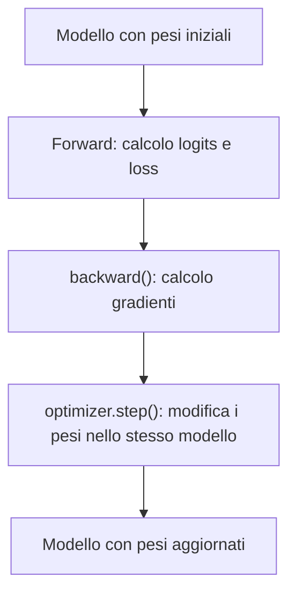

Se subito dopo facciamo un nuovo forward:

```python
logits, loss = model(input_tensor, target_tensor)
```

il modello userà i pesi aggiornati, non quelli iniziali.

### Chiarimento: qual è il collegamento tra `optimizer` e `model`

Il collegamento viene creato in questa riga:

```python
optimizer = torch.optim.AdamW(model.parameters(), lr=LEARNING_RATE)
```

La parte importante è:

```python
model.parameters()
```

Questa funzione restituisce i parametri allenabili del modello. Nel nostro caso
il parametro principale è la tabella interna di `nn.Embedding`:

```python
self.token_embedding_table = nn.Embedding(...)
```

Quando creiamo l'optimizer, gli stiamo dicendo:

```text
questi sono i pesi che puoi aggiornare
```

Quindi l'optimizer non è collegato al modello per nome. È collegato ai tensori
dei parametri restituiti da `model.parameters()`.

Il blocco di training:

```python
logits, loss = model(input_tensor, target_tensor)

optimizer.zero_grad()
loss.backward()
optimizer.step()
```

funziona così:

```text
1. modello(...) usa i pesi del modello e produce la loss
2. loss.backward() segue il grafo dei calcoli all'indietro
3. PyTorch scrive i gradienti dentro i parametri del modello
4. optimizer.step() legge quei gradienti e aggiorna quegli stessi parametri
```

Diagramma del collegamento:

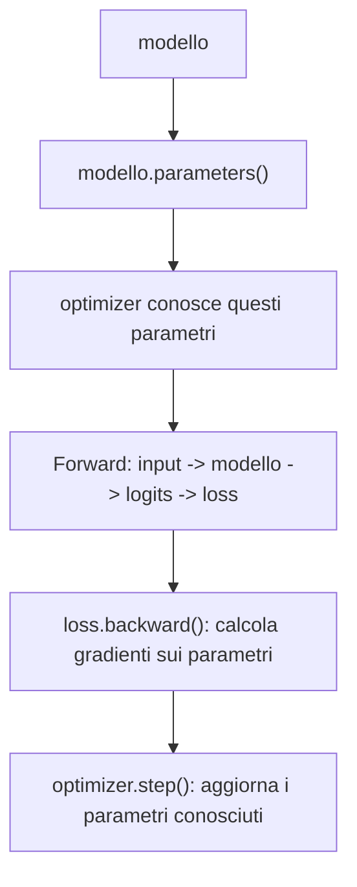

Quindi il collegamento tra `loss.backward()` e `optimizer.step()` è nei
parametri del modello:

```text
loss.backward() riempie parametro.grad
optimizer.step() usa parametro.grad per modificare parametro
```

In forma molto concreta:

```text
modello.token_embedding_table.weight        # pesi
modello.token_embedding_table.weight.grad   # gradienti calcolati da backward
```

L'optimizer aggiorna:

```text
modello.token_embedding_table.weight
```

usando:

```text
modello.token_embedding_table.weight.grad
```

### Diagramma del training

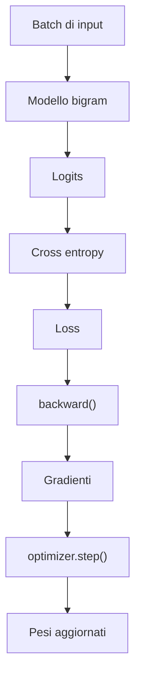

## Lezione 15 - Generazione con il modello bigram

### Cosa cambia e perché

Aggiorniamo:

```text
final_project/model.py
study/snapshots/lesson_15/model.py
```

aggiungendo un metodo:

```python
def generate(self, input_ids, max_new_tokens):
```

Poi creiamo:

```text
study/lessons/15_bigram_generation.py
```

Questo script allena brevemente il modello e poi gli fa generare nuovi
caratteri.

### Spiegazione

Fino alla lezione precedente il modello imparava, ma non produceva testo.

Ora vogliamo fare questo:

```text
prompt iniziale -> modello -> prossimo carattere -> testo aggiornato
```

Ripetendo il processo molte volte otteniamo una sequenza generata.

### Pezzo di codice aggiunto al modello

```python
def generate(self, input_ids, max_new_tokens):
    generated_ids = input_ids

    for _ in range(max_new_tokens):
        logits = self(generated_ids)
        last_token_logits = logits[:, -1, :]
        probabilities = F.softmax(last_token_logits, dim=-1)
        next_token_ids = torch.multinomial(probabilities, num_samples=1)
        generated_ids = torch.cat((generated_ids, next_token_ids), dim=1)

    return generated_ids
```

### Chiarimento: perché prendiamo solo l'ultimo token

Questa riga:

```python
last_token_logits = logits[:, -1, :]
```

prende i punteggi dell'ultima posizione.

La sintassi usa tre indici perché `logits` ha tre dimensioni:

```text
logits[batch, posizione, vocabolario]
```

Quindi:

```python
logits[:, -1, :]
```

si legge così:

```text
:   -> prendi tutti gli esempi del batch
-1  -> prendi solo l'ultima posizione della sequenza
:   -> prendi tutti i punteggi del vocabolario
```

Se `logits` ha forma:

```text
batch_size x context_size x vocabulary_size
```

allora:

```python
logits[:, -1, :]
```

vuol dire:

```text
per ogni esempio del batch,
prendi l'ultima posizione del contesto,
e tieni tutti i punteggi del vocabolario
```

Rappresentazione:

```text
generated_ids = [N, e, l]

il modello produce:

posizione 0 -> punteggi per il carattere dopo N
posizione 1 -> punteggi per il carattere dopo e
posizione 2 -> punteggi per il carattere dopo l

per continuare il testo ci interessa solo:

posizione 2 -> prossimo carattere dopo "Nel"
```

Rappresentazione più concreta con una forma piccola:

```text
logits.shape = [2, 4, 5]

2 esempi nel batch
4 posizioni nel contesto
5 punteggi per ogni posizione
```

Struttura:

```text
logits =
[
  [  # esempio 0
    [5 punteggi],  # posizione 0
    [5 punteggi],  # posizione 1
    [5 punteggi],  # posizione 2
    [5 punteggi],  # posizione 3, ultima posizione
  ],

  [  # esempio 1
    [5 punteggi],  # posizione 0
    [5 punteggi],  # posizione 1
    [5 punteggi],  # posizione 2
    [5 punteggi],  # posizione 3, ultima posizione
  ],
]
```

Dopo:

```python
last_token_logits = logits[:, -1, :]
```

otteniamo:

```text
last_token_logits =
[
  [5 punteggi],  # ultima posizione dell'esempio 0
  [5 punteggi],  # ultima posizione dell'esempio 1
]
```

La forma diventa:

```text
[2, 5]
```

Cioè:

```text
batch_size x vocabulary_size
```

Nel nostro caso, se stiamo generando un solo testo alla volta:

```text
batch_size = 1
vocabulary_size = 68
```

quindi:

```text
last_token_logits.shape = [1, 68]
```

Questo è esattamente quello che ci serve: una lista di 68 punteggi per scegliere
il prossimo carattere.

### Chiarimento: da logits a probabilità

I `logits` sono punteggi grezzi. Non sono ancora probabilità.

Per trasformarli in probabilità usiamo:

```python
probabilities = F.softmax(last_token_logits, dim=-1)
```

La parte:

```python
F.softmax(...)
```

applica la funzione softmax.

La parte:

```python
dim=-1
```

indica su quale dimensione vogliamo calcolare le probabilità.

Nel nostro caso `last_token_logits` ha forma:

```text
batch_size x vocabulary_size
```

Per esempio:

```text
[1, 68]
```

L'ultima dimensione è quella del vocabolario, cioè i 68 punteggi possibili per
il prossimo carattere.

Quindi:

```python
dim=-1
```

vuol dire:

```text
trasforma i punteggi del vocabolario in probabilità
```

La softmax prende numeri qualsiasi e li trasforma in valori che:

```text
sono tutti positivi
sommano a 1
possono essere interpretati come probabilità
```

Esempio piccolo:

```text
last_token_logits = [[2.0, 1.0, 0.0]]
```

Questi sono punteggi grezzi per tre possibili token:

```text
token 0 -> 2.0
token 1 -> 1.0
token 2 -> 0.0
```

Dopo softmax potremmo ottenere circa:

```text
probabilities = [[0.665, 0.245, 0.090]]
```

Ora i valori:

```text
sono positivi
sommano a 1
indicano quanto ogni token è probabile
```

Il token con punteggio più alto resta il più probabile, ma gli altri token non
vengono eliminati.

Rappresentazione:

```text
logits grezzi
[2.0, 1.0, 0.0]
      │
      ▼
softmax(dim=-1)
      │
      ▼
probabilità
[0.665, 0.245, 0.090]
```

Se avessimo più esempi nel batch:

```text
last_token_logits.shape = [2, 3]

[
  [2.0, 1.0, 0.0],  # esempio 0
  [0.5, 0.5, 3.0],  # esempio 1
]
```

`dim=-1` applica la softmax separatamente su ogni riga:

```text
[
  [probabilità per esempio 0],
  [probabilità per esempio 1],
]
```

Non mescola gli esempi tra loro. Trasforma solo i punteggi del vocabolario di
ciascun esempio in probabilità.

### Chiarimento: perché `multinomial`

Questa riga:

```python
next_token_ids = torch.multinomial(probabilities, num_samples=1)
```

sceglie un token casualmente, ma rispettando le probabilità.

Se il modello assegna:

```text
"a" -> 60%
"e" -> 30%
"z" -> 10%
```

allora `"a"` è più probabile, ma non è garantita. Questo rende la generazione
meno rigida.

Se invece scegliessimo sempre il massimo con `argmax`, il modello sarebbe più
deterministico e spesso più ripetitivo.

### Chiarimento: come cresce il testo generato

Questa riga:

```python
generated_ids = torch.cat((generated_ids, next_token_ids), dim=1)
```

attacca il nuovo token alla sequenza già generata.

Rappresentazione:

```text
inizio:
[N]

dopo 1 token:
[N, e]

dopo 2 token:
[N, e, l]

dopo 3 token:
[N, e, l,  ]
```

Ogni giro del ciclo aggiunge un token.

### Chiarimento: il ciclo completo di `generate`, riga per riga

Il cuore della generazione è questo ciclo:

```python
for _ in range(max_new_tokens):
    logits = self(generated_ids)
    last_token_logits = logits[:, -1, :]
    probabilities = F.softmax(last_token_logits, dim=-1)
    next_token_ids = torch.multinomial(probabilities, num_samples=1)
    generated_ids = torch.cat((generated_ids, next_token_ids), dim=1)
```

Questo ciclo viene ripetuto `max_new_tokens` volte.

Se:

```python
max_new_tokens = 300
```

allora il modello aggiunge 300 nuovi token alla sequenza iniziale.

La variabile `_` indica che non ci interessa usare il numero del giro. Ci
interessa solo ripetere il blocco.

#### 1. Calcolare i logits

```python
logits = self(generated_ids)
```

Qui chiamiamo il modello sulla sequenza generata finora.

Se all'inizio abbiamo:

```text
generated_ids = [N]
```

il modello produce i punteggi per il prossimo carattere dopo `N`.

Dopo qualche giro potremmo avere:

```text
generated_ids = [N, e, l]
```

allora il modello produce punteggi per ogni posizione della sequenza:

```text
posizione 0 -> prossimo token dopo N
posizione 1 -> prossimo token dopo e
posizione 2 -> prossimo token dopo l
```

#### 2. Prendere solo l'ultima posizione

```python
last_token_logits = logits[:, -1, :]
```

Durante la generazione ci interessa continuare il testo dalla fine.

Se abbiamo:

```text
[N, e, l]
```

ci interessa scegliere il prossimo token dopo `l`, non dopo `N` o dopo `e`.

Per questo prendiamo solo l'ultima posizione dei logits.

#### 3. Trasformare i logits in probabilità

```python
probabilities = F.softmax(last_token_logits, dim=-1)
```

I logits sono punteggi grezzi. La softmax li trasforma in probabilità.

Esempio:

```text
logits:       [2.0, 1.0, 0.0]
probabilità:  [0.665, 0.245, 0.090]
```

Ora possiamo scegliere il prossimo token usando una distribuzione di
probabilità.

#### 4. Campionare il prossimo token

```python
next_token_ids = torch.multinomial(probabilities, num_samples=1)
```

Questa riga sceglie un token.

Non sceglie necessariamente il token con probabilità più alta. Lo sceglie in
modo casuale, ma rispettando le probabilità.

Se:

```text
"a" -> 70%
"e" -> 20%
"z" -> 10%
```

allora `"a"` uscirà spesso, ma ogni tanto possono uscire anche `"e"` o `"z"`.

Questo rende la generazione meno rigida.

#### 5. Attaccare il nuovo token alla sequenza

```python
generated_ids = torch.cat((generated_ids, next_token_ids), dim=1)
```

Qui aggiungiamo il nuovo token alla sequenza.

Esempio:

```text
prima:
[N, e, l]

nuovo token:
[ ]

dopo:
[N, e, l,  ]
```

`dim=1` significa che concateniamo lungo la dimensione dei token della sequenza.

Se la forma iniziale è:

```text
[1, 3]
```

cioè:

```text
1 esempio nel batch
3 token nella sequenza
```

dopo aver aggiunto un token diventa:

```text
[1, 4]
```

#### 6. Ripetere

Il ciclo riparte usando la sequenza aggiornata.

Diagramma dei primi giri:

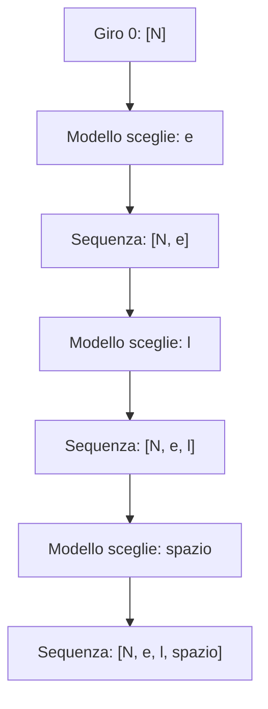

Questo è il meccanismo base della generazione autoregressiva:

```text
ogni nuovo token viene aggiunto alla sequenza,
poi la sequenza aggiornata viene usata per generare il token successivo
```

### Diagramma della generazione

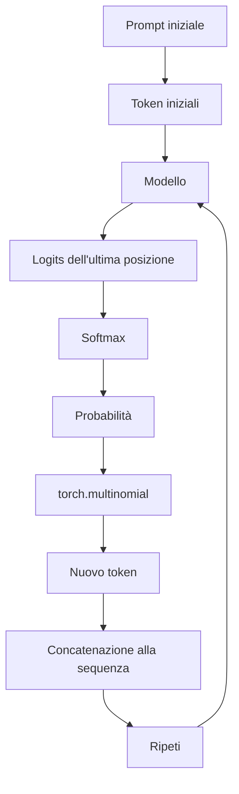

## Lezione 16 - Il limite del modello bigram

### Cosa cambia e perché

Creiamo:

```text
study/lessons/16_bigram_limit.py
```

Questa lezione non aggiunge nuovi file al progetto finale. Serve a capire il
limite del modello bigram prima di passare a un modello che usa davvero il
contesto.

### Spiegazione

Il modello bigram riceve una sequenza, ma ogni posizione viene trattata in modo
indipendente.

Nel nostro `forward`:

```python
logits = self.token_embedding_table(input_ids)
```

ogni token viene usato come indice dentro una tabella.

Questo significa che il punteggio prodotto per un token dipende solo da quel
token, non dai token precedenti.

Per esempio, se confrontiamo:

```text
Nel
sol
```

questi due prompt sono diversi, ma finiscono entrambi con:

```text
l
```

Quando generiamo il prossimo carattere, prendiamo:

```python
last_token_logits = logits[:, -1, :]
```

cioè i punteggi dell'ultima posizione.

Per il bigram, l'ultima posizione dipende solo dall'ultimo carattere. Quindi:

```text
Nel -> ultimo carattere l
sol -> ultimo carattere l
```

producono gli stessi punteggi finali.

### Perché questo è un limite

Un vero GPT dovrebbe distinguere contesti diversi.

Esempio:

```text
Nel
sol
```

Anche se finiscono entrambi con `l`, il contesto prima della `l` è diverso.

Un modello più potente dovrebbe poter imparare che:

```text
"Nel" può continuare in un certo modo
"sol" può continuare in un altro modo
```

Il bigram invece non può farlo, perché non combina davvero le informazioni
dei token precedenti.

### Esperimento della lezione

Lo script fa tre confronti:

```text
Nel  -> finisce con l
sol  -> finisce con l
Nea  -> finisce con a
```

Poi controlla:

```python
torch.allclose(logits_nel, logits_sol)
```

Se restituisce `True`, significa che i punteggi sono uguali.

Nel nostro caso ci aspettiamo:

```text
Nel vs sol -> True
Nel vs Nea -> False
```

Perché `Nel` e `sol` finiscono con lo stesso carattere, mentre `Nea` finisce con
un carattere diverso.

### Diagramma del limite bigram

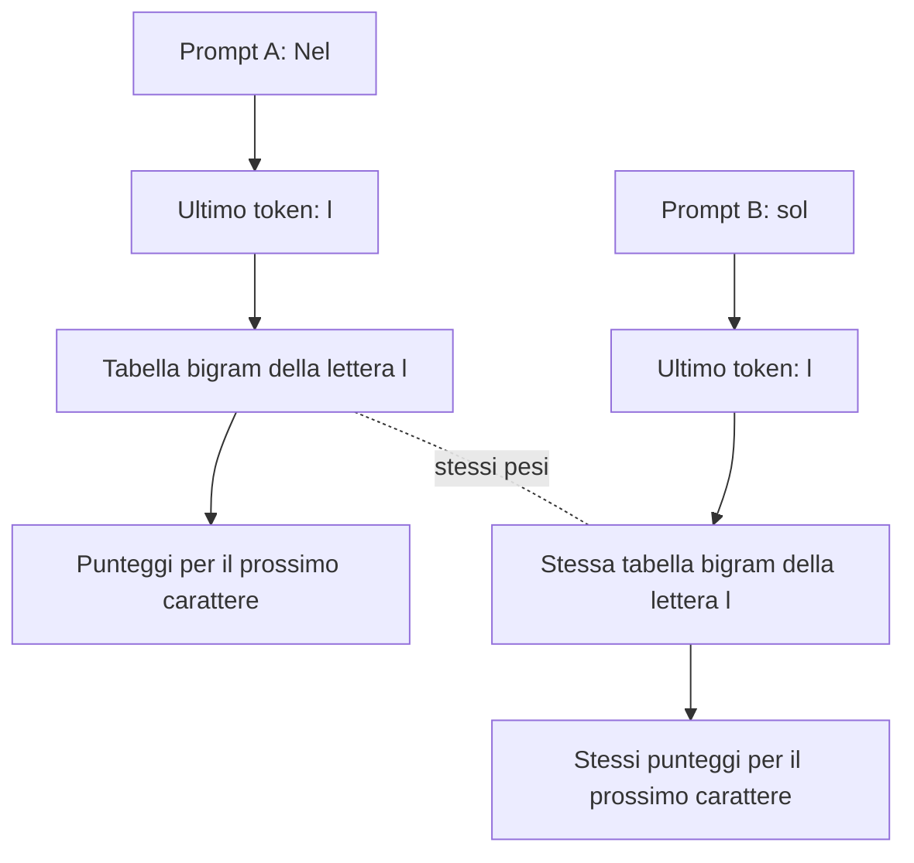

Il modello non vede davvero:

```text
N e l
```

come una sequenza da interpretare insieme. Per la previsione finale vede solo:

```text
l
```

### Conclusione

Il bigram ha imparato qualcosa sulle coppie di caratteri, ma non usa davvero il
contesto lungo.

Questa è la ragione per cui il prossimo passo sarà introdurre un modello che
trasforma i token in vettori più ricchi e comincia a rappresentare anche la
posizione dei token nella sequenza.

---

## Lezione 17 - Token embeddings

### Cosa cambia e perché

Aggiorniamo:

```text
final_project/model.py
study/snapshots/lesson_17/model.py
```

aggiungendo una nuova classe:

```python
class LanguageModel(nn.Module):
```

Poi creiamo:

```text
study/lessons/17_token_embeddings.py
```

Questa lezione introduce il passaggio:

```text
ID numerico del token -> vettore del token -> logits
```

### Spiegazione

Finora il modello bigram usava una tabella così:

```python
nn.Embedding(
    num_embeddings=vocabulary_size,
    embedding_dim=vocabulary_size,
)
```

Con `vocabulary_size = 68`, ogni token diventava direttamente una riga lunga
68 numeri. Quei 68 numeri erano già i punteggi per il prossimo carattere.

Nel nuovo modello separiamo due fasi:

```text
1. token id -> embedding vector
2. embedding vector -> logits
```

Il nuovo embedding è:

```python
self.token_embedding_table = nn.Embedding(
    num_embeddings=vocabulary_size,
    embedding_dim=embedding_size,
)
```

Se:

```text
vocabulary_size = 68
embedding_size = 16
```

allora ogni token non diventa più una lista di 68 logits, ma un vettore di 16
numeri.

Poi usiamo:

```python
self.output_head = nn.Linear(
    in_features=embedding_size,
    out_features=vocabulary_size,
)
```

per trasformare il vettore da 16 numeri in 68 logits.

### Chiarimento: ID token vs embedding

Un token ID è solo un numero intero.

Esempio:

```text
"s" -> 52
```

Il modello non può capire molto dal numero `52` in sé. È solo un indice.

L'embedding trasforma quell'indice in un vettore:

```text
52 -> [-0.2206, 0.7118, 0.3416, ..., 0.3926]
```

Quel vettore è una rappresentazione allenabile del token.

Allenabile significa che i numeri dentro l'embedding possono cambiare durante
il training.

### Rappresentazione testuale: prima e adesso

Prima, nel modello bigram, la tabella aveva questa forma:

```python
nn.Embedding(
    num_embeddings=vocabulary_size,
    embedding_dim=vocabulary_size,
)
```

Con `vocabulary_size = 68`, ogni token produceva subito 68 valori:

```text
PRIMA: modello bigram

token ID
  |
  v
tabella bigram
  |
  v
[68 valori]
```

Quei 68 valori erano già i logits. Ogni posizione corrispondeva direttamente a
un token possibile del vocabolario:

```text
token ID 52
  |
  v
[logit per ID 0, logit per ID 1, logit per ID 2, ..., logit per ID 67]
```

Quindi, nel bigram:

```text
valore 0  -> punteggio del prossimo token con ID 0
valore 1  -> punteggio del prossimo token con ID 1
valore 2  -> punteggio del prossimo token con ID 2
...
valore 67 -> punteggio del prossimo token con ID 67
```

Adesso, nella lezione 17, la tabella ha questa forma:

```python
nn.Embedding(
    num_embeddings=vocabulary_size,
    embedding_dim=embedding_size,
)
```

Con `embedding_size = 16`, ogni token produce prima solo 16 valori:

```text
ADESSO: modello con token embeddings

token ID
  |
  v
token_embedding_table
  |
  v
[16 valori interni]
  |
  v
output_head
  |
  v
[68 logits]
```

I 16 valori dentro l'embedding non corrispondono uno a uno ai caratteri del
vocabolario. Sono numeri interni del modello:

```text
token ID 52
  |
  v
[embedding_0, embedding_1, embedding_2, ..., embedding_15]
```

Solo dopo `output_head` torniamo ad avere un punteggio per ogni token possibile:

```text
[embedding_0, embedding_1, ..., embedding_15]
  |
  v
output_head
  |
  v
[logit per ID 0, logit per ID 1, logit per ID 2, ..., logit per ID 67]
```

Confronto diretto:

| Passaggio | Prima: bigram | Adesso: token embeddings |
| --- | --- | --- |
| Input | token ID | token ID |
| Prima tabella | produce 68 valori | produce 16 valori |
| Significato di quei valori | già logits sul vocabolario | rappresentazione interna del token |
| Collegamento con il vocabolario | diretto | arriva dopo, tramite `output_head` |
| Forma dopo la tabella | `[batch_size, context_size, vocabulary_size]` | `[batch_size, context_size, embedding_size]` |
| Forma finale dei logits | già pronta dopo la tabella | pronta dopo `output_head` |

Facsimile con il token `'s'`, che nel vocabolario attuale ha ID `52`.
I numeri sotto sono un esempio con seed fisso e modello non ancora addestrato.
Servono a vedere la struttura dei valori, non a interpretare il significato di
ogni singolo numero.

Prima, nel bigram, il token ID `52` produceva direttamente 68 logits:

```text
token ID 52, cioè 's'
  |
  v
bigram token_embedding_table
  |
  v
[
  -0.5037,  0.5825, -2.6750,  0.1853,
  -1.3125, -0.7756, -0.0946, -1.1716,
   ...
  -0.6592, -0.6763,  0.0772
]
```

Lettura corretta del vettore di prima:

```text
-0.5037 -> logit per il prossimo token con ID 0
 0.5825 -> logit per il prossimo token con ID 1
-2.6750 -> logit per il prossimo token con ID 2
 0.1853 -> logit per il prossimo token con ID 3
...
 0.0772 -> logit per il prossimo token con ID 67
```

Adesso, il token ID `52` produce prima 16 valori di embedding:

```text
token ID 52, cioè 's'
  |
  v
token_embedding_table
  |
  v
[
  -0.2206,  0.7118,  0.3416,  1.5886,
  -0.3489, -0.4579, -1.2322, -0.5981,
  -0.2815,  0.0528,  0.4250,  0.4826,
   0.4881,  1.0082, -0.5950,  0.3926
]
```

Lettura corretta del vettore di adesso:

```text
-0.2206 -> valore interno 0 dell'embedding
 0.7118 -> valore interno 1 dell'embedding
 0.3416 -> valore interno 2 dell'embedding
 1.5886 -> valore interno 3 dell'embedding
...
 0.3926 -> valore interno 15 dell'embedding
```

Questi 16 valori non sono logits. Dopo `output_head`, diventano 68 logits:

```text
embedding di 16 valori
  |
  v
output_head
  |
  v
[
   0.4328,  0.6938, -1.1515,  0.1807,
   0.3069, -0.2913, -0.7930,  0.5051,
   ...
  -0.1039,  0.4434, -0.1745
]
```

Lettura corretta del vettore finale:

```text
 0.4328 -> logit per il prossimo token con ID 0
 0.6938 -> logit per il prossimo token con ID 1
-1.1515 -> logit per il prossimo token con ID 2
 0.1807 -> logit per il prossimo token con ID 3
...
-0.1745 -> logit per il prossimo token con ID 67
```

Per questa ragione, quando guardiamo i valori dell'embedding stampati dalla
lezione 17, non dobbiamo leggerli come punteggi dei caratteri. Sono valori che
verranno combinati dalla testa di output per produrre i logits.

### Chiarimento: perché serve una testa di output

L'embedding ha dimensione 16:

```text
embedding_size = 16
```

Ma per prevedere il prossimo carattere dobbiamo produrre un punteggio per ogni
carattere possibile:

```text
vocabulary_size = 68
```

Quindi serve una trasformazione:

```text
16 numeri -> 68 logits
```

Questa trasformazione è fatta da:

```python
self.output_head = nn.Linear(16, 68)
```

### Approfondimento: cosa significa trasformare un embedding in punteggi sul vocabolario

Nel codice della lezione:

```python
self.output_head = nn.Linear(
    in_features=embedding_size,
    out_features=vocabulary_size,
)
```

`nn.Linear` riceve un vettore in ingresso e restituisce un nuovo vettore in
uscita. La documentazione PyTorch definisce `in_features` come la grandezza di
ogni elemento in ingresso e `out_features` come la grandezza di ogni elemento in
uscita. Nel nostro caso:

```text
in_features = embedding_size = 16
out_features = vocabulary_size = 68
```

Quindi `output_head` riceve un embedding lungo 16 numeri e restituisce 68
numeri. Questi 68 numeri sono i logits: un punteggio per ciascun carattere del
vocabolario.

Esempio di forma:

```text
un embedding per un token:
[16 numeri]

dopo output_head:
[68 logits]
```

Ogni posizione del vettore finale corrisponde a un possibile token del
vocabolario:

```text
logits[0]  -> punteggio del token con ID 0
logits[1]  -> punteggio del token con ID 1
logits[2]  -> punteggio del token con ID 2
...
logits[67] -> punteggio del token con ID 67
```

Questi punteggi non sono ancora probabilità. Possono essere negativi, positivi,
piccoli o grandi. Per trasformarli in probabilità serve `softmax`, che abbiamo
già visto nella generazione:

```python
probabilities = F.softmax(last_token_logits, dim=-1)
```

Il punto importante è questo:

```text
embedding -> output_head -> logits -> softmax -> probabilità
```

`output_head` non sceglie direttamente il prossimo carattere. Produce solo i
punteggi che poi verranno usati dalla loss durante il training o da `softmax`
durante la generazione.

Dentro `nn.Linear` ci sono pesi allenabili e bias allenabili. Con i nostri
numeri:

```text
output_head.weight.shape = [68, 16]
output_head.bias.shape   = [68]
```

Per ogni possibile token di uscita, la testa di output impara una riga di 16
pesi. Ogni riga prende i 16 numeri dell'embedding e produce un solo logit.

In forma semplificata:

```text
logit_del_token_0 = embedding * pesi_del_token_0 + bias_del_token_0
logit_del_token_1 = embedding * pesi_del_token_1 + bias_del_token_1
...
logit_del_token_67 = embedding * pesi_del_token_67 + bias_del_token_67
```

Qui `embedding * pesi` indica una somma pesata: ogni numero dell'embedding viene
moltiplicato per un peso, poi i risultati vengono sommati e viene aggiunto il
bias.

La stessa trasformazione viene applicata a tutti i token del batch. Per questo
la forma cambia solo nell'ultima dimensione:

```text
prima di output_head:
[batch_size, context_size, embedding_size]
[4,          8,            16]

dopo output_head:
[batch_size, context_size, vocabulary_size]
[4,          8,            68]
```

Le prime due dimensioni restano uguali:

```text
4 esempi nel batch
8 posizioni per ogni esempio
```

Cambia solo l'ultima dimensione:

```text
16 numeri interni del token -> 68 punteggi sul vocabolario
```

Diagramma del passaggio:

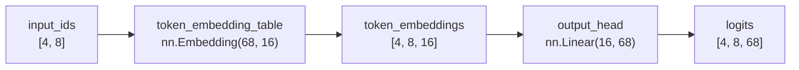

Errore comune: pensare che `output_head` legga il vocabolario e restituisca
caratteri. Non succede questo. `output_head` lavora solo con numeri. I caratteri
entrano in gioco dopo, quando un ID viene scelto e poi convertito in testo con
`decode`.

Fonti tecniche consultate per questo chiarimento:

- [Documentazione PyTorch di `nn.Linear`](https://docs.pytorch.org/docs/2.12/generated/torch.nn.Linear.html):
  descrive `in_features`, `out_features`, forma di input/output, pesi e bias
  allenabili.
- [Documentazione PyTorch di `nn.Embedding`](https://docs.pytorch.org/docs/2.12/generated/torch.nn.Embedding.html):
  descrive la tabella di embedding e la forma dell'output rispetto alla forma
  degli indici in input.

### Rappresentazione delle forme

Input:

```text
input_tensor.shape = [4, 8]
```

Cioè:

```text
4 esempi nel batch
8 token per esempio
```

Dopo la token embedding table:

```text
token_embeddings.shape = [4, 8, 16]
```

Cioè:

```text
4 esempi
8 token
16 numeri per rappresentare ogni token
```

Dopo la testa di output:

```text
logits.shape = [4, 8, 68]
```

Cioè:

```text
4 esempi
8 token
68 punteggi per il prossimo carattere
```

Diagramma:

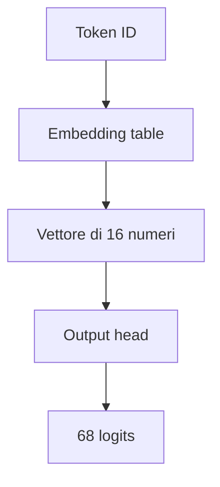

### Perché questo è un passo avanti

Il bigram diretto saltava subito da:

```text
token id -> 68 logits
```

Ora abbiamo uno spazio intermedio:

```text
token id -> embedding -> logits
```

Questo è più vicino a un GPT vero, perché nei Transformer i token vengono prima
trasformati in vettori. Poi quei vettori vengono elaborati da attention e altri
blocchi.

Il modello di questa lezione non usa ancora davvero il contesto lungo. Però
introduce la rappresentazione vettoriale, che è necessaria per i passi
successivi.

### Codice aggiunto a `study/snapshots/lesson_17/model.py`

```python
class LanguageModel(nn.Module):
    def __init__(self, vocabulary_size, embedding_size):
        super().__init__()

        self.token_embedding_table = nn.Embedding(
            num_embeddings=vocabulary_size,
            embedding_dim=embedding_size,
        )
        self.output_head = nn.Linear(
            in_features=embedding_size,
            out_features=vocabulary_size,
        )

    def forward(self, input_ids, target_ids=None):
        token_embeddings = self.token_embedding_table(input_ids)
        logits = self.output_head(token_embeddings)

        if target_ids is None:
            return logits

        batch_size, context_size, vocabulary_size = logits.shape

        logits_flat = logits.reshape(batch_size * context_size, vocabulary_size)
        target_ids_flat = target_ids.reshape(batch_size * context_size)

        loss = F.cross_entropy(logits_flat, target_ids_flat)

        return logits, loss

    def generate(self, input_ids, max_new_tokens):
        generated_ids = input_ids

        for _ in range(max_new_tokens):
            logits = self(generated_ids)
            last_token_logits = logits[:, -1, :]
            probabilities = F.softmax(last_token_logits, dim=-1)
            next_token_ids = torch.multinomial(probabilities, num_samples=1)
            generated_ids = torch.cat((generated_ids, next_token_ids), dim=1)

        return generated_ids
```

### Conclusione

Abbiamo introdotto gli embeddings:

```text
token id -> vettore
```

Il prossimo passo sarà aggiungere embeddings di posizione, perché un GPT non
deve sapere solo quale token sta leggendo, ma anche dove quel token si trova
nella sequenza.

---

## Lezione 18 - Position embeddings

### Cosa cambia e perché

Aggiorniamo:

```text
final_project/model.py
study/snapshots/lesson_18/model.py
```

aggiungendo una nuova classe:

```python
class LanguageModel(nn.Module):
```

Poi creiamo:

```text
study/lessons/18_position_embeddings.py
```

Questa lezione introduce il passaggio:

```text
token embedding + position embedding -> embedding usato dal modello
```

### Differenza rispetto alla lezione 17

Nella lezione 17 avevamo:

```text
token ID -> token embedding -> logits
```

Il modello sapeva quale token stava leggendo, ma non aveva ancora un vettore
dedicato alla posizione del token nel contesto.

Nella lezione 18 abbiamo:

```text
token ID -> token embedding
posizione -> position embedding
token embedding + position embedding -> logits
```

Quindi ogni token viene rappresentato usando due informazioni:

```text
1. quale token è
2. in quale posizione del contesto si trova
```

### Chiarimento: che cosa significa contesto

Nel nostro progetto, il contesto è una sequenza breve di token consecutivi che
diamo al modello come input.

Non è tutto il testo del campione FineWeb-Edu. È una finestra piccola presa dal
testo.

Con:

```python
CONTEXT_SIZE = 8
```

stiamo dicendo:

```text
ogni esempio dato al modello contiene 8 token di input
```

Nel codice del batch succede questo:

```python
input_tokens = data[start_position:start_position + context_size]
target_tokens = data[start_position + 1:start_position + context_size + 1]
```

Quindi, se nel testo abbiamo una sequenza così:

```text
s p a r g o \n r ...
```

e `context_size = 8`, l'input può essere:

```text
input:
s p a r g o \n r
```

Il target è la stessa finestra spostata avanti di un token:

```text
target:
p a r g o \n r ...
```

Il modello usa l'input per imparare a prevedere il token successivo in ogni
posizione.

Vista come tabella:

| Posizione | Contesto disponibile fino a lì | Target da prevedere |
| --- | --- | --- |
| 0 | `s` | `p` |
| 1 | `s p` | `a` |
| 2 | `s p a` | `r` |
| 3 | `s p a r` | `g` |
| 4 | `s p a r g` | `o` |
| 5 | `s p a r g o` | `\n` |
| 6 | `s p a r g o \n` | `r` |

Nel codice della lezione 18, però, stampiamo l'input come tensore intero:

```text
input_tensor.shape = [4, 8]
```

Questo significa:

```text
4 esempi nel batch
8 token di contesto per ogni esempio
```

Quindi `context_size` è la lunghezza della finestra temporale che il modello può
ricevere in un singolo esempio.

### Quattro vocabili da distinguere bene

Da qui in avanti useremo spesso questi quattro nomi:

```text
batch_size
context_size
embedding_size
vocabulary_size
```

Sembrano simili perché sono tutti numeri, ma misurano cose diverse.

#### `batch_size`

`batch_size` indica quanti esempi elaboriamo insieme in una singola chiamata del
modello.

Nel nostro codice:

```python
BATCH_SIZE = 4
```

significa:

```text
il batch contiene 4 esempi
```

Ogni esempio è una sequenza di token. Se guardiamo `input_tensor`, il
`batch_size` è la prima dimensione:

```text
input_tensor.shape = [4, 8]
                      ^
                      batch_size
```

Quindi il tensore contiene 4 righe:

```text
esempio 0: [token, token, token, token, token, token, token, token]
esempio 1: [token, token, token, token, token, token, token, token]
esempio 2: [token, token, token, token, token, token, token, token]
esempio 3: [token, token, token, token, token, token, token, token]
```

Errore comune: pensare che `batch_size` aumenti la memoria del singolo esempio.
Non è così. Aumenta il numero di esempi elaborati insieme.

#### `context_size`

`context_size` indica quanti token contiene ogni esempio.

Nel nostro codice:

```python
CONTEXT_SIZE = 8
```

significa:

```text
ogni esempio contiene 8 token consecutivi
```

Se guardiamo `input_tensor`, il `context_size` è la seconda dimensione:

```text
input_tensor.shape = [4, 8]
                         ^
                         context_size
```

Quindi ogni riga ha 8 token:

```text
esempio 0:
[token 0, token 1, token 2, token 3, token 4, token 5, token 6, token 7]
```

Il `context_size` è anche il motivo per cui nella lezione 18 creiamo 8 posizioni:

```python
positions = torch.arange(CONTEXT_SIZE)
```

Risultato:

```text
tensor([0, 1, 2, 3, 4, 5, 6, 7])
```

Errore comune: pensare che `context_size` sia tutto il testo disponibile. Non è
così. È solo la lunghezza della sequenza che il modello riceve in quel singolo
esempio.

#### `embedding_size`

`embedding_size` indica quanti numeri usiamo per rappresentare ogni token o ogni
posizione dopo la tabella di embedding.

Nel nostro codice:

```python
EMBEDDING_SIZE = 16
```

significa:

```text
ogni token embedding contiene 16 numeri
ogni position embedding contiene 16 numeri
```

Esempio:

```text
token ID 52
  |
  v
token embedding lungo 16 numeri
```

Dopo la `token_embedding_table`, la forma diventa:

```text
token_embeddings.shape = [4, 8, 16]
                              ^
                              embedding_size
```

Questa forma va letta come una struttura a tre livelli:

```text
[4, 8, 16]
 |  |   |
 |  |   +-- ogni token è rappresentato da 16 numeri
 |  +------ ogni esempio contiene 8 token
 +--------- il batch contiene 4 esempi
```

Il singolo vettore da 16 numeri esiste, ma non è tutto il tensore. È solo un
elemento interno del tensore.

Con:

```text
token_embeddings.shape = [4, 8, 16]
```

abbiamo:

```text
4 esempi
8 token per esempio
16 numeri per token
```

Quindi il tensore contiene:

```text
4 x 8 = 32 token embeddings
```

Ogni token embedding è lungo:

```text
16 numeri
```

Esempio di lettura con gli indici:

| Espressione | Cosa prende | Forma |
| --- | --- | --- |
| `token_embeddings` | tutto il batch | `[4, 8, 16]` |
| `token_embeddings[0]` | primo esempio del batch | `[8, 16]` |
| `token_embeddings[0, 0]` | primo token del primo esempio | `[16]` |
| `token_embeddings[0, 0, 0]` | primo numero del vettore del primo token | `[]`, cioè un singolo valore |

Rappresentazione testuale:

```text
token_embeddings[0]              -> primo esempio, forma [8, 16]
token_embeddings[0][0]           -> primo token del primo esempio, forma [16]
token_embeddings[0][0][0]        -> primo numero del vettore, forma singola
```

Quindi quando diciamo:

```text
token_embeddings[0, 0] =
[0.34, -1.12, 0.08, 0.51, ..., -0.27]
```

stiamo guardando solo uno dei 32 vettori presenti dentro `token_embeddings`.

Le prime due dimensioni vengono dall'input:

```text
4 -> batch_size
8 -> context_size
```

La terza dimensione viene dall'embedding:

```text
16 -> embedding_size
```

Errore comune: pensare che `embedding_size` dica quanti token esistono. Non è
così. Dice quanti numeri interni usiamo per rappresentare un token.

#### `vocabulary_size`

`vocabulary_size` indica quanti token diversi esistono nel vocabolario.

Nel nostro progetto, per ora, i token sono caratteri. Quindi `vocabulary_size`
è il numero di caratteri diversi trovati nel testo.

Nel nostro output:

```text
vocabulary_size = 68
```

significa:

```text
il vocabolario contiene 68 token possibili
```

Questo numero serve in due punti importanti.

Primo: la tabella dei token embeddings ha una riga per ogni token possibile:

```python
self.token_embedding_table = nn.Embedding(
    num_embeddings=vocabulary_size,
    embedding_dim=embedding_size,
)
```

Con i nostri numeri:

```text
token_embedding_table.weight.shape = [68, 16]
```

Secondo: l'output finale deve produrre un punteggio per ogni token possibile:

```python
self.output_head = nn.Linear(
    in_features=embedding_size,
    out_features=vocabulary_size,
)
```

Per questo i logits hanno forma:

```text
logits.shape = [4, 8, 68]
                       ^
                       vocabulary_size
```

Errore comune: confondere `vocabulary_size` con `embedding_size`.

```text
embedding_size = 16  -> quanti numeri rappresentano un token
vocabulary_size = 68 -> quanti token possibili possono essere previsti
```

#### Riassunto compatto

| Termine | Domanda a cui risponde | Nel nostro caso | Dove lo vedi |
| --- | --- | --- | --- |
| `batch_size` | Quanti esempi insieme? | `4` | prima dimensione di `input_tensor`: `[4, 8]` |
| `context_size` | Quanti token per esempio? | `8` | seconda dimensione di `input_tensor`: `[4, 8]` |
| `embedding_size` | Quanti numeri per rappresentazione interna? | `16` | ultima dimensione di `token_embeddings`: `[4, 8, 16]` |
| `vocabulary_size` | Quanti token possibili esistono? | `68` | ultima dimensione dei logits: `[4, 8, 68]` |

Vista completa delle forme:

```text
input_tensor:
[batch_size, context_size]
[4,          8]

token_embeddings:
[batch_size, context_size, embedding_size]
[4,          8,            16]

position_embeddings:
[context_size, embedding_size]
[8,            16]

logits:
[batch_size, context_size, vocabulary_size]
[4,          8,            68]
```

Diagramma:

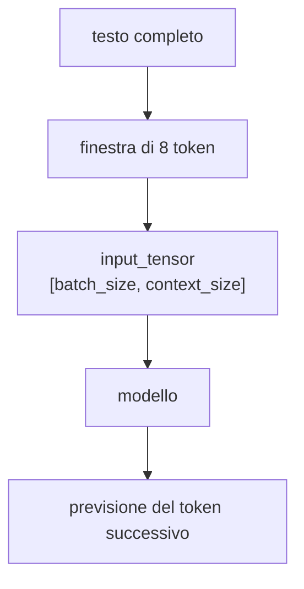

Quando più avanti useremo la self-attention causale, il contesto sarà ancora più
importante: ogni posizione potrà usare i token precedenti dentro quella finestra,
ma non i token futuri.

### Spiegazione

Un token embedding dipende dal token.

Esempio:

```text
token ID 52 -> vettore del token 's'
```

Un position embedding dipende invece dalla posizione dentro il contesto.

Esempio con `context_size = 8`:

```text
posizione 0 -> vettore della posizione 0
posizione 1 -> vettore della posizione 1
posizione 2 -> vettore della posizione 2
...
posizione 7 -> vettore della posizione 7
```

Per creare questi ID di posizione usiamo:

```python
positions = torch.arange(context_size, device=input_ids.device)
```

Con `context_size = 8`, otteniamo:

```text
tensor([0, 1, 2, 3, 4, 5, 6, 7])
```

Poi usiamo una seconda tabella `nn.Embedding`:

```python
self.position_embedding_table = nn.Embedding(
    num_embeddings=context_size,
    embedding_dim=embedding_size,
)
```

Questa tabella contiene un vettore allenabile per ogni posizione ammessa dal
contesto.

Con:

```text
context_size = 8
embedding_size = 16
```

la tabella produce:

```text
position_embeddings.shape = [8, 16]
```

### Chiarimento: sono entrambe `nn.Embedding`, ma non rappresentano la stessa cosa

Nel codice abbiamo due moduli dello stesso tipo:

```python
self.token_embedding_table = nn.Embedding(
    num_embeddings=vocabulary_size,
    embedding_dim=embedding_size,
)

self.position_embedding_table = nn.Embedding(
    num_embeddings=context_size,
    embedding_dim=embedding_size,
)
```

Sono entrambi `nn.Embedding` perché PyTorch usa `nn.Embedding` come tabella
generale che fa questa operazione:

```text
indice intero -> vettore allenabile
```

La differenza non è nel tipo di modulo PyTorch. La differenza è nel significato
degli indici che passiamo alla tabella.

Nel primo caso, gli indici sono ID di token:

```text
input_ids:
[52, 49, 32, 50, 38, 47,  1, 50]

significato:
ID dei caratteri/token presenti nel testo
```

Nel secondo caso, gli indici sono ID di posizione:

```text
positions:
[0, 1, 2, 3, 4, 5, 6, 7]

significato:
posizioni dentro il contesto
```

Quindi:

```text
token_embedding_table[52]
```

restituisce il vettore associato al token con ID `52`, cioè nel nostro esempio
il carattere `'s'`.

Invece:

```text
position_embedding_table[0]
```

restituisce il vettore associato alla posizione `0`, indipendentemente da quale
token si trovi in quella posizione.

Confronto diretto:

| Aspetto | Token embedding table | Position embedding table |
| --- | --- | --- |
| Tipo PyTorch | `nn.Embedding` | `nn.Embedding` |
| Cosa riceve | ID dei token | ID delle posizioni |
| Esempio di input | `52` | `0` |
| Significato dell'input | token con ID 52 | posizione 0 nel contesto |
| Numero di righe | `vocabulary_size` | `context_size` |
| Nel nostro caso | `68` righe | `8` righe |
| Dimensione di ogni riga | `embedding_size = 16` | `embedding_size = 16` |
| Cosa impara | un vettore per ogni token | un vettore per ogni posizione |
| Dipende dal contenuto del testo? | sì, perché usa gli ID dei token | no, perché usa solo la posizione |

Il motivo per cui entrambe le tabelle producono vettori lunghi `16` è pratico:
vogliamo sommarli.

```text
token embedding della posizione 0:
[16 numeri]

position embedding della posizione 0:
[16 numeri]

somma:
[16 numeri]
```

Se una tabella producesse vettori lunghi `16` e l'altra producesse vettori
lunghi `12`, la somma elemento per elemento non avrebbe senso nel nostro modello.

La differenza più importante è questa:

```text
token_embedding_table:
serve a dire quale simbolo c'è

position_embedding_table:
serve a dire dove si trova quel simbolo
```

Diagramma:

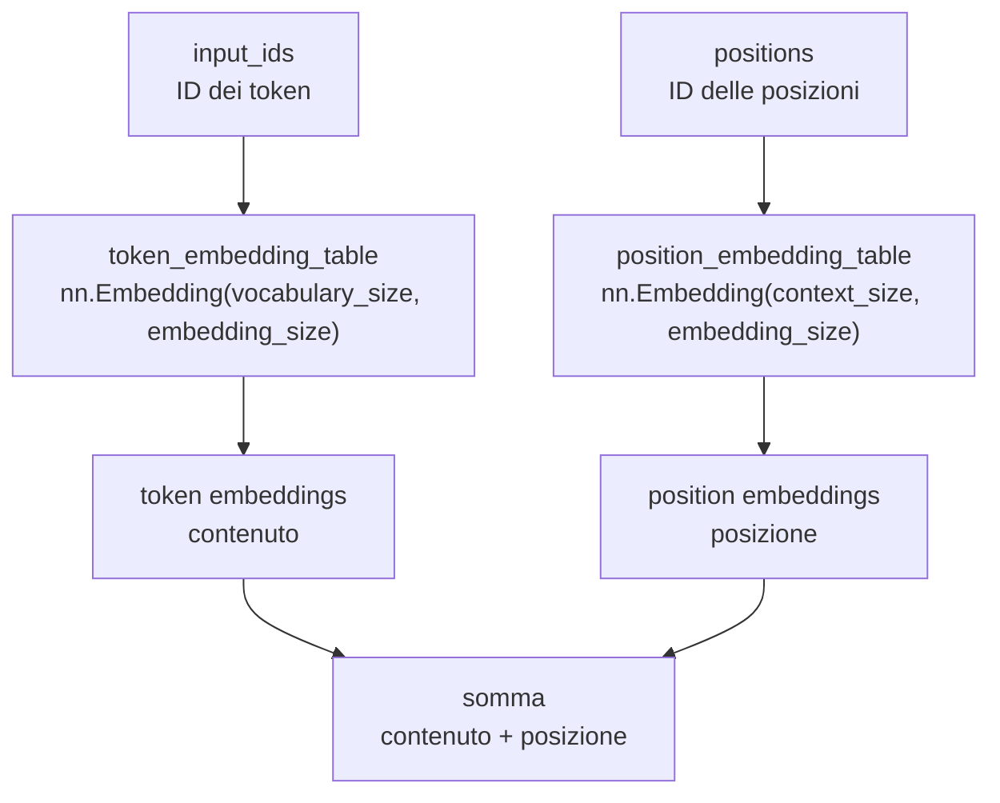

Errore comune: pensare che `nn.Embedding` significhi sempre "embedding di
parole" o "embedding di caratteri". In realtà `nn.Embedding` prende indici
interi e restituisce vettori. Nel nostro progetto usiamo lo stesso meccanismo
per due insiemi diversi di indici: token e posizioni.

### Perché possiamo sommare token embeddings e position embeddings

I token embeddings hanno forma:

```text
token_embeddings.shape = [batch_size, context_size, embedding_size]
token_embeddings.shape = [4, 8, 16]
```

I position embeddings hanno forma:

```text
position_embeddings.shape = [context_size, embedding_size]
position_embeddings.shape = [8, 16]
```

Le ultime due dimensioni sono uguali:

```text
[4, 8, 16]
    [8, 16]
```

Quindi PyTorch può applicare gli stessi position embeddings a tutti gli esempi
del batch. Questo comportamento si chiama broadcasting: PyTorch può espandere
automaticamente tensori compatibili fino ad avere forme uguali per una certa
operazione.

La somma è:

```python
embeddings = token_embeddings + position_embeddings
```

e il risultato ha forma:

```text
embeddings.shape = [4, 8, 16]
```

### Facsimile della somma

Per una singola posizione, la somma avviene numero per numero.

Esempio semplificato con vettori lunghi 4 invece che 16:

```text
token embedding:
[ 0.20, -0.10,  0.50,  0.30]

position embedding:
[ 0.70,  0.40, -0.20,  0.10]

somma:
[ 0.90,  0.30,  0.30,  0.40]
```

Nel nostro codice reale, i vettori sono lunghi 16:

```text
token embedding del primo token:
[-0.2206,  0.7118,  0.3416,  1.5886, ...,  0.3926]

position embedding della posizione 0:
[ 0.2348,  0.0886, -0.3477,  0.8491, ..., -0.0406]

somma usata dal modello:
[ 0.0143,  0.8004, -0.0061,  2.4377, ...,  0.3521]
```

La prima posizione della somma, per esempio, è:

```text
-0.2206 + 0.2348 = 0.0142 circa
```

La somma non produce ancora logits. Produce ancora un embedding lungo 16. I
logits arrivano dopo:

```python
logits = self.output_head(embeddings)
```

### Diagramma

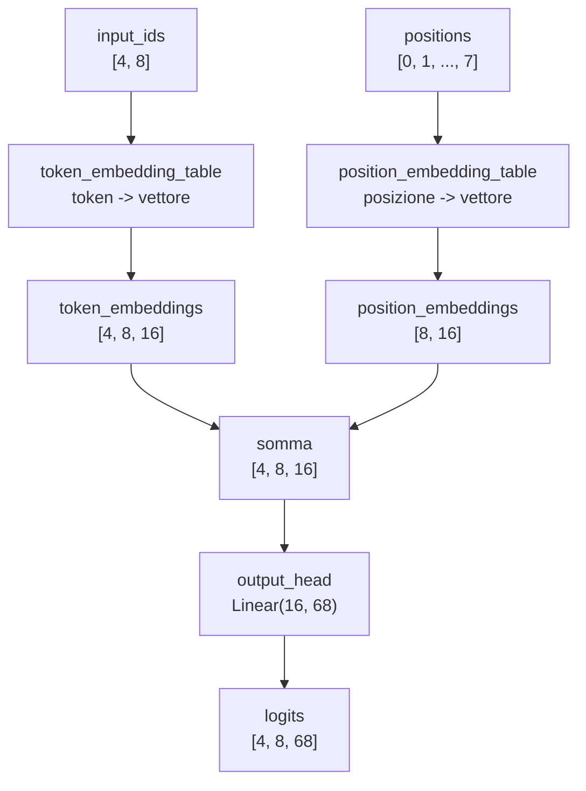

### Codice aggiunto a `study/snapshots/lesson_18/model.py`

```python
class LanguageModel(nn.Module):
    def __init__(self, vocabulary_size, context_size, embedding_size):
        super().__init__()

        self.context_size = context_size
        self.token_embedding_table = nn.Embedding(
            num_embeddings=vocabulary_size,
            embedding_dim=embedding_size,
        )
        self.position_embedding_table = nn.Embedding(
            num_embeddings=context_size,
            embedding_dim=embedding_size,
        )
        self.output_head = nn.Linear(
            in_features=embedding_size,
            out_features=vocabulary_size,
        )

    def forward(self, input_ids, target_ids=None):
        current_context_size = input_ids.shape[1]

        if current_context_size > self.context_size:
            raise ValueError(
                f"Il contesto ricevuto contiene {current_context_size} token, "
                f"ma il modello supporta al massimo {self.context_size} token."
            )

        positions = torch.arange(current_context_size, device=input_ids.device)

        token_embeddings = self.token_embedding_table(input_ids)
        position_embeddings = self.position_embedding_table(positions)
        embeddings = token_embeddings + position_embeddings
        logits = self.output_head(embeddings)

        if target_ids is None:
            return logits

        batch_size, context_size, vocabulary_size = logits.shape

        logits_flat = logits.reshape(batch_size * context_size, vocabulary_size)
        target_ids_flat = target_ids.reshape(batch_size * context_size)

        loss = F.cross_entropy(logits_flat, target_ids_flat)

        return logits, loss

    def generate(self, input_ids, max_new_tokens):
        generated_ids = input_ids

        for _ in range(max_new_tokens):
            input_ids_limited = generated_ids[:, -self.context_size :]
            logits = self(input_ids_limited)
            last_token_logits = logits[:, -1, :]
            probabilities = F.softmax(last_token_logits, dim=-1)
            next_token_ids = torch.multinomial(probabilities, num_samples=1)
            generated_ids = torch.cat((generated_ids, next_token_ids), dim=1)

        return generated_ids
```

### Spiegazione delle righe importanti

```python
self.position_embedding_table = nn.Embedding(
    num_embeddings=context_size,
    embedding_dim=embedding_size,
)
```

Crea una tabella con una riga per ogni posizione del contesto. Se il contesto è
lungo 8, le posizioni possibili sono da `0` a `7`.

```python
positions = torch.arange(context_size, device=input_ids.device)
```

Crea gli ID delle posizioni della sequenza corrente. Se la sequenza ha 8 token,
produce `0, 1, 2, 3, 4, 5, 6, 7`.

```python
position_embeddings = self.position_embedding_table(positions)
```

Trasforma gli ID delle posizioni in vettori.

```python
embeddings = token_embeddings + position_embeddings
```

Somma il vettore del token e il vettore della posizione. Il risultato ha ancora
dimensione `embedding_size`, quindi può entrare nella stessa `output_head` della
lezione precedente.

```python
input_ids_limited = generated_ids[:, -self.context_size :]
```

Durante la generazione, il testo generato diventa sempre più lungo. Il modello,
però, ha position embeddings solo fino a `context_size`. Per questo usiamo solo
gli ultimi `context_size` token quando chiediamo al modello il token successivo.

### Fonti tecniche consultate

- [PyTorch `nn.Embedding`](https://docs.pytorch.org/docs/2.12/generated/torch.nn.Embedding.html):
  supporta la forma della tabella di embedding e la relazione tra indici in
  input e vettori in output.
- [PyTorch `torch.arange`](https://docs.pytorch.org/docs/2.12/generated/torch.arange.html):
  supporta l'uso di `torch.arange(context_size)` per creare gli ID di posizione.
- [PyTorch broadcasting semantics](https://docs.pytorch.org/docs/2.12/notes/broadcasting.html):
  supporta la somma tra tensori compatibili come `[4, 8, 16]` e `[8, 16]`.
- [Attention Is All You Need](https://arxiv.org/abs/1706.03762):
  nella sezione sulle positional encodings spiega perché un Transformer deve
  aggiungere informazione di posizione agli embeddings e perché tale
  informazione deve avere la stessa dimensione degli embeddings per poter essere
  sommata.

### Conclusione

Abbiamo aggiunto il secondo tipo di embedding:

```text
token embedding    -> quale token è
position embedding -> dove si trova nel contesto
```

Il modello ora riceve:

```text
token embedding + position embedding
```

Il prossimo passo sarà iniziare a far comunicare i token tra loro. Per arrivare
a quel punto introdurremo il primo concetto di attention.

---

## Lezione 19 - Una singola head di self-attention causale

### Cosa cambia e perché

Aggiorniamo:

```text
final_project/model.py
study/snapshots/lesson_19/model.py
```

aggiungendo due nuove classi:

```python
class SelfAttentionHead(nn.Module):
class LanguageModel(nn.Module):
```

Poi creiamo:

```text
study/lessons/19_self_attention_head.py
```

Questa lezione introduce il passaggio:

```text
embeddings -> self-attention causale -> logits
```

### Differenza rispetto alla lezione 18

Nella lezione 18 avevamo:

```text
token embedding + position embedding -> output_head -> logits
```

Il modello riceveva un vettore per ogni token, ma ogni posizione veniva mandata
alla testa di output senza una trasformazione esplicita che combinasse le
informazioni dei token precedenti.

Nella lezione 19 abbiamo:

```text
token embedding + position embedding -> self-attention causale -> output_head -> logits
```

La self-attention causale calcola, per ogni posizione, quanto usare i token
precedenti e il token corrente. Non può usare token futuri.

### Perché questa lezione è importante

Fino alla lezione 18, gli embeddings contenevano:

```text
quale token è
dove si trova
```

Con la self-attention iniziamo ad aggiungere:

```text
quali token precedenti vengono usati per aggiornare la rappresentazione corrente
```

Questa è la prima parte davvero vicina al cuore di GPT. In nanoGPT questa logica
è dentro `CausalSelfAttention`. Qui la scriviamo in una versione più piccola:
una sola head, senza dropout, senza multi-head attention, senza residual
connection e senza layer normalization.

### Chiarimento extra: la lezione 19 passo passo

La lezione 19 ha due livelli:

```text
1. il file di studio `study/lessons/19_self_attention_head.py`
2. il codice riutilizzabile in `model.py`
```

Il file di studio serve per vedere le forme e stampare i passaggi intermedi.
Il file `model.py` contiene invece le classi che useremo nel progetto finale.

Il flusso completo è questo:

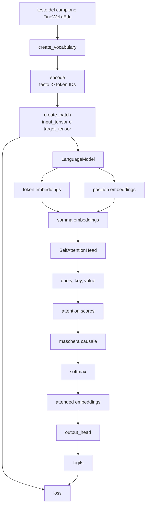

#### Passo 1: fissiamo i numeri della lezione

Nel file di studio abbiamo:

```python
CONTEXT_SIZE = 8
BATCH_SIZE = 4
EMBEDDING_SIZE = 16
HEAD_SIZE = 16
```

Questi numeri determinano le forme principali:

| Nome | Valore | Effetto |
| --- | ---: | --- |
| `BATCH_SIZE` | `4` | lavoriamo su 4 esempi insieme |
| `CONTEXT_SIZE` | `8` | ogni esempio ha 8 token |
| `EMBEDDING_SIZE` | `16` | ogni token diventa un vettore da 16 numeri |
| `HEAD_SIZE` | `16` | anche l'output della head di attention ha 16 numeri per token |

In questa lezione `HEAD_SIZE` è uguale a `EMBEDDING_SIZE`. Questo mantiene le
forme semplici:

```text
embeddings prima della attention: [4, 8, 16]
embeddings dopo la attention:    [4, 8, 16]
```

Più avanti, con più head, useremo questa idea in modo più strutturato.

#### Passo 2: leggiamo testo, vocabolario e token IDs

Queste righe preparano il testo:

```python
text = DATASET_PATH.read_text(encoding="utf-8")

char_to_id, id_to_char = create_vocabulary(text)
vocabulary_size = len(char_to_id)

token_ids = encode(text, char_to_id)
```

Il risultato è:

```text
testo                      -> stringa lunga
char_to_id             -> dizionario carattere -> ID
id_to_char             -> dizionario ID -> carattere
vocabulary_size            -> 68
numeri                     -> lista di token IDs
```

La self-attention non lavora ancora su testo leggibile. Lavora su tensori
numerici derivati dai token IDs.

#### Passo 3: creiamo input e target

Queste righe creano il batch:

```python
input_tensor, target_tensor = create_batch(
    data=training_data,
    batch_size=BATCH_SIZE,
    context_size=CONTEXT_SIZE,
)
```

Con i nostri numeri:

```text
input_tensor.shape  = [4, 8]
target_tensor.shape = [4, 8]
```

`input_tensor` contiene i token dati al modello.

`target_tensor` contiene i token corretti da prevedere. È lo stesso testo
spostato avanti di un token.

Esempio osservato:

```text
Primo esempio come testo:
'spargo\nr'
```

Il modello riceve quei token come input e deve imparare a prevedere i token
successivi.

#### Passo 4: creiamo il modello

Questa riga istanzia il modello della lezione 19:

```python
model = LanguageModel(
    vocabulary_size=vocabulary_size,
    context_size=CONTEXT_SIZE,
    embedding_size=EMBEDDING_SIZE,
    head_size=HEAD_SIZE,
)
```

Dentro il modello ci sono questi pezzi:

```text
token_embedding_table
position_embedding_table
attention_head
output_head
```

Il flusso interno della classe è:

```text
input_ids
-> token embeddings
-> position embeddings
-> somma
-> self-attention
-> output_head
-> logits
```

#### Passo 5: trasformiamo token IDs in token embeddings

Questa riga:

```python
token_embeddings = model.token_embedding_table(input_tensor)
```

trasforma:

```text
input_tensor.shape = [4, 8]
```

in:

```text
token_embeddings.shape = [4, 8, 16]
```

Significa:

```text
4 esempi
8 token per esempio
16 numeri per token
```

#### Passo 6: aggiungiamo gli embeddings di posizione

Queste righe creano le posizioni e i vettori di posizione:

```python
positions = torch.arange(CONTEXT_SIZE)
position_embeddings = model.position_embedding_table(positions)
```

Con `CONTEXT_SIZE = 8`:

```text
positions = [0, 1, 2, 3, 4, 5, 6, 7]
```

La forma è:

```text
position_embeddings.shape = [8, 16]
```

Poi sommiamo:

```python
embeddings = token_embeddings + position_embeddings
```

Risultato:

```text
embeddings.shape = [4, 8, 16]
```

Ora ogni token ha una rappresentazione che contiene:

```text
quale token è
in quale posizione si trova
```

#### Passo 7: creiamo keys, queries e values

Queste righe entrano nel primo vero passaggio di attention:

```python
keys = model.attention_head.key(embeddings)
queries = model.attention_head.query(embeddings)
values = model.attention_head.value(embeddings)
```

Dentro `SelfAttentionHead`, questi tre pezzi sono definiti così:

```python
self.key = nn.Linear(embedding_size, head_size, bias=False)
self.query = nn.Linear(embedding_size, head_size, bias=False)
self.value = nn.Linear(embedding_size, head_size, bias=False)
```

Ogni layer riceve vettori lunghi `16` e produce vettori lunghi `16`.

Quindi:

```text
embeddings.shape = [4, 8, 16]
keys.shape       = [4, 8, 16]
queries.shape    = [4, 8, 16]
values.shape     = [4, 8, 16]
```

Il punto importante è che `keys`, `queries` e `values` hanno la stessa forma,
ma non contengono la stessa informazione numerica. Tutti e tre partono dagli
stessi `embeddings`, però passano attraverso tre layer lineari separati:
`self.key`, `self.query` e `self.value`. Ogni layer ha i propri pesi allenabili.
Per questo l'output mantiene la stessa struttura `[4, 8, 16]`, ma i numeri
dentro i tensori cambiano.

Quindi:

```text
stessa forma        -> stessa organizzazione: 4 esempi, 8 token, 16 numeri
trasformazione diversa -> pesi diversi, numeri prodotti diversi
```

Questo serve perché nella self-attention i tre tensori hanno ruoli diversi:
`queries` e `keys` servono per calcolare i pesi di attention, mentre `values`
contiene i vettori che verranno combinati usando quei pesi.

#### Passo 8: calcoliamo gli attention scores

Questa riga confronta le queries con le keys:

```python
attention_scores = queries @ keys.transpose(-2, -1)
```

Prima della trasposizione:

```text
keys.shape = [4, 8, 16]
```

Dopo:

```text
keys.transpose(-2, -1).shape = [4, 16, 8]
```

`transpose(-2, -1)` scambia tra loro le ultime due dimensioni del tensore.

Nel nostro caso:

```text
keys.shape = [4, 8, 16]
              |  |  |
              |  |  +-- dimensione -1: i 16 numeri di ogni key
              |  +----- dimensione -2: gli 8 token del contesto
              +-------- dimensione 0: i 4 esempi del batch
```

Gli indici negativi si leggono partendo da destra:

```text
dimensione -1 -> ultima dimensione     -> 16
dimensione -2 -> penultima dimensione  -> 8
```

Quindi:

```python
keys.transpose(-2, -1)
```

fa questo scambio:

```text
[4, 8, 16]
    |  |
    |  +-- diventa penultima dimensione
    +----- diventa ultima dimensione

risultato:
[4, 16, 8]
```

La prima dimensione, cioè `4`, non cambia. Rimane il numero di esempi del batch.

Quello che cambia è come sono orientati gli ultimi due assi:

```text
prima:
per ogni esempio abbiamo 8 token, ognuno con 16 numeri

dopo:
per ogni esempio abbiamo 16 righe numeriche, ognuna lunga 8 posizioni
```

Questo serve perché vogliamo moltiplicare le `queries` per le `keys` e ottenere
una matrice che confronta ogni token con ogni altro token.

Quindi:

```text
queries.shape                 = [4, 8, 16]
keys.transpose(-2, -1).shape  = [4, 16, 8]
attention_scores.shape        = [4, 8, 8]
```

Il `16` interno sparisce perché è la dimensione usata per fare il prodotto tra
vettori. Rimane una matrice `8 x 8` per ogni esempio.

Lettura di `attention_scores[0]`:

```text
prima dimensione: esempio 0 del batch
righe: token che sta cercando informazione
colonne: token da cui può prendere informazione
```

#### Passo 9: scaliamo i punteggi

Subito dopo facciamo:

```python
attention_scores = attention_scores / (HEAD_SIZE ** 0.5)
```

Nel codice riutilizzabile usiamo la stessa idea così:

```python
attention_scores = attention_scores / math.sqrt(keys.shape[-1])
```

Dato che `HEAD_SIZE = 16`:

```text
HEAD_SIZE ** 0.5 = 4
```

Quindi dividiamo i punteggi per `4`.

Questa scalatura è parte della scaled dot-product attention.

La scaled dot-product attention è il calcolo che confronta `queries` e `keys`,
riduce la scala dei punteggi con `sqrt(head_size)`, applica `softmax` e usa i
pesi ottenuti per combinare i `values`.

Il motivo pratico è questo: `attention_scores` contiene punteggi che poi
passano dentro `softmax`. La `softmax` trasforma una lista di punteggi in pesi
che sommano a `1`.

Se i punteggi sono molto distanti tra loro, la `softmax` può diventare troppo
sbilanciata. Un punteggio prende quasi tutto il peso e gli altri diventano quasi
zero.

Esempio senza scalatura:

```text
punteggi:
[1, 2, 12]

softmax circa:
[0.000, 0.000, 1.000]
```

In questo caso il valore `12` domina quasi completamente. La riga di attention
usa praticamente solo una posizione.

Esempio con punteggi ridotti:

```text
punteggi:
[0.25, 0.50, 3.00]

softmax circa:
[0.055, 0.070, 0.875]
```

Il punteggio più alto resta il più importante, ma gli altri non vengono
azzerati quasi del tutto.

Nel nostro codice la riduzione è:

```python
attention_scores = attention_scores / math.sqrt(keys.shape[-1])
```

`keys.shape[-1]` è la lunghezza dei vettori key. In questa lezione vale `16`.
Quindi:

```text
sqrt(16) = 4
```

Dividendo per `4`, i punteggi entrano nella `softmax` con valori meno estremi.
Questo rende i pesi di attention meno aggressivi all'inizio e rende il calcolo
più stabile durante l'allenamento.

Il punto da ricordare è:

```text
queries @ keys.T        -> produce punteggi grezzi
/ sqrt(head_size)       -> riduce la scala dei punteggi
softmax                 -> trasforma i punteggi in pesi
```

#### Passo 10: applichiamo la maschera causale

La maschera causale è salvata nel modello:

```python
self.register_buffer(
    "causal_mask",
    torch.tril(torch.ones(context_size, context_size)),
)
```

Con `context_size = 8`, la maschera è:

```text
[
  [1, 0, 0, 0, 0, 0, 0, 0],
  [1, 1, 0, 0, 0, 0, 0, 0],
  [1, 1, 1, 0, 0, 0, 0, 0],
  [1, 1, 1, 1, 0, 0, 0, 0],
  [1, 1, 1, 1, 1, 0, 0, 0],
  [1, 1, 1, 1, 1, 1, 0, 0],
  [1, 1, 1, 1, 1, 1, 1, 0],
  [1, 1, 1, 1, 1, 1, 1, 1],
]
```

La riga `0` può usare solo la colonna `0`.

La riga `1` può usare le colonne `0` e `1`.

La riga `2` può usare le colonne `0`, `1`, `2`.

Questo impedisce al modello di leggere token futuri.

Nel file di studio:

```python
masked_attention_scores = attention_scores.masked_fill(
    causal_mask == 0,
    float("-inf"),
)
```

Tutte le celle future diventano `-inf`.

#### Passo 11: trasformiamo i punteggi in pesi

Ora applichiamo:

```python
attention_weights = F.softmax(masked_attention_scores, dim=-1)
```

`dim=-1` indica l'ultima dimensione, cioè le colonne.

Quindi ogni riga della matrice `8 x 8` diventa una lista di pesi che sommano a
`1`.

Esempio osservato:

```text
riga 3:
[0.204, 0.217, 0.313, 0.266, 0.000, 0.000, 0.000, 0.000]
```

Significa:

```text
la posizione 3 usa le posizioni 0, 1, 2, 3
la posizione 3 non usa le posizioni 4, 5, 6, 7
```

Il file stampa anche:

```text
Somma di ogni riga degli attention weights:
[1, 1, 1, 1, 1, 1, 1, 1]
```

Questo conferma che ogni riga è una distribuzione di pesi.

#### Passo 12: combiniamo i values

Ora facciamo:

```python
attended_embeddings = attention_weights @ values
```

Le forme sono:

```text
attention_weights.shape = [4, 8, 8]
values.shape            = [4, 8, 16]
attended_embeddings     = [4, 8, 16]
```

L'ultimo `8` di `attention_weights` indica quali posizioni usare.

Il secondo `8` di `values` indica i value vectors disponibili.

Il risultato torna a un vettore da `16` numeri per ogni token:

```text
[4, 8, 16]
```

La differenza rispetto a prima è che questi vettori sono stati aggiornati usando
i pesi della self-attention.

#### Passo 13: produciamo i logits

Dentro il modello, dopo la attention, facciamo:

```python
logits = self.output_head(attended_embeddings)
```

La `output_head` è:

```python
self.output_head = nn.Linear(
    in_features=head_size,
    out_features=vocabulary_size,
)
```

Con:

```text
head_size = 16
vocabulary_size = 68
```

la forma passa da:

```text
attended_embeddings.shape = [4, 8, 16]
```

a:

```text
logits.shape = [4, 8, 68]
```

Per ogni token di ogni esempio, il modello produce 68 punteggi: uno per ogni
token possibile del vocabolario.

#### Passo 14: calcoliamo la loss

Quando passiamo anche `target_tensor`, il modello calcola:

```python
loss = F.cross_entropy(logits_flat, target_ids_flat)
```

Prima però appiattisce:

```text
logits.shape        = [4, 8, 68]
logits_flat.shape   = [32, 68]

target_tensor.shape = [4, 8]
target_flat.shape   = [32]
```

Il numero `32` viene da:

```text
4 esempi x 8 token = 32 previsioni
```

Qui ogni previsione corrisponde a una posizione precisa dentro il batch.

Con:

```text
batch_size   = 4
context_size = 8
```

abbiamo:

```text
esempio 0: 8 posizioni da prevedere
esempio 1: 8 posizioni da prevedere
esempio 2: 8 posizioni da prevedere
esempio 3: 8 posizioni da prevedere

totale = 4 * 8 = 32 posizioni da prevedere
```

Per ciascuna di queste 32 posizioni, il modello produce un vettore lungo `68`:

```text
una posizione -> 68 logits
```

Ogni logit è un punteggio grezzo per un token del vocabolario.

Esempio di struttura prima dell'appiattimento:

```text
logits.shape = [4, 8, 68]

[
  esempio 0 [
    posizione 0 -> 68 logits,
    posizione 1 -> 68 logits,
    ...
    posizione 7 -> 68 logits
  ],
  esempio 1 [
    posizione 0 -> 68 logits,
    ...
    posizione 7 -> 68 logits
  ],
  ...
]
```

Il `target_tensor`, invece, contiene un solo numero corretto per ogni posizione:

```text
target_tensor.shape = [4, 8]

[
  esempio 0 [target_0, target_1, ..., target_7],
  esempio 1 [target_0, target_1, ..., target_7],
  esempio 2 [target_0, target_1, ..., target_7],
  esempio 3 [target_0, target_1, ..., target_7]
]
```

Quindi il confronto reale è:

```text
68 logits della posizione 0  -> target corretto della posizione 0
68 logits della posizione 1  -> target corretto della posizione 1
68 logits della posizione 2  -> target corretto della posizione 2
...
68 logits della posizione 31 -> target corretto della posizione 31
```

`F.cross_entropy` vuole ricevere questi dati in forma più diretta:

```text
logits_flat.shape = [32, 68]
target_flat.shape = [32]
```

Il significato è:

```text
32 righe di previsione
68 punteggi per ogni riga
32 target corretti, uno per ogni riga
```

Facsimile:

```text
logits_flat
[
  riga 0 -> [68 punteggi per il prossimo token],
  riga 1 -> [68 punteggi per il prossimo token],
  riga 2 -> [68 punteggi per il prossimo token],
  ...
  riga 31 -> [68 punteggi per il prossimo token]
]

target_flat
[
  target corretto della riga 0,
  target corretto della riga 1,
  target corretto della riga 2,
  ...
  target corretto della riga 31
]
```

Se alla riga `0` il target corretto è il token con ID `12`, allora la loss
controlla se, tra i 68 logits della riga `0`, il punteggio del token `12` è
abbastanza alto rispetto agli altri punteggi.

La stessa cosa viene fatta per tutte le 32 righe.

Per impostazione predefinita, `F.cross_entropy` restituisce un solo numero:
la media dell'errore sulle 32 previsioni.

Quindi, in questa lezione, la loss non misura un solo token. Misura l'errore
medio di tutte le previsioni contenute nel batch.

Nota importante: passiamo a `F.cross_entropy` i logits grezzi, non le
probabilità. La funzione calcola internamente la trasformazione necessaria per
confrontare quei punteggi con il target corretto.

#### Vista unica delle trasformazioni

Questa tabella riassume tutto il percorso della lezione 19.

| Passaggio | Oggetto | Forma | Operazione | Perché serve |
| --- | --- | --- | --- | --- |
| 1 | `input_tensor` | `[4, 8]` | batch di token IDs | dà al modello 4 esempi, ognuno lungo 8 token |
| 2 | `target_tensor` | `[4, 8]` | input spostato avanti di 1 token | contiene le risposte corrette da confrontare con i logits |
| 3 | `token_embeddings` | `[4, 8, 16]` | `token_embedding_table(input_tensor)` | trasforma ogni ID discreto in un vettore allenabile |
| 4 | `positions` | `[8]` | `torch.arange(8)` | crea gli ID delle posizioni dentro il contesto |
| 5 | `position_embeddings` | `[8, 16]` | `position_embedding_table(positions)` | dà un vettore allenabile a ogni posizione |
| 6 | `embeddings` | `[4, 8, 16]` | `token_embeddings + position_embeddings` | combina informazione sul token e informazione sulla posizione |
| 7 | `queries` | `[4, 8, 16]` | `query(embeddings)` | crea i vettori che faranno il confronto |
| 8 | `keys` | `[4, 8, 16]` | `key(embeddings)` | crea i vettori contro cui confrontare le queries |
| 9 | `values` | `[4, 8, 16]` | `value(embeddings)` | crea i vettori che verranno combinati |
| 10 | `keys.transpose(-2, -1)` | `[4, 16, 8]` | scambio delle ultime due dimensioni | prepara le keys per la moltiplicazione con le queries |
| 11 | `attention_scores` | `[4, 8, 8]` | `queries @ keys.transpose(-2, -1)` | calcola quanto ogni posizione guarda ogni altra posizione |
| 12 | `attention_scores` scalati | `[4, 8, 8]` | divisione per `sqrt(16)` | mantiene i punteggi in una scala più gestibile prima della softmax |
| 13 | `masked_attention_scores` | `[4, 8, 8]` | `masked_fill(..., -inf)` | blocca le posizioni future |
| 14 | `attention_weights` | `[4, 8, 8]` | `softmax(..., dim=-1)` | trasforma ogni riga in pesi che sommano a `1` |
| 15 | `attended_embeddings` | `[4, 8, 16]` | `attention_weights @ values` | combina i value vectors usando i pesi della attention |
| 16 | `logits` | `[4, 8, 68]` | `output_head(attended_embeddings)` | produce un punteggio per ogni token possibile |
| 17 | `logits_flat` | `[32, 68]` | `reshape(4 * 8, 68)` | prepara i logits per `cross_entropy` |
| 18 | `target_ids_flat` | `[32]` | `reshape(4 * 8)` | prepara i target per `cross_entropy` |
| 19 | `loss` | singolo numero | `F.cross_entropy(...)` | misura l'errore medio sulle 32 previsioni |

La trasformazione più importante da capire è questa:

```text
[4, 8, 16] -> [4, 8, 8] -> [4, 8, 16]
```

Significa:

```text
1. partiamo da un vettore da 16 numeri per ogni token;
2. creiamo una matrice 8 x 8 che dice quali posizioni usare;
3. usiamo quella matrice per ricostruire un nuovo vettore da 16 numeri per ogni token.
```

Quindi la self-attention non cambia il numero di token nel batch. Cambia il
contenuto dei vettori che rappresentano quei token.

#### Perché nello script rifacciamo i passaggi a mano?

Nel file `study/lessons/19_self_attention_head.py` facciamo manualmente:

```python
keys = model.attention_head.key(embeddings)
queries = model.attention_head.query(embeddings)
values = model.attention_head.value(embeddings)
attention_scores = queries @ keys.transpose(-2, -1)
...
```

Poi facciamo anche:

```python
logits, loss = model(input_tensor, target_tensor)
```

Questo significa che una parte del calcolo viene mostrata esplicitamente nello
script, ma il modello la rifà dentro `forward`.

Lo facciamo per scopo didattico:

```text
script di studio -> mostra le forme intermedie
model.forward    -> contiene il flusso reale del modello
```

Più avanti, quando il meccanismo sarà chiaro, useremo soprattutto il modello e
non stamperemo ogni tensore intermedio.

### Query, key e value

Partiamo dagli embeddings:

```text
embeddings.shape = [4, 8, 16]
```

Ogni embedding lungo `16` viene trasformato da tre layer lineari:

```python
self.key = nn.Linear(embedding_size, head_size, bias=False)
self.query = nn.Linear(embedding_size, head_size, bias=False)
self.value = nn.Linear(embedding_size, head_size, bias=False)
```

Con:

```text
embedding_size = 16
head_size = 16
```

otteniamo:

```text
keys.shape    = [4, 8, 16]
queries.shape = [4, 8, 16]
values.shape  = [4, 8, 16]
```

I tre tensori hanno la stessa forma, ma non hanno lo stesso ruolo:

| Tensore | Come viene usato |
| --- | --- |
| `queries` | viene confrontato con le `keys` per calcolare i punteggi di attention |
| `keys` | viene confrontato con le `queries` |
| `values` | contiene i vettori che vengono combinati usando i pesi di attention |

Non sono tre copie uguali degli embeddings. Sono tre trasformazioni allenabili
diverse degli stessi embeddings.

### La forma `[4, 8, 8]`

La prima moltiplicazione importante è:

```python
attention_scores = queries @ keys.transpose(-2, -1)
```

Partiamo da:

```text
queries.shape = [4, 8, 16]
keys.shape    = [4, 8, 16]
```

`keys.transpose(-2, -1)` scambia le ultime due dimensioni:

```text
keys.transpose(-2, -1).shape = [4, 16, 8]
```

Quindi la moltiplicazione è:

```text
[4, 8, 16] @ [4, 16, 8] -> [4, 8, 8]
```

La prima dimensione, `4`, resta separata: indica che la stessa operazione viene
fatta per ognuno dei 4 esempi del batch.

Per un singolo esempio del batch, la moltiplicazione reale è:

```text
[8, 16] @ [16, 8] -> [8, 8]
```

Per vedere il calcolo con numeri leggibili, usiamo un facsimile più piccolo.

`queries[0]`, con shape `[2, 3]`:

| Riga | Colonna 0 | Colonna 1 | Colonna 2 |
| --- | ---: | ---: | ---: |
| 0 | 1 | 2 | 3 |
| 1 | 4 | 5 | 6 |

`keys_transposed[0]`, con shape `[3, 2]`:

| Riga | Colonna 0 | Colonna 1 |
| --- | ---: | ---: |
| 0 | 10 | 11 |
| 1 | 20 | 21 |
| 2 | 30 | 31 |

La moltiplicazione è:

```text
[2, 3] @ [3, 2] -> [2, 2]
```

Ogni cella del risultato nasce da una riga della prima matrice e una colonna
della seconda matrice:

| Cella risultato | Calcolo | Valore |
| --- | --- | ---: |
| riga 0, colonna 0 | `1*10 + 2*20 + 3*30` | 140 |
| riga 0, colonna 1 | `1*11 + 2*21 + 3*31` | 146 |
| riga 1, colonna 0 | `4*10 + 5*20 + 6*30` | 320 |
| riga 1, colonna 1 | `4*11 + 5*21 + 6*31` | 335 |

Quindi la matrice finale è:

```text
[
  [140, 146],
  [320, 335]
]
```

Il primo numero, `140`, nasce dalla riga `0` di `queries[0]` moltiplicata per
la colonna `0` di `keys_transposed[0]`:

```text
[1, 2, 3] · [10, 20, 30] = 1*10 + 2*20 + 3*30 = 140
```

Nel caso reale della lezione, la stessa regola usa vettori lunghi `16`:

```text
una riga di queries[0] lunga 16
@
una colonna di keys_transposed[0] lunga 16
=
un singolo numero dentro attention_scores[0]
```

Ripetendo questo confronto per tutte le 8 righe di `queries[0]` e tutte le 8
colonne di `keys_transposed[0]`, otteniamo:

```text
attention_scores[0].shape = [8, 8]
```

Questa nuova shape si legge così:

```text
[4, 8, 8]
 |  |  |
 |  |  +-- 8 posizioni confrontate
 |  +----- 8 posizioni che fanno il confronto
 +-------- 4 esempi nel batch
```

Per ogni esempio del batch, abbiamo una matrice `8 x 8`.

```text
attention_scores[0].shape = [8, 8]
```

Riga e colonna hanno significati diversi:

```text
riga    -> posizione che sta producendo il nuovo embedding
colonna -> posizione che può essere usata come informazione
```

Con `context_size = 8`, la matrice ha questa struttura:

```text
          colonna:  0  1  2  3  4  5  6  7
riga 0             x  x  x  x  x  x  x  x
riga 1             x  x  x  x  x  x  x  x
riga 2             x  x  x  x  x  x  x  x
riga 3             x  x  x  x  x  x  x  x
riga 4             x  x  x  x  x  x  x  x
riga 5             x  x  x  x  x  x  x  x
riga 6             x  x  x  x  x  x  x  x
riga 7             x  x  x  x  x  x  x  x
```

Prima della maschera, ogni posizione ha un punteggio verso ogni altra posizione.

### Perché serve la maschera causale

Nel training, il target è il token successivo. Se la posizione `2` potesse usare
la posizione `3`, starebbe usando un token futuro. Questo non va bene per un
modello generativo autoregressivo.

Per questo creiamo:

```python
torch.tril(torch.ones(context_size, context_size))
```

Con `context_size = 8`, la maschera è:

```text
[
  [1, 0, 0, 0, 0, 0, 0, 0],
  [1, 1, 0, 0, 0, 0, 0, 0],
  [1, 1, 1, 0, 0, 0, 0, 0],
  [1, 1, 1, 1, 0, 0, 0, 0],
  [1, 1, 1, 1, 1, 0, 0, 0],
  [1, 1, 1, 1, 1, 1, 0, 0],
  [1, 1, 1, 1, 1, 1, 1, 0],
  [1, 1, 1, 1, 1, 1, 1, 1],
]
```

Le celle con `1` sono ammesse. Le celle con `0` sono posizioni future da
bloccare.

Nel codice:

```python
attention_scores = attention_scores.masked_fill(
    causal_mask == 0,
    float("-inf"),
)
```

mettiamo `-inf` nei punteggi vietati. Dopo `softmax`, quelle posizioni
diventano probabilità `0`.

### Da punteggi a pesi

Dopo la maschera applichiamo:

```python
attention_weights = F.softmax(attention_scores, dim=-1)
```

`dim=-1` significa: applica `softmax` sull'ultima dimensione. Nel nostro caso
l'ultima dimensione sono le colonne della matrice `8 x 8`.

Quindi ogni riga diventa una distribuzione di probabilità:

```text
somma della riga = 1
```

Esempio osservato:

```text
attention_weights[0][3] =
[0.204, 0.217, 0.313, 0.266, 0.000, 0.000, 0.000, 0.000]
```

La riga `3` può usare solo le colonne `0`, `1`, `2`, `3`. Le colonne future
`4`, `5`, `6`, `7` valgono `0`.

### Da pesi a nuovi embeddings

L'ultima moltiplicazione della self-attention è:

```python
attended_embeddings = attention_weights @ values
```

Le forme sono:

```text
attention_weights.shape = [4, 8, 8]
values.shape            = [4, 8, 16]

[4, 8, 8] @ [4, 8, 16] -> [4, 8, 16]
```

La forma finale torna a:

```text
attended_embeddings.shape = [4, 8, 16]
```

Il numero finale `16` resta `head_size`. In questa lezione `head_size` è uguale
a `embedding_size`, quindi la forma finale è ancora `[4, 8, 16]`.

In generale non deve essere sempre così. `head_size` può essere diverso da
`embedding_size`.

In questa lezione abbiamo scelto:

```text
embedding_size = 16
head_size      = 16
```

per rendere il primo esempio più semplice: la head riceve vettori lunghi `16` e
restituisce vettori lunghi `16`.

Potremmo però scegliere:

```text
embedding_size = 16
head_size      = 8
```

In quel caso le forme diventerebbero:

```text
embeddings.shape          = [4, 8, 16]
queries.shape             = [4, 8, 8]
keys.shape                = [4, 8, 8]
values.shape              = [4, 8, 8]
attention_weights.shape   = [4, 8, 8]
attended_embeddings.shape = [4, 8, 8]
```

La parte finale sarebbe `8` perché l'output della head usa `head_size`, non
automaticamente `embedding_size`.

Con `head_size = 8`, anche `output_head` dovrebbe ricevere vettori lunghi `8`:

```python
self.output_head = nn.Linear(
    in_features=head_size,
    out_features=vocabulary_size,
)
```

Quindi il passaggio finale sarebbe:

```text
[4, 8, 8] -> output_head -> [4, 8, 68]
```

Questo passaggio significa:

```text
4  esempi nel batch
8  posizioni per ogni esempio
8  numeri interni per ogni posizione
```

`output_head` non modifica le prime due dimensioni. Lavora sull'ultima
dimensione. Per ogni posizione prende il vettore lungo `8` e lo trasforma in un
vettore lungo `68`.

La documentazione di PyTorch descrive `nn.Linear` così: l'input ha forma
`[..., in_features]` e l'output ha forma `[..., out_features]`. Le dimensioni
prima dell'ultima restano uguali.

Nel nostro caso ipotetico:

```text
in_features  = head_size = 8
out_features = vocabulary_size = 68
```

Quindi:

```text
[4, 8, 8]
     |
     +-- questa ultima dimensione entra in output_head

output_head: Linear(8 -> 68)

[4, 8, 68]
      |
      +-- questa ultima dimensione contiene i logits sul vocabolario
```

Internamente `output_head` avrebbe:

```text
output_head.weight.shape = [68, 8]
output_head.bias.shape   = [68]
```

Per ogni posizione, il vettore lungo `8` viene confrontato con 68 righe di pesi.
Ogni riga produce un logit:

```text
vettore_interno = [8 numeri]

logit_token_0  = somma pesata degli 8 numeri + bias_0
logit_token_1  = somma pesata degli 8 numeri + bias_1
logit_token_2  = somma pesata degli 8 numeri + bias_2
...
logit_token_67 = somma pesata degli 8 numeri + bias_67
```

Alla fine otteniamo:

```text
[68 logits]
```

per ogni posizione del batch.

Questi `68` valori non sono ancora probabilità e non sono ancora caratteri.
Sono punteggi grezzi. Durante il training vengono usati da `cross_entropy`.
Durante la generazione vengono prima trasformati con `softmax`.

Nel Transformer completo useremo più head. In quel caso ogni head produrrà una
parte più piccola della rappresentazione interna. Quelle parti verranno
concatenate per tornare alla dimensione complessiva del modello.

Questa concatenazione non produce ancora i logits sul vocabolario. Produce una
nuova rappresentazione interna. Solo una `output_head` finale trasforma la
rappresentazione interna in `vocabulary_size` logits.

Esempio futuro:

```text
embedding_size = 16
num_heads      = 4
head_size      = 4

4 head * 4 numeri = 16 numeri finali
```

Il flusso futuro sarà quindi:

```text
head 0 -> [4, 8, 4]
head 1 -> [4, 8, 4]
head 2 -> [4, 8, 4]
head 3 -> [4, 8, 4]

concatenazione -> [4, 8, 16]

output_head: Linear(16 -> 68)

logits -> [4, 8, 68]
```

Quindi:

- in una singola head, `head_size` può essere uguale o diverso da
  `embedding_size`;
- nella lezione 19 li teniamo uguali per semplicità;
- con multi-head attention, useremo più head più piccole che insieme tornano
  alla dimensione del modello;
- più avanti, quando introdurremo le residual connections, dovremo fare
  attenzione a riportare l'output alla dimensione giusta, perché una somma tra
  tensori richiede forme compatibili.

### Diagramma

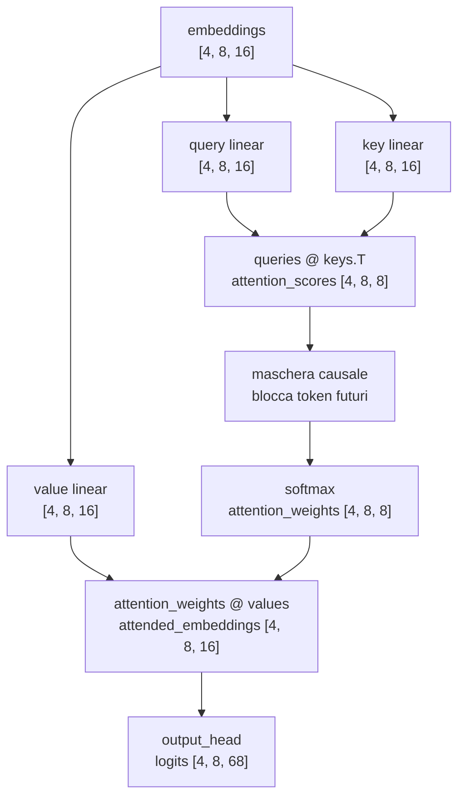

### Codice aggiunto a `model.py`

In alto al file aggiungiamo anche:

```python
import math
```

```python
class SelfAttentionHead(nn.Module):
    def __init__(self, embedding_size, head_size, context_size):
        super().__init__()

        self.key = nn.Linear(embedding_size, head_size, bias=False)
        self.query = nn.Linear(embedding_size, head_size, bias=False)
        self.value = nn.Linear(embedding_size, head_size, bias=False)
        self.register_buffer(
            "causal_mask",
            torch.tril(torch.ones(context_size, context_size)),
        )

    def forward(self, embeddings):
        current_context_size = embeddings.shape[1]

        keys = self.key(embeddings)
        queries = self.query(embeddings)
        values = self.value(embeddings)

        attention_scores = queries @ keys.transpose(-2, -1)
        attention_scores = attention_scores / math.sqrt(keys.shape[-1])

        causal_mask = self.causal_mask[:current_context_size, :current_context_size]
        attention_scores = attention_scores.masked_fill(
            causal_mask == 0,
            float("-inf"),
        )

        attention_weights = F.softmax(attention_scores, dim=-1)
        attended_embeddings = attention_weights @ values

        return attended_embeddings, attention_weights
```

```python
class LanguageModel(nn.Module):
    def __init__(self, vocabulary_size, context_size, embedding_size, head_size):
        super().__init__()

        self.context_size = context_size
        self.token_embedding_table = nn.Embedding(
            num_embeddings=vocabulary_size,
            embedding_dim=embedding_size,
        )
        self.position_embedding_table = nn.Embedding(
            num_embeddings=context_size,
            embedding_dim=embedding_size,
        )
        self.attention_head = SelfAttentionHead(
            embedding_size=embedding_size,
            head_size=head_size,
            context_size=context_size,
        )
        self.output_head = nn.Linear(
            in_features=head_size,
            out_features=vocabulary_size,
        )

    def forward(self, input_ids, target_ids=None):
        current_context_size = input_ids.shape[1]

        if current_context_size > self.context_size:
            raise ValueError(
                f"Il contesto ricevuto contiene {current_context_size} token, "
                f"ma il modello supporta al massimo {self.context_size} token."
            )

        positions = torch.arange(current_context_size, device=input_ids.device)

        token_embeddings = self.token_embedding_table(input_ids)
        position_embeddings = self.position_embedding_table(positions)
        embeddings = token_embeddings + position_embeddings
        attended_embeddings, _ = self.attention_head(embeddings)
        logits = self.output_head(attended_embeddings)

        if target_ids is None:
            return logits

        batch_size, context_size, vocabulary_size = logits.shape

        logits_flat = logits.reshape(batch_size * context_size, vocabulary_size)
        target_ids_flat = target_ids.reshape(batch_size * context_size)

        loss = F.cross_entropy(logits_flat, target_ids_flat)

        return logits, loss

    def generate(self, input_ids, max_new_tokens):
        generated_ids = input_ids

        for _ in range(max_new_tokens):
            input_ids_limited = generated_ids[:, -self.context_size :]
            logits = self(input_ids_limited)
            last_token_logits = logits[:, -1, :]
            probabilities = F.softmax(last_token_logits, dim=-1)
            next_token_ids = torch.multinomial(probabilities, num_samples=1)
            generated_ids = torch.cat((generated_ids, next_token_ids), dim=1)

        return generated_ids
```

### Spiegazione delle righe importanti

```python
self.register_buffer(
    "causal_mask",
    torch.tril(torch.ones(context_size, context_size)),
)
```

Registra la maschera causale dentro il modulo. `register_buffer` la salva insieme
al modello, ma non la tratta come parametro allenabile.

```python
attention_scores = queries @ keys.transpose(-2, -1)
```

Confronta ogni query con tutte le key dello stesso esempio. Produce una matrice
`context_size x context_size` per ogni esempio del batch.

```python
attention_scores = attention_scores / math.sqrt(keys.shape[-1])
```

Divide i punteggi per la radice della dimensione della key. Questa è la
scalatura usata nella scaled dot-product attention.

```python
attention_scores = attention_scores.masked_fill(
    causal_mask == 0,
    float("-inf"),
)
```

Blocca le posizioni future.

```python
attention_weights = F.softmax(attention_scores, dim=-1)
```

Trasforma i punteggi in pesi. Ogni riga somma a `1`.

```python
attended_embeddings = attention_weights @ values
```

Combina i value vectors usando i pesi calcolati dalla attention.

### Fonti tecniche consultate

- `nanoGPT/model.py` nel repository locale: mostra la struttura reale di
  `CausalSelfAttention`, con query, key, value, maschera causale, softmax e
  prodotto con i values.
- [Attention Is All You Need](https://arxiv.org/abs/1706.03762):
  supporta la formula della scaled dot-product attention
  `softmax(QK^T / sqrt(d_k))V`.
- [PyTorch `torch.tril`](https://docs.pytorch.org/docs/2.12/generated/torch.tril.html):
  supporta la creazione della parte triangolare inferiore della maschera.
- [PyTorch `Tensor.masked_fill`](https://docs.pytorch.org/docs/2.12/generated/torch.Tensor.masked_fill.html):
  supporta la sostituzione dei valori vietati prima della softmax.
- [PyTorch `torch.nn.functional.softmax`](https://docs.pytorch.org/docs/2.12/generated/torch.nn.functional.softmax.html):
  supporta la trasformazione dei punteggi in valori tra `0` e `1` che sommano a
  `1` lungo la dimensione scelta.
- [PyTorch `nn.Linear`](https://docs.pytorch.org/docs/2.12/generated/torch.nn.Linear.html):
  supporta il comportamento di `output_head`, dove tutte le dimensioni prima
  dell'ultima restano uguali e l'ultima passa da `in_features` a
  `out_features`.

### Conclusione

Abbiamo aggiunto il primo meccanismo che fa interagire i token tra loro:

```text
self-attention causale
```

Il modello ora segue questo flusso:

```text
token IDs
-> token embeddings + position embeddings
-> query, key, value
-> attention scores
-> causal mask
-> attention weights
-> attended embeddings
-> logits
```

Il prossimo passo sarà passare da una sola head a più head in parallelo.

## Lezione 20 - Multi-head attention

### Obiettivo

In questa lezione passiamo da una sola head di self-attention a più head in
parallelo.

La lezione 19 usava:

```text
1 head
head_size = 16
output della attention = [4, 8, 16]
```

La lezione 20 usa:

```text
4 head
head_size = 4
output di ogni head = [4, 8, 4]
concatenazione = [4, 8, 16]
```

La forma finale prima di `output_head` resta `[4, 8, 16]`, ma adesso quei 16
numeri arrivano da 4 head diverse.

### Cosa cambia rispetto alla lezione 19

Nella lezione 19 avevamo questa sequenza:

```text
embeddings [4, 8, 16]
-> una SelfAttentionHead
-> attended_embeddings [4, 8, 16]
-> output_head
-> logits [4, 8, 68]
```

Nella lezione 20 abbiamo questa sequenza:

```text
embeddings [4, 8, 16]
-> head 0 [4, 8, 4]
-> head 1 [4, 8, 4]
-> head 2 [4, 8, 4]
-> head 3 [4, 8, 4]
-> concatenazione [4, 8, 16]
-> output_head
-> logits [4, 8, 68]
```

La differenza principale è che non chiediamo più a una sola head di produrre
tutta la rappresentazione. Dividiamo il lavoro in più head piccole e poi
rimettiamo insieme i risultati.

### File modificati o creati

File modificati:

```text
LearnGPT/final_project/model.py
LearnGPT/course_it.md
```

File creati:

```text
LearnGPT/study/snapshots/lesson_20/
LearnGPT/study/lessons/20_multi_head_attention.py
```

Lo script della lezione importa dallo snapshot:

```python
from study.snapshots.lesson_20.model import LanguageModel
```

Questo mantiene la lezione 20 stabile anche quando `final_project` cambierà
nelle lezioni successive.

### Nuovi valori della lezione

Usiamo questi valori:

```python
CONTEXT_SIZE = 8
BATCH_SIZE = 4
EMBEDDING_SIZE = 16
NUM_HEADS = 4
HEAD_SIZE = EMBEDDING_SIZE // NUM_HEADS
```

Il calcolo di `HEAD_SIZE` è:

```text
16 // 4 = 4
```

Quindi ogni head produce 4 numeri per ogni token.

La relazione importante è:

```text
NUM_HEADS * HEAD_SIZE = EMBEDDING_SIZE
4 * 4 = 16
```

In questa versione didattica imponiamo questa relazione per ottenere:

```text
4 head da 4 numeri = 16 numeri finali
```

### Nuovo pezzo 1: `MultiHeadAttention`

Nel file `final_project/model.py` aggiungiamo questa classe:

```python
class MultiHeadAttention(nn.Module):
    def __init__(self, embedding_size, head_size, context_size, num_heads):
        super().__init__()

        self.heads = nn.ModuleList(
            [
                SelfAttentionHead(
                    embedding_size=embedding_size,
                    head_size=head_size,
                    context_size=context_size,
                )
                for _ in range(num_heads)
            ]
        )

    def forward(self, embeddings):
        attended_outputs = []
        attention_weights_by_head = []

        for head in self.heads:
            attended_embeddings, attention_weights = head(embeddings)
            attended_outputs.append(attended_embeddings)
            attention_weights_by_head.append(attention_weights)

        concatenated_embeddings = torch.cat(attended_outputs, dim=-1)

        return concatenated_embeddings, attention_weights_by_head
```

La riga:

```python
self.heads = nn.ModuleList([...])
```

crea una lista di moduli PyTorch.

Usiamo `nn.ModuleList` invece di una normale lista Python perché PyTorch deve
registrare le head come parti del modello. Se una head è registrata, i suoi
pesi vengono inclusi nei parametri del modello e potranno essere allenati.

La parte:

```python
for _ in range(num_heads)
```

crea tante head quante ne chiediamo con `num_heads`.

Con:

```text
num_heads = 4
```

otteniamo:

```text
head 0
head 1
head 2
head 3
```

Ogni head riceve gli stessi `embeddings`:

```text
embeddings.shape = [4, 8, 16]
```

Ogni head produce:

```text
head_output.shape = [4, 8, 4]
```

Perché:

```text
head_size = 4
```

### Perché ogni head produce numeri diversi

Le head hanno la stessa struttura, ma non condividono gli stessi oggetti
`nn.Linear`.

Ogni `SelfAttentionHead` contiene:

```python
self.key = nn.Linear(embedding_size, head_size, bias=False)
self.query = nn.Linear(embedding_size, head_size, bias=False)
self.value = nn.Linear(embedding_size, head_size, bias=False)
```

Quando creiamo 4 head, creiamo 4 gruppi separati di pesi:

```text
head 0 -> key/query/value propri
head 1 -> key/query/value propri
head 2 -> key/query/value propri
head 3 -> key/query/value propri
```

Per questo le head possono produrre risultati diversi anche se ricevono lo
stesso input.

### Nuovo pezzo 2: `torch.cat(..., dim=-1)`

Dopo aver calcolato gli output delle 4 head, facciamo:

```python
concatenated_embeddings = torch.cat(attended_outputs, dim=-1)
```

`torch.cat` concatena più tensori lungo una dimensione scelta.

Qui usiamo:

```text
dim = -1
```

`-1` significa ultima dimensione.

Nel nostro caso:

```text
head 0 -> [4, 8, 4]
head 1 -> [4, 8, 4]
head 2 -> [4, 8, 4]
head 3 -> [4, 8, 4]
```

Le prime due dimensioni sono uguali:

```text
4 esempi nel batch
8 posizioni per ogni esempio
```

Cambia solo l'ultima dimensione, che viene concatenata:

```text
4 + 4 + 4 + 4 = 16
```

Quindi:

```text
torch.cat(..., dim=-1)

[4, 8, 4]
[4, 8, 4]
[4, 8, 4]
[4, 8, 4]

-> [4, 8, 16]
```

Facsimile su un solo token:

```text
head 0 -> [0.1, 0.2, 0.3, 0.4]
head 1 -> [1.1, 1.2, 1.3, 1.4]
head 2 -> [2.1, 2.2, 2.3, 2.4]
head 3 -> [3.1, 3.2, 3.3, 3.4]

concatenazione ->
[0.1, 0.2, 0.3, 0.4, 1.1, 1.2, 1.3, 1.4, 2.1, 2.2, 2.3, 2.4, 3.1, 3.2, 3.3, 3.4]
```

Il risultato ha 16 numeri.

### Nuovo pezzo 3: modello con multi-head attention

Nel file `model.py` aggiungiamo anche:

```python
class LanguageModel(nn.Module):
    def __init__(
        self,
        vocabulary_size,
        context_size,
        embedding_size,
        head_size,
        num_heads,
    ):
        super().__init__()

        if num_heads * head_size != embedding_size:
            raise ValueError(
                "In questa versione didattica, num_heads * head_size deve "
                "essere uguale a embedding_size."
            )

        self.context_size = context_size
        self.token_embedding_table = nn.Embedding(
            num_embeddings=vocabulary_size,
            embedding_dim=embedding_size,
        )
        self.position_embedding_table = nn.Embedding(
            num_embeddings=context_size,
            embedding_dim=embedding_size,
        )
        self.multi_head_attention = MultiHeadAttention(
            embedding_size=embedding_size,
            head_size=head_size,
            context_size=context_size,
            num_heads=num_heads,
        )
        self.output_head = nn.Linear(
            in_features=embedding_size,
            out_features=vocabulary_size,
        )
```

Il controllo:

```python
if num_heads * head_size != embedding_size:
```

serve a evitare configurazioni ambigue in questa fase del corso.

Per la lezione 20 vogliamo:

```text
4 * 4 = 16
```

così la concatenazione delle head torna a `embedding_size`.

### Forward del modello multi-head

Il nuovo `forward` fa questi passaggi:

```python
positions = torch.arange(current_context_size, device=input_ids.device)

token_embeddings = self.token_embedding_table(input_ids)
position_embeddings = self.position_embedding_table(positions)
embeddings = token_embeddings + position_embeddings
multi_head_embeddings, _ = self.multi_head_attention(embeddings)
logits = self.output_head(multi_head_embeddings)
```

Le forme sono:

```text
input_ids              = [4, 8]
token_embeddings       = [4, 8, 16]
position_embeddings    = [8, 16]
embeddings             = [4, 8, 16]
multi_head_embeddings  = [4, 8, 16]
logits                 = [4, 8, 68]
```

La forma di `multi_head_embeddings` è ancora `[4, 8, 16]`, ma il contenuto è
diverso rispetto alla lezione 19.

Nella lezione 19:

```text
[4, 8, 16] = output di una sola head
```

Nella lezione 20:

```text
[4, 8, 16] = concatenazione di 4 head da 4 numeri
```

### Diagramma della lezione 20

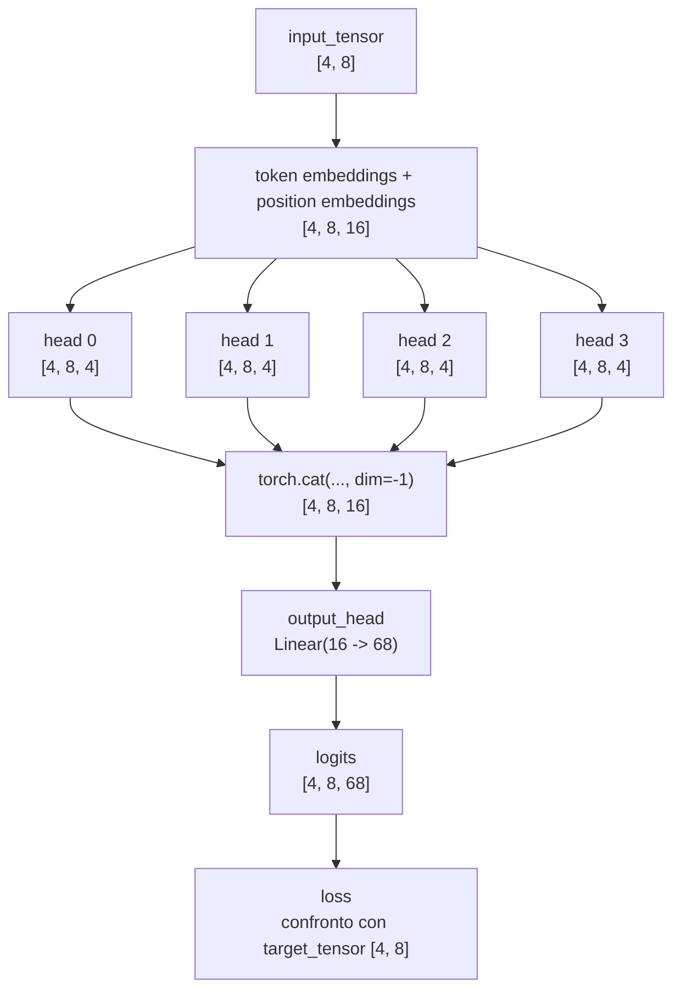

### Errori comuni

Errore 1: pensare che `num_heads = 4` aggiunga una nuova dimensione finale al
modello.

In questa versione non otteniamo:

```text
[4, 8, 4, 4]
```

perché non stiamo usando una dimensione separata per le head nell'output finale.
Stiamo concatenando lungo l'ultima dimensione.

Il risultato è:

```text
[4, 8, 16]
```

Errore 2: pensare che ogni head veda un pezzo diverso dell'input.

In questo codice ogni head riceve gli stessi `embeddings` di partenza:

```text
embeddings.shape = [4, 8, 16]
```

La differenza tra le head nasce dai pesi diversi dentro `key`, `query` e
`value`.

Errore 3: pensare che la concatenazione produca direttamente parole o caratteri.

La concatenazione produce ancora numeri interni:

```text
multi_head_embeddings.shape = [4, 8, 16]
```

Solo dopo `output_head` otteniamo:

```text
logits.shape = [4, 8, 68]
```

### Fonti tecniche consultate

- `nanoGPT/model.py` nel repository locale: usa causal self-attention con più
  head e mantiene la direzione architetturale che vogliamo seguire.
- [Attention Is All You Need](https://arxiv.org/abs/1706.03762):
  introduce la multi-head attention come più funzioni di attention eseguite in
  parallelo e poi combinate.
- [PyTorch `nn.ModuleList`](https://docs.pytorch.org/docs/2.12/generated/torch.nn.ModuleList.html):
  supporta l'uso di una lista di moduli registrati da PyTorch.
- [PyTorch `torch.cat`](https://docs.pytorch.org/docs/2.12/generated/torch.cat.html):
  supporta la concatenazione di tensori lungo una dimensione scelta.
- [PyTorch `nn.Linear`](https://docs.pytorch.org/docs/2.12/generated/torch.nn.Linear.html):
  supporta il passaggio finale `Linear(16 -> 68)` usato da `output_head`.

### Conclusione

Ora il modello non usa più una sola attention head. Usa più head in parallelo:

```text
embeddings
-> 4 head di self-attention
-> concatenazione
-> output_head
-> logits
```

Il prossimo passo sarà aggiungere una proiezione finale dentro la multi-head
attention. Questo ci preparerà alle residual connections dei blocchi
Transformer.

## Lezione 21 - Proiezione finale della multi-head attention

### Obiettivo

In questa lezione aggiungiamo una trasformazione lineare dopo la concatenazione
delle head.

Il nuovo pezzo si chiama:

```python
output_projection
```

Il suo compito è trasformare la rappresentazione prodotta dalla multi-head
attention prima che arrivi a `output_head`.

Questa è la distinzione principale:

| Componente | Dove si trova | Trasformazione | Scopo |
| --- | --- | --- | --- |
| `output_projection` | dentro `MultiHeadAttention` | `16 -> 16` | trasforma la rappresentazione interna dopo la concatenazione |
| `output_head` | nel language model | `16 -> 68` | trasforma la rappresentazione interna in logits sul vocabolario |

Quindi:

```text
output_projection != output_head
```

### Perché lo facciamo

In questa lezione, la concatenazione delle head produce già la shape giusta:

```text
concatenazione -> [4, 8, 16]
```

Quindi, dal punto di vista della sola forma, potremmo anche mandare questo
tensore direttamente a `output_head`, come nella lezione 20:

```text
[4, 8, 16] -> output_head -> [4, 8, 68]
```

Il codice funzionerebbe.

Però la multi-head attention non deve limitarsi ad affiancare i risultati delle
head. Deve anche produrre una nuova rappresentazione interna, sempre lunga
`embedding_size`.

Dopo la concatenazione abbiamo:

```text
[head 0 | head 1 | head 2 | head 3]
```

Questa rappresentazione contiene i risultati delle head nella stessa ultima
dimensione, ma non ha ancora fatto un passaggio allenabile che usa insieme tutti
i `16` valori concatenati.

`output_projection` serve proprio a questo:

```text
16 valori concatenati dalle head
-> Linear(16 -> 16)
-> 16 nuovi valori interni
```

Ogni valore in uscita può dipendere da tutti i 16 valori in ingresso. Quindi la
proiezione permette al modello di combinare informazioni prodotte da head
diverse prima di passare al resto del modello.

Il motivo più importante è che, nel Transformer completo, dopo la multi-head
attention non andremo subito alla previsione del prossimo token. Prima dovremo
usare residual connections, LayerNorm e MLP.

Per questo la attention deve restituire una rappresentazione interna:

```text
input della attention  -> [4, 8, 16]
output della attention -> [4, 8, 16]
```

Questa stessa forma ci servirà nella prossima lezione, perché la residual
connection farà una somma tra input della attention e output della attention:

```text
[4, 8, 16] + [4, 8, 16]
```

Se invece affidassimo tutta la trasformazione finale a `output_head`, usciremmo
dallo spazio interno del modello e passeremmo subito allo spazio del vocabolario:

```text
[4, 8, 16] -> output_head -> [4, 8, 68]
```

Quello è utile per calcolare logits, loss e generazione, ma non è la forma che
serve dentro un blocco Transformer.

Quindi `output_projection` serve a:

- trasformare i valori concatenati delle head;
- permettere a ogni valore finale di usare informazioni provenienti da tutte le
  head;
- mantenere la rappresentazione nella dimensione interna `embedding_size`;
- preparare l'output della attention alla futura residual connection;
- seguire più da vicino la struttura usata in nanoGPT, dove la causal
  self-attention ha una proiezione di output prima di restituire il risultato.

### Cosa cambia rispetto alla lezione 20

Nella lezione 20 il flusso era:

```text
head 0 -> [4, 8, 4]
head 1 -> [4, 8, 4]
head 2 -> [4, 8, 4]
head 3 -> [4, 8, 4]

concatenazione -> [4, 8, 16]

output_head -> [4, 8, 68]
```

Nella lezione 21 diventa:

```text
head 0 -> [4, 8, 4]
head 1 -> [4, 8, 4]
head 2 -> [4, 8, 4]
head 3 -> [4, 8, 4]

concatenazione -> [4, 8, 16]

output_projection -> [4, 8, 16]

output_head -> [4, 8, 68]
```

La shape dopo `output_projection` resta `[4, 8, 16]`.

La shape resta uguale, ma i valori cambiano perché `output_projection` ha pesi
allenabili.

### File modificati o creati

File modificati:

```text
LearnGPT/final_project/model.py
LearnGPT/course_it.md
LearnGPT/course_en.md
LearnGPT/study/snapshots/README.md
```

File creati:

```text
LearnGPT/study/snapshots/lesson_21/
LearnGPT/study/lessons/21_attention_projection.py
```

### Nuovo pezzo nel modello

Nel file `model.py`, dentro `MultiHeadAttention`, aggiungiamo:

```python
self.output_projection = nn.Linear(
    in_features=num_heads * head_size,
    out_features=embedding_size,
)
```

Con i valori della lezione:

```text
num_heads = 4
head_size = 4
embedding_size = 16
```

quindi:

```text
in_features  = 4 * 4 = 16
out_features = 16
```

La proiezione è:

```text
Linear(16 -> 16)
```

Questo significa che ogni vettore lungo `16` entra nella proiezione e ne esce
ancora lungo `16`.

### Codice aggiornato di `MultiHeadAttention`

Il blocco completo aggiornato è:

```python
class MultiHeadAttention(nn.Module):
    def __init__(self, embedding_size, head_size, context_size, num_heads):
        super().__init__()

        self.heads = nn.ModuleList(
            [
                SelfAttentionHead(
                    embedding_size=embedding_size,
                    head_size=head_size,
                    context_size=context_size,
                )
                for _ in range(num_heads)
            ]
        )
        self.output_projection = nn.Linear(
            in_features=num_heads * head_size,
            out_features=embedding_size,
        )

    def forward(self, embeddings):
        attended_outputs = []
        attention_weights_by_head = []

        for head in self.heads:
            attended_embeddings, attention_weights = head(embeddings)
            attended_outputs.append(attended_embeddings)
            attention_weights_by_head.append(attention_weights)

        concatenated_embeddings = torch.cat(attended_outputs, dim=-1)
        projected_embeddings = self.output_projection(concatenated_embeddings)

        return projected_embeddings, attention_weights_by_head
```

La parte nuova è:

```python
self.output_projection = nn.Linear(
    in_features=num_heads * head_size,
    out_features=embedding_size,
)
```

e:

```python
projected_embeddings = self.output_projection(concatenated_embeddings)
```

Prima:

```text
MultiHeadAttention restituiva concatenated_embeddings
```

Adesso:

```text
MultiHeadAttention restituisce projected_embeddings
```

### Come leggere la trasformazione

Prima della proiezione:

```text
concatenated_embeddings.shape = [4, 8, 16]
```

Dopo la proiezione:

```text
projected_embeddings.shape = [4, 8, 16]
```

Quindi le dimensioni non cambiano:

```text
[4, 8, 16] -> Linear(16 -> 16) -> [4, 8, 16]
```

Le prime due dimensioni restano uguali:

```text
4 esempi nel batch
8 posizioni per ogni esempio
```

L'ultima dimensione viene trasformata da `nn.Linear`:

```text
16 numeri in ingresso -> 16 numeri in uscita
```

I 16 numeri in uscita non sono una copia dei 16 numeri in ingresso. Sono nuovi
valori calcolati con pesi e bias della proiezione.

### Facsimile numerico

Per un solo token, prima della proiezione possiamo avere:

```text
concatenated_token = [
  0.10, 0.20, 0.30, 0.40,
  1.10, 1.20, 1.30, 1.40,
  2.10, 2.20, 2.30, 2.40,
  3.10, 3.20, 3.30, 3.40
]
```

Questi 16 numeri arrivano dalle 4 head concatenate.

`output_projection` prende questi 16 numeri e produce altri 16 numeri:

```text
projected_token = [
  -0.12, 0.48, 0.03, 0.77,
   0.21, -0.35, 0.19, 0.08,
  -0.44, 0.62, 0.11, -0.28,
   0.52, 0.06, -0.17, 0.31
]
```

Il numero di valori è lo stesso, ma il contenuto è stato trasformato.

### Differenza tra `output_projection` e `output_head`

Questi due nomi possono sembrare simili, ma fanno due lavori diversi.

`output_projection`:

```text
[4, 8, 16] -> [4, 8, 16]
```

Resta dentro la rappresentazione interna del modello.

`output_head`:

```text
[4, 8, 16] -> [4, 8, 68]
```

Produce logits sul vocabolario.

Quindi il flusso completo della lezione 21 è:

```text
embeddings
-> head parallele
-> concatenazione
-> output_projection
-> output_head
-> logits
```

### Diagramma della lezione 21

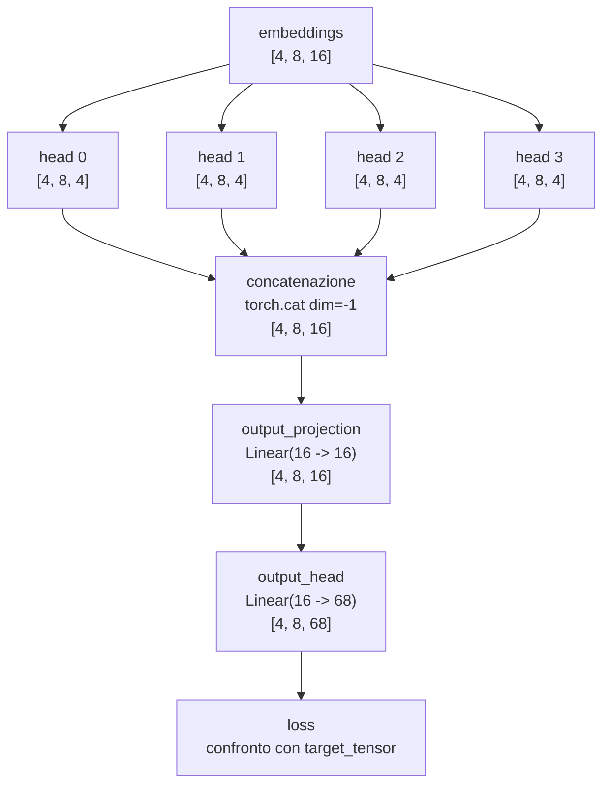

### Errori comuni

Errore 1: pensare che `Linear(16 -> 16)` non faccia nulla.

Fa una trasformazione allenabile. La shape resta uguale, ma i valori cambiano.

Errore 2: confondere `output_projection` con `output_head`.

`output_projection` resta nello spazio interno del modello:

```text
16 -> 16
```

`output_head` porta allo spazio del vocabolario:

```text
16 -> 68
```

Errore 3: pensare che la proiezione sia necessaria per cambiare shape.

In questa lezione la proiezione non serve a cambiare shape. Serve ad aggiungere
una trasformazione allenabile dopo che le head sono state concatenate.

### Fonti tecniche consultate

- `nanoGPT/model.py` nel repository locale: nella classe
  `CausalSelfAttention`, dopo la ricomposizione degli output delle head, usa
  `c_proj`, una proiezione lineare da `n_embd` a `n_embd`.
- [Attention Is All You Need](https://arxiv.org/abs/1706.03762):
  descrive la multi-head attention come attention parallele poi concatenate e
  proiettate.
- [PyTorch `nn.Linear`](https://docs.pytorch.org/docs/2.12/generated/torch.nn.Linear.html):
  supporta il comportamento `[..., in_features] -> [..., out_features]`.
- [PyTorch `torch.cat`](https://docs.pytorch.org/docs/2.12/generated/torch.cat.html):
  supporta la concatenazione lungo l'ultima dimensione.

### Conclusione

Ora la multi-head attention ha questa struttura:

```text
head parallele
-> concatenazione
-> output_projection
```

Il language model completo segue questo flusso:

```text
token IDs
-> token embeddings + position embeddings
-> multi-head attention con projection
-> output_head
-> logits
```

Il prossimo passo sarà usare questo blocco dentro una struttura con residual
connection. La residual connection richiede che input e output abbiano la stessa
shape, e questa lezione prepara proprio quel requisito:

```text
embeddings.shape          = [4, 8, 16]
attention_output.shape    = [4, 8, 16]
```

## Lezione 22 - Residual connection attorno alla attention

### Obiettivo

In questa lezione aggiungiamo la prima residual connection.

La residual connection è una somma tra:

```text
input della attention
output della attention
```

Nel nostro codice:

```python
residual_embeddings = embeddings + attention_output
```

La condizione fondamentale è che i due tensori abbiano la stessa shape.

In questa lezione abbiamo:

```text
embeddings.shape        = [4, 8, 16]
attention_output.shape  = [4, 8, 16]

residual_embeddings     = embeddings + attention_output
residual_embeddings.shape = [4, 8, 16]
```

### Cosa cambia rispetto alla lezione 21

Nella lezione 21 il flusso era:

```text
embeddings
-> multi-head attention con output_projection
-> output_head
-> logits
```

Nella lezione 22 diventa:

```text
embeddings
-> multi-head attention con output_projection
-> embeddings + attention_output
-> output_head
-> logits
```

Il nuovo passaggio è:

```text
embeddings + attention_output
```

### Perché aggiungiamo la residual connection

La multi-head attention calcola una trasformazione degli embeddings.

Senza residual connection, il modello usa solo l'output della attention:

```text
attention_output -> output_head
```

Con residual connection, il modello conserva anche la rappresentazione che
entrava nella attention:

```text
embeddings + attention_output -> output_head
```

Questo è utile perché l'output del sottoblocco attention contiene due parti:

```text
rappresentazione originale
+
modifica calcolata dalla attention
```

Nel Transformer completo, questa struttura viene usata nei blocchi:

```text
x = x + attention(...)
x = x + mlp(...)
```

In nanoGPT il blocco segue questa struttura:

```python
x = x + self.attn(self.ln_1(x))
x = x + self.mlp(self.ln_2(x))
```

Noi stiamo introducendo solo il primo pezzo:

```text
x = x + attention(x)
```

LayerNorm e MLP arriveranno nelle prossime lezioni.

### File modificati o creati

File modificati:

```text
LearnGPT/final_project/model.py
LearnGPT/course_it.md
LearnGPT/course_en.md
LearnGPT/study/snapshots/README.md
```

File creati:

```text
LearnGPT/study/snapshots/lesson_22/
LearnGPT/study/lessons/22_residual_connection.py
```

### Nuovo modello: `LanguageModel`

Nel file `model.py` aggiungiamo un nuovo modello didattico:

```python
class LanguageModel(nn.Module):
    def __init__(
        self,
        vocabulary_size,
        context_size,
        embedding_size,
        head_size,
        num_heads,
    ):
        super().__init__()

        if num_heads * head_size != embedding_size:
            raise ValueError(
                "In questa versione didattica, num_heads * head_size deve "
                "essere uguale a embedding_size."
            )

        self.context_size = context_size
        self.token_embedding_table = nn.Embedding(
            num_embeddings=vocabulary_size,
            embedding_dim=embedding_size,
        )
        self.position_embedding_table = nn.Embedding(
            num_embeddings=context_size,
            embedding_dim=embedding_size,
        )
        self.multi_head_attention = MultiHeadAttention(
            embedding_size=embedding_size,
            head_size=head_size,
            context_size=context_size,
            num_heads=num_heads,
        )
        self.output_head = nn.Linear(
            in_features=embedding_size,
            out_features=vocabulary_size,
        )
```

Il `forward` contiene il nuovo passaggio:

```python
token_embeddings = self.token_embedding_table(input_ids)
position_embeddings = self.position_embedding_table(positions)
embeddings = token_embeddings + position_embeddings
attention_output, _ = self.multi_head_attention(embeddings)
residual_embeddings = embeddings + attention_output
logits = self.output_head(residual_embeddings)
```

La riga nuova è:

```python
residual_embeddings = embeddings + attention_output
```

### Come leggere la somma

La somma è elemento per elemento.

Per ogni esempio, per ogni posizione, per ogni numero interno:

```text
residual_embeddings = embeddings + attention_output
```

Forma completa:

```text
[4, 8, 16] + [4, 8, 16] -> [4, 8, 16]
```

Facsimile su un singolo token con 4 numeri:

```text
embedding_token        = [ 0.10,  0.20, -0.30,  0.40]
attention_output_token = [ 0.05, -0.10,  0.70,  0.20]

residual_token         = [ 0.15,  0.10,  0.40,  0.60]
```

Calcolo:

```text
0.10 + 0.05  = 0.15
0.20 + -0.10 = 0.10
-0.30 + 0.70 = 0.40
0.40 + 0.20  = 0.60
```

Nel modello reale non abbiamo 4 numeri per token, ma 16:

```text
embedding_size = 16
```

### Diagramma della lezione 22

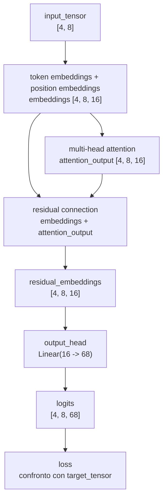

### Errori comuni

Errore 1: pensare che la residual connection concateni i tensori.

Non concatena. Somma:

```text
embeddings + attention_output
```

Errore 2: pensare che la residual connection cambi la shape.

Non cambia la shape:

```text
[4, 8, 16] + [4, 8, 16] -> [4, 8, 16]
```

Errore 3: provare a sommare tensori con shape diverse.

Questa somma richiede forme compatibili. Per questo nella lezione 21 abbiamo
tenuto l'output della attention nella stessa dimensione interna:

```text
embedding_size = 16
```

### Fonti tecniche consultate

- `nanoGPT/model.py` nel repository locale: nella classe `Block`, il forward usa
  `x = x + self.attn(self.ln_1(x))`, cioè una residual connection attorno alla
  causal self-attention.
- [Attention Is All You Need](https://arxiv.org/abs/1706.03762):
  descrive la struttura dei blocchi Transformer con connessioni residuali
  attorno ai sottolivelli.
- Documentazione PyTorch sulle operazioni tra tensori: supporta la somma
  elemento per elemento quando le shape sono compatibili.

### Conclusione

Ora il modello segue questo flusso:

```text
token IDs
-> token embeddings + position embeddings
-> multi-head attention con projection
-> residual connection
-> output_head
-> logits
```

Il prossimo passo sarà introdurre `LayerNorm`, perché nei blocchi Transformer la
residual connection viene usata insieme alla normalizzazione.

## Lezione 23 - LayerNorm prima della attention

### Obiettivo

In questa lezione aggiungiamo `LayerNorm` prima della multi-head attention.

Il nuovo pezzo si chiama:

```python
self.attention_layer_norm = nn.LayerNorm(normalized_shape=embedding_size)
```

Nel `forward` viene usato qui:

```python
normalized_embeddings = self.attention_layer_norm(embeddings)
attention_output, _ = self.multi_head_attention(normalized_embeddings)
residual_embeddings = embeddings + attention_output
```

Il punto importante è questo:

```text
LayerNorm cambia i valori interni, ma non cambia la shape.
```

Nel nostro caso:

```text
embeddings.shape             = [4, 8, 16]
normalized_embeddings.shape  = [4, 8, 16]
```

### Cosa cambia rispetto alla lezione 22

Nella lezione 22 il flusso era:

```text
embeddings
-> multi-head attention
-> embeddings + attention_output
-> output_head
-> logits
```

Nella lezione 23 diventa:

```text
embeddings
-> LayerNorm
-> multi-head attention
-> embeddings + attention_output
-> output_head
-> logits
```

Il nuovo passaggio è:

```python
normalized_embeddings = self.attention_layer_norm(embeddings)
```

### Perché mettiamo LayerNorm prima della attention

La attention riceve un tensore con forma:

```text
[batch_size, context_size, embedding_size]
[4, 8, 16]
```

Per ogni esempio e per ogni posizione, c'è un vettore interno lungo 16 numeri.
`LayerNorm(16)` lavora su questi 16 numeri.

Per ogni token normalizza la sua rappresentazione interna:

```text
un token prima di LayerNorm  -> 16 numeri
un token dopo LayerNorm      -> 16 numeri
```

La lunghezza resta 16. Cambiano i valori.

In termini di shape:

```text
[4, 8, 16] -> LayerNorm(16) -> [4, 8, 16]
```

La normalizzazione fa in modo che i 16 numeri interni di ogni token arrivino
alla attention con valori più stabili: non troppo grandi, non troppo piccoli e
centrati in modo più regolare. Questo diventa importante quando aggiungiamo più
blocchi, perché ogni sottoblocco riceve in ingresso valori più prevedibili e
può aggiornare la rappresentazione senza dipendere da oscillazioni troppo forti
prodotte dai passaggi precedenti.

### Collegamento con nanoGPT

In nanoGPT il blocco Transformer usa questa forma:

```python
x = x + self.attn(self.ln_1(x))
x = x + self.mlp(self.ln_2(x))
```

In questa lezione introduciamo il primo rigo in versione didattica:

```text
x = x + attention(layer_norm(x))
```

Nel nostro codice:

```python
normalized_embeddings = self.attention_layer_norm(embeddings)
attention_output, _ = self.multi_head_attention(normalized_embeddings)
residual_embeddings = embeddings + attention_output
```

`LayerNorm` viene applicata all'input della attention.

La somma residuale usa ancora gli embeddings originali:

```python
residual_embeddings = embeddings + attention_output
```

Questa distinzione è importante:

| Tensore | Entra nella attention? | Entra nella somma residuale? |
| --- | --- | --- |
| `embeddings` | no, prima viene normalizzato | sì |
| `normalized_embeddings` | sì | no |
| `attention_output` | è l'output della attention | sì |
| `residual_embeddings` | no | è il risultato della somma |

### File modificati o creati

File modificati:

```text
LearnGPT/final_project/model.py
LearnGPT/course_it.md
LearnGPT/course_en.md
LearnGPT/study/snapshots/README.md
```

File creati:

```text
LearnGPT/study/snapshots/lesson_23/
LearnGPT/study/lessons/23_layer_norm_attention.py
```

### Nuovo modello: `LanguageModel`

Nel file `model.py` aggiungiamo un nuovo modello didattico:

```python
class LanguageModel(nn.Module):
    def __init__(
        self,
        vocabulary_size,
        context_size,
        embedding_size,
        head_size,
        num_heads,
    ):
        super().__init__()

        if num_heads * head_size != embedding_size:
            raise ValueError(
                "In questa versione didattica, num_heads * head_size deve "
                "essere uguale a embedding_size."
            )

        self.context_size = context_size
        self.token_embedding_table = nn.Embedding(
            num_embeddings=vocabulary_size,
            embedding_dim=embedding_size,
        )
        self.position_embedding_table = nn.Embedding(
            num_embeddings=context_size,
            embedding_dim=embedding_size,
        )
        self.attention_layer_norm = nn.LayerNorm(
            normalized_shape=embedding_size,
        )
        self.multi_head_attention = MultiHeadAttention(
            embedding_size=embedding_size,
            head_size=head_size,
            context_size=context_size,
            num_heads=num_heads,
        )
        self.output_head = nn.Linear(
            in_features=embedding_size,
            out_features=vocabulary_size,
        )
```

La riga nuova è:

```python
self.attention_layer_norm = nn.LayerNorm(
    normalized_shape=embedding_size,
)
```

Qui `normalized_shape=embedding_size` significa:

```text
normalizza l'ultima dimensione del tensore
```

Nel nostro tensore:

```text
embeddings.shape = [4, 8, 16]
```

l'ultima dimensione è:

```text
16
```

Quindi `LayerNorm(16)` lavora sui 16 numeri interni di ogni token.

### Forward completo della nuova classe

```python
def forward(self, input_ids, target_ids=None):
    current_context_size = input_ids.shape[1]

    if current_context_size > self.context_size:
        raise ValueError(
            f"Il contesto ricevuto contiene {current_context_size} token, "
            f"ma il modello supporta al massimo {self.context_size} token."
        )

    positions = torch.arange(current_context_size, device=input_ids.device)

    token_embeddings = self.token_embedding_table(input_ids)
    position_embeddings = self.position_embedding_table(positions)
    embeddings = token_embeddings + position_embeddings
    normalized_embeddings = self.attention_layer_norm(embeddings)
    attention_output, _ = self.multi_head_attention(normalized_embeddings)
    residual_embeddings = embeddings + attention_output
    logits = self.output_head(residual_embeddings)

    if target_ids is None:
        return logits

    batch_size, context_size, vocabulary_size = logits.shape

    logits_flat = logits.reshape(batch_size * context_size, vocabulary_size)
    target_ids_flat = target_ids.reshape(batch_size * context_size)

    loss = F.cross_entropy(logits_flat, target_ids_flat)

    return logits, loss
```

Il passaggio nuovo è prima della attention:

```python
normalized_embeddings = self.attention_layer_norm(embeddings)
```

Poi la attention usa `normalized_embeddings`:

```python
attention_output, _ = self.multi_head_attention(normalized_embeddings)
```

La residual connection continua a sommare l'input originale e l'output della
attention:

```python
residual_embeddings = embeddings + attention_output
```

### Procedimento sui tensori

Il flusso della lezione 23 è:

```text
input_tensor
shape [4, 8]

-> token_embedding_table + position_embedding_table

embeddings
shape [4, 8, 16]

-> attention_layer_norm

normalized_embeddings
shape [4, 8, 16]

-> multi_head_attention

attention_output
shape [4, 8, 16]

-> embeddings + attention_output

residual_embeddings
shape [4, 8, 16]

-> output_head

logits
shape [4, 8, 68]
```

### Facsimile dei valori prima e dopo LayerNorm

Prendiamo un solo token con 4 numeri per rendere il calcolo leggibile.
Nel progetto reale i numeri sono 16.

Prima di `LayerNorm`:

```text
embedding_token = [2.00, 4.00, 6.00, 8.00]
```

La media è:

```text
(2.00 + 4.00 + 6.00 + 8.00) / 4 = 5.00
```

I valori vengono centrati rispetto alla media e scalati rispetto alla loro
dispersione. Un facsimile dopo la normalizzazione può essere:

```text
normalized_token = [-1.34, -0.45, 0.45, 1.34]
```

La shape non cambia:

```text
[4] -> LayerNorm(4) -> [4]
```

Nel modello reale:

```text
[4, 8, 16] -> LayerNorm(16) -> [4, 8, 16]
```

### Diagramma della lezione 23

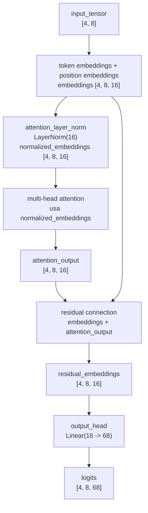

Osserva il doppio collegamento:

```text
embeddings -> LayerNorm -> attention
embeddings -> residual connection
```

Questo mostra che la attention riceve valori normalizzati, mentre la somma
residuale conserva il ramo originale.

### Errori comuni

Errore 1: pensare che `LayerNorm` cambi `[4, 8, 16]` in `[4, 8]`.

Non succede. `LayerNorm(16)` normalizza l'ultima dimensione, ma restituisce un
tensore con la stessa forma:

```text
[4, 8, 16] -> [4, 8, 16]
```

Errore 2: pensare che `LayerNorm` lavori sul vocabolario.

Non lavora su `vocabulary_size`. In questa lezione lavora su
`embedding_size`, cioè sui 16 numeri interni che rappresentano ogni token.

Errore 3: sommare il tensore sbagliato nella residual connection.

In questa lezione la somma corretta è:

```python
residual_embeddings = embeddings + attention_output
```

Non è:

```python
residual_embeddings = normalized_embeddings + attention_output
```

Usiamo `normalized_embeddings` per calcolare la attention, ma la residual
connection mantiene il ramo originale `embeddings`.

### Fonti tecniche consultate

- `nanoGPT/model.py` nel repository locale: nella classe `Block`, il forward usa
  `x = x + self.attn(self.ln_1(x))`.
- Documentazione PyTorch `nn.LayerNorm`:
  `https://docs.pytorch.org/docs/2.13/generated/torch.nn.LayerNorm.html`.
  Supporta il fatto che `normalized_shape` indica le ultime dimensioni da
  normalizzare e che l'output conserva la stessa shape dell'input.
- Paper `Layer Normalization`: `https://arxiv.org/abs/1607.06450`.

### Conclusione

Ora il modello segue questo flusso:

```text
token IDs
-> token embeddings + position embeddings
-> LayerNorm
-> multi-head attention con projection
-> residual connection
-> output_head
-> logits
```

Il prossimo passo sarà iniziare a racchiudere questi pezzi in un vero blocco
Transformer didattico.

## Lezione 24 - Feed-forward network dopo la attention

### Obiettivo

In questa lezione aggiungiamo il secondo sottoblocco principale del Transformer:
il feed-forward network.

Nel codice lo chiamiamo:

```python
class FeedForward(nn.Module):
```

In molti progetti GPT, incluso nanoGPT, questo stesso tipo di sottoblocco viene
chiamato `MLP`.

`MLP` sta per:

```text
Multi-Layer Perceptron
```

Nel nostro percorso, quando diciamo `MLP` in questo punto, intendiamo il
feed-forward network interno al blocco Transformer:

```text
Linear(16 -> 64)
-> GELU
-> Linear(64 -> 16)
```

Quindi in queste lezioni:

```text
MLP = feed-forward network del Transformer
```

Nel codice didattico usiamo il nome `FeedForward` perché descrive meglio il
ruolo del componente. In nanoGPT lo stesso ruolo è rappresentato dalla classe
`MLP`.

Poi lo usiamo nel modello:

```python
feed_forward_input = self.feed_forward_layer_norm(residual_after_attention)
feed_forward_output = self.feed_forward(feed_forward_input)
residual_after_feed_forward = residual_after_attention + feed_forward_output
```

Il punto importante è questo:

```text
la attention mescola informazioni tra posizioni diverse;
il feed-forward trasforma ogni posizione lungo la dimensione embedding.
```

Nel nostro caso:

```text
residual_after_attention.shape      = [4, 8, 16]
feed_forward_input.shape            = [4, 8, 16]
feed_forward_hidden.shape           = [4, 8, 64]
feed_forward_output.shape           = [4, 8, 16]
residual_after_feed_forward.shape   = [4, 8, 16]
```

### Cosa cambia rispetto alla lezione 23

Nella lezione 23 il flusso era:

```text
embeddings
-> LayerNorm
-> multi-head attention
-> attention residual
-> output_head
-> logits
```

Nella lezione 24 diventa:

```text
embeddings
-> LayerNorm
-> multi-head attention
-> attention residual
-> LayerNorm
-> feed-forward network
-> feed-forward residual
-> output_head
-> logits
```

Il nuovo blocco è:

```text
LayerNorm -> feed-forward -> residual connection
```

### Perché aggiungiamo il feed-forward network

La multi-head attention serve a calcolare una rappresentazione di ogni token
tenendo conto dei token precedenti nel contesto.

Dopo la attention, ogni posizione ha ancora un vettore interno lungo
`embedding_size`:

```text
residual_after_attention.shape = [4, 8, 16]
```

Il feed-forward network prende quel vettore e lo trasforma con due layer
lineari e una funzione di attivazione:

```text
16 -> 64 -> 16
```

Nel nostro codice `64` viene da:

```text
4 * embedding_size = 4 * 16 = 64
```

Questa scelta segue la forma usata da nanoGPT:

```python
self.c_fc = nn.Linear(config.n_embd, 4 * config.n_embd, bias=config.bias)
self.gelu = nn.GELU()
self.c_proj = nn.Linear(4 * config.n_embd, config.n_embd, bias=config.bias)
```

Noi la scriviamo in modo didattico, con layer nominati:

```python
self.expand = nn.Linear(
    in_features=embedding_size,
    out_features=4 * embedding_size,
)
self.activation = nn.GELU()
self.project = nn.Linear(
    in_features=4 * embedding_size,
    out_features=embedding_size,
)
```

### Differenza tra feed-forward e output_head

Il feed-forward network non produce token finali e non produce probabilità sul
vocabolario.

Il suo output resta nella dimensione interna del modello:

```text
feed_forward_output.shape = [4, 8, 16]
```

`output_head`, invece, trasforma la rappresentazione interna in punteggi sul
vocabolario:

```text
logits.shape = [4, 8, 68]
```

Tabella:

| Componente | Input | Output | Scopo |
| --- | --- | --- | --- |
| `feed_forward` | `[4, 8, 16]` | `[4, 8, 16]` | trasforma la rappresentazione interna |
| `output_head` | `[4, 8, 16]` | `[4, 8, 68]` | produce logits sul vocabolario |

Quindi:

```text
feed_forward != output_head
```

### Il nuovo componente `FeedForward`

Nel file `model.py` aggiungiamo:

```python
class FeedForward(nn.Module):
    def __init__(self, embedding_size):
        super().__init__()

        self.expand = nn.Linear(
            in_features=embedding_size,
            out_features=4 * embedding_size,
        )
        self.activation = nn.GELU()
        self.project = nn.Linear(
            in_features=4 * embedding_size,
            out_features=embedding_size,
        )

    def forward(self, embeddings):
        hidden = self.expand(embeddings)
        activated = self.activation(hidden)
        output = self.project(activated)

        return output
```

La prima `Linear` espande l'ultima dimensione:

```text
[4, 8, 16] -> Linear(16 -> 64) -> [4, 8, 64]
```

`GELU` mantiene la stessa shape:

```text
[4, 8, 64] -> GELU -> [4, 8, 64]
```

La seconda `Linear` riporta la dimensione a `embedding_size`:

```text
[4, 8, 64] -> Linear(64 -> 16) -> [4, 8, 16]
```

Questo ritorno a 16 è necessario perché subito dopo facciamo una somma
residuale:

```python
residual_after_feed_forward = residual_after_attention + feed_forward_output
```

La somma è possibile perché entrambi hanno la stessa shape:

```text
[4, 8, 16] + [4, 8, 16] -> [4, 8, 16]
```

### Chiarimento extra: che cos'è `GELU`

`GELU` significa `Gaussian Error Linear Unit`.

È una funzione di attivazione. Nel nostro feed-forward viene applicata dopo la
prima `Linear`:

```python
hidden = self.expand(embeddings)
activated = self.activation(hidden)
output = self.project(activated)
```

Nel nostro esempio:

```text
feed_forward_hidden.shape     = [4, 8, 64]
feed_forward_activated.shape  = [4, 8, 64]
```

La shape non cambia. Cambiano solo i valori contenuti nel tensore.

`GELU` viene applicata elemento per elemento. Ogni numero entra nella funzione e
produce un numero in output:

```text
-2.0 -> -0.0455
-1.0 -> -0.1587
-0.5 -> -0.1543
 0.0 ->  0.0000
 0.5 ->  0.3457
 1.0 ->  0.8413
 2.0 ->  1.9545
```

Da questi valori si vede il comportamento pratico:

- i valori positivi grandi restano vicini al valore originale;
- i valori vicini a zero vengono ridotti;
- i valori negativi vengono molto ridotti, ma non vengono tagliati tutti
  direttamente a zero.

La formula usata per definire GELU è:

```text
GELU(x) = x * Phi(x)
```

`Phi(x)` è la funzione di distribuzione cumulativa della normale standard.
Per il nostro percorso non serve calcolare a mano `Phi(x)`. Il punto da capire è
che `GELU` introduce una trasformazione non lineare tra le due `Linear` del
feed-forward.

Senza una funzione non lineare in mezzo, due layer lineari consecutivi
produrrebbero ancora una trasformazione lineare complessiva. Con `GELU`, il
feed-forward può trasformare i valori interni in modo più ricco prima di
tornare da 64 numeri a 16 numeri.

Nel nostro blocco:

```text
Linear(16 -> 64)
-> GELU
-> Linear(64 -> 16)
```

`GELU` è quindi il passaggio che modifica i valori intermedi dopo l'espansione a
64 dimensioni e prima del ritorno a 16 dimensioni.

### Il nuovo modello `LanguageModel`

Nel modello aggiungiamo tre componenti:

```python
self.feed_forward_layer_norm = nn.LayerNorm(
    normalized_shape=embedding_size,
)
self.feed_forward = FeedForward(
    embedding_size=embedding_size,
)
self.output_head = nn.Linear(
    in_features=embedding_size,
    out_features=vocabulary_size,
)
```

Il nuovo pezzo del `forward` è:

```python
attention_input = self.attention_layer_norm(embeddings)
attention_output, _ = self.multi_head_attention(attention_input)
residual_after_attention = embeddings + attention_output

feed_forward_input = self.feed_forward_layer_norm(residual_after_attention)
feed_forward_output = self.feed_forward(feed_forward_input)
residual_after_feed_forward = residual_after_attention + feed_forward_output

logits = self.output_head(residual_after_feed_forward)
```

Questa struttura corrisponde a queste due righe di nanoGPT:

```python
x = x + self.attn(self.ln_1(x))
x = x + self.mlp(self.ln_2(x))
```

Nel nostro codice i nomi sono più lunghi per rendere visibile ogni passaggio:

```text
attention_input
attention_output
residual_after_attention
feed_forward_input
feed_forward_output
residual_after_feed_forward
```

### Procedimento sui tensori

Il flusso completo della lezione 24 è:

```text
input_tensor
shape [4, 8]

-> token_embedding_table + position_embedding_table

embeddings
shape [4, 8, 16]

-> attention_layer_norm

attention_input
shape [4, 8, 16]

-> multi_head_attention

attention_output
shape [4, 8, 16]

-> embeddings + attention_output

residual_after_attention
shape [4, 8, 16]

-> feed_forward_layer_norm

feed_forward_input
shape [4, 8, 16]

-> Linear(16 -> 64)

feed_forward_hidden
shape [4, 8, 64]

-> GELU

feed_forward_activated
shape [4, 8, 64]

-> Linear(64 -> 16)

feed_forward_output
shape [4, 8, 16]

-> residual_after_attention + feed_forward_output

residual_after_feed_forward
shape [4, 8, 16]

-> output_head

logits
shape [4, 8, 68]
```

### Facsimile dei valori

Prendiamo un solo token con 4 numeri per leggere il passaggio. Nel progetto
reale usiamo 16 numeri, non 4.

Input del feed-forward:

```text
feed_forward_input_token = [0.20, -0.10, 0.50, 0.30]
```

Prima `Linear`, espansione temporanea:

```text
hidden_token = [0.70, -0.40, 0.10, 0.90, -0.20, 0.30, 0.05, 0.60]
```

Qui il facsimile passa da 4 a 8 numeri. Nel modello reale passa da 16 a 64.

Dopo `GELU`, la shape resta la stessa ma cambiano i valori:

```text
activated_token = [0.53, -0.14, 0.05, 0.73, -0.08, 0.19, 0.03, 0.44]
```

Seconda `Linear`, ritorno alla dimensione iniziale:

```text
feed_forward_output_token = [0.12, 0.08, -0.31, 0.22]
```

Poi sommiamo:

```text
residual_after_attention_token = [0.40, 0.10, 0.20, -0.30]
feed_forward_output_token      = [0.12, 0.08, -0.31, 0.22]

residual_after_feed_forward    = [0.52, 0.18, -0.11, -0.08]
```

### Diagramma della lezione 24

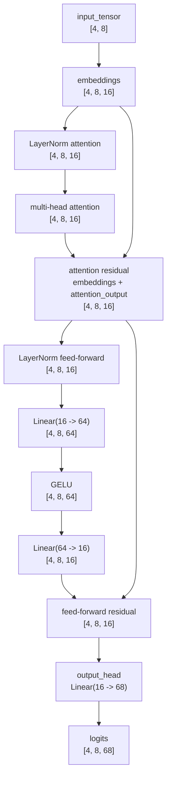

Il diagramma mostra due somme residuali:

```text
embeddings + attention_output
residual_after_attention + feed_forward_output
```

### Errori comuni

Errore 1: pensare che il feed-forward cambi il numero di token nel contesto.

Non cambia `context_size`. Nel nostro esempio `context_size` resta `8`.

```text
[4, 8, 16] -> [4, 8, 64] -> [4, 8, 16]
```

Errore 2: pensare che il feed-forward lavori sul vocabolario.

Non lavora su `vocabulary_size`. Lavora sulla dimensione interna
`embedding_size`.

Errore 3: dimenticare il ritorno da 64 a 16.

La residual connection finale richiede due tensori compatibili:

```text
residual_after_attention.shape = [4, 8, 16]
feed_forward_output.shape      = [4, 8, 16]
```

Se `feed_forward_output` restasse `[4, 8, 64]`, la somma non sarebbe possibile.

Errore 4: confondere `GELU` con una modifica della shape.

`GELU` cambia i valori, non la forma:

```text
[4, 8, 64] -> GELU -> [4, 8, 64]
```

### Fonti tecniche consultate

- `nanoGPT/model.py` nel repository locale: la classe `MLP` usa
  `Linear(n_embd -> 4 * n_embd)`, `GELU`, `Linear(4 * n_embd -> n_embd)`.
  La classe `Block` usa poi `x = x + self.mlp(self.ln_2(x))`.
- [Attention Is All You Need](https://arxiv.org/abs/1706.03762):
  descrive il feed-forward network position-wise nei blocchi Transformer.
- [Gaussian Error Linear Units](https://arxiv.org/abs/1606.08415):
  descrive la funzione di attivazione GELU usata nella MLP di nanoGPT.
- [PyTorch `nn.GELU`](https://docs.pytorch.org/docs/stable/generated/torch.nn.GELU.html):
  documenta la funzione `GELU` disponibile in PyTorch.
- [scikit-learn, Neural network models](https://scikit-learn.org/stable/modules/neural_networks_supervised.html):
  usa la forma estesa `Multi-layer Perceptron (MLP)`.

### Conclusione

Ora il modello segue questo flusso:

```text
token IDs
-> token embeddings + position embeddings
-> LayerNorm
-> multi-head attention con projection
-> attention residual
-> LayerNorm
-> feed-forward network
-> feed-forward residual
-> output_head
-> logits
```

Il prossimo passo sarà incapsulare attention, MLP, LayerNorm e residual
connections in una classe `TransformerBlock`.

## Lezione 25 - TransformerBlock

### Obiettivo

In questa lezione creiamo la classe:

```python
class TransformerBlock(nn.Module):
```

Il suo compito è raggruppare i pezzi che abbiamo già studiato:

```text
LayerNorm
multi-head attention
residual connection
LayerNorm
feed-forward network
residual connection
```

Il punto importante è questo:

```text
TransformerBlock non aggiunge una nuova operazione matematica.
TransformerBlock organizza operazioni che abbiamo già scritto.
```

La shape in ingresso e in uscita resta la stessa:

```text
embeddings.shape     = [4, 8, 16]
block_output.shape   = [4, 8, 16]
```

Questo è necessario perché più avanti potremo mettere più blocchi uno dopo
l'altro:

```text
[4, 8, 16] -> blocco 1 -> [4, 8, 16] -> blocco 2 -> [4, 8, 16]
```

### Cosa cambia rispetto alla lezione 24

Nella lezione 24 il language model conteneva direttamente questi componenti:

```text
attention_layer_norm
multi_head_attention
feed_forward_layer_norm
feed_forward
output_head
```

Nella lezione 25 spostiamo la parte interna in `TransformerBlock`:

```text
TransformerBlock
  attention_layer_norm
  multi_head_attention
  feed_forward_layer_norm
  feed_forward
```

Il language model rimane più semplice:

```text
token embeddings + position embeddings
-> transformer_block
-> output_head
-> logits
```

### Collegamento con nanoGPT

In nanoGPT la classe `Block` contiene questa struttura:

```python
x = x + self.attn(self.ln_1(x))
x = x + self.mlp(self.ln_2(x))
```

Nel nostro codice didattico scriviamo la stessa idea con nomi più espliciti:

```python
attention_input = self.attention_layer_norm(embeddings)
attention_output, _ = self.multi_head_attention(attention_input)
residual_after_attention = embeddings + attention_output

feed_forward_input = self.feed_forward_layer_norm(residual_after_attention)
feed_forward_output = self.feed_forward(feed_forward_input)
residual_after_feed_forward = residual_after_attention + feed_forward_output
```

La differenza principale è il livello di compattezza:

| Versione | Stile |
| --- | --- |
| nanoGPT | codice compatto, adatto a un progetto già maturo |
| `LearnGPT` | codice più verboso, adatto a seguire ogni passaggio |

### File modificati o creati

File modificati:

```text
LearnGPT/final_project/model.py
LearnGPT/course_it.md
LearnGPT/course_en.md
LearnGPT/study/snapshots/README.md
```

File creati:

```text
LearnGPT/study/snapshots/lesson_25/
LearnGPT/study/lessons/25_transformer_block.py
```

### Nuova classe `TransformerBlock`

Nel file `model.py` aggiungiamo:

```python
class TransformerBlock(nn.Module):
    def __init__(self, embedding_size, head_size, context_size, num_heads):
        super().__init__()

        self.attention_layer_norm = nn.LayerNorm(
            normalized_shape=embedding_size,
        )
        self.multi_head_attention = MultiHeadAttention(
            embedding_size=embedding_size,
            head_size=head_size,
            context_size=context_size,
            num_heads=num_heads,
        )
        self.feed_forward_layer_norm = nn.LayerNorm(
            normalized_shape=embedding_size,
        )
        self.feed_forward = FeedForward(
            embedding_size=embedding_size,
        )
```

Qui non compare `output_head`.

Motivo:

```text
TransformerBlock lavora nello spazio interno del modello: [4, 8, 16]
output_head trasforma lo spazio interno in vocabolario: [4, 8, 68]
```

Quindi `output_head` resta nel language model, fuori dal blocco.

### Forward del blocco

Il `forward` del blocco è:

```python
def forward(self, embeddings):
    attention_input = self.attention_layer_norm(embeddings)
    attention_output, _ = self.multi_head_attention(attention_input)
    residual_after_attention = embeddings + attention_output

    feed_forward_input = self.feed_forward_layer_norm(residual_after_attention)
    feed_forward_output = self.feed_forward(feed_forward_input)
    residual_after_feed_forward = residual_after_attention + feed_forward_output

    return residual_after_feed_forward
```

La sequenza è:

```text
1. normalizza gli embeddings prima della attention
2. calcola la multi-head attention
3. somma input originale e output della attention
4. normalizza il risultato prima del feed-forward
5. calcola il feed-forward
6. somma input del feed-forward e output del feed-forward
7. restituisce il risultato del blocco
```

### Nuovo modello `LanguageModel`

Il language model ora contiene un blocco:

```python
self.transformer_block = TransformerBlock(
    embedding_size=embedding_size,
    head_size=head_size,
    context_size=context_size,
    num_heads=num_heads,
)
```

Il `forward` del modello diventa:

```python
token_embeddings = self.token_embedding_table(input_ids)
position_embeddings = self.position_embedding_table(positions)
embeddings = token_embeddings + position_embeddings
block_output = self.transformer_block(embeddings)
logits = self.output_head(block_output)
```

Questo rende il flusso più pulito:

```text
input_ids
-> embeddings
-> transformer_block
-> output_head
-> logits
```

### Procedimento sui tensori

Il flusso completo della lezione 25 è:

```text
input_tensor
shape [4, 8]

-> token_embedding_table + position_embedding_table

embeddings
shape [4, 8, 16]

-> TransformerBlock

attention_input
shape [4, 8, 16]

attention_output
shape [4, 8, 16]

residual_after_attention
shape [4, 8, 16]

feed_forward_input
shape [4, 8, 16]

feed_forward_output
shape [4, 8, 16]

block_output
shape [4, 8, 16]

-> output_head

logits
shape [4, 8, 68]
```

La shape del blocco resta:

```text
[4, 8, 16] -> TransformerBlock -> [4, 8, 16]
```

### Diagramma della lezione 25

```mermaid
flowchart TD
    A["input_tensor<br/>[4, 8]"]
    B["token embeddings + position embeddings<br/>embeddings [4, 8, 16]"]
    C["TransformerBlock"]
    D["LayerNorm attention<br/>[4, 8, 16]"]
    E["multi-head attention<br/>[4, 8, 16]"]
    F["attention residual<br/>[4, 8, 16]"]
    G["LayerNorm feed-forward<br/>[4, 8, 16]"]
    H["feed-forward<br/>16 -> 64 -> 16"]
    I["feed-forward residual<br/>block_output [4, 8, 16]"]
    J["output_head<br/>Linear(16 -> 68)"]
    K["logits<br/>[4, 8, 68]"]

    A --> B --> C --> D --> E --> F --> G --> H --> I --> J --> K
    B --> F
    F --> I
```

Il diagramma mostra che `TransformerBlock` prende `embeddings` e restituisce
ancora una rappresentazione interna con la stessa shape.

### Errori comuni

Errore 1: pensare che `TransformerBlock` produca logits.

Non produce logits. Produce ancora rappresentazioni interne:

```text
[4, 8, 16] -> TransformerBlock -> [4, 8, 16]
```

I logits vengono prodotti dopo:

```text
[4, 8, 16] -> output_head -> [4, 8, 68]
```

Errore 2: pensare che il blocco cambi `context_size`.

Non cambia il numero di posizioni. Il contesto resta lungo 8 token.

Errore 3: pensare che il blocco sostituisca token e position embeddings.

Non li sostituisce. Il blocco riceve gli embeddings già costruiti:

```text
token_embeddings + position_embeddings -> TransformerBlock
```

### Fonti tecniche consultate

- `nanoGPT/model.py` nel repository locale: la classe `Block` raggruppa
  `LayerNorm`, causal self-attention, MLP e residual connections.
- [Attention Is All You Need](https://arxiv.org/abs/1706.03762):
  descrive i blocchi Transformer come composizione di attention, feed-forward e
  residual connections.

### Conclusione

Ora il modello segue questo flusso:

```text
token IDs
-> token embeddings + position embeddings
-> TransformerBlock
-> output_head
-> logits
```

Il prossimo passo sarà usare più blocchi Transformer in sequenza.

## Lezione 26 - Più TransformerBlock in sequenza

### Obiettivo

In questa lezione passiamo da un solo blocco:

```text
embeddings -> TransformerBlock -> output_head -> logits
```

a più blocchi applicati uno dopo l'altro:

```text
embeddings
-> TransformerBlock 1
-> TransformerBlock 2
-> TransformerBlock 3
-> output_head
-> logits
```

Il nuovo parametro è:

```python
num_transformer_blocks = 3
```

`num_transformer_blocks` indica quanti `TransformerBlock` vogliamo mettere nel modello.
Ogni blocco ha pesi propri. Quindi `TransformerBlock 1`, `TransformerBlock 2`
e `TransformerBlock 3` hanno la stessa struttura, ma non condividono gli stessi
parametri.

La shape interna rimane sempre:

```text
[4, 8, 16]
```

Questa è la proprietà che rende possibile impilare i blocchi:

```text
[4, 8, 16] -> blocco 1 -> [4, 8, 16]
[4, 8, 16] -> blocco 2 -> [4, 8, 16]
[4, 8, 16] -> blocco 3 -> [4, 8, 16]
```

### Cosa cambia rispetto alla lezione 25

Nella lezione 25 il modello conteneva un solo blocco:

```python
self.transformer_block = TransformerBlock(
    embedding_size=embedding_size,
    head_size=head_size,
    context_size=context_size,
    num_heads=num_heads,
)
```

Nel `forward` lo usavamo una sola volta:

```python
block_output = self.transformer_block(embeddings)
```

Nella lezione 26 usiamo più blocchi:

```python
self.transformer_blocks = nn.ModuleList(
    [
        TransformerBlock(
            embedding_size=embedding_size,
            head_size=head_size,
            context_size=context_size,
            num_heads=num_heads,
        )
        for _ in range(num_transformer_blocks)
    ]
)
```

Nel `forward` li attraversiamo con un ciclo:

```python
block_output = token_embeddings + position_embeddings

for transformer_block in self.transformer_blocks:
    block_output = transformer_block(block_output)
```

Il primo blocco riceve gli embeddings iniziali. Il secondo blocco riceve
l'output del primo. Il terzo blocco riceve l'output del secondo.

### Perché usiamo più blocchi

Un solo blocco applica una volta questa sequenza:

```text
LayerNorm
multi-head attention
residual connection
LayerNorm
feed-forward
residual connection
```

Più blocchi ripetono questa sequenza più volte. A ogni passaggio il modello
mantiene la stessa shape, ma aggiorna i valori interni usando nuovi pesi.

Quindi non cambia il formato dei dati:

```text
input del blocco  = [4, 8, 16]
output del blocco = [4, 8, 16]
```

Cambiano invece i numeri contenuti nel tensore. Dopo ogni blocco, ogni vettore
da 16 numeri è stato trasformato da attention, MLP, normalizzazioni e residual
connections del blocco corrente.

### Collegamento con nanoGPT

In nanoGPT il numero di blocchi è configurato con `n_layer`:

```python
@dataclass
class GPTConfig:
    n_layer: int = 12
```

La lista dei blocchi viene costruita così:

```python
h = nn.ModuleList([Block(config) for _ in range(config.n_layer)])
```

Nel `forward`, nanoGPT attraversa i blocchi così:

```python
for block in self.transformer.h:
    x = block(x)
```

Nel nostro codice didattico scriviamo la stessa idea con nomi più espliciti:

```python
self.transformer_blocks = nn.ModuleList(
    [
        TransformerBlock(
            embedding_size=embedding_size,
            head_size=head_size,
            context_size=context_size,
            num_heads=num_heads,
        )
        for _ in range(num_transformer_blocks)
    ]
)

block_output = token_embeddings + position_embeddings

for transformer_block in self.transformer_blocks:
    block_output = transformer_block(block_output)
```

La relazione tra i nomi è:

| nanoGPT | `LearnGPT` | Significato |
| --- | --- | --- |
| `n_layer` | `num_transformer_blocks` | numero di blocchi Transformer |
| `Block` | `TransformerBlock` | singolo blocco Transformer |
| `self.transformer.h` | `self.transformer_blocks` | contenitore dei blocchi |
| `x` | `block_output` | rappresentazione interna che passa da un blocco al successivo |

La differenza principale è il livello di compattezza:

| Versione | Stile |
| --- | --- |
| nanoGPT | codice compatto, adatto a un progetto già maturo |
| `LearnGPT` | codice più verboso, adatto a seguire ogni passaggio |

nanoGPT applica anche una normalizzazione finale dopo il ciclo dei blocchi:

```python
x = self.transformer.ln_f(x)
```

Nel nostro corso non la aggiungiamo in questa lezione. Qui vogliamo isolare un
solo concetto nuovo: più blocchi in sequenza. La normalizzazione finale potrà
essere aggiunta in una lezione successiva.

### Perché usiamo `nn.ModuleList`

`nn.ModuleList` è un contenitore PyTorch per salvare più moduli dentro un
modello. In questa lezione i moduli sono più istanze di `TransformerBlock`.

La differenza importante rispetto a una lista Python normale è che PyTorch vede
i moduli contenuti in `nn.ModuleList` come parti registrate del modello. Questo
serve perché i parametri dei blocchi siano inclusi in:

```python
model.parameters()
```

Quindi, quando in una lezione successiva useremo un optimizer, anche i pesi dei
blocchi dentro `self.transformer_blocks` potranno ricevere gradienti ed essere
aggiornati.

### File modificati o creati

File modificati:

```text
LearnGPT/final_project/model.py
LearnGPT/course_it.md
LearnGPT/course_en.md
LearnGPT/study/snapshots/README.md
```

File creati:

```text
LearnGPT/study/snapshots/lesson_26/
LearnGPT/study/lessons/26_more_transformer_blocks.py
```

### Nuovo modello `LanguageModel`

Nel file `model.py` aggiungiamo un modello che usa più blocchi:

```python
class LanguageModel(nn.Module):
    def __init__(
        self,
        vocabulary_size,
        context_size,
        embedding_size,
        head_size,
        num_heads,
        num_transformer_blocks,
    ):
        super().__init__()

        if num_heads * head_size != embedding_size:
            raise ValueError(
                "In questa versione didattica, num_heads * head_size deve "
                "essere uguale a embedding_size."
            )

        if num_transformer_blocks < 1:
            raise ValueError("num_transformer_blocks deve essere almeno 1.")

        self.context_size = context_size
        self.token_embedding_table = nn.Embedding(
            num_embeddings=vocabulary_size,
            embedding_dim=embedding_size,
        )
        self.position_embedding_table = nn.Embedding(
            num_embeddings=context_size,
            embedding_dim=embedding_size,
        )
        self.transformer_blocks = nn.ModuleList(
            [
                TransformerBlock(
                    embedding_size=embedding_size,
                    head_size=head_size,
                    context_size=context_size,
                    num_heads=num_heads,
                )
                for _ in range(num_transformer_blocks)
            ]
        )
        self.output_head = nn.Linear(
            in_features=embedding_size,
            out_features=vocabulary_size,
        )
```

Il controllo:

```python
if num_transformer_blocks < 1:
    raise ValueError("num_transformer_blocks deve essere almeno 1.")
```

evita un modello senza blocchi. In questa lezione vogliamo studiare il caso in
cui almeno un `TransformerBlock` viene applicato.

### Forward del modello

Il `forward` completo del nuovo modello è:

```python
def forward(self, input_ids, target_ids=None):
    current_context_size = input_ids.shape[1]

    if current_context_size > self.context_size:
        raise ValueError(
            f"Il contesto ricevuto contiene {current_context_size} token, "
            f"ma il modello supporta al massimo {self.context_size} token."
        )

    positions = torch.arange(current_context_size, device=input_ids.device)

    token_embeddings = self.token_embedding_table(input_ids)
    position_embeddings = self.position_embedding_table(positions)
    block_output = token_embeddings + position_embeddings

    for transformer_block in self.transformer_blocks:
        block_output = transformer_block(block_output)

    logits = self.output_head(block_output)

    if target_ids is None:
        return logits

    batch_size, context_size, vocabulary_size = logits.shape

    logits_flat = logits.reshape(batch_size * context_size, vocabulary_size)
    target_ids_flat = target_ids.reshape(batch_size * context_size)

    loss = F.cross_entropy(logits_flat, target_ids_flat)

    return logits, loss
```

La riga più importante della lezione è:

```python
for transformer_block in self.transformer_blocks:
    block_output = transformer_block(block_output)
```

Questa riga fa due cose:

1. prende il blocco corrente da `self.transformer_blocks`;
2. sostituisce `block_output` con il risultato prodotto da quel blocco.

Il valore di `block_output` cambia a ogni iterazione, ma la sua shape resta:

```text
[4, 8, 16]
```

### Procedimento sui tensori

Con i valori della lezione:

```text
batch_size = 4
context_size = 8
embedding_size = 16
num_transformer_blocks = 3
vocabulary_size = 68
```

il flusso delle shape è:

```text
input_tensor
shape [4, 8]

-> token_embedding_table + position_embedding_table

block_output iniziale
shape [4, 8, 16]

-> TransformerBlock 1

block_output dopo blocco 1
shape [4, 8, 16]

-> TransformerBlock 2

block_output dopo blocco 2
shape [4, 8, 16]

-> TransformerBlock 3

block_output dopo blocco 3
shape [4, 8, 16]

-> output_head

logits
shape [4, 8, 68]
```

Il punto centrale è che i blocchi non cambiano:

```text
batch_size
context_size
embedding_size
```

Il `batch_size` resta `4`: stiamo ancora elaborando 4 esempi.

Il `context_size` resta `8`: ogni esempio contiene ancora 8 token.

L'`embedding_size` resta `16`: ogni token è ancora rappresentato da 16 numeri.

`output_head` viene applicata solo dopo l'ultimo blocco:

```text
[4, 8, 16] -> output_head -> [4, 8, 68]
```

### Diagramma della lezione 26

```mermaid
flowchart TD
    A["input_tensor<br/>[4, 8]"]
    B["token embeddings + position embeddings<br/>[4, 8, 16]"]
    C["TransformerBlock 1<br/>[4, 8, 16] -> [4, 8, 16]"]
    D["TransformerBlock 2<br/>[4, 8, 16] -> [4, 8, 16]"]
    E["TransformerBlock 3<br/>[4, 8, 16] -> [4, 8, 16]"]
    F["output_head<br/>Linear(16 -> 68)"]
    G["logits<br/>[4, 8, 68]"]
    H["loss<br/>se passiamo anche target_tensor"]

    A --> B --> C --> D --> E --> F --> G --> H
```

Il diagramma mostra che `output_head` resta fuori dai blocchi. I blocchi
lavorano nello spazio interno del modello, cioè sulla shape `[4, 8, 16]`.

### Errori comuni

Errore 1: pensare che `num_transformer_blocks = 3` moltiplichi la lunghezza del contesto.

Non succede. Il contesto resta lungo 8 token:

```text
[4, 8, 16] -> blocco -> [4, 8, 16]
```

Errore 2: pensare che i tre blocchi condividano automaticamente gli stessi pesi.

Non condividono gli stessi pesi. Ogni chiamata a `TransformerBlock(...)` crea un
nuovo modulo con parametri propri.

Errore 3: pensare che `nn.ModuleList` esegua automaticamente i blocchi.

Non li esegue automaticamente. Li conserva dentro il modello. L'esecuzione
avviene nel ciclo:

```python
for transformer_block in self.transformer_blocks:
    block_output = transformer_block(block_output)
```

Errore 4: pensare che `output_head` vada dentro ogni blocco.

In questa architettura didattica `output_head` resta dopo l'ultimo blocco:

```text
TransformerBlock 1
-> TransformerBlock 2
-> TransformerBlock 3
-> output_head
```

### Fonti tecniche consultate

- `nanoGPT/model.py` nel repository locale: usa `n_layer`, costruisce una
  `nn.ModuleList` di `Block` e nel `forward` attraversa i blocchi con un ciclo.
- [Documentazione PyTorch di `nn.ModuleList`](https://docs.pytorch.org/docs/2.12/generated/torch.nn.ModuleList.html):
  spiega che `ModuleList` contiene sottomoduli registrati e che può essere
  attraversata come contenitore di moduli.

### Conclusione

Ora il modello segue questo flusso:

```text
token IDs
-> token embeddings + position embeddings
-> TransformerBlock 1
-> TransformerBlock 2
-> TransformerBlock 3
-> output_head
-> logits
```

Il prossimo passo naturale sarà rendere il modello più completo intorno a
questa struttura, per esempio aggiungendo la normalizzazione finale prima della
testa di output.

## Lezione 27 - LayerNorm finale prima di output_head

### Obiettivo

In questa lezione aggiungiamo una normalizzazione finale dopo tutti i
`TransformerBlock` e prima di `output_head`.

Il nuovo componente si chiama:

```python
self.final_layer_norm = nn.LayerNorm(
    normalized_shape=embedding_size,
)
```

Il flusso diventa:

```text
token embeddings + position embeddings
-> TransformerBlock 1
-> TransformerBlock 2
-> TransformerBlock 3
-> final_layer_norm
-> output_head
-> logits
```

La `final_layer_norm` non cambia la shape:

```text
[4, 8, 16] -> final_layer_norm -> [4, 8, 16]
```

Il suo ruolo è normalizzare la rappresentazione interna finale prima che
`output_head` la trasformi in logits sul vocabolario.

### Cosa cambia rispetto alla lezione 26

Nella lezione 26 il modello faceva questo:

```python
for transformer_block in self.transformer_blocks:
    block_output = transformer_block(block_output)

logits = self.output_head(block_output)
```

Nella lezione 27 inseriamo un passaggio in più:

```python
for transformer_block in self.transformer_blocks:
    block_output = transformer_block(block_output)

normalized_output = self.final_layer_norm(block_output)
logits = self.output_head(normalized_output)
```

Quindi la differenza è:

```text
prima:
ultimo TransformerBlock -> output_head

adesso:
ultimo TransformerBlock -> final_layer_norm -> output_head
```

### Perché aggiungiamo una LayerNorm finale

Durante le lezioni precedenti abbiamo già usato `LayerNorm` dentro ogni
`TransformerBlock`:

```text
LayerNorm prima della attention
LayerNorm prima del feed-forward
```

Quelle normalizzazioni preparano l'input dei sottoblocchi interni.

La `final_layer_norm`, invece, lavora dopo tutti i blocchi. Non prepara una
singola attention e non prepara una singola MLP. Prepara la rappresentazione
finale del modello prima della testa di output.

La distinzione è:

| Componente | Dove si trova | Input | Output | Scopo |
| --- | --- | --- | --- | --- |
| `attention_layer_norm` | dentro `TransformerBlock` | `[4, 8, 16]` | `[4, 8, 16]` | normalizza prima della attention |
| `feed_forward_layer_norm` | dentro `TransformerBlock` | `[4, 8, 16]` | `[4, 8, 16]` | normalizza prima della MLP |
| `final_layer_norm` | nel language model | `[4, 8, 16]` | `[4, 8, 16]` | normalizza l'output finale dei blocchi prima di `output_head` |

`final_layer_norm` non sceglie token e non produce probabilità. Lavora ancora
nello spazio interno del modello.

### Collegamento con nanoGPT

In nanoGPT i blocchi vengono attraversati così:

```python
for block in self.transformer.h:
    x = block(x)
x = self.transformer.ln_f(x)
```

Poi viene usata la testa finale:

```python
logits = self.lm_head(x)
```

Nel nostro codice didattico scriviamo la stessa idea con nomi più espliciti:

```python
for transformer_block in self.transformer_blocks:
    block_output = transformer_block(block_output)

normalized_output = self.final_layer_norm(block_output)
logits = self.output_head(normalized_output)
```

La relazione tra i nomi è:

| nanoGPT | `LearnGPT` | Significato |
| --- | --- | --- |
| `self.transformer.h` | `self.transformer_blocks` | lista dei blocchi Transformer |
| `x` | `block_output` | rappresentazione interna dopo i blocchi |
| `self.transformer.ln_f` | `self.final_layer_norm` | normalizzazione finale |
| `self.lm_head` | `self.output_head` | trasformazione finale verso il vocabolario |

La differenza principale è il livello di compattezza:

| Versione | Stile |
| --- | --- |
| nanoGPT | codice compatto, adatto a un progetto già maturo |
| `LearnGPT` | codice più verboso, adatto a seguire ogni passaggio |

### File modificati o creati

File modificati:

```text
LearnGPT/final_project/model.py
LearnGPT/course_it.md
LearnGPT/course_en.md
LearnGPT/study/snapshots/README.md
```

File creati:

```text
LearnGPT/study/snapshots/lesson_27/
LearnGPT/study/lessons/27_final_layer_norm.py
```

### Nuovo modello `LanguageModel`

Nel file `model.py` aggiungiamo un modello nuovo:

```python
class LanguageModel(nn.Module):
    def __init__(
        self,
        vocabulary_size,
        context_size,
        embedding_size,
        head_size,
        num_heads,
        num_transformer_blocks,
    ):
        super().__init__()

        if num_heads * head_size != embedding_size:
            raise ValueError(
                "In questa versione didattica, num_heads * head_size deve "
                "essere uguale a embedding_size."
            )

        if num_transformer_blocks < 1:
            raise ValueError("num_transformer_blocks deve essere almeno 1.")

        self.context_size = context_size
        self.token_embedding_table = nn.Embedding(
            num_embeddings=vocabulary_size,
            embedding_dim=embedding_size,
        )
        self.position_embedding_table = nn.Embedding(
            num_embeddings=context_size,
            embedding_dim=embedding_size,
        )
        self.transformer_blocks = nn.ModuleList(
            [
                TransformerBlock(
                    embedding_size=embedding_size,
                    head_size=head_size,
                    context_size=context_size,
                    num_heads=num_heads,
                )
                for _ in range(num_transformer_blocks)
            ]
        )
        self.final_layer_norm = nn.LayerNorm(
            normalized_shape=embedding_size,
        )
        self.output_head = nn.Linear(
            in_features=embedding_size,
            out_features=vocabulary_size,
        )
```

La nuova parte è:

```python
self.final_layer_norm = nn.LayerNorm(
    normalized_shape=embedding_size,
)
```

`normalized_shape=embedding_size` significa che la normalizzazione viene
calcolata sull'ultima dimensione del tensore, cioè sui 16 numeri che
rappresentano ogni token.

Con:

```text
block_output.shape = [4, 8, 16]
```

la LayerNorm finale lavora separatamente su ogni vettore lungo 16:

```text
esempio 1, token 1 -> 16 numeri -> normalizzazione
esempio 1, token 2 -> 16 numeri -> normalizzazione
...
esempio 4, token 8 -> 16 numeri -> normalizzazione
```

Non mescola esempi diversi e non mescola posizioni diverse del contesto.

### Forward del modello

Il `forward` completo è:

```python
def forward(self, input_ids, target_ids=None):
    current_context_size = input_ids.shape[1]

    if current_context_size > self.context_size:
        raise ValueError(
            f"Il contesto ricevuto contiene {current_context_size} token, "
            f"ma il modello supporta al massimo {self.context_size} token."
        )

    positions = torch.arange(current_context_size, device=input_ids.device)

    token_embeddings = self.token_embedding_table(input_ids)
    position_embeddings = self.position_embedding_table(positions)
    block_output = token_embeddings + position_embeddings

    for transformer_block in self.transformer_blocks:
        block_output = transformer_block(block_output)

    normalized_output = self.final_layer_norm(block_output)
    logits = self.output_head(normalized_output)

    if target_ids is None:
        return logits

    batch_size, context_size, vocabulary_size = logits.shape

    logits_flat = logits.reshape(batch_size * context_size, vocabulary_size)
    target_ids_flat = target_ids.reshape(batch_size * context_size)

    loss = F.cross_entropy(logits_flat, target_ids_flat)

    return logits, loss
```

La nuova sequenza da leggere con attenzione è:

```python
for transformer_block in self.transformer_blocks:
    block_output = transformer_block(block_output)

normalized_output = self.final_layer_norm(block_output)
logits = self.output_head(normalized_output)
```

Il ciclo produce l'ultima rappresentazione interna. La LayerNorm finale la
normalizza. `output_head` trasforma la rappresentazione normalizzata in logits.

### Procedimento sui tensori

Con i valori della lezione:

```text
batch_size = 4
context_size = 8
embedding_size = 16
num_transformer_blocks = 3
vocabulary_size = 68
```

il flusso delle shape è:

```text
input_tensor
shape [4, 8]

-> token_embedding_table + position_embedding_table

embeddings
shape [4, 8, 16]

-> TransformerBlock 1
shape [4, 8, 16]

-> TransformerBlock 2
shape [4, 8, 16]

-> TransformerBlock 3
shape [4, 8, 16]

-> final_layer_norm
shape [4, 8, 16]

-> output_head
shape [4, 8, 68]
```

Il punto importante:

```text
final_layer_norm cambia i valori, non la forma.
```

Prima di `final_layer_norm`, per un token potremmo avere un facsimile:

```text
[0.82, -1.31, 0.14, 2.07, -0.44, 0.63, ...]
```

Dopo `final_layer_norm`, lo stesso token ha ancora 16 valori:

```text
[0.51, -1.47, -0.12, 1.67, -0.66, 0.33, ...]
```

Questi numeri sono solo un facsimile. Il punto da osservare è che la quantità di
valori resta la stessa:

```text
16 numeri prima
16 numeri dopo
```

### Diagramma della lezione 27

```mermaid
flowchart TD
    A["input_tensor<br/>[4, 8]"]
    B["token embeddings + position embeddings<br/>[4, 8, 16]"]
    C["TransformerBlock 1<br/>[4, 8, 16] -> [4, 8, 16]"]
    D["TransformerBlock 2<br/>[4, 8, 16] -> [4, 8, 16]"]
    E["TransformerBlock 3<br/>[4, 8, 16] -> [4, 8, 16]"]
    F["final_layer_norm<br/>LayerNorm(16)<br/>[4, 8, 16] -> [4, 8, 16]"]
    G["output_head<br/>Linear(16 -> 68)"]
    H["logits<br/>[4, 8, 68]"]
    I["loss<br/>se passiamo anche target_tensor"]

    A --> B --> C --> D --> E --> F --> G --> H --> I
```

Il diagramma separa `final_layer_norm` da `output_head`. Sono due operazioni
diverse:

| Operazione | Shape in ingresso | Shape in uscita |
| --- | --- | --- |
| `final_layer_norm` | `[4, 8, 16]` | `[4, 8, 16]` |
| `output_head` | `[4, 8, 16]` | `[4, 8, 68]` |

### Errori comuni

Errore 1: pensare che `final_layer_norm` produca logits.

Non produce logits. Produce ancora una rappresentazione interna:

```text
[4, 8, 16] -> final_layer_norm -> [4, 8, 16]
```

I logits vengono prodotti dopo:

```text
[4, 8, 16] -> output_head -> [4, 8, 68]
```

Errore 2: pensare che `final_layer_norm` sia dentro ogni blocco.

Non è dentro ogni blocco. È nel language model, dopo tutti i blocchi.

Errore 3: pensare che `final_layer_norm` cambi il vocabolario.

Non cambia il vocabolario. Il vocabolario entra in gioco nella `output_head`,
che ha `out_features=vocabulary_size`.

Errore 4: pensare che `final_layer_norm` mescoli esempi diversi del batch.

Con `normalized_shape=embedding_size`, la normalizzazione lavora sull'ultima
dimensione: i 16 numeri di ogni singolo token. Non mescola esempi diversi del
batch e non mescola token diversi del contesto.

### Fonti tecniche consultate

- `nanoGPT/model.py` nel repository locale: nella classe `GPT`, dopo il ciclo
  sui blocchi usa `x = self.transformer.ln_f(x)` prima di `lm_head`.
- `torch.nn.LayerNorm.__doc__` nella versione PyTorch installata nel progetto:
  documenta che `LayerNorm` calcola media e deviazione standard sulle ultime
  dimensioni indicate da `normalized_shape`.
- [Layer Normalization](https://arxiv.org/abs/1607.06450): paper che introduce
  la tecnica di normalizzazione usata dalla classe `LayerNorm`.

### Conclusione

Ora il modello segue questo flusso:

```text
token IDs
-> token embeddings + position embeddings
-> TransformerBlock 1
-> TransformerBlock 2
-> TransformerBlock 3
-> final_layer_norm
-> output_head
-> logits
```

Il prossimo passo naturale sarà iniziare a rendere più completa la parte di
training intorno a questo modello più vicino alla struttura di nanoGPT.

---

## Refactor trasversale dopo la lezione 27

### Obiettivo

Dopo la lezione 27 abbiamo fatto una pulizia strutturale del materiale di
studio.

Il problema era questo: nei file `model.py` delle lezioni più avanzate si erano
accumulate classi vecchie, per esempio il primo modello bigram, anche quando la
lezione non le usava più. Questo rendeva più difficile rileggere una lezione,
perché dentro lo snapshot comparivano pezzi storici non necessari al punto del
corso.

### Cosa cambia

Prima il nome della classe cambiava spesso:

```text
BigramLanguageModel
TokenEmbeddingLanguageModel
PositionEmbeddingLanguageModel
...
FinalLayerNormTransformerLanguageModel
```

Ora il nome pubblico è sempre:

```text
LanguageModel
```

La versione è determinata dalla cartella:

```text
study/snapshots/lesson_12/model.py -> LanguageModel della lezione 12
study/snapshots/lesson_18/model.py -> LanguageModel della lezione 18
study/snapshots/lesson_28/model.py -> LanguageModel della lezione 28
```

Quindi il codice di studio legge sempre nello stesso modo:

```python
from study.snapshots.lesson_28.model import LanguageModel

model = LanguageModel(...)
```

### Perché è meglio per imparare

Il nome della classe non deve raccontare tutta la storia del modello. Quella
storia è già raccontata dalla lezione.

Quando siamo nella lezione 17, `LanguageModel` significa "il modello che in
questa lezione ha appena introdotto i token embeddings".

Quando siamo nella lezione 28, `LanguageModel` significa "il modello che ora
viene usato dentro un training loop del Transformer".

Questo permette di concentrarsi sulle differenze reali del codice, non sui nomi
delle classi.

### Nuova regola per gli snapshot

Ogni snapshot deve contenere solo i componenti necessari al modello di quella
lezione.

Esempio:

```text
lesson_12/model.py
  LanguageModel
```

```text
lesson_19/model.py
  SelfAttentionHead
  LanguageModel
```

```text
lesson_28/model.py
  SelfAttentionHead
  MultiHeadAttention
  FeedForward
  TransformerBlock
  LanguageModel
```

Questa struttura conserva la possibilità di tornare indietro lezione per
lezione, ma evita di portarsi dietro codice morto.

---

## Lezione 28 - Training loop del Transformer

### Obiettivo

In questa lezione addestriamo il modello Transformer costruito fino alla
lezione precedente.

Finora abbiamo fatto due cose separate:

- abbiamo visto un training loop semplice sul modello bigram;
- abbiamo costruito un modello Transformer più completo.

Ora uniamo questi due percorsi:

```text
TransformerLanguageModel + training loop -> pesi aggiornati
```

Nel codice il modello si chiama sempre `LanguageModel`, perché il path dello
snapshot indica la versione:

```python
from study.snapshots.lesson_28.model import LanguageModel
```

### Cosa cambia e perché

Creiamo questi file:

```text
LearnGPT/study/snapshots/lesson_28/
LearnGPT/study/lessons/28_transformer_training.py
```

Lo snapshot `lesson_28` contiene lo stesso modello della lezione precedente.
La novità non è dentro `model.py`, ma nello script di studio:

```text
study/lessons/28_transformer_training.py
```

Questo script:

1. legge il testo;
2. crea vocabolario e token IDs;
3. crea il modello Transformer;
4. crea un optimizer `AdamW`;
5. ripete più step di training;
6. controlla che almeno un parametro sia cambiato;
7. genera un piccolo testo dopo il breve training.

### Perché il modello non cambia

Il file `model.py` della lezione 28 non introduce nuovi layer.

Il modello aveva già tutto quello che serve per essere addestrato:

- riceve `input_ids`;
- se riceve anche `target_ids`, calcola la loss;
- restituisce `logits, loss`;
- contiene parametri PyTorch aggiornabili.

Il training loop usa questi parametri:

```python
optimizer = torch.optim.AdamW(
    model.parameters(),
    lr=LEARNING_RATE,
)
```

`model.parameters()` restituisce i tensori allenabili del modello.

L'optimizer non contiene una copia separata del modello. Tiene riferimenti ai
parametri reali del modello. Quando chiamiamo:

```python
optimizer.step()
```

vengono modificati quei parametri.

### Sequenza di uno step di training

Ogni step segue questo ordine:

```python
input_tensor, target_tensor = create_batch(...)
logits, loss = model(input_tensor, target_tensor)

optimizer.zero_grad()
loss.backward()
optimizer.step()
```

Il significato è:

| Riga | Cosa fa |
| --- | --- |
| `create_batch(...)` | crea esempi di input e target |
| `modello(...)` | calcola logits e loss |
| `optimizer.zero_grad()` | azzera i gradienti vecchi |
| `loss.backward()` | calcola i gradienti nuovi |
| `optimizer.step()` | aggiorna i pesi usando quei gradienti |

### Diagramma della lezione 28

```mermaid
flowchart TD
    A["training_data<br/>token IDs del campione FineWeb-Edu"]
    B["create_batch(...)"]
    C["input_tensor<br/>[4, 8]"]
    D["target_tensor<br/>[4, 8]"]
    E["LanguageModel<br/>Transformer della lezione 28"]
    F["logits<br/>[4, 8, 68]"]
    G["loss<br/>singolo numero"]
    H["optimizer.zero_grad()"]
    I["loss.backward()<br/>calcola gradienti"]
    J["optimizer.step()<br/>aggiorna i pesi"]
    K["ripeti per 30 step"]

    A --> B
    B --> C
    B --> D
    C --> E
    D --> E
    E --> F
    F --> G
    D --> G
    G --> H --> I --> J --> K
    K --> B
```

Il punto centrale è che la loss non serve solo per stampare un numero. In
questa lezione la loss viene usata per calcolare gradienti e aggiornare i pesi.

### Controllo sul cambio dei pesi

Per verificare che il training abbia modificato davvero il modello, lo script
salva una copia del primo parametro prima del training:

```python
first_parameter_before = next(model.parameters()).detach().clone()
```

Dopo il training prende lo stesso parametro:

```python
first_parameter_after = next(model.parameters()).detach()
```

Poi misura la differenza massima:

```python
parameter_difference = (first_parameter_after - first_parameter_before).abs().max()
```

Se questa differenza è maggiore di `0`, almeno quel parametro è cambiato.

Questo controllo è utile perché mostra che:

```text
loss.backward() + optimizer.step() -> modifica effettiva dei pesi
```

### Errori comuni

Errore 1: pensare che stampare la loss addestri il modello.

Stampare la loss non modifica i pesi. I pesi cambiano solo quando arriviamo a:

```python
loss.backward()
optimizer.step()
```

Errore 2: dimenticare `optimizer.zero_grad()`.

I gradienti in PyTorch si accumulano. In questo training semplice li azzeriamo
prima di ogni `backward`, così ogni step usa solo i gradienti del batch corrente.

Errore 3: aspettarsi che la loss scenda a ogni singolo step.

In questa lezione ogni step usa un batch casuale diverso. La loss può salire o
scendere da uno step all'altro. Il punto della lezione è verificare la sequenza
di training e il cambio dei pesi.

### Fonti tecniche consultate

- `nanoGPT/train.py` nel repository locale: mostra la struttura generale del
  training loop con batch, forward, backward, step dell'optimizer e azzeramento
  dei gradienti.
- `torch.optim.AdamW` nella versione PyTorch installata nel progetto: optimizer
  usato per aggiornare i parametri del modello.
- `LearnGPT/study/snapshots/lesson_28/model.py`: modello Transformer usato
  dallo script di training della lezione.

### Conclusione

Ora il modello Transformer non è più solo eseguito in avanti. Viene anche
addestrato per alcuni step.

Il flusso aggiunto è:

```text
batch -> modello -> loss -> backward -> optimizer.step -> pesi aggiornati
```

La prossima lezione naturale sarà separare meglio training e validation loss,
introducendo una funzione di stima della loss più stabile.

---

## Lezione 29 - Stima di training loss e validation loss

### Obiettivo

In questa lezione aggiungiamo una funzione chiamata:

```python
estimate_loss
```

Questa funzione serve per misurare la loss in modo più stabile durante il
training.

Nella lezione 28 guardavamo soprattutto la loss del batch corrente. Quel numero
è utile, ma può cambiare molto da uno step all'altro perché ogni batch viene
scelto casualmente.

Ora separiamo due concetti:

| Concetto | Cosa significa |
| --- | --- |
| training step | aggiorna i pesi del modello |
| loss estimation | misura la loss senza aggiornare i pesi |

Quindi la nuova regola è:

```text
training loop -> aggiorna i pesi
estimate_loss -> misura la qualità del modello
```

### Cosa cambia e perché

Creiamo questi file:

```text
LearnGPT/study/snapshots/lesson_29/training.py
LearnGPT/study/lessons/29_loss_estimation.py
```

Aggiorniamo anche il progetto finale:

```text
LearnGPT/final_project/training.py
```

Il modello non cambia. La novità è nel modo in cui valutiamo la loss.

Lo snapshot della lezione 29 contiene:

```text
lesson_29/
  tokenizer.py
  batching.py
  model.py
  training.py
  data/
    fineweb_edu_sample.txt
```

### Perché non basta la loss del batch corrente

Durante il training prendiamo un batch casuale:

```python
input_tensor, target_tensor = create_batch(...)
_, loss = model(input_tensor, target_tensor)
```

Quella `loss` misura solo quel batch.

Un batch può contenere una parte del testo più facile o più difficile. Per
questo la loss di un singolo batch può salire anche se il modello, in media,
sta migliorando.

Per avere un numero più leggibile misuriamo più batch e facciamo la media:

```text
loss media = somma delle loss / numero di batch valutati
```

Nella lezione 29 usiamo:

```python
EVAL_BATCHES = 5
```

Quindi, per ogni split, misuriamo 5 batch e calcoliamo la media.

### Training loss e validation loss

Abbiamo già diviso il testo in due parti nella lezione 05:

```python
split_index = int(len(token_ids) * 0.9)
training_data = token_ids[:split_index]
validation_data = token_ids[split_index:]
```

La differenza è questa:

| Split | Uso |
| --- | --- |
| `training_data` | viene usato per aggiornare i pesi |
| `validation_data` | viene usato per controllare il modello su dati non usati dall'optimizer |

La validation loss non serve per chiamare `optimizer.step`.

Serve per rispondere a questa domanda:

```text
Il modello sta migliorando solo sui dati di training o anche su dati separati?
```

In questa fase il training è ancora molto breve, quindi non cerchiamo un
risultato perfetto. Ci interessa introdurre correttamente la struttura.

### Diagramma della lezione 29

```mermaid
flowchart TD
    A["token_ids<br/>tutto il testo codificato"]
    B["split 90/10"]
    C["training_data"]
    D["validation_data"]
    E["training step<br/>usa solo training_data"]
    F["loss.backward()"]
    G["optimizer.step()<br/>aggiorna i pesi"]
    H["estimate_loss"]
    I["5 batch da training_data"]
    J["5 batch da validation_data"]
    K["training loss media"]
    L["validation loss media"]

    A --> B
    B --> C
    B --> D
    C --> E --> F --> G
    C --> I --> H
    D --> J --> H
    H --> K
    H --> L
```

Il ramo di sinistra aggiorna il modello. Il ramo di destra misura la loss.

### Pezzo di codice aggiunto: `training.py`

La funzione nuova è:

```python
@torch.no_grad()
def estimate_loss(
    model,
    training_data,
    validation_data,
    batch_size,
    context_size,
    eval_batches,
):
```

I parametri sono:

| Parametro | Significato |
| --- | --- |
| `model` | il `LanguageModel` da valutare |
| `training_data` | token IDs usati per il training |
| `validation_data` | token IDs tenuti separati per la valutazione |
| `batch_size` | quanti esempi per batch |
| `context_size` | quanti token per esempio |
| `eval_batches` | quanti batch usare per calcolare la media |

La funzione restituisce un dizionario:

```python
{
    "training": ...,
    "validation": ...,
}
```

### Spiegazione di `@torch.no_grad()`

Durante il training, PyTorch deve ricordare le operazioni fatte sui tensori
perché poi `loss.backward()` deve calcolare i gradienti.

Durante la valutazione questo non serve.

`@torch.no_grad()` dice a PyTorch:

```text
per questa funzione non costruire il grafo dei gradienti
```

Questo è corretto perché `estimate_loss` non chiama:

```python
loss.backward()
optimizer.step()
```

Quindi la funzione misura la loss, ma non modifica i pesi.

### Spiegazione di `model.eval()` e `model.train()`

Dentro `estimate_loss` facciamo:

```python
was_training = model.training
model.eval()
```

`model.training` è un flag interno di PyTorch. Vale `True` quando il modello è
in modalità training.

`model.eval()` passa il modello in modalità valutazione.

Nel nostro modello attuale non abbiamo ancora layer come dropout, quindi
l'output non cambia per questo motivo. Però usare `eval()` è la struttura
corretta: nei modelli Transformer completi alcuni layer si comportano in modo
diverso tra training e valutazione.

Alla fine facciamo:

```python
if was_training:
    model.train()
```

Questo riporta il modello in modalità training solo se prima era in modalità
training.

### Come viene usata nello script

Prima del training misuriamo la loss iniziale:

```python
initial_losses = estimate_loss(
    model=model,
    training_data=training_data,
    validation_data=validation_data,
    batch_size=BATCH_SIZE,
    context_size=CONTEXT_SIZE,
    eval_batches=EVAL_BATCHES,
)
```

Poi, durante il training, ogni tanto rimisuriamo:

```python
if step == 1 or step % PRINT_EVERY == 0:
    losses = estimate_loss(...)
```

Questo produce una stampa più utile della sola loss del batch corrente:

```text
training loss:   ...
validation loss: ...
```

### Errori comuni

Errore 1: pensare che `estimate_loss` alleni il modello.

Non lo fa. `estimate_loss` non chiama `loss.backward()` e non chiama
`optimizer.step()`.

Errore 2: pensare che validation loss debba essere usata per aggiornare i pesi.

In questo percorso la validation loss serve solo per valutare. I pesi vengono
aggiornati usando batch presi da `training_data`.

Errore 3: leggere una sola loss come risultato definitivo.

Una loss singola dipende dal batch scelto. Per questo usiamo più batch e
calcoliamo una media.

### Collegamento con nanoGPT

In `nanoGPT/train.py` esiste una funzione `estimate_loss` con la stessa idea
generale:

```python
@torch.no_grad()
def estimate_loss():
    out = {}
    model.eval()
    for split in ['train', 'val']:
        ...
    model.train()
    return out
```

La nostra versione è più esplicita:

| nanoGPT | LearnGPT |
| --- | --- |
| usa variabili globali come `eval_iters` e `get_batch` | riceve dati e parametri come argomenti |
| usa split chiamati `train` e `val` | usa chiavi `training` e `validation` |
| codice compatto | codice più verboso per seguire ogni passaggio |

Il meccanismo didattico resta lo stesso:

```text
valutare più batch -> fare la media -> stampare train loss e validation loss
```

### Fonti tecniche consultate

- `nanoGPT/train.py`: riferimento locale per la funzione `estimate_loss`, con
  `@torch.no_grad()`, `model.eval()` e ritorno a `model.train()`.
- Documentazione PyTorch installata nel progetto: comportamento di
  `torch.no_grad`, `nn.Module.eval` e `nn.Module.train`.
- `LearnGPT/study/snapshots/lesson_29/training.py`: implementazione
  didattica usata da questa lezione.

### Conclusione

Ora il training loop non stampa solo la loss del batch corrente. Ha anche una
misura più stabile:

```text
training loss media
validation loss media
```

Il prossimo passo naturale sarà salvare e ricaricare i pesi del modello con un
checkpoint, così il training non resta solo nella memoria del processo Python.

---

## Lezione 30 - Salvare e ricaricare un checkpoint

### Obiettivo

In questa lezione aggiungiamo il primo checkpoint.

Un checkpoint è un file che contiene lo stato necessario per riusare un modello
addestrato dopo che il processo Python è finito.

Finora il training modificava i pesi del modello solo in memoria:

```text
training -> pesi aggiornati in RAM -> fine processo -> pesi persi
```

Con un checkpoint il flusso diventa:

```text
training -> pesi aggiornati -> checkpoint su disco -> modello ricaricato
```

### Cosa cambia e perché

Creiamo questi file:

```text
LearnGPT/study/snapshots/lesson_30/checkpoint.py
LearnGPT/study/lessons/30_checkpoint.py
```

Aggiorniamo anche il progetto finale:

```text
LearnGPT/final_project/checkpoint.py
```

Il modello non cambia. Cambia il modo in cui salviamo e ricarichiamo il suo
stato.

### Che cosa contiene il checkpoint

Nel nostro checkpoint salviamo un dizionario Python con queste chiavi:

| Chiave | Contenuto |
| --- | --- |
| `model_state_dict` | pesi del modello |
| `optimizer_state_dict` | stato interno dell'optimizer |
| `model_config` | valori necessari per ricreare il modello |
| `step` | numero di step già eseguiti |
| `losses` | training loss e validation loss stimate |
| `char_to_id` | tokenizer: carattere -> ID |
| `id_to_char` | tokenizer: ID -> carattere |

Questa scelta è importante: non salviamo solo i pesi.

Per ricaricare correttamente un modello ci serve anche sapere con quale
configurazione era stato costruito:

```python
{
    "vocabulary_size": ...,
    "context_size": ...,
    "embedding_size": ...,
    "head_size": ...,
    "num_heads": ...,
    "num_transformer_blocks": ...,
}
```

Se ricreiamo un modello con dimensioni diverse, i pesi salvati non entrano nella
nuova struttura.

### Diagramma della lezione 30

```mermaid
flowchart TD
    A["training loop<br/>aggiorna i pesi"]
    B["model.state_dict()"]
    C["optimizer.state_dict()"]
    D["model_config"]
    E["tokenizer<br/>char_to_id + id_to_char"]
    F["checkpoint dict"]
    G["torch.save(...)<br/>file checkpoint.pt"]
    H["nuovo LanguageModel"]
    I["torch.load(..., weights_only=True)"]
    J["model.load_state_dict(...)"]
    K["optimizer.load_state_dict(...)"]
    L["modello ricaricato"]
    M["confronto logits<br/>differenza massima"]

    A --> B
    A --> C
    D --> F
    E --> F
    B --> F
    C --> F
    F --> G
    G --> I
    H --> J
    I --> J
    I --> K
    J --> L
    K --> L
    L --> M
```

Il controllo finale confronta i logits del modello originale con quelli del
modello ricaricato sullo stesso input.

Se il checkpoint è stato salvato e caricato correttamente, la differenza deve
essere:

```text
0.0
```

### Pezzo di codice aggiunto: `save_checkpoint`

La funzione di salvataggio riceve path, modello, optimizer e metadati:

```python
def save_checkpoint(
    checkpoint_path,
    model,
    optimizer,
    model_config,
    step,
    losses,
    char_to_id,
    id_to_char,
):
```

Dentro la funzione costruiamo il dizionario:

```python
checkpoint = {
    "model_state_dict": model.state_dict(),
    "optimizer_state_dict": optimizer.state_dict(),
    "model_config": model_config,
    "step": step,
    "losses": losses,
    "char_to_id": char_to_id,
    "id_to_char": id_to_char,
}
```

Poi lo salviamo:

```python
torch.save(checkpoint, checkpoint_path)
```

`model.state_dict()` restituisce i tensori dei pesi del modello. Non restituisce
la classe `LanguageModel`: restituisce lo stato numerico che può essere caricato
in un altro modello con la stessa struttura.

### Pezzo di codice aggiunto: `load_checkpoint`

La funzione di caricamento fa tre cose:

1. legge il file;
2. carica i pesi nel modello;
3. se riceve un optimizer, carica anche lo stato dell'optimizer.

```python
def load_checkpoint(checkpoint_path, model, optimizer=None):
    checkpoint = torch.load(checkpoint_path, weights_only=True)

    model.load_state_dict(checkpoint["model_state_dict"])

    if optimizer is not None:
        optimizer.load_state_dict(checkpoint["optimizer_state_dict"])

    return checkpoint
```

Usiamo:

```python
weights_only=True
```

perché il file contiene pesi, stato dell'optimizer e metadati semplici. Non
abbiamo bisogno di caricare oggetti Python arbitrari.

### Come lo script verifica il checkpoint

Lo script fa questo:

1. allena il modello per pochi step;
2. calcola alcune loss;
3. prende un batch di controllo;
4. calcola i logits del modello originale;
5. salva il checkpoint;
6. crea un nuovo `LanguageModel`;
7. carica il checkpoint nel nuovo modello;
8. calcola i logits del modello ricaricato sullo stesso batch;
9. misura la differenza massima tra i due risultati.

Il controllo centrale è:

```python
max_logit_difference = (loaded_logits - original_logits).abs().max()
```

Se il valore è `0.0`, il modello ricaricato produce gli stessi logits del
modello salvato.

### Errori comuni

Errore 1: salvare solo i logits.

I logits sono l'output di una singola esecuzione del modello. Non bastano per
ricostruire il modello addestrato.

Errore 2: salvare solo i pesi senza la configurazione.

I pesi hanno forme precise. Per ricaricarli bisogna ricreare un modello con le
stesse dimensioni.

Errore 3: ricaricare i pesi in un modello già inizializzato in modo diverso e
aspettarsi che basti il seed.

Il seed non è il checkpoint. Il checkpoint contiene i valori effettivi dei pesi
dopo il training.

### Collegamento con nanoGPT

In `nanoGPT/train.py`, quando la validation loss migliora, viene costruito un
dizionario con:

```python
checkpoint = {
    'model': raw_model.state_dict(),
    'optimizer': optimizer.state_dict(),
    'model_args': model_args,
    'iter_num': iter_num,
    'best_val_loss': best_val_loss,
    'config': config,
}
```

Poi viene salvato con:

```python
torch.save(checkpoint, os.path.join(out_dir, 'ckpt.pt'))
```

In `nanoGPT/sample.py`, il checkpoint viene letto e i pesi vengono caricati nel
modello con:

```python
model.load_state_dict(state_dict)
```

La nostra versione usa nomi più espliciti:

| nanoGPT | LearnGPT |
| --- | --- |
| `model` | `model_state_dict` |
| `optimizer` | `optimizer_state_dict` |
| `model_args` | `model_config` |
| `iter_num` | `step` |
| `best_val_loss` | `losses` |

La struttura è più piccola, ma l'idea è la stessa: salvare stato del modello,
stato dell'optimizer e informazioni necessarie a ricreare il modello.

### Fonti tecniche consultate

- `nanoGPT/train.py`: riferimento locale per salvataggio checkpoint con
  `state_dict`, stato optimizer, configurazione e `torch.save`.
- `nanoGPT/sample.py`: riferimento locale per ricaricare un checkpoint e
  chiamare `load_state_dict`.
- API PyTorch installate nel progetto: firme di `torch.save`, `torch.load`,
  `nn.Module.state_dict` e `nn.Module.load_state_dict`.
- `LearnGPT/study/snapshots/lesson_30/checkpoint.py`: implementazione
  didattica usata da questa lezione.

### Conclusione

Ora il training non resta più solo nella memoria del processo Python.

Abbiamo questo nuovo passaggio:

```text
modello addestrato -> checkpoint.pt -> modello ricaricato
```

Il prossimo passo naturale sarà usare il checkpoint per separare meglio due
momenti diversi: training del modello e generazione del testo da un modello già
salvato.

---

## Lezione 31 - Generare testo da checkpoint

### Obiettivo

In questa lezione separiamo due momenti:

| Momento | Cosa fa |
| --- | --- |
| training | aggiorna i pesi e salva un checkpoint |
| generazione | carica un checkpoint e produce testo |

Nella lezione 30 abbiamo già ricaricato un checkpoint, ma lo abbiamo fatto per
verificare che i logits fossero identici.

Ora usiamo il checkpoint per il motivo pratico principale:

```text
checkpoint salvato -> modello ricaricato -> testo generato
```

### Cosa cambia e perché

Creiamo questi file:

```text
LearnGPT/study/snapshots/lesson_31/generate.py
LearnGPT/study/lessons/31_generate.py
```

Aggiorniamo anche il progetto finale:

```text
LearnGPT/final_project/generate.py
```

Il modello non cambia. Il checkpoint non cambia. Cambia il modo in cui
organizziamo l'uso del checkpoint.

### Perché separare training e generazione

Durante il training servono questi pezzi:

```text
training_data
target_tensor
loss
loss.backward()
optimizer.step()
```

Durante la generazione non servono target e non serve loss:

```text
prompt_text
checkpoint
model.generate(...)
decode(...)
```

La generazione deve usare i pesi già salvati. Non deve aggiornare i pesi.

Questa separazione è la stessa direzione generale di nanoGPT:

| File nanoGPT | Ruolo |
| --- | --- |
| `train.py` | addestra il modello e salva checkpoint |
| `sample.py` | carica checkpoint e genera testo |

Nel nostro progetto didattico, la lezione 31 introduce lo stesso confine in modo
più piccolo.

### Diagramma della lezione 31

```mermaid
flowchart TD
    A["fase dimostrativa<br/>crea checkpoint"]
    B["checkpoint.pt"]
    C["generate_text_from_checkpoint(...)"]
    D["torch.load(..., weights_only=True)"]
    E["model_config"]
    F["LanguageModel(**model_config)"]
    G["model.load_state_dict(...)"]
    H["model.eval()"]
    I["prompt_text"]
    J["encode(prompt_text, char_to_id)"]
    K["model.generate(...)"]
    L["decode(..., id_to_char)"]
    M["generated_text"]

    A --> B
    B --> C --> D
    D --> E --> F
    D --> G
    F --> G --> H
    I --> J --> K
    H --> K --> L --> M
```

La parte importante è da `generate_text_from_checkpoint(...)` in poi. Quella
parte non esegue training.

### Nuovo modulo: `generate.py`

Il modulo contiene due funzioni:

```python
load_model_from_checkpoint(...)
generate_text_from_checkpoint(...)
```

La prima funzione carica il checkpoint e ricostruisce il modello:

```python
checkpoint = torch.load(checkpoint_path, weights_only=True)
model = LanguageModel(**checkpoint["model_config"])
model.load_state_dict(checkpoint["model_state_dict"])
model.eval()
```

La seconda funzione usa quel modello per generare testo:

```python
prompt_ids = encode(prompt_text, char_to_id)
input_ids = torch.tensor([prompt_ids], dtype=torch.long)
generated_ids = model.generate(input_ids, max_new_tokens=max_new_tokens)
generated_text = decode(generated_ids[0].tolist(), id_to_char)
```

### Perché controlliamo i caratteri del prompt

Il nostro tokenizer è a caratteri. Può codificare solo caratteri presenti nel
vocabolario salvato nel checkpoint.

Per questo controlliamo:

```python
unknown_chars = sorted(set(prompt_text) - set(char_to_id))
```

Se il prompt contiene un carattere mai visto nel testo di training, il tokenizer
non sa convertirlo in ID.

In quel caso solleviamo un errore esplicito:

```python
raise ValueError(...)
```

### Script di studio

Lo script fa due cose.

Prima crea un checkpoint dimostrativo:

```python
checkpoint_path = create_demo_checkpoint()
```

Poi usa solo la funzione di generazione:

```python
generated_text, checkpoint = generate_text_from_checkpoint(...)
```

La creazione del checkpoint serve solo a rendere la lezione eseguibile da sola.
La parte concettuale della lezione è la generazione da checkpoint.

### Errori comuni

Errore 1: usare il modello ancora in memoria e pensare di aver testato il
checkpoint.

Per testare la generazione da checkpoint bisogna ricostruire un modello nuovo e
caricare i pesi dal file.

Errore 2: usare un prompt con caratteri assenti dal vocabolario.

Il tokenizer a caratteri può convertire solo caratteri già presenti in
`char_to_id`.

Errore 3: chiamare `optimizer.step()` durante la generazione.

La generazione non aggiorna i pesi. Usa i pesi già caricati.

### Collegamento con nanoGPT

In `nanoGPT/sample.py`, quando `init_from = 'resume'`, il codice:

1. legge `ckpt.pt`;
2. ricrea la configurazione del modello;
3. carica lo `state_dict`;
4. mette il modello in `eval()`;
5. codifica il prompt;
6. chiama `model.generate(...)`;
7. decodifica e stampa il testo.

La nostra lezione fa la stessa sequenza in forma ridotta:

| nanoGPT | LearnGPT |
| --- | --- |
| `sample.py` | `generate.py` + `31_generate.py` |
| `GPTConfig(**checkpoint['model_args'])` | `LanguageModel(**checkpoint["model_config"])` |
| `model.load_state_dict(state_dict)` | `model.load_state_dict(checkpoint["model_state_dict"])` |
| `model.generate(...)` | `model.generate(...)` |
| decode del tokenizer | `decode(..., id_to_char)` |

### Fonti tecniche consultate

- `nanoGPT/sample.py`: riferimento locale per generare testo da un checkpoint
  salvato.
- `nanoGPT/train.py`: riferimento locale per la struttura del checkpoint
  prodotto dal training.
- API PyTorch installate nel progetto: uso di `torch.load(..., weights_only=True)`,
  `load_state_dict`, `eval()` e `torch.no_grad()`.
- `LearnGPT/study/snapshots/lesson_31/generate.py`: implementazione
  didattica usata da questa lezione.

### Conclusione

Ora abbiamo separato il percorso in due fasi:

```text
training -> checkpoint
checkpoint -> generazione
```

Il prossimo passo naturale sarà migliorare il modo in cui campioniamo il token
successivo, introducendo controlli come `temperature` e, più avanti, `top_k`.

---

## Lezione 32 - Controlli di sampling

### Obiettivo

In questa lezione miglioriamo la generazione. Prima il modello sceglieva il
prossimo token campionando sempre dalla distribuzione completa. Ora aggiungiamo
tre controlli:

| Parametro | Dove agisce | Scopo |
| --- | --- | --- |
| `temperature` | sui logits | rende il sampling più o meno casuale |
| `top_k` | sui logits | tiene solo i token candidati più probabili |
| `num_samples` | nello script di generazione | produce più testi dallo stesso checkpoint |

Il modello non impara niente di nuovo. Cambia solo il modo in cui usiamo i
logits durante la generazione.

### File modificati

```text
LearnGPT/study/snapshots/lesson_32/model.py
LearnGPT/study/snapshots/lesson_32/generate.py
LearnGPT/study/lessons/32_sampling_controls.py
```

### Codice nuovo nel modello

Il punto importante è dentro `LanguageModel.generate`:

```python
def generate(self, input_ids, max_new_tokens, temperature=1.0, top_k=None):
    if temperature <= 0:
        raise ValueError("temperature deve essere maggiore di 0.")

    generated_ids = input_ids

    for _ in range(max_new_tokens):
        input_ids_limited = generated_ids[:, -self.context_size :]
        logits = self(input_ids_limited)
        last_token_logits = logits[:, -1, :] / temperature

        if top_k is not None:
            top_k = min(top_k, last_token_logits.shape[-1])
            top_values, _ = torch.topk(last_token_logits, top_k)
            minimum_top_value = top_values[:, [-1]]
            last_token_logits = last_token_logits.masked_fill(
                last_token_logits < minimum_top_value,
                float("-inf"),
            )

        probabilities = F.softmax(last_token_logits, dim=-1)
        next_token_ids = torch.multinomial(probabilities, num_samples=1)
        generated_ids = torch.cat((generated_ids, next_token_ids), dim=1)

    return generated_ids
```

`temperature` divide i logits prima della softmax:

```text
temperature bassa -> differenze più forti -> scelta più concentrata
temperature alta  -> differenze più morbide -> scelta più casuale
```

`top_k` invece taglia via i candidati fuori dai primi `k`:

```text
logits originali
  [2.1, 0.4, 3.0, -1.2, 1.7]

top_k = 3
  [2.1, -inf, 3.0, -inf, 1.7]

softmax
  probabilità solo sui 3 candidati rimasti
```

### Diagramma della lezione 32

```mermaid
flowchart TD
    A["logits<br/>shape [batch_size, context_size, vocabulary_size]"]
    B["last_token_logits<br/>logits[:, -1, :]"]
    C["temperature<br/>divide i logits"]
    D["top_k<br/>maschera i candidati peggiori"]
    E["softmax<br/>probabilità"]
    F["multinomial<br/>next_token_id"]
    G["cat<br/>aggiunge il token generato"]

    A --> B --> C --> D --> E --> F --> G
```

### Generazione multipla

Nel modulo `generate.py` aggiungiamo:

```python
def generate_samples_from_checkpoint(
    checkpoint_path,
    prompt_text,
    max_new_tokens,
    num_samples,
    temperature=1.0,
    top_k=None,
):
    samples = []
    checkpoint = None

    for _ in range(num_samples):
        generated_text, checkpoint = generate_text_from_checkpoint(
            checkpoint_path=checkpoint_path,
            prompt_text=prompt_text,
            max_new_tokens=max_new_tokens,
            temperature=temperature,
            top_k=top_k,
        )
        samples.append(generated_text)

    return samples, checkpoint
```

Questa funzione non addestra il modello. Ricarica il checkpoint e genera più
testi usando gli stessi pesi.

### Collegamento con nanoGPT

La direzione è la stessa di `nanoGPT/sample.py`: caricare un checkpoint e
passare `temperature` e `top_k` a `model.generate`. Nel nostro codice i passaggi
sono più espliciti perché vogliamo vedere dove i logits vengono modificati.

---

## Lezione 33 - Training con miglior checkpoint

### Obiettivo

In questa lezione smettiamo di scrivere il ciclo di training direttamente nello
script di studio e lo spostiamo in una funzione riutilizzabile:

```python
train_model(...)
```

La funzione addestra, valuta ogni tanto training loss e validation loss, e salva
il checkpoint solo quando la validation loss migliora.

### File modificati

```text
LearnGPT/study/snapshots/lesson_33/training.py
LearnGPT/study/lessons/33_best_checkpoint_training.py
```

### Perché salvare il miglior checkpoint

Durante il training la loss può oscillare. L'ultimo step non è sempre il
migliore. Per questo teniamo una variabile:

```python
best_validation_loss = math.inf
```

e salviamo solo quando vediamo un valore migliore:

```python
if losses["validation"] < best_validation_loss:
    best_validation_loss = losses["validation"]
    best_checkpoint_path = save_checkpoint(...)
```

La metrica usata è la validation loss perché misura il modello su dati che non
sono nel batch di training corrente.

### Struttura del nuovo training

```python
for step in range(1, training_steps + 1):
    input_tensor, target_tensor = create_batch(...)
    _, loss = model(input_tensor, target_tensor)

    optimizer.zero_grad()
    loss.backward()
    optimizer.step()

    should_evaluate = step == 1 or step % eval_interval == 0

    if should_evaluate:
        losses = estimate_loss(...)
        history.append(...)

        if losses["validation"] < best_validation_loss:
            save_checkpoint(...)
```

Il collegamento tra optimizer e modello resta questo:

```text
model.parameters() -> optimizer
loss.backward()    -> scrive i gradienti nei parametri del modello
optimizer.step()   -> legge quei gradienti e aggiorna gli stessi parametri
```

### Diagramma della lezione 33

```mermaid
flowchart TD
    A["train_model(...)"]
    B["create_batch"]
    C["model(input_tensor, target_tensor)"]
    D["loss"]
    E["zero_grad"]
    F["backward"]
    G["optimizer.step"]
    H["estimate_loss"]
    I["validation migliora?"]
    J["save_checkpoint"]
    K["history"]

    A --> B --> C --> D --> E --> F --> G
    G --> H --> I
    I -->|sì| J
    I -->|sempre| K
```

## Lezione 34 - Optimizer, scheduler e gradient clipping

### Obiettivo

In questa lezione condensiamo tre ottimizzazioni pratiche:

| Pezzo | Cosa fa |
| --- | --- |
| `configure_optimizer` | crea AdamW con `learning_rate` e `weight_decay` |
| `get_learning_rate` | calcola warmup e cosine decay |
| `clip_grad_norm_` | limita gradienti troppo grandi |

Il modello non cambia. Cambia la qualità del ciclo di training.

### File modificati

```text
LearnGPT/study/snapshots/lesson_34/training.py
LearnGPT/study/lessons/34_optimizer_scheduler.py
```

### Optimizer

Il codice crea AdamW in una funzione:

```python
def configure_optimizer(model, learning_rate, weight_decay):
    return torch.optim.AdamW(
        model.parameters(),
        lr=learning_rate,
        weight_decay=weight_decay,
    )
```

`AdamW` è un optimizer molto usato nei Transformer. La parte importante per noi
è che riceve `model.parameters()`: quindi lavora direttamente sui parametri del
modello.

### Learning rate schedule

Il learning rate non resta fisso:

```python
def get_learning_rate(
    step,
    base_learning_rate,
    min_learning_rate,
    warmup_steps,
    decay_steps,
):
    if step < warmup_steps:
        return base_learning_rate * step / warmup_steps

    if step > decay_steps:
        return min_learning_rate

    decay_ratio = (step - warmup_steps) / (decay_steps - warmup_steps)
    cosine_coefficient = 0.5 * (1.0 + math.cos(math.pi * decay_ratio))

    return min_learning_rate + cosine_coefficient * (
        base_learning_rate - min_learning_rate
    )
```

L'idea è:

```text
inizio training -> warmup graduale
parte centrale  -> learning rate alto ma controllato
parte finale    -> decay verso min_learning_rate
```

### Gradient clipping

Dopo `loss.backward()` i gradienti sono già nei parametri del modello. Prima di
`optimizer.step()` possiamo limitarli:

```python
if gradient_clip is not None:
    torch.nn.utils.clip_grad_norm_(model.parameters(), gradient_clip)
```

Questo serve quando un aggiornamento sarebbe troppo grande. Non cambia la loss,
ma cambia quanto l'optimizer può muovere i pesi nello step corrente.

### Diagramma della lezione 34

```mermaid
flowchart TD
    A["step"]
    B["get_learning_rate"]
    C["apply_learning_rate"]
    D["forward + loss"]
    E["loss.backward"]
    F["clip_grad_norm_"]
    G["optimizer.step"]
    H["estimate_loss"]
    I["best checkpoint"]

    A --> B --> C --> D --> E --> F --> G --> H --> I
```

### Collegamento con nanoGPT

In nanoGPT questi pezzi sono presenti in forma più compatta: configurazione di
AdamW, funzione `get_lr`, `grad_clip` prima di `optimizer.step`. Qui li teniamo
con nomi più lunghi per vedere l'ordine esatto delle operazioni.

---

## Lezione 35 - Dropout e weight tying

### Obiettivo

In questa lezione aggiungiamo due pezzi del modello:

| Pezzo | Dove entra | Perché serve |
| --- | --- | --- |
| `dropout` | embedding, attention, feed-forward | regolarizza durante il training |
| `weight tying` | tra token embedding e output head | riusa gli stessi pesi in ingresso e in uscita |

Questa è l'ultima modifica interna importante al modello.

### File modificati

```text
LearnGPT/study/snapshots/lesson_35/model.py
LearnGPT/study/lessons/35_dropout_weight_tying.py
```

### Dropout

`nn.Dropout` durante il training spegne temporaneamente una parte dei valori.
In `eval()` invece non modifica l'input.

Nel modello lo usiamo in tre punti:

```python
self.embedding_dropout = nn.Dropout(dropout)
self.attention_dropout = nn.Dropout(dropout)
self.output_dropout = nn.Dropout(dropout)
```

e nella MLP:

```python
self.dropout = nn.Dropout(dropout)
```

Il flusso diventa:

```text
token_embeddings + position_embeddings
-> embedding_dropout
-> TransformerBlock
```

Nella attention:

```text
attention_scores -> softmax -> attention_dropout -> values
```

Nel feed-forward:

```text
Linear -> GELU -> Linear -> dropout
```

### Weight tying

Prima avevamo due tabelle diverse:

```text
token_embedding_table.weight  shape [vocabulary_size, embedding_size]
output_head.weight            shape [vocabulary_size, embedding_size]
```

Con weight tying diciamo:

```python
self.output_head.weight = self.token_embedding_table.weight
```

Quindi i due nomi puntano allo stesso oggetto `Parameter`.

Il motivo per cui è possibile è che le forme coincidono:

```text
token_embedding_table:
  token ID -> vettore interno
  weight shape [68, 16]

output_head:
  vettore interno -> logits sul vocabolario
  weight shape [68, 16]
```

Concettualmente il modello usa la stessa mappa di pesi per leggere i token in
ingresso e per confrontare la rappresentazione finale con i token possibili in
uscita.

### Diagramma della lezione 35

```mermaid
flowchart TD
    A["input_ids"]
    B["token_embedding_table.weight"]
    C["token_embeddings"]
    D["Transformer con dropout"]
    E["rappresentazione finale"]
    F["output_head.weight"]
    G["logits"]

    A --> B --> C --> D --> E --> F --> G
    B -. "stesso Parameter" .- F
```

### Test nello script

Lo script controlla due cose.

Prima controlla il weight tying:

```python
model.output_head.weight is model.token_embedding_table.weight
```

Poi confronta due forward:

```text
training mode -> due forward possono dare output diversi
eval mode     -> due forward uguali con gli stessi input
```

Questo succede perché il dropout è attivo solo in training mode.

## Lezione 36 - Optimizer groups

### Obiettivo

In questa lezione miglioriamo `configure_optimizer`.

Prima usavamo AdamW così:

```python
torch.optim.AdamW(model.parameters(), lr=learning_rate, weight_decay=weight_decay)
```

Questo applica `weight_decay` a tutti i parametri. È semplice, ma non è la forma
più corretta per un Transformer.

La nuova forma separa:

| Gruppo | Parametri | Weight decay |
| --- | --- | --- |
| decay | matrici di pesi con `dim() >= 2` | `0.01` |
| no decay | bias e parametri 1D, per esempio LayerNorm | `0.0` |

Questa è la stessa idea usata da nanoGPT: regolarizzare le matrici principali,
ma non bias e normalizzazioni.

### File della lezione

```text
LearnGPT/study/lessons/36_optimizer_groups.py
```

Lo snapshot è:

```text
LearnGPT/study/snapshots/lesson_36/
```

### Codice centrale

```python
parameter_dict = {
    name: parameter
    for name, parameter in model.named_parameters()
    if parameter.requires_grad
}
decay_parameters = [
    parameter
    for parameter in parameter_dict.values()
    if parameter.dim() >= 2
]
no_decay_parameters = [
    parameter
    for parameter in parameter_dict.values()
    if parameter.dim() < 2
]
```

Poi AdamW riceve due gruppi:

```python
optimizer_groups = [
    {"params": decay_parameters, "weight_decay": weight_decay},
    {"params": no_decay_parameters, "weight_decay": 0.0},
]
```

### Nota sul batching

In questa lezione correggiamo anche un piccolo bordo di `create_batch`.

Prima:

```python
high=max_start_position
```

Con `torch.randint`, `high` è esclusivo. Quindi l'ultima finestra valida veniva
esclusa. Ora usiamo:

```python
high=max_start_position + 1
```

Questo non cambiava nulla su FineWeb-Edu, perché il dataset è enorme, ma rende
il helper corretto anche su dataset minimi.

## Lezione 37 - Gradient accumulation

### Obiettivo

In questa lezione aggiungiamo `gradient_accumulation_steps`.

Il problema è pratico: a volte vorremmo un batch effettivo più grande, ma non
abbiamo abbastanza memoria per caricarlo tutto in una singola forward pass.

La soluzione è dividere il batch effettivo in micro-batch:

```text
micro-batch 1 -> loss / accumulation_steps -> backward
micro-batch 2 -> loss / accumulation_steps -> backward
optimizer.step()
```

I gradienti si sommano prima dell'aggiornamento dei pesi.

### File della lezione

```text
LearnGPT/study/lessons/37_gradient_accumulation.py
```

Lo snapshot è:

```text
LearnGPT/study/snapshots/lesson_37/
```

### Codice centrale

```python
optimizer.zero_grad(set_to_none=True)

for _ in range(gradient_accumulation_steps):
    input_tensor, target_tensor = create_batch(...)
    _, loss = model(input_tensor, target_tensor)
    loss = loss / gradient_accumulation_steps
    loss.backward()

optimizer.step()
```

Dividere la loss è importante: senza questa divisione, la somma dei gradienti
sarebbe più grande solo perché abbiamo accumulato più micro-batch.

## Lezione 38 - Config e resume del training

### Obiettivo

In questa lezione facciamo due cose:

1. spostiamo i parametri principali in dataclass di configurazione;
2. rendiamo il checkpoint adatto al resume del training.

Il nuovo file è:

```text
config.py
```

Contiene:

```text
ModelConfig
TrainingConfig
GenerationConfig
```

### Perché serve una config

Prima i parametri erano sparsi:

```text
BATCH_SIZE
CONTEXT_SIZE
TRAINING_STEPS
LEARNING_RATE
...
```

Con una config diventano un oggetto coerente:

```python
training_config = TrainingConfig()
model_config = ModelConfig(vocabulary_size=50257)
```

Questo rende più facile salvare la configurazione nel checkpoint e ricostruire
il modello in modo affidabile.

### Resume del training

Un checkpoint completo deve salvare:

```text
model_state_dict
optimizer_state_dict
model_config
training_config
tokenizer_config
step
best_validation_loss
```

Il resume fa:

```python
checkpoint = load_checkpoint(
    checkpoint_path=resume_checkpoint_path,
    model=model,
    optimizer=optimizer,
    device=device,
)
start_step = int(checkpoint.get("step", 0)) + 1
```

Così il training riparte dallo step successivo, non da zero.

### File della lezione

```text
LearnGPT/study/lessons/38_resume_config.py
```

Lo snapshot è:

```text
LearnGPT/study/snapshots/lesson_38/
```

## Lezione 39 - Output head solo sull'ultimo token

### Obiettivo

Durante il training servono logits per tutte le posizioni:

```text
[batch_size, context_size, embedding_size]
-> output_head
-> [batch_size, context_size, vocabulary_size]
```

Durante la generazione, invece, usiamo solo l'ultima posizione:

```python
last_token_logits = logits[:, -1, :]
```

Quindi possiamo evitare di applicare `output_head` a tutto il contesto quando
non passiamo `target_ids`.

### Codice centrale

```python
if target_ids is None:
    block_output = self.final_layer_norm(block_output[:, [-1], :])
    logits = self.output_head(block_output)
    return logits
```

La shape cambia così:

```text
training:    [4, 32, 50257]
generazione: [4, 1, 50257]
```

Il Transformer legge comunque il contesto. L'ottimizzazione riguarda solo la
proiezione finale sul vocabolario.

### File della lezione

```text
LearnGPT/study/lessons/39_last_token_output_head.py
```

Lo snapshot è:

```text
LearnGPT/study/snapshots/lesson_39/
```

## Lezione 40 - Scaled dot-product attention opzionale

### Obiettivo

La self-attention manuale resta importante perché mostra il procedimento:

```text
queries @ keys.transpose(-2, -1)
-> scala
-> maschera causale
-> softmax
-> pesi @ values
```

Però PyTorch offre anche:

```python
F.scaled_dot_product_attention(...)
```

Questa funzione esegue lo stesso tipo di attention e può usare kernel più
efficienti quando l'hardware lo supporta.

### Scelta didattica

Nel nostro progetto resta disattivata di default:

```python
use_scaled_dot_product_attention = False
```

La attiviamo solo quando vogliamo testare la versione ottimizzata:

```python
ModelConfig(
    vocabulary_size=50257,
    use_scaled_dot_product_attention=True,
)
```

### File della lezione

```text
LearnGPT/study/lessons/40_scaled_dot_product_attention.py
```

Lo snapshot è:

```text
LearnGPT/study/snapshots/lesson_40/
```

## Lezione 41 - Performance flags e DDP

### Obiettivo

In questa lezione aggiungiamo tre concetti avanzati:

| Concetto | Stato nel progetto |
| --- | --- |
| `torch.compile` | flag opzionale, spento di default |
| mixed precision | flag opzionale, spento di default |
| DDP | spiegato, non avviato nello smoke test locale |

### torch.compile

`torch.compile` può accelerare un modello PyTorch, ma può anche rendere il primo
avvio più lento e il debug più difficile.

Per questo la config usa:

```python
compile_model = False
```

e il codice fa:

```python
model = maybe_compile_model(
    model=model,
    compile_model=training_config.compile_model,
)
```

### Mixed precision

La mixed precision usa tipi numerici più leggeri, per esempio `float16`.

Nel progetto è opzionale:

```python
mixed_precision = False
precision_dtype = "float16"
```

Il contesto viene creato solo quando il flag è attivo e il device lo supporta.

### DDP

DDP significa `DistributedDataParallel`.

Serve quando il training viene diviso su più processi, spesso su più GPU. Sullo
smoke test locale non lo avviamo: lo trattiamo come concetto da conoscere, non
come requisito del progetto finale.

### MacBook M2 e MPS

Su MacBook M2, il device desiderato è:

```text
mps
```

Il nostro codice lo seleziona così:

```python
if torch.cuda.is_available():
    return torch.device("cuda")

if torch.backends.mps.is_available():
    return torch.device("mps")

return torch.device("cpu")
```

Se `mps_built` è `True` ma `mps_available` è `False`, vuol dire che PyTorch è
stato compilato con supporto MPS, ma l'ambiente corrente non lo rende
utilizzabile. Le cause tipiche sono:

```text
Python non nativo arm64
wheel PyTorch non adatta
macOS o runtime non compatibile
processo avviato in un ambiente che non espone MPS
```

Il controllo da eseguire è:

```bash
python -c "import torch; print(torch.backends.mps.is_built()); print(torch.backends.mps.is_available())"
```

Se il secondo valore resta `False`, il training torna automaticamente su CPU.

### File della lezione

```text
LearnGPT/study/lessons/41_performance_flags_and_ddp.py
```

Lo snapshot è:

```text
LearnGPT/study/snapshots/lesson_41/
```

## Lezione 42 - Final Project

### Obiettivo

Questa è la lezione finale Python del percorso.

Non deve essere una lezione piena di nuove ottimizzazioni. Deve essere la
situazione pulita finale: il corrispettivo didattico di quello che si trova in
`final_project/`.

Lo stato finale contiene:

```text
LearnGPT/final_project/config.py
LearnGPT/final_project/prepare_data.py
LearnGPT/final_project/tokenizer.py
LearnGPT/final_project/batching.py
LearnGPT/final_project/device.py
LearnGPT/final_project/model.py
LearnGPT/final_project/training.py
LearnGPT/final_project/checkpoint.py
LearnGPT/final_project/generate.py
```

Lo snapshot della lezione 42 è allineato a questi file:

```text
LearnGPT/study/snapshots/lesson_42/
```

### File della lezione

```text
LearnGPT/study/lessons/42_final_project.py
```

Lo script fa uno smoke test end-to-end:

```text
config.py
-> prepare_data.py
-> FineWeb-Edu in streaming
-> train.bin / val.bin
-> memmap
-> batch input/target
-> tokenizer BPE GPT-2
-> LanguageModel
-> device CPU/CUDA/MPS
-> optimizer groups
-> train_model
-> checkpoint completo
-> generate_text_from_checkpoint
-> testo generato
```

### Diagramma finale

```mermaid
flowchart TD
    A["ModelConfig<br/>TrainingConfig<br/>GenerationConfig"]
    M["prepare_data.py"]
    B["FineWeb-Edu processato"]
    C["train.bin / val.bin"]
    D["memmap"]
    E["batch input/target"]
    F["LanguageModel finale"]
    G["device CPU/CUDA/MPS"]
    H["train_model"]
    I["best checkpoint completo"]
    J["generate_text_from_checkpoint"]
    K["decode BPE"]
    L["generated_text"]

    A --> F
    A --> H
    A --> J
    M --> B --> C --> D --> E
    E --> H
    F --> H
    G --> H
    H --> I --> J --> K --> L
```

### Codice centrale

```python
model_config = ModelConfig(
    vocabulary_size=get_vocabulary_size(DEFAULT_ENCODING_NAME),
)
training_config = TrainingConfig()
generation_config = GenerationConfig()
```

Il modello viene costruito dalla config:

```python
model = LanguageModel(**model_config.to_model_kwargs()).to(device)
model = maybe_compile_model(
    model=model,
    compile_model=training_config.compile_model,
)
```

Il training usa la config invece di costanti sparse:

```python
history, best_checkpoint_path = train_model(
    model=model,
    optimizer=optimizer,
    training_data=training_data,
    validation_data=validation_data,
    batch_size=training_config.batch_size,
    context_size=model_config.context_size,
    training_steps=training_config.training_steps,
    eval_interval=training_config.eval_interval,
    eval_batches=training_config.eval_batches,
    checkpoint_path=CHECKPOINT_PATH,
    model_config=model_config.to_checkpoint_dict(),
    tokenizer_config=tokenizer_config,
    base_learning_rate=training_config.base_learning_rate,
    min_learning_rate=training_config.min_learning_rate,
    warmup_steps=training_config.warmup_steps,
    decay_steps=training_config.decay_steps,
    gradient_clip=training_config.gradient_clip,
    gradient_accumulation_steps=training_config.gradient_accumulation_steps,
    training_config=training_config.to_checkpoint_dict(),
    mixed_precision=training_config.mixed_precision,
    precision_dtype=training_config.precision_dtype,
    device=device,
)
```

Poi lo stesso script ricarica il checkpoint:

```python
generated_text, checkpoint = generate_text_from_checkpoint(
    checkpoint_path=best_checkpoint_path,
    prompt_text=generation_config.prompt_text,
    max_new_tokens=generation_config.generated_tokens,
    temperature=generation_config.temperature,
    top_k=generation_config.top_k,
    device=device,
    compile_model=training_config.compile_model,
)
```

Questo è il controllo conclusivo: il testo deve essere generato da un modello
ricostruito dal checkpoint, non dall'oggetto `model` rimasto in memoria.

### Pulizia aggiunta dalla review finale

Durante la review finale abbiamo aggiunto controlli espliciti sui casi limite.
Questi controlli non cambiano l'architettura del modello, ma rendono più chiaro
perché una configurazione non valida fallisce.

I punti principali sono:

```text
batch_size e context_size devono essere almeno 1
eval_interval ed eval_batches devono essere almeno 1
warmup_steps non può essere negativo
decay_steps deve essere maggiore di warmup_steps
embedding_size deve essere divisibile per num_heads
prompt_text deve produrre almeno un token
max_new_tokens non può essere negativo
num_samples deve essere almeno 1
torch.compile viene usato solo se disponibile nel runtime PyTorch
```

Il motivo è didattico e pratico: se un valore è sbagliato, preferiamo un errore
chiaro vicino alla configurazione invece di un errore più confuso dentro PyTorch
o dentro una moltiplicazione di tensori.

### Stato finale del percorso Python

Alla fine della lezione 42 abbiamo:

```text
FineWeb-Edu processato
tokenizer BPE GPT-2
batching da memmap
gestione device CPU/CUDA/MPS
config.py per modello, training e generazione
Transformer decoder-only didattico
self-attention causale multi-head
scaled_dot_product_attention opzionale
MLP con GELU
residual connection
LayerNorm
dropout
weight tying
training loop riutilizzabile
optimizer groups AdamW
gradient accumulation
resume da checkpoint
learning rate schedule
gradient clipping
checkpoint completo
generazione da checkpoint
output_head solo sull'ultimo token in generazione
temperature e top_k
torch.compile opzionale
mixed precision opzionale
DDP spiegato ma non obbligatorio
```

Questa è la parte Python conclusiva del progetto `LearnGPT`.

---

## Approfondimento dopo la lezione 42 - FineWeb-Edu, fonte comune e device

### Stato aggiornato

Arrivati alla versione finale Python, questi tre temi sono stati incorporati
nel progetto finale:

1. dove deve vivere il dataset;
2. come usare FineWeb-Edu processato invece di solo testo grezzo;
3. come gestire CPU, CUDA e Metal/MPS.

### Stato attuale dei dati

Gli snapshot non contengono più copie del dataset. Questa scelta era comoda
all'inizio, ma diventa sbagliata appena il dataset cresce: duplicare un file
piccolo è tollerabile, duplicare un dataset da più GB in decine di snapshot no.

La struttura attuale usa una fonte dati condivisa alla root del percorso:

```text
LearnGPT/
  data/
    raw/
      fineweb_edu_sample.txt
    processed/
      fineweb_edu/
        train.bin
        val.bin
        meta.json
  study/
    lezioni/
      01_read_text.py
      ...
    snapshot/
      lesson_01/
      lesson_02/
      ...
      lesson_42/
  final_project/
    tokenizer.py
    batching.py
    model.py
    training.py
    checkpoint.py
    generate.py
    device.py
```

In questa struttura il dataset esiste in un solo punto:

```text
LearnGPT/data/
```

Gli snapshot di lezione e il progetto finale usano quel percorso tramite
configurazione. Non copiamo più il dataset dentro ogni `lesson_NN/`.

Se vogliamo ridurre lo spazio occupato, la modalità preferita è non conservare
il raw text completo: leggiamo FineWeb-Edu in streaming e scriviamo direttamente
i token in `train.bin` e `val.bin`. La cartella `raw/` resta utile solo per
debug o per conservare un campione umano leggibile.

Il refactor ha aggiornato insieme:

```text
DATASET_PATH negli script di studio
course_en.md
course_it.md
tools/validate_learngpt.py
riferimenti al dataset condiviso
```

### Quale dataset usare

La scelta aggiornata è:

```text
HuggingFaceFW/fineweb-edu
```

FineWeb-Edu è una raccolta molto grande di pagine web educative filtrate da
FineWeb. La scheda ufficiale indica una versione da circa 1.3T token e versioni
campione più piccole:

```text
sample-350BT
sample-100BT
sample-10BT
```

Per noi non significa scaricare tutto `sample-10BT`. Significa usare
`sample-10BT` come sorgente in streaming e fermarci quando abbiamo raggiunto il
limite deciso, per esempio circa 10 GB.

Il caricamento concettuale è:

```python
from datasets import load_dataset

dataset = load_dataset(
    "HuggingFaceFW/fineweb-edu",
    name="sample-10BT",
    split="train",
    streaming=True,
)
```

Poi leggiamo un documento alla volta, prendiamo il campo `text` e ci fermiamo
quando il file locale raggiunge la dimensione target.

### Perché FineWeb-Edu cambia il tipo di pipeline

Il campione testuale FineWeb-Edu può essere letto così:

```python
text = DATASET_PATH.read_text(encoding="utf-8")
```

Con 10 GB questa forma non va più bene, perché caricare tutto il testo in RAM e
poi convertirlo in una lista Python di token diventa troppo costoso.

La pipeline più corretta è più simile a nanoGPT:

```text
FineWeb-Edu streaming
-> tokenizzazione BPE
-> train.bin / val.bin
-> batching da file binario o memmap
-> training
```

Questo introduce un punto importante: per un dataset di questo tipo conviene
passare dal tokenizer a caratteri a una tokenizzazione subword, per esempio
GPT-2 BPE tramite `tiktoken`. Il tokenizer a caratteri resta perfetto per
capire il modello, ma non è la scelta pratica migliore per un dataset web da
GB.

### Tokenizzazione più vicina a un vero GPT

Finora abbiamo usato una tokenizzazione a caratteri:

```text
"ciao" -> ["c", "i", "a", "o"] -> [token_id, token_id, token_id, token_id]
```

Questa scelta era didatticamente utile perché rendeva visibile ogni passaggio.
Però un GPT reale non lavora normalmente a singoli caratteri. Usa token
subword: pezzi di parola, parole frequenti, spazi e punteggiatura codificati in
unità più grandi.

La nuova direzione deve essere:

```text
testo -> tokenizer BPE stile GPT-2 -> token IDs -> train.bin / val.bin
```

Con `tiktoken` il concetto diventa:

```python
import tiktoken

encoding = tiktoken.get_encoding("gpt2")
token_ids = encoding.encode_ordinary(text)
```

E durante la decodifica:

```python
text = encoding.decode(token_ids)
```

La differenza concettuale è questa:

| Tokenizer | Esempio mentale | Pro | Contro |
| --- | --- | --- | --- |
| caratteri | `"training"` -> `t r a i n i n g` | facilissimo da capire | sequenze lunghe, training più lento |
| BPE / subword | `"training"` -> pezzi più grandi appresi dal vocabolario | più simile a GPT reale | richiede una libreria e un vocabolario già definito |

Questo cambio modifica anche `vocabulary_size`.

Con il tokenizer a caratteri avevamo un vocabolario piccolo, per esempio circa
decine di caratteri. Con GPT-2 BPE il vocabolario è molto più grande, circa
50k token. Di conseguenza:

```text
output_head
prima: Linear(embedding_size -> circa 68)
dopo:  Linear(embedding_size -> circa 50k)
```

Questo è più realistico, ma anche più costoso. Per questo bisogna aumentare il
modello e il training con cautela.

### Impatto sul codice esistente

Il passaggio al tokenizer BPE non va infilato come piccola modifica dentro il
vecchio `tokenizer.py`, perché cambia il modo in cui prepariamo i dati.

La struttura finale separa:

```text
tokenizer.py      -> wrapper didattico attorno a tiktoken
prepare_data.py   -> streaming FineWeb-Edu + tokenizzazione + train.bin/val.bin
batching.py       -> legge token da file binario/memmap invece che da lista Python
training.py       -> usa train.bin/val.bin già pronti
generate.py       -> decodifica token BPE in testo
```

Questa è una transizione importante: il tokenizer a caratteri resta utile nella
primissima parte del corso, ma il tokenizer BPE va introdotto presto, prima di
entrare nel Transformer. Il progetto finale usa il tokenizer BPE.

### Cosa significa fare un training più realistico

Finora gli script fanno training brevi, pensati per verificare che il codice
funzioni.

Un training più realistico deve separare tre modalità:

| Modalità | Scopo | Durata |
| --- | --- | --- |
| smoke test | controllare che tutto funzioni | pochi step |
| preparazione dataset | scaricare/tokenizzare una parte di FineWeb-Edu | dipende dal limite scelto |
| training reale piccolo | produrre un checkpoint provabile | centinaia o migliaia di step |

Il progetto finale ora contiene i moduli operativi per configurare:

```text
dataset_name
raw_data_path
processed_data_path
checkpoint_path
batch_size
context_size
embedding_size
num_heads
num_transformer_blocks
dropout
training_steps
eval_interval
device
```

Con FineWeb-Edu non ha senso usare sempre 10 GB durante le lezioni. Conviene
avere due limiti:

```text
demo_size_mb = 10 o 50
target_size_gb = 10
```

Il primo serve per testare velocemente la pipeline. Il secondo serve quando si
vuole davvero preparare il dataset più grande.

La raccomandazione pratica è procedere a livelli:

| Livello | Dimensione processata | Uso |
| --- | ---: | --- |
| demo | 50 MB | verificare streaming, tokenizzazione BPE e batching |
| primo training reale | 500 MB | produrre un checkpoint piccolo ma sensato |
| default consigliato | 1 GB | buon compromesso tra spazio, tempo e utilità locale |
| massimo opzionale | 10 GB | solo quando la pipeline è stabile e si vuole tenere un corpus più ampio |

Qui "dimensione processata" significa soprattutto:

```text
train.bin + val.bin
```

non necessariamente raw text scaricato. Con GPT-2 BPE e `uint16`, ogni token
occupa 2 byte nel file binario. Quindi un file processato da 1 GB contiene
centinaia di milioni di token ID. Per un modello didattico piccolo è già molto.

Per questo la scelta più prudente è:

```text
demo iniziale: 50 MB
prima versione utile: 500 MB
default del progetto: 1 GB
opzione esplicita: 10 GB
```

Il codice di preparazione deve permettere di cambiare questo limite senza
toccare il resto del progetto.

### Preparazione FineWeb-Edu eseguita

In questa fase abbiamo scelto di preparare direttamente il limite massimo
opzionale:

```text
target_gb = 10
```

Il comando usato è:

```bash
python -B LearnGPT/final_project/prepare_data.py \
  --target-gb 10 \
  --output-dir LearnGPT/data/processed/fineweb_edu \
  --overwrite \
  --progress-mb 256
```

Il risultato è:

```text
LearnGPT/data/processed/fineweb_edu/train.bin
LearnGPT/data/processed/fineweb_edu/val.bin
LearnGPT/data/processed/fineweb_edu/meta.json
```

Numeri reali del run:

| Campo | Valore |
| --- | ---: |
| documenti processati | 5.242.061 |
| train tokens | 5.315.384.685 |
| validation tokens | 53.324.435 |
| train bytes | 10.630.769.370 |
| validation bytes | 106.648.870 |
| totale bytes | 10.737.418.240 |
| totale GiB | 10 |
| tokenizer | GPT-2 BPE tramite `tiktoken` |
| dataset | `HuggingFaceFW/fineweb-edu`, config `sample-10BT` |

Il file `meta.json` contiene `complete: true`, quindi `train.bin + val.bin`
raggiungono esattamente il target di 10 GiB processati.

### Device: CPU, CUDA, Metal/MPS

Il codice finale gestisce esplicitamente il device.

Ci sono alcuni dettagli già compatibili, per esempio nel modello:

```python
positions = torch.arange(current_context_size, device=input_ids.device)
```

Questo è corretto perché le posizioni vengono create sullo stesso device di
`input_ids`.

La gestione copre:

```text
scegliere cuda / mps / cpu
spostare il modello sul device
creare o spostare input_tensor e target_tensor sul device
caricare checkpoint con map_location
creare il prompt tensor sul device durante la generazione
```

La funzione condivisa è:

```python
def get_default_device():
    if torch.cuda.is_available():
        return torch.device("cuda")

    if torch.backends.mps.is_available():
        return torch.device("mps")

    return torch.device("cpu")
```

Il training fa:

```python
model = model.to(device)
input_tensor = input_tensor.to(device)
target_tensor = target_tensor.to(device)
```

e la generazione crea il prompt direttamente sul device:

```python
input_ids = torch.tensor([prompt_ids], dtype=torch.long, device=device)
```

### Dove inserire queste modifiche nelle lezioni

Non conviene semplicemente aggiungere una lezione 37 e lasciare la 36 come
"finale", perché il progetto finale non sarebbe più davvero finale.

La scelta migliore è riorganizzare anche il percorso didattico, non solo il
progetto finale. La sequenza consigliata è:

| Lezione | Tema | Nota |
| --- | --- | --- |
| 02 | tokenizer grezzo a caratteri | serve solo a capire testo -> numeri |
| 03-04 | tokenizer BPE con `tiktoken` | introduce subito la forma realistica dei token |
| 05-06 | FineWeb-Edu processato e memmap | mostra `train.bin`, `val.bin` e batch da file |
| 07+ | modello e Transformer | usa come riferimento mentale la pipeline reale |
| 42 | Final Project | usa tutto: device, dataset processato, training, generazione e ottimizzazioni opzionali |

Così FineWeb e BPE non restano argomenti finali: arrivano subito dopo il primo
tokenizer grezzo, e il resto del corso costruisce il modello sapendo già qual è
la pipeline reale.

### Decisione aggiornata sul percorso

Il corso va riorganizzato in modo che FineWeb-Edu e BPE entrino presto, non
solo nella fase finale:

```text
Lezione 02 - tokenizer grezzo a caratteri
Lezione 03/04 - tokenizer BPE con tiktoken
Lezione 05/06 - dataset FineWeb-Edu processato e memmap
Lezioni successive - batching, modello e Transformer collegati alla pipeline reale
Lezione 42 - Final Project consolidato
```

Dentro questa riorganizzazione bisogna mantenere:

1. introdurre una cartella dati unica `LearnGPT/data/`;
2. rimuovere la dipendenza da copie `data/` dentro ogni snapshot;
3. usare FineWeb-Edu come dataset decretato per il progetto;
4. mostrare prima il tokenizer a caratteri come strumento grezzo;
5. introdurre subito dopo il tokenizer BPE stile GPT-2;
6. spiegare presto `train.bin`, `val.bin` e memmap;
7. preparare una modalità demo piccola e una modalità training più lunga;
8. mantenere `final_project` come ultima versione funzionante.

In questo modo il progetto resta didattico, ma comincia a comportarsi come un
vero piccolo progetto di training.

### Fonti tecniche consultate

- Scheda ufficiale Hugging Face `HuggingFaceFW/fineweb-edu`: dataset in formato
  parquet, lingua inglese, versioni `sample-350BT`, `sample-100BT` e
  `sample-10BT`, uso con `datasets` in streaming.
- `nanoGPT/data/openwebtext/prepare.py`: riferimento locale per GPT-2 BPE con
  `tiktoken`, aggiunta del token di fine testo e scrittura dei token in
  `train.bin` e `val.bin`.
- `nanoGPT/data/shakespeare/prepare.py`: riferimento locale più piccolo per
  tokenizzare testo con `tiktoken.get_encoding("gpt2")` e salvare file binari.
- `nanoGPT/train.py`: riferimento locale per dataset processati in file binari,
  gestione del device e training più vicino a un progetto reale.
- Documentazione ufficiale PyTorch sul backend MPS: riferimento per controllare
  `torch.backends.mps.is_built()`, `torch.backends.mps.is_available()` e lo
  spostamento di tensori/modelli su `torch.device("mps")`.

---

## Approfondimento - Confronto finale con nanoGPT

### Scopo del confronto

Questo confronto usa il repository locale `nanoGPT/` come riferimento tecnico.
Non serve a copiare tutto, ma a capire quali pezzi hanno davvero valore per il
nostro progetto didattico.

La domanda corretta non è:

```text
come facciamo a rendere LearnGPT identico a nanoGPT?
```

ma:

```text
quali idee di nanoGPT migliorano davvero LearnGPT senza rovinare la chiarezza?
```

### Cosa abbiamo già portato nella direzione giusta

Il progetto finale contiene già molti elementi importanti della stessa famiglia
di nanoGPT:

| Pezzo | Stato in LearnGPT |
| --- | --- |
| tokenizer BPE stile GPT-2 | presente con `tiktoken` |
| dataset processato in file binari | presente con `train.bin` e `val.bin` |
| lettura con memmap | presente in `batching.py` |
| Transformer decoder-only | presente in `model.py` |
| causal self-attention | presente |
| multi-head attention | presente |
| residual connection | presente |
| LayerNorm prima dei sottoblocchi | presente |
| LayerNorm finale | presente |
| MLP con GELU | presente |
| dropout | presente |
| weight tying | presente |
| inizializzazione GPT-style | presente con deviazione standard `0.02` e proiezioni residuali scalate |
| AdamW | presente |
| warmup e cosine decay | presenti |
| gradient clipping | presente |
| checkpoint | presente |
| generazione con `temperature` e `top_k` | presente |
| gestione CPU/CUDA/MPS | presente |

Quindi la base non è più un giocattolo isolato: è un piccolo progetto GPT reale,
ma ancora scritto in modo didattico.

### Spunti importanti applicati o lasciati opzionali

I pezzi più utili presi da nanoGPT sono stati distribuiti nelle lezioni 36-41 e
consolidati nel `Final Project` della lezione 42:

| Priorità | Spunto | Perché conta |
| --- | --- | --- |
| alta | gruppi dell'optimizer con e senza weight decay | evita di applicare weight decay a bias e LayerNorm |
| alta | gradient accumulation | simula batch più grandi usando micro-batch più piccoli |
| alta | resume del training | permette di ripartire da un checkpoint senza perdere optimizer e step |
| alta | configurazione più esplicita del training | evita parametri sparsi tra script e funzioni |
| alta | inizializzazione GPT-style dei pesi | evita logits e loss iniziali fuori scala con il vocabolario GPT-2 |
| media-alta | output head solo sull'ultimo token durante la generazione | riduce lavoro inutile in inference |
| media | mixed precision con `autocast` e `GradScaler` | accelera su GPU compatibili e riduce memoria |
| media | `torch.compile` opzionale | può accelerare il modello, ma va tenuto disattivato di default |
| media | `scaled_dot_product_attention` | usa attention ottimizzata quando PyTorch/hardware la supportano |
| non applicata ora | pin memory e trasferimenti non bloccanti | utile soprattutto su CUDA, poco rilevante sullo smoke test locale |
| bassa ora | DDP / training distribuito | serve con più GPU, non è centrale su una macchina locale piccola |
| bassa ora | logging esterno tipo wandb | utile per esperimenti lunghi, ma non necessario per capire il codice |
| opzionale | import di pesi GPT-2 pretrained | interessante, ma introduce complessità e dipendenze aggiuntive |

### Diagramma delle priorità

```mermaid
flowchart TD
    A["LearnGPT attuale"] --> B["Training più robusto"]
    A --> C["Inference più efficiente"]
    A --> D["Performance opzionale"]
    A --> E["Scalabilità avanzata"]

    B --> B1["optimizer groups<br/>weight decay solo sui pesi giusti"]
    B --> B2["gradient accumulation<br/>batch effettivo più grande"]
    B --> B3["resume checkpoint<br/>ripartenza del training"]
    B --> B4["config di training<br/>parametri più ordinati"]
    B --> B5["inizializzazione GPT-style<br/>loss iniziale nella scala corretta"]

    C --> C1["output_head solo sull'ultimo token<br/>quando non ci sono target"]
    C --> C2["prompt da file e più sample<br/>generazione più comoda"]

    D --> D1["mixed precision<br/>autocast e GradScaler"]
    D --> D2["torch.compile<br/>flag opzionale"]
    D --> D3["scaled_dot_product_attention<br/>attention ottimizzata"]

    E --> E1["DDP con torchrun<br/>più processi e più GPU"]
    E --> E2["logging esterno<br/>metriche esperimenti lunghi"]
    E --> E3["MFU<br/>metrica utile soprattutto su GPU grandi"]
```

### Optimizer con gruppi di weight decay

Nella versione precedente `weight_decay` veniva passato a tutti i parametri del
modello. Il `configure_optimizer` attuale li separa in gruppi.

In nanoGPT invece i parametri vengono separati:

```text
parametri 2D      -> weight_decay attivo
parametri non 2D  -> weight_decay = 0
```

Il ragionamento è:

| Tipo di parametro | Esempio | Weight decay? |
| --- | --- | --- |
| matrice di pesi | embedding, Linear weight | sì |
| vettore di bias | Linear bias | no |
| pesi LayerNorm | gamma/beta della normalizzazione | no |

Questa modifica è stata applicata nella lezione 36. Rende AdamW più vicino
all'uso reale nei Transformer.

### Gradient accumulation

Il `batch_size` che vediamo nel codice è il numero di esempi elaborati in una
singola forward pass.

Con dataset e modelli più grandi può succedere che il batch desiderato non stia
in memoria. nanoGPT risolve con il gradient accumulation:

```text
micro-batch 1 -> loss / accumulation_steps -> backward
micro-batch 2 -> loss / accumulation_steps -> backward
micro-batch 3 -> loss / accumulation_steps -> backward
micro-batch 4 -> loss / accumulation_steps -> backward
optimizer.step()
```

I gradienti dei micro-batch si sommano prima di aggiornare i pesi. Così il
modello si comporta come se avesse visto un batch più grande, ma senza doverlo
caricare tutto insieme.

Questo è molto utile anche su un computer piccolo, perché permette di controllare
meglio il compromesso tra memoria e stabilità del training.

### Inizializzazione GPT-style

Le inizializzazioni predefinite di PyTorch non sono tutte adatte a questo
modello. In particolare, `nn.Embedding` parte normalmente con una deviazione
standard vicina a `1.0`. Con circa 50.000 token e weight tying, questo produce
logits molto grandi e una loss iniziale che può superare 160, mentre una
previsione casuale uniforme deve partire vicino a:

```text
ln(50257) = circa 10.82
```

Il progetto finale inizializza `Linear` ed `Embedding` con deviazione standard
`0.02`, azzera i bias e scala le proiezioni che chiudono i rami residuali con:

```text
0.02 / sqrt(2 * numero_blocchi)
```

Questo mantiene attivazioni, gradienti e loss nella scala prevista fin dal
primo step.

### Resume del training

Ora il checkpoint salva anche dati utili al resume del training.

La versione più vicina a nanoGPT salva e ricarica:

```text
model_state_dict
optimizer_state_dict
model_config
tokenizer_config
step corrente
best_validation_loss
training_config
rng_state
```

Questo permette di interrompere un training lungo e ripartire davvero dallo
stesso punto. Senza `optimizer_state_dict`, per esempio, AdamW perde la memoria
dei suoi momenti interni.

Ogni valutazione salva atomicamente due file: il checkpoint `best`, scelto con
la validation loss più bassa, e il checkpoint `latest`, che conserva l'ultimo
step valutato ed è quello consigliato per il resume. Il resume ricostruisce
automaticamente architettura, tokenizer e configurazione del training dal
checkpoint, evitando divergenze causate da parametri CLI dimenticati.

### Output head solo sull'ultimo token in generazione

Nel nostro modello, quando chiamiamo:

```python
logits = self(input_ids_limited)
```

durante la generazione, il modello produce logits per tutti i token del contesto.
Poi però usiamo solo:

```python
last_token_logits = logits[:, -1, :]
```

Quindi stiamo calcolando anche logits che non useremo.

nanoGPT ottimizza questo punto: quando non ci sono `target`, calcola `lm_head`
solo sull'ultima posizione.

La trasformazione concettuale è:

```text
training:
[batch_size, context_size, embedding_size]
-> output_head
-> [batch_size, context_size, vocabulary_size]

generazione:
[batch_size, 1, embedding_size]
-> output_head
-> [batch_size, 1, vocabulary_size]
```

La parte Transformer continua a leggere tutto il contesto, ma la proiezione
finale sul vocabolario viene fatta solo sull'ultimo token. Con un vocabolario da
circa 50k token, questa differenza può pesare.

### Mixed precision

La mixed precision significa usare tipi numerici più leggeri, per esempio
`float16` o `bfloat16`, in alcune parti del calcolo.

L'obiettivo è:

```text
meno memoria
più velocità
training ancora stabile
```

In nanoGPT questo viene gestito con:

```text
torch.amp.autocast
GradScaler quando si usa float16
```

Per `LearnGPT` non conviene renderla obbligatoria. La scelta migliore è un flag:

```text
mixed_precision = False di default
```

e poi attivarla solo quando il device e la versione di PyTorch la supportano
bene. Su CPU o su ambienti non accelerati può non dare vantaggi.

### torch.compile

`torch.compile` prova a compilare il modello PyTorch per renderlo più veloce.

È uno spunto utile, ma va trattato con cautela:

```text
vantaggio: può accelerare training e inference
svantaggio: primo avvio più lento, possibili incompatibilità, debug più difficile
```

Per questo nel progetto finale è:

```text
compile_model = False di default
```

e diventare:

```python
if compile_model:
    model = torch.compile(model)
```

solo come opzione avanzata. Didatticamente è importante sapere che esiste, ma non
deve complicare le prime esecuzioni.

### scaled_dot_product_attention

La nostra attention è scritta in modo esplicito:

```text
queries @ keys.transpose(-2, -1)
-> mask causale
-> softmax
-> pesi @ values
```

Questa forma è ottima per imparare.

nanoGPT però usa `torch.nn.functional.scaled_dot_product_attention` quando è
disponibile. È una funzione PyTorch che racchiude lo stesso calcolo e può usare
implementazioni più efficienti.

La scelta applicata nel corso è:

```text
prima: attention manuale per capire
poi: attention ottimizzata opzionale
```

Così non perdiamo il valore didattico della formula, ma possiamo avvicinarci alla
struttura reale usata nei progetti moderni.

### Training parallelo e DDP

nanoGPT supporta DDP, cioè `DistributedDataParallel`.

DDP serve quando il training gira su più processi, spesso su più GPU:

```text
processo 0 -> batch diverso -> gradienti
processo 1 -> batch diverso -> gradienti
processo 2 -> batch diverso -> gradienti
sincronizzazione dei gradienti
optimizer.step()
```

È importante conoscerlo, ma non è una priorità operativa per questo progetto
locale. Su una macchina senza più GPU CUDA, DDP aggiunge complessità senza dare
un vantaggio pratico proporzionato.

La scelta corretta è:

```text
spiegarlo come concetto avanzato
non renderlo parte obbligatoria del progetto finale
```

### Come sono state distribuite le ultime lezioni

Per non creare un'unica lezione finale troppo piena, gli spunti sono stati
distribuiti così:

| Lezione | Contenuto |
| --- | --- |
| 36 | optimizer groups e fix del batching |
| 37 | gradient accumulation |
| 38 | config ordinata e resume checkpoint |
| 39 | `output_head` solo sull'ultimo token durante generazione |
| 40 | `scaled_dot_product_attention` opzionale |
| 41 | `torch.compile`, mixed precision opzionale e DDP spiegato |
| 42 | `Final Project` pulito, allineato a `final_project/` |

Questa sequenza mantiene il progetto leggibile:

```text
prima sistemiamo il training
poi rendiamo più efficiente la generazione e la attention
poi documentiamo le ottimizzazioni avanzate non obbligatorie
poi consolidiamo tutto in un final project pulito
```

### Cosa non conviene portare ora

Non tutto quello che esiste in nanoGPT va copiato subito.

Per ora eviterei di rendere centrali:

| Pezzo | Motivo |
| --- | --- |
| DDP completo | troppo complesso per il valore pratico locale |
| wandb obbligatorio | introduce account, rete e dipendenza esterna |
| MFU come metrica principale | pensato soprattutto per GPU grandi |
| import GPT-2 pretrained | interessante, ma sposta il corso verso fine-tuning e compatibilità Hugging Face |
| `torch.compile` sempre attivo | può complicare debug e primo avvio |

Questi elementi possono vivere come sezione avanzata o come flag opzionali, non
come percorso obbligatorio.

### Decisione finale

La direzione migliore è:

```text
LearnGPT resta didattico nella forma
ma prende da nanoGPT le ottimizzazioni che migliorano davvero training,
checkpoint, generazione e gestione delle risorse
```

Le modifiche applicate sono quindi:

1. migliorare `configure_optimizer` con gruppi di weight decay;
2. aggiungere gradient accumulation al training loop;
3. rendere il checkpoint davvero riprendibile;
4. aggiungere una configurazione di training più ordinata;
5. ottimizzare la generazione calcolando `output_head` solo sull'ultimo token;
6. aggiungere `scaled_dot_product_attention` come opzione dopo la versione
   manuale;
7. aggiungere `torch.compile` e mixed precision solo come flag opzionali;
8. spiegare DDP senza renderlo obbligatorio.

Questo porta il progetto molto vicino allo spirito di nanoGPT, ma senza perdere
la chiarezza passo passo che serve al corso. Il punto importante è che
`42_final_project.py` non è una nuova ottimizzazione: è la versione pulita che
rispecchia `final_project/`.

## Approfondimento dopo la lezione 42 - Retraining controllato

Il corpus FineWeb-Edu canonico contiene circa 5,3 miliardi di token. Un run da
45.000 aggiornamenti con `batch_size=4`, `context_size=256` e accumulo 8 vede
circa 369 milioni di token: meno del 7% del corpus. In questo caso il modello
ha imparato soprattutto la frequenza dei token comuni, non una continuazione
dipendente dal contesto.

La soluzione non è aumentare subito il modello. Manteniamo inizialmente il GPT
da circa 17,7 milioni di parametri e prepariamo un dataset sperimentale di 1
GiB, separato dal corpus da 10 GiB. I chunk vengono scelti senza sostituzione,
con seed fisso, quindi il run è riproducibile.

```mermaid
flowchart LR
    A["FineWeb-Edu canonico\ntrain.bin + val.bin"]
    B["prepare_subset.py\nchunk casuali con seed"]
    C["dataset sperimentale 1 GiB\ntrain.bin + val.bin + meta.json"]
    D["training probe\n10.000 step"]
    E["validation + context_js"]
    F["checkpoint migliore"]
    G["estensione a 80.000 step\nsolo se il gate passa"]

    A --> B --> C --> D --> E --> F --> G
```

`context_js` confronta la distribuzione del prossimo token su otto contesti di
validation fissi. Non misura se il testo è già bello, ma intercetta un collasso:
se il modello dà quasi la stessa risposta a contesti diversi, il valore è molto
basso. Il checkpoint collassato misurava circa `2e-6`; un checkpoint ancora
immaturo ma non collassato misurava circa `4e-5` allo step 500. Per evitare un
falso stop durante il warm-up, la metrica viene registrata da subito ma il gate
si attiva allo step 1.000. Da quel momento ferma il run sotto `1e-5`, dopo aver
salvato il checkpoint latest per l'analisi.

La ricetta iniziale è deliberatamente prudente: `dropout=0`, learning rate
massimo `1e-4`, warm-up di 1.000 step, weight decay `0.05` e clipping a `1.0`.
Prima di estendere il run bisogna generare alcuni prompt dal checkpoint best:
una loss che cala e un gate superato non sostituiscono questa verifica umana.
