<!-- source-sha256: 8d86f6ad019e8f1acb3f7b92e15f53d8337cad9e8c5358bc0138def0482643f9 -->

# LearnGPT — Corso grafico e matematico

Una spiegazione raccolta in un unico file, lezione per lezione, di come il testo
grezzo diventa un decoder-only Transformer addestrato. Il documento approfondisce
la rappresentazione visiva di LearnGPT Web con shape esplicite dei tensor, operazioni tra
matrici, esempi numerici svolti, riferimenti all'implementazione e mappe
dell'architettura.

## Come orientarsi nel corso

Il corso si apre con la Lezione 00, un orientamento scritto alla piattaforma
LearnGPT Web, poi segue gli stessi 42 checkpoint di implementazione di
`course_en.md` e dell'indice di LearnGPT Web. Tutte le lezioni di
implementazione usano lo stesso contratto di leggibilità. La sintesi iniziale rende
espliciti quattro elementi:

```text
prima → obiettivo → dopo → vincolo
```

Dopo la sintesi iniziale viene una spiegazione discorsiva continua, seguita da una
timeline ordinata della trasformazione. Ogni passaggio indica il proprio ruolo,
l'oggetto concreto che cambia e che cosa bisogna osservare. La struttura resta
uguale dal testo grezzo al progetto finale, così chi studia non deve ogni volta
capire da capo come leggere la lezione.

Le diverse aree hanno responsabilità distinte:

- **Spiegazione centrale:** costruisce l’ordine della spiegazione e contiene il minimo
  esempio concreto di testo, tensor, matrice o stato necessario a comprendere
  la trasformazione.
- **Matematica:** generalizza quel caso con notazione, tensor shape, equazioni
  indicizzate e derivazione formale, senza ripetere lo stesso calcolo svolto.
- **Programmazione:** sintassi e logica, modifiche rispetto alla lezione
  precedente e codice completo.
- **Grafico:** posizione della trasformazione nella pipeline end-to-end e
  collegamenti con i passaggi precedenti e successivi.

L'**Esempio visivo svolto** continua a usare `The cat sleeps here.` affinché
cambi la rappresentazione, non il punto di partenza. I blocchi
**Programmato rispetto ad appreso** compaiono quando aiutano davvero a
distinguere una regola scritta nel codice da un valore scoperto durante il
training.

Quando una sezione diventa densa, rileggi la sintesi iniziale e chiediti: «Da che stato
parto? Perché deve cambiare? Quale operazione applico? Che cosa possiedo dopo e
che cosa deve restare vero?».

Notazione usata in tutto il corso:

| Simbolo | Significato |
|---|---|
| $B$ | batch size: sequenze indipendenti elaborate insieme |
| $T$ | lunghezza della sequenza o del contesto |
| $V$ | dimensione del vocabulary del tokenizer |
| $C$ | larghezza dell'embedding e del modello |
| $H$ | numero di teste attention |
| $D=C/H$ | numero di feature per attention head |
| $L$ | numero di blocchi Transformer |
| $N$ | numero di token in uno split del dataset |

Le matrici degli esempi sono volutamente abbastanza piccole da poter essere
calcolate a mano. Il modello di produzione esegue le stesse operazioni su
dimensioni maggiori.

## Esempio ricorrente usato in ogni lezione

Ogni esempio visivo svolto usa la stessa frase:

> **The cat sleeps here.**

Le prime lezioni sul tokenizer mostrano la sua rappresentazione esatta di 20
caratteri. Dalle lezioni sui batch in poi, il corso usa questa rappresentazione
didattica compatta:

```learngpt-visual
{
  "type": "labeled-grid",
  "title": "Frase canonica e token ID didattici",
  "description": "Ogni colonna mantiene allineato un token della frase ricorrente con il suo ID compatto.",
  "columns": ["The", "cat", "sleeps", "here", "."],
  "rows": [
    {
      "label": "token ID",
      "cells": [
        {"value": "4"},
          {"value": "7", "state": "highlighted"},
        {"value": "1"},
        {"value": "9"},
        {"value": "2"}
      ]
    }
  ]
}
```

La sequenza di token condivisa è quindi `[4, 7, 1, 9, 2]`. Questi cinque ID
formano un piccolo vocabulary didattico scelto per mantenere leggibili i
calcoli; non sono i reali ID GPT-2 BPE. Anche i piccoli vettori di embedding,
gli score di attention, i logits e i gradienti sono valori illustrativi scelti in modo
coerente per mostrare le operazioni. Non provengono dal checkpoint addestrato.

## Indice del corso

| Modulo | Lezioni | Trasformazione principale |
|---|---:|---|
| 0. Orientamento della piattaforma | 00 | layout della piattaforma $\rightarrow$ percorso del corso |
| 1. Testo e token | 01–04 | testo $\rightarrow$ token ID |
| 2. Batch e tensor | 05–11 | flusso di token $\rightarrow [B,T]$ esempi |
| 3. Primo modello | 12–16 | ID $\rightarrow [B,T,V]$ logits e loss |
| 4. Embedding | 17–18 | ID $\rightarrow [B,T,C]$ vettori |
| 5. Attention | 19–21 | stati dei token $\rightarrow$ stati contestualizzati |
| 6. Transformer | 22–27 | residual stream $\rightarrow$ logits sul vocabulary |
| 7. Training e valutazione | 28–29 | loss $\rightarrow$ pesi migliorati |
| 8. Salvare e generare | 30–35 | stato $\leftrightarrow$ checkpoint; logits $\rightarrow$ token |
| 9. Runtime di produzione | 36–42 | modello didattico $\rightarrow$ sistema di training robusto |

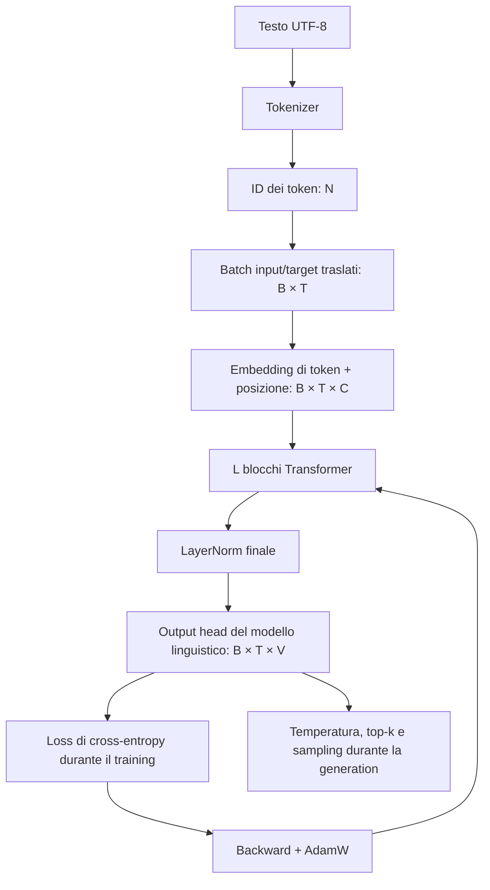

## Mappa end-to-end esplosa

Il diagramma compatto mostra il percorso principale. La mappa seguente
scompone deliberatamente lo stesso sistema nei passaggi didattici più piccoli:
preparazione dei dati, trasformazioni dei tensor, ottimizzazione, valutazione,
persistenza, resume e generation compaiono in un'unica vista.

```mermaid
flowchart TD
    subgraph DATA["1 · Testo e tokenizer"]
        D01["Individua il percorso del dataset"] --> D02["Leggi i byte dal file"]
        D02 --> D03["Decodifica UTF-8"]
        D03 --> D04["Conserva il testo nell'ordine originale"]
        D04 --> D05["Osserva i simboli o le sequenze di byte"]
        D05 --> D06["Costruisci o carica il vocabulary del tokenizer"]
        D06 --> D07["Definisci il contratto token → ID"]
        D07 --> D08["Definisci il contratto ID → token"]
        D08 --> D09["Codifica il testo"]
        D09 --> D10["Verifica il round trip encode/decode"]
        D10 --> D11["Produci il flusso ordinato di N token"]
    end

    subgraph PREP["2 · Preparazione del dataset"]
        P01["Assegna i documenti al training set o al validation set"] --> P02["Tokenizza ciascuno split"]
        P02 --> P03["Archivia gli ID token compatti in uint16"]
        P03 --> P04["Scrivi train.bin"]
        P03 --> P05["Scrivi val.bin"]
        P04 --> P06["Registra il tokenizer e il conteggio dei token"]
        P05 --> P06
        P06 --> P07["Calcola l'hash dei metadati stabili"]
        P04 --> P08["Calcola l'hash dei byte di training"]
        P05 --> P09["Calcola l'hash dei byte di validation"]
        P07 --> P10["Costruisci il fingerprint del dataset"]
        P08 --> P10
        P09 --> P10
        P10 --> P11["Verifica completezza e identità"]
        P11 --> P12["Apri i file dei token con memmap"]
    end

    D11 --> P01

    subgraph RUNTIME["2A · Controlli numerici del runtime"]
        RT01["Importa PyTorch"] --> RT02["Controlla la versione di PyTorch"]
        RT02 --> RT03["Crea un tensor intero noto"]
        RT03 --> RT04["Verifica la shape 2 × 4"]
        RT04 --> RT05["Controlla la prima riga"]
        RT05 --> RT06["Controlla la seconda colonna"]
        RT06 --> RT07["Conferma il dtype intero"]
        RT07 --> RT08["Definisci il riferimento tensoriale della lezione"]
    end

    D11 -. "controllo didattico del runtime" .-> RT01

    subgraph BATCH["3 · Esempi e batch di training"]
        B01["Scegli lo split dei dati"] --> B02["Verifica N > lunghezza del contesto T"]
        B02 --> B03["Campiona B posizioni iniziali valide"]
        B03 --> B04["Costruisci la griglia delle posizioni B × T+1"]
        B04 --> B05["Leggi le finestre di token"]
        B05 --> B06["Converti uint16 in int64"]
        B06 --> B07["Ricava X eliminando l'ultimo token"]
        B06 --> B08["Ricava Y eliminando il primo token"]
        B07 --> B09["Shape di X: B × T"]
        B08 --> B10["Shape di Y: B × T"]
        B09 --> B11["Abilita opzionalmente il pinning della memoria host per CUDA"]
        B10 --> B11
        B11 --> B12["Trasferisci batch su device selezionato"]
    end

    P12 --> B01

    subgraph BIGRAM["3A · Percorso didattico bigram"]
        BG01["Prendi l'ID del token corrente"] --> BG02["Usa l'ID come indice di riga nella tabella V × V"]
        BG02 --> BG03["Restituisci V logits per ciascuna posizione"]
        BG03 --> BG04["Appiattisci B × T × V in BT × V"]
        BG04 --> BG05["Confronta con i target appiattiti"]
        BG05 --> BG06["Calcola la loss di cross-entropy"]
        BG06 --> BG07["Azzera i gradienti precedenti"]
        BG07 --> BG08["Esegui il backward pass"]
        BG08 --> BG09["Aggiorna la tabella degli score bigram"]
        BG09 --> BG10["Usa i logits dell'ultima posizione"]
        BG10 --> BG11["Applica la softmax e campiona l'ID successivo"]
        BG11 --> BG12["Aggiungi l'ID e ripeti"]
        BG12 --> BG13["Confronta prefissi che terminano con lo stesso token"]
        BG13 --> BG14["Osserva la stessa distribuzione del token successivo"]
        BG14 --> BG15["Individua il limite della memoria a un solo token"]
        BG15 --> BG16["Sostituisci la tabella diretta V × V con embedding e attention"]
    end

    B09 -. "primo ciclo completo di apprendimento" .-> BG01
    B10 -. "target next-token corretti" .-> BG05

    subgraph BUILD["3B · Costruzione e inizializzazione del modello"]
        MC01["Carica e convalida ModelConfig"] --> MC02["Verifica C divisibile per H"]
        MC02 --> MC03["Calcola D = C / H"]
        MC03 --> MC04["Alloca il token embedding V × C"]
        MC04 --> MC05["Alloca il position embedding T × C"]
        MC05 --> MC06["Alloca L blocchi Transformer"]
        MC06 --> MC07["Alloca la LayerNorm finale"]
        MC07 --> MC08["Alloca l'output head C → V"]
        MC08 --> MC09["Inizializza gli embedding e i pesi lineari"]
        MC09 --> MC10["Scala le proiezioni residue per profondità"]
        MC10 --> MC11{"Condividere i pesi dei token in input e output?"}
        MC11 -- "Sì" --> MC12["Condividi il peso del token embedding con l'output head"]
        MC11 -- "No" --> MC13["Mantieni indipendente il peso dell'output head"]
        MC12 --> MC14["Sposta lo stato del modello sul device selezionato"]
        MC13 --> MC14
        MC14 --> MC15["Crea gruppi AdamW con e senza weight decay"]
        MC15 --> MC16["Esegui l'autocontrollo dei gradienti del backend quando richiesto"]
        MC16 --> MC17["Modello pronto per il forward e il training"]
    end

    RT08 --> MC01
    BG16 --> MC01

    subgraph EMBED["4 · Gli ID diventano stati del modello"]
        E01["ID di ingresso X: B × T"] --> E02["Cerca le righe del token embedding"]
        E02 --> E03["Vettori dei token: B × T × C"]
        E04["Crea le posizioni 0…T−1"] --> E05["Cerca le righe del position embedding"]
        E05 --> E06["Vettori di posizione: T × C"]
        E03 --> E07["Applica il broadcasting e somma token + posizione"]
        E06 --> E07
        E07 --> E08["Applica il dropout degli embedding durante il training"]
        E08 --> E09["Residual stream iniziale R₀: B × T × C"]
    end

    B12 --> E01
    MC17 --> E02

    subgraph BLOCK["5 · Un blocco Transformer pre-norm · ripetuto L volte"]
        T01["Residual stream Rₗ"] --> T02["LayerNorm sui C canali"]
        T02 --> T02A{"Come implementare la proiezione Q/K/V?"}
        T02A -- "fusa" --> T03["Proietta QKV insieme: B × T × 3C"]
        T03 --> T04["Separa Q, K e V"]
        T02A -- "head didattiche separate" --> T03S["Applica proiezioni separate per query, key e value"]
        T03S --> T04
        T04 --> T05["Riorganizza le head: B × H × T × D"]
        T05 --> T05A{"Come implementare l'attention?"}
        T05A -- "percorso didattico esplicito" --> T06["Moltiplica Q per la trasposta di K"]
        T06 --> T07["Score di attention: B × H × T × T"]
        T07 --> T08["Scala gli score per 1 / √D"]
        T08 --> T09["Applica la maschera causale triangolare inferiore"]
        T09 --> T10["Sostituisci gli score futuri con −∞"]
        T10 --> T11["Applica la softmax a ogni riga"]
        T11 --> T12["I pesi di attention sommano a 1"]
        T12 --> T13["Applica il dropout dell'attention durante il training"]
        T13 --> T14["Moltiplica i pesi di attention per V"]
        T14 --> T15["Contesto per ogni head: B × H × T × D"]
        T05A -- "percorso SDPA ottimizzato" --> T14F["Esegui scaled dot-product attention con il flag causale"]
        T14F --> T15
        T15 --> T16["Trasponi e concatena le head"]
        T16 --> T17["Contesto ricomposto: B × T × C"]
        T17 --> T18["Applica la proiezione di output dell'attention C → C"]
        T18 --> T19["Applica il dropout di output durante il training"]
        T19 --> T20["Somma l'aggiornamento dell'attention a Rₗ"]
        T01 --> T20
        T20 --> T21["Residual stream intermedio Uₗ"]
        T21 --> T22["Seconda LayerNorm sui C canali"]
        T22 --> T23["Espansione MLP C → 4C"]
        T23 --> T24["Applica la non linearità GELU"]
        T24 --> T25["Proiezione dell'MLP 4C → C"]
        T25 --> T26["Applica il dropout dell'MLP durante il training"]
        T26 --> T27["Somma l'aggiornamento dell'MLP a Uₗ"]
        T21 --> T27
        T27 --> T28["Residual stream successivo Rₗ₊₁: B × T × C"]
        T28 --> T29{"C'è un altro blocco?"}
        T29 -- "Sì" --> T01
    end

    E09 --> T01

    subgraph OUTPUT["6 · Previsione sul vocabulary"]
        O01["Residual stream finale R_L"] --> O02["Applica la LayerNorm finale"]
        O02 --> O03{"Training o generation?"}
        O03 -- "training" --> O04["Mantieni tutte le posizioni temporali"]
        O03 -- "generation" --> O05["Seleziona soltanto l'ultima posizione temporale"]
        O04 --> O06["Proietta C → V, eventualmente in chunk del vocabulary"]
        O05 --> O06
        O06 --> O07["Logits grezzi sul vocabulary"]
        O07 --> O08["Shape di training: B × T × V"]
        O07 --> O09["Shape di generation: B × V"]
    end

        T29 -- "No" --> O01

    subgraph LOSS["7 · Loss e backward pass"]
        L01["Logits di training B × T × V"] --> L02["Appiattisci i logits in BT × V"]
        L03["ID target Y: B × T"] --> L04["Appiattisci i target in BT"]
        L02 --> L05["Log-softmax stabile all'interno della cross-entropy"]
        L04 --> L05
        L05 --> L06["Seleziona le log-probabilità dei token corretti"]
        L06 --> L07["Cambia segno e calcola la media di tutti i BT valori"]
        L07 --> L08["Loss scalare"]
        L08 --> L09["Dividi per i K step di accumulo"]
        L09 --> L10["Esegui il backward con autograd attraverso l'output head"]
        L10 --> L11["Propaga all'indietro attraverso la norma finale e i blocchi"]
        L11 --> L12["Propaga all'indietro attraverso attention, MLP ed embedding"]
        L12 --> L13["Accumula i gradienti dei parametri"]
    end

    O08 --> L01
    B10 --> L03

    subgraph UPDATE["8 · Controlli sui gradienti e aggiornamento dell'optimizer"]
        U01["Gradienti accumulati"] --> U02{"Sono stati completati tutti i K micro-batch?"}
        U02 -- "No" --> B01
        U02 -- "Sì" --> U03["Ripristina la scala dei gradienti quando la mixed precision è attiva"]
        U03 --> U04["Verifica che i gradienti siano finiti"]
        U04 --> U05["Misura la norma globale grezza dei gradienti"]
        U05 --> U06{"Sotto la soglia di integrità?"}
        U06 -- "No" --> U07["Azzera i gradienti e riprova lo step protetto"]
        U07 --> B01
        U06 -- "Sì" --> U08["Applica il clipping della norma globale, se configurato"]
        U08 --> U09["Calcola il learning rate previsto dallo schedule"]
        U09 --> U10["Warm-up o decadimento cosinusoidale"]
        U10 --> U11["Aggiorna il primo momento di Adam"]
        U11 --> U12["Aggiorna il secondo momento di Adam"]
        U12 --> U13["Applica la correzione del bias"]
        U13 --> U14["Applica il weight decay disaccoppiato ai gruppi selezionati"]
        U14 --> U15["Aggiorna i parametri"]
        U15 --> U16["Azzera i buffer dei gradienti"]
        U16 --> U17["Avanza lo step di training"]
    end

    L13 --> U01

    subgraph EVAL["9 · Valutazione e diagnostica"]
        V01["Raggiungi lo step di valutazione"] --> V02["Porta il modello in modalità di valutazione"]
        V02 --> V03["Disabilita la registrazione dei gradienti"]
        V03 --> V04["Campiona K batch di training"]
        V03 --> V05["Campiona K batch di validation"]
        V04 --> V06["Calcola la loss media di training"]
        V05 --> V07["Calcola la loss media di validation"]
        V07 --> V08["Misura il guadagno del target sensibile al contesto, se abilitato"]
        V06 --> V09["Registra metriche"]
        V08 --> V09
        V09 --> V10["Ripristina la modalità di training"]
    end

    U17 --> V01

    subgraph SAVE["10 · Ciclo di vita dei checkpoint best/latest"]
        C01["Metriche di valutazione"] --> C02["Assembla lo stato del modello"]
        C02 --> C03["Aggiungi lo stato dell'optimizer e del GradScaler"]
        C03 --> C04["Aggiungi le configurazioni di modello, training e tokenizer"]
        C04 --> C05["Aggiungi step, metriche e loss migliore"]
        C05 --> C06["Aggiungi gli stati RNG"]
        C06 --> C07["Aggiungi il fingerprint del dataset"]
        C07 --> C08["Scrivi un checkpoint latest temporaneo"]
        C08 --> C09["Sostituisci atomicamente il checkpoint latest"]
        C01 --> C10{"La loss di validation è migliorata?"}
        C10 -- "Sì" --> C11["Scrivi un checkpoint best temporaneo"]
        C11 --> C12["Sostituisci atomicamente il checkpoint best"]
        C10 -- "No" --> C13["Mantieni il checkpoint best precedente"]
    end

    V09 --> C01
    C09 --> B01
    C12 --> B01
    C13 --> B01

    subgraph RESUME["11 · Resume"]
        R01["Scegli il checkpoint latest della stessa famiglia"] --> R02["Carica il contenuto in sicurezza"]
        R02 --> R03["Ricostruisci la configurazione strutturale del modello"]
        R03 --> R04["Carica i parametri del modello"]
        R04 --> R05["Carica lo stato dell'optimizer e del GradScaler"]
        R05 --> R06["Ripristina gli stati RNG"]
        R06 --> R07["Verifica tokenizer e dataset fingerprint"]
        R07 --> R08["Continua dallo step salvato + 1"]
    end

    C09 --> R01
    R08 --> B01

    subgraph GENERATE["12 · Generation autoregressiva"]
        G01["Scegli il checkpoint best"] --> G02["Ricostruisci il modello dalla configurazione salvata"]
        G02 --> G03["Carica i pesi appresi"]
        G03 --> G04["Sposta il modello sul device e usa la modalità di valutazione"]
        G04 --> G05["Codifica il prompt in ID dei token"]
        G05 --> G06["Riduci il prefisso agli ultimi T token"]
        G06 --> G07["Esegui embedding e forward pass del Transformer"]
        G07 --> G08["Proietta la posizione finale per ottenere V logits"]
        G08 --> G09["Dividi i logits per la temperatura"]
        G09 --> G10["Mantieni opzionalmente i top-k logits"]
        G10 --> G11["Imposta a −∞ i logits esclusi"]
        G11 --> G12["Applica la softmax"]
        G12 --> G13["Campiona un token dalla distribuzione multinomiale"]
        G13 --> G14["Aggiungi l'ID campionato al prefisso"]
        G14 --> G15{"Hai raggiunto il numero di token richiesto?"}
        G15 -- "No" --> G06
        G15 -- "Sì" --> G16["Decodifica tutti gli ID e ricostruisci il testo"]
        G16 --> G17["Restituisci il testo generato"]
    end

    C12 --> G01
    O09 -. "percorso dell'ultima posizione" .-> G09
```

## Il contratto matematico completo

Per gli ID di input $X\in\{0,\ldots,V-1\}^{B\times T}$:

$$
R_0 = E_{tok}[X] + E_{pos}[0:T]
$$

Per ogni blocco Transformer pre-norm:

$$
U_l = R_l + \operatorname{MHA}(\operatorname{LN}_1(R_l))
$$

$$
R_{l+1} = U_l + \operatorname{MLP}(\operatorname{LN}_2(U_l))
$$

I logits e la distribuzione in uscita sono:

$$
Z = \operatorname{LN}_f(R_L)W_{vocab}^{\mathsf T},\qquad
p(y\mid x_{\le t})=\operatorname{softmax}(Z_{b,t,:})
$$

e la negative log-likelihood media per il token successivo è:

$$
\mathcal L=-\frac{1}{BT}\sum_{b=1}^{B}\sum_{t=1}^{T}
\log p\left(Y_{b,t}\mid X_{b,\le t}\right).
$$

---


# Modulo 0 — Come usare questo corso


## Lezione 00 — Come usare questo corso

### Sintesi della lezione: obiettivo e risultato

- **Prima:** hai aperto il corso, ma non sai ancora che cosa installare, che cosa
  cliccare o come entra in gioco il repository GitHub.
- **Obiettivo:** capire la piattaforma, il repository di codice collegato e il
  setup minimo prima della prima lezione tecnica.
- **Dopo:** sai come leggere una lezione, dove trovare il suo codice, che cosa
  significa ogni sezione del corso e che cosa serve sul computer se vuoi
  eseguire il progetto.
- **Vincolo:** non ti servono hardware costoso o competenze pregresse di AI per
  iniziare a leggere. Il corso procede con passaggi incrementali, dal testo
  semplice a un piccolo GPT.

### Orientamento rapido

Il corso è composto da due parti principali: il sito web e il repository
GitHub.

Il **sito web** contiene le spiegazioni. Ogni lezione indica quale passaggio
stai studiando, perché serve e quale stato raggiunge il progetto dopo quel
passaggio.

Il **repository GitHub** contiene i file Python reali usati dal corso. Quando
una lezione parla di un file come
`study/lessons/01_read_text.py` o `study/snapshots/lesson_12/model.py`, quel
file si trova nel repository.

Il pannello **Programmazione** mostra il codice esatto della lezione corrente,
il diff rispetto alla lezione precedente e lo snapshot completo del progetto in
quel punto. Usa il link al repository quando vuoi aprire lo stesso codice
direttamente su GitHub.

Puoi leggere il corso senza installare nulla. Il setup qui sotto ti serve solo
se vuoi eseguire il codice sul tuo computer.

### Che cosa costruisce davvero questo corso

Questo corso costruisce da zero un **piccolo GPT decoder-only di base**. In
pratica il modello impara il task di pretraining: dato un prefisso visibile,
prevedere il token successivo. Non è ancora un assistente in stile ChatGPT. Lo
scopo è rendere comprensibile il meccanismo prima di aggiungere eventuali
livelli di adattamento successivi.

| Area | Cosa costruisci qui | Cosa resta fuori dal corso principale |
|---|---|---|
| Base model | Un piccolo Transformer GPT-like addestrato con next-token prediction. | Un prodotto conversazionale con ruoli, tools, memory, moderation o backend chat ospitato. |
| Pretraining | Percorso dati, tokenizer, batch, loss, optimizer, checkpoint e generation loop per causal language modeling. | Raccolta dati su scala internet, training distribuito grande e data governance di produzione oltre ai controlli implementati. |
| Inference | Caricamento di un checkpoint salvato e sampling di continuazioni da un prompt. | Retrieval, tool use, web browsing, memoria a lungo termine o sistemi di safety policy. |
| Fine-tuning | Il punto in cui il fine-tuning si inserirebbe dopo avere un base model. | Classification fine-tuning, instruction fine-tuning, RLHF e LoRA sono percorsi futuri, non passaggi richiesti in questa build. |

### Che cosa ti serve prima di iniziare

Per leggere il corso ti basta un computer normale. Un laptop è sufficiente.

Se vuoi eseguire il codice, il setup più semplice è:

| Risorsa | Minimo | Perché serve |
|---|---|---|
| Computer | macOS, Linux o Windows | Il progetto è normale codice Python e PyTorch. |
| CPU/RAM | CPU recente da laptop e 8 GB di RAM | Bastano per gli script didattici e gli esempi piccoli. |
| GPU | Opzionale | Aiuta per training più lunghi, ma non serve per le prime lezioni. |
| Python | Python 3.12 consigliato | Esegue gli script delle lezioni e il progetto finale. |
| Git | Qualsiasi installazione recente di Git | Scarica il repository e permette di vedere le modifiche. |
| Account GitHub | Opzionale per leggere, utile per star/fork | Puoi vedere il codice senza account, ma un account aiuta se vuoi una tua copia. |
| Editor | VS Code o qualunque editor di codice | Utile quando vuoi aprire i file in locale. |

Non devi conoscere il deep learning prima della Lezione 01. Devi solo essere a
tuo agio nel leggere Python semplice, installare un pacchetto e usare il
terminale a livello base. Token, tensor, loss, attention e training vengono
introdotti quando diventano necessari.

### Il repository GitHub collegato

Il codice vive qui:

[github.com/ferdinandobons/learn-gpt](https://github.com/ferdinandobons/learn-gpt)

Usa il repository in tre modi:

1. **Leggi lo script della lezione corrente.** I file in `study/lessons/` sono
   piccoli script eseguibili per la lezione.
2. **Ispeziona lo snapshot della lezione.** I file in
   `study/snapshots/lesson_XX/` mostrano lo stato del progetto dopo una
   lezione specifica.
3. **Confronta che cosa è cambiato.** Il pannello Programmazione mostra il diff
   per vedere solo le parti nuove o modificate.

Il repository non è un compito separato. È il codice sorgente che il corso
spiega. Sito e repository vanno usati insieme: leggi la spiegazione sul sito,
poi apri il codice associato quando vuoi verificare l'implementazione esatta.

Quando una lezione collega del codice, leggi quei link così:

| Posizione del codice | Come usarla |
|---|---|
| `study/lessons/XX_*.py` | Esegui o ispeziona il piccolo script che dimostra la lezione. |
| `study/snapshots/lesson_XX/` | Vedi l'intero stato del progetto dopo quella lezione. |
| Diff di Programmazione | Concentrati solo su ciò che è cambiato rispetto alla lezione precedente. |
| Link al repository GitHub | Apri gli stessi file fuori dal viewer, fai fork o clona il progetto in locale. |

### Che cosa significa ogni parte della lezione

Ogni lezione tecnica ripete la stessa struttura, così non devi indovinare come
leggerla.

| Parte | Significato |
|---|---|
| **Prima** | Lo stato del progetto prima che questa lezione aggiunga qualcosa. |
| **Obiettivo** | L'unico compito che la lezione cerca di completare. |
| **Dopo** | Il nuovo stato quando la lezione è completa. |
| **Vincolo** | La regola che deve restare vera mentre il progetto cambia. |
| **Comprendere la trasformazione** | La spiegazione in linguaggio naturale. Parti da qui. |
| **Trasformazione, passo dopo passo** | Il movimento preciso da input a output. |
| **Dove siamo arrivati** | Che cosa è cambiato, che cosa è rimasto vero e che cosa viene dopo. |
| **Grafico** | Dove si trova la lezione nell'intera pipeline GPT. |
| **Matematica** | Tensor shape, notazione, formule e piccoli esempi svolti. |
| **Programmazione** | Sintassi, diff del codice e snapshot completo del sorgente. |

Se una lezione ti sembra difficile, non aprire tutti i pannelli insieme. Leggi
prima la lezione centrale, poi apri solo il pannello che risponde alla domanda
che hai in quel momento.

### Il modo migliore per seguire il corso

Usa questo ritmo:

1. Leggi **Prima**, **Obiettivo**, **Dopo** e **Vincolo**.
2. Leggi la spiegazione centrale.
3. Apri **Grafico** se hai perso la visione d'insieme.
4. Apri **Matematica** se ti servono shape o formule.
5. Apri **Programmazione** se vuoi il codice.
6. Usa il link GitHub della lezione quando vuoi la versione nel repository.
7. Vai avanti solo quando sai spiegare il cambiamento in una frase.

Il corso è cumulativo. La Lezione 01 parte dalla lettura del testo. Poi arrivano
token ID, batch, tensor, primo modello, embedding, attention, blocchi
Transformer, training, checkpoint, generation e runtime di training
production-ready. Non compare tutto insieme.

### Cosa succede dopo

La Lezione 01 avvia la costruzione vera. Legge il piccolo file di testo
didattico e trasforma testo esterno in una stringa Python. Sembra semplice
perché è semplice. Il punto è rendere affidabile il primo contratto prima di
aggiungere tokenizer, tensor, modelli e training.


# Modulo 1 — Il testo diventa token


## Lezione 01 — Leggi il testo

### Sintesi della lezione: obiettivo e risultato

- **Prima:** byte memorizzati in un file, ancora esterni al programma
- **Obiettivo:** caricare il testo in Python senza alterarne contenuto e ordine
- **Dopo:** una stringa Python ordinata, pronta per essere ispezionata
- **Vincolo:** la decodifica deve essere esplicita e ripetibile; nessun carattere può cambiare posizione

### Comprendere la trasformazione

Il corso comincia da un'operazione volutamente semplice: **portare il testo dal
disco dentro il programma**. Lo script reale legge il file più lungo
`data/study_sample.txt`; per rendere visibile la trasformazione, il corso usa
anche un mini-file didattico che contiene `The cat sleeps here.`.
Quella frase è l'esempio condiviso, non il contenuto letterale della prima riga
del dataset reale. In entrambi i casi, sul disco esiste soltanto una sequenza di
byte che Python deve interpretare con l'encoding `UTF-8`.

Nel mini-file, il risultato non è ancora una previsione: è semplicemente la
stringa Python `"The cat sleeps here."`. Lo script esegue la stessa operazione
sull'intero study sample. Spazi e punteggiatura fanno parte della sequenza
esattamente come le lettere. Se uno spazio venisse eliminato o due caratteri si
scambiassero di posizione, le lezioni successive costruirebbero token e target
da un testo diverso. La lettura stabilisce quindi il **contratto dei dati** su
cui poggerà il modello.

La chiamata `read_text(encoding="utf-8")` esegue due azioni collegate. Prima
apre il file e legge i byte; poi li decodifica usando la regola UTF-8. Con i
caratteri ASCII più semplici, come `T` o `h`, un byte corrisponde a un
carattere. Altri simboli, per esempio `è`, possono richiedere più byte. Perciò
il numero di byte del file e il numero di caratteri della stringa non devono
necessariamente coincidere, mentre **l'ordine logico dei caratteri deve
rimanere invariato**.

Alla fine controlliamo due segnali molto concreti: `len(text)` ci dice quanti
caratteri Python sono stati ottenuti e `text[:500]` mostra un breve campione.
Questi controlli non modificano il contenuto; servono a verificare che il
programma stia leggendo il file atteso. Non abbiamo ancora iniziato a
“insegnare” nulla al modello: abbiamo soltanto creato una sorgente testuale
affidabile dalla quale, nella prossima lezione, potremo ricavare i token.

### Trasformazione, passo dopo passo

1. **INPUT — Individua il file sorgente**

   L'oggetto reale è `data/study_sample.txt`. Il mini-file
   `The cat sleeps here.` rende ispezionabile la stessa operazione su una
   sequenza più corta.

   **Cosa osservare:** il path identifica il file, ma il suo contenuto non è
   ancora una stringa Python.

2. **OPERATION — Decodifica i byte come UTF-8**

   ```learngpt-visual
   {
     "type": "labeled-grid",
     "title": "Dai byte UTF-8 ai caratteri",
     "description": "Un carattere può occupare uno o più byte; la decodifica ricostruisce i simboli leggibili senza cambiare il loro ordine.",
     "columns": ["A", "è", "."],
     "rows": [
       {
         "label": "byte UTF-8",
         "cells": [
           {"value": "[65]"},
           {"value": "[195 168]", "state": "highlighted"},
           {"value": "[46]"}
         ]
       },
       {
         "label": "carattere decodificato",
         "cells": [
           {"value": "A"},
           {"value": "è", "state": "highlighted"},
           {"value": "."}
         ]
       }
     ]
   }
   ```

   **Cosa osservare:** l'encoding è dichiarato esplicitamente, quindi la stessa
   sequenza di byte viene interpretata sempre nello stesso modo.

3. **INTERMEDIATE STATE — Conserva la sequenza completa**

   ```text
   [T][h][e][ ][c][a][t][ ][s][l][e][e][p][s][ ][h][e][r][e][.]
   ```

   **Cosa osservare:** lettere, spazi e punteggiatura mantengono la loro
   posizione; non esistono ancora confini di token decisi dal modello.

4. **CHECK — Ispeziona lunghezza e anteprima**

   `len(text)` misura i caratteri ottenuti e `text[:500]` ne mostra l'inizio
   senza alterare la stringa.

   **Cosa osservare:** i due controlli confermano che il dato letto è plausibile
   prima di usarlo nelle trasformazioni successive.

5. **OUTPUT — Ottieni il testo utilizzabile dal programma**

   L'uscita è una stringa Python ordinata. Nel mini-file didattico è
   `"The cat sleeps here."`; nello script è il contenuto completo dello study
   sample.

   **Cosa osservare:** è cambiata la rappresentazione, da byte esterni a
   stringa in memoria; il contenuto linguistico è rimasto lo stesso.

### Dove siamo arrivati

Ora Python possiede una sequenza testuale stabile e ispezionabile. Questo è lo
status quo da cui partirà il tokenizer: non un insieme di parole già comprese,
ma una stringa nella quale ogni carattere, spazio e segno di punteggiatura ha
una posizione precisa.

- **Cambiato:** il testo è passato dal file a una stringa Python in memoria.
- **Preservato:** contenuto e ordine dei caratteri.
- **Prossimo passo:** trasformare i caratteri in identificatori numerici.

> **Se ricordi una sola cosa:** leggere il testo significa cambiare la sua
> rappresentazione, non il suo contenuto.

### Come leggere la matematica

Non esiste ancora un'equazione di modello. Le lettere sono solo nomi per le dimensioni, non valori calcolati.

| Notazione | Leggilo come | Significato qui |
|---|---|---|
| $M$ | M | numero di byte memorizzati nel file sorgente |
| $N$ | N | numero di caratteri ordinati o token in una sequenza |

### Esempio visivo svolto

> **Stato dell'esempio ricorrente:** formalizza il contratto con cui i byte del
> mini-file didattico `The cat sleeps here.` diventano caratteri ordinati; lo
> script applica lo stesso contratto a `data/study_sample.txt`.

Indichiamo il contenuto binario del file come una sequenza di lunghezza $M$:

$$
b=(b_0,b_1,\ldots,b_{M-1}),\qquad b_i\in\{0,\ldots,255\}.
$$

La decodifica UTF-8 produce una sequenza Unicode di lunghezza $N$:

$$
x=\operatorname{decode}_{UTF8}(b)
  =(x_0,x_1,\ldots,x_{N-1}).
$$

Il rapporto tra $M$ e $N$ dipende dai caratteri, non dalla logica del modello:

| Testo | Byte UTF-8 | $M$ byte | $N$ caratteri |
|---|---|---:|---:|
| `The c` | `[84, 104, 101, 32, 99]` | 5 | 5 |
| `Aè.` | `[65, 195, 168, 46]` | 4 | 3 |

La stringa non ha una shape tensoriale, ma possiede già una dimensione
sequenziale: `len(text)=N`. Il contratto corretto richiede che l'ordine degli
$x_i$ sia quello codificato nel file e, per byte UTF-8 validi, che il round
trip recuperi la sorgente:

$$
\operatorname{encode}_{UTF8}
\bigl(\operatorname{decode}_{UTF8}(b)\bigr)=b.
$$

Questa relazione non afferma che un byte equivalga a un carattere; afferma che
decodifica e ricodifica concordano sullo stesso contenuto. In questa lezione
non avvengono proiezioni né apprendimento: si stabiliscono conteggio, ordine e
reversibilità della rappresentazione testuale che alimenterà il tokenizer.

### Codice di riferimento aggiunto in questa lezione

```python
PROJECT_DIR = Path(__file__).resolve().parents[2]
DATASET_PATH = PROJECT_DIR / "data" / "study_sample.txt"
text = DATASET_PATH.read_text(encoding="utf-8")
print("Number of characters:", len(text))
print(text[:500])
```

Il punto di ingresso completo è `study/lessons/01_read_text.py`.

### Sintassi e logica

- `Path(__file__)` rappresenta lo script corrente; `resolve()` rende assoluto
  il suo path e `parents[2]` raggiunge la radice del repository senza dipendere
  dalla directory corrente del terminale.
- L'operatore `/` applicato a oggetti `Path` unisce i componenti del percorso in
  modo portabile su macOS, Linux e Windows.
- `read_text(encoding="utf-8")` apre, legge, decodifica e chiude il file.
  Dichiarare l'encoding rende deterministica la conversione da byte a caratteri.
- `len(text)` conta i caratteri Unicode della stringa Python, non i byte UTF-8
  usati per memorizzarla.
- `text[:500]` è una slice non mutante: parte dall'indice `0` e si ferma prima
  dell'indice `500`, mostrando un'anteprima senza modificare `text`.

## Lezione 02 — Character tokenizer

### Sintesi della lezione: obiettivo e risultato

- **Prima:** una stringa decodificata i cui caratteri non hanno indirizzi numerici
- **Obiettivo:** assegnare a ogni carattere distinto un ID stabile e costruire la mappa inversa
- **Dopo:** un character vocabulary deterministico e reversibile
- **Vincolo:** l'ID è soltanto un indirizzo categorico e non deve cambiare il carattere rappresentato

### Comprendere la trasformazione

Python può già leggere il testo, ma una rete neurale non può usare direttamente
un carattere come `c` per scegliere una riga. Ha bisogno di un indirizzo
intero. Se `c` riceve l'ID `4` e `a` l'ID `3`, questo non rende `c` più grande o
più importante: i due numeri puntano soltanto a righe diverse.

I sistemi GPT moderni usano la stessa idea, ma con un tokenizer più potente.
Di solito non assegnano un ID a ogni singolo carattere né un ID a ogni parola.
Un approccio di produzione comune è BPE, dove frammenti frequenti di byte o
testo ricevono un proprio token ID e il testo raro può comunque essere
scomposto in pezzi più piccoli. Alcuni token speciali possono inoltre
riservare ID per confini come end-of-text. Questa lezione parte
intenzionalmente dai caratteri perché l'intero vocabulary resta visibile sulla
pagina. Il concetto da conservare è lo stesso che useremo più avanti con BPE:
il modello riceve token ID, e il tokenizer definisce che cosa significa ogni ID.

`set(text)` conserva una copia di ogni carattere distinto, ma un set non
definisce un ordine stabile. `sorted(...)` aggiunge la regola necessaria alla
riproducibilità: lo stesso insieme di caratteri produce sempre la stessa lista.
`enumerate(...)` può quindi assegnare gli indirizzi `0, 1, ..., V-1`.

Costruiamo due dizionari nello stesso ciclo. `char_to_id` traduce un carattere
nel suo numero; `id_to_char` risponde alla domanda inversa. Devono rimanere
inversi esatti: ogni carattere noto ha un solo ID valido e ogni ID valido
recupera un solo carattere.

La frase ricorrente usa un piccolo vocabulary didattico per rendere visibile la
mappa. Lo script reale costruisce invece il vocabulary sull'intero
`study_sample.txt`, quindi i suoi ID concreti possono essere diversi. Lo script
esegue anche un breve smoke test manuale; la lezione 03 trasformerà quei lookup
in funzioni esplicite di encode e decode.

### Trasformazione, passo dopo passo

1. **INPUT — Parti dal testo decodificato**

   Il dataset completo definisce i caratteri validi; `The cat sleeps here.`
   rimane il piccolo esempio visivo.

   **Cosa osservare:** nel testo i caratteri si ripetono e non possiedono ancora
   un ID.

2. **OPERATION — Conserva un solo esemplare per carattere**

   ```learngpt-mermaid
   flowchart LR
       A["Testo con ripetizioni"] -->|"set(text)"| B["Caratteri unici, non ordinati"]
   ```

   **Cosa osservare:** i duplicati scompaiono, ma il set non è ancora un
   vocabulary riproducibile.

3. **OPERATION — Stabilisci un ordine stabile**

   `sorted(set(text))` produce una lista deterministica.

   **Cosa osservare:** è il sorting, non il set, a rendere ripetibili gli ID.

4. **OPERATION — Costruisci le mappe inverse**

   ```learngpt-mermaid
   flowchart LR
       C["Carattere"] -->|"char_to_id"| I["ID"]
       I -->|"id_to_char"| C
   ```

   **Cosa osservare:** `enumerate` genera gli ID e alimenta entrambi i dizionari.

5. **OUTPUT — Ottieni un vocabulary reversibile**

   Il programma possiede `V` indirizzi validi, da `0` a `V-1`.

   **Cosa osservare:** cambia la rappresentazione, non l'identità dei caratteri.

### Dove siamo arrivati

Il progetto possiede ora un confine stabile tra simboli testuali e indirizzi
numerici. Non esistono ancora tensor, previsioni o valori appresi: abbiamo
soltanto definito l'alfabeto legale e il nome numerico di ogni simbolo.

- **Cambiato:** ogni carattere distinto possiede un ID deterministico.
- **Preservato:** identità dei caratteri e ordine delle sequenze.
- **Prossimo passo:** applicare le due mappe a intere sequenze.

> **Se ricordi una sola cosa:** un token ID è un indirizzo nel vocabulary, non
> una quantità o un punteggio di significato.

### Come leggere la matematica

Leggi la freccia di mappatura come “viene convertito in”. Le parentesi graffe
descrivono l'insieme degli ID interi ammessi.

| Notazione | Leggilo come | Significato qui |
|---|---|---|
| $N$ | N | numero di caratteri ordinati o token in una sequenza |
| $V$ | V | vocabulary: il numero di possibili ID token |

### Esempio visivo svolto

> **Stato dell'esempio ricorrente:** costruiamo il character vocabulary di
> `The cat sleeps here.`; ogni carattere mostrato qui sotto proviene dalla
> stessa frase.

| Character | spazio | `.` | `T` | `a` | `c` | `e` | `h` | `l` | `p` | `r` | `s` | `t` |
|---|---:|---:|---:|---:|---:|---:|---:|---:|---:|---:|---:|---:|
| ID assegnato | 0 | 1 | 2 | 3 | 4 | 5 | 6 | 7 | 8 | 9 | 10 | 11 |

L'ID è la posizione in un vocabulary stabile; non misura numericamente il
carattere.

Il character tokenizer costruisce due mappe inverse:

$$
f:\text{character}\rightarrow\{0,\ldots,V-1\},\qquad
f^{-1}:\{0,\ldots,V-1\}\rightarrow\text{character}.
$$

Per `cat.`, un possibile ordine del vocabulary è `[".", "a", "c", "t"]`:

| Character | `.` | `a` | `c` | `t` |
|---|---:|---:|---:|---:|
| ID | 0 | 1 | 2 | 3 |

L'ordinamento è importante per la riproducibilità: lo stesso corpus produce la
stessa mappatura a ogni esecuzione. I token ID sono **indirizzi categorici**,
non quantità misurate: l'ID 3 non vale tre volte l'ID 1.

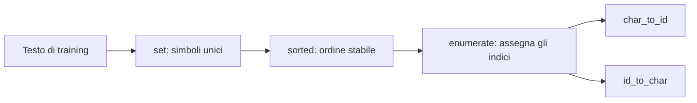

- **Shape:** un testo lungo $N$ caratteri produce una sequenza di $N$ ID; il
  vocabulary contiene $V$ simboli unici.
- **Implementazione:** `study/lessons/02_character_tokenizer.py`.

### Codice di riferimento aggiunto in questa lezione

```python
unique_chars = sorted(set(text))
char_to_id = {}
id_to_char = {}

for token_id, char in enumerate(unique_chars):
    char_to_id[char] = token_id
    id_to_char[token_id] = char
```

Il codice è esercitato da `study/lessons/02_character_tokenizer.py`.

### Sintassi e logica

- `set(text)` rimuove i duplicati. Poiché un set non possiede un ordine utile
  per il vocabulary, `sorted(...)` produce lo stesso elenco a ogni esecuzione.
- `char_to_id = {}` e `id_to_char = {}` creano due dizionari vuoti e
  indipendenti prima del loop.
- `enumerate(unique_chars)` produce coppie `(indice, valore)`; l'indice a base
  zero diventa il token ID.
- `char_to_id[char] = token_id` crea la ricerca in avanti utilizzata durante la codifica.
- `id_to_char[token_id] = char` crea la ricerca inversa, così ogni ID può essere
  decodificato nel carattere corrispondente.

## Lezione 03 — Codifica e decodifica

### Sintesi della lezione: obiettivo e risultato

- **Prima:** una stringa leggibile e due mappe inverse carattere/ID
- **Obiettivo:** convertire un'intera sequenza in ID ordinati e ricostruirla esattamente
- **Dopo:** operazioni encode/decode con un controllo di round trip eseguibile
- **Vincolo:** lunghezza, posizione, spazi e punteggiatura devono sopravvivere in entrambe le direzioni

### Comprendere la trasformazione

La lezione precedente ha definito il lookup di un singolo carattere. Ora
`encode` percorre una stringa da sinistra a destra e applica quel lookup a ogni
posizione. Il risultato è una lista di interi con la stessa lunghezza e lo
stesso ordine del testo.

Nell'esempio, `T`, `h`, `e` e `spazio` diventano `[2, 6, 5, 0]`. I numeri non
vengono sommati o confrontati: ciascuno sostituisce esattamente un carattere
nella stessa posizione. Questa è la prima rappresentazione che il codice
numerico potrà usare.

`decode` esegue il percorso inverso: cerca ogni ID in `id_to_char` e unisce i
caratteri senza aggiungere separatori. Il risultato deve conservare anche
spazi, lettere ripetute e punto finale.

Le due mappe devono essere davvero inverse. Se `char_to_id["h"]` restituisce
`6`, allora `id_to_char[6]` deve restituire di nuovo `"h"`. Questo rende ogni
posizione verificabile separatamente: possiamo osservare il carattere
originale, l'ID intermedio e il carattere ricostruito senza affidarsi a una
somiglianza generica tra le due frasi. Anche la lunghezza deve restare uguale:
un ID in più o in meno sposterebbe tutte le posizioni successive.

Il controllo centrale è `decode(encode(sample)) == sample`. Lo script reale
stampa il risultato booleano; un test automatico potrebbe usare un `assert`
sulla stessa condizione. Un carattere sconosciuto fallisce esplicitamente,
perché questo tokenizer didattico non definisce un fallback.

### Trasformazione, passo dopo passo

1. **INPUT — Abbina testo e vocabulary**

   Parti da `"The cat sleeps here."` e dalle due mappe inverse.

   **Cosa osservare:** ogni carattere del sample deve essere già presente.

2. **OPERATION — Esegui l'encode posizione per posizione**

   ```learngpt-visual
   {
     "type": "labeled-grid",
     "title": "Encode posizione per posizione",
     "description": "Ogni carattere viene sostituito dal proprio ID senza cambiare posizione nella sequenza.",
     "columns": ["T", "h", "e", "spazio", "c", "a", "t", "…"],
     "rows": [
       {
         "label": "character ID",
         "cells": [
           {"value": "2"},
           {"value": "6"},
           {"value": "5"},
           {"value": "0"},
           {"value": "4", "state": "highlighted"},
           {"value": "3"},
           {"value": "11"},
           {"value": "…"}
         ]
       }
     ]
   }
   ```

   **Cosa osservare:** cambia la rappresentazione, non l'ordine.

3. **INTERMEDIATE STATE — Conserva la lista ordinata**

   La sequenza didattica completa mantiene lunghezza `20`.

   **Cosa osservare:** ogni ID può ancora essere ricondotto alla sua posizione.

4. **OPERATION — Esegui il decode e unisci**

   `[2, 6, 5, 0, ...] → "The cat sleeps here."`.

   **Cosa osservare:** `join` non inserisce spazi; anche lo spazio ha un ID.

5. **CHECK — Verifica il round trip**

   Confronta la stringa ricostruita con l'input.

   **Cosa osservare:** l'uguaglianza controlla l'intero percorso testo→ID→testo.

### Dove siamo arrivati

Il testo attraversa ora il confine simbolico/numerico in entrambe le direzioni.
Le funzioni vivono ancora nel lesson script, ma il loro contratto è concreto e
verificabile.

- **Cambiato:** i lookup singoli sono diventati operazioni su sequenze complete.
- **Preservato:** lunghezza, ordine, spazi, punteggiatura e identità.
- **Prossimo passo:** spostare queste operazioni in un tokenizer module.

> **Se ricordi una sola cosa:** l'encode è affidabile quando il decode degli
> stessi ID ricostruisce esattamente lo stesso testo.

### Come leggere la matematica

La notazione di funzione significa “applica questa operazione”. L'uguaglianza
esprime l'invariante che deve restare vero dopo l'andata e il ritorno.

| Notazione | Leggilo come | Significato qui |
|---|---|---|
| $N$ | N | numero di caratteri ordinati o token in una sequenza |
| $f$ | f | lookup da un carattere al suo ID intero |
| $f^{-1}$ | f inversa | lookup da un ID intero al carattere originale |

### Esempio visivo svolto

> **Stato dell'esempio ricorrente:** convertiamo `The cat sleeps here.` nella
> sua sequenza esatta di character ID e poi ricostruiamo la stessa frase.

```learngpt-mermaid
flowchart TD
    A["The cat sleeps here."] -->|"encode"| B["2, 6, 5, 0, 4, 3, 11, 0, 10, 7, 5, 5, 8, 10, 0, 6, 5, 9, 5, 1"]
    B -->|"decode"| C["The cat sleeps here."]
```

L'ordine è conservato esattamente: per questo il valore finale coincide con il
testo iniziale.

La codifica applica la ricerca in modo indipendente in ogni posizione:

$$
\operatorname{encode}(s_0\ldots s_{N-1})=
[f(s_0),\ldots,f(s_{N-1})].
$$

Usando la tabella canonica sopra, `cat.` diventa `[4,3,11,1]`; la decodifica esegue i
lookup inversi e unisce i risultati. L'invariante chiave è:

$$
\operatorname{decode}(\operatorname{encode}(text))=text.
$$

Un carattere non può essere codificato se `char_to_id` non contiene una riga
per quel simbolo. La lezione fallisce intenzionalmente invece di modificare il
testo in silenzio.

- **Ingresso:** `str[N]`.
- **Uscita:** sequenza di interi `[N]` e, nel percorso inverso, la stringa originale.
- **Implementazione:** `study/lessons/03_encode_decode.py`.

### Codice di riferimento aggiunto in questa lezione

```python
def encode(text, char_to_id):
    token_ids = []

    for char in text:
        token_id = char_to_id[char]
        token_ids.append(token_id)

    return token_ids

def decode(token_ids, id_to_char):
    text = ""

    for token_id in token_ids:
        char = id_to_char[token_id]
        text += char

    return text

token_ids = encode(sample, char_to_id)
reconstructed_text = decode(token_ids, id_to_char)
print(reconstructed_text == sample)
```

Questo è lo stesso codice a loop espliciti usato in
`study/lessons/03_encode_decode.py`.

### Sintassi e logica

- `def encode(text, char_to_id):` dichiara la funzione di codifica e associa i
  due argomenti del chiamante a nomi locali.
- `for char in text` visita l'input da sinistra a destra; `append` conserva
  quell'ordine in `token_ids`.
- Il loop di decode esegue il lookup inverso e aggiunge ogni carattere alla
  stringa ricostruita nello stesso ordine.
- `token_ids = encode(sample, char_to_id)` e
  `reconstructed_text = decode(token_ids, id_to_char)` esercitano le due
  direzioni in sequenza, invece di provare le funzioni separatamente.
- `reconstructed_text == sample` confronta la stringa ricostruita con quella
  originale; `print(...)` rende visibile il risultato booleano.

## Lezione 04 — Tokenizer module

### Sintesi della lezione: obiettivo e risultato

- **Prima:** vocabulary e round trip corretti ma duplicati nei lesson script
- **Obiettivo:** esporre creazione del vocabulary, encode e decode da un unico modulo
- **Dopo:** un'interfaccia tokenizer riutilizzabile dalle lezioni successive
- **Vincolo:** ogni caller deve usare le stesse mappe in encode e decode

### Comprendere la trasformazione

Il tokenizer funziona, ma copiarne le funzioni in ogni file creerebbe più
versioni indipendenti dello stesso contratto. Una copia potrebbe ordinare il
vocabulary diversamente da un'altra: entrambi gli script continuerebbero a
funzionare, ma lo stesso ID indicherebbe simboli diversi.

La lezione sposta `create_vocabulary`, `encode` e `decode` in
`study/snapshots/lesson_04/tokenizer.py`. La matematica non cambia: cambia il
confine di responsabilità. I lesson script importano le funzioni pubbliche e
non dipendono più dai loro cicli interni.

Il vocabulary continua a essere costruito sull'intero testo sorgente. Il sample
può essere codificato solo se i suoi caratteri sono presenti in quella mappa;
le stesse mappe attraversano poi l'intero round trip.

L'import rende inoltre visibile la dipendenza. Leggendo lo script sappiamo da
quale snapshot arriva il contratto e possiamo eseguire la lezione anche se i
moduli futuri cambieranno. Il modulo non introduce una classe, uno stato
nascosto o una nuova codifica: espone semplicemente tre funzioni con input e
output espliciti. In questo modo un errore resta localizzabile nel tokenizer,
invece di essere replicato in ogni consumer.

Questo è il primo single source of truth del progetto. Ogni lesson script che
lo importa riusa lo stesso comportamento senza reimplementarlo.

### Trasformazione, passo dopo passo

1. **INPUT — Individua la logica ripetuta**

   Le tre operazioni sono ancora private di uno script.

   **Cosa osservare:** copiarle sarebbe il requisito implicito per riusarle.

2. **OPERATION — Estrai il tokenizer module**

   ```learngpt-mermaid
   flowchart LR
       A["Funzioni nello script"] -->|"estrai senza cambiarne il contratto"| B["lesson_04/tokenizer.py"]
   ```

   **Cosa osservare:** cambia la collocazione, non il significato degli ID.

3. **INTERMEDIATE STATE — Definisci l'interfaccia pubblica**

   Il modulo esporta `create_vocabulary`, `encode` e `decode`.

   **Cosa osservare:** i caller dipendono da nomi, argomenti e risultati.

4. **OPERATION — Importa e usa le stesse funzioni**

   Il client crea le mappe sul testo completo e applica il round trip al sample.

   **Cosa osservare:** la stessa coppia di mappe serve entrambe le direzioni.

5. **OUTPUT — Stabilisci un contratto condiviso**

   Le lezioni successive possono importare lo snapshot senza copiare i loop.

   **Cosa osservare:** il modulo protegge il significato di ogni ID.

### Dove siamo arrivati

Il tokenizer è ora una dipendenza esplicita, non setup nascosto in una demo.

- **Cambiato:** logica duplicata è diventata un'interfaccia importabile.
- **Preservato:** ordine del vocabulary e comportamento del round trip.
- **Prossimo passo:** creare stream distinti per training e validation.

> **Se ricordi una sola cosa:** tutti i componenti devono concordare sul
> significato di ogni token ID.

### Come leggere la matematica

Questa lezione usa soprattutto contratti software. Leggi ogni freccia come un
passaggio di dati attraverso il confine di un modulo.

| Notazione | Leggilo come | Significato qui |
|---|---|---|
| $V$ | V | vocabulary: il numero di possibili ID token |

### Esempio visivo svolto

> **Stato dell'esempio ricorrente:** racchiudiamo le operazioni di encode e
> decode di `The cat sleeps here.` dietro un'interfaccia tokenizer
> riutilizzabile.

```learngpt-mermaid
flowchart LR
    FULL["full_text"] --> CV["create_vocabulary(full_text)"]
    CV --> C2I["char_to_id"]
    CV --> I2C["id_to_char"]
    SAMPLE["sample"] --> EN["encode(sample, char_to_id)"]
    C2I --> EN
    EN --> IDS["token_ids"]
    IDS --> DE["decode(token_ids, id_to_char)"]
    I2C --> DE
    DE --> TXT["reconstructed_text"]
```

Le lezioni successive chiamano la stessa interfaccia invece di ricostruire queste operazioni.

Questa lezione collega in un'unica interfaccia costruzione del vocabulary,
encode e decode. Cambiare una delle due mappe romperebbe il round trip che
abbiamo appena verificato.

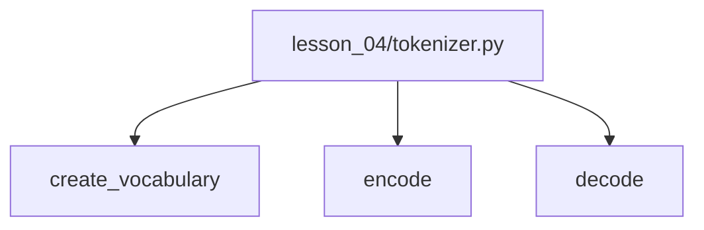

### Codice di riferimento aggiunto in questa lezione

```python
from study.snapshots.lesson_04.tokenizer import create_vocabulary, encode, decode

char_to_id, id_to_char = create_vocabulary(full_text)
token_ids = encode(sample, char_to_id)
reconstructed_text = decode(token_ids, id_to_char)
```

L'implementazione riutilizzabile vive in
`study/snapshots/lesson_04/tokenizer.py`; il client eseguibile è
`study/lessons/04_test_tokenizer.py`.

### Sintassi e logica

- `from package.module import name` importa nomi pubblici selezionati da un
  modulo.
- `char_to_id, id_to_char = ...` usa il tuple unpacking: i due oggetti
  restituiti vengono assegnati a due nomi.
- Il path dello snapshot contiene `lesson_04`: rende esplicita la dipendenza e
  impedisce che modifiche future riscrivano silenziosamente questo checkpoint.
- `create_vocabulary(full_text)` costruisce entrambe le tabelle dall'intero
  corpus, non dal campione più breve che verrà codificato.
- `encode(sample, char_to_id)` e `decode(token_ids, id_to_char)` usano
  soltanto l'interfaccia pubblica del modulo, così lo script non dipende dai
  dettagli interni. È il primo vero confine modulare del progetto.

# Modulo 2 — Le sequenze diventano esempi di training


## Lezione 05 — Training e validation

### Sintesi della lezione: obiettivo e risultato

- **Prima:** un token stream ordinato senza separazione tra apprendimento e misura
- **Obiettivo:** riservare un prefisso al training e una coda separata alla validation
- **Dopo:** due stream non sovrapposti con responsabilità diverse
- **Vincolo:** valori e ordine dei token in ciascuna regione non devono cambiare

### Comprendere la trasformazione

Se il modello imparasse da tutti i token e venisse misurato sulle stesse
posizioni, la misura non sarebbe indipendente. La regione di training potrà
produrre aggiornamenti; quella di validation servirà soltanto a misurare il
comportamento su dati tenuti da parte.

Per `N` ID, `int(0.9*N)` definisce il confine. Gli indici precedenti vanno al
training, quelli successivi alla validation. Il confine è anche il numero di
token di training e il primo indice di validation, non l'ultimo indice di
training.

Lo slicing conserva l'ordine locale e non assegna la stessa posizione a
entrambi gli split. Testo identico può comunque ricomparire naturalmente:
l'invariante riguarda le posizioni del dataset, non l'unicità linguistica.

Gli slice Python sono semiaperti: il token in `split_index` non appartiene al
training e diventa il primo token della validation. Di conseguenza, le due
lunghezze si sommano di nuovo a `N` e nessuna posizione viene persa. Quando
valuteremo il modello, useremo la regione di validation soltanto per calcolare
una loss di misura; non chiameremo `backward()` né `optimizer.step()` a partire
da quei dati. Questa separazione assegna un significato operativo ai due nomi,
non è soltanto un modo di dividere una lista.

Per un corpus a documenti, la separazione andrebbe eseguita prima per documento.
Nel piccolo file didattico, il taglio contiguo rende il principio facile da
ispezionare.

### Trasformazione, passo dopo passo

1. **INPUT — Parti da uno stream ordinato**

   `d[0], d[1], ..., d[N-1]`.

   **Cosa osservare:** tutte le posizioni hanno ancora lo stesso ruolo.

2. **OPERATION — Calcola il confine**

   `split_index = int(len(token_ids) * 0.9)`.

   **Cosa osservare:** è una posizione di slice, non un token ID.

3. **OPERATION — Seleziona il prefisso di training**

   `training_data = token_ids[:split_index]`.

   **Cosa osservare:** contiene le prime posizioni nell'ordine originale.

4. **OPERATION — Separa la coda di validation**

   `validation_data = token_ids[split_index:]`.

   **Cosa osservare:** gli slice sono adiacenti e non condividono indici.

5. **OUTPUT — Assegna le due responsabilità**

   ```learngpt-mermaid
   flowchart LR
       A["Indice 0"] --> B["Training: 0 … split_index−1"]
       B --> C["split_index"]
       C --> D["Validation: split_index … N−1"]
       D --> E["Confine finale N · escluso"]
   ```

   **Cosa osservare:** soltanto i batch di training potranno aggiornare i parametri.

### Dove siamo arrivati

Ora è esplicito quali dati possono insegnare e quali possono soltanto misurare.

- **Cambiato:** uno stream unico è diventato due regioni con ruoli distinti.
- **Preservato:** valori, ordine e adiacenza locale.
- **Prossimo passo:** creare input e target da una finestra dello split scelto.

> **Se ricordi una sola cosa:** la validation è utile solo se le sue posizioni
> non partecipano agli aggiornamenti di training.

### Come leggere la matematica

Le parentesi di floor significano “arrotonda verso il basso”. Un intervallo
nella formula svolge lo stesso ruolo di uno slice Python.

| Notazione | Leggilo come | Significato qui |
|---|---|---|
| $N$ | N | numero di caratteri ordinati o token in una sequenza |
| $d$ | d | flusso completo e ordinato dei token |
| $r$ | r | frazione assegnata al training |
| $n_{train}$ | n train | confine esclusivo tra i due slice |

### Esempio visivo svolto

> **Stato dell'esempio ricorrente:** ripetiamo la frase canonica per formare un
> corpus ordinato, poi dividiamo la sequenza senza cambiarne l'ordine.

```learngpt-mermaid
flowchart LR
    A["Flusso ordinato di N token"] --> B["Training"]
    B -->|"confine floor(0.9N)"| C["Validation"]
    C --> D["Confine finale N · escluso"]
```

Soltanto la regione di sinistra contribuisce ai gradienti; quella di destra
misura il modello senza addestrarlo.

Dato un flusso token $d=[d_0,\ldots,d_{N-1}]$ e rapporto di divisione $r=0.9$:

$$
n_{train}=\lfloor rN\rfloor
$$

$$
d_{train}=d[:n_{train}],\qquad d_{val}=d[n_{train}:].
$$

L'optimizer vede soltanto i token di training. La validation stima il
comportamento sui dati trattenuti. Uno split contiguo preserva le sequenze
locali; con grandi corpora di documenti, conviene assegnare prima i documenti
ai due split e concatenare i token dopo, così si riduce il rischio di leakage.

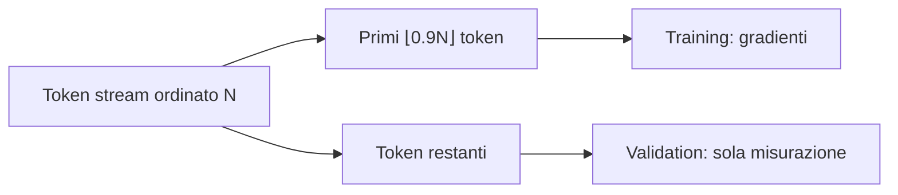

### Codice di riferimento aggiunto in questa lezione

```python
token_ids = encode(text, char_to_id)
split_index = int(len(token_ids) * 0.9)
training_data = token_ids[:split_index]
validation_data = token_ids[split_index:]
```

Questa divisione è dimostrata in `study/lessons/05_split_dataset.py`.

### Sintassi e logica

- `len(token_ids) * 0.9` calcola la posizione al 90% della sequenza;
  `int(...)` la tronca a un indice valido.
- `[:split_index]` seleziona il prefisso e `[split_index:]` il suffisso
  restante. Gli slice semiaperti rendono le regioni adiacenti e non
  sovrapposte.
- `training_data = token_ids[:split_index]` e
  `validation_data = token_ids[split_index:]` dividono una sequenza continua
  senza assegnare le stesse posizioni indicizzate a entrambi gli insiemi. Lo
  stesso testo può comunque ricomparire naturalmente nelle due regioni. I
  batch successivi vengono campionati soltanto dallo split scelto.
- `split_index = int(len(token_ids) * 0.9)` applica il rapporto 90/10: la
  maggior parte dei token serve al training, mentre il suffisso resta
  disponibile per una misura hold-out.

### Codice ↔ matematica ↔ significato

Questa sezione mostra come il codice realizza direttamente la trasformazione matematica.

| Codice | Lettura matematica | In parole semplici |
|---|---|---|
| `int(len(token_ids) * 0.9)` | $n_{train}=\lfloor0.9N\rfloor$ | scegliere il confine: numero di token di training e primo indice di validation |

## Lezione 06 — Input e target

### Sintesi della lezione: obiettivo e risultato

- **Prima:** un token stream ordinato senza label di previsione esplicite
- **Obiettivo:** trasformare `T+1` token in `T` input e `T` next-token target
- **Dopo:** due sequenze della stessa lunghezza, allineate posizione per posizione
- **Vincolo:** il target in posizione `t` deve essere il token subito successivo all'input `t`

### Comprendere la trasformazione

Il task next-token ricava le label dalla sequenza stessa. Prendiamo `T+1`
token consecutivi, usiamo i primi `T` come input e gli ultimi `T` come target.
Le due viste si sovrappongono, ma il target inizia una posizione più avanti.

Con `[4,7,1,9,2]` otteniamo `X=[4,7,1,9]` e `Y=[7,1,9,2]`. Leggendo le colonne
verticalmente, `4` deve predire `7`, `7` deve predire `1` e così via. Uno
shift errato insegnerebbe un task diverso anche con shape apparentemente
corrette.

I prefissi crescenti descrivono lo stesso allineamento. Il bigram imminente
userà inizialmente solo il token corrente; il Transformer causale userà in
seguito l'intero prefisso visibile. La coppia input/target è valida per entrambi.

Le quattro colonne non sono quattro sequenze scollegate. Sono quattro punti di
supervisione ricavati dalla stessa finestra ordinata: alla posizione `t`,
l'input contiene il token che il modello può usare e `Y[t]` contiene
l'unica risposta corretta per il passo seguente. Più avanti la mask causale
stabilirà quanta parte del prefix è visibile a ciascuna posizione, ma non
cambierà questo abbinamento. Perciò conviene controllare ora sia la lunghezza
sia ogni coppia verticale.

Qui non avviene alcuna previsione: stiamo costruendo esempi supervisionati da
dati ordinati.

La stessa regola scala facendo scorrere una finestra sullo stream. Un indice
iniziale `s` seleziona `data[s : s + T + 1]`; l'input è tutto tranne l'ultimo
token e il target è tutto tranne il primo token. Se la finestra successiva
parte da `s + 1`, le finestre si sovrappongono molto e lo stride è uno. Uno
stride più grande salta più posizioni e crea meno esempi. Più avanti il
batching casuale sceglierà start validi invece di percorrere ogni stride, ma
ogni finestra campionata farà sempre la stessa domanda: “dato questo contesto
visibile, qual è il token immediatamente successivo a ogni posizione?”

### Trasformazione, passo dopo passo

1. **INPUT — Seleziona `T+1` token**

   `window=[4,7,1,9,2]`, con `T=4`.

   **Cosa osservare:** il quinto token serve come ultima risposta.

2. **OPERATION — Prendi i primi `T` input**

   `X=window[:-1]=[4,7,1,9]`.

   **Cosa osservare:** l'ordine resta invariato.

3. **OPERATION — Sposta di uno per i target**

   `Y=window[1:]=[7,1,9,2]`.

   **Cosa osservare:** target e input hanno la stessa lunghezza.

4. **CHECK — Leggi le colonne**

   ```learngpt-visual
   {
     "type": "labeled-grid",
     "title": "Input e target spostati di un token",
     "description": "In ogni colonna, il valore di Y è il token successivo che il valore di X deve predire.",
     "columns": ["posizione 0", "posizione 1", "posizione 2", "posizione 3"],
     "rows": [
       {
         "label": "X",
         "cells": [
           {"value": "4"},
          {"value": "7", "state": "highlighted"},
           {"value": "1"},
           {"value": "9"}
         ]
       },
       {
         "label": "Y",
         "cells": [
           {"value": "7", "state": "highlighted"},
          {"value": "1"},
          {"value": "9"},
          {"value": "2"}
         ]
       }
     ]
   }
   ```

   **Cosa osservare:** ogni colonna significa “predici questo token”.

5. **OUTPUT — Ottieni `T` posizioni supervisionate**

   I due array hanno shape `[T]`.

   **Cosa osservare:** le label provengono dallo shift, non dal modello.

### Dove siamo arrivati

I dati contengono ora domande e risposte esplicite per il next-token learning.

- **Cambiato:** una finestra senza label è diventata una coppia input/target.
- **Preservato:** ordine e relazione con il token immediatamente successivo.
- **Prossimo passo:** campionare finestre da molte posizioni.

> **Se ricordi una sola cosa:** i target sono la stessa sequenza spostata
> esattamente di un token.

### Come leggere la matematica

I pedici descrivono le posizioni selezionate. Leggi $w_{0:T}$ come “posizioni
della finestra da zero fino a T, con T escluso”.

| Notazione | Leggilo come | Significato qui |
|---|---|---|
| $T$ | T | posizioni token in un unico context window |
| $X$ | X | input token ID o la matrice di ingresso corrente |
| $Y$ | Y | ID corretti del token successivo usati come target di training |

### Esempio visivo svolto

> **Stato dell'esempio ricorrente:** usiamo la sequenza abbreviata
> `The cat sleeps here.` → `[4,7,1,9,2]` per abbinare ogni token a quello
> successivo.

| Posizione temporale | 0 | 1 | 2 | 3 |
|---|---:|---:|---:|---:|
| Ingresso $X$ | 4 | 7 | 1 | 9 |
| Target $Y$ | 7 | 1 | 9 | 2 |

Leggi ogni colonna verticalmente: l'input `4` deve prevedere il target `7`; il
prefix `[4,7]` deve prevedere `1`, e così via.

Una finestra contiene $T+1$ token. I primi $T$ sono gli input; gli ultimi $T$
sono le risposte spostate di una posizione:

$$x=w_{0:T},\qquad y=w_{1:T+1}.$$

| Tempo | 0 | 1 | 2 | 3 |
|---|---:|---:|---:|---:|
| ingresso $x$ | 4 | 7 | 1 | 9 |
| target $y$ | 7 | 1 | 9 | 2 |

Questa singola riga fornisce quattro target annidati: `4→7`, `[4,7]→1`,
`[4,7,1]→9` e `[4,7,1,9]→2`. Il primo modello bigram userà inizialmente
soltanto il token corrente in ogni posizione. Più avanti, un Transformer
causale calcolerà tutte le posizioni in parallelo, mentre una mask impedirà di
leggere i token futuri.

### Codice di riferimento aggiunto in questa lezione

```python
input_tokens = token_ids[:CONTEXT_SIZE]
target_tokens = token_ids[1 : CONTEXT_SIZE + 1]

for position in range(CONTEXT_SIZE):
    context = input_tokens[: position + 1]
    next_token = target_tokens[position]
```

Vedere le coppie `prefisso → token successivo` stampate in `study/lessons/06_input_target.py`.

### Sintassi e logica

- Lo slice di input parte dal token `0`; quello dei target parte dal token `1`.
  Entrambe le liste hanno lunghezza `CONTEXT_SIZE`, ma sono sfalsate di un
  token.
- L'indice di stop è esclusivo. `CONTEXT_SIZE + 1` è necessario per includere il
  target abbinato all'ultima posizione di input.
- `range(CONTEXT_SIZE)` produce le posizioni da `0` a `T-1`.
- `context = input_tokens[: position + 1]` allunga il prefix visibile di un
  token a ogni iterazione.
- `next_token = target_tokens[position]` seleziona il next-token target
  abbinato al prefix corrente.

### Codice ↔ matematica ↔ significato

Questa sezione mostra come il codice realizza direttamente la trasformazione matematica.

| Codice | Lettura matematica | In parole semplici |
|---|---|---|
| `x = window[:-1]` | $x=w_{0:T}$ | mantenere i primi T token |
| `y = window[1:]` | $y=w_{1:T+1}$ | shift risposte da un unico token |

## Lezione 07 — Esempi casuali

### Sintesi della lezione: obiettivo e risultato

- **Prima:** un solo esempio correttamente sfalsato, fissato in una posizione
- **Obiettivo:** campionare finestre diverse di `T+1` token senza uscire dallo split selezionato
- **Dopo:** un flusso riproducibile di esempi input/target diversi ma sempre validi
- **Vincolo:** l'ordine interno di ogni finestra e lo shift di un token devono restare esatti

### Comprendere la trasformazione

La lezione precedente usava sempre una posizione già nota. Ripetere in
continuazione quella stessa finestra mostrerebbe al modello solo una parte
minuscola del corpus. `create_example` risolve il problema scegliendo ogni
volta un nuovo indice iniziale e applicando in quella posizione la stessa
regola di shift. La casualità cambia **da dove** proviene l'esempio, non
l'ordine dei token al suo interno.

Il limite superiore è facile da sbagliare: l'input contiene `T` token, ma per
costruire anche il target servono `T+1` token sorgente. Se i dati hanno
lunghezza `N`, l'ultimo indice iniziale valido è quindi `N-T-1`. In Python,
`random.randint(a, b)` include entrambi gli estremi; la chiamata corretta è
perciò `randint(0, N-T-1)`. Partire da `N-T` lascerebbe l'ultima posizione
dell'input senza il proprio token target.

Scelto l'indice `s`, l'input è `data[s:s+T]` e il target è
`data[s+1:s+T+1]`. I due slice sono viste adiacenti della stessa sequenza
locale. Il campionamento casuale non cambia l'ordine dei caratteri e non supera il
confine dello split passato alla funzione.

Infine, `random.seed(42)` rende dimostrabile il comportamento: a ogni nuova
esecuzione otteniamo la stessa sequenza di indici campionati. Il seed non rende
tutti gli esempi uguali; rende ripetibile la sequenza delle scelte casuali, così
possiamo controllarla e confrontarla.

### Trasformazione, passo dopo passo

1. **INPUT — Ricevi uno split già selezionato**

   Indichiamo con `N=len(data)` la sua lunghezza e scegliamo una context size
   `T`.

   **Cosa osservare:** la funzione può campionare soltanto posizioni contenute
   nell'argomento ricevuto; non decide da sola tra training e validation.

2. **CONSTRAINT — Calcola l'ultimo inizio valido**

   ```text
   inizi validi: 0 ... N-T-1
   coda non valida:            N-T ... N-1
   ```

   **Cosa osservare:** dopo ogni inizio valido resta spazio per un token target
   aggiuntivo.

3. **OPERATION — Estrai un inizio casuale riproducibile**

   `s = random.randint(0, N-T-1)`.

   **Cosa osservare:** entrambi gli estremi sono validi perché `randint` è
   inclusivo.

4. **OPERATION — Costruisci la coppia sfalsata**

   ```learngpt-visual
   {
     "type": "tensor-flow",
     "title": "Tre slice della stessa finestra",
     "description": "La finestra include un token in più; input e target ne usano due slice lunghe T e sfalsate di una posizione.",
     "stages": [
       {"label": "Finestra", "shape": "T + 1", "note": "data[s : s+T+1]"},
       {"label": "Input", "shape": "T", "note": "data[s : s+T]"},
       {"label": "Target", "shape": "T", "note": "data[s+1 : s+T+1]"}
     ]
   }
   ```

   **Cosa osservare:** i due valori restituiti hanno lunghezza `T` e restano
   sfalsati esattamente di una posizione.

5. **OUTPUT — Restituisci un esempio di training diverso**

   Chiamate ripetute possono coprire molti contesti locali, conservando
   l'ordine di ogni sequenza.

   **Cosa osservare:** la varietà nasce dalla posizione iniziale, non dal
   riordinamento dei token.

### Dove siamo arrivati

Il progetto può ora chiedere allo split selezionato molti esempi diversi,
invece di leggere sempre e soltanto il suo inizio. Ogni chiamata produce ancora
una sola coppia; la prossima lezione raggrupperà più chiamate in un batch.

- **Cambiato:** un esempio fisso è diventato un sampler di tutti gli inizi validi.
- **Preservato:** confini dello split, ordine locale dei token e allineamento del target.
- **Prossimo passo:** raccogliere più coppie campionate in liste Python rettangolari.

> **Se ricordi una sola cosa:** l'ultimo inizio valido è `N-T-1`, perché un
> input di `T` token richiede sempre un token target aggiuntivo.

### Come leggere la matematica

La disuguaglianza descrive ogni indice iniziale valido e impedisce al target
finale di oltrepassare i dati.

| Notazione | Leggilo come | Significato qui |
|---|---|---|
| $N$ | N | numero di caratteri ordinati o token in una sequenza |
| $T$ | T | posizioni token in un unico context window |

### Esempio visivo svolto

> **Stato dell'esempio ricorrente:** estraiamo una context window casuale da
> copie ripetute di `[4,7,1,9,2]`, la rappresentazione compatta della frase
> canonica.

```learngpt-visual
{
  "type": "labeled-grid",
  "title": "Una finestra casuale con T = 4",
  "description": "Con s = 2, la finestra di cinque token produce due righe di quattro token sfalsate di una posizione.",
  "columns": ["0", "1", "2", "3", "4"],
  "rows": [
    {
      "label": "Finestra · data[2:7]",
      "cells": [
        {"value": "1", "state": "highlighted"},
        {"value": "9", "state": "highlighted"},
        {"value": "2", "state": "highlighted"},
        {"value": "4", "state": "highlighted"},
        {"value": "7", "state": "highlighted"}
      ]
    },
    {
      "label": "Input X",
      "cells": [
        {"value": "1"},
        {"value": "9"},
        {"value": "2"},
        {"value": "4"},
        {"value": "—", "state": "masked"}
      ]
    },
    {
      "label": "Target Y",
      "cells": [
        {"value": "—", "state": "masked"},
        {"value": "9"},
        {"value": "2"},
        {"value": "4"},
        {"value": "7"}
      ]
    }
  ]
}
```

L'ultimo indice iniziale valido deve lasciare spazio al token target aggiuntivo.

Per un flusso lungo $N$, gli indici iniziali validi soddisfano
$0\le s\le N-T-1$. Campionando $s$ uniformemente otteniamo:

$$w=d[s:s+T+1].$$

L'ultimo indice valido è $N-T-1$, perché il target richiede il token aggiuntivo
in posizione $s+T$. Questa lezione cambia soltanto l'indice iniziale campionato:
non introduce ancora un optimizer né una policy di campionamento per documenti.

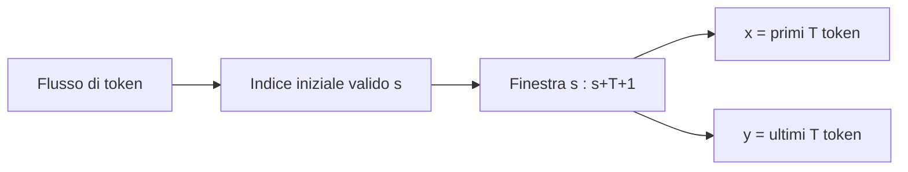

### Codice di riferimento aggiunto in questa lezione

```python
def create_example(data, context_size):
    start_position = random.randint(0, len(data) - context_size - 1)
    input_tokens = data[start_position : start_position + context_size]
    target_tokens = data[start_position + 1 : start_position + context_size + 1]
    return input_tokens, target_tokens

random.seed(42)
```

La funzione è introdotta in `study/lessons/07_random_examples.py`.

### Sintassi e logica

- `random.randint(a, b)` include entrambi gli estremi. Il limite superiore
  lascia spazio a un token in più per i target.
- `data[start_position : start_position + context_size]` estrae esattamente
  `T` input ID consecutivi.
- Lo slice dei target sposta entrambi i confini di una posizione, mantenendo la
  stessa lunghezza.
- `return input_tokens, target_tokens` restituisce una tupla che il chiamante
  può separare in due nomi.
- `random.seed(42)` riporta il generatore Python a uno stato noto. Il numero non
  ha un significato particolare per il modello: conta la riproducibilità.

### Codice ↔ matematica ↔ significato

Questa sezione mostra come il codice realizza direttamente la trasformazione matematica.

| Codice | Lettura matematica | In parole semplici |
|---|---|---|
| `randint(0, N-T-1)` | $0\le s\le N-T-1$ | campionare soltanto indici iniziali validi; entrambi gli estremi sono inclusi |

## Lezione 08 — Python batch

### Sintesi della lezione: obiettivo e risultato

- **Prima:** una coppia input/target per chiamata
- **Obiettivo:** raccogliere `B` coppie in due liste Python rettangolari
- **Dopo:** un input batch e un target batch con shape concettuale `[B,T]`
- **Vincolo:** la riga input `b` deve rimanere associata alla riga target `b`

### Comprendere la trasformazione

Un batch raggruppa più contesti indipendenti senza unirli in un'unica sequenza.
La nuova lista esterna è l'asse batch; ogni lista interna conserva un contesto
ordinato di lunghezza `T`.

Input e target rimangono in contenitori separati. `create_example` restituisce
una coppia e il loop aggiunge entrambi gli elementi nella stessa iterazione:
così la riga `b` dei due batch continua a descrivere lo stesso sample.

Con `B=3` e `T=4` otteniamo due griglie `3×4`. Le righe sono esempi
indipendenti; le colonne indicano posizioni relative, non posizioni assolute
nel corpus.

“Indipendenti” significa che la fine di una riga non continua nell'inizio della
successiva. Ogni riga conserva il proprio indice iniziale campionato e la
propria sequenza di target. La colonna `0` indica soltanto la prima posizione
relativa di ciascuna finestra: le tre righe possono provenire da punti molto
diversi del corpus. Mantenere questa distinzione evita di interpretare la
griglia come un unico testo lungo `B*T`.

La lezione usa soltanto liste Python. Non esistono ancora `torch.stack` o
operazioni tensoriali: questa struttura leggibile è il riferimento per la
conversione successiva. Possiamo quindi verificare valori e pairing prima di
aggiungere dtype, device e regole del runtime PyTorch.

### Trasformazione, passo dopo passo

1. **INPUT — Scegli `B` e `T`**

   Ogni esempio deve avere `T` input e `T` target.

   **Cosa osservare:** righe di lunghezza diversa non formano una griglia.

2. **OPERATION — Campiona una coppia**

   `create_example(data, context_size)` restituisce input e target.

   **Cosa osservare:** lo shift è corretto prima del batching.

3. **OPERATION — Aggiungi entrambe le righe**

   ```text
   batch_inputs.append(input_tokens)
   batch_targets.append(target_tokens)
   ```

   **Cosa osservare:** i due contenitori crescono insieme.

4. **INTERMEDIATE STATE — Forma due griglie**

   ```learngpt-visual
   {
     "type": "labeled-grid",
     "title": "Tre esempi allineati nel batch",
     "description": "Ogni riga conserva una coppia X/Y; il batch aggiunge esempi lungo l'asse B.",
     "columns": ["t0", "t1", "t2", "t3"],
     "rows": [
       {"label": "X₀", "cells": [{"value": "4"}, {"value": "7"}, {"value": "1"}, {"value": "9"}]},
       {"label": "Y₀", "cells": [{"value": "7", "state": "highlighted"}, {"value": "1", "state": "highlighted"}, {"value": "9", "state": "highlighted"}, {"value": "2", "state": "highlighted"}]},
       {"label": "X₁", "cells": [{"value": "7"}, {"value": "1"}, {"value": "9"}, {"value": "2"}]},
       {"label": "Y₁", "cells": [{"value": "1", "state": "highlighted"}, {"value": "9", "state": "highlighted"}, {"value": "2", "state": "highlighted"}, {"value": "4", "state": "highlighted"}]},
       {"label": "X₂", "cells": [{"value": "1"}, {"value": "9"}, {"value": "2"}, {"value": "4"}]},
       {"label": "Y₂", "cells": [{"value": "9", "state": "highlighted"}, {"value": "2", "state": "highlighted"}, {"value": "4", "state": "highlighted"}, {"value": "7", "state": "highlighted"}]}
     ]
   }
   ```

   **Cosa osservare:** `B=3`, `T=4`.

5. **OUTPUT — Restituisci i due batch Python**

   `return batch_inputs, batch_targets`.

   **Cosa osservare:** il batch aggiunge righe, non concatena i contesti.

### Dove siamo arrivati

Il progetto possiede ora due liste annidate leggibili e allineate.

- **Cambiato:** esempi singoli sono diventati due griglie `[B,T]`.
- **Preservato:** ordine interno e associazione tra righe.
- **Prossimo passo:** convertire gli stessi valori in PyTorch tensor.

> **Se ricordi una sola cosa:** il batch aggiunge esempi indipendenti, non
> unisce i loro contesti.

### Come leggere la matematica

Una griglia a parentesi è una matrice. Le righe sono esempi e le colonne sono posizioni temporali.

| Notazione | Leggilo come | Significato qui |
|---|---|---|
| $B$ | B | numero di esempi indipendenti in un unico batch |
| $T$ | T | posizioni token in un unico context window |
| $X$ | X | input token ID o la matrice di ingresso corrente |
| $Y$ | Y | ID corretti del token successivo usati come target di training |

### Esempio visivo svolto

> **Stato dell'esempio ricorrente:** raccogliamo più finestre della sequenza
> canonica ripetuta in un batch rappresentato con liste Python.

$$
X=\begin{bmatrix}
4&7&1&9\\
7&1&9&2\\
1&9&2&4
\end{bmatrix}
$$

Ogni riga è un esempio indipendente; le colonne rappresentano le stesse posizioni relative del tempo. La griglia visiva ha quindi shape $[B,T]=[3,4]$.

Ripetiamo l'estrazione della finestra $B$ volte e raccogliamo le righe:

$$X=\begin{bmatrix}x^{(1)}\\x^{(2)}\\\vdots\\x^{(B)}\end{bmatrix},\qquad Y=\begin{bmatrix}y^{(1)}\\y^{(2)}\\\vdots\\y^{(B)}\end{bmatrix}.$$

Per $B=3,T=4$:

$$X=\begin{bmatrix}4&7&1&9\\7&1&9&2\\1&9&2&4\end{bmatrix} \in\mathbb Z^{3\times4}.$$

Le righe sono esempi indipendenti; le colonne sono posizioni temporali. Una
lista Python rende visibile la geometria, ma non possiede ancora dtype, device,
autograd o kernel tensoriali.

### Codice di riferimento aggiunto in questa lezione

```python
def create_batch(data, batch_size, context_size):
    batch_inputs = []
    batch_targets = []

    for _ in range(batch_size):
        input_tokens, target_tokens = create_example(data, context_size)
        batch_inputs.append(input_tokens)
        batch_targets.append(target_tokens)

    return batch_inputs, batch_targets
```

La rappresentazione della lista annidata è visibile in `study/lessons/08_python_batch.py`.

### Sintassi e logica

- `batch_inputs = []` e `batch_targets = []` creano due contenitori separati
  prima di campionare gli esempi.
- `for _ in ...` ripete un'azione quando l'indice del loop non serve; `_`
  comunica esplicitamente questa intenzione.
- `input_tokens, target_tokens = create_example(...)` campiona una coppia
  allineata e usa il tuple unpacking.
- `list.append(value)` muta l'elenco aggiungendo un esempio alla fine.
- Input e target vengono raccolti in liste separate ma nello stesso loop, così
  la riga `i` di una lista resta abbinata alla riga `i` dell'altra.
- Il risultato ha shape concettuale `[B,T]`: la lista esterna contiene `B`
  esempi, ognuno con `T` token ID.

### Codice ↔ matematica ↔ significato

Questa sezione mostra come il codice realizza direttamente la trasformazione matematica.

| Codice | Lettura matematica | In parole semplici |
|---|---|---|
| `batch_inputs.append(input_tokens)` | $X\in\mathbb Z^{B\times T}$ in senso concettuale | aggiungere una riga; la lista Python esterna diventa l'asse batch |

## Lezione 09 — PyTorch batch

### Sintesi della lezione: obiettivo e risultato

- **Prima:** due liste Python rettangolari e abbinate, con una struttura `[B,T]` ancora soltanto concettuale
- **Obiettivo:** convertire entrambe le griglie in tensor PyTorch di rango 2 e ispezionarne la shape
- **Dopo:** tensor su CPU, con dtype intero inferito e valori invariati
- **Vincolo:** la conversione non deve cambiare alcun ID, riga o abbinamento tra input e target

### Comprendere la trasformazione

Le liste annidate rendono il batch facile da leggere, ma i layer PyTorch si
aspettano dei tensor. `torch.tensor(batch_inputs)` copia i valori
rettangolari in un unico oggetto numerico; la stessa operazione converte la
griglia dei target. I valori non acquistano un significato nuovo: è la loro
rappresentazione che ora possiede una shape e un tipo scalare che PyTorch può
ispezionare.

Poiché tutti i valori di partenza sono integer Python, questa chiamata
particolare inferisce `torch.int64`, chiamato anche `torch.long`. È il tipo
che servirà più avanti per i lookup nelle embedding table. Il codice della
lezione non passa esplicitamente `dtype=torch.long`: è quindi importante
parlare di **dtype inferito**, non di una scelta esplicita.

Per impostazione predefinita, la chiamata crea inoltre i tensor sulla CPU. In
questo snapshot non compare né un argomento `device` né un trasferimento con
`.to(...)`. MPS e CUDA entreranno in gioco nelle lezioni di produzione
successive. Qui il contratto è più ristretto: gli stessi ID rettangolari sono
ora memorizzati in due tensor CPU di rango 2.

Lo script riconverte in lista soltanto la prima riga del tensor, così il decoder
di caratteri già disponibile può mostrarla. `.tolist()` crea una copia
leggibile e non modifica il tensor originale. Questa piccola verifica di
andata e ritorno conferma che la conversione ha preservato la sequenza.

### Trasformazione, passo dopo passo

1. **INPUT — Ricevi due liste rettangolari**

   `batch_inputs` e `batch_targets` contengono ciascuna `B` righe di `T`
   integer.

   **Cosa osservare:** le righe devono avere tutte la stessa lunghezza; una
   struttura irregolare non può diventare il tensor di rango 2 previsto.

2. **OPERATION — Converti la griglia degli input**

   `input_tensor = torch.tensor(batch_inputs)`.

   **Cosa osservare:** PyTorch copia i valori mantenendo lo stesso ordine di
   righe e colonne.

3. **OPERATION — Converti la griglia dei target**

   `target_tensor = torch.tensor(batch_targets)`.

   **Cosa osservare:** le due griglie abbinate cambiano rappresentazione in
   modo indipendente ma equivalente.

4. **CHECK — Ispeziona shape, dtype e una riga**

   ```text
   shape  → torch.Size([B, T])
   dtype  → torch.int64  (inferito)
   device → cpu          (predefinito)
   ```

   **Cosa osservare:** i metadati diventano espliciti, mentre i valori restano
   invariati.

5. **OUTPUT — Ottieni tensor interi pronti per il modello**

   Il risultato è `input_tensor, target_tensor`, entrambi con shape `[B,T]`.

   **Cosa osservare:** `.tolist()` può creare una copia per la visualizzazione,
   ma lascia intatti i tensor.

### Dove siamo arrivati

Il batch possiede ora la rappresentazione richiesta dai layer PyTorch. Questa
lezione ha verificato tensor CPU con dtype intero inferito; non ha ancora
selezionato un acceleratore né creato un modulo di batching riutilizzabile.

- **Cambiato:** le liste annidate sono diventate tensor PyTorch di rango 2.
- **Preservato:** ogni token ID, l'ordine delle righe e la relazione tra input e target.
- **Prossimo passo:** estrarre la creazione del batch in una funzione riutilizzabile.

> **Se ricordi una sola cosa:** la conversione in tensor aggiunge un contratto
> computazionale — shape, dtype e device — senza cambiare i valori dei token.

### Come leggere la matematica

Le shape tra parentesi quadre elencano gli assi dall'esterno verso l'interno:
prima il batch, poi il tempo.

| Notazione | Leggilo come | Significato qui |
|---|---|---|
| $B$ | B | numero di esempi indipendenti in un batch |
| $T$ | T | numero di posizioni token in una context window |
| $X$ | X | matrice degli input token ID |
| $Y$ | Y | matrice dei corretti next-token ID usati come target |

### Esempio visivo svolto

> **Stato dell'esempio ricorrente:** memorizziamo gli stessi batch della frase
> canonica come tensor, rendendo espliciti shape, dtype inferito e device CPU
> predefinito.

| Proprietà | Prima: lista Python | Dopo: tensor |
|---|---|---|
| Valori | `[[4,7],[7,1]]` | `[[4,7],[7,1]]` |
| Shape | implicita | `[2,2]` |
| Tipo | integer Python | `torch.int64`, inferito |
| Device | nessuno | `cpu`, predefinito |

I numeri non cambiano: diventa esplicito il loro contratto computazionale.

`torch.tensor(rows)` assegna a questo batch intero le seguenti proprietà:

| Proprietà | Valore | Motivo |
|---|---|---|
| shape | `[B,T]` | distingue gli assi batch e tempo |
| dtype | `torch.int64` / `long`, inferito | gli indici delle embedding devono essere interi |
| device | `cpu`, scelto automaticamente | la lezione non specifica un device e non trasferisce il tensor |
| gradienti | non necessari per gli ID | i gradienti aggiornano le tabelle, non gli indici |

### Codice di riferimento aggiunto in questa lezione

```python
input_tensor = torch.tensor(batch_inputs)
target_tensor = torch.tensor(batch_targets)

print(input_tensor.shape)
first_input = input_tensor[0].tolist()
```

Gli esempi di conversione e indexing si trovano in
`study/lessons/09_torch_batch.py`.

### Sintassi e logica

- `torch.tensor(batch_inputs)` e `torch.tensor(batch_targets)` copiano le due
  liste rettangolari in tensor; dagli integer di partenza PyTorch inferisce
  `torch.int64`, il tipo richiesto dagli indici delle embedding.
- `.shape` restituisce una dimensione per asse: `B` righe del batch e `T`
  posizioni temporali.
- `input_tensor[0]` seleziona la prima riga; `.tolist()` ne crea una copia
  Python soltanto per il decoder usato dallo script didattico.
- La copia non modifica `input_tensor`.
- Più avanti le operazioni agiranno sulle `B*T` posizioni in parallelo,
  evitando loop Python sui singoli token.

## Lezione 10 — Modulo di batching

### Sintesi della lezione: obiettivo e risultato

- **Prima:** campionamento e conversione in tensor copiati dentro i singoli script
- **Obiettivo:** spostare lo stesso comportamento in una sola funzione importabile `create_batch`
- **Dopo:** una funzione riutilizzabile che restituisce due tensor CPU `[B,T]` abbinati
- **Vincolo:** limiti degli indici iniziali, shift di un token e abbinamento delle righe non devono cambiare

### Comprendere la trasformazione

Gli script precedenti contenevano ciascuno una copia di `create_example` e
`create_batch`. Questo li rendeva eseguibili, ma costringeva ogni nuovo file
del modello a ripetere lo stesso limite contro gli errori off-by-one, lo shift
tra input e target e la conversione da liste a tensor. Due copie possono
divergere anche continuando a restituire shape apparentemente corrette.

Questa lezione estrae il comportamento esistente in
`study/snapshots/lesson_10/batching.py`. La funzione pubblica riceve
esattamente tre argomenti: uno split `data` già scelto dal chiamante,
`batch_size` e `context_size`. In questo snapshot non sceglie tra training
e validation e non accetta un argomento `device`.

All'interno del modulo, l'implementazione resta volutamente semplice. Un loop
Python campiona `B` esempi, aggiunge le righe abbinate alle due liste e infine
le converte con `torch.tensor`. Non esistono ancora una classe
`BatchProvider`, una griglia di indici vettorializzata, una memmap `uint16` o
un trasferimento verso un acceleratore: sono ottimizzazioni della versione di
produzione, non lo status quo di questa lezione.

Il vantaggio è un confine stabile. Le lezioni del modello possono chiedere due
tensor senza conoscere i dettagli del campionamento; il modulo di batching
rimane responsabile dei limiti e dell'allineamento. Lo script di test decodifica
le prime righe e stampa le shape per verificare che l'estrazione non abbia
cambiato il comportamento.

### Trasformazione, passo dopo passo

1. **INPUT — Passa uno split già scelto**

   Il chiamante fornisce `data`, `batch_size=B` e `context_size=T`.

   **Cosa osservare:** la scelta dello split resta fuori dalla funzione di
   batching.

2. **OPERATION — Campiona `B` esempi allineati**

   Il modulo chiama `create_example(data, T)` una volta per ogni riga del
   batch.

   **Cosa osservare:** ogni chiamata applica ancora il limite legale e lo shift
   di un token.

3. **INTERMEDIATE STATE — Raccogli le righe Python abbinate**

   `batch_inputs` e `batch_targets` crescono insieme durante il loop.

   **Cosa osservare:** la riga `b` dei due contenitori proviene dalla stessa
   finestra campionata.

4. **OPERATION — Converti entrambe le griglie in tensor**

   ```learngpt-visual
   {
     "type": "tensor-flow",
     "title": "Dalle liste Python ai tensor del batch",
     "description": "La conversione conserva righe e colonne e rende esplicite le shape condivise di input e target.",
     "stages": [
       {"label": "Righe Python abbinate", "shape": "B × T", "note": "liste annidate X e Y"},
       {"label": "torch.tensor", "shape": "B × T", "note": "conversione separata per X e Y"},
       {"label": "Tensor restituiti", "shape": "X[B,T], Y[B,T]", "note": "stesso abbinamento per riga"}
     ]
   }
   ```

   **Cosa osservare:** qui si costruiscono normali tensor CPU; non si usa ancora
   la griglia vettorializzata della versione di produzione.

5. **OUTPUT — Restituisci un contratto di batch riutilizzabile**

   Il chiamante riceve `input_tensor, target_tensor`.

   **Cosa osservare:** le lezioni successive dipendono dalla firma e
   dall'output della funzione, non da copie del loop interno.

### Dove siamo arrivati

La creazione del batch è diventata una dipendenza modulare, invece di una
sequenza di preparazione ripetuta. L'interfaccia è volutamente più piccola di
quella che verrà usata nella versione di produzione, così il contratto
didattico resta facile da osservare.

- **Cambiato:** la logica di batching copiata è diventata una funzione importabile.
- **Preservato:** limiti, target spostati, abbinamento delle righe e shape `[B,T]`.
- **Prossimo passo:** verificare il comportamento di base dei tensor PyTorch prima di aggiungere un modello.

> **Se ricordi una sola cosa:** questa lezione estrae il loop già esistente;
> non aggiunge ancora trasferimenti di device o batching vettorializzato.

### Come leggere la matematica

La notazione descrive una riga alla volta: da un indice iniziale `s_b`
estraiamo `T` input e gli stessi `T` target spostati di una posizione.

| Notazione | Leggilo come | Significato qui |
|---|---|---|
| $B$ | B | numero di esempi indipendenti nel batch |
| $T$ | T | numero di posizioni token in ogni context window |
| $N$ | N | numero di token nello split già scelto |
| $X$ | X | matrice degli input token ID |
| $Y$ | Y | matrice dei next-token ID corretti |

### Esempio visivo svolto

> **Stato dell'esempio ricorrente:** spostiamo in una funzione riutilizzabile
> lo stesso loop che crea finestre dal flusso ripetuto `[4,7,1,9,2]`.

Con `B=2` e `T=4`, due chiamate a `create_example` potrebbero produrre:

```learngpt-visual
{
  "type": "labeled-grid",
  "title": "Batch riutilizzabile con B = 2 e T = 4",
  "description": "Le righe X e Y restano abbinate mentre append e torch.tensor formano due griglie rettangolari.",
  "columns": ["t0", "t1", "t2", "t3"],
  "rows": [
    {"label": "X₀", "cells": [{"value": "4"}, {"value": "7"}, {"value": "1"}, {"value": "9"}]},
    {"label": "Y₀", "cells": [{"value": "7", "state": "highlighted"}, {"value": "1", "state": "highlighted"}, {"value": "9", "state": "highlighted"}, {"value": "2", "state": "highlighted"}]},
    {"label": "X₁", "cells": [{"value": "1"}, {"value": "9"}, {"value": "2"}, {"value": "4"}]},
    {"label": "Y₁", "cells": [{"value": "9", "state": "highlighted"}, {"value": "2", "state": "highlighted"}, {"value": "4", "state": "highlighted"}, {"value": "7", "state": "highlighted"}]}
  ]
}
```

Il modulo costruisce ancora il batch con un loop Python:

$$
X_b=d[s_b:s_b+T],\qquad
Y_b=d[s_b+1:s_b+T+1],\quad b=0,\ldots,B-1.
$$

Ogni indice iniziale crea una coppia di righe. La conversione finale in tensor
cambia la rappresentazione, ma non i valori né il loro allineamento.

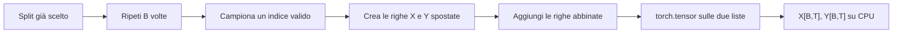

L'implementazione di produzione vettorializzerà queste operazioni, ma
l'ottimizzazione non appartiene allo snapshot di questa lezione.

### Codice di riferimento aggiunto in questa lezione

```python
CONTEXT_SIZE = 32
BATCH_SIZE = 4

input_tensor, target_tensor = create_batch(
    data=training_data,
    batch_size=BATCH_SIZE,
    context_size=CONTEXT_SIZE,
)
```

L'implementazione si trova in `study/snapshots/lesson_10/batching.py`;
`study/lessons/10_test_batching.py` ne verifica il comportamento pubblico.

### Sintassi e logica

- Gli argomenti keyword come `data=...` rendono esplicito quale valore viene
  assegnato a ogni parametro.
- `BATCH_SIZE = 4` controlla il numero di righe campionate;
  `CONTEXT_SIZE = 32` controlla il numero di token per riga.
- `input_tensor, target_tensor = create_batch(...)` separa nei due nomi i
  tensor restituiti dalla funzione.
- Il chiamante ha già scelto `training_data`: `create_batch` non seleziona
  lo split.
- La funzione preserva due shape `[batch_size, context_size]` e lo shift di un
  token tra le righe corrispondenti. Crea normali tensor CPU, perché questo
  snapshot non possiede un parametro `device`.

### Codice ↔ matematica ↔ significato

Questa sezione mostra come il codice implementa direttamente la trasformazione.

| Codice | Lettura matematica | In parole semplici |
|---|---|---|
| `input_tokens, target_tokens = create_example(data, T)` | $X_b=d[s_b:s_b+T]$, $Y_b=d[s_b+1:s_b+T+1]$ | campiona una coppia di righe con lo shift corretto |
| `batch_inputs.append(input_tokens)` | $X=(X_0,\ldots,X_{B-1})$ | aggiunge la riga di input allo stesso indice del batch |
| `torch.tensor(batch_inputs)` | $X\in\mathbb Z^{B\times T}$ | converte la lista rettangolare completa in un tensor di rango 2 |

## Lezione 11 — Verifica PyTorch

### Sintesi della lezione: obiettivo e risultato

- **Prima:** le lezioni 09–10 creano già batch tensoriali casuali `[B,T]` e ne ispezionano la shape
- **Obiettivo:** isolare indexing per righe e colonne, dtype intero e versione PyTorch su un piccolo tensor deterministico
- **Dopo:** un riferimento `[2,4]` di cui possiamo controllare a vista tutti i valori e gli slice
- **Vincolo:** valori, ordine delle righe e significato degli assi devono restare invariati

### Comprendere la trasformazione

Le lezioni 09 e 10 hanno già convertito batch campionati in tensor PyTorch e
stampato le loro shape `[B,T]`. Qui non introduciamo di nuovo la conversione:
eliminiamo campionamento casuale, decode del testo e valori dipendenti dal
corpus per controllare un solo contratto numerico in isolamento. Diamo a
PyTorch otto integer noti e confrontiamo ogni risultato osservato con una
risposta conosciuta in anticipo.

Partiamo da `[[1, 2, 3, 4], [5, 6, 7, 8]]`. In Python è una lista contenente
due liste; dopo `torch.tensor(...)` diventa un unico oggetto rettangolare con
shape `[2,4]`: due righe e quattro colonne. La conversione conserva i valori,
ma aggiunge informazioni strutturali che PyTorch può usare per controllare le
operazioni. Poiché i valori sono interi, il `dtype` deve restare integrale:
questo è importante perché gli ID dei token verranno usati come indici delle
embedding table, non come misure continue.

La shape è il primo controllo, ma non basta. `tensor[0]` deve restituire la
prima riga `[1,2,3,4]`, mentre `tensor[:,1]` deve selezionare la seconda colonna
da tutte le righe, quindi `[2,6]`. Queste due letture rendono concreto il
significato degli assi: il primo asse distingue gli esempi del batch, il
secondo distingue le posizioni della sequenza. Se scambiassimo accidentalmente
gli assi, il programma continuerebbe magari a eseguire operazioni valide, ma
attribuirebbe ai numeri un significato sbagliato.

Lo script si ferma intenzionalmente all'ispezione. Stampa il tensor completo,
la sua shape, la prima riga, la seconda colonna e il `dtype`. Poiché conosciamo
in anticipo gli otto valori iniziali, ogni stampa ha un risultato atteso
inequivocabile. Il ciclo di verifica è quindi molto concreto: costruiamo un
tensor, controlliamo più proprietà e confrontiamo i valori stampati con il
contratto che volevamo creare. In questa lezione non compaiono ancora parametri
del modello né matrix multiplication.

Questi controlli ci danno anche un metodo di debug. Se la creazione del tensor
fallisce, la struttura di partenza potrebbe non essere rettangolare; se una
selezione restituisce valori inattesi, potremmo avere interpretato male un
asse; se il `dtype` non è integrale, gli ID non sono adatti al lookup di una
embedding table. Ogni errore viene collegato a un contratto specifico, invece
di apparire più tardi come un problema generico del modello. Imparare a leggere
shape e piccoli output deterministici è parte del lavoro con le reti neurali,
non soltanto un controllo preliminare.

Infine stampiamo la versione di PyTorch e il `dtype`. La versione identifica il
runtime che ha prodotto l'osservazione; il `dtype` descrive come sono
memorizzati gli scalari. Lo script non seleziona e non verifica ancora CPU, MPS
o CUDA: il device entrerà nel percorso più avanti. L'evidenza di questa lezione
è più stretta e precisa: il runtime installato crea il tensor intero atteso e
le operazioni di indexing stampano le selezioni previste. È un risultato modesto,
ma rende verificabile il substrato che userà il primo modello.

### Trasformazione, passo dopo passo

1. **INPUT — Dichiara un batch rettangolare noto**

   Partiamo da `[[1, 2, 3, 4], [5, 6, 7, 8]]`: due righe ordinate contenenti
   quattro token ID interi ciascuna.

   **Cosa osservare:** valori e posizioni sono noti in anticipo, quindi ogni
   controllo successivo possiede un risultato atteso inequivocabile.

2. **OPERATION — Converti la lista annidata in un tensor**

   `torch.tensor(token_ids)` crea un unico tensor di rango 2.

   **Cosa osservare:** i dati diventano adatti alle operazioni PyTorch senza
   cambiare valori o ordine delle righe.

3. **CHECK — Verifica i metadati e i due assi**

   Le proprietà attese sono `shape == [2, 4]` e un `dtype` intero.
   `tensor[0]` restituisce `[1, 2, 3, 4]`, mentre `tensor[:, 1]` restituisce
   `[2, 6]`.

   **Cosa osservare:** l'asse `0` conta le righe, l'asse `1` conta le
   posizioni e l'indexing espone i valori esistenti senza riordinarli.

4. **CHECK — Registra il runtime e confronta l'evidenza**

   ```text
   torch.__version__  → release PyTorch installata
   tensor.shape       → torch.Size([2, 4])
   tensor.dtype       → tipo scalare intero
   ```

   **Cosa osservare:** lo script stampa evidenza che il lettore confronta con
   il contratto atteso; non verifica ancora un device o un operatore tra
   matrici.

5. **OUTPUT — Accetta il contratto del runtime**

   Costruzione del tensor, significato della shape, indexing di righe e colonne
   e memorizzazione intera hanno ora risultati attesi concreti.

   **Cosa osservare:** la lezione successiva può introdurre parametri
   addestrabili senza aggiungere contemporaneamente incertezza su queste basi.

### Dove siamo arrivati

Il runtime PyTorch non è più una dipendenza completamente data per scontata:
abbiamo osservato come rappresenta gli ID e come interpreta i due assi. Da
questo punto, se un livello successivo produce una shape o un valore inatteso,
possiamo confrontarlo con un riferimento tensoriale piccolo e leggibile.

- **Cambiato:** le strutture numeriche sono ora tensor PyTorch verificati.
- **Preservato:** valori, ordine degli ID e significato degli assi.
- **Prossimo passo:** usare questi tensor come ingresso del primo modello bigram.

> **Se ricordi una sola cosa:** una shape non è un dettaglio di stampa; è il
> contratto che decide quali operazioni sono possibili e che cosa significano.

### Come leggere la matematica

Leggi una shape `[B,T]` come un tensor rettangolare con `B` righe e `T`
posizioni per riga. L'indexing seleziona valori o slice: non calcola nuovi ID.

| Notazione | Leggilo come | Significato qui |
|---|---|---|
| $X$ | X | tensor rank-2 degli input token ID |
| $B$ | B | numero di righe o esempi indipendenti |
| $T$ | T | numero di posizioni ordinate in ogni riga |
| $X_{b,t}$ | X in b, t | token ID alla riga $b$ e posizione $t$ |

### Esempio visivo svolto

> **Stato dell'esempio ricorrente:** formalizza come si ispeziona un batch di
> ID ordinati provenienti da `The cat sleeps here.` senza cambiare quegli ID.

Per un tensor intero

$$
X=(X_{b,t})\in\mathbb Z^{B\times T},
$$

la coppia $(b,t)$ è un indirizzo: $b$ seleziona un esempio e $t$ una posizione
al suo interno. Lo script concreto usa $B=2$ e $T=4$, ma le regole di indexing
non dipendono da quei valori particolari.

| Vista PyTorch | Vista matematica | Shape risultante | Significato |
|---|---|---|---|
| `tensor.shape` | $(B,T)$ | due dimensioni | descrive i due assi |
| `tensor[b]` | $X_{b,:}$ | `[T]` | tutte le posizioni di una riga |
| `tensor[:, t]` | $X_{:,t}$ | `[B]` | la stessa posizione in ogni riga |
| `tensor.dtype` | $X_{b,t}\in\mathbb Z$ | un descrittore di tipo | gli ID sono interi |

I due punti significano “mantieni ogni indice valido su questo asse”.
`tensor[:, 1]` fissa quindi la seconda posizione e conserva tutte le righe del
batch. Nessuna operazione aritmetica combina tra loro i valori selezionati.

Shape e `dtype` proteggono contratti diversi: la shape descrive
l'organizzazione; il tipo intero stabilisce che ogni scalare può essere usato
come indirizzo di una embedding table. Sarebbe semanticamente sbagliato
interpretare quegli ID come misure continue in virgola mobile.

### Codice di riferimento aggiunto in questa lezione

```python
print(torch.__version__)

token_ids = [
    [1, 2, 3, 4],
    [5, 6, 7, 8],
]
tensor = torch.tensor(token_ids)

print(tensor.shape)
print(tensor[0])
print(tensor[:, 1])
print(tensor.dtype)
```

Eseguire `study/lessons/11_verify_pytorch.py` prima di introdurre un modello.

### Sintassi e logica

- `torch.tensor(token_ids)` converte la lista rettangolare annidata in un
  tensor intero di rank 2 prima di qualsiasi controllo di indexing.
- `torch.__version__` identifica il runtime installato e rende più
  riproducibile l'osservazione.
- `tensor[0]` seleziona una riga completa.
- In `tensor[:, 1]`, `:` seleziona ogni riga e `1` seleziona la seconda
  colonna, perché l'indexing parte da zero.
- `.dtype` riporta il tipo scalare memorizzato; i token ID devono rimanere
  interi invece di diventare valori in virgola mobile.
- `tensor.shape`, `tensor[0]`, `tensor[:, 1]` e `tensor.dtype` non modificano
  il tensor: ne ispezionano struttura, viste e tipo.

### Codice ↔ matematica ↔ significato

Questa sezione mostra come il codice realizza direttamente la trasformazione matematica.

| Codice | Lettura matematica | In parole semplici |
|---|---|---|
| `tensor.shape` | $(B,T)$ | mostra le dimensioni batch e posizione |
| `tensor[0]` | $X_{0,:}$ | conserva una riga completa |
| `tensor[:, 1]` | $X_{:,1}$ | conserva una posizione in tutte le righe |
| `tensor.dtype` | $X_{b,t}\in\mathbb Z$ | conferma che i token ID restano interi |

---

# Modulo 3 — Il primo modello predittivo

## Lezione 12 — Primo modello bigram

### Sintesi della lezione: obiettivo e risultato

- **Prima:** tensor di input interi, senza un meccanismo che assegni score ai possibili token successivi
- **Obiettivo:** usare ogni ID corrente per selezionare una riga addestrabile di logits sul vocabulary
- **Dopo:** un tensor `[B,T,V]` con un vettore completo di score per ogni posizione
- **Vincolo:** righe e colonne devono usare la stessa mappatura del vocabulary impiegata dai dati

### Comprendere la trasformazione

La pipeline dei dati può ormai fornire tensor interi, ma quegli integer non
producono previsioni da soli. Il primo modello introduce una tabella
addestrabile `W` con `V` righe e `V` colonne. Una riga rappresenta il token
corrente; una colonna rappresenta uno dei possibili token successivi. Ogni
cella è uno score apprendibile per una determinata transizione.

Se, nella notazione didattica, l'ID corrente di `cat` è `7`, il modello
seleziona la riga `W[7,:]`. La riga deve contenere `V` logits, uno per ogni
ID valido del vocabulary. Un valore alto nella colonna di `sleeps` indica che
il modello favorisce al momento quella transizione, ma i logits sono score non
limitati: non sono ancora probabilità.

`nn.Embedding(V, V)` implementa questa tabella in modo efficiente. Anche se
PyTorch chiama il layer “embedding”, in questo primo modello ogni riga
selezionata viene usata direttamente come vettore di logits per il token
successivo. A un input `[B,T]`, il lookup vettorializzato aggiunge l'asse del
vocabulary e restituisce `[B,T,V]`.

Il modello è un bigram perché ogni riga dipende soltanto dall'ID nella stessa
posizione. I token precedenti del prefix non influenzano la previsione. La
tabella parte da valori addestrabili arbitrari; questa lezione si limita a
crearla e applicarla. Normalizzazione e loss arrivano nella lezione
successiva.

### Trasformazione, passo dopo passo

1. **INPUT — Ricevi ID interi**

   Il batch ha shape `[B,T]`; ogni scalare è l'indirizzo di una riga del
   vocabulary.

   **Cosa osservare:** gli ID sono indici categorici, non feature continue.

2. **OPERATION — Crea la tabella addestrabile delle transizioni**

   `nn.Embedding(V, V)` alloca `W∈R^(V×V)`.

   **Cosa osservare:** le righe indicano i token correnti e le colonne i
   possibili token successivi.

3. **OPERATION — Seleziona una riga per ogni posizione**

   ```learngpt-visual
   {
     "type": "tensor-flow",
     "title": "Lookup della riga bigram",
     "description": "L'ID corrente seleziona una riga completa della tabella, con un logit per ogni possibile token successivo.",
     "stages": [
       {"label": "Token corrente cat", "shape": "ID 7", "note": "indice categorico"},
       {"label": "Lookup W[7,:]", "shape": "V", "note": "una riga della embedding table"},
       {"label": "Logits successivi", "shape": "V", "note": "[z₀, z₁, …, zV−1]"}
     ]
   }
   ```

   **Cosa osservare:** la riga selezionata è completa anche quando una figura
   mostra soltanto alcune colonne etichettate.

4. **INTERMEDIATE STATE — Produci logits grezzi**

   Ogni posizione `[B,T]` possiede ora `V` score, per una shape finale
   `[B,T,V]`.

   **Cosa osservare:** il metodo `forward` non esegue softmax né calcola
   probabilità.

5. **OUTPUT — Restituisci il primo tensor di previsione**

   Il modello restituisce i logits senza modificarli ulteriormente.

   **Cosa osservare:** la struttura è programmata; i valori numerici della
   tabella sono addestrabili ma non ancora addestrati.

### Dove siamo arrivati

LearnGPT possiede ora il suo primo modello predittivo. Può emettere score sul
vocabulary per ogni elemento del batch e per ogni posizione temporale, ma non
sa ancora misurare se quegli score favoriscono gli ID successivi corretti.

- **Cambiato:** gli ID `[B,T]` sono diventati logits grezzi `[B,T,V]`.
- **Preservato:** significato del vocabulary, allineamento batch/tempo e compito next-token.
- **Prossimo passo:** confrontare i logits con i target usando la cross-entropy.

> **Se ricordi una sola cosa:** una tabella bigram seleziona dal solo token
> corrente una riga completa di logits.

### Come leggere la matematica

Il pedice di riga significa “seleziona la riga i”; i due punti finali
significano “mantieni tutte le colonne del vocabulary”.

| Notazione | Leggilo come | Significato qui |
|---|---|---|
| $B$ | B | numero di esempi indipendenti nel batch |
| $T$ | T | numero di posizioni token nella context window |
| $V$ | V | dimensione del vocabulary |
| $X$ | X | matrice degli input token ID |
| $Z$ | Z | score grezzi sul vocabulary, chiamati logits |
| $W$ | W | matrice di parametri apprendibili |

### Esempio visivo svolto

> **Stato dell'esempio ricorrente:** quando il token corrente è `cat` — ID
> didattico 7 — selezioniamo la riga 7 per assegnare score al prossimo token,
> che nella frase canonica è `sleeps`.

| Vista parziale di $W_{7,:}$ | candidato 0 | candidato 1 | `sleeps` | … | candidato $V-1$ |
|---|---:|---:|---:|:---:|---:|
| Logit | 0.2 | -0.4 | **1.1** | … | 0.1 |

La tabella mostra soltanto alcune colonne etichettate. La riga realmente
selezionata contiene sempre **esattamente `V` logits**, uno per ogni possibile
token successivo.

Il modello bigram è una tabella addestrabile
$W\in\mathbb R^{V\times V}$. Il token corrente `i` seleziona la riga
$W_{i,:}$:

$$Z_{b,t,:}=W_{X_{b,t},:}.$$

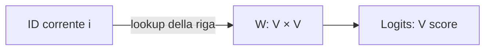

Nella vista parziale, `1.1` è lo score più alto mostrato. I logits sono score
non limitati, non probabilità. La shape cambia da `[B,T]` a `[B,T,V]`.

### Codice di riferimento aggiunto in questa lezione

```python
class LanguageModel(nn.Module):
    def __init__(self, vocabulary_size):
        super().__init__()
        self.token_embedding_table = nn.Embedding(
            num_embeddings=vocabulary_size,
            embedding_dim=vocabulary_size,
        )

    def forward(self, input_ids):
        logits = self.token_embedding_table(input_ids)

        return logits
```

Il primo modello è definito in `study/snapshots/lesson_12/model.py` e usato da
`study/lessons/12_bigram_model.py`.

### Sintassi e logica

- `class LanguageModel(nn.Module):` crea un tipo di modello che partecipa alla
  registrazione dei parametri, al trasferimento tra device e alla
  serializzazione di PyTorch.
- `super().__init__()` inizializza `nn.Module` prima di assegnare layer figli
  a `self`.
- `nn.Embedding(V, V)` è una matrice addestrabile con `V` righe e `V`
  colonne. Un token ID ne seleziona una riga, usata direttamente come vettore
  di logits.
- `model(input_ids)` richiama `forward` tramite il meccanismo di
  `nn.Module`; per un input `[B,T]`, il risultato è `[B,T,V]`.
- `self.token_embedding_table(input_ids)` esegue il lookup per tutte le
  posizioni senza un loop Python esplicito.
- Un logit è uno score non normalizzato. Non serve ancora applicare softmax:
  la loss della lezione successiva accetta direttamente i logits.

### Codice ↔ matematica ↔ significato

| Codice | Lettura matematica | In parole semplici |
|---|---|---|
| `self.token_embedding_table(input_ids)` | $Z_{b,t,:}=W_{X_{b,t},:}$ | seleziona una riga di score appresa per ogni ID |

### Programmato rispetto ad appreso

- **Definito dal programmatore:** il lookup nella tabella e la shape di output.
- **Appreso durante il gradient training:** gli score memorizzati nella tabella.

## Lezione 13 — Bigram loss

### Sintesi della lezione: obiettivo e risultato

- **Prima:** logits `[B,T,V]` e target ID `[B,T]` correttamente allineati
- **Obiettivo:** misurare quanta probabilità i logits assegnano a ciascun token successivo corretto
- **Dopo:** i logits originali e una singola cross-entropy loss scalare e differenziabile
- **Vincolo:** il flatten deve mantenere ogni riga di logits abbinata al proprio target

### Comprendere la trasformazione

I logits indicano quali token il modello favorisce, ma non dicono se il token
favorito sia quello corretto. La cross-entropy confronta ogni riga di score sul
vocabulary con il target ID allineato. In ogni posizione del batch pone una
domanda precisa: quanta probabilità normalizzata ha assegnato questa riga al
token che è comparso davvero subito dopo?

Per un esempio aritmetico chiuso con soli tre token candidati — `sleeps`,
`here` e `.` — i logits `[1.2, 0.3, -0.1]` diventano probabilità
approssimativamente pari a `[0.60, 0.24, 0.16]`. Se il target è `sleeps`, la
loss della posizione è `-log(0.595) ≈ 0.52`. Questo vocabulary minuscolo serve
solo a mostrare un calcolo completo e leggibile; il modello reale normalizza
su tutte le `V` colonne.

`F.cross_entropy` si aspetta una riga di classificazione per ogni esempio.
Nel modello le righe sono distribuite sui due assi iniziali di `[B,T,V]`,
quindi il codice trasforma i logits in `[B*T,V]` e i target in `[B*T]`.
Entrambi i reshape seguono lo stesso ordine row-major. Se uno dei due venisse
riordinato diversamente, shape valide nasconderebbero etichette sbagliate.

La funzione combina un log-softmax numericamente stabile con la penalità
negative log e calcola la media sulle posizioni. Non restituisce un tensor di
probabilità: il metodo restituisce i logits originali, ancora strutturati, e
una sola loss scalare che la lezione successiva potrà differenziare.

### Trasformazione, passo dopo passo

1. **INPUT — Abbina logits e target**

   Ricevi `Z[B,T,V]` e `Y[B,T]`.

   **Cosa osservare:** ogni `Y[b,t]` indica la colonna corretta in
   `Z[b,t,:]`.

2. **OPERATION — Appiattisci gli stessi assi iniziali**

   ```learngpt-visual
   {
     "type": "tensor-flow",
     "title": "Appiattisci logits e target nello stesso ordine",
     "description": "Gli assi B e T vengono uniti senza spezzare l'abbinamento tra ogni previsione e il suo target.",
     "stages": [
       {"label": "Logits", "shape": "B × T × V", "note": "una riga di V score per posizione"},
       {"label": "Logits appiattiti", "shape": "(B·T) × V", "note": "stesso ordine di batch e tempo"},
       {"label": "Target appiattiti", "shape": "B·T", "note": "un ID corretto per ogni riga"}
     ]
   }
   ```

   **Cosa osservare:** usare lo stesso ordine preserva ogni coppia tra
   previsione ed etichetta.

3. **INTERMEDIATE STATE — Interpreta una riga**

   ```learngpt-visual
   {
     "type": "labeled-grid",
     "title": "Una riga di logits e il target corretto",
     "description": "Softmax interpreta gli score come probabilità; cross-entropy penalizza la probabilità assegnata a sleeps.",
     "columns": ["sleeps", "here", "."],
     "rows": [
       {"label": "logits", "cells": [{"value": "1.2", "state": "highlighted"}, {"value": "0.3"}, {"value": "−0.1"}]},
       {"label": "probabilità circa", "cells": [{"value": "0.60", "state": "highlighted"}, {"value": "0.24"}, {"value": "0.16"}]},
       {"label": "target", "cells": [{"value": "sleeps", "state": "highlighted"}, {"value": "—", "state": "masked"}, {"value": "—", "state": "masked"}]}
     ]
   }
   ```

   **Cosa osservare:** la probabilità è l'interpretazione interna della riga
   completa, non un tensor aggiuntivo restituito dal metodo.

4. **OPERATION — Penalizza e calcola la media**

   `F.cross_entropy(logits_flat, target_ids_flat)` calcola
   `-log(p_target)` per ogni riga e ne restituisce la media.

   **Cosa osservare:** una probabilità bassa sull'ID corretto produce una
   penalità più alta.

5. **OUTPUT — Restituisci logits e loss scalare**

   Il ramo di training restituisce `(logits, loss)`.

   **Cosa osservare:** lo scalare riassume la qualità, mentre i logits conservano
   la shape `[B,T,V]` per l'ispezione.

### Dove siamo arrivati

Il modello dispone ora di un segnale di qualità differenziabile. Nessun
parametro è ancora cambiato: lo scalare descrive semplicemente le previsioni
del batch corrente in una forma utilizzabile dalla backpropagation.

- **Cambiato:** logits non valutati producono ora una cross-entropy loss scalare.
- **Preservato:** allineamento dei target, colonne del vocabulary e logits strutturati.
- **Prossimo passo:** calcolare i gradienti della loss e lasciare che un optimizer aggiorni la tabella.

> **Se ricordi una sola cosa:** la cross-entropy ricava la loss direttamente dai
> logits grezzi; il modello non deve restituire le probabilità.

### Come leggere la matematica

La frazione rappresenta la normalizzazione softmax; il meno logaritmo è una
penalità che cresce quando il modello assegna poca probabilità al token
corretto.

| Notazione | Leggilo come | Significato qui |
|---|---|---|
| $B$ | B | numero di esempi indipendenti nel batch |
| $T$ | T | numero di posizioni token nella context window |
| $V$ | V | dimensione del vocabulary |
| $Z$ | Z | score grezzi sul vocabulary, chiamati logits |
| $p$ | p | probabilità dopo la normalizzazione |
| $Y$ | Y | next-token ID corretti usati come target |
| $\mathcal L$ | L calligrafica, o loss | numero scalare che misura l'errore di previsione |

### Esempio visivo svolto

> **Stato dell'esempio ricorrente:** valutiamo la previsione
> `cat → sleeps` della frase canonica e penalizziamo la probabilità assegnata
> agli altri candidati.

Per questo calcolo usiamo un **vocabulary giocattolo chiuso di tre token**. Le
tre righe seguenti costituiscono l'intero dominio della softmax: non sono un
ritaglio dei `V` candidati del modello reale.

| Candidato | Logit $z$ | Probabilità softmax $p$ | Target? |
|---|---:|---:|:---:|
| `sleeps` | 1.2 | 0.60 | ✓ |
| `here` | 0.3 | 0.24 |  |
| `.` | -0.1 | 0.16 |  |

Usando la probabilità non arrotondata del target, la loss è
$-\log(0.595)\approx0.52$. Se la probabilità corretta aumenta, questo numero
diminuisce.

Softmax converte i logits in probabilità normalizzate:

$$p_j=\frac{e^{z_j}}{\sum_{k=1}^{V}e^{z_k}}.$$

Per la stabilità numerica si sottrae spesso $\max(z)$; le probabilità non
cambiano perché numeratore e denominatore ricevono lo stesso fattore.

La cross-entropy per il target $y$ è $-\log p_y$. PyTorch trasforma i logits da
`[B,T,V]` a `[B*T,V]` e i target da `[B,T]` a `[B*T]`, preservando
l'ordine delle righe. Per `[1.2,0.3,-0.1]`, le probabilità complete sono circa
`[0.595,0.242,0.162]`; il target 0 produce
$-\ln(0.595)\approx0.52$. Nel modello reale lo stesso calcolo usa tutte le
`V` colonne.

Per la loss non ridotta di una sola riga, $\ell=-\log p_y$, la derivata ha una
forma utile:

$$\frac{\partial\ell}{\partial z_j}=p_j-\mathbf 1[j=y].$$

In questa lezione `F.cross_entropy` restituisce la media delle $BT$ righe. Per
la riga $m$, la derivata della loss media è quindi

$$\frac{\partial\mathcal L}{\partial z_{m,j}}
=\frac{1}{BT}\left(p_{m,j}-\mathbf 1[j=y_m]\right).$$

Il gradiente tende quindi ad aumentare il logit corretto e a ridurre quelli
errati.

### Codice di riferimento aggiunto in questa lezione

```python
def forward(self, input_ids, target_ids=None):
    logits = self.token_embedding_table(input_ids)
    if target_ids is None:
        return logits

    batch_size, context_size, vocabulary_size = logits.shape
    logits_flat = logits.reshape(batch_size * context_size, vocabulary_size)
    target_ids_flat = target_ids.reshape(batch_size * context_size)
    loss = F.cross_entropy(logits_flat, target_ids_flat)
    return logits, loss
```

L'implementazione si trova in `study/snapshots/lesson_13/model.py`.

### Sintassi e logica

- `target_ids=None` rende opzionali i target: durante inference il metodo
  restituisce soltanto i logits; durante training riceve i target e restituisce
  anche la loss.
- `if target_ids is None: return logits` esce prima dei reshape specifici per
  la loss.
- Il tuple unpacking legge `[B,T,V]` da `logits.shape` e assegna un nome alle
  tre dimensioni.
- `reshape(B*T,V)` tratta ogni posizione di ogni riga come un esempio di
  classificazione; i target diventano il vettore corrispondente `[B*T]`.
- `F.cross_entropy` combina log-softmax e negative log-likelihood in modo
  numericamente stabile, ricevendo direttamente i logits grezzi.
- `return logits, loss` conserva le previsioni strutturate e rende disponibile
  l'obiettivo scalare usato da `backward()`.

### Codice ↔ matematica ↔ significato

| Codice | Lettura matematica | In parole semplici |
|---|---|---|
| `F.cross_entropy(logits_flat, target_ids_flat)` | $-\log p_y$ | penalizza una probabilità bassa sull'ID corretto |

## Lezione 14 — Bigram training

### Sintesi della lezione: obiettivo e risultato

- **Prima:** una tabella bigram addestrabile e una loss scalare, ma nessun processo di aggiornamento
- **Obiettivo:** calcolare ripetutamente i gradienti e lasciare che AdamW aggiorni i parametri registrati
- **Dopo:** valori dei parametri influenzati dalle transizioni next-token osservate
- **Vincolo:** l'ordine runtime deve restare campionamento del batch → forward/loss → azzeramento dei gradienti → backward → optimizer step

### Comprendere la trasformazione

La loss misura un errore, ma non può modificare da sola la tabella. Il training
collega tre tipi distinti di stato mutabile: i valori dei parametri nel
modello, i buffer dei gradienti associati a quei parametri e le statistiche
mobili gestite da AdamW. Tenere separati questi oggetti rende più semplice
capire che cosa cambia in ogni punto del loop.

A ogni iterazione campioniamo un nuovo batch ed eseguiamo il modello per
ottenere una loss scalare. `loss.backward()` percorre a ritroso il grafo di
calcolo registrato e accumula un gradiente nel buffer `.grad` di ogni
parametro. Il gradiente descrive una sensibilità locale: indica come una
piccola variazione del parametro influenzerebbe la loss di questo batch vicino
ai valori correnti.

PyTorch somma i gradienti per impostazione predefinita, quindi il loop elimina
i buffer precedenti prima del nuovo backward pass. `optimizer.step()` legge
poi i gradienti correnti e aggiorna la tabella dei parametri. Il codice usa
AdamW, il cui passo preciso comprende medie mobili, normalizzazione e weight
decay disaccoppiato: non coincide esattamente con la semplice equazione SGD
`w ← w-ηg`.

Un calcolo SGD con un solo parametro resta utile per capire il segno: con
`w=0.50`, `g=-0.20` ed `η=0.10`, l'aggiornamento semplice produrrebbe
`0.52`. Quel numero è un'intuizione, non il risultato esatto di AdamW. Inoltre
un singolo passo stocastico non garantisce che la loss misurata subito dopo
diminuisca. Nel corso del training, l'optimizer usa l'informazione dei
gradienti con l'obiettivo di migliorare le previsioni next-token.

### Trasformazione, passo dopo passo

1. **INPUT — Campiona un nuovo batch allineato**

   `create_batch(...)` restituisce i tensor di input e target per questo
   aggiornamento.

   **Cosa osservare:** il training modifica i parametri del modello, non gli ID
   target.

2. **OPERATION — Esegui il forward e misura la loss**

   `_, loss = model(input_ids, target_ids)` valuta la tabella corrente.

   **Cosa osservare:** lo scalare appartiene a questo batch e a questi valori
   dei parametri.

3. **OPERATION — Azzera e poi calcola i gradienti**

   ```text
   optimizer.zero_grad()
   loss.backward()
   ```

   **Cosa osservare:** l'azzeramento impedisce di sommare per errore gradienti
   rimasti dall'iterazione precedente.

4. **OPERATION — Lascia che AdamW aggiorni i parametri**

   `optimizer.step()` combina gradienti e stato dell'optimizer, quindi modifica
   la tabella registrata.

   **Cosa osservare:** è un passo adattivo AdamW, non una sottrazione SGD
   esatta.

5. **OUTPUT — Ripeti con uno stato del modello diverso**

   L'iterazione successiva calcola i logits usando parametri aggiornati.

   **Cosa osservare:** il miglioramento si valuta sull'andamento del training,
   non è garantito dopo ogni singolo passo stocastico.

### Dove siamo arrivati

Il primo modello può ora imparare dai dati invece di limitarsi a riportare un
errore. Architettura e vocabulary restano fissi, mentre AdamW modifica gli
score numerici delle transizioni memorizzati nella tabella.

- **Cambiato:** parametri arbitrari sono diventati valori aggiornati a partire dai gradienti osservati.
- **Preservato:** mappatura del vocabulary, shape del modello e obiettivo next-token.
- **Prossimo passo:** usare ripetutamente i logits addestrati per generare token.

> **Se ricordi una sola cosa:** backward calcola i gradienti; AdamW interpreta
> quei gradienti insieme al proprio stato per aggiornare i parametri.

### Come leggere la matematica

La freccia verso sinistra significa “sostituisci con un valore aggiornato”. Il
gradiente indica come varia localmente la loss quando cambiano i parametri.

| Notazione | Leggilo come | Significato qui |
|---|---|---|
| $\theta$ | theta | tutti i parametri addestrabili del modello |
| $\nabla_\theta\mathcal L$ | gradiente della loss rispetto a theta | sensibilità locale della loss ai parametri |
| $\eta$ | eta | learning rate |
| $\mathcal L$ | L calligrafica, o loss | misura scalare dell'errore di previsione |

### Esempio visivo svolto

> **Stato dell'esempio ricorrente:** usiamo un calcolo scalare di plain SGD per
> capire il segno di un possibile aggiornamento della transizione
> `cat → sleeps`. L'optimizer reale della lezione è AdamW.

| Passaggio | Valore |
|---|---:|
| Peso corrente $w$ | 0.50 |
| Gradiente $\partial L/\partial w$ | -0.20 |
| Learning rate $\eta$ | 0.10 |
| Intuizione plain-SGD $w-\eta g$ | $0.50-0.10(-0.20)=0.52$ |

Con plain SGD, un gradiente negativo farebbe aumentare questo peso. AdamW usa
anche medie mobili, normalizzazione e weight decay disaccoppiato: `0.52` non è
quindi il suo aggiornamento esatto.

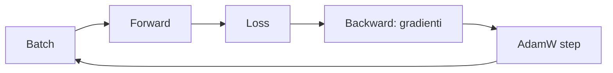

Il gradient descent semplice segue
$\theta\leftarrow\theta-\eta\nabla_\theta\mathcal L$. L'esempio con
`w=0.50`, `g=-0.20` ed `η=0.1` darebbe `w'=0.52`. Serve a leggere il
segno del gradiente, non a riprodurre AdamW.

Il loop separa valori dei parametri, buffer dei gradienti e stato
dell'optimizer. `zero_grad()` è necessario perché PyTorch accumula i
gradienti per somma. In questa lezione AdamW interpreta gradienti e proprio
stato per applicare l'aggiornamento. Un singolo passo stocastico non garantisce
una loss inferiore sul batch successivo.

### Codice di riferimento aggiunto in questa lezione

```python
optimizer = torch.optim.AdamW(model.parameters(), lr=LEARNING_RATE)

for step in range(TRAINING_STEPS):
    input_tensor, target_tensor = create_batch(
        data=training_data,
        batch_size=BATCH_SIZE,
        context_size=CONTEXT_SIZE,
    )

    logits, loss = model(input_tensor, target_tensor)

    optimizer.zero_grad()
    loss.backward()
    optimizer.step()

    if step % 50 == 0:
        print("Step:", step, "Loss:", loss.item())

print("Step:", TRAINING_STEPS, "Final loss:", loss.item())
```

Il loop completo e la stampa periodica e finale della loss si trovano in
`study/lessons/14_bigram_training.py`.

### Sintassi e logica

- `model.parameters()` espone tutti i tensor addestrabili registrati. AdamW
  mantiene per essi statistiche mobili e applica gli aggiornamenti al learning
  rate scelto.
- `range(TRAINING_STEPS)` ripete un optimizer step per iterazione.
- `input_tensor, target_tensor = create_batch(...)` campiona una nuova coppia
  input/target allineata.
- `logits, loss = model(input_tensor, target_tensor)` mantiene disponibili le
  previsioni strutturate; l'aggiornamento dei gradienti usa la loss scalare.
- `optimizer.zero_grad()` elimina i gradienti dell'iterazione precedente.
- `loss.backward()` percorre a ritroso il grafo di calcolo e riempie il campo
  `.grad` di ogni parametro.
- `optimizer.step()` legge gradienti e stato dell'optimizer e modifica i
  parametri. Deve avvenire dopo `backward()`.

### Codice ↔ matematica ↔ significato

| Codice | Lettura matematica | In parole semplici |
|---|---|---|
| `loss.backward()` | $\nabla_\theta\mathcal L$ | calcola il gradiente di ogni parametro |
| `optimizer.step()` | $\theta\leftarrow\operatorname{AdamW}(\theta,\nabla\mathcal L,\text{stato optimizer})$ | applica l'aggiornamento adattivo di AdamW, non una sottrazione plain-SGD esatta |

### Programmato rispetto ad appreso

- **Definito dal programmatore:** l'ordine del training loop e la scelta dell'optimizer.
- **Appreso durante il gradient training:** i valori dei parametri.

## Lezione 15 — Bigram generation

### Sintesi della lezione: obiettivo e risultato

- **Prima:** un bigram model addestrato e un prompt fisso
- **Obiettivo:** riutilizzare più volte la next-token prediction per estendere il prompt
- **Dopo:** una sequenza che contiene il prompt e tutti i token campionati
- **Vincolo:** vocabulary, parametri del modello e ordine left-to-right non cambiano durante la generation

### Comprendere la trasformazione

Il training ha insegnato alla bigram table ad assegnare score ai possibili
token successivi. La generation usa quella tabella senza modificarla. Il
passaggio importante è da una previsione singola a un **loop**: il token
campionato ora diventa parte dell'input della previsione successiva.

Partiamo da `The`. Il modello produce logits per tutte le posizioni del prompt,
ma soltanto l'ultima riga risponde alla domanda corrente: «che cosa può venire
dopo l'ultimo token?». La softmax trasforma quella riga in probabilità, il
sampling sceglie un ID e la concatenazione lo aggiunge all'asse temporale. Se
viene campionato `cat`, lo stato passa da `[The]` a `[The, cat]`; l'iterazione
successiva chiede che cosa può seguire `cat`.

Il sampling non equivale a scegliere sempre `argmax`: una probabilità alta
rende una continuazione più probabile, non obbligatoria. Due esecuzioni possono
quindi divergere pur partendo dallo stesso prompt. Durante il processo cambia
la sequenza, non ciò che il modello ha imparato.

Questa distinzione è utile anche nel debugging. Se una continuazione è debole,
bisogna separare una distribuzione poco utile da un campione semplicemente
sfortunato. Il modello produce la distribuzione; `multinomial` compie la scelta
casuale. Modificare la regola di sampling cambia quali possibilità vengono
esplorate, ma non riaddestra la bigram table.

### Trasformazione, passo dopo passo

1. **INPUT — Individua lo stato disponibile**

   Il punto di partenza è **un prompt fisso**. Prima di applicare qualsiasi
   operazione, bisogna riconoscere con precisione quale oggetto esiste già e
   quale informazione contiene.

   **Cosa osservare:** questo è l'input del passaggio, non il risultato che
   vogliamo ottenere.

2. **OPERATION — Bigram generation**

   Applichiamo l'operazione **Genera testo campionando ripetutamente il token successivo previsto**. La traccia seguente mostra
   gli oggetti nell'ordine di lettura, trasformazione e uso nel
   passaggio successivo:

   ```learngpt-visual
   {
     "type": "labeled-grid",
     "title": "Leggi la distribuzione dell'ultima posizione",
     "description": "Il prefisso corrente produce probabilità candidate per il token successivo; la generation usa soltanto la riga dell'ultima posizione.",
     "columns": ["cat", "dog", "…"],
     "rows": [
       {"label": "Probabilità dopo The", "cells": [{"value": "0.62", "state": "highlighted"}, {"value": "0.21"}, {"value": "…"}]}
     ]
   }
   ```

   ```learngpt-mermaid
   flowchart LR
       P["Prefisso · The"] --> S["Token campionato · cat"]
       P --> C["Concatena"]
       S --> C
       C --> N["Nuovo prefisso · The, cat"]
   ```

   **Cosa osservare:** ogni freccia rappresenta un'operazione concreta; una
   riga intermedia è sia l'output del passaggio precedente sia
   l'input di quello successivo.

3. **INTERMEDIATE STATE — Segui le consegne intermedie**

   Fermati su ciascuna riga centrale della traccia. Questi valori non sono
   decorativi: rendono visibile ciò che il programma deve aver già prodotto
   prima di poter continuare.

   **Cosa osservare:** se uno stato intermedio manca o ha significato diverso,
   la freccia successiva non possiede l'input corretto.

4. **CHECK — Proteggi il vincolo della lezione**

   Verifichiamo che **il vocabulary e il compito di prevedere il token successivo restano gli stessi**. Il controllo separa una trasformazione
   corretta da un risultato che sembra plausibile soltanto perché ha una shape
   compatibile.

   **Cosa osservare:** il passaggio modifica solo ciò che dichiara di
   modificare; l'informazione necessaria alle lezioni successive resta
   allineata.

5. **OUTPUT — Definisci il nuovo stato**

   Alla fine possediamo **un prompt esteso un token alla volta**. Questo è il nuovo punto di
   partenza del corso, non un semplice valore temporaneo.

   **Cosa osservare:** l'output conferma l'obiettivo indicato nella sintesi iniziale e può essere
   passato alla lezione successiva senza ricostruire il processo da zero.

### Dove siamo arrivati

La trasformazione è completa quando **un prompt esteso un token alla volta** è disponibile e il
vincolo della lezione è ancora rispettato. A questo punto possiamo fermarci:
anticipare il passaggio successivo renderebbe meno chiaro quale
responsabilità appartiene a questa lezione.

- **Cambiato:** un prompt fisso è diventato **un prompt esteso un token alla volta**.
- **Preservato:** il vocabulary e il compito di prevedere il token successivo restano gli stessi.
- **Prossimo passo:** **Limite di bigramma** userà questo risultato come nuovo input.

> **Se ricordi una sola cosa:** il risultato importante non è il nome
> dell'operazione, ma il nuovo stato verificabile che essa produce:
> **un prompt esteso un token alla volta**.

### Come leggere la matematica

La barra condizionale si legge «dato questo prefisso». La concatenazione
aggiunge l'ID campionato alla sequenza esistente.

| Notazione | Leggilo come | Significato qui |
|---|---|---|
| $X$ | X | input token ID o la matrice di ingresso corrente |
| $p$ | p | una probabilità dopo la normalizzazione |

### Esempio visivo svolto

> **Stato dell'esempio ricorrente:** parti da `The` e lascia che il sampling
> estenda il prefisso verso `The cat sleeps…`.

```learngpt-mermaid
flowchart LR
    P["Prefisso · The, cat"] --> M["Modello"]
    M --> D["Distribuzione · sleeps 0.54, sits 0.18, …"]
    D -->|"campiona sleeps"| N["Nuovo prefisso · The, cat, sleeps"]
```

```learngpt-mermaid
flowchart LR
    A["The"] -->|"sample cat"| B["The cat"]
    B -->|"sample sleeps"| C["The cat sleeps"]
    C -->|"continua"| D["…"]
```

Ogni ID campionato diventa parte del prefisso di input successivo.

La generation ripete:

1. esegui il modello sul prefisso corrente;
2. seleziona i logits dell'ultima posizione;
3. trasformali in probabilità con la softmax;
4. campiona un token;
5. aggiungilo e ripeti.

$$x^{(k+1)}=\operatorname{concat}\left(x^{(k)}, \operatorname{sample}(p(\cdot\mid x^{(k)}))\right).$$

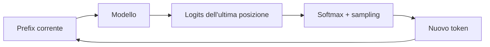

Il sampling, a differenza di `argmax`, può esplorare più continuazioni plausibili.

### Codice di riferimento aggiunto in questa lezione

```python
def generate(self, input_ids, max_new_tokens):
    generated_ids = input_ids
    for _ in range(max_new_tokens):
        logits = self(generated_ids)
        last_token_logits = logits[:, -1, :]
        probabilities = F.softmax(last_token_logits, dim=-1)
        next_token_ids = torch.multinomial(probabilities, num_samples=1)
        generated_ids = torch.cat((generated_ids, next_token_ids), dim=1)
    return generated_ids
```

La generation è mostrata in `study/lessons/15_bigram_generation.py`.

### Sintassi e logica

- `generated_ids = input_ids` inizializza la sequenza crescente con il prompt.
- `for _ in range(max_new_tokens)` esegue una decisione di sampling per ogni
  nuovo token richiesto.
- `logits = self(generated_ids)` ricalcola i next-token score dalla sequenza
  prodotta finora.
- `logits[:, -1, :]` conserva tutte le righe batch e le colonne vocabulary, ma
  seleziona soltanto l'ultima posizione temporale.
- `softmax(..., dim=-1)` normalizza l'asse del vocabulary in probabilità che
  sommano a uno.
- `torch.multinomial(..., num_samples=1)` campiona un token ID per riga batch.
- `torch.cat(..., dim=1)` aggiunge la nuova colonna `[B,1]` all'asse temporale
  di `[B,T]`.
- `return generated_ids` restituisce il prompt originale e tutti gli ID aggiunti.

### Codice ↔ matematica ↔ significato

Questa sezione mostra come il codice realizza direttamente la trasformazione matematica.

| Codice | Lettura matematica | In parole semplici |
|---|---|---|
| `torch.multinomial(probabilities, 1)` | $x'=\operatorname{concat}(x,\operatorname{sample}(p))$ | campiona e aggiungi un ID |

## Lezione 16 — Limite di bigramma

### Sintesi della lezione: obiettivo e risultato

- **Prima:** un generatore capace di estendere un prompt
- **Obiettivo:** mostrare quale parte del prompt il bigram model ignora
- **Dopo:** una prova controllata che token finali uguali producono previsioni uguali
- **Vincolo:** vocabulary, tabella addestrata e next-token task restano invariati durante il confronto

### Comprendere la trasformazione

Il generatore funziona, ma il bigram model sceglie la propria riga di score
usando soltanto l'ID del token corrente. Fornire un tensor più lungo non crea
comunicazione tra le posizioni.

Confrontiamo `The cat` e `A noisy cat`. I contesti precedenti sono diversi, ma entrambi i
prefissi terminano con `cat`: il modello seleziona quindi la stessa riga e
restituisce la stessa distribuzione. Non è un semplice errore di training, ma
un limite architetturale: i token precedenti non sono disponibili alla
previsione.

Questa lezione non aggiunge componenti. Mantiene fisso il token finale, cambia
soltanto il prefisso precedente e verifica se l'output può cambiare.

Il confronto spiega perché la generation può sembrare plausibile a livello
locale e perdere un soggetto, un tema o una dipendenza più lunga. Il modello
può imparare che `cat` è spesso seguito da `sleeps`, ma non può far dipendere
quella scelta da una parola apparsa due posizioni prima. Manca uno stato
contestualizzato, cioè una rappresentazione le cui feature contengano già
informazione raccolta dal prefisso visibile. La lezione trasforma quindi un
dubbio generico in una prova riproducibile del requisito architetturale.

### Trasformazione, passo dopo passo

1. **INPUT — Individua lo stato disponibile**

   Il punto di partenza è **un predittore del token successivo funzionante**. Prima di applicare qualsiasi
   operazione, bisogna riconoscere con precisione quale oggetto esiste già e
   quale informazione contiene.

   **Cosa osservare:** questo è l'input del passaggio, non il risultato che
   vogliamo ottenere.

2. **OPERATION — Limite di bigramma**

   Applichiamo l'operazione **Mostra perché una memoria limitata a un solo token non è sufficiente**. La traccia seguente mostra
   gli oggetti nell'ordine di lettura, trasformazione e uso nel
   passaggio successivo:

   ```learngpt-mermaid
   flowchart TD
       A["The cat"] --> C["Token finale: cat"]
       B["A noisy cat"] --> C
       C --> D["Stessa riga bigram"]
       D --> E["Stessa distribuzione del token successivo"]
   ```

   ```learngpt-visual
   {
     "type": "labeled-grid",
     "title": "Due prefissi, una sola distribuzione bigram",
     "description": "Poiché entrambi terminano con cat, il modello bigram seleziona la stessa riga e restituisce le stesse probabilità per il token successivo.",
     "columns": ["sleeps", "sits", "runs"],
     "rows": [
       {"label": "p(next | The cat)", "cells": [{"value": "0.10"}, {"value": "0.65", "state": "highlighted"}, {"value": "0.25"}]},
       {"label": "p(next | A noisy cat)", "cells": [{"value": "0.10"}, {"value": "0.65", "state": "highlighted"}, {"value": "0.25"}]}
     ]
   }
   ```

   **Cosa osservare:** ogni freccia rappresenta un'operazione concreta; una
   riga intermedia è sia l'output del passaggio precedente sia
   l'input di quello successivo.

3. **INTERMEDIATE STATE — Segui le consegne intermedie**

   Fermati su ciascuna riga centrale della traccia. Questi valori non sono
   decorativi: rendono visibile ciò che il programma deve aver già prodotto
   prima di poter continuare.

   **Cosa osservare:** se uno stato intermedio manca o ha significato diverso,
   la freccia successiva non possiede l'input corretto.

4. **CHECK — Proteggi il vincolo della lezione**

   Verifichiamo che **il vocabulary e il compito di prevedere il token successivo restano gli stessi**. Il controllo separa una trasformazione
   corretta da un risultato che sembra plausibile soltanto perché ha una shape
   compatibile.

   **Cosa osservare:** il passaggio modifica solo ciò che dichiara di
   modificare; l'informazione necessaria alle lezioni successive resta
   allineata.

5. **OUTPUT — Definisci il nuovo stato**

   Alla fine possediamo **una descrizione precisa del suo limite di contesto**. Questo è il nuovo punto di
   partenza del corso, non un semplice valore temporaneo.

   **Cosa osservare:** l'output conferma l'obiettivo indicato nella sintesi iniziale e può essere
   passato alla lezione successiva senza ricostruire il processo da zero.

### Dove siamo arrivati

La trasformazione è completa quando **una descrizione precisa del suo limite di contesto** è disponibile e il
vincolo della lezione è ancora rispettato. A questo punto possiamo fermarci:
anticipare il passaggio successivo renderebbe meno chiaro quale
responsabilità appartiene a questa lezione.

- **Cambiato:** un predittore del token successivo funzionante è diventato **una descrizione precisa del suo limite di contesto**.
- **Preservato:** il vocabulary e il compito di prevedere il token successivo restano gli stessi.
- **Prossimo passo:** **Token embedding** userà questo risultato come nuovo input.

> **Se ricordi una sola cosa:** il risultato importante non è il nome
> dell'operazione, ma il nuovo stato verificabile che essa produce:
> **una descrizione precisa del suo limite di contesto**.

### Come leggere la matematica

L'uguaglianza dice che, per un bigram model, l'intero prefix viene ridotto al
solo token finale.

| Notazione | Leggilo come | Significato qui |
|---|---|---|
| $V$ | V | vocabulary: il numero di possibili ID token |
| $p$ | p | una probabilità dopo la normalizzazione |

### Esempio visivo svolto

> **Stato dell'esempio ricorrente:** confrontiamo `The cat` con un altro
> prefix che termina in `cat`, così diventa visibile ciò che il bigram model
> ignora del prefisso precedente.

| Prefix | Ultimo token | Distribuzione del prossimo token |
|---|---|---|
| `The cat` | `cat` | `[0.10, 0.65, 0.25]` |
| `A noisy cat` | `cat` | `[0.10, 0.65, 0.25]` |

Storie diverse producono la stessa previsione perché il lookup usa soltanto
l'ID del token finale.

La tabella si applica solo su $x_t$:

$$p(x_{t+1}\mid x_0,\ldots,x_t)=p(x_{t+1}\mid x_t).$$

Due prefix che terminano con lo stesso token producono distribuzioni identiche,
anche se tutto ciò che li precede è diverso. La tabella contiene $V^2$
parametri. La lezione character-level corrente usa $V=51$, quindi la tabella
diretta contiene $51^2=2.601$ valori e conserva comunque una memoria di un solo
token. Come confronto esplicitamente rivolto al futuro, il progetto finale con
GPT-2 BPE userà $V=50.257$: lo stesso bigram design diretto supererebbe allora
2,5 miliardi di valori senza ottenere più contesto. Token embedding e attention
sostituiranno questa tabella diretta con un calcolo fattorizzato e dipendente
dal contesto.

### Codice di riferimento aggiunto in questa lezione

```python
logits_all = show_prediction(
    model=model,
    prompt="all",
    char_to_id=char_to_id,
    id_to_char=id_to_char,
)

logits_fall = show_prediction(
    model=model,
    prompt="fall",
    char_to_id=char_to_id,
    id_to_char=id_to_char,
)

logits_are = show_prediction(
    model=model,
    prompt="are",
    char_to_id=char_to_id,
    id_to_char=id_to_char,
)

print(torch.allclose(logits_all, logits_fall))
print(torch.allclose(logits_all, logits_are))
```

Questo confronto controllato è in `study/lessons/16_bigram_limit.py`.

### Sintassi e logica

- La lista esterna aggiunge la dimensione batch a ogni prompt, producendo una
  shape `[1,T]` invece di `[T]`.
- `encode("all", char_to_id)` e le chiamate analoghe applicano lo stesso
  tokenizer a tutti i prompt prima del confronto.
- `[:, -1, :]` seleziona i logits dell'ultima posizione dopo l'intero prompt.
- `torch.allclose(a, b)` controlla l'uguaglianza numerica elementwise con
  tolleranze a punti fluttuanti.
- `all` e `fall` terminano con lo stesso ID, quindi il modello seleziona la
  stessa riga della bigram table. Il resto del prefix non può influire finché
  attention non permette alle posizioni di comunicare.

# Modulo 4 — Significato e posizione


## Lezione 17 — Token embedding

### Sintesi della lezione: obiettivo e risultato

- **Prima:** token ID interi che identificano categorie, ma non offrono una geometria utile
- **Obiettivo:** sostituire ogni ID con un vettore appreso di C feature
- **Dopo:** una rappresentazione continua `[C]` in ogni posizione `[B,T]`
- **Vincolo:** identità, appartenenza al batch e posizione nella sequenza restano allineate

### Comprendere la trasformazione

Un ID come `7` è un indirizzo, non una grandezza. I layer neurali hanno invece
bisogno di feature reali che possano essere proiettate e confrontate. La
embedding table conserva una riga trainabile per ogni elemento del vocabulary.

Nel nostro esempio l'ID 7 indica `cat` e il lookup restituisce
`[0.4,-0.1,0.7]`. Le coordinate non hanno significati assegnati dal
programmatore: è il training a organizzarle in direzioni utili.

Applicato a tutti gli ID, il lookup introduce soltanto l'asse delle feature:
`[B,T]` diventa `[B,T,C]` senza cambiare l'ordine dei token.

I valori della tabella, a differenza della mappatura degli ID, sono parametri
del modello. La backpropagation raggiunge le righe selezionate dai token del
batch e ne modifica le coordinate. Il programmatore sceglie `V` e `C`; il
training sceglie i numeri conservati nella tabella `V × C`. Un vettore può
quindi diventare utile senza chiamare esplicitamente una coordinata «animale»
o «verbo». La lezione non aggiunge ancora posizione o contesto: crea il feature
space continuo in cui opereranno le trasformazioni successive.
Questo è il nuovo oggetto concreto consegnato alla lezione successiva.

### Trasformazione, passo dopo passo

1. **INPUT — Individua lo stato disponibile**

   Il punto di partenza è **un ID per token**. Prima di applicare qualsiasi
   operazione, bisogna riconoscere con precisione quale oggetto esiste già e
   quale informazione contiene.

   **Cosa osservare:** questo è l'input del passaggio, non il risultato che
   vogliamo ottenere.

2. **OPERATION — Token embedding**

   Applichiamo l'operazione **Rappresenta ogni token con un feature vector appreso**. La traccia seguente mostra
   gli oggetti nell'ordine di lettura, trasformazione e uso nel
   passaggio successivo:

   ```learngpt-visual
   {
     "type": "labeled-grid",
     "title": "Lookup dell'embedding del token cat",
     "description": "L'ID 7 seleziona la riga E[7], che diventa il feature vector appreso del token.",
     "columns": ["feature 0", "feature 1", "feature 2"],
     "rows": [
    {"label": "E[7]", "cells": [{"value": "0.4", "state": "highlighted"}, {"value": "−0.1", "state": "highlighted"}, {"value": "0.7", "state": "highlighted"}]}
     ]
   }
   ```

   ```learngpt-visual
   {
     "type": "labeled-grid",
     "title": "Esegui un lookup per ogni posizione token",
     "description": "Il lookup conserva l'ordine The, cat, sleeps e sostituisce ogni ID categorico con tre feature apprese.",
     "columns": ["c0", "c1", "c2"],
     "rows": [
       {"label": "The", "cells": [{"value": "0.3"}, {"value": "0.5"}, {"value": "0.1"}]},
       {"label": "cat", "cells": [{"value": "0.4", "state": "highlighted"}, {"value": "−0.1", "state": "highlighted"}, {"value": "0.7", "state": "highlighted"}]},
       {"label": "sleeps", "cells": [{"value": "0.1"}, {"value": "0.0"}, {"value": "−0.2"}]}
     ]
   }
   ```

   ```learngpt-visual
   {
     "type": "tensor-flow",
     "title": "Dagli ID agli stati token",
     "description": "Il lookup viene ripetuto in ogni posizione del batch e aggiunge un asse di C feature.",
     "stages": [
       {"label": "Token ID", "shape": "B × T", "note": "un indice per posizione"},
       {"label": "Lookup nella embedding table", "shape": "V × C", "note": "seleziona una riga per ID"},
       {"label": "Stati token", "shape": "B × T × C", "note": "un feature vector per posizione"}
     ]
   }
   ```

   **Cosa osservare:** ogni freccia rappresenta un'operazione concreta; una
   riga intermedia è sia l'output del passaggio precedente sia
   l'input di quello successivo.

3. **INTERMEDIATE STATE — Segui le consegne intermedie**

   Fermati su ciascuna riga centrale della traccia. Questi valori non sono
   decorativi: rendono visibile ciò che il programma deve aver già prodotto
   prima di poter continuare.

   **Cosa osservare:** se uno stato intermedio manca o ha significato diverso,
   la freccia successiva non possiede l'input corretto.

4. **CHECK — Proteggi il vincolo della lezione**

   Verifichiamo che **gli assi batch/tempo e il vincolo causale restano intatti mentre cambiano le feature**. Il controllo separa una trasformazione
   corretta da un risultato che sembra plausibile soltanto perché ha una shape
   compatibile.

   **Cosa osservare:** il passaggio modifica solo ciò che dichiara di
   modificare; l'informazione necessaria alle lezioni successive resta
   allineata.

5. **OUTPUT — Definisci il nuovo stato**

   Alla fine possediamo **$C$ feature apprese per token**. Questo è il nuovo punto di
   partenza del corso, non un semplice valore temporaneo.

   **Cosa osservare:** l'output conferma l'obiettivo indicato nella sintesi iniziale e può essere
   passato alla lezione successiva senza ricostruire il processo da zero.

### Dove siamo arrivati

La trasformazione è completa quando **$C$ feature apprese per token** sono disponibili e il
vincolo della lezione è ancora rispettato. A questo punto possiamo fermarci:
anticipare il passaggio successivo renderebbe meno chiaro quale
responsabilità appartiene a questa lezione.

- **Cambiato:** un ID per token è diventato **$C$ feature apprese per token**.
- **Preservato:** gli assi batch/tempo e il vincolo causale restano intatti mentre cambiano le feature.
- **Prossimo passo:** **Embedding di posizione** userà questo risultato come nuovo input.

> **Se ricordi una sola cosa:** il risultato importante non è il nome
> dell'operazione, ma il nuovo stato verificabile che essa produce:
> **$C$ feature apprese per token**.

### Come leggere la matematica

L'espressione con la tabella significa “usa ogni ID contenuto in $X$ come
indirizzo di una riga di $E$”.

| Notazione | Leggilo come | Significato qui |
|---|---|---|
| $B$ | B | numero di esempi indipendenti in un unico batch |
| $T$ | T | posizioni token in un unico context window |
| $V$ | V | vocabulary: il numero di possibili ID token |
| $C$ | C | numero di feature usate per rappresentare un token |
| $X$ | X | input token ID o la matrice di ingresso corrente |
| $E$ | E | token embedding table appresa |

### Esempio visivo svolto

> **Stato dell'esempio ricorrente:** esegui il lookup del vettore appreso per
> l'ID 7, che rappresenta `cat` nella sequenza canonica.

| Token ID didattico | Token | $c_0$ | $c_1$ | $c_2$ |
|---:|---:|---:|---:|---:|
| 1 | `sleeps` | 0.1 | 0.0 | -0.2 |
| 4 | `The` | 0.3 | 0.5 | 0.1 |
| 7 | `cat` | **0.4** | **-0.1** | **0.7** |

Il lookup dell'ID 7 restituisce la riga `[0.4,-0.1,0.7]`; il training modifica
i valori della riga, non l'ID intero.

Una embedding table $E\in\mathbb R^{V\times C}$ associa all'ID $i$ il vettore
continuo appreso $E_i$. Per un batch:

$$X\in\mathbb Z^{B\times T}\longrightarrow E[X]\in\mathbb R^{B\times T\times C}.$$

Esempio di estratto della tabella:

$$E=\begin{bmatrix}0.1&0.0&-0.2\\0.3&0.5&0.1\\0.4&-0.1&0.7\end{bmatrix}.$$

Il lookup dell'ID 7 restituisce `[0.4,-0.1,0.7]`. La backpropagation aggiorna
le righe usate dal batch; nessuna coordinata possiede un significato umano
predefinito.

### Codice di riferimento aggiunto in questa lezione

```python
self.token_embedding_table = nn.Embedding(
    num_embeddings=vocabulary_size,
    embedding_dim=embedding_size,
)
self.output_head = nn.Linear(
    in_features=embedding_size,
    out_features=vocabulary_size,
)

token_embeddings = self.token_embedding_table(input_ids)
logits = self.output_head(token_embeddings)
```

I livelli di rappresentazione e uscita separati vivono in `study/snapshots/lesson_17/model.py`.

### Sintassi e logica

- `nn.Embedding(V, C)` trasforma gli ID interi `[B,T]` in vettori
  `[B,T,C]`.
- `nn.Linear(C, V)` calcola `x @ W.T + b` sull'ultima dimensione e produce
  `[B,T,V]`, senza cambiare gli assi batch e tempo.
- Entrambi i layer contengono oggetti `nn.Parameter` addestrabili, registrati
  automaticamente quando vengono assegnati a `self`.
- `self.token_embedding_table(input_ids)` esegue la ricerca ID -to-vector,
  mentre `self.output_head(token_embeddings)` esegue la proiezione separata da
  vettore a logits.
- `token_embeddings` è un tensor interno, non una distribuzione di probabilità:
  può contenere qualsiasi valore reale utile alla trasformazione appresa.

### Codice ↔ matematica ↔ significato

Questa sezione mostra come il codice realizza direttamente la trasformazione matematica.

| Codice | Lettura matematica | In parole semplici |
|---|---|---|
| `token_embedding(input_ids)` | $E[X]$ | usa gli ID come indirizzi delle righe della embedding table |

### Programmato rispetto ad appreso

- **Definito dal programmatore:** il lookup nella embedding table.
- **Appreso durante il gradient training:** i valori di ogni riga della
  embedding table.

## Lezione 18 — Embedding di posizione

### Sintesi della lezione: obiettivo e risultato

- **Prima:** token vector che identificano il contenuto, ma non la posizione
- **Obiettivo:** aggiungere a ogni token vector un position vector appreso
- **Dopo:** uno stato di larghezza C che contiene identità e posizione
- **Vincolo:** allineamento batch/tempo e larghezza C restano invariati

### Comprendere la trasformazione

Token uguali partono da token vector uguali. Senza un altro segnale, `cat` in
posizione 1 e `cat` in posizione 4 sarebbero indistinguibili. Una position
embedding table fornisce un secondo vettore di larghezza `C`, selezionato dall'indice
temporale.

In `The cat sleeps here.`, il token vector di `cat`
`[0.4,-0.1,0.7]` si somma al position vector 1
`[0.0,0.2,-0.1]`, producendo `[0.4,0.1,0.6]`. Identità e ordine vengono
sovrapposti nello stesso feature space, non concatenati.

I position vector sono riutilizzati tra gli elementi del batch. Cambiano i
valori, ma la geometria `[B,T,C]` attesa da attention resta identica.

Usare la somma anziché la concatenazione ha una conseguenza precisa: i layer
successivi ricevono un solo residual stream di larghezza C. Possono imparare a
interpretare combinazioni di identità e posizione, ma non ricevono due metà
separate e già etichettate. Inoltre, la dimensione della position table limita
l'indice massimo rappresentabile; durante la generation l'input deve essere
ritagliato quando supera il context configurato. Non avviene ancora alcuno
scambio tra token: ogni posizione arricchisce soltanto il proprio vettore con
il proprio indice.

### Trasformazione, passo dopo passo

1. **INPUT — Individua lo stato disponibile**

   Il punto di partenza è **l'identità dei token ma non l'ordine**. Prima di applicare qualsiasi
   operazione, bisogna riconoscere con precisione quale oggetto esiste già e
   quale informazione contiene.

   **Cosa osservare:** questo è l'input del passaggio, non il risultato che
   vogliamo ottenere.

2. **OPERATION — Embedding di posizione**

   Applichiamo l'operazione **Aggiungi informazioni su dove si verifica ogni token**. La traccia seguente mostra
   gli oggetti nell'ordine di lettura, trasformazione e uso nel
   passaggio successivo:

   ```learngpt-visual
   {
     "type": "labeled-grid",
     "title": "Recupera token vector e position vector compatibili",
     "description": "Entrambi i lookup restituiscono vettori larghi C, quindi le feature corrispondenti possono essere sommate direttamente.",
     "columns": ["c0", "c1", "c2"],
     "rows": [
       {"label": "E[cat]", "cells": [{"value": "0.4", "state": "highlighted"}, {"value": "−0.1"}, {"value": "0.7"}]},
       {"label": "P[1]", "cells": [{"value": "0.0"}, {"value": "0.2", "state": "highlighted"}, {"value": "−0.1"}]}
     ]
   }
   ```

   ```learngpt-visual
   {
     "type": "matrix-operation",
     "title": "Somma identità del token e posizione feature per feature",
     "description": "La somma elementwise aggiunge a cat l'informazione della posizione 1 senza combinarlo con un altro token.",
     "operands": [
       {"label": "Token embedding E[cat]", "shape": "1 × 3", "values": [["0.4", "−0.1", "0.7"]]},
       {"label": "Position embedding P[1]", "shape": "1 × 3", "values": [["0.0", "0.2", "−0.1"]]}
     ],
     "operators": ["+"],
     "result": {"label": "Stato combinato", "shape": "1 × 3", "values": [["0.4", "0.1", "0.6"]]}
   }
   ```

   ```learngpt-visual
   {
     "type": "tensor-flow",
     "title": "Combina identità e posizione",
     "description": "La somma conserva la shape e produce uno stato che distingue lo stesso token in posizioni diverse.",
     "stages": [
       {"label": "Token embedding", "shape": "B × T × C", "note": "identità appresa"},
       {"label": "Position embedding", "shape": "T × C", "note": "broadcast lungo B"},
       {"label": "Residual state iniziale", "shape": "B × T × C", "note": "identità più posizione"}
     ]
   }
   ```

   **Cosa osservare:** ogni freccia rappresenta un'operazione concreta; una
   riga intermedia è sia l'output del passaggio precedente sia
   l'input di quello successivo.

3. **INTERMEDIATE STATE — Segui le consegne intermedie**

   Fermati su ciascuna riga centrale della traccia. Questi valori non sono
   decorativi: rendono visibile ciò che il programma deve aver già prodotto
   prima di poter continuare.

   **Cosa osservare:** se uno stato intermedio manca o ha significato diverso,
   la freccia successiva non possiede l'input corretto.

4. **CHECK — Proteggi il vincolo della lezione**

   Verifichiamo che **gli assi batch/tempo e il vincolo causale restano intatti mentre cambiano le feature**. Il controllo separa una trasformazione
   corretta da un risultato che sembra plausibile soltanto perché ha una shape
   compatibile.

   **Cosa osservare:** il passaggio modifica solo ciò che dichiara di
   modificare; l'informazione necessaria alle lezioni successive resta
   allineata.

5. **OUTPUT — Definisci il nuovo stato**

   Alla fine possediamo **identità del token e posizione nella sequenza**. Questo è il nuovo punto di
   partenza del corso, non un semplice valore temporaneo.

   **Cosa osservare:** l'output conferma l'obiettivo indicato nella sintesi iniziale e può essere
   passato alla lezione successiva senza ricostruire il processo da zero.

### Dove siamo arrivati

La trasformazione è completa quando **identità del token e posizione nella sequenza** sono disponibili e il
vincolo della lezione è ancora rispettato. A questo punto possiamo fermarci:
anticipare il passaggio successivo renderebbe meno chiaro quale
responsabilità appartiene a questa lezione.

- **Cambiato:** l'identità dei token ma non l'ordine è diventato **identità del token e posizione nella sequenza**.
- **Preservato:** gli assi batch/tempo e il vincolo causale restano intatti mentre cambiano le feature.
- **Prossimo passo:** **Causal self-attention head** userà questo risultato come nuovo input.

> **Se ricordi una sola cosa:** il risultato importante non è il nome
> dell'operazione, ma il nuovo stato verificabile che essa produce:
> **identità del token e posizione nella sequenza**.

### Come leggere la matematica

Le due lookup table hanno la stessa larghezza C; la somma avviene feature per
feature e i position vector vengono riutilizzati su tutto il batch.

| Notazione | Leggilo come | Significato qui |
|---|---|---|
| $B$ | B | numero di esempi indipendenti in un unico batch |
| $T$ | T | posizioni token in un unico context window |
| $C$ | C | numero di feature usate per rappresentare un token |
| $E$ | E | token embedding table appresa |
| $P$ | P | position embedding table appresa |
| $R_l$ | R con pedice l | residual-stream tensor che entra nel block l |

### Esempio visivo svolto

> **Stato dell'esempio ricorrente:** sommiamo al token vector di `cat` il
> position vector dell'indice 1, cioè la posizione occupata da `cat` in
> `The cat sleeps here.`.

| Componente per `cat` nella posizione 1 | $c_0$ | $c_1$ | $c_2$ |
|---|---:|---:|---:|
| Token embedding | 0.4 | -0.1 | 0.7 |
| Position embedding | 0.0 | 0.2 | -0.1 |
| Somma in ingresso al block | **0.4** | **0.1** | **0.6** |

La somma conserva la larghezza $C=3$ e combina identità e ordine.

Self-attention, da sola, è permutation-equivariant: senza informazioni
posizionali, riordinare i token riordina gli output ma non introduce una
nozione di «prima» e «dopo». LearnGPT usa una tabella appresa
$P\in\mathbb R^{T_{max}\times C}$ e la somma tramite broadcasting:

$$R_{b,t,:}=E_{X_{b,t},:}+P_{t,:}.$$

Se il token vector è `[0.4,-0.1,0.7]` e il position vector è
`[0.0,0.2,-0.1]`, il residual stream risultante è `[0.4,0.1,0.6]`.

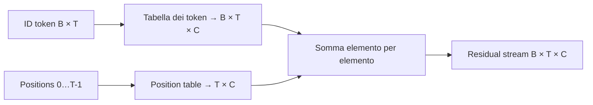

### Codice di riferimento aggiunto in questa lezione

```python
self.position_embedding_table = nn.Embedding(
    num_embeddings=context_size,
    embedding_dim=embedding_size,
)

current_context_size = input_ids.shape[1]
positions = torch.arange(current_context_size, device=input_ids.device)
token_embeddings = self.token_embedding_table(input_ids)
position_embeddings = self.position_embedding_table(positions)
embeddings = token_embeddings + position_embeddings
```

Il limite di contesto durante generation è anche aggiunto in `study/snapshots/lesson_18/model.py`.

### Sintassi e logica

- `nn.Embedding(context_size, embedding_size)` alloca un position vector
  appreso di larghezza `C` per ogni indice da `0` a `context_size-1`.
- `input_ids.shape[1]` legge `T`, la lunghezza della sequenza corrente.
- `torch.arange(T, device=...)` crea gli ID di posizione da `0` a `T-1` sullo
  stesso device dell'input, evitando incompatibilità tra CPU e acceleratore.
- I token embedding hanno shape `[B,T,C]`; i position embedding hanno shape
  `[T,C]`. Il broadcasting riutilizza questi ultimi per tutte le `B` righe.
- `embeddings = token_embeddings + position_embeddings` combina l'identità del
  token e la posizione senza concatenare i vettori o modificare la larghezza del
  modello.
- Generation mantiene solo `generated_ids[:, -self.context_size:]`, perché il
  position table e la causal mask supportano al massimo il context configurato.

### Codice ↔ matematica ↔ significato

Questa sezione mostra come il codice realizza direttamente la trasformazione matematica.

| Codice | Lettura matematica | In parole semplici |
|---|---|---|
| `token_embeddings + position_embeddings` | $R=E[X]+P$ | combina identità del token e posizione |

### Programmato rispetto ad appreso

- **Definito dal programmatore:** la somma e gli indici di posizione.
- **Appreso durante il gradient training:** i token vector e i position vector.

# Modulo 5 — I token condividono il contesto


## Lezione 19 — Causal self-attention head

### Sintesi della lezione: obiettivo e risultato

- **Prima:** ogni token possiede identità e posizione, ma non informazioni dagli altri token
- **Obiettivo:** permettere a ogni posizione di raccogliere il contesto utile dal prefisso visibile
- **Dopo:** uno stato contestualizzato per token e per attention head
- **Vincolo:** una posizione può usare solo se stessa e i token precedenti, mai quelli futuri

### Comprendere la trasformazione

Prima di questa lezione, `The`, `cat`, `sleeps`, `here` e `.` hanno vettori
diversi perché rappresentano token e posizioni diverse, ma ogni vettore dipende
solo dal proprio token e dalla propria posizione. Il token `sleeps` non ha ancora
un meccanismo per usare informazioni provenienti da `The` o `cat`. La
**self-attention** introduce precisamente questa dipendenza dal contesto: per
ogni posizione costruisce una nuova rappresentazione combinando le informazioni
dei token ammessi dal vincolo causale.

Prima di introdurre query, key e value appresi, considera la versione minima del
procedimento. Scegli una posizione, assegna uno score ai token consentiti,
trasforma quegli score in pesi che sommano a uno e calcola una media pesata delle
informazioni disponibili. In questi termini, la self-attention permette a un
token di costruire un nuovo context vector usando informazioni proprie e dei
token precedenti. Il meccanismo Q/K/V qui sotto è il modo parametrico con cui un
Transformer produce quegli score e stabilisce quali informazioni entrano
nell'output.

Per capire il processo, separiamo tre ruoli. La **query** descrive il confronto
che il token corrente deve eseguire; le **key** descrivono le informazioni usate
per confrontare ogni token candidato; i **value** contengono l'informazione che
può contribuire all'output.
Query, key e value sono vettori diversi ottenuti con proiezioni apprese. Per
questo non basta dire che un token usa un altro token: prima il modello misura
la compatibilità tra query e key, poi usa il risultato per decidere quanto di
ogni value deve entrare nell'output.

Seguiamo una sola riga dell'attention, quella prodotta dalla query di
`sleeps`. Usiamo `q_sleeps=[1,1]` e confrontiamola con tutte le key della frase
`The cat sleeps here.`. La moltiplicazione corretta è
**query per key trasposte**, cioè `q_sleeps × Kᵀ`. Il risultato
`[1,1,2,2,2]` assegna uno score a ciascuna posizione. Uno score più grande
significa maggiore compatibilità in questo piccolo esempio, ma non è ancora
una percentuale e non è ancora sicuro dal punto di vista causale.

Gli score vengono prima divisi per `√2`, perché la head ha due feature. Lo
scaling impedisce che dot product più larghi crescano troppo e rendano la
softmax eccessivamente concentrata. Poi interviene la **causal mask**: mentre
predice dalla posizione `sleeps`, il modello può usare `The`, `cat` e `sleeps`,
ma non `here` né `.`. I due score futuri diventano `−∞`; dopo la softmax,
corrispondono esattamente a peso zero. La causalità non suggerisce al modello di
ignorare il futuro: rende quelle posizioni matematicamente inaccessibili.

La softmax trasforma gli score consentiti nei pesi
`[0.25,0.25,0.50,0,0]`, che sommano a uno. Il risultato si legge così: il 25%
dell'informazione deriva dal value di `The`, il 25% da `cat` e il 50% da
`sleeps`. Questi numeri non vengono aggiunti direttamente alla query. Formano
invece la riga `A_sleeps` della matrice di attention, che viene moltiplicata per
la matrice `V` dei value.

I vettori numerici dell'esempio sono scelti per rendere il conto leggibile,
non sono regole linguistiche scritte a mano. Nel modello reale, le matrici
`W_Q`, `W_K` e `W_V` iniziano con valori che non sanno ancora che cosa renda
utile un confronto. Durante il training, i gradienti modificano queste
proiezioni affinché query, key e value aiutino a prevedere il prossimo token.
Il programmatore definisce la sequenza delle operazioni e il vincolo causale;
il modello apprende quali confronti e quali contenuti siano utili all'interno
di quella struttura.

Questa distinzione evita l'equivoco più comune: attention **non calcola
`Q×V`** e non “aggiunge semplicemente `V`”. `QKᵀ` decide *quali posizioni pesare*;
la softmax converte quella decisione in pesi; `A×V` combina *le informazioni
dei value*. Con i value e i pesi arrotondati dell'esempio, la query di
`sleeps` produce circa `[1.00,1.25]`. Le due componenti sono somme ponderate
calcolate separatamente: ogni feature dell'output usa gli stessi pesi sui token,
ma valori di feature differenti.

Anche il risultato arrotondato `[1.00,1.25]` non è una traduzione leggibile
della parola `sleeps`.
Sono due coordinate nello spazio di feature della head: assumono significato
solo perché le trasformazioni successive sanno come usarle. Il valore da
seguire qui è la dipendenza causale: entrambe le coordinate dipendono
esclusivamente da token consentiti e conservano informazione ponderata del
prefisso. Più avanti, le altre head produrranno combinazioni differenti e una
proiezione riunirà i loro output nel residual stream.

Nel modello reale lo stesso procedimento avviene per ogni posizione, per ogni
elemento del batch e per ogni head. Le matrici sono più grandi, ma la logica
non cambia: confronta, limita il campo visibile, normalizza e combina. Il nuovo
vettore di `sleeps` è quindi contestualizzato perché incorpora informazione dal
suo prefisso. Non è ancora il risultato finale del Transformer: una singola
head produce un solo tipo di combinazione, che la prossima lezione affiancherà
ad altre head per rappresentare relazioni diverse.

### Trasformazione, passo dopo passo

1. **INPUT — Seleziona la query e le key candidate**

   ```learngpt-visual
   {
     "type": "matrix-operation",
     "title": "q_sleeps × Kᵀ",
     "description": "La query q_sleeps = [1  1] viene moltiplicata per tutte le key trasposte e produce uno score grezzo per ogni token.",
     "operands": [
       {
         "label": "q_sleeps",
         "shape": "1 × 2",
         "values": [["1", "1"]]
       },
       {
         "label": "Kᵀ: The, cat, sleeps, here, .",
         "shape": "2 × 5",
         "values": [["1", "0", "1", "2", "0"], ["0", "1", "1", "0", "2"]]
       }
     ],
     "operators": ["×"],
     "result": {
       "label": "q_sleeps × Kᵀ",
       "shape": "1 × 5",
       "values": [["1", "1", "2", "2", "2"]]
     }
   }
   ```

   **Cosa osservare:** la query è una riga `1 × 2`; ogni token contribuisce una
   colonna `2 × 1` nella matrice delle key.

2. **OPERATION — Confronta la query con tutte le key**

   ```learngpt-visual
   {
     "type": "labeled-grid",
     "title": "Dot product di q_sleeps con ogni key",
     "description": "Ogni colonna mostra il calcolo concreto; il risultato completo è q_sleeps × Kᵀ = [1  1  2  2  2].",
     "columns": ["The", "cat", "sleeps", "here", "."],
     "rows": [
       {
         "label": "dot product",
         "cells": [
           {"value": "1×1 + 1×0 = 1"},
           {"value": "1×0 + 1×1 = 1"},
           {"value": "1×1 + 1×1 = 2", "state": "highlighted"},
           {"value": "1×2 + 1×0 = 2"},
           {"value": "1×0 + 1×2 = 2"}
         ]
       },
       {
         "label": "q_sleeps × Kᵀ",
         "cells": [
           {"value": "1"},
           {"value": "1"},
           {"value": "2", "state": "highlighted"},
           {"value": "2"},
           {"value": "2"}
         ]
       }
     ]
   }
   ```

   **Cosa osservare:** ogni colonna di `Kᵀ` appartiene a un token; il dot
   product produce uno score, non ancora un peso, per ogni colonna.

3. **OPERATION — Scala gli score**

   ```learngpt-visual
   {
     "type": "labeled-grid",
     "title": "Scala gli score con ÷ √2",
     "description": "La divisione controlla la grandezza degli score senza modificarne l'ordine relativo.",
     "columns": ["The", "cat", "sleeps", "here", "."],
     "rows": [
       {"label": "score grezzi", "cells": [{"value": "1.00"}, {"value": "1.00"}, {"value": "2.00", "state": "highlighted"}, {"value": "2.00"}, {"value": "2.00"}]},
       {"label": "÷ √2", "cells": [{"value": "0.71"}, {"value": "0.71"}, {"value": "1.41", "state": "highlighted"}, {"value": "1.41"}, {"value": "1.41"}]}
     ]
   }
   ```

   **Cosa osservare:** l'ordine delle preferenze resta uguale, ma la grandezza
   degli score viene controllata prima della softmax.

4. **CONSTRAINT — Applica la causal mask**

   ```learngpt-visual
   {
     "type": "labeled-grid",
     "title": "Applica la causal mask",
     "description": "Per la query sleeps, le posizioni future here e punto vengono sostituite con −∞ prima della softmax.",
     "columns": ["The", "cat", "sleeps", "here", "."],
     "rows": [
       {"label": "prima della causal mask", "cells": [{"value": "0.71"}, {"value": "0.71"}, {"value": "1.41", "state": "highlighted"}, {"value": "1.41"}, {"value": "1.41"}]},
       {"label": "dopo la causal mask", "cells": [{"value": "0.71"}, {"value": "0.71"}, {"value": "1.41", "state": "highlighted"}, {"value": "−∞", "state": "masked"}, {"value": "−∞", "state": "masked"}]}
     ]
   }
   ```

   **Cosa osservare:** `here` e `.` si trovano nel futuro rispetto a `sleeps`;
   i loro score vengono esclusi anche se erano numericamente alti.

5. **INTERMEDIATE STATE — Trasforma gli score in pesi**

   ```learngpt-visual
   {
     "type": "labeled-grid",
     "title": "softmax trasforma gli score in pesi",
     "description": "I pesi delle posizioni visibili sommano a uno; la softmax produce ≈ [0.25  0.25  0.50   0   0].",
     "columns": ["The", "cat", "sleeps", "here", "."],
     "rows": [
       {"label": "score mascherati", "cells": [{"value": "0.71"}, {"value": "0.71"}, {"value": "1.41", "state": "highlighted"}, {"value": "−∞", "state": "masked"}, {"value": "−∞", "state": "masked"}]},
       {"label": "softmax", "cells": [{"value": "0.25"}, {"value": "0.25"}, {"value": "0.50", "state": "highlighted"}, {"value": "0.00", "state": "masked"}, {"value": "0.00", "state": "masked"}]}
     ]
   }
   ```

   **Cosa osservare:** i pesi consentiti sommano a `1`; le posizioni
   mascherate ricevono peso `0`.

6. **OPERATION — Combina i value con `A×V`**

   ```learngpt-visual
   {
     "type": "matrix-operation",
     "title": "A×V combina i value",
     "description": "I pesi di attention moltiplicano le righe di V; i value futuri non contribuiscono perché hanno peso zero.",
     "operands": [
       {
         "label": "A_sleeps",
         "shape": "1 × 5",
         "values": [["0.25", "0.25", "0.50", "0", "0"]]
       },
       {
         "label": "V: The, cat, sleeps, here, .",
         "shape": "5 × 2",
         "values": [["2", "0"], ["0", "3"], ["1", "1"], ["4", "4"], ["2", "2"]]
       }
     ],
     "operators": ["×"],
     "result": {
       "label": "A_sleeps × V ≈ [1.00 1.25]",
       "shape": "1 × 2",
       "values": [["1.00", "1.25"]]
     }
   }
   ```

   **Cosa osservare:** i value futuri sono presenti in `V`, ma il loro peso
   zero impedisce qualsiasi contributo all'output di `sleeps`.

7. **OUTPUT — Ottieni lo stato contestualizzato**

   Calcolando una feature per volta:

   ```learngpt-visual
   {
     "type": "labeled-grid",
     "title": "Calcolo delle feature di OUTPUT",
     "description": "Ogni feature di output è la somma pesata della colonna corrispondente di V.",
     "columns": ["Somma pesata espansa", "Risultato"],
     "rows": [
       {
         "label": "Feature 1",
         "cells": [
           {"value": "0.25×2 + 0.25×0 + 0.50×1 + 0×4 + 0×2"},
           {"value": "≈ 1.00", "state": "highlighted"}
         ]
       },
       {
         "label": "Feature 2",
         "cells": [
           {"value": "0.25×0 + 0.25×3 + 0.50×1 + 0×4 + 0×2"},
           {"value": "≈ 1.25", "state": "highlighted"}
         ]
       }
     ]
   }
   ```

   Con i pesi arrotondati mostrati sopra, il risultato è
   `o_sleeps ≈ [1.00  1.25]`.

   **Cosa osservare:** l'output non copia un singolo token; riassume il
   prefisso visibile secondo i pesi calcolati dalla query e dalle key.

### Dove siamo arrivati

Il token `sleeps` non è più rappresentato soltanto dalla propria identità e
posizione: il suo nuovo vettore contiene una somma ponderata del prefisso
`The cat sleeps`. La stessa trasformazione viene eseguita per ogni posizione,
sempre rispettando la direzione causale. Abbiamo così introdotto il primo
meccanismo con cui i token comunicano all'interno del modello.

- **Cambiato:** ogni posizione riceve uno stato contestualizzato prodotto da una somma ponderata di value.
- **Preservato:** ordine temporale, assi batch/tempo e divieto di osservare token futuri.
- **Prossimo passo:** eseguire più head in parallelo per apprendere diversi tipi di relazione.

> **Se ricordi una sola cosa:** `QKᵀ` sceglie quali posizioni pesare, la softmax crea i
> pesi e `A×V` combina le informazioni visibili.

### Come leggere la matematica

Leggi $QK^T$ come “ogni query confrontata con ogni key”. La softmax trasforma
questi confronti in pesi usati per combinare i value.

| Notazione | Leggilo come | Significato qui |
|---|---|---|
| $B$ | B | numero di esempi indipendenti in un unico batch |
| $T$ | T | posizioni token in un unico context window |
| $C$ | C | numero di feature usate per rappresentare un token |
| $D=C/H$ | D uguale a C diviso H | numero di feature elaborate da un'attention head |
| $Q$ | Q | query: ciò che ogni token sta cercando |
| $K$ | K | key: ciò che ogni token rende disponibile al confronto |
| $V'$ | V primo | value: le informazioni che l'attention può combinare |
| $S$ | S | score grezzi prodotti confrontando query e key |
| $A$ | A | pesi di attention normalizzati |

### Esempio visivo svolto

> **Stato dell'esempio ricorrente:** passa dalla singola riga numerica di `sleeps` alla regola matriciale causale che vale per l'intera frase `The cat sleeps here.`.

Per la riga $i$ associata a `sleeps`, la causal mask dipende soltanto dalla
posizione relativa della key $j$, non dal valore del suo score:

| Key alla posizione $j$ | Relazione con `sleeps` | $M_{ij}$ | Può contribuire? |
|---|---|---:|:---:|
| `The` | precedente | $0$ | sì |
| `cat` | precedente | $0$ | sì |
| `sleeps` | posizione corrente | $0$ | sì |
| `here` | futura | $-\infty$ | no |
| `.` | futura | $-\infty$ | no |

Il valore $0$ lascia invariato uno score consentito; $-\infty$ fa diventare
zero il relativo peso dopo la softmax. La regola è uguale per ogni frase e per
ogni riga della matrice.

Per gli stati $R\in\mathbb R^{B\times T\times C}$, una head calcola tre
proiezioni indipendenti:

$$Q=RW_Q,\quad K=RW_K,\quad V'=RW_V, \qquad W_Q,W_K,W_V\in\mathbb R^{C\times D}.$$

La trasposizione agisce sugli ultimi due assi di $K$. La moltiplicazione
contrae quindi la feature dimension $D$ e conserva entrambi gli assi temporali:

$$
Q\in\mathbb R^{B\times T\times D},
\quad
K^{\mathsf T}\in\mathbb R^{B\times D\times T},
\quad
QK^{\mathsf T}\in\mathbb R^{B\times T\times T}.
$$

Definiamo gli score scalati e la mask come

$$
S_{ij}=\frac{q_i\cdot k_j}{\sqrt D},
\qquad
M_{ij}=
\begin{cases}
0 & \text{se } j\le i,\\
-\infty & \text{se } j>i.
\end{cases}
$$

La softmax viene applicata separatamente a ogni riga:

$$
A_{ij}
=\frac{\exp(S_{ij}+M_{ij})}
{\sum_{k=0}^{T-1}\exp(S_{ik}+M_{ik})}.
$$

Da questa definizione seguono due invarianti: $A_{ij}=0$ quando $j>i$ e
$\sum_j A_{ij}=1$ per ogni query $i$. L'output della head non combina le query,
ma i value:

$$
O_i=\sum_{j=0}^{i}A_{ij}V'_j,
\qquad
O=AV'\in\mathbb R^{B\times T\times D}.
$$

| Passaggio | Shape in ingresso | Shape in uscita | Asse contratto |
|---|---|---|---|
| proiezioni $R W_Q$, $R W_K$, $R W_V$ | `[B,T,C] × [C,D]` | `[B,T,D]` | $C$ |
| confronto $QK^{\mathsf T}$ | `[B,T,D] × [B,D,T]` | `[B,T,T]` | $D$ |
| softmax per riga | `[B,T,T]` | `[B,T,T]` | nessuno |
| combinazione $AV'$ | `[B,T,T] × [B,T,D]` | `[B,T,D]` | tempo delle key |

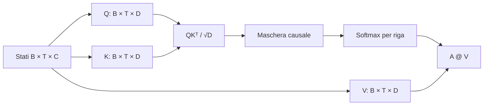

Il divisore $\sqrt D$ evita che la varianza dei dot product cresca con la
larghezza della head. Score troppo grandi saturerebbero la softmax e
indebolirebbero i gradienti utili.

### Codice di riferimento aggiunto in questa lezione

```python
self.key = nn.Linear(embedding_size, head_size, bias=False)
self.query = nn.Linear(embedding_size, head_size, bias=False)
self.value = nn.Linear(embedding_size, head_size, bias=False)
self.register_buffer(
    "causal_mask",
    torch.tril(torch.ones(context_size, context_size)),
)

attention_scores = queries @ keys.transpose(-2, -1)
attention_scores = attention_scores / math.sqrt(keys.shape[-1])
causal_mask = self.causal_mask[:current_context_size, :current_context_size]
attention_scores = attention_scores.masked_fill(
    causal_mask == 0,
    float("-inf"),
)
attention_weights = F.softmax(attention_scores, dim=-1)
attended_embeddings = attention_weights @ values
```

La `SelfAttentionHead` completa si trova in `study/snapshots/lesson_19/model.py`.

### Sintassi e logica

- `self.key`, `self.query` e `self.value` sono tre mappe lineari indipendenti,
  senza bias, da `[B,T,C]` a `[B,T,D]`.
- `register_buffer("causal_mask", ...)` registra la maschera nello stato del
  modulo: viene salvata nel checkpoint e spostata insieme al modello, ma non è
  un parametro addestrabile.
- `keys.transpose(-2, -1)` scambia gli assi tempo e feature delle key.
  L'operatore `@` produce così uno score per ogni coppia query/key, con shape
  `[B,T,T]`.
- La divisione per `math.sqrt(keys.shape[-1])` riduce gli score in base alla
  larghezza `D` della head e mantiene stabile la softmax.
- `masked_fill(causal_mask == 0, float("-inf"))` sostituisce con $-\infty$ gli
  score delle posizioni future prima della normalizzazione.
- `F.softmax(attention_scores, dim=-1)` trasforma ogni riga consentita in pesi
  che sommano a uno; le posizioni mascherate ricevono peso zero.
- `attention_weights @ values` usa quei pesi per combinare i value e produce
  output contestuali di shape `[B,T,D]`.

### Codice ↔ matematica ↔ significato

Questa sezione mostra come il codice realizza direttamente la trasformazione matematica.

| Codice | Lettura matematica | In parole semplici |
|---|---|---|
| `queries @ keys.transpose(-2, -1)` | $QK^{\mathsf T}$ | confronta ogni query con ogni key |
| `weights @ values` | $AV'$ | combina le informazioni usando pesi normalizzati |

## Lezione 20 — Multi-head attention

### Sintesi della lezione: obiettivo e risultato

- **Prima:** una sola vista contestuale
- **Obiettivo:** Esegui più viste di attention in parallelo
- **Dopo:** $H$ viste contestuali riunite in $C$ feature
- **Vincolo:** gli assi batch/tempo e il vincolo causale restano intatti mentre cambiano le feature

### Comprendere la trasformazione

Una sola head offre a ciascun token un solo modo appreso di raccogliere il
contesto. La multi-head attention esegue più head indipendenti sullo stesso
residual state.

Per `sleeps`, supponiamo che due head di larghezza 2 producano:

```learngpt-visual
{
  "type": "matrix-operation",
  "title": "Concatena due attention head",
  "description": "Le slice prodotte in parallelo vengono affiancate lungo l'asse delle feature, senza calcolarne la media.",
  "operands": [
    {"label": "head 1", "shape": "1 × 2", "values": [["1.00", "1.25"]]},
    {"label": "head 2", "shape": "1 × 2", "values": [["−0.20", "0.80"]]}
  ],
  "operators": ["concatena"],
  "result": {"label": "feature concatenate", "shape": "1 × 4", "values": [["1.00", "1.25", "−0.20", "0.80"]]}
}
```

La concatenazione non calcola una media: conserva le due slice una accanto
all'altra. Con `H=2` e `D=2`, la larghezza finale è `HD=4=C`. Eventuali ruoli
come «relazione vicina» o «relazione lunga» sono comportamenti appresi
possibili, non compiti assegnati dal codice.

Ogni head riceve gli stessi stati di input, ma possiede parametri Q, K e V
indipendenti. Due head possono quindi produrre attention weight e combinazioni
di value
diversi per `sleeps`. La concatenazione conserva tali differenze affinché la
proiezione successiva possa combinarle. Le head lavorano in parallelo:
l'output della prima non diventa l'input della seconda. Batch, tempo e causal
mask restano allineati; la sola trasformazione visibile in questa lezione
avviene lungo l'asse delle feature.
Il risultato resta un tensor `[B,T,C]` pronto per la proiezione successiva.

### Trasformazione, passo dopo passo

1. **INPUT — Individua lo stato disponibile**

   Il punto di partenza è **una sola vista contestuale**. Prima di applicare qualsiasi
   operazione, bisogna riconoscere con precisione quale oggetto esiste già e
   quale informazione contiene.

   **Cosa osservare:** questo è l'input del passaggio, non il risultato che
   vogliamo ottenere.

2. **OPERATION — Multi-head attention**

   Applichiamo l'operazione **Esegui più viste di attention in parallelo**. La traccia seguente mostra
   gli oggetti nell'ordine di lettura, trasformazione e uso nel
   passaggio successivo:

   ```learngpt-mermaid
   flowchart TD
       A["Stati token condivisi"] --> H1["Head 1: una vista della relazione"]
       A --> H2["Head 2: un'altra vista"]
       A --> HR["Head rimanenti"]
       H1 --> C["Concatenazione"]
       H2 --> C
       HR --> C
       C --> O["Stato token con più viste"]
   ```

   **Cosa osservare:** ogni freccia rappresenta un'operazione concreta; una
   riga intermedia è sia l'output del passaggio precedente sia
   l'input di quello successivo.

3. **INTERMEDIATE STATE — Segui le consegne intermedie**

   Fermati su ciascuna riga centrale della traccia. Questi valori non sono
   decorativi: rendono visibile ciò che il programma deve aver già prodotto
   prima di poter continuare.

   **Cosa osservare:** se uno stato intermedio manca o ha significato diverso,
   la freccia successiva non possiede l'input corretto.

4. **CHECK — Proteggi il vincolo della lezione**

   Verifichiamo che **gli assi batch/tempo e il vincolo causale restano intatti mentre cambiano le feature**. Il controllo separa una trasformazione
   corretta da un risultato che sembra plausibile soltanto perché ha una shape
   compatibile.

   **Cosa osservare:** il passaggio modifica solo ciò che dichiara di
   modificare; l'informazione necessaria alle lezioni successive resta
   allineata.

5. **OUTPUT — Definisci il nuovo stato**

   Alla fine possediamo **$H$ viste contestuali riunite in $C$ feature**. Questo è il nuovo punto di
   partenza del corso, non un semplice valore temporaneo.

   **Cosa osservare:** l'output conferma l'obiettivo indicato nella sintesi iniziale e può essere
   passato alla lezione successiva senza ricostruire il processo da zero.

### Dove siamo arrivati

La trasformazione è completa quando **$H$ viste contestuali riunite in $C$ feature** sono disponibili e il
vincolo della lezione è ancora rispettato. A questo punto possiamo fermarci:
anticipare il passaggio successivo renderebbe meno chiaro quale
responsabilità appartiene a questa lezione.

- **Cambiato:** una sola vista contestuale è diventato **$H$ viste contestuali riunite in $C$ feature**.
- **Preservato:** gli assi batch/tempo e il vincolo causale restano intatti mentre cambiano le feature.
- **Prossimo passo:** **Attention output projection** userà questo risultato come nuovo input.

> **Se ricordi una sola cosa:** il risultato importante non è il nome
> dell'operazione, ma il nuovo stato verificabile che essa produce:
> **$H$ viste contestuali riunite in $C$ feature**.

### Come leggere la matematica

Concatenare significa affiancare gli output delle head lungo l'asse delle
feature; la relazione $HD=C$ ripristina la larghezza del modello.

| Notazione | Leggilo come | Significato qui |
|---|---|---|
| $B$ | B | numero di esempi indipendenti in un unico batch |
| $T$ | T | posizioni token in un unico context window |
| $C$ | C | numero di feature usate per rappresentare un token |
| $H$ | H | numero di attention head eseguite in parallelo |
| $D=C/H$ | D uguale a C diviso H | numero di feature elaborate da un'attention head |

### Esempio visivo svolto

> **Stato dell'esempio ricorrente:** consenti a più head di analizzare relazioni diverse nello stesso prefisso visibile `The cat sleeps`.

| Head | Esempio di messa a fuoco | Larghezza di uscita |
|---:|---|---:|
| 1 | possibile relazione tra token vicini | $D=2$ |
| 2 | possibile relazione a distanza maggiore | $D=2$ |
| Concatenato | entrambe le slice di feature affiancate | $HD=4=C$ |

Le etichette descrivono comportamenti che potrebbero emergere dal training,
non ruoli assegnati dal codice.

Le $H$ head apprendono matrici di proiezione diverse e possono quindi
rappresentare relazioni diverse. Ogni head restituisce `[B,T,D]`; la
concatenazione ripristina la larghezza $HD=C$:

$$O_{cat}=\operatorname{Concat}(O_1,\ldots,O_H) \in\mathbb R^{B\times T\times C}.$$

Il codice non assegna ruoli grammaticali alle head: qualsiasi specializzazione
emerge dal training. L'implementazione fused di produzione rimodella i tensor
in `[B,H,T,D]`, così tutte le head possono essere elaborate da kernel
vettorializzati invece che da un loop Python.

### Codice di riferimento aggiunto in questa lezione

```python
self.heads = nn.ModuleList(
    [
        SelfAttentionHead(
            embedding_size=embedding_size,
            head_size=head_size,
            context_size=context_size,
        )
        for _ in range(num_heads)
    ]
)

attended_outputs = []
attention_weights_by_head = []

for head in self.heads:
    attended_embeddings, attention_weights = head(embeddings)
    attended_outputs.append(attended_embeddings)
    attention_weights_by_head.append(attention_weights)

concatenated_embeddings = torch.cat(attended_outputs, dim=-1)
return concatenated_embeddings, attention_weights_by_head
```

Questo è il loop multi-head letterale presente in
`study/snapshots/lesson_20/model.py`.

### Sintassi e logica

- La list comprehension costruisce `num_heads` moduli indipendenti; i pesi non
  sono condivisi.
- `nn.ModuleList` è essenziale: una normale lista Python non registrerebbe i
  parametri annidati per optimizer, trasferimenti di device e checkpoint.
- `for head in self.heads` esegue in sequenza i moduli registrati in questa
  implementazione Python didattica; le head sono matematicamente indipendenti,
  non input runtime l'una dell'altra.
- Il tuple unpacking conserva in liste separate sia l'output contestuale sia
  gli attention weight diagnostici di ogni head.
- Ogni uscita è `[B, T, D]`. `torch.cat(..., dim=-1)` concatena l'asse delle
  feature per formare `[B, T, num_heads * D]`, cioè `[B, T, C]`.
- Il costruttore applica `num_heads * head_size == embedding_size`, mantenendo
  la larghezza unita uguale a `C` per connessioni residue successive.

### Codice ↔ matematica ↔ significato

Questa sezione mostra come il codice realizza direttamente la trasformazione matematica.

| Codice | Lettura matematica | In parole semplici |
|---|---|---|
| `torch.cat(head_outputs, dim=-1)` | $\operatorname{Concat}(O_1,\ldots,O_H)$ | affianca le slice prodotte dalle head |

### Programmato rispetto ad appreso

- **Definito dal programmatore:** la suddivisione in head e la concatenazione.
- **Appreso durante il gradient training:** le proiezioni indipendenti usate da
  ogni head.

## Lezione 21 — Attention output projection

### Sintesi della lezione: obiettivo e risultato

- **Prima:** slice di feature separate per head
- **Obiettivo:** integra le attention head concatenate nello spazio delle feature del residual stream
- **Dopo:** un attention update proiettato
- **Vincolo:** gli assi batch/tempo e il vincolo causale restano intatti mentre cambiano le feature

### Comprendere la trasformazione

La concatenazione affianca le slice delle head, ma non le fa interagire.
L'output projection applica una trasformazione affine appresa al vettore
di larghezza `C`, permettendo a ogni feature di output di usare tutte le head.

Questo layer esiste perché più head sono utili solo se il modello può
ricombinarle. Senza projection, i layer successivi riceverebbero slice fisse
che conservano ancora il confine della head che le ha prodotte. Con la
projection, il modello può imparare regole del tipo “usa una parte della head
1 e una parte della head 3 per questa feature di output”, mantenendo comunque
la stessa interfaccia `[B,T,C]`.

```learngpt-visual
{
  "type": "matrix-operation",
  "title": "Output projection delle head concatenate",
  "description": "La matrice W_O e il bias b_O combinano tutte le slice in un unico update largo C.",
  "operands": [
    {"label": "head concatenate", "shape": "1 × 4", "values": [["1.00", "1.25", "−0.20", "0.80"]]},
    {"label": "W_O", "shape": "4 × 4", "values": [["w00", "w01", "w02", "w03"], ["w10", "w11", "w12", "w13"], ["w20", "w21", "w22", "w23"], ["w30", "w31", "w32", "w33"]]},
    {"label": "b_O", "shape": "1 × 4", "values": [["b0", "b1", "b2", "b3"]]}
  ],
  "operators": ["×", "+"],
  "result": {"label": "attention update", "shape": "1 × 4", "values": [["0.90", "0.55", "0.35", "0.70"]]}
}
```

I valori esatti vengono appresi. Input e output mantengono larghezza C, ma le
coordinate di uscita sono combinazioni lineari delle slice, non copie separate. La somma al
residual stream avverrà nella lezione successiva.

La parola “projection” può nascondere l'operazione concreta. In ogni posizione
batch/tempo, la stessa matrice e lo stesso bias trasformano una riga in modo
indipendente; qui nessun token legge un altro token. La comunicazione temporale
è già avvenuta dentro le head. Questo layer riorganizza soltanto l'evidenza che
esse hanno restituito. Mantenere `[B,T,C]` è il contratto che renderà possibile
la residual addition della prossima lezione.
Non modifica la causal mask né aggiunge posizioni: applica la stessa
trasformazione affine C-to-C a ogni riga. Il nuovo stato è un singolo update
proiettato, non più un insieme di slice che i layer successivi devono
interpretare separatamente.

### Trasformazione, passo dopo passo

1. **INPUT — Individua lo stato disponibile**

   Il punto di partenza è **slice di feature separate per head**. Prima di applicare qualsiasi
   operazione, bisogna riconoscere con precisione quale oggetto esiste già e
   quale informazione contiene.

   **Cosa osservare:** questo è l'input del passaggio, non il risultato che
   vogliamo ottenere.

2. **OPERATION — Attention output projection**

   Applichiamo l'operazione **integra le attention head concatenate nello spazio delle feature del residual stream**. La traccia seguente mostra
   gli oggetti nell'ordine di lettura, trasformazione e uso nel
   passaggio successivo:

   ```learngpt-visual
   {
     "type": "tensor-flow",
     "title": "Dalle slice separate a un attention update",
     "description": "La projection combina le feature ma conserva batch, tempo e larghezza C.",
     "stages": [
       {"label": "Output concatenati delle head", "shape": "B × T × C", "note": "slice ancora separate lungo C"},
       {"label": "Output projection appresa", "shape": "[B,T,C]", "note": "stessa trasformazione per ogni posizione"},
       {"label": "Attention update proiettato", "shape": "B × T × C", "note": "compatibile con il residual stream"}
     ]
   }
   ```

   **Cosa osservare:** ogni freccia rappresenta un'operazione concreta; una
   riga intermedia è sia l'output del passaggio precedente sia
   l'input di quello successivo.

3. **INTERMEDIATE STATE — Segui le consegne intermedie**

   Fermati su ciascuna riga centrale della traccia. Questi valori non sono
   decorativi: rendono visibile ciò che il programma deve aver già prodotto
   prima di poter continuare.

   **Cosa osservare:** se uno stato intermedio manca o ha significato diverso,
   la freccia successiva non possiede l'input corretto.

4. **CHECK — Proteggi il vincolo della lezione**

   Verifichiamo che **gli assi batch/tempo e il vincolo causale restano intatti mentre cambiano le feature**. Il controllo separa una trasformazione
   corretta da un risultato che sembra plausibile soltanto perché ha una shape
   compatibile.

   **Cosa osservare:** il passaggio modifica solo ciò che dichiara di
   modificare; l'informazione necessaria alle lezioni successive resta
   allineata.

5. **OUTPUT — Definisci il nuovo stato**

   Alla fine possediamo **un attention update proiettato**. Questo è il nuovo punto di
   partenza del corso, non un semplice valore temporaneo.

   **Cosa osservare:** l'output conferma l'obiettivo indicato nella sintesi iniziale e può essere
   passato alla lezione successiva senza ricostruire il processo da zero.

### Dove siamo arrivati

La trasformazione è completa quando **un attention update proiettato** è disponibile e il
vincolo della lezione è ancora rispettato. A questo punto possiamo fermarci:
anticipare il passaggio successivo renderebbe meno chiaro quale
responsabilità appartiene a questa lezione.

- **Cambiato:** slice di feature separate per head è diventato **un attention update proiettato**.
- **Preservato:** gli assi batch/tempo e il vincolo causale restano intatti mentre cambiano le feature.
- **Prossimo passo:** **Attention residual connection** userà questo risultato come nuovo input.

> **Se ricordi una sola cosa:** il risultato importante non è il nome
> dell'operazione, ma il nuovo stato verificabile che essa produce:
> **un attention update proiettato**.

### Come leggere la matematica

La moltiplicazione per $W_O$ mappa le $C$ feature di input in $C$ feature di
output, preservando gli assi batch e tempo.

| Notazione | Leggilo come | Significato qui |
|---|---|---|
| $B$ | B | numero di esempi indipendenti in un unico batch |
| $T$ | T | posizioni token in un unico context window |
| $C$ | C | numero di feature usate per rappresentare un token |
| $W$ | W | una matrice appresa di parametri |

### Esempio visivo svolto

> **Stato dell'esempio ricorrente:** concateniamo gli output delle head
> calcolati per `sleeps`, poi li proiettiamo in un unico update per quel token.

```learngpt-visual
{
  "type": "tensor-flow",
  "title": "Unisci le slice delle head, poi applica una proiezione appresa",
  "description": "La concatenazione ripristina C canali e W_O trasforma le slice fisse in un singolo update largo C.",
  "stages": [
    {"label": "Output delle head: [0.8, −0.2] e [0.1, 0.6]", "shape": "2 × D = 2", "note": "due viste contestuali indipendenti"},
    {"label": "Stato concatenato: [0.8, −0.2, 0.1, 0.6]", "shape": "C = 4", "note": "slice adiacenti prima della proiezione"},
    {"label": "Moltiplica per W_O", "shape": "C", "note": "combinazione appresa delle feature"},
    {"label": "Update proiettato largo C", "shape": "C", "note": "compatibile con il residual stream"}
  ]
}
```

$W_O$ consente a ogni feature di output di usare informazioni provenienti da
tutte le head.

Le head concatenate occupano slice fisse dell'asse delle feature. Una matrice
appresa $W_O\in\mathbb R^{C\times C}$ le combina:

$$\operatorname{MHA}(R)=\operatorname{Concat}(O_1,\ldots,O_H)W_O+b_O.$$

La shape rimane `[B,T,C]`, necessaria per la residual addition. La proiezione
permette a ogni feature di uscita di combinare evidenza da tutte le head. Lo
snapshot di questa lezione non applica ancora Dropout.

### Codice di riferimento aggiunto in questa lezione

```python
self.output_projection = nn.Linear(
    in_features=num_heads * head_size,
    out_features=embedding_size,
)

concatenated_embeddings = torch.cat(attended_outputs, dim=-1)
projected_embeddings = self.output_projection(concatenated_embeddings)
return projected_embeddings, attention_weights_by_head
```

La proiezione è introdotta in `study/snapshots/lesson_21/model.py`.

### Sintassi e logica

- `in_features` deve corrispondere alla larghezza concatenata
  `num_heads * head_size`; `out_features` ripristina `embedding_size`.
- `nn.Linear` applica la stessa trasformazione affine appresa in modo indipendente a
  ogni posizione batch e tempo.
- `torch.cat(attended_outputs, dim=-1)` unisce gli output delle head in
  `[B,T,num_heads*D]`, cioè `[B,T,C]`.
- `self.output_projection(concatenated_embeddings)` combina l'asse delle feature
  concatenato e ripristina `[B,T,C]`.
- `return projected_embeddings, attention_weights_by_head` separa la
  rappresentazione usata dal modello dalle attention map diagnostiche.

### Codice ↔ matematica ↔ significato

Questa sezione mostra come il codice realizza direttamente la trasformazione matematica.

| Codice | Lettura matematica | In parole semplici |
|---|---|---|
| `self.output_projection(concatenated)` | $O_{cat}W_O$ | combina le feature provenienti da tutte le head |

### Programmato rispetto ad appreso

- **Definita dal programmatore:** la proiezione di uscita.
- **Appreso durante il gradient training:** come ricombinare l'evidenza
  prodotta dalle diverse head.

# Modulo 6 — Assemblare il Transformer


## Lezione 22 — Attention residual connection

### Sintesi della lezione: obiettivo e risultato

- **Prima:** stato e risultato attention separati
- **Obiettivo:** Aggiungi l'attention update senza sostituire lo stato esistente
- **Dopo:** un residual stream che contiene entrambi
- **Vincolo:** gli assi batch/tempo e il vincolo causale restano intatti mentre cambiano le feature

### Comprendere la trasformazione

Sostituire lo stato con l'attention update eliminerebbe il percorso diretto
della rappresentazione originale. La residual connection tratta invece
attention come una correzione da sommare allo stato in ingresso.

L'idea importante è “aggiungi, non sovrascrivere”. Le reti profonde hanno
bisogno di un percorso affidabile lungo il quale informazioni e gradienti
possano attraversare molti layer. Il residual stream fornisce questo percorso:
ogni branch propone un update e lo stato originale può continuare in avanti
anche quando l'update non è ancora ben appreso.

```learngpt-visual
{
  "type": "matrix-operation",
  "title": "Residual addition dell'attention update",
  "description": "Lo stato esistente e l'update contestuale vengono sommati elemento per elemento.",
  "operands": [
    {"label": "stato esistente", "shape": "1 × 3", "values": [["0.40", "−0.20", "0.70"]]},
    {"label": "attention update", "shape": "1 × 3", "values": [["0.10", "0.30", "−0.10"]]}
  ],
  "operators": ["+"],
  "result": {"label": "risultato residual", "shape": "1 × 3", "values": [["0.50", "0.10", "0.60"]]}
}
```

I due tensor devono avere shape `[B,T,C]`. La somma preserva la shape e crea
un identity path utile sia all'informazione sia ai gradienti.

I due operandi hanno ruoli diversi. Il residual source è lo stato esistente
prima di attention; il branch output è informazione contestuale appena
calcolata. Nessuno dei due è una percentuale o un target. Dopo la somma rimane
un solo residual stream, quindi i layer successivi non devono gestire
separatamente i due tensor. Preservare C è sia un requisito matematico sia il
contratto architetturale del block, e garantisce che il nuovo stato possa
proseguire senza adapter.
La trasformazione termina quando la somma produce questo stato condiviso;
prima esistono ancora due percorsi distinti. Attention propone un update e il
residual stream lo conserva insieme all'informazione precedente.

### Trasformazione, passo dopo passo

1. **INPUT — Individua lo stato disponibile**

   Il punto di partenza è **stato e risultato attention separati**. Prima di applicare qualsiasi
   operazione, bisogna riconoscere con precisione quale oggetto esiste già e
   quale informazione contiene.

   **Cosa osservare:** questo è l'input del passaggio, non il risultato che
   vogliamo ottenere.

2. **OPERATION — Attention residual connection**

   Applichiamo l'operazione **Aggiungi l'attention update senza sostituire lo stato esistente**. La traccia seguente mostra
   gli oggetti nell'ordine di lettura, trasformazione e uso nel
   passaggio successivo:

   ```learngpt-visual
   {
     "type": "tensor-flow",
     "title": "Riunisci il branch in un solo residual stream",
     "description": "Lo stato sorgente e l'attention update condividono la shape B×T×C, quindi la somma elementwise restituisce la stessa interfaccia.",
     "stages": [
       {"label": "Residual state esistente R", "shape": "B × T × C", "note": "identity path"},
       {"label": "Attention update MHA(R)", "shape": "B × T × C", "note": "nuova informazione contestuale"},
       {"label": "Somma elemento per elemento", "shape": "B × T × C", "note": "somma le feature corrispondenti"},
       {"label": "Residual state che contiene entrambi", "shape": "B × T × C", "note": "unico input per il sublayer successivo"}
     ]
   }
   ```

   **Cosa osservare:** ogni freccia rappresenta un'operazione concreta; una
   riga intermedia è sia l'output del passaggio precedente sia
   l'input di quello successivo.

3. **INTERMEDIATE STATE — Segui le consegne intermedie**

   Fermati su ciascuna riga centrale della traccia. Questi valori non sono
   decorativi: rendono visibile ciò che il programma deve aver già prodotto
   prima di poter continuare.

   **Cosa osservare:** se uno stato intermedio manca o ha significato diverso,
   la freccia successiva non possiede l'input corretto.

4. **CHECK — Proteggi il vincolo della lezione**

   Verifichiamo che **gli assi batch/tempo e il vincolo causale restano intatti mentre cambiano le feature**. Il controllo separa una trasformazione
   corretta da un risultato che sembra plausibile soltanto perché ha una shape
   compatibile.

   **Cosa osservare:** il passaggio modifica solo ciò che dichiara di
   modificare; l'informazione necessaria alle lezioni successive resta
   allineata.

5. **OUTPUT — Definisci il nuovo stato**

   Alla fine possediamo **un residual stream che contiene entrambi**. Questo è il nuovo punto di
   partenza del corso, non un semplice valore temporaneo.

   **Cosa osservare:** l'output conferma l'obiettivo indicato nella sintesi iniziale e può essere
   passato alla lezione successiva senza ricostruire il processo da zero.

### Dove siamo arrivati

La trasformazione è completa quando **un residual stream che contiene entrambi** è disponibile e il
vincolo della lezione è ancora rispettato. A questo punto possiamo fermarci:
anticipare il passaggio successivo renderebbe meno chiaro quale
responsabilità appartiene a questa lezione.

- **Cambiato:** stato e risultato attention separati è diventato **un residual stream che contiene entrambi**.
- **Preservato:** gli assi batch/tempo e il vincolo causale restano intatti mentre cambiano le feature.
- **Prossimo passo:** **LayerNorm prima di attention** userà questo risultato come nuovo input.

> **Se ricordi una sola cosa:** il risultato importante non è il nome
> dell'operazione, ma il nuovo stato verificabile che essa produce:
> **un residual stream che contiene entrambi**.

### Come leggere la matematica

Il segno più indica una somma elementwise tra tensor: i due operandi devono
avere la stessa shape `[B,T,C]`.

| Notazione | Leggilo come | Significato qui |
|---|---|---|
| $B$ | B | numero di esempi indipendenti in un unico batch |
| $T$ | T | posizioni token in un unico context window |
| $C$ | C | numero di feature usate per rappresentare un token |
| $R_l$ | R con pedice l | residual-stream tensor che entra nel block l |

### Esempio visivo svolto

> **Stato dell'esempio ricorrente:** sommiamo l'attention update di `sleeps`
> al suo stato già presente nel residual stream.

| Feature | Stato esistente $R$ | Attention update | Risultato residual |
|---:|---:|---:|---:|
| 0 | 0.40 | 0.10 | **0.50** |
| 1 | -0.20 | 0.30 | **0.10** |
| 2 | 0.70 | -0.10 | **0.60** |

Lo skip path usa una normale somma elemento per elemento tra feature
corrispondenti.

Invece di sostituire lo stream, attention fornisce un aggiornamento:

$$R'=R+\operatorname{MHA}(R).$$

La somma elementwise richiede shape `[B,T,C]` identiche. Lo skip path crea un
identity path: se l'update appreso è inizialmente piccolo, informazioni e
gradienti possono comunque attraversare il blocco. La derivata contiene un
termine identità,
$\partial R'/\partial R=I+\partial\operatorname{MHA}/\partial R$.

### Codice di riferimento aggiunto in questa lezione

```python
attention_output, _ = self.multi_head_attention(embeddings)
residual_embeddings = embeddings + attention_output
logits = self.output_head(residual_embeddings)
```

La skip connection è illustrata in `study/snapshots/lesson_22/model.py`.

### Sintassi e logica

- `attention_output, _ = self.multi_head_attention(embeddings)` usa il tuple
  unpacking e scarta intenzionalmente gli attention weight diagnostici, perché
  questo forward path richiede soltanto l'update contestuale.
- `embeddings + attention_output` è una somma elementwise, quindi entrambi gli
  operandi devono avere shape `[B,T,C]`.
- L'originale `embeddings` forma l'identity path; il modulo attention impara
  soltanto l'update. Se la correzione parte vicino a zero, l'informazione
  originale può comunque propagarsi in avanti.
- La somma preserva la shape e permette all'output head `C → V` di consumare il
  risultato senza un adapter aggiuntivo.

### Codice ↔ matematica ↔ significato

Questa sezione mostra come il codice realizza direttamente la trasformazione matematica.

| Codice | Lettura matematica | In parole semplici |
|---|---|---|
| `embeddings + attention_output` | $R+\operatorname{MHA}(R)$ | conserva lo stato e aggiunge un update |

### Programmato rispetto ad appreso

- **Definito dal programmatore:** la somma della skip connection.
- **Appreso durante il gradient training:** l'aggiornamento attention.

## Lezione 23 — LayerNorm prima di attention

### Sintesi della lezione: obiettivo e risultato

- **Prima:** feature con scale variabili
- **Obiettivo:** Normalizza la scala delle feature di ogni token prima dell'attention
- **Dopo:** feature del branch normalizzate e poi riscalate con parametri appresi
- **Vincolo:** gli assi batch/tempo e il vincolo causale restano intatti mentre cambiano le feature

### Comprendere la trasformazione

Aggiornamenti ripetuti possono produrre feature con scale molto diverse.
Nell'architettura pre-norm, LayerNorm prepara il **branch input** per attention,
mentre il residual stream originale passa invariato lungo lo skip path.

LayerNorm risolve un problema pratico di ottimizzazione. Attention confronta
vettori tramite dot product, quindi la scala delle feature influenza quanto
gli score diventino appuntiti o piatti. Normalizzare il vettore di feature di
ogni token dà al branch attention una distribuzione di input più stabile,
mentre scale e offset appresi permettono al modello di recuperare grandezze
utili quando il training le scopre.

```learngpt-visual
{
  "type": "labeled-grid",
  "title": "Normalizza un token lungo l'asse delle feature",
  "description": "LayerNorm centra e ridimensiona le tre feature; gamma e beta appresi possono poi riscalare e traslare il branch input.",
  "columns": ["c0", "c1", "c2"],
  "rows": [
    {"label": "Input", "cells": [{"value": "1"}, {"value": "2"}, {"value": "3"}]},
    {"label": "Centrato, media 2", "cells": [{"value": "−1"}, {"value": "0", "state": "highlighted"}, {"value": "1"}]},
    {"label": "Normalizzato", "cells": [{"value": "≈ −1.22"}, {"value": "0", "state": "highlighted"}, {"value": "≈ 1.22"}]},
    {"label": "Poi γ e β appresi", "cells": [{"value": "attention", "state": "highlighted"}, {"value": "branch", "state": "highlighted"}, {"value": "input", "state": "highlighted"}]}
  ]
}
```

La normalizzazione avviene sulle C feature di un token, indipendentemente per
ogni posizione batch/tempo. Non combina token diversi. Poiché `γ` e `β` possono
riscalare e traslare le coordinate, è più preciso parlare di branch
normalizzato che affermare che il risultato finale abbia sempre media zero e
varianza uno.

La posizione prima di attention è essenziale. Attention legge la copia
normalizzata, mentre la residual addition usa la sorgente non modificata.
Spostare LayerNorm dopo la somma definirebbe un block post-norm con un data path
diverso. Qui l'obiettivo è più preciso: stabilizzare l'input del branch
appreso senza interrompere l'identity path. La shape resta `[B,T,C]` e il
calcolo continua a essere indipendente per ogni posizione.
Il risultato alimenta attention, mentre lo skip path conserva esattamente lo
stato ricevuto dal block.

### Trasformazione, passo dopo passo

1. **INPUT — Individua lo stato disponibile**

   Il punto di partenza è **feature con scale variabili**. Prima di applicare qualsiasi
   operazione, bisogna riconoscere con precisione quale oggetto esiste già e
   quale informazione contiene.

   **Cosa osservare:** questo è l'input del passaggio, non il risultato che
   vogliamo ottenere.

2. **OPERATION — LayerNorm prima di attention**

   Applichiamo l'operazione **Normalizza la scala delle feature di ogni token prima dell'attention**. La traccia seguente mostra
   gli oggetti nell'ordine di lettura, trasformazione e uso nel
   passaggio successivo:

   ```learngpt-visual
   {
     "type": "tensor-flow",
     "title": "Prepara il branch input per attention",
     "description": "La normalizzazione agisce sulle C feature di ogni token senza modificare batch o tempo.",
     "stages": [
       {"label": "Stato token irregolare", "shape": "B × T × C", "note": "scale diverse tra feature"},
       {"label": "Centra e normalizza", "shape": "B × T × C", "note": "media e dispersione per token"},
       {"label": "Applica γ e β", "shape": "B × T × C", "note": "scala e offset appresi"},
       {"label": "Input stabile per attention", "shape": "B × T × C", "note": "identity path invariato"}
     ]
   }
   ```

   **Cosa osservare:** ogni freccia rappresenta un'operazione concreta; una
   riga intermedia è sia l'output del passaggio precedente sia
   l'input di quello successivo.

3. **INTERMEDIATE STATE — Segui le consegne intermedie**

   Fermati su ciascuna riga centrale della traccia. Questi valori non sono
   decorativi: rendono visibile ciò che il programma deve aver già prodotto
   prima di poter continuare.

   **Cosa osservare:** se uno stato intermedio manca o ha significato diverso,
   la freccia successiva non possiede l'input corretto.

4. **CHECK — Proteggi il vincolo della lezione**

   Verifichiamo che **gli assi batch/tempo e il vincolo causale restano intatti mentre cambiano le feature**. Il controllo separa una trasformazione
   corretta da un risultato che sembra plausibile soltanto perché ha una shape
   compatibile.

   **Cosa osservare:** il passaggio modifica solo ciò che dichiara di
   modificare; l'informazione necessaria alle lezioni successive resta
   allineata.

5. **OUTPUT — Definisci il nuovo stato**

   Alla fine possediamo **feature standardizzate**. Questo è il nuovo punto di
   partenza del corso, non un semplice valore temporaneo.

   **Cosa osservare:** l'output conferma l'obiettivo indicato nella sintesi iniziale e può essere
   passato alla lezione successiva senza ricostruire il processo da zero.

### Dove siamo arrivati

La trasformazione è completa quando **feature standardizzate** sono disponibili e il
vincolo della lezione è ancora rispettato. A questo punto possiamo fermarci:
anticipare il passaggio successivo renderebbe meno chiaro quale
responsabilità appartiene a questa lezione.

- **Cambiato:** feature con scale variabili sono diventate **feature standardizzate**.
- **Preservato:** gli assi batch/tempo e il vincolo causale restano intatti mentre cambiano le feature.
- **Prossimo passo:** **Feed-forward network** userà questo risultato come nuovo input.

> **Se ricordi una sola cosa:** il risultato importante non è il nome
> dell'operazione, ma il nuovo stato verificabile che essa produce:
> **feature standardizzate**.

### Come leggere la matematica

Media e varianza riassumono le $C$ feature di un token; poi si sottrae la media, si divide per la deviazione standard e si applicano scala e offset appresi.

| Notazione | Leggilo come | Significato qui |
|---|---|---|
| $C$ | C | numero di feature usate per rappresentare un token |
| $\mu$ | mu | media delle feature di un singolo token |
| $\sigma^2$ | sigma al quadrato | varianza delle feature dello stesso token |
| $\gamma,\beta$ | gamma e beta | scala e offset appresi da LayerNorm |
| $R_l$ | R con pedice l | residual-stream tensor che entra nel block l |

### Esempio visivo svolto

> **Stato dell'esempio ricorrente:** normalizziamo un piccolo feature vector
> che rappresenta `sleeps` prima di attention, senza combinarlo con le altre
> posizioni.

Per il feature vector $x=[1,2,3]$ di un token:

| Passo | Risultato |
|---|---|
| Media $\mu$ | 2 |
| Centratura | `[-1, 0, 1]` |
| Divisione per la deviazione standard | circa `[-1.22, 0, 1.22]` |
| Applicazione di $\gamma,\beta$ | scala e offset appresi |

Altri token sono normalizzati in modo indipendente.

Per un vettore token $x\in\mathbb R^C$:

$$
\mu=\frac1C\sum_i x_i,\qquad
\sigma^2=\frac1C\sum_i(x_i-\mu)^2
$$

$$
\operatorname{LN}(x)_i=\gamma_i
\frac{x_i-\mu}{\sqrt{\sigma^2+\epsilon}}+\beta_i.
$$

La normalizzazione agisce sull'asse delle feature, indipendentemente per ogni
posizione batch/tempo; non combina token diversi. LearnGPT usa un'architettura
pre-norm:
$R'=R+\operatorname{MHA}(\operatorname{LN}(R))$. Lo skip path conserva quindi
lo stato originale, mentre il branch di attention riceve un input
normalizzato.

### Codice di riferimento aggiunto in questa lezione

```python
self.attention_layer_norm = nn.LayerNorm(
    normalized_shape=embedding_size,
)

normalized_embeddings = self.attention_layer_norm(embeddings)
attention_output, _ = self.multi_head_attention(
    normalized_embeddings
)
residual_embeddings = embeddings + attention_output
```

La pre-normalizzazione è introdotta in `study/snapshots/lesson_23/model.py`.

### Sintassi e logica

- `normalized_shape=embedding_size` indica a LayerNorm di normalizzare le `C`
  feature finali indipendentemente per ogni posizione `[batch,time]`.
- `nn.LayerNorm(normalized_shape=embedding_size)` sottrae la media delle feature,
  divide per una deviazione standard stabilizzata con epsilon, quindi applica
  i parametri appresi di scala e bias.
- `normalized_embeddings = self.attention_layer_norm(embeddings)` crea un
  branch normalizzato lasciando invariata la sorgente dello skip path.
- `_` scarta esplicitamente gli attention weight diagnostici restituiti insieme
  all'output del branch.
- È pre-norm perché la normalizzazione avviene prima di attention. La residual
  addition usa `embeddings`, non la copia normalizzata.
- LayerNorm cambia i valori ma preserva `[B,T,C]`, quindi attention e residual
  addition restano compatibili.

### Codice ↔ matematica ↔ significato

Questa sezione mostra come il codice realizza direttamente la trasformazione matematica.

| Codice | Lettura matematica | In parole semplici |
|---|---|---|
| `F.layer_norm(x,...)` | $\gamma(x-\mu)/\sqrt{\sigma^2+\epsilon}+\beta$ | standardizza e ri-scala ogni token |

### Programmato rispetto ad appreso

- **Definito dal programmatore:** la procedura di normalizzazione e epsilon.
- **Appreso durante il gradient training:** i parametri di scala e offset di
  LayerNorm.

## Lezione 24 — Feed-forward network

### Sintesi della lezione: obiettivo e risultato

- **Prima:** feature contestuali con trasformazioni per posizione limitate
- **Obiettivo:** Normalizzare, trasformare e aggiungere un update non lineare indipendentemente in ogni posizione token
- **Dopo:** un solo residual stream che contiene lo stato dopo attention e il suo update non lineare
- **Vincolo:** gli assi batch/tempo e il vincolo causale restano intatti mentre cambiano le feature

### Comprendere la trasformazione

Attention sposta informazione tra le posizioni. Il feed-forward network svolge
il compito complementare: applica la stessa trasformazione non lineare a ogni
posizione, senza altra comunicazione lungo il tempo.

```learngpt-visual
{
  "type": "tensor-flow",
  "title": "Normalizza, trasforma e completa il secondo branch residual",
  "description": "Lo snapshot normalizza lo stato dopo attention, espande e contrae ogni token indipendentemente, quindi somma l'update largo C alla sorgente residual invariata.",
  "stages": [
    {"label": "Residual dopo attention U", "shape": "B × T × 2", "note": "sorgente conservata per lo skip path"},
    {"label": "LayerNorm 2", "shape": "B × T × 2", "note": "input stabile del branch feed-forward"},
    {"label": "Linear 2 → 8", "shape": "B × T × 8", "note": "espansione a 4C"},
    {"label": "GELU", "shape": "B × T × 8", "note": "trasformazione non lineare"},
    {"label": "Linear 8 → 2", "shape": "B × T × 2", "note": "feed-forward update"},
    {"label": "U + feed-forward update", "shape": "B × T × 2", "note": "secondo risultato residual R_next"}
  ]
}
```

L'espansione crea più feature intermedie, GELU impedisce alle due proiezioni di
ridursi a una sola trasformazione lineare e la seconda proiezione ripristina C.
La seconda LayerNorm prepara soltanto il branch appreso; lo stato invariato
dopo attention resta disponibile per lo skip path. La somma elementwise finale
dei due tensor produce l'output effettivo della lezione. Lo snapshot non
contiene ancora Dropout.

Leggi il MLP come il passaggio di elaborazione per-token del block. Attention
decide quali altre posizioni possono contribuire informazione; il MLP
trasforma poi ogni vettore ormai contestualizzato senza spostare informazione
tra posizioni temporali. GELU è importante perché piega il calcolo: senza
l'attivazione, espansione e contrazione sarebbero ancora soltanto una mappa
lineare più grande mascherata da due layer.

Gli stessi parametri feed-forward vengono riutilizzati in tutte le posizioni,
ma ogni token è elaborato indipendentemente. Due posizioni con state
contestuali diversi possono ricevere update diversi pur attraversando la
stessa funzione. Al contrario, modificare qui la riga di `sleeps` non modifica
direttamente quella di `cat`: soltanto attention effettua lo scambio tra
posizioni. Questa divisione dei ruoli rende più leggibile il block e chiarisce
perché batch e tempo non cambino durante il MLP.
Il valore prodotto è un update di larghezza `C`: le feature `4C` esistono soltanto dentro
il feed-forward network e non cambiano l'interfaccia esterna.

### Trasformazione, passo dopo passo

1. **INPUT — Individua lo stato disponibile**

   Il punto di partenza è **feature contestuali con trasformazioni per posizione limitate**. Prima di applicare qualsiasi
   operazione, bisogna riconoscere con precisione quale oggetto esiste già e
   quale informazione contiene.

   **Cosa osservare:** questo è l'input del passaggio, non il risultato che
   vogliamo ottenere.

2. **OPERATION — Secondo branch residual pre-norm**

   Applichiamo l'operazione **Normalizzare, trasformare e aggiungere un update non lineare indipendentemente in ogni posizione token**. La traccia seguente mostra
   gli oggetti nell'ordine di lettura, trasformazione e uso nel
   passaggio successivo:

   ```learngpt-visual
   {
     "type": "tensor-flow",
     "title": "Segui ogni consegna del branch residual feed-forward",
     "description": "Lo stato dopo attention viene normalizzato, trasformato posizione per posizione e riunito alla propria sorgente invariata sullo skip path.",
     "stages": [
       {"label": "U, stato dopo attention", "shape": "B × T × C", "note": "input del branch e sorgente residual"},
       {"label": "LN₂(U)", "shape": "B × T × C", "note": "copia normalizzata per il branch"},
       {"label": "Espansione → GELU → contrazione", "shape": "B × T × C", "note": "la MLP passa temporaneamente per 4C e torna a C"},
       {"label": "U + MLP(LN₂(U))", "shape": "B × T × C", "note": "somma residual elementwise"},
       {"label": "R_next", "shape": "B × T × C", "note": "output completo della lezione"}
     ]
   }
   ```

   **Cosa osservare:** ogni freccia rappresenta un'operazione concreta; una
   riga intermedia è sia l'output del passaggio precedente sia
   l'input di quello successivo.

3. **INTERMEDIATE STATE — Segui le consegne intermedie**

   Fermati su ciascuna riga centrale della traccia. Questi valori non sono
   decorativi: rendono visibile ciò che il programma deve aver già prodotto
   prima di poter continuare.

   **Cosa osservare:** se uno stato intermedio manca o ha significato diverso,
   la freccia successiva non possiede l'input corretto.

4. **CHECK — Proteggi il vincolo della lezione**

   Verifichiamo che **gli assi batch/tempo e il vincolo causale restano intatti mentre cambiano le feature**. Il controllo separa una trasformazione
   corretta da un risultato che sembra plausibile soltanto perché ha una shape
   compatibile.

   **Cosa osservare:** il passaggio modifica solo ciò che dichiara di
   modificare; l'informazione necessaria alle lezioni successive resta
   allineata.

5. **OUTPUT — Definisci il nuovo stato**

   Alla fine possediamo **un solo residual stream che contiene lo stato precedente e il suo update non lineare**. Questo è il nuovo punto di
   partenza del corso, non un semplice valore temporaneo.

   **Cosa osservare:** l'output conferma l'obiettivo indicato nella sintesi iniziale e può essere
   passato alla lezione successiva senza ricostruire il processo da zero.

### Dove siamo arrivati

La trasformazione è completa quando **un solo residual stream che contiene lo stato precedente e il suo update non lineare** è disponibile e il
vincolo della lezione è ancora rispettato. A questo punto possiamo fermarci:
anticipare il passaggio successivo renderebbe meno chiaro quale
responsabilità appartiene a questa lezione.

- **Cambiato:** feature contestuali con trasformazioni per posizione limitate sono diventate **uno stato residual arricchito da un update non lineare normalizzato**.
- **Preservato:** gli assi batch/tempo e il vincolo causale restano intatti mentre cambiano le feature.
- **Prossimo passo:** **Blocco Transformer** userà questo risultato come nuovo input.

> **Se ricordi una sola cosa:** il risultato importante non è il nome
> dell'operazione, ma il nuovo stato verificabile che essa produce:
> **il secondo risultato residual $R_{next}=U+\operatorname{MLP}(\operatorname{LN}_2(U))$**.

### Come leggere la matematica

LayerNorm prepara il branch, la prima matrice espande le feature da `C` a `4C`,
GELU introduce la non-linearità, la seconda matrice torna a `C` e la residual
addition combina l'update con la sorgente invariata.

| Notazione | Leggilo come | Significato qui |
|---|---|---|
| $B$ | B | numero di esempi indipendenti in un unico batch |
| $T$ | T | posizioni token in un unico context window |
| $C$ | C | numero di feature usate per rappresentare un token |
| $W$ | W | una matrice appresa di parametri |

### Esempio visivo svolto

> **Stato dell'esempio ricorrente:** trasformiamo le feature normalizzate di
> `sleeps` nella loro posizione, espandendo e poi ripristinando la larghezza
> delle feature.

```learngpt-visual
{
  "type": "tensor-flow",
  "title": "Shape del feed-forward network",
  "description": "Gli assi B e T restano invariati mentre la larghezza passa da C a 4C e torna a C.",
  "stages": [
    {"label": "Input", "shape": "B × T × C = B × T × 2", "note": "stato residual"},
    {"label": "Linear 2 → 8", "shape": "B × T × 4C = B × T × 8", "note": "espansione"},
    {"label": "GELU", "shape": "B × T × 8", "note": "non linearità"},
    {"label": "Linear 8 → 2", "shape": "B × T × C = B × T × 2", "note": "update compatibile"}
  ]
}
```

Cambia soltanto l'asse finale delle feature; batch e posizioni temporali
restano separati.

Il MLP trasforma ogni token in modo indipendente con pesi condivisi:

$$\operatorname{MLP}(x)=\operatorname{GELU}(xW_1+b_1)W_2+b_2,$$

dove $W_1\in\mathbb R^{C\times4C}$ e
$W_2\in\mathbb R^{4C\times C}$. Attention comunica lungo l'asse temporale; il
MLP applica una trasformazione non lineare più ricca all'interno di ogni
posizione.

La trasformazione completa della lezione è quindi

$$R_{next}=U+\operatorname{MLP}(\operatorname{LN}_2(U)).$$

GELU modula gradualmente i valori in funzione della loro grandezza:

$$\operatorname{GELU}(x)=x\Phi(x) \approx\tfrac12x\left(1+\tanh\left[\sqrt{2/\pi} (x+0.044715x^3)\right]\right).$$

### Codice di riferimento aggiunto in questa lezione

```python
class FeedForward(nn.Module):
    def __init__(self, embedding_size):
        super().__init__()

        self.expand = nn.Linear(
            in_features=embedding_size,
            out_features=4 * embedding_size,
        )
        self.activation = nn.GELU()
        self.project = nn.Linear(
            in_features=4 * embedding_size,
            out_features=embedding_size,
        )

    def forward(self, embeddings):
        hidden = self.expand(embeddings)
        activated = self.activation(hidden)
        output = self.project(activated)

        return output

self.feed_forward_layer_norm = nn.LayerNorm(
    normalized_shape=embedding_size,
)
self.feed_forward = FeedForward(
    embedding_size=embedding_size,
)

feed_forward_input = self.feed_forward_layer_norm(residual_after_attention)
feed_forward_output = self.feed_forward(feed_forward_input)
residual_after_feed_forward = residual_after_attention + feed_forward_output
```

Questi sono il nuovo modulo letterale e le relative righe di integrazione
presenti in `study/snapshots/lesson_24/model.py`.

### Sintassi e logica

- `class FeedForward(nn.Module):` rende la rete per posizione un sottomodulo
  riutilizzabile e registrato.
- `self.expand = nn.Linear(embedding_size, 4 * embedding_size)` crea uno spazio
  nascosto largo `4C`.
- `nn.GELU()` è un'attivazione non lineare liscia. Senza di essa, due layer
  lineari consecutivi collasserebbero in un'unica trasformazione lineare.
- `self.project = nn.Linear(4 * embedding_size, embedding_size)` ripristina
  la larghezza `C` richiesta dal residual stream.
- I livelli lineari agiscono solo sull'ultima dimensione, quindi `[B, T, C]` diventa
  `[B,T,4C]` e poi `[B,T,C]`; le posizioni non vengono combinate tra loro.
- `hidden`, `activated` e `output` rendono esplicito l'ordine letterale usato
  dallo snapshot: espansione, attivazione e proiezione.
- `feed_forward_input = self.feed_forward_layer_norm(residual_after_attention)`
  applica una seconda LayerNorm prima del modulo, mentre
  `residual_after_feed_forward = residual_after_attention + feed_forward_output`
  aggiunge l'output al residual stream dopo attention, completando la seconda
  skip connection del block.

### Codice ↔ matematica ↔ significato

Questa sezione mostra come il codice realizza direttamente la trasformazione matematica.

| Codice | Lettura matematica | In parole semplici |
|---|---|---|
| `feed_forward(ln2(u))` | $\operatorname{MLP}(\operatorname{LN}_2(U))$ | normalizza, espande, applica una trasformazione non lineare e contrai |
| `u + feed_forward_output` | $U+\operatorname{MLP}(\operatorname{LN}_2(U))$ | conserva lo stato e aggiunge l'update non lineare |

### Programmato rispetto ad appreso

- **Definito dal programmatore:** la struttura C-to-4C-to-C e GELU.
- **Appreso durante il gradient training:** entrambe le matrici di proiezione e
  i relativi bias.

## Lezione 25 — Blocco Transformer

### Sintesi della lezione: obiettivo e risultato

- **Prima:** componenti neurali separati
- **Obiettivo:** Combina LayerNorm, attention, residual connection e MLP in un blocco riutilizzabile
- **Dopo:** un blocco Transformer componibile
- **Vincolo:** gli assi batch/tempo e il vincolo causale restano intatti mentre cambiano le feature

### Comprendere la trasformazione

Le lezioni precedenti hanno costruito due branch complementari. Un Transformer
block li racchiude in un ordine stabile, con input e output `[B,T,C]`.

```learngpt-mermaid
flowchart TD
    R["R"] --> LN1["LayerNorm 1"]
    LN1 --> MHA["Causal MHA"]
    MHA --> ADD1["Residual add"]
    R --> ADD1
    ADD1 --> U["U"]
    U --> LN2["LayerNorm 2"]
    LN2 --> FFN["C → 4C → GELU → 4C → C"]
    FFN --> ADD2["Residual add"]
    U --> ADD2
    ADD2 --> RN["R_next"]
```

Il primo branch aggiunge contesto; il secondo trasforma ciò che ogni posizione
contiene. Entrambi usano pre-norm e residual addition. Questa lezione assembla
i componenti senza ripetere i calcoli delle lezioni 22–24.

Seguire i nomi degli stati evita un errore di wiring comune. Il branch MLP deve
leggere `U`, cioè il risultato dopo il residual attention, e il suo skip path
deve sommare nuovamente a `U`, non tornare al vecchio `R`. Il block contiene
quindi due update consecutivi, non due alternative indipendenti. Il causal
constraint rimane dentro attention; LayerNorm e MLP lavorano posizione per
posizione. Questo ordine fisso è il contratto riutilizzabile del block.
Poiché input e output hanno entrambi `[B,T,C]`, il chiamante non deve conoscere
i tensor temporanei dei branch e può trattare il block come una singola
trasformazione shape-preserving.
Questo confine stabile rende anche più semplice verificare e riutilizzare il modulo.

Ogni pezzo del block protegge un problema specifico. LayerNorm mantiene
controllati gli input dei branch, attention comunica lungo il prefisso
visibile, le residual addition conservano il percorso diretto e il MLP esegue
calcolo non lineare per posizione. Dropout verrà introdotto più avanti come
regolarizzatore attivo durante il training: deve migliorare la robustezza,
non cambiare il contratto deterministico di shape del block.

### Trasformazione, passo dopo passo

1. **INPUT — Individua lo stato disponibile**

   Il punto di partenza è **componenti neurali separati**. Prima di applicare qualsiasi
   operazione, bisogna riconoscere con precisione quale oggetto esiste già e
   quale informazione contiene.

   **Cosa osservare:** questo è l'input del passaggio, non il risultato che
   vogliamo ottenere.

2. **OPERATION — Blocco Transformer**

   Applichiamo l'operazione **Combina LayerNorm, attention, residual connection e MLP in un blocco riutilizzabile**. La traccia seguente mostra
   gli oggetti nell'ordine di lettura, trasformazione e uso nel
   passaggio successivo:

   ```learngpt-mermaid
   flowchart TD
       R["Residual state"] --> A["Normalizza → causal attention → somma"]
       A --> U["Stato arricchito dal contesto"]
       U --> F["Normalizza → feed-forward → somma"]
       F --> O["Output di un Transformer block"]
   ```

   **Cosa osservare:** ogni freccia rappresenta un'operazione concreta; una
   riga intermedia è sia l'output del passaggio precedente sia
   l'input di quello successivo.

3. **INTERMEDIATE STATE — Segui le consegne intermedie**

   Fermati su ciascuna riga centrale della traccia. Questi valori non sono
   decorativi: rendono visibile ciò che il programma deve aver già prodotto
   prima di poter continuare.

   **Cosa osservare:** se uno stato intermedio manca o ha significato diverso,
   la freccia successiva non possiede l'input corretto.

4. **CHECK — Proteggi il vincolo della lezione**

   Verifichiamo che **gli assi batch/tempo e il vincolo causale restano intatti mentre cambiano le feature**. Il controllo separa una trasformazione
   corretta da un risultato che sembra plausibile soltanto perché ha una shape
   compatibile.

   **Cosa osservare:** il passaggio modifica solo ciò che dichiara di
   modificare; l'informazione necessaria alle lezioni successive resta
   allineata.

5. **OUTPUT — Definisci il nuovo stato**

   Alla fine possediamo **un blocco Transformer componibile**. Questo è il nuovo punto di
   partenza del corso, non un semplice valore temporaneo.

   **Cosa osservare:** l'output conferma l'obiettivo indicato nella sintesi iniziale e può essere
   passato alla lezione successiva senza ricostruire il processo da zero.

### Dove siamo arrivati

La trasformazione è completa quando **un blocco Transformer componibile** è disponibile e il
vincolo della lezione è ancora rispettato. A questo punto possiamo fermarci:
anticipare il passaggio successivo renderebbe meno chiaro quale
responsabilità appartiene a questa lezione.

- **Cambiato:** componenti neurali separati è diventato **un blocco Transformer componibile**.
- **Preservato:** gli assi batch/tempo e il vincolo causale restano intatti mentre cambiano le feature.
- **Prossimo passo:** **Più blocchi Transformer** userà questo risultato come nuovo input.

> **Se ricordi una sola cosa:** il risultato importante non è il nome
> dell'operazione, ma il nuovo stato verificabile che essa produce:
> **un blocco Transformer componibile**.

### Come leggere la matematica

Leggi le due equazioni dall'alto verso il basso: prima crea U con attention, poi crea la prossima R con il MLP.

| Notazione | Leggilo come | Significato qui |
|---|---|---|
| $B$ | B | numero di esempi indipendenti in un unico batch |
| $T$ | T | posizioni token in un unico context window |
| $C$ | C | numero di feature usate per rappresentare un token |
| $R_l$ | R con pedice l | residual-stream tensor che entra nel block l |

### Esempio visivo svolto

> **Stato dell'esempio ricorrente:** seguiamo il residual state del prefix
> canonico attraverso attention e MLP all'interno di un block completo.

| Fase | Shape | Contenuto dello stato |
|---|---|---|
| Input $R$ | `[B,T,C]` | informazioni precedenti |
| Dopo il branch residual di attention, $U$ | `[B,T,C]` | stato precedente + update contestuale |
| Dopo il branch residual del MLP, $R'$ | `[B,T,C]` | stato precedente + update contestuale + update non lineare |

La shape invariata rende i block impilabili.

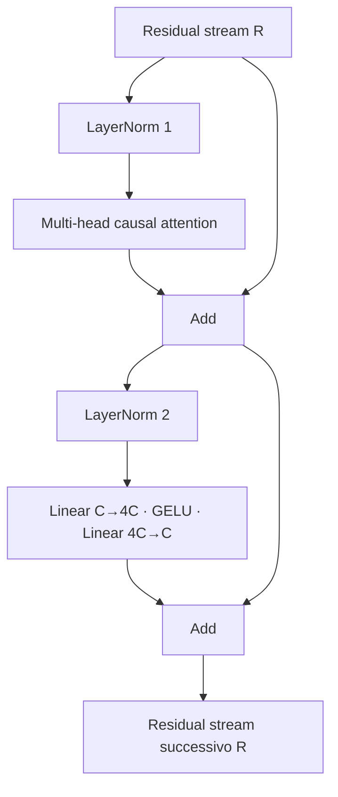

Il blocco completo pre-norm è:

$$
U=R+\operatorname{MHA}(\operatorname{LN}_1(R))
$$

$$
R_{next}=U+\operatorname{MLP}(\operatorname{LN}_2(U)).
$$

Entrambi i branch trasformano temporaneamente la rappresentazione, ma tornano
alla stessa shape e rendono il block componibile.

### Codice di riferimento aggiunto in questa lezione

```python
class TransformerBlock(nn.Module):
    def forward(self, embeddings):
        attention_input = self.attention_layer_norm(embeddings)
        attention_output, _ = self.multi_head_attention(attention_input)
        residual_after_attention = embeddings + attention_output

        feed_forward_input = self.feed_forward_layer_norm(residual_after_attention)
        feed_forward_output = self.feed_forward(feed_forward_input)
        residual_after_feed_forward = residual_after_attention + feed_forward_output

        return residual_after_feed_forward
```

Il Transformer block riutilizzabile è definito in
`study/snapshots/lesson_25/model.py`.

### Sintassi e logica

- La classe contiene due LayerNorm, un modulo multi-head attention e un modulo
  feed-forward; assegnarli a `self` registra l'intera gerarchia.
- `attention_input = self.attention_layer_norm(embeddings)` normalizza il primo
  branch mantenendo `embeddings` per lo skip path.
- `_` scarta gli attention weight perché il normale forward pass usa soltanto
  gli stati contestualizzati.
- `residual_after_attention = embeddings + attention_output` completa il primo
  branch residual pre-norm.
- `feed_forward_input` e `feed_forward_output` calcolano il secondo sublayer
  pre-norm a partire dal residual stream già aggiornato.
- `residual_after_feed_forward = residual_after_attention + feed_forward_output`
  completa la seconda skip connection; il return successivo espone quel
  risultato nominato del block.
- L'input e l'output sono entrambi `[B, T, C]`. Questo contratto di conservazione di shape è ciò che
  consente di incatenare un numero arbitrario di blocchi.

### Codice ↔ matematica ↔ significato

Questa sezione mostra come il codice realizza direttamente la trasformazione matematica.

| Codice | Lettura matematica | In parole semplici |
|---|---|---|
| `x = x + attention(ln1(x))` | $U=R+\operatorname{MHA}(\operatorname{LN}_1(R))$ | primo ramo residuo pre-norm |
| `x = x + mlp(ln2(x))` | $R'=U+\operatorname{MLP}(\operatorname{LN}_2(U))$ | secondo ramo residuo pre-norm |

### Programmato rispetto ad appreso

- **Definito dal programmatore:** l'ordine dei branch e il cablaggio residual.
- **Appreso durante il gradient training:** tutti i parametri di proiezione, normalizzazione e MLP.

## Lezione 26 — Più blocchi Transformer

### Sintesi della lezione: obiettivo e risultato

- **Prima:** una trasformazione contestuale
- **Obiettivo:** Ripetere il blocco Transformer più volte
- **Dopo:** una gerarchia di $L$ trasformazioni contestuali
- **Vincolo:** gli assi batch/tempo e il vincolo causale restano intatti mentre cambiano le feature

### Comprendere la trasformazione

Un block realizza un solo passaggio di comunicazione e calcolo. La profondità
mette più block in sequenza, così ogni layer riceve uno stato già trasformato
dai layer precedenti.

```learngpt-mermaid
flowchart LR
    R0["R₀ [B,T,C]"] -->|"Block₁(θ₁)"| R1["R₁ [B,T,C]"]
    R1 -->|"Block₂(θ₂)"| R2["R₂ [B,T,C]"]
    R2 -->|"…"| RP["R… [B,T,C]"]
    RP -->|"BlockL(θL)"| RL["RL [B,T,C]"]
```

I block condividono l'architettura, non i parametri: `θ₁`, `θ₂` e gli altri
insiemi sono indipendenti. L'esecuzione è sequenziale e conserva shape e
vincolo causale. Eventuali specializzazioni dei layer sono tendenze apprese, non
ruoli programmati.

Parametri indipendenti permettono a ogni layer di trasformare la
rappresentazione che riceve, invece di ripetere la stessa funzione appresa. Il
loop Python descrive quindi un flusso di dati attraverso moduli registrati, non
weight sharing ricorrente. La profondità aumenta calcolo e parametri, ma non
modifica il numero di posizioni né il vocabulary. Ogni block rispetta la stessa
interfaccia e consegna al successivo un residual stream valido con la medesima
shape.
Lo stato `R_l` contiene i risultati accumulati ed è l'unico input del block
successivo: l'ordine dello stack fa quindi parte del calcolo.
Invertire due block produrrebbe infatti un modello diverso.

### Trasformazione, passo dopo passo

1. **INPUT — Individua lo stato disponibile**

   Il punto di partenza è **una trasformazione contestuale**. Prima di applicare qualsiasi
   operazione, bisogna riconoscere con precisione quale oggetto esiste già e
   quale informazione contiene.

   **Cosa osservare:** questo è l'input del passaggio, non il risultato che
   vogliamo ottenere.

2. **OPERATION — Più blocchi Transformer**

   Applichiamo l'operazione **Ripetere il blocco Transformer più volte**. La traccia seguente mostra
   gli oggetti nell'ordine di lettura, trasformazione e uso nel
   passaggio successivo:

   ```learngpt-mermaid
   flowchart TD
       E["Stati embedding"] -->|"Block 1"| R1["Stati più ricchi"]
       R1 -->|"Block 2"| R2["Stati ulteriormente raffinati"]
       R2 -->|"… → Block L"| RL["Stati raffinati progressivamente"]
   ```

   **Cosa osservare:** ogni freccia rappresenta un'operazione concreta; una
   riga intermedia è sia l'output del passaggio precedente sia
   l'input di quello successivo.

3. **INTERMEDIATE STATE — Segui le consegne intermedie**

   Fermati su ciascuna riga centrale della traccia. Questi valori non sono
   decorativi: rendono visibile ciò che il programma deve aver già prodotto
   prima di poter continuare.

   **Cosa osservare:** se uno stato intermedio manca o ha significato diverso,
   la freccia successiva non possiede l'input corretto.

4. **CHECK — Proteggi il vincolo della lezione**

   Verifichiamo che **gli assi batch/tempo e il vincolo causale restano intatti mentre cambiano le feature**. Il controllo separa una trasformazione
   corretta da un risultato che sembra plausibile soltanto perché ha una shape
   compatibile.

   **Cosa osservare:** il passaggio modifica solo ciò che dichiara di
   modificare; l'informazione necessaria alle lezioni successive resta
   allineata.

5. **OUTPUT — Definisci il nuovo stato**

   Alla fine possediamo **una gerarchia di $L$ trasformazioni contestuali**. Questo è il nuovo punto di
   partenza del corso, non un semplice valore temporaneo.

   **Cosa osservare:** l'output conferma l'obiettivo indicato nella sintesi iniziale e può essere
   passato alla lezione successiva senza ricostruire il processo da zero.

### Dove siamo arrivati

La trasformazione è completa quando **una gerarchia di $L$ trasformazioni contestuali** è disponibile e il
vincolo della lezione è ancora rispettato. A questo punto possiamo fermarci:
anticipare il passaggio successivo renderebbe meno chiaro quale
responsabilità appartiene a questa lezione.

- **Cambiato:** una trasformazione contestuale è diventato **una gerarchia di $L$ trasformazioni contestuali**.
- **Preservato:** gli assi batch/tempo e il vincolo causale restano intatti mentre cambiano le feature.
- **Prossimo passo:** **LayerNorm finale e output head** userà questo risultato come nuovo input.

> **Se ricordi una sola cosa:** il risultato importante non è il nome
> dell'operazione, ma il nuovo stato verificabile che essa produce:
> **una gerarchia di $L$ trasformazioni contestuali**.

### Come leggere la matematica

Il pedice $l$ identifica il block corrente; $l+1$ indica lo stato consegnato al
block successivo.

| Notazione | Leggilo come | Significato qui |
|---|---|---|
| $L$ | L | numero di Transformer block |
| $B$ | B | numero di esempi indipendenti in un unico batch |
| $T$ | T | posizioni token in un unico context window |
| $C$ | C | numero di feature usate per rappresentare un token |
| $R_l$ | R con pedice l | residual-stream tensor che entra nel block l |

### Esempio visivo svolto

> **Stato dell'esempio ricorrente:** facciamo attraversare alla
> rappresentazione di `The cat sleeps here.` più Transformer block,
> preservando la geometria del tensor.

```learngpt-mermaid
flowchart LR
    R0["R₀ [B,T,C]"] -->|"Block 1"| R1["R₁ [B,T,C]"]
    R1 -->|"Block 2"| R2["R₂ [B,T,C]"]
    R2 -->|"Block 3"| R3["R₃ [B,T,C]"]
```

La geometria resta fissa mentre ogni block applica parametri appresi diversi e
modifica l'informazione conservata nelle feature.

Lo stack di $L$ block aumenta il numero di trasformazioni sequenziali
mantenendo `[B,T,C]`. I primi block possono costruire feature locali e quelli successivi
possono comporle, ma è una tendenza empirica, non una gerarchia codificata.

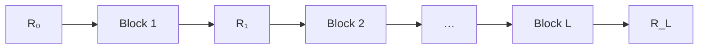

Con il numero di block, parametri e calcolo crescono approssimativamente in
modo lineare. Dentro ogni block, attention costa circa $O(BT^2C)$, mentre
proiezioni e MLP costano circa $O(BTC^2)$.

### Codice di riferimento aggiunto in questa lezione

```python
self.transformer_blocks = nn.ModuleList(
    [
        TransformerBlock(
            embedding_size=embedding_size,
            head_size=head_size,
            context_size=context_size,
            num_heads=num_heads,
        )
        for _ in range(num_transformer_blocks)
    ]
)

for transformer_block in self.transformer_blocks:
    block_output = transformer_block(block_output)
```

Lo stack viene visualizzato in `study/snapshots/lesson_26/model.py`.

### Sintassi e logica

- `[TransformerBlock(...) for _ in range(num_transformer_blocks)]` costruisce
  block indipendenti: tutti ricevono le stesse dimensioni architetturali, ma
  apprendono parametri propri.
- `nn.ModuleList` registra ogni blocco per l'ottimizzazione, la serializzazione e
  trasferimento tra device, pur permettendo un loop Python esplicito.
- `for transformer_block in self.transformer_blocks` visita i block nell'ordine
  di costruzione.
- A ogni iterazione, l'output precedente sostituisce `block_output`: i dati
  attraversano quindi i block in sequenza, non in parallelo.
- Il costruttore rifiuta meno di un blocco, e ogni iterazione conserva
  `[B,T,C]`, mantenendo invariato il contratto dello stack.

### Codice ↔ matematica ↔ significato

Questa sezione mostra come il codice realizza direttamente la trasformazione matematica.

| Codice | Lettura matematica | In parole semplici |
|---|---|---|
| `for block in blocks: x = block(x)` | $R_{l+1}=\operatorname{Block}_l(R_l)$ | usa l'output di ogni block come input del successivo |

## Lezione 27 — LayerNorm finale prima dell'output head esistente

### Sintesi della lezione: obiettivo e risultato

- **Prima:** vettori contestuali inviati direttamente all'output head introdotto nella lezione 17
- **Obiettivo:** Normalizzare lo stack residual completo prima della projection sul vocabulary già esistente
- **Dopo:** stati finali normalizzati consumati dall'output head esistente
- **Vincolo:** gli assi batch/tempo e il vincolo causale restano intatti mentre cambiano le feature

### Comprendere la trasformazione

Lo stack termina con vettori contestuali di larghezza `C`. L'output head affine
che mappa C feature in V logits non è nuovo: la lezione 17 lo ha introdotto
quando la larghezza della rappresentazione è stata separata da quella del
vocabulary. Fino a questo punto, però, lo stack completo inviava il proprio
stato finale direttamente all'head. Questa lezione aggiunge una sola
operazione: Final LayerNorm prepara una scala stabile subito prima della
projection sul vocabulary già esistente.

```learngpt-visual
{
  "type": "tensor-flow",
  "title": "Inserisci Final LayerNorm prima del vocabulary head esistente",
  "description": "L'unica nuova operazione stabilizza il vettore C finale; l'output head presente dalla lezione 17 crea poi V logits e softmax può renderne leggibile l'evidenza relativa.",
  "stages": [
    {"label": "Stato finale", "shape": "[C=3]", "note": "[0.70, −0.20, 0.40]"},
    {"label": "Nuova Final LayerNorm", "shape": "[C=3]", "note": "h = [1.07, −1.34, 0.27]"},
    {"label": "Vocabulary output head esistente", "shape": "[V=4]", "note": "logits [0.20, 1.40, −0.30, 0.70]"},
    {"label": "Softmax opzionale", "shape": "[V=4]", "note": "probabilità [0.15, 0.50, 0.09, 0.25]"}
  ]
}
```

L'output head produce logits, non probabilità. La cross-entropy usa
direttamente i logits; la generation applica la softmax in seguito.

Ogni logit corrisponde esattamente a un tokenizer ID: l'ordine del vocabulary è
un contratto invariabile tra tokenizer e output matrix. Un logit alto è
soltanto evidenza relativa e diventa probabilità dopo il confronto con tutti
gli altri logits. La nuova Final LayerNorm e l'output head già esistente
vengono applicati indipendentemente in ogni posizione, producendo una
previsione completa per ogni riga della context window. L'asse finale cambia da
C a V; batch e tempo restano invariati.
Il tensor risultante è direttamente compatibile con loss e sampling.

### Trasformazione, passo dopo passo

1. **INPUT — Individua lo stato disponibile**

   Il punto di partenza è **vettori contestuali**. Prima di applicare qualsiasi
   operazione, bisogna riconoscere con precisione quale oggetto esiste già e
   quale informazione contiene.

   **Cosa osservare:** questo è l'input del passaggio, non il risultato che
   vogliamo ottenere.

2. **OPERATION — Inserisci Final LayerNorm prima dell'output head esistente**

   Applichiamo l'operazione **Normalizzare lo stack residual completo prima della projection sul vocabulary già esistente**. La traccia seguente mostra
   gli oggetti nell'ordine di lettura, trasformazione e uso nel
   passaggio successivo:

   ```learngpt-visual
   {
     "type": "tensor-flow",
     "title": "Aggiungi una normalizzazione al vecchio confine stack-to-head",
     "description": "La nuova Final LayerNorm conserva B × T × C; l'output head esistente esegue poi la consueta projection da C a V.",
     "stages": [
       {"label": "Residual state finali", "shape": "[B,T,C]", "note": "prima inviati direttamente all'head"},
       {"label": "Nuova Final LayerNorm", "shape": "[B,T,C]", "note": "unica trasformazione nuova della lezione"},
       {"label": "Vocabulary output head esistente", "shape": "[B,T,V]", "note": "un logit per token possibile"},
       {"label": "Vocabulary logits", "shape": "[B,T,V]", "note": "usati direttamente dalla cross-entropy"}
     ]
   }
   ```

   **Cosa osservare:** ogni freccia rappresenta un'operazione concreta; una
   riga intermedia è sia l'output del passaggio precedente sia
   l'input di quello successivo.

3. **INTERMEDIATE STATE — Segui le consegne intermedie**

   Fermati su ciascuna riga centrale della traccia. Questi valori non sono
   decorativi: rendono visibile ciò che il programma deve aver già prodotto
   prima di poter continuare.

   **Cosa osservare:** se uno stato intermedio manca o ha significato diverso,
   la freccia successiva non possiede l'input corretto.

4. **CHECK — Proteggi il vincolo della lezione**

   Verifichiamo che **gli assi batch/tempo e il vincolo causale restano intatti mentre cambiano le feature**. Il controllo separa una trasformazione
   corretta da un risultato che sembra plausibile soltanto perché ha una shape
   compatibile.

   **Cosa osservare:** il passaggio modifica solo ciò che dichiara di
   modificare; l'informazione necessaria alle lezioni successive resta
   allineata.

5. **OUTPUT — Definisci il nuovo stato**

   Alla fine possediamo **vocabulary logits per ogni posizione**. Questo è il nuovo punto di
   partenza del corso, non un semplice valore temporaneo.

   **Cosa osservare:** l'output conferma l'obiettivo indicato nella sintesi iniziale e può essere
   passato alla lezione successiva senza ricostruire il processo da zero.

### Dove siamo arrivati

La trasformazione è completa quando **vocabulary logits per ogni posizione** sono disponibili e il
vincolo della lezione è ancora rispettato. A questo punto possiamo fermarci:
anticipare il passaggio successivo renderebbe meno chiaro quale
responsabilità appartiene a questa lezione.

- **Cambiato:** i vettori contestuali finali vengono ora normalizzati prima che l'output head esistente produca **vocabulary logits per ogni posizione**.
- **Preservato:** gli assi batch/tempo e il vincolo causale restano intatti mentre cambiano le feature.
- **Prossimo passo:** **Transformer training** userà questo risultato come nuovo input.

> **Se ricordi una sola cosa:** il risultato importante non è il nome
> dell'operazione, ma il nuovo stato verificabile che essa produce:
> **il nuovo componente è Final LayerNorm; il vocabulary head viene riutilizzato dalla lezione 17**.

### Come leggere la matematica

La matrice del vocabulary trasposta allinea la propria dimensione `C` con le
feature dello stato e lascia in output `V` score.

| Notazione | Leggilo come | Significato qui |
|---|---|---|
| $B$ | B | numero di esempi indipendenti in un unico batch |
| $T$ | T | posizioni token in un unico context window |
| $C$ | C | numero di feature usate per rappresentare un token |
| $V$ | V | vocabulary: il numero di possibili ID token |
| $Z$ | Z | score grezzi sul vocabulary, chiamati logits |
| $W^{\mathsf T}$ | W trasposta | la stessa matrice con righe e colonne scambiate |

### Esempio visivo svolto

> **Stato dell'esempio ricorrente:** trasformiamo lo stato finale dopo `cat`
> in score sul vocabulary, in modo che `sleeps` possa ricevere una probabilità
> elevata.

| Candidato del vocabulary | Logit finale | Probabilità |
|---|---:|---:|
| `The` | 0.2 | 0.15 |
| `sleeps` | 1.4 | **0.50** |
| `here` | -0.3 | 0.09 |
| `.` | 0.7 | 0.25 |

L'output head esistente converte il vettore contestuale di larghezza `C` appena
normalizzato in `V` score concorrenti.

Dopo l'ultimo block:

$$F=\operatorname{LN}_f(R_L),\qquad Z=FW_{vocab}^{\mathsf T}+b_{vocab}.$$

$F$ ha shape `[B,T,C]`; $W_{vocab}$ ha shape `[V,C]`; i logits $Z$
hanno shape `[B,T,V]`. Per uno stato `[0.7,-0.2,0.4]`, la normalizzazione può
produrre `[1.07,-1.34,0.27]`; la proiezione affine può produrre
`[0.2,1.4,-0.3,0.7]` e la softmax circa `[0.15,0.50,0.09,0.25]`.

La final LayerNorm controlla la scala delle feature ricevute dal classifier sul
vocabulary.

### Codice di riferimento aggiunto in questa lezione

```python
self.final_layer_norm = nn.LayerNorm(
    normalized_shape=embedding_size,
)

for transformer_block in self.transformer_blocks:
    block_output = transformer_block(block_output)

block_output = self.final_layer_norm(block_output)
logits = self.output_head(block_output)
```

Queste sono la definizione letterale della nuova LayerNorm e la sua integrazione
subito prima dell'head preesistente in
`study/snapshots/lesson_27/model.py`.

### Sintassi e logica

- `self.final_layer_norm = nn.LayerNorm(...)` registra la normalizzazione che
  chiude lo stack residual.
- `self.output_head` non viene registrato qui per la prima volta: la projection
  `C → V` esiste dalla lezione 17 e viene riutilizzata senza modifiche.
- Il loop restituisce la rappresentazione residual finale `[B,T,C]`.
- `block_output = self.final_layer_norm(block_output)` normalizza l'ultimo
  asse delle feature e conserva le altre dimensioni.
- L'output head mappa ogni vettore di larghezza `C` in `V` logits, producendo
  `[B,T,V]` per cross-entropy o sampling.
- `self.output_head(self.final_layer_norm(block_output))` esprime che
  la normalizzazione avviene dopo tutti i block e prima dell'head. Spostarla
  definirebbe un'architettura e un layout dei parametri del checkpoint diversi.

### Codice ↔ matematica ↔ significato

Questa sezione mostra come il codice realizza direttamente la trasformazione matematica.

| Codice | Lettura matematica | In parole semplici |
|---|---|---|
| `output_head(final_layer_norm(x))` | $Z=\operatorname{LN}_f(R_L)W_{vocab}^{\mathsf T}+b_{vocab}$ | assegna uno score a ogni elemento del vocabulary |

# Modulo 7 — Eseguire il training e misurare


## Lezione 28 — Transformer training

### Sintesi della lezione: obiettivo e risultato

- **Prima:** un modello completo con pesi iniziali
- **Obiettivo:** Allena l'intero Transformer end to end
- **Dopo:** lo stesso modello con pesi aggiornati dall'errore di previsione
- **Vincolo:** architettura, tokenizer, corpus e train split restano fissi; i training batch vengono ricampionati mentre il control batch resta invariato

### Comprendere la trasformazione

L'architettura è completa: lo stesso obiettivo di next-token prediction può
addestrare insieme embedding, proiezioni di attention, LayerNorm, MLP e output
head. I target supervisionano i logits, ma non sono feature usate per
calcolarli.

```learngpt-mermaid
flowchart TD
    XY["X, Y"] --> F["Transformer forward"]
    F --> Z["Logits"]
    Z --> L["Cross-entropy loss"]
    L --> G0["Azzera i vecchi gradienti"]
    G0 --> B["Backward"]
    B --> G["Gradienti di tutti i parametri"]
    G --> S["AdamW step"]
    S --> P["Parametri aggiornati θ'"]
```

La lezione clona un parametro prima del training, esegue 30 update
riproducibili e lo confronta dopo. Una differenza non nulla dimostra che
l'optimizer ha cambiato il modello. Questo snapshot non contiene Dropout e non
esegue gradient clipping.

Una loss scalare può aggiornare l'intera rete perché ogni operazione, dalle
righe selezionate nella embedding table ai vocabulary logits, appartiene allo stesso grafo
autograd. `zero_grad` elimina i gradienti rimasti dall'iterazione precedente,
`backward` calcola quelli nuovi e `step` modifica i parametri. Omettere o
scambiare queste responsabilità cambia il training anche se il forward
continua a produrre logits con la shape prevista. Architettura, tokenizer e
dati restano fissi mentre cambiano i parametri.
Il confronto sullo stesso batch di controllo evita di confondere la variazione
casuale tra batch con il cambiamento della loss osservata. In questo contesto,
«dati fissi» significa corpus e train split fissi, non lo stesso batch ripetuto
a ogni update: `create_batch` ricampiona le finestre di training a ogni step. Il
control batch viene invece creato una volta e riutilizzato prima e dopo il
training.

### Trasformazione, passo dopo passo

1. **INPUT — Individua lo stato disponibile**

   Il punto di partenza è **un modello completo con pesi iniziali**. Prima di applicare qualsiasi
   operazione, bisogna riconoscere con precisione quale oggetto esiste già e
   quale informazione contiene.

   **Cosa osservare:** questo è l'input del passaggio, non il risultato che
   vogliamo ottenere.

2. **OPERATION — Transformer training**

   Applichiamo l'operazione **Allena l'intero Transformer end to end**. La traccia seguente mostra
   gli oggetti nell'ordine di lettura, trasformazione e uso nel
   passaggio successivo:

   ```learngpt-mermaid
   flowchart TD
       XY["Batch di input e target"] --> F["Forward del Transformer"]
       F --> Z["Logits e loss"]
       Z --> B["Backward"]
       B --> S["Optimizer step"]
       S --> P["Parametri del Transformer aggiornati"]
   ```

   **Cosa osservare:** ogni freccia rappresenta un'operazione concreta; una
   riga intermedia è sia l'output del passaggio precedente sia
   l'input di quello successivo.

3. **INTERMEDIATE STATE — Segui le consegne intermedie**

   Fermati su ciascuna riga centrale della traccia. Questi valori non sono
   decorativi: rendono visibile ciò che il programma deve aver già prodotto
   prima di poter continuare.

   **Cosa osservare:** se uno stato intermedio manca o ha significato diverso,
   la freccia successiva non possiede l'input corretto.

4. **CHECK — Proteggi il vincolo della lezione**

   Verifichiamo che **architettura, tokenizer, corpus e train split restano fissi; i training batch vengono ricampionati mentre il control batch resta invariato**. Il controllo separa una trasformazione
   corretta da un risultato che sembra plausibile soltanto perché ha una shape
   compatibile.

   **Cosa osservare:** il passaggio modifica solo ciò che dichiara di
   modificare; l'informazione necessaria alle lezioni successive resta
   allineata.

5. **OUTPUT — Definisci il nuovo stato**

   Alla fine possediamo **lo stesso modello con pesi aggiornati dall'errore di previsione**. Questo è il nuovo punto di
   partenza del corso, non un semplice valore temporaneo.

   **Cosa osservare:** l'output conferma l'obiettivo indicato nella sintesi iniziale e può essere
   passato alla lezione successiva senza ricostruire il processo da zero.

### Dove siamo arrivati

La trasformazione è completa quando **lo stesso modello con pesi aggiornati dall'errore di previsione** è disponibile e il
vincolo della lezione è ancora rispettato. A questo punto possiamo fermarci:
anticipare il passaggio successivo renderebbe meno chiaro quale
responsabilità appartiene a questa lezione.

- **Cambiato:** un modello completo con pesi iniziali è diventato **lo stesso modello con pesi aggiornati dall'errore di previsione**.
- **Preservato:** architettura, tokenizer, corpus e train split; cambiano soltanto le finestre di training campionate e i parametri, mentre il control batch viene riutilizzato.
- **Prossimo passo:** **Stima della loss** userà questo risultato come nuovo input.

> **Se ricordi una sola cosa:** il risultato importante non è il nome
> dell'operazione, ma il nuovo stato verificabile che essa produce:
> **lo stesso modello con pesi aggiornati dall'errore di previsione**.

### Come leggere la matematica

La regola della catena significa che ogni livello riceve la parte dell'errore finale attribuibile ai suoi parametri.

| Notazione | Leggilo come | Significato qui |
|---|---|---|
| $X$ | X | input token ID o la matrice di ingresso corrente |
| $Y$ | Y | ID corretti del token successivo usati come target di training |
| $Z$ | Z | score grezzi sul vocabulary, chiamati logits |
| $\mathcal L$ | L calligrafica, o loss | misura scalare dell'errore di previsione |
| $\theta$ | theta | tutti i parametri del modello addestrabili considerati insieme |
| $\nabla_\theta\mathcal L$ | gradiente della loss rispetto a theta | direzione e intensità con cui i parametri influenzano la loss |

### Esempio visivo svolto

> **Stato dell'esempio ricorrente:** esegui il training su finestre in batch della frase canonica ripetuta e propaga all'indietro ogni errore di next-token prediction.

```learngpt-mermaid
flowchart LR
    XY["X, Y"] --> E["Embedding"]
    E --> B["Transformer block"]
    B --> Z["Logits"]
    Z --> L["Loss 4.2"]
    L -->|"backward"| G["Gradienti"]
    G --> S["Optimizer step"]
    S --> P["Parametri aggiornati"]
    P -.-> E
    P -.-> B
```

Un unico errore scalare distribuisce il segnale di responsabilità attraverso
ogni layer differenziabile.

Un passo di ottimizzazione è un grafico differenziabile che copre ogni lezione precedente:

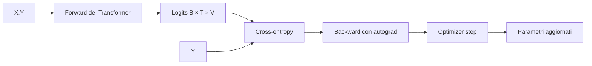

La backpropagation applica la chain rule dalla loss all'output head, ai block,
alle proiezioni di attention e alle righe della embedding table. Se
$h=f(x;\theta_1)$ e $L=g(h;\theta_2)$, allora
$\partial L/\partial\theta_1=(\partial L/\partial h)
(\partial h/\partial\theta_1)$.

Questo snapshot non contiene ancora Dropout. I target vengono passati a
`forward` per calcolare la cross-entropy, ma non partecipano al percorso che
produce i logits.

### Codice di riferimento aggiunto in questa lezione

```python
model = LanguageModel(
    vocabulary_size=vocabulary_size,
    context_size=CONTEXT_SIZE,
    embedding_size=EMBEDDING_SIZE,
    head_size=HEAD_SIZE,
    num_heads=NUM_HEADS,
    num_transformer_blocks=NUM_TRANSFORMER_BLOCKS,
)
optimizer = torch.optim.AdamW(
    model.parameters(),
    lr=LEARNING_RATE,
)

for step in range(1, TRAINING_STEPS + 1):
    input_tensor, target_tensor = create_batch(
        data=training_data,
        batch_size=BATCH_SIZE,
        context_size=CONTEXT_SIZE,
    )

    logits, loss = model(input_tensor, target_tensor)

    optimizer.zero_grad()
    loss.backward()
    optimizer.step()
```

Il breve training run con seed fisso si trova in
`study/lessons/28_transformer_training.py`.

### Sintassi e logica

- Gli argomenti keyword rendono esplicita ogni scelta architetturale;
  `HEAD_SIZE = EMBEDDING_SIZE // NUM_HEADS` usa la divisione intera affinché le
  head suddividano esattamente la larghezza del modello.
- `optimizer = torch.optim.AdamW(model.parameters(), lr=LEARNING_RATE)` collega
  all'optimizer l'intero insieme dei parametri registrati del Transformer.
- `_, loss = model(input_tensor, target_tensor)` esegue il training path e
  conserva soltanto l'obiettivo scalare.
- `optimizer.zero_grad()`, `loss.backward()` e `optimizer.step()` eseguono
  nell'ordine azzeramento, differenziazione e aggiornamento dei parametri.
- `torch.manual_seed(42)` rende ripetibili inizializzazione dei parametri e
  campionamento dei tensor nella lezione.
- `next(model.parameters()).detach().clone()` acquisisce un parametro prima
  del training senza mantenere un grafo autograd; il confronto successivo
  dimostra che l'optimizer ha cambiato lo stato del modello.
- Un modello che assegna probabilità uniforme ha una loss attesa vicina a
  `ln(V)`. Questa lezione usa un character vocabulary con `V=51`, quindi la
  baseline è `ln(51) ≈ 3,93`. La baseline `10,82` del futuro progetto GPT-2 BPE
  con 50.257 token non si applica a questo esperimento.

### Codice ↔ matematica ↔ significato

Questa sezione mostra come il codice realizza direttamente la trasformazione matematica.

| Codice | Lettura matematica | In parole semplici |
|---|---|---|
| `loss = model(x, y)` | $\mathcal L(X,Y;\theta)$ | misura il modello attuale sul batch |
| `loss.backward()` | $\partial\mathcal L/\partial\theta$ | propaga l'errore attraverso tutte le operazioni |

### Programmato rispetto ad appreso

- **Definito dal programmatore:** forward, backward, controlli e ordine degli
  aggiornamenti.
- **Appreso durante il gradient training:** embedding, attention, MLP e pesi
  dell'output head.

## Lezione 29 — Stima della loss

### Sintesi della lezione: obiettivo e risultato

- **Prima:** la loss rumorosa di un singolo batch
- **Obiettivo:** Calcola la media di più loss per ottenere una misura più affidabile
- **Dopo:** stime stabili per training e validation
- **Vincolo:** architettura, tokenizer e dati restano fissi mentre cambiano o vengono misurati i parametri

### Comprendere la trasformazione

Il training loop produce già una loss, ma finora quel valore è stato calcolato
su un solo batch scelto casualmente. Immaginiamo che il batch contenga una
continuazione facile di `The cat sleeps here.`: la loss potrebbe essere bassa
anche se il modello non è migliorato in generale. Un altro batch potrebbe
contenere transizioni più rare e restituire un valore molto più alto. Nessuna
delle due misure è falsa; ciascuna osserva semplicemente una porzione troppo
piccola dei dati.

Questa lezione cambia quindi **il modo in cui misuriamo il progresso**, non ciò
che il modello apprende. Il valutatore estrae più finestre dal training set,
calcola per ognuna una loss con il solo forward pass e ne fa la media. Ripete
poi lo stesso procedimento sul validation set, che resta escluso dagli
aggiornamenti. Le due medie rispondono a domande diverse: la stima di training
descrive i dati da cui l'optimizer può imparare; quella di validation mostra
come gli stessi parametri si comportano su dati che non li modificano.

Servono entrambe. Una training loss in discesa insieme a una validation
loss in crescita può indicare che il modello si sta specializzando troppo sui
dati di training. Se scendono entrambe, l'apprendimento è più probabilmente
utile anche fuori dai batch già visti. Rimangono stime campionarie, non medie
esatte dell'intero corpus, ma più batch le rendono meno dipendenti da una
singola finestra fortunata o sfortunata.

La cross-entropy è il valore che l'optimizer usa direttamente, ma la perplexity
è spesso la traduzione più leggibile per una persona. Quando la loss usa
logaritmi naturali, `perplexity = exp(loss)`. Una perplexity intorno a 73 si
può leggere in modo approssimativo come “il modello è incerto come se dovesse
scegliere tra circa 73 token successivi ugualmente plausibili”. Questo
confronto ha senso solo quando tokenizer, split dei dati e procedura di
valutazione sono gli stessi.

La misurazione deve inoltre lasciare intatto l'esperimento. Il valutatore passa
temporaneamente a `model.eval()`, disabilita autograd e non chiama né
`backward()` né `optimizer.step()`. Nella lezione 29 non esiste ancora
Dropout, quindi la modalità di evaluation non cambia oggi alcun layer
stocastico: stabilisce però il contratto corretto, che diventerà osservabile
quando Dropout verrà introdotto nella lezione 35. Alla fine la funzione
ripristina la modalità precedente. Architettura, tokenizer, dati e parametri
mantengono quindi lo stesso significato; vengono prodotti soltanto due nuovi
valori riassuntivi.

### Trasformazione, passo dopo passo

1. **INPUT — Parti da una singola osservazione rumorosa**

   Il modello e i due split esistono già, ma la misura disponibile è la loss di
   un solo batch casuale.

   **Cosa osservare:** il valore è corretto per quel batch; il limite è che può
   non rappresentare bene l'intero split.

2. **OPERATION — Misura più volte entrambi gli split**

   Esegui più misurazioni con il solo forward pass, prima sul training set e
   poi sul validation set:

   ```learngpt-mermaid
   flowchart LR
       T["Finestre training"] -->|"solo forward"| TL["K loss training"]
       TL -->|"media"| TE["Stima training"]
       V["Finestre validation"] -->|"solo forward"| VL["K loss validation"]
       VL -->|"media"| VE["Stima validation"]
       N["Optimizer step"] --> O["Nessuno"]
   ```

   **Cosa osservare:** i due rami usano lo stesso modello e lo stesso calcolo,
   ma campionano split diversi e restano separati.

3. **INTERMEDIATE STATE — Conserva le loss individuali**

   Prima della media, il valutatore possiede un breve elenco di `K` loss
   scalari per ciascuno split.

   **Cosa osservare:** la media riduce la variabilità tra batch, ma non equivale
   a misurare ogni token del corpus.

4. **CHECK — Verifica che la valutazione non cambi il modello**

   Controlla che siano stati eseguiti soltanto forward pass, che nessun
   parametro sia stato aggiornato e che la modalità iniziale sia stata
   ripristinata.

   **Cosa osservare:** il confronto è significativo solo se entrambe le stime
   descrivono lo stesso stato invariato del modello.

5. **OUTPUT — Restituisci due stime confrontabili**

   Il valutatore restituisce una loss media di training e una loss media di
   validation.

   **Cosa osservare:** sono misure dello stato corrente, non gradienti,
   probabilità o aggiornamenti dei parametri.

### Dove siamo arrivati

Il progetto può ora giudicare uno stato del modello dipendendo meno da un
singolo batch casuale. Non ha ancora deciso quale stato salvare: ha costruito
la misura che renderà difendibile quella decisione.

- **Cambiato:** una singola loss rumorosa è diventata **una coppia di stime medie per training e validation**.
- **Preservato:** architettura, tokenizer, split dei dati, parametri e modalità operativa del chiamante.
- **Prossimo passo:** **Checkpoint** renderà persistente uno stato misurato del modello.

> **Se ricordi una sola cosa:** la valutazione osserva il modello senza
> addestrarlo; la media di più batch rende l'osservazione più utile.

### Come leggere la matematica

La somma indica di aggiungere le $K$ loss dei batch; la divisione per $K$
produce la loro media aritmetica.

| Notazione | Leggilo come | Significato qui |
|---|---|---|
| $K$ | K | numero di micro-batch o lotti di valutazione, a seconda del contesto |
| $\mathcal L$ | L calligrafica, o loss | misura scalare dell'errore di previsione |

### Esempio visivo svolto

> **Stato dell'esempio ricorrente:** misura la loss media sulle finestre di training e validation prodotte dalla stessa pipeline di dati canonica.

| Batch di valutazione | Training loss | Validation loss |
|---:|---:|---:|
| 1 | 3.0 | 3.3 |
| 2 | 3.2 | 3.2 |
| 3 | 3.1 | 3.4 |
| 4 | 3.2 | 3.2 |
| **Media** | **3.125** | **3.275** |

La media riduce l'influenza di un batch insolitamente facile o difficile.

Un singolo batch casuale è rumoroso. Per $K$ batch di valutazione:

$$\widehat L_{split}=\frac1K\sum_{k=1}^{K}L_k.$$

Le loss di training `[3.0,3.2,3.1,3.2]` hanno media 3.125; le loss di validation `[3.3,3.2,3.4,3.2]` hanno media 3.275. Il divario è un segnale diagnostico, non un obiettivo da ottimizzare direttamente. `torch.no_grad()` evita di costruire il grafo dei gradienti e riduce l'uso di memoria.

Quando la cross-entropy usa logaritmi naturali, la perplexity è $\exp(L)$. Una
loss di 4,29 corrisponde a una perplexity di circa 72,9; il confronto ha senso
soltanto con lo stesso tokenizer e gli stessi dati di valutazione.

### Codice di riferimento aggiunto in questa lezione

```python
@torch.no_grad()
def estimate_loss(
    model,
    training_data,
    validation_data,
    batch_size,
    context_size,
    eval_batches,
):
    was_training = model.training
    model.eval()

    losses_by_split = {}
    data_by_split = {
        "training": training_data,
        "validation": validation_data,
    }

    for split_name, split_data in data_by_split.items():
        split_losses = []

        for _ in range(eval_batches):
            input_tensor, target_tensor = create_batch(
                data=split_data,
                batch_size=batch_size,
                context_size=context_size,
            )
            _, loss = model(input_tensor, target_tensor)
            split_losses.append(loss.item())

        losses_by_split[split_name] = sum(split_losses) / len(split_losses)

    if was_training:
        model.train()

    return losses_by_split
```

Il valutatore riutilizzabile è in `study/snapshots/lesson_29/training.py`.

### Sintassi e logica

- `@torch.no_grad()` disabilita la registrazione dei gradienti per l'intera
  funzione, riducendo memoria e lavoro non necessari.
- `was_training = model.training` ricorda la modalità del chiamante prima di
  modificarla.
- `model.eval()` stabilisce il comportamento di inferenza. Nella lezione 29
  nessun layer cambia ancora comportamento; la differenza diventerà concreta
  con Dropout nella lezione 35.
- Il ciclo su `.items()` applica la stessa procedura a `training_data` e
  `validation_data` senza duplicare codice.
- `for _ in range(eval_batches)` campiona più batch, così la stima non dipende
  da una sola finestra casuale.
- `loss.item()` converte ogni loss scalare in un numero Python; la somma divisa
  per il numero di elementi produce la media dello split.
- `if was_training: model.train()` ripristina il training mode soltanto se era
  attivo prima della chiamata. La funzione non aggiorna mai l'optimizer.

### Codice ↔ matematica ↔ significato

Questa sezione mostra come il codice realizza direttamente la trasformazione matematica.

| Codice | Lettura matematica | In parole semplici |
|---|---|---|
| `sum(split_losses) / len(split_losses)` | $\widehat L=\frac1K\sum_k L_k$ | media misure rumorose ottenute su più batch |

# Modulo 8 — Salvare, ricaricare e generare


## Lezione 30 — Checkpoint

### Sintesi della lezione: obiettivo e risultato

- **Prima:** modello, optimizer e avanzamento esistono soltanto nella memoria del processo
- **Obiettivo:** raccogliere e salvare il minimo stato implementato necessario a ricaricare modello e optimizer compatibili
- **Dopo:** un checkpoint ricaricabile composto da sette campi collegati
- **Vincolo:** ogni campo deve descrivere lo stesso esperimento ed essere compatibile al caricamento

### Comprendere la trasformazione

Durante il training, lo stato utile del progetto vive nella memoria del
processo Python. Se il programma termina, i parametri aggiornati, i momenti
dell'optimizer e il punto raggiunto dal ciclo scompaiono. Un **checkpoint**
trasforma questo stato volatile in un artefatto persistente. Non è soltanto una
copia dei pesi: è una fotografia strutturata dell'esperimento in un istante
preciso, pensata per poter essere interpretata anche dopo che il processo
originale non esiste più.

Il campo `model_state_dict` conserva parametri e buffer del modello. Da solo,
però, non basta a continuare lo stesso training. `optimizer_state_dict`
contiene le statistiche interne con cui AdamW decide il prossimo aggiornamento;
`step` e `losses` indicano dove siamo arrivati; `model_config` permette di
ricostruire un'architettura con shape compatibili. Infine `char_to_id` e
`id_to_char` mantengono il significato degli ID. Senza queste mappe, il numero
che prima indicava un carattere potrebbe essere interpretato in modo diverso
al caricamento.

La versione implementata del checkpoint contiene esattamente sette campi:
`model_state_dict`,
`optimizer_state_dict`, `model_config`, `step`, `losses`, `char_to_id` e
`id_to_char`. I campi non sono file indipendenti da combinare liberamente:
appartengono allo stesso esperimento. Se caricassimo i pesi in una
configurazione con dimensioni diverse, PyTorch segnalerebbe shape
incompatibili; con un tokenizer diverso, gli stessi numeri indicherebbero
simboli differenti.

La serializzazione con `torch.save` converte il dizionario in un file che può
essere riletto in seguito. Prima viene creata la directory di destinazione, se
necessario. La lezione scrive direttamente nel path finale: **non è ancora un
salvataggio atomico**. Un'interruzione durante la scrittura potrebbe quindi
lasciare un file incompleto. Il passaggio tramite file temporaneo e sostituzione
atomica arriverà nell'hardening production; non va attribuito allo status quo
di questa lezione.

Questo limite non rende inutile il checkpoint didattico. Il file separa già lo
stato del modello dalla durata del processo e permette di esercitare
salvataggio e caricamento con pochi oggetti leggibili. La distinzione serve
piuttosto a non confondere due traguardi diversi: **persistente** significa che
lo stato può sopravvivere alla chiusura del programma; **crash-safe** significa
che anche un'interruzione durante la scrittura non espone un artefatto parziale.
Qui raggiungiamo il primo obiettivo e lasciamo esplicitamente il secondo alle
lezioni production.

La semplice presenza di `checkpoint.pt` non dimostra quindi che il salvataggio
sia utile. Un controllo affidabile verifica che il file possa essere aperto,
che contenga le chiavi previste e che ogni tensor trovi nel nuovo modello un
nome e una shape compatibili. Configurazione e tokenizer conservano una parte
importante della provenienza. L'identità verificata del dataset e gli stati dei
generatori casuali, però, non sono ancora salvati: verranno aggiunti più avanti.

Il controllo decisivo avviene al caricamento. `torch.load(...,
weights_only=True)` ricostruisce il dizionario; un modello compatibile deve
esistere prima che `load_state_dict(...)` reinserisca i valori. Se viene
fornito un optimizer, viene ricaricato anche il suo stato. Per la sola
generazione basta un sottoinsieme dei campi; per un resume esatto servirebbero
anche informazioni non presenti qui, come RNG e identità dei dati. Il risultato
della lezione è quindi un confine verificabile tra calcolo temporaneo e
**stato minimo recuperabile**, non una copia completa dell'ambiente.

### Trasformazione, passo dopo passo

1. **INPUT — Raccogli lo stato coerente dell'esperimento**

   Gli oggetti iniziali sono il modello addestrato fino allo `step`, il suo
   optimizer, la configurazione, le loss registrate e le mappe del tokenizer.

   **Cosa osservare:** tutto proviene dallo stesso run; non stiamo assemblando
   campi appartenenti a esperimenti diversi.

2. **OPERATION — Estrai gli stati e costruisci un unico payload**

   `model.state_dict()` e `optimizer.state_dict()` producono strutture
   serializzabili, poi vengono raccolte con gli altri cinque campi:

   ```learngpt-mermaid
   flowchart TD
       C["Checkpoint"] --> M["model_state_dict: parametri e buffer"]
       C --> O["optimizer_state_dict: momenti e gruppi AdamW"]
       C --> CFG["model_config: shape dell'architettura"]
       C --> S["step: posizione nel training"]
       C --> L["losses: andamento osservato"]
       C --> CTI["char_to_id: testo → ID"]
       C --> ITC["id_to_char: ID → testo"]
   ```

   **Cosa osservare:** salviamo valori e metadati espliciti, non un riferimento
   al processo Python ancora in esecuzione.

3. **CONSTRAINT — Mantieni la compatibilità semantica**

   Parametri, `model_config` e mappe del tokenizer devono descrivere lo stesso
   esperimento.

   **Cosa osservare:** un formato leggibile non basta se shape o significato
   degli ID sono incompatibili.

4. **OPERATION — Serializza il checkpoint**

   `torch.save(checkpoint, checkpoint_path)` trasferisce il payload dalla
   memoria a un file persistente.

   **Cosa osservare:** il training può terminare senza perdere lo stato salvato,
   ma questa scrittura diretta non è ancora atomica.

5. **CHECK — Ricostruisci e ricarica**

   Un nuovo processo crea oggetti compatibili, legge con `weights_only=True` e
   usa `load_state_dict(...)` per reinserire modello e, se richiesto, optimizer.

   **Cosa osservare:** il vero test del salvataggio non è l'esistenza del file,
   ma la possibilità di usarlo per generare o continuare il training.

6. **OUTPUT — Ottieni lo stato minimo recuperabile**

   L'uscita è un file con i sette campi implementati, coerente e ricaricabile.

   **Cosa osservare:** i campi salvati persistono; RNG e fingerprint del dataset
   non fanno ancora parte del payload.

### Dove siamo arrivati

Il progetto può ora attraversare il confine tra due processi: uno salva lo
stato raggiunto, un altro lo ricostruisce. I pesi non sono più legati alla sola
memoria del run corrente e restano collegati a optimizer, configurazione,
progresso e tokenizer. Questo rende possibile sia continuare l'esperimento sia
usare il modello addestrato in una sessione separata.

- **Cambiato:** lo stato volatile è diventato un artefatto persistente e ricaricabile.
- **Preservato:** valori appresi e significato degli ID attraverso salvataggio e caricamento.
- **Prossimo passo:** caricare il checkpoint per generare testo senza riutilizzare il processo di training.

> **Se ricordi una sola cosa:** un checkpoint affidabile conserva il contesto
> dell'esperimento, non soltanto i pesi del modello.

### Come leggere la matematica

Non viene introdotta una nuova equazione del modello. Leggi il checkpoint come
una tupla di sette parti che devono essere interpretate insieme.

| Notazione | Leggilo come | Significato qui |
|---|---|---|
| $\theta$ | theta | parametri e buffer registrati del modello |
| $\omega$ | omega | stato dell'optimizer |
| $\gamma_m$ | gamma m | configurazione del modello |
| $\tau$ | tau | training step salvato |
| $h$ | h | history delle loss |
| $\phi,\phi^{-1}$ | phi e la sua inversa | mappe carattere-ID e ID-carattere |

### Esempio visivo svolto

> **Stato dell'esempio ricorrente:** esprimi formalmente lo stato necessario per continuare ad apprendere la stessa attività next-token che include `The cat sleeps here.`.

Il payload implementato può essere scritto come

$$
\mathcal C=
(\theta,\omega,\gamma_m,\tau,h,\phi,\phi^{-1}),
$$

dove i componenti non sono intercambiabili tra run diversi:

| Componente | Chiave concreta | Serve alla generation | Serve a un resume di base |
|---|---|:---:|:---:|
| $\theta$ | `model_state_dict` | sì | sì |
| $\omega$ | `optimizer_state_dict` | no | sì |
| $\gamma_m$ | `model_config` | sì | sì |
| $\tau$ | `step` | no | sì |
| $h$ | `losses` | no | utile per la continuità |
| $\phi$ | `char_to_id` | sì | sì |
| $\phi^{-1}$ | `id_to_char` | sì | sì |

Un resume fedele richiede almeno questi invarianti:

$$
\operatorname{keys}(\theta)
=\operatorname{keys}(\theta_{\mathrm{model}}),
\qquad
\operatorname{shape}(\theta[name])
=\operatorname{shape}(\theta_{\mathrm{model}}[name]),
$$

$$
\phi^{-1}(\phi(c))=c.
$$

La generation usa un sottoinsieme dello stato perché non deve aggiornare
l'optimizer. Un resume esatto richiede invece informazioni ulteriori non
presenti in $\mathcal C$, come RNG, dettagli dello schedule non ricavabili dallo
step e identità verificata del dataset.

L'operazione su file implementata è semplicemente

$$
\operatorname{serialize}(\mathcal C)\longrightarrow P_{\mathrm{final}}.
$$

Non essendoci ancora un path temporaneo seguito da rename atomico, questa
formula non garantisce crash safety. Quel contratto più forte arriva nelle
lezioni production.

### Codice di riferimento aggiunto in questa lezione

```python
checkpoint_path = Path(checkpoint_path)
checkpoint_path.parent.mkdir(parents=True, exist_ok=True)

checkpoint = {
    "model_state_dict": model.state_dict(),
    "optimizer_state_dict": optimizer.state_dict(),
    "model_config": model_config,
    "step": step,
    "losses": losses,
    "char_to_id": char_to_id,
    "id_to_char": id_to_char,
}

torch.save(checkpoint, checkpoint_path)

return checkpoint_path
```

Le funzioni di salvataggio e caricamento sono in `study/snapshots/lesson_30/checkpoint.py`.

### Sintassi e logica

- `model.state_dict()` memorizza parametri e buffer con i loro nomi, invece di
  serializzare un oggetto module Python vivo.
- `optimizer.state_dict()` conserva momenti e parameter group necessari a
  continuare l'ottimizzazione di base.
- `model_config`, `step` e `losses` registrano architettura e punto raggiunto
  dal run.
- `char_to_id` e `id_to_char` mantengono il contratto del tokenizer necessario
  a interpretare prompt e ID generati.
- `mkdir(parents=True, exist_ok=True)` crea directory padre mancanti e
  non fallisce quando esistono già.
- `torch.save(checkpoint, checkpoint_path)` serializza il dizionario nella
  destinazione preparata. `load_state_dict(...)` copia poi i valori salvati in
  un'istanza compatibile; la scrittura diretta non è atomica.

## Lezione 31 — Generazione da un checkpoint

### Sintesi della lezione: obiettivo e risultato

- **Prima:** un checkpoint e un prompt leggibile
- **Obiettivo:** Ricostruisci un modello da un checkpoint e genera in modo indipendente
- **Dopo:** testo generato e decodificato
- **Vincolo:** i pesi appresi e il tokenizer mantengono il loro significato attraverso salvataggio e generazione

### Comprendere la trasformazione

Un checkpoint è davvero utile soltanto se il progetto può chiudere il processo
di training, ripartire dall'artefatto salvato e ottenere un modello
funzionante. Questa lezione esegue proprio quel controllo. Non riutilizza
l'oggetto rimasto in memoria dopo il training: legge `model_config`, crea un
nuovo modello compatibile, carica `model_state_dict` e passa in evaluation
mode.

Le mappe del tokenizer salvate insieme ai pesi sono altrettanto importanti. Il
prompt leggibile `The` deve essere convertito negli stessi ID usati durante il
training. Se la mappa cambiasse, un tensor formalmente valido potrebbe indicare
caratteri diversi. Mantenere allineato il tokenizer conserva il significato
del prompt e di ogni ID generato.

La generazione diventa poi un ciclo. Gli ID correnti entrano nel modello,
l'ultima posizione fornisce gli score per il carattere successivo, viene
campionato un ID e questo viene aggiunto al contesto. Nell'iterazione seguente,
il contesto appena ampliato diventa il nuovo input. È questo riuso dell'output
che rende la generazione **autoregressiva**: ogni scelta dipende dal prompt e
dalle scelte precedenti del modello.

Nell'esempio ricorrente, il prompt può crescere da `The` verso una sequenza come
`The cat sleeps here.` un carattere alla volta. La continuazione esatta non è
garantita, perché il sampling è casuale. Ciò che la lezione verifica è l'intero
percorso: checkpoint → modello e tokenizer compatibili → ID del prompt → ID
generati → testo leggibile. La lezione successiva controllerà quanto prudenti
o varie debbano essere le scelte casuali.

### Trasformazione, passo dopo passo

1. **INPUT — Parti da un artefatto e da un prompt**

   Il checkpoint fornisce configurazione, pesi e mappe del tokenizer; l'utente
   fornisce il testo leggibile del prompt.

   **Cosa osservare:** nessuno dei due input basta da solo. Il prompt richiede
   il tokenizer e i pesi richiedono un modello compatibile.

2. **OPERATION — Ricostruisci il percorso di generazione**

   Ricrea il modello, carica lo stato salvato e codifica il prompt:

   ```learngpt-mermaid
   flowchart TD
       C["Checkpoint"] --> R["Ripristina modello e tokenizer"]
       P["Prompt leggibile"] --> R
       R --> I["ID del prompt"]
       I --> S["Sampling autoregressivo"]
       S --> G["ID generati"]
       G --> D["Testo decodificato"]
   ```

   **Cosa osservare:** il nuovo processo usa soltanto informazioni salvate in
   modo esplicito; non dipende dal modello di training rimasto in memoria.

3. **INTERMEDIATE STATE — Fai crescere la sequenza di ID**

   Ogni iterazione produce un ID successivo e lo aggiunge alla sequenza già
   disponibile.

   **Cosa osservare:** l'output di un'iterazione diventa parte dell'input della
   successiva; non si tratta di molte predizioni indipendenti.

4. **CHECK — Conserva il significato degli ID**

   Decodifica gli ID con la stessa mappa usata per il prompt e salvata nel
   checkpoint.

   **Cosa osservare:** caricare correttamente i tensor non basta se gli ID
   acquisiscono un significato testuale diverso.

5. **OUTPUT — Restituisci testo generato leggibile**

   Decodifica l'intera sequenza composta da prompt e continuazione.

   **Cosa osservare:** il testo dimostra che l'artefatto supporta un percorso
   di inferenza indipendente, non che ogni continuazione campionata sia buona.

### Dove siamo arrivati

Il checkpoint ha ora superato un confine concreto: un modello ricostruito da
zero lo ha usato per trasformare un prompt leggibile in testo generato
leggibile.

- **Cambiato:** un artefatto salvato e un prompt sono diventati **una continuazione generata in modo autoregressivo**.
- **Preservato:** parametri appresi, compatibilità dell'architettura e significato degli ID.
- **Prossimo passo:** **Controlli del sampling** modellerà le scelte compiute a ogni iterazione.

> **Se ricordi una sola cosa:** la generazione indipendente verifica in pratica
> che checkpoint e tokenizer possano essere interpretati di nuovo.

### Come leggere la matematica

Le frecce descrivono l'ordine di ricostruzione piuttosto che l'aritmetica: config prima, quindi pesi compatibili, quindi prompt ID.

| Notazione | Leggilo come | Significato qui |
|---|---|---|
| $X$ | X | input token ID o la matrice di ingresso corrente |
| $T$ | T | posizioni token in un unico context window |
| $Z$ | Z | score grezzi sul vocabolario, chiamati logits |

### Esempio visivo svolto

> **Stato dell'esempio ricorrente:** ripristina il modello salvato e usa il
> prompt `The` per continuare la frase canonica.

```learngpt-mermaid
flowchart LR
    CFG["Config del checkpoint"] --> M["Costruisci un modello vuoto"]
    W["Pesi del checkpoint"] --> M
    M --> G["Genera nuovi ID"]
    P["Prompt The"] --> E["Codifica gli ID"]
    E --> G
    G --> D["Token ID generati"]
    T["Tokenizer"] --> D
    D --> O["Decodifica il testo"]
```

Il nuovo processo dipende dagli artefatti salvati e dal codice sorgente, non
dallo stato in memoria del vecchio processo di training.

Il caricamento segue un ordine preciso: legge il payload, ricostruisce il
modello dalla configurazione salvata, carica i pesi, passa in evaluation mode,
codifica il prompt, genera gli ID e infine li decodifica. Una shape
incompatibile segnala che configurazione, codice e pesi non descrivono lo
stesso modello. Lo snapshot della lezione 31 esegue questo percorso su CPU.

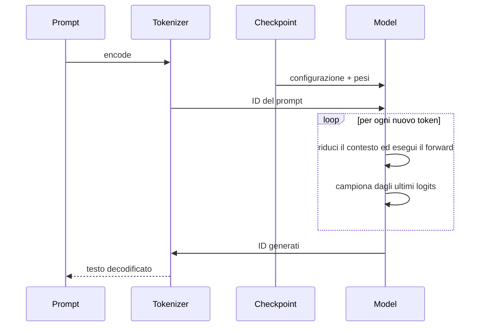

### Codice di riferimento aggiunto in questa lezione

```python
def load_model_from_checkpoint(checkpoint_path):
    checkpoint = torch.load(checkpoint_path, weights_only=True)

    model = LanguageModel(**checkpoint["model_config"])
    model.load_state_dict(checkpoint["model_state_dict"])
    model.eval()

    return model, checkpoint


def generate_text_from_checkpoint(checkpoint_path, prompt_text, max_new_tokens):
    model, checkpoint = load_model_from_checkpoint(checkpoint_path)
    char_to_id = checkpoint["char_to_id"]
    id_to_char = checkpoint["id_to_char"]

    unknown_chars = sorted(set(prompt_text) - set(char_to_id))
    if unknown_chars:
        raise ValueError(f"The prompt contains characters outside the vocabulary: {unknown_chars}")

    prompt_ids = encode(prompt_text, char_to_id)
    input_ids = torch.tensor([prompt_ids], dtype=torch.long)

    with torch.no_grad():
        generated_ids = model.generate(input_ids, max_new_tokens=max_new_tokens)

    generated_text = decode(generated_ids[0].tolist(), id_to_char)

    return generated_text, checkpoint
```

Il percorso di caricamento indipendente è in
`study/snapshots/lesson_31/generate.py`.

### Sintassi e logica

- `torch.load(..., weights_only=True)` usa il caricatore ristretto di PyTorch
  invece dell'unpickling arbitrario.
- `LanguageModel(**checkpoint["model_config"])` espande la configurazione in
  argomenti nominati e ricostruisce l'architettura attesa dai pesi.
- `load_state_dict(...)` copia i parametri salvati nell'istanza compatibile.
- `model.eval()` stabilisce il comportamento di inference. Nella lezione 31
  non c'è ancora Dropout; la chiamata diventerà osservabile quando arriveranno
  layer dipendenti dalla modalità nella lezione 35.
- `unknown_chars` controlla il prompt prima dell'encode, così il tokenizer a
  caratteri fallisce con un messaggio esplicito invece che con un errore di
  lookup indiretto.
- `encode(..., checkpoint["char_to_id"])` riusa il vocabolario salvato con il
  checkpoint.
- `[prompt_ids]` crea il batch con `B=1`; `torch.long` è il tipo richiesto
  dall'embedding lookup.
- `torch.no_grad()` evita il grafo di backward durante la generation; la mappa
  inversa salvata decodifica gli ID prodotti.

## Lezione 32 — Controlli del sampling

### Sintesi della lezione: obiettivo e risultato

- **Prima:** un vettore di logits grezzi per il token successivo
- **Obiettivo:** controllare quanto è conservativo o vario il token sampling
- **Dopo:** una distribuzione di probabilità filtrata
- **Vincolo:** i pesi appresi e il tokenizer mantengono il loro significato attraverso salvataggio e generazione

### Comprendere la trasformazione

Il modello ricostruito restituisce logits: score grezzi che ordinano i
possibili token successivi, ma non sono ancora probabilità. I controlli del
sampling si collocano tra questi score e la scelta casuale. Non riaddestrano il
modello e non cambiano ciò che ha appreso; modificano il modo in cui la
procedura di generazione interpreta, in quel momento, le preferenze del
modello.

La **temperature** agisce per prima. Dividere i logits per un valore minore di
`1` aumenta la distanza tra gli score, quindi softmax concentrerà più
probabilità sui candidati migliori. Un valore maggiore di `1` riduce le
distanze e rende la distribuzione più piatta. Il modello non è diventato più o
meno sicuro in senso appreso: è il sampler che rende l'output più prudente o
più esplorativo.

Il **top-k** limita poi i candidati ammessi. Se `k` è piccolo, possono essere
scelti soltanto gli ID con score più alto; tutti gli altri logits vengono
sostituiti con `−∞` prima di softmax e ricevono quindi probabilità zero. Questo
evita che una lunga coda di candidati improbabili produca caratteri inattesi,
ma può anche escludere un token che occasionalmente sarebbe stato utile.
Filtrare di più è quindi un compromesso, non un miglioramento automatico.

Con `The cat sleeps here.`, lo stesso modello può preferire gli stessi
candidati dopo `The cat`, ma combinazioni diverse di temperature e top-k
possono rendere una generazione più prevedibile e un'altra più varia. Pesi e
tokenizer non cambiano. Il nuovo oggetto è una distribuzione filtrata da cui
campionare il prossimo ID.

### Trasformazione, passo dopo passo

1. **INPUT — Leggi i logits del token successivo**

   Parti dal vettore di score prodotto per l'ultima posizione attiva.

   **Cosa osservare:** i logits esprimono preferenze relative; possono essere
   negativi e non devono sommare a uno.

2. **OPERATION — Modella e filtra le scelte**

   Applica nell'ordine temperature, filtro top-k e softmax:

   ```learngpt-mermaid
   flowchart TD
       L["Logits grezzi del token successivo"] --> T["Dividi per temperature"]
       T --> S["Score più concentrati o più piatti"]
       S --> K["Conserva top-k"]
       K --> SM["Softmax"]
       SM --> P["Probabilità filtrate"]
       P --> C["Sampling"]
       C --> N["Token successivo"]
   ```

   **Cosa osservare:** la temperature modifica la scala di tutti gli score; il
   top-k decide quali ID restano possibili.

3. **INTERMEDIATE STATE — Osserva le probabilità filtrate**

   Dopo softmax, i candidati rimasti hanno probabilità non negative che sommano
   a uno.

   **Cosa osservare:** i candidati esclusi hanno probabilità zero; un candidato
   ammesso è possibile, non garantito.

4. **CHECK — Separa conoscenza e politica di decodifica**

   Verifica che vengano trasformati soltanto i logits usati dal sampler.
   Nessun parametro e nessuna mappa del tokenizer vengono aggiornati.

   **Cosa osservare:** testi diversi possono derivare da politiche diverse
   anche quando il checkpoint è identico.

5. **OUTPUT — Campiona il prossimo token**

   Estrai un ID dalla distribuzione filtrata e aggiungilo al contesto.

   **Cosa osservare:** il sampling trasforma una distribuzione in un solo ramo
   concreto tra le continuazioni possibili.

### Dove siamo arrivati

La generazione possiede ora una politica di decodifica esplicita, invece di una
scelta casuale non spiegata. Il modello fornisce le preferenze; temperature e
top-k stabiliscono come trasformarle in una scelta concreta.

- **Cambiato:** i logits grezzi sono diventati **una distribuzione controllata e un ID campionato**.
- **Preservato:** pesi del checkpoint, significato del vocabolario e ciclo autoregressivo.
- **Prossimo passo:** **Checkpoint migliore** deciderà quale stato valutato merita di essere conservato.

> **Se ricordi una sola cosa:** la temperature cambia quanto sono marcate le
> preferenze; il top-k cambia quali scelte sono ammesse.

### Come leggere la matematica

Dividere i logits per la temperature ne cambia la distanza relativa; sostituire
un logit con meno infinito assegna probabilità zero a quel token dopo la
softmax.

| Notazione | Leggilo come | Significato qui |
|---|---|---|
| $Z$ | Z | score grezzi sul vocabolario, chiamati logits |
| $p$ | p | una probabilità dopo la normalizzazione |
| $\tau$ | tau | sampling temperature |
| $V$ | V | vocabulary: il numero di possibili ID token |

### Esempio visivo svolto

> **Stato dell'esempio ricorrente:** dopo `The cat`, modifica la distribuzione
> dei candidati affinché il sampling possa favorire `sleeps` restando
> controllabile.

| Candidato | Logit grezzo | Dividi per $\tau=0.7$ | Dopo top-2 | Probabilità |
|---|---:|---:|---:|---:|
| `sleeps` | 2.0 | 2.86 | 2.86 | 0.76 |
| `rests` | 1.2 | 1.71 | 1.71 | 0.24 |
| `runs` | 0.4 | 0.57 | $-\infty$ | 0.00 |
| `.` | -0.1 | -0.14 | $-\infty$ | 0.00 |

La temperature modifica quanto la distribuzione è concentrata; il top-k
esclude i candidati sotto la soglia.

La temperature riscala i logits prima della softmax:

$$p_i(\tau)=\frac{\exp(z_i/\tau)}{\sum_j\exp(z_j/\tau)}.$$

$\tau<1$ concentra la distribuzione; $\tau>1$ la appiattisce. Nel limite
$\tau\to0$ il risultato tende all'argmax quando il massimo è unico, ma il
codice rifiuta valori minori o uguali a zero. Il top-k usa il $k$-esimo logit
come soglia: valori uguali alla soglia possono lasciare più di $k$ candidati.

Per i logits `[2.0,1.2,0.4,-0.1]`, $\tau=0.7$ produce
`[2.86,1.71,0.57,-0.14]`; il top-2 lascia
`[2.86,1.71,-∞,-∞]`, con probabilità circa `[0.76,0.24,0,0]`.

Questi controlli cambiano la decodifica, non la conoscenza appresa.

### Codice di riferimento aggiunto in questa lezione

```python
last_token_logits = logits[:, -1, :] / temperature

if top_k is not None:
    top_k = min(top_k, last_token_logits.shape[-1])
    top_values, _ = torch.topk(last_token_logits, top_k)
    minimum_top_value = top_values[:, [-1]]
    last_token_logits = last_token_logits.masked_fill(
        last_token_logits < minimum_top_value,
        float("-inf"),
    )
```

I controlli sono implementati in `study/snapshots/lesson_32/model.py` e
propagati da `study/snapshots/lesson_32/generate.py`.

### Sintassi e logica

- Dividere per una temperature positiva cambia la scala relativa dei logits
  prima della softmax; la funzione rifiuta zero e valori negativi.
- `top_k is not None` mantiene il filtro opzionale; `min(...)` evita di
  richiedere più candidati della dimensione del vocabolario.
- `torch.topk(..., k)` restituisce valori e indici dei candidati maggiori; `_`
  scarta gli indici non utilizzati.
- `top_values[:, [-1]]` conserva la soglia con shape `[B,1]`, che può essere
  trasmessa per broadcasting su `[B,V]`.
- Il confronto `< minimum_top_value` elimina soltanto i valori strettamente
  inferiori: gli eventuali pari merito restano.
- `masked_fill(..., -inf)` assegna probabilità zero agli esclusi dopo la
  softmax; `None` lascia il vocabolario non filtrato.

### Codice ↔ matematica ↔ significato

Questa sezione mostra come il codice realizza direttamente la trasformazione matematica.

| Codice | Lettura matematica | In parole semplici |
|---|---|---|
| `logits = logits / temperature` | $z_i/\tau$ | cambia la spaziatura relativa del punteggio |
| `logits[below_top_k] = -inf` | $p_i=0$ per gli ID esclusi | rimuovono i candidati prima di softmax |

### Programmato rispetto ad appreso

- **Definito dal programmatore:** temperature, filtro top-k e sampling
  multinomiale.
- **Appreso durante il gradient training:** i logits sui quali agisce il filtro.

## Lezione 33 — Checkpoint migliore

### Sintesi della lezione: obiettivo e risultato

- **Prima:** stati valutati senza un vincitore di qualità conservato
- **Obiettivo:** conserva lo stato con la validation loss stimata più bassa osservata finora
- **Dopo:** un best checkpoint scelto con una regola di validation coerente
- **Vincolo:** i pesi appresi e il tokenizer mantengono il loro significato attraverso salvataggio e generazione

### Comprendere la trasformazione

Confrontiamo stime prodotte dalla stessa pipeline di validation e conserviamo
uno snapshot quando la validation loss migliora, non perché un singolo testo
generato sembra convincente. L'implementazione campiona nuove finestre casuali
a ogni valutazione: non riusa batch identici e non usa la qualità della
generation come regola di selezione.

Il training non garantisce che ogni step successivo sia migliore di tutti i
precedenti. Un aggiornamento può aiutare il batch di training appena visto e,
allo stesso tempo, peggiorare leggermente i dati tenuti da parte. Se salvassimo
soltanto l'ultimo stato valutato, potremmo perdere parametri precedenti che
generalizzavano meglio. La lezione aggiunge quindi una memoria minima al
processo: `best_validation_loss`, inizializzata a infinito e aggiornata con la
stima più bassa osservata.

A ogni valutazione, la nuova validation loss viene confrontata con quel valore.
Se è più bassa, il record viene aggiornato e modello, optimizer,
configurazione, avanzamento e tokenizer vengono salvati nel path del best
checkpoint. Se è uguale o più alta, il file esistente resta invariato. La
decisione è intenzionalmente meccanica. Un testo come `The cat sleeps here.`
può sembrare migliore o peggiore per caso, ma quell'impressione non partecipa
alla selezione.

La parola **best** va quindi letta in senso preciso: è lo stato con la più bassa
stima della validation loss osservata in questo run. Le finestre casuali
introducono comunque rumore, quindi il file non dimostra di essere il modello
migliore in assoluto. È il vincitore secondo una regola quantitativa coerente.
Questa lezione salva soltanto tale vincitore; il checkpoint `latest`, destinato
al resume dello stato valutato più recente, arriverà nel progetto production.

### Trasformazione, passo dopo passo

1. **INPUT — Valuta lo stato corrente**

   Usa la pipeline della lezione 29 per ottenere una stima della validation
   loss dei parametri presenti allo step corrente.

   **Cosa osservare:** la selezione parte da uno stato misurato, non
   dall'aspetto di un singolo testo generato.

2. **OPERATION — Confronta la stima con il record**

   Confronta la nuova stima con `best_validation_loss`:

   ```learngpt-mermaid
   flowchart TD
       M["Modello corrente"] -->|"nuove finestre validation"| V["Stima validation loss"]
       V --> Q{"Loss minore del best finora?"}
       Q -->|"sì"| S["Salva un nuovo best checkpoint"]
       Q -->|"no"| K["Conserva il best checkpoint esistente"]
   ```

   **Cosa osservare:** soltanto un miglioramento stretto sostituisce il
   checkpoint.

3. **INTERMEDIATE STATE — Aggiorna prima il valore migliore**

   Quando lo stato corrente vince, registra la nuova loss migliore prima di
   costruire il payload del checkpoint.

   **Cosa osservare:** la metrica salvata deve descrivere gli stessi pesi
   contenuti nell'artefatto.

4. **CHECK — Mantieni interpretabile l'artefatto**

   Salva insieme modello, optimizer, configurazione, avanzamento e informazioni
   del tokenizer compatibili.

   **Cosa osservare:** sostituire il best non deve separare i pesi dalle shape
   e dal significato degli ID necessari a ricaricarli.

5. **OUTPUT — Conserva un solo vincitore**

   Il path del checkpoint indica lo stato con la più bassa stima di validation
   osservata finora.

   **Cosa osservare:** questo è soltanto il best checkpoint; non è ancora un
   registro separato dell'ultimo step valutato.

### Dove siamo arrivati

La valutazione ora produce una decisione persistente, non soltanto un numero
stampato. Il run conserva lo stato migliore osservato secondo una regola
esplicita, anche se il training successivo peggiora.

- **Cambiato:** gli stati valutati competono per **un unico best checkpoint conservato**.
- **Preservato:** la regola di validation e l'interpretazione di modello e tokenizer salvati.
- **Prossimo passo:** **Optimizer e scheduler** renderanno gli aggiornamenti più sicuri e dipendenti dallo step.

> **Se ricordi una sola cosa:** “best” indica la validation loss più bassa
> osservata finora, non lo step più recente o il testo più convincente.

### Come leggere la matematica

L'espressione minima significa "mantenere il più piccolo validation loss visto finora".

| Notazione | Leggilo come | Significato qui |
|---|---|---|
| $\mathcal L$ | L calligrafica, o loss | misura scalare dell'errore di previsione |

### Esempio visivo svolto

> **Stato dell'esempio ricorrente:** confronta gli stati con la stessa pipeline
> di validation e conserva quello con la stima migliore.

| Step di valutazione | Validation loss | Best checkpoint dopo il confronto |
|---:|---:|---|
| 1000 | 4.50 | step 1000 |
| 2000 | **4.20** | step 2000 |
| 3000 | 4.28 | **ancora step 2000** |

Questa lezione implementa soltanto il ramo `best`. Il progetto production
aggiungerà un file `latest` distinto per il resume.

Il modello più recente non è garantito per generalizzare al meglio. A valutazione $e$:

$$\text{save best if }L_{val}^{(e)}<L_{best};\qquad L_{best}\leftarrow\min(L_{best},L_{val}^{(e)}).$$

Poiché ogni stima usa nuove finestre casuali, il confronto è rumoroso ma
proviene dalla stessa distribuzione di validation; non è una misura sugli
stessi batch fissati.

### Codice di riferimento aggiunto in questa lezione

```python
best_validation_loss = math.inf
best_checkpoint_path = None

if losses["validation"] < best_validation_loss:
    best_validation_loss = losses["validation"]
    best_checkpoint_path = save_checkpoint(
        checkpoint_path=checkpoint_path,
        model=model,
        optimizer=optimizer,
        model_config=model_config,
        step=step,
        losses=losses,
        char_to_id=char_to_id,
        id_to_char=id_to_char,
    )
```

La regola di selezione è in `study/snapshots/lesson_33/training.py`.

### Sintassi e logica

- `math.inf` è maggiore di ogni loss finita, quindi la prima valutazione può
  diventare il best iniziale.
- `best_checkpoint_path = None` rappresenta l'assenza di un best già salvato.
- `losses["validation"]` seleziona la metrica held-out, non la training loss.
- Il confronto stretto `<` evita di riscrivere il file in caso di parità.
- `best_validation_loss` aggiorna la soglia usata dalle valutazioni successive.
- `save_checkpoint(...)` viene chiamato soltanto quando la stima migliora.
  Il file `latest` non appartiene ancora a questa lezione.

## Lezione 34 — Optimizer e scheduler

### Sintesi della lezione: obiettivo e risultato

- **Prima:** gradienti grezzi e learning rate fisso
- **Obiettivo:** rendere gli aggiornamenti adattativi e limitati, con un learning rate che prima cresce in warmup e poi decresce
- **Dopo:** gradient clipping e update AdamW schedulati
- **Vincolo:** i pesi appresi e il tokenizer mantengono il loro significato attraverso salvataggio e generazione

### Comprendere la trasformazione

Il training loop sa già seguire i gradienti, ma usa una step size fissa e
tratta ogni aggiornamento in modo immediato. Un training lungo di un
Transformer richiede più controllo. Questa lezione combina tre meccanismi che
agiscono in momenti diversi: gradient clipping, AdamW e learning-rate
schedule.

Dopo la backpropagation, tutti i gradienti formano uno stato globale. Il
gradient clipping ne misura la norma complessiva e li riscala soltanto quando
superano il limite configurato. La direzione resta la stessa, mentre un
aggiornamento insolitamente grande viene contenuto. È una protezione per lo
step corrente; non stabilisce l'andamento del learning rate nel tempo.

AdamW usa poi le stime mobili del primo e del secondo momento per adattare gli
aggiornamenti in base alle stime recenti di ciascun parametro. Il weight decay
disaccoppiato riduce inoltre i parametri indipendentemente dal gradiente della
loss. I parameter group separati arriveranno soltanto nella lezione 36: nella
lezione 34 l'unico gruppo riceve il weight decay configurato. Per
`The cat sleeps here.` l'obiettivo next-token non cambia:
diventa più stabile soltanto la regola che trasforma i gradienti in movimento
dei parametri.

All'inizio di ogni iterazione, lo scheduler ricava il learning rate dallo step
corrente e lo scrive nell'optimizer. Durante il **warmup**, il valore cresce
gradualmente da una quantità piccola fino al base learning rate. Terminato il
warmup, il cosine decay lo riduce progressivamente fino al minimo configurato.
Forward, backward, clipping opzionale e step AdamW avvengono poi usando il rate
già assegnato. Lo schedule quindi **non** diminuisce fin dal primo step: prima
cresce e soltanto dopo decresce.

### Trasformazione, passo dopo passo

1. **INPUT — Parti dai gradienti e dallo step corrente**

   La backpropagation ha prodotto i gradienti grezzi e il training loop conosce
   la propria posizione nello schedule.

   **Cosa osservare:** i gradienti indicano una direzione; lo scheduler fornisce
   la scala adatta a questo momento del training.

2. **OPERATION — Limita, programma e adatta l'aggiornamento**

   Assegna prima il learning rate corrente, calcola loss e gradienti e applica
   poi il clipping, se necessario, prima dello step AdamW:

   ```learngpt-mermaid
   flowchart TD
       STEP["Step corrente"] --> S["Calcola il learning rate programmato"]
       S --> SET["Scrivi il rate nei parameter group"]
       SET --> F["Campiona il batch · forward · loss"]
       F --> B["Backward produce i gradienti grezzi"]
       B --> E{"Gradient clipping attivo?"}
       E -->|"sì"| N["Calcola la norma globale"]
       E -->|"no"| K["Conserva i gradienti"]
       N --> Q{"Norma oltre soglia?"}
       Q -->|"sì"| C["Riscala i gradienti"]
       Q -->|"no"| K["Conserva i gradienti"]
       C --> A["AdamW applica momenti e decoupled weight decay"]
       K --> A
       A --> U["Aggiorna i parametri al rate assegnato"]
   ```

   **Cosa osservare:** nel sorgente lo scheduler viene eseguito prima del
   forward; il clipping avviene dopo backward e prima dello step AdamW. Sono
   operazioni diverse e non vanno lette come un unico passaggio.

3. **INTERMEDIATE STATE — Leggi il learning rate programmato**

   Lo step corrente viene trasformato in uno scalare: crescente durante il
   warmup e poi decrescente lungo la curva coseno.

   **Cosa osservare:** l'idea “più avanti significa più piccolo” vale dopo il
   warmup, non per lo schedule completo.

4. **CHECK — Conserva l'obiettivo di apprendimento**

   Verifica che questi controlli modifichino soltanto il modo in cui un
   gradiente accettato diventa un update.

   **Cosa osservare:** target, ID del tokenizer, output del modello e semantica
   della loss restano invariati.

5. **OUTPUT — Applica uno step AdamW controllato**

   AdamW applica un update limitato usando il learning rate assegnato allo step
   corrente.

   **Cosa osservare:** i parametri cambiano, mentre l'optimizer conserva i
   momenti necessari agli step futuri.

### Dove siamo arrivati

Il training loop controlla ora sia le instabilità improvvise sia la dimensione
del passo nel lungo periodo. Può iniziare con cautela, raggiungere il base
learning rate e poi rifinire i pesi con passi progressivamente più piccoli.

- **Cambiato:** gradienti grezzi e rate fisso sono diventati **update adattativi con clipping, warmup e decay**.
- **Preservato:** obiettivo next-token, significato del tokenizer e shape compatibili con i checkpoint.
- **Prossimo passo:** **Dropout e weight tying** regolarizzeranno le attivazioni e condivideranno i parametri del vocabolario.

> **Se ricordi una sola cosa:** il learning rate prima cresce in warmup e solo
> dopo decresce; gradient clipping e AdamW controllano aspetti diversi
> dell'update.

### Come leggere la matematica

Le equazioni di Adam descrivono medie mobili: una segue la direzione del
gradiente, l'altra la sua grandezza quadratica. La norma globale riassume tutti
i gradienti in un solo valore.

| Notazione | Leggilo come | Significato qui |
|---|---|---|
| $\theta$ | theta | tutti i parametri del modello addestrabili considerati insieme |
| $\nabla_\theta\mathcal L$ | gradiente della loss rispetto a theta | direzione in cui i parametri influenzano la loss |
| $\eta$ | eta | learning rate, cioè ampiezza dell'update |
| $\beta_1,\beta_2$ | beta uno e beta due | fattori di memoria delle medie mobili di Adam |
| $\lambda$ | lambda | forza di decadimento del peso |
| $\lVert g\rVert_2$ | norma L2 di g | grandezza complessiva di tutti i gradienti |

### Esempio visivo svolto

> **Stato dell'esempio ricorrente:** controlla l'update prodotto da errori
> come la previsione del token sbagliato dopo `cat`.

| Protezione | Piccolo esempio numerico |
|---|---|
| Warmup | step 250/1000 utilizza il 25% del picco LR |
| Cosine decay | gli step finali si avvicinano al LR minimo |
| Norma del gradiente | $\sqrt{6^2+8^2}=10$ |
| Clip a 1 | `[6,8] → [0.6,0.8]` |
| Momenti AdamW | adattano l'update di ciascun parametro |

Il clipping preserva la direzione e limita la grandezza totale.

AdamW mantiene il primo e il secondo momento:

$$
m_t=\beta_1m_{t-1}+(1-\beta_1)g_t
$$

$$
v_t=\beta_2v_{t-1}+(1-\beta_2)g_t^2
$$

$$
\theta_t=(1-\eta_t\lambda)\theta_{t-1}
-\eta_t\frac{\hat m_t}{\sqrt{\hat v_t}+\epsilon}.
$$

Il warmup aumenta gradualmente il learning rate; il cosine decay lo riduce
verso il minimo. Il gradient clipping calcola
$\|g\|_2=\sqrt{\sum_i g_i^2}$ e, soltanto quando supera $c$, riscala
$g\leftarrow g\,c/\|g\|_2$. Per `[6,8]`, norma 10 e limite 1 producono
`[0.6,0.8]`.

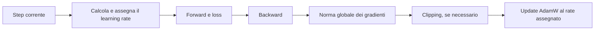

### Codice di riferimento aggiunto in questa lezione

```python
def get_learning_rate(
    step,
    base_learning_rate,
    min_learning_rate,
    warmup_steps,
    decay_steps,
):
    if step < warmup_steps:
        return base_learning_rate * step / warmup_steps

    if step > decay_steps:
        return min_learning_rate

    decay_ratio = (step - warmup_steps) / (decay_steps - warmup_steps)
    cosine_coefficient = 0.5 * (1.0 + math.cos(math.pi * decay_ratio))

    return min_learning_rate + cosine_coefficient * (
        base_learning_rate - min_learning_rate
    )

optimizer.zero_grad()
loss.backward()

if gradient_clip is not None:
    torch.nn.utils.clip_grad_norm_(model.parameters(), gradient_clip)

optimizer.step()
```

Gli helper scheduler e optimizer sono in `study/snapshots/lesson_34/training.py`.

### Sintassi e logica

- `if step < warmup_steps` interpola linearmente da zero al learning rate base.
- `if step > decay_steps` mantiene il learning rate al minimo configurato.
- `decay_ratio = (step - warmup_steps) / (decay_steps - warmup_steps)` mappa il
  tratto intermedio nell'intervallo normalizzato da `0` a `1`.
- `0.5 * (1.0 + math.cos(math.pi * decay_ratio))` converte tale rapporto in un
  coefficiente regolare che passa da `1` a `0`.
- L'interpolazione finale combina `min_learning_rate` e
  `base_learning_rate - min_learning_rate`, impedendo allo schedule di scendere
  sotto il valore minimo.
- Ogni `optimizer.param_group` riceve il learning rate calcolato per lo step.
- `clip_grad_norm_` modifica i gradienti in place soltanto se la norma globale
  supera la soglia. La lezione 42 aggiungerà controlli sul raw gradient norm.

### Codice ↔ matematica ↔ significato

Questa sezione mostra come il codice realizza direttamente la trasformazione matematica.

| Codice | Lettura matematica | In parole semplici |
|---|---|---|
| `clip_grad_norm_(..., c)` | $g\leftarrow g\min(1,c/\lVert g\rVert_2)$ | limita la grandezza solo oltre la soglia |

### Programmato rispetto ad appreso

- **Definito dal programmatore:** warmup, decadimento, ritaglio, momenti e politica di riduzione del peso.
- **Appreso durante il gradient training:** momenti dell'optimizer e parametri del modello.

## Lezione 35 — Dropout e weight tying

### Sintesi della lezione: obiettivo e risultato

- **Prima:** rami deterministici e tabelle separate
- **Obiettivo:** Regolarizza le attivazioni e condividi la tabella input/output token
- **Dopo:** attivazioni regolarizzate e una geometria del vocabolario condivisa
- **Vincolo:** i pesi appresi e il tokenizer mantengono il loro significato attraverso salvataggio e generazione

### Comprendere la trasformazione

L'optimizer aggiorna ora il modello in modo controllato, ma la rete può ancora
dipendere troppo da specifici percorsi di attivazione e mantenere due grandi
tabelle del vocabolario non collegate. Questa lezione affronta i due problemi
con meccanismi indipendenti ma complementari: Dropout e weight tying.

Durante il training, **Dropout** sostituisce casualmente con zero alcune
attivazioni e riscala quelle rimaste. Il modello non può dare per scontato che
una singola feature o un particolare ramo siano sempre disponibili, quindi è
spinto a distribuire l'informazione utile tra più percorsi. In evaluation mode
Dropout viene disattivato: a parità di parametri, un prompt come
`The cat sleeps here.` attraversa una rete deterministica.

Il **weight tying** interviene invece sui parametri persistenti. La token
embedding table trasforma ogni ID del vocabolario in una rappresentazione larga
`C`. L'output head svolge il ruolo complementare: confronta uno stato largo
`C` con tutte le voci del vocabolario per produrre i logits. Invece di
apprendere due matrici indipendenti, l'implementazione fa puntare il peso
dell'output head allo stesso `Parameter` usato dalla token embedding table.

“Lo stesso parametro” è più forte di “gli stessi valori iniziali”. I gradienti
che arrivano dal ruolo di embedding e quelli che arrivano dalla proiezione di
output aggiornano un unico tensor condiviso. Il numero dei parametri si riduce
e la geometria di input e output rimane collegata. La mappa del tokenizer deve
restare invariata, perché la riga `i` deve rappresentare lo stesso token in
entrambi i ruoli.

### Trasformazione, passo dopo passo

1. **INPUT — Individua due forme di dipendenza**

   Le attivazioni di training seguono sempre gli stessi percorsi disponibili e
   i ruoli di input e output possono usare matrici separate.

   **Cosa osservare:** Dropout agisce su valori temporanei; weight tying agisce
   su parametri persistenti.

2. **OPERATION — Regolarizza i percorsi e lega i pesi**

   Applica i due meccanismi nei rispettivi punti:

   ```learngpt-mermaid
   flowchart TD
       A["Attivazioni durante il training"] --> D["Dropout rimuove percorsi temporanei"]
       D --> S["Attivazioni scalate durante il training"]
       E["Token embedding weight"] --> P["Stesso Parameter condiviso"]
       P --> O["Output head weight"]
   ```

   **Cosa osservare:** Dropout cambia quali attivazioni sopravvivono nel
   training; il tying collega due attributi allo stesso tensor appreso.

3. **INTERMEDIATE STATE — Confronta training ed evaluation**

   In training mode le maschere cambiano tra i forward pass. In evaluation
   mode tutti i percorsi sono disponibili e non viene applicata alcuna maschera
   casuale.

   **Cosa osservare:** la differenza dipende dalla modalità di esecuzione, non
   crea due copie dei pesi appresi.

4. **CHECK — Verifica la condivisione reale**

   Controlla che il peso della token embedding e quello dell'output head siano
   lo stesso `Parameter`, non copie con valori uguali.

   **Cosa osservare:** gli indici delle righe devono mantenere lo stesso
   significato del tokenizer su entrambi i lati del modello.

5. **OUTPUT — Usa una geometria regolarizzata e condivisa**

   Il modello si addestra con percorsi di attivazione casualmente ridotti e una
   sola matrice condivisa tra input e output.

   **Cosa osservare:** l'evaluation disattiva Dropout, mentre il weight tying
   rimane parte del modello in ogni modalità.

### Dove siamo arrivati

Il modello possiede ora un regolarizzatore di runtime e una regola strutturale
di condivisione dei parametri. Nessuno dei due cambia il compito next-token, ma
entrambi modificano il modo in cui il modello lo apprende.

- **Cambiato:** percorsi deterministici e ruoli separati sono diventati **attivazioni regolarizzate e una matrice condivisa**.
- **Preservato:** significato delle righe del tokenizer, interfacce del modello ed evaluation deterministica.
- **Prossimo passo:** **Dati di produzione e gruppi optimizer** scalerà lo storage e assegnerà il weight decay in modo esplicito.

> **Se ricordi una sola cosa:** Dropout cambia le attivazioni temporanee; il
> weight tying fa apprendere due ruoli attraverso lo stesso parametro.

### Come leggere la matematica

La maschera casuale è zero o uno; la divisione per uno meno p mantiene invariata la scala di attivazione prevista.

| Notazione | Leggilo come | Significato qui |
|---|---|---|
| $V$ | V | vocabulary: il numero di possibili ID token |
| $C$ | C | numero di feature usate per rappresentare un token |
| $E$ | E | tabella di token embedding appresa |
| $p_{drop}$ | p drop | probabilità di azzerare un'attivazione durante il training |

### Esempio visivo svolto

> **Stato dell'esempio ricorrente:** regolarizza le attivazioni della sequenza
> canonica e riusa la tabella dei token per calcolare i logits.

| Training attivazione | Dropout maschera | Uscita scalata per $p_{drop}=0.5$ |
|---:|---:|---:|
| 0.8 | 1 | 1.6 |
| -0.3 | 0 | 0.0 |
| 0.5 | 1 | 1.0 |

Separatamente, il weight tying fa sì che la tabella di input embedding e il
peso del classificatore di output siano la stessa matrice $V\times C$.

Per $0\leq p_{drop}<1$, durante il training il dropout invertito utilizza la
maschera $m_i\sim\text{Bernoulli}(1-p_{drop})$:

$$y_i=\frac{m_i}{1-p_{drop}}x_i.$$

La riscalatura preserva $E[y_i]=x_i$; in evaluation mode si usa il vettore
deterministico completo. L'implementazione accetta anche il valore limite
$p_{drop}=1$: in quel caso PyTorch restituisce zeri durante il training invece
di applicare la frazione qui sopra. Il dropout regolarizza attention e MLP, ma
non può compensare dati o valutazioni inadeguati.

Il weight tying usa la matrice di token embedding come proiezione sul
vocabolario. Poiché `nn.Linear` mantiene il bias predefinito:

$$E\in\mathbb R^{V\times C},\qquad Z=FE^{\mathsf T}+b.$$

L'ingresso e l'uscita condividono quindi i parametri $VC$ e uno spazio rappresentativo comune, risparmiando una matrice `[V,C]` separata.

### Codice di riferimento aggiunto in questa lezione

```python
self.embedding_dropout = nn.Dropout(dropout)
self.attention_dropout = nn.Dropout(dropout)
self.output_head = nn.Linear(
    in_features=embedding_size,
    out_features=vocabulary_size,
)

if tie_weights:
    self.output_head.weight = self.token_embedding_table.weight
```

Il dropout è applicato anche nell'attention, nell'output multi-head e nel
feed-forward path di `study/snapshots/lesson_35/model.py`.

### Sintassi e logica

- `nn.Dropout(p)` azzera elementi con probabilità `p` soltanto quando
  `model.training` è vero; `model.eval()` disabilita la casualità.
- Le attivazioni sopravvissute vengono riscalate durante il training per
  mantenerne stabile il valore atteso.
- `self.output_head = nn.Linear(in_features=embedding_size,
  out_features=vocabulary_size)` crea la proiezione di output prima della
  condivisione opzionale.
- `if tie_weights` mantiene il comportamento configurabile.
- L'assegnazione non copia i valori: entrambi i moduli riferiscono lo stesso
  `Parameter`, quindi un update modifica una sola matrice condivisa.
- Il tying è valido perché `[V,C]` è la shape del peso richiesto da un layer
  lineare `C → V`.

### Codice ↔ matematica ↔ significato

Questa sezione mostra come il codice realizza direttamente la trasformazione matematica.

| Codice | Lettura matematica | In parole semplici |
|---|---|---|
| `output_head.weight = token_embedding.weight` | $Z=FE^{\mathsf T}+b$ | riusa la tabella dei token mantenendo il bias di output |

### Programmato rispetto ad appreso

- **Definito dal programmatore:** probabilità di dropout e weight tying.
- **Appreso durante il gradient training:** valori condivisi degli embedding.

# Modulo 9 — Training production-ready


## Lezione 36 — Dati di produzione e gruppi optimizer

### Sintesi della lezione: obiettivo e risultato

- **Prima:** pochi dati character-level interamente in memoria
- **Obiettivo:** Sostituisci percorsi di dati giocattolo e gestione ingenua dei parametri con quelli orientati alla produzione
- **Dopo:** memmap BPE e gruppi AdamW espliciti
- **Vincolo:** l'obiettivo next-token e la semantica del modello restano invariati mentre il runtime diventa più robusto

### Comprendere la trasformazione

Passiamo dal setup didattico a uno storage di token adatto a dataset grandi e
a gruppi di parametri espliciti per AdamW. Questa lezione non calcola ancora
un dataset fingerprint: l'identità verificata dei dati arriverà nel progetto
production finale.

Il tokenizer character-level e i tensor interamente in memoria rendono
semplice osservare ogni passaggio, ma non rappresentano il modo in cui un
language model più grande gestisce il testo. Questo è il passaggio dal tokenizer
didattico al tokenizer di produzione. Il character tokenizer ha insegnato
l'idea di indirizzo con un vocabulary minuscolo creato dal testo corrente. Il
tokenizer GPT-2 BPE introduce invece un vocabulary esterno fisso, token ID per
frammenti frequenti e gestione esplicita del token speciale consentito
`<|endoftext|>`. Qui il corpus viene codificato con quel tokenizer BPE di
GPT-2. Una frase come `The cat sleeps here.` non viene più
necessariamente suddivisa in un ID per carattere: sequenze di byte frequenti
possono formare un solo token. L'obiettivo resta “prevedere l'ID successivo”,
ma vocabolario e lunghezza della sequenza seguono ora la tokenizzazione BPE.

Gli ID di training e validation vengono scritti in file binari e aperti come
array `numpy.memmap`. Una memmap permette di leggere la finestra richiesta
senza caricare l'intero stream di token nella memoria di Python. La creazione
del batch sceglie ancora una posizione iniziale e produce tensor `[B,T]` di
input e target traslati di una posizione. Cambia lo storage, non la relazione
next-token.

Qui “dataset reale” inizia anche a significare “artefatto preprocessato”, non
soltanto “un file di testo aperto in Python”. Il training loop dovrebbe
consumare file di token stabili, con tokenizer, split, dtype e path noti. Le
lezioni successive aggiungeranno controlli di identità più forti attorno a
quegli artefatti; questa lezione stabilisce prima le convenzioni di storage e
optimizer.

Anche il lato optimizer diventa esplicito. AdamW deve applicare il weight decay
ai pesi simili a matrici, mentre bias e parametri monodimensionali delle
normalizzazioni appartengono normalmente al gruppo senza decay. Il codice
esamina i parametri trainable, separa i tensor con almeno due dimensioni da
quelli con meno dimensioni e crea due gruppi con valori di `weight_decay`
diversi.

Il percorso diventa più adatto alla produzione, ma non è ancora completo. La
lezione non calcola un fingerprint dei file di token, quindi un run successivo
non può dimostrare che due path contengano gli stessi dati. Non accumula
nemmeno gradienti su più micro-batch. Questi limiti restano espliciti per
distinguere ciò che scala qui da ciò che verrà irrobustito più avanti.

### Trasformazione, passo dopo passo

1. **INPUT — Parti dal percorso didattico**

   Il progetto usa un piccolo stream di caratteri in memoria e una politica
   dell'optimizer non differenziata.

   **Cosa osservare:** l'obiettivo del modello funziona già; i limiti da
   superare riguardano scala dello storage e trattamento dei parametri.

2. **OPERATION — Costruisci due percorsi orientati alla produzione**

   Trasforma in parallelo i dati e gli input dell'optimizer:

   ```learngpt-mermaid
   flowchart TD
       C["Corpus grezzo"] --> B["GPT-2 BPE"]
       B --> F["File di token"]
       P["Pesi nominati"] --> Q{"Parametro soggetto a decay?"}
       Q -->|"sì"| D["Gruppo decay"]
       Q -->|"no"| N["Gruppo no-decay"]
       F --> O["Input production-ready"]
       D --> O
       N --> O
   ```

   **Cosa osservare:** BPE e memmap cambiano creazione e storage degli ID; i
   gruppi cambiano quali parametri ricevono weight decay.

3. **INTERMEDIATE STATE — Leggi una finestra senza caricare il corpus**

   La memmap espone slice di token su richiesta; la creazione del batch
   converte in `torch.long` soltanto le finestre selezionate.

   **Cosa osservare:** il batch contiene ancora input e target traslati;
   il memory mapping non modifica l'ordine dei token.

4. **CHECK — Ispeziona i gruppi dell'optimizer**

   Verifica che i parametri simili a matrici entrino nel gruppo con decay e
   quelli monodimensionali nel gruppo senza decay.

   **Cosa osservare:** ogni parametro trainable deve apparire una sola volta;
   il raggruppamento cambia la regolarizzazione, non la loss.

5. **OUTPUT — Fornisci input scalabili al training**

   Il training loop riceve memmap di token BPE e un optimizer AdamW con gruppi
   decay e no-decay espliciti.

   **Cosa osservare:** l'identità del dataset è ancora affidata al path
   selezionato; questo snapshot non calcola un fingerprint.

### Dove siamo arrivati

I dati non devono più entrare interamente in memoria e AdamW non applica una
sola regola di decay a tutti i tensor trainable. Il modello continua a ricevere
finestre ordinate e ad apprendere lo stesso compito next-token.

- **Cambiato:** storage character-level e politica unica sono diventati **memmap BPE e gruppi AdamW espliciti**.
- **Preservato:** confini degli split, ordine dei token, target traslati e obiettivo causale next-token.
- **Prossimo passo:** **Gradient accumulation** unirà più micro-batch compatibili con la memoria in un solo update.

> **Se ricordi una sola cosa:** qui scalano storage e politica dell'optimizer;
> il fingerprint del dataset e il gradient accumulation arrivano dopo.

### Come leggere la matematica

La potenza di due descrive soltanto la capacità di archiviazione: `uint16` può rappresentare gli ID da zero a 65,535.

| Notazione | Leggilo come | Significato qui |
|---|---|---|
| $N$ | N | numero di caratteri ordinati o token in una sequenza |
| $V$ | V | vocabulary: il numero di possibili ID token |
| $B$ | B | numero di esempi indipendenti in un unico batch |
| $T$ | T | posizioni token in un unico context window |
| $\theta$ | theta | tutti i parametri del modello addestrabili considerati insieme |

### Esempio visivo svolto

> **Stato dell'esempio ricorrente:** rappresenta la stessa frase con il
> tokenizer BPE di produzione, i cui ID reali differiscono dalla notazione
> didattica, e leggili senza caricare tutto il dataset in RAM.

```learngpt-mermaid
flowchart TD
    T["Testo FineWeb-Edu"] -->|"GPT-2 BPE"| I["Token ID"]
    I -->|"uint16"| F["train.bin e val.bin"]
    F -->|"memory map"| B["Batch int64"]
    P["Pesi con dim ≥ 2"] --> D["Gruppo AdamW con decay"]
    N["Bias e norme"] --> ND["Gruppo AdamW senza decay"]
```

Storage e politica dell'optimizer cambiano, ma l'obiettivo next-token resta lo
stesso.

Questa lezione sostituisce lo stream di caratteri con ID GPT-2 BPE memorizzati in
file `uint16` mappati in memoria. Poiché $50{,}257<2^{16}$, ogni ID occupa due
byte. I batch convertono le slice in `int64`, il tipo richiesto
dall'embedding lookup di PyTorch.

I gruppi AdamW applicano weight decay ai parametri con almeno due dimensioni e
lo disabilitano per bias e scale di normalizzazione. È l'euristica implementata
dalla lezione, non una classificazione semantica universale.

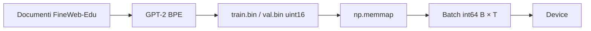

### Codice di riferimento aggiunto in questa lezione

```python
def load_token_data(data_dir=DEFAULT_DATA_DIR, split="train"):
    data_dir = Path(data_dir)
    data_path = data_dir / f"{split}.bin"

    if not data_path.exists():
        raise FileNotFoundError(f"Processed dataset not found: {data_path}")

    return np.memmap(data_path, dtype=np.uint16, mode="r")


def configure_optimizer(
    model,
    learning_rate,
    weight_decay,
    betas=(0.9, 0.95),
    device=None,
):
    parameter_dict = {
        name: parameter
        for name, parameter in model.named_parameters()
        if parameter.requires_grad
    }
    decay_parameters = [
        parameter
        for parameter in parameter_dict.values()
        if parameter.dim() >= 2
    ]
    no_decay_parameters = [
        parameter
        for parameter in parameter_dict.values()
        if parameter.dim() < 2
    ]
    optimizer_groups = [
        {
            "params": decay_parameters,
            "weight_decay": weight_decay,
        },
        {
            "params": no_decay_parameters,
            "weight_decay": 0.0,
        },
    ]

    device = device or get_default_device()
    fused_available = "fused" in inspect.signature(torch.optim.AdamW).parameters
    use_fused = fused_available and torch.device(device).type == "cuda"
    extra_args = {"fused": True} if use_fused else {}

    return torch.optim.AdamW(
        optimizer_groups,
        lr=learning_rate,
        betas=betas,
        **extra_args,
    )
```

Questo confine production coinvolge `batching.py`, `tokenizer.py`, `device.py`,
`checkpoint.py` e `training.py` in `study/snapshots/lesson_36/`.

### Sintassi e logica

- `data_dir = Path(data_dir)` normalizza il path del chiamante e
  `f"{split}.bin"` costruisce `train.bin` o `val.bin`.
- Il controllo di esistenza produce un `FileNotFoundError` esplicito prima che
  `np.memmap(..., mode="r")` esponga il file senza caricarlo tutto in RAM.
- `uint16` copre gli ID da 0 a 65.535, sufficiente per i 50.257 token GPT-2;
  le slice diventano `int64` prima dell'embedding lookup.
- `named_parameters()` fornisce nomi e tensor; `requires_grad` esclude i
  parametri congelati.
- `parameter.dim() >= 2` seleziona matrici come i pesi lineari e embedding per
  weight decay.
- `parameter.dim() < 2` invia bias unidimensionali e scale di normalizzazione al
  gruppo senza decay.
- I due dizionari in `optimizer_groups` associano ogni elenco di parametri con
  il proprio valore di `weight_decay`.
- `betas=(0.9, 0.95)` è la configurazione dei momenti AdamW implementata.
- `get_default_device()` sceglie CUDA, poi MPS, infine CPU. I controlli sulla
  signature e sul device richiedono AdamW fused solo se l'opzione esiste nel
  PyTorch installato e il device è CUDA; altrimenti il percorso standard usa
  gli stessi parameter group.

### Programmato rispetto ad appreso

- **Definito dal programmatore: formato dati**, regole di raggruppamento e politica di trasferimento.
- **Appreso durante il gradient training:** token/model pesi e optimizer momenti.

## Lezione 37 — Gradient accumulation

### Sintesi della lezione: obiettivo e risultato

- **Prima:** un solo micro-batch, limitato dalla memoria disponibile
- **Obiettivo:** costruire il gradiente di un effective batch da più forward pass piccoli
- **Dopo:** un gradiente medio dell'effective batch
- **Vincolo:** l'obiettivo next-token e la semantica del modello restano invariati mentre il runtime diventa più robusto

### Comprendere la trasformazione

Un micro-batch entra in memoria, ma l'effective batch desiderato potrebbe non
entrarci. PyTorch permette di ottenere lo stesso gradiente medio senza
conservare contemporaneamente tutte le attivazioni: ogni chiamata a
`backward()` somma il proprio contributo nei buffer dei gradienti già
esistenti.

Per ciascuno dei $K$ micro-batch della stessa dimensione, il ciclo calcola la
loss next-token, la divide per $K$ e avvia il backward. Dopo le $K$ chiamate,
ogni parametro contiene il gradiente della loss media dei micro-batch. Soltanto
a quel punto il ciclo applica il clipping al gradiente completo ed esegue un
optimizer step. Azzerare i gradienti o aggiornare i parametri dentro il ciclo
interno produrrebbe invece $K$ update più piccoli.

L'accumulo cambia il numero di token che contribuiscono a un update, non la
finestra di contesto del modello: ogni forward pass usa ancora tensor di shape
`[B,T]`, mentre un optimizer update rappresenta $B\times T\times K$ token.

La semplice divisione per $K$ presuppone micro-batch della stessa dimensione,
con loss calcolate tramite la stessa riduzione media. Se il numero di token
validi varia, ogni loss deve invece essere pesata in base a quel numero. Anche
i layer stocastici possono produrre maschere diverse rispetto a un unico batch
fisico, quindi le due esecuzioni non devono essere identiche bit per bit. Resta
essenziale l'ordine: azzera una volta, scala ed esegui il backward di $K$ loss,
poi applica un solo clipping e un solo optimizer step.

### Trasformazione, passo dopo passo

1. **INPUT — Prepara i K micro-batch**

   Campiona o ricevi $K$ micro-batch della stessa dimensione. Ciascuno produce
   una loss indipendente per lo stesso obiettivo next-token.

   **Cosa osservare:** ogni forward pass conserva la shape `[B,T]`; il contesto
   del modello non diventa `K * T`.

2. **OPERATION — Scala ogni loss ed esegui il backward**

   Per il micro-batch $k$, calcola $L_k/K$ e chiama `backward()` prima di
   passare al micro-batch successivo.

   **Cosa osservare:** la divisione avviene prima del backward, quindi ogni
   contributo al gradiente è già scalato di $1/K$.

3. **INTERMEDIATE STATE — Accumula K contributi al gradiente**

   Il ciclo non chiama `zero_grad()` tra un micro-batch e il successivo. Ogni
   backward somma quindi il proprio contributo negli stessi buffer dei
   parametri.

   **Cosa osservare:** dopo $k$ backward, i buffer contengono
   $\frac1K\sum_{i=1}^{k}\nabla L_i$; i parametri del modello non sono ancora
   cambiati.

4. **OPERATION — Applica un solo clipping e un solo step**

   Dopo tutti i $K$ micro-batch, applica il clipping al gradiente accumulato ed
   esegui `optimizer.step()` esattamente una volta.

   **Cosa osservare:** il clipping misura il gradiente dell'effective batch,
   non quello parziale di un solo micro-batch; le $K$ chiamate a backward
   producono un unico update.

5. **OUTPUT — Azzera i buffer prima dell'update successivo**

   Dopo che l'optimizer ha consumato il gradiente medio, azzera i buffer prima
   di accumulare l'effective batch seguente.

   **Cosa osservare:** un update ha usato $B\times T\times K$ token effettivi,
   mentre la loss e gli output del modello sono rimasti invariati.

### Dove siamo arrivati

Il training loop può ora costruire un gradiente medio da $K$ forward e
backward pass senza dover caricare in memoria l'intero effective batch. Scala
della loss, accumulo, clipping e optimizer step occupano punti distinti del
ciclo.

- **Cambiato:** un optimizer update combina ora $K$ micro-batch.
- **Preservato:** ogni micro-batch usa la stessa loss next-token e lo stesso
  contratto di contesto `[B,T]`.
- **Prossimo passo:** **Configurazione e resume** renderà riavviabile questo
  processo di training più lungo.

> **Se ricordi una sola cosa:** dividi ogni loss per $K$, esegui il backward
> $K$ volte, poi applica un solo clipping e un solo optimizer step.

### Come leggere la matematica

La somma accumula i gradienti dei micro-batch; dividere ogni loss per $K$
mantiene la scala uguale a quella della media, invece di moltiplicarla per $K$.

| Notazione | Leggilo come | Significato qui |
|---|---|---|
| $B$ | B | numero di esempi indipendenti in un unico batch |
| $T$ | T | posizioni token in un unico context window |
| $K$ | K | numero di micro-batch o lotti di valutazione, a seconda del contesto |
| $\mathcal L$ | L calligrafica, o loss | misura scalare dell'errore di previsione |
| $\nabla_\theta\mathcal L$ | gradiente della loss rispetto a theta | direzioni in cui i parametri influenzano la loss |

### Esempio visivo svolto

> **Stato dell'esempio ricorrente:** suddividi le finestre della sequenza
> canonica in micro-batch e costruisci un solo gradiente medio.

| Micro-batch | Loss grezza | Valore usato nel backward $L_k/K$, $K=4$ |
|---:|---:|---:|
| 1 | 4.0 | 1.00 |
| 2 | 3.6 | 0.90 |
| 3 | 3.8 | 0.95 |
| 4 | 4.2 | 1.05 |
| Optimizer step |  | **uno, dopo tutti e quattro** |

Il gradiente accumulato corrisponde alla media delle loss dei micro-batch.

Quando l'effective batch desiderato non entra in memoria, elabora $K$
micro-batch prima di un solo optimizer step e dividi ogni loss per $K$:

$$g=\sum_{k=1}^{K}\nabla_\theta\frac{L_k}{K} =\frac1K\sum_{k=1}^{K}\nabla_\theta L_k.$$

Con micro-batch della stessa dimensione e la stessa riduzione media, questo
equivale al gradiente della loss media sul batch combinato. Micro-batch con un
numero diverso di token richiedono pesi proporzionali; dropout e altri layer
stocastici impediscono inoltre un'identità bit-for-bit. In questa lezione
single-process, i token effettivi per update sono $B\times T\times K$.

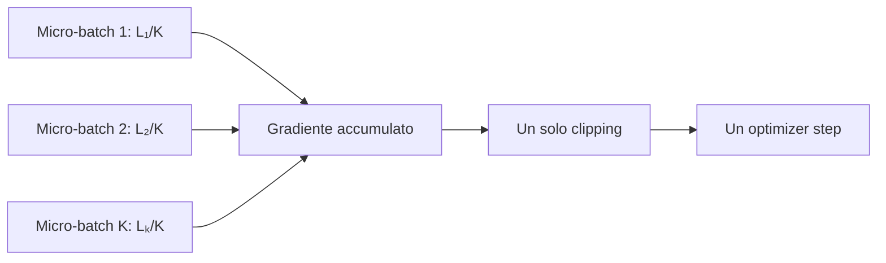

### Codice di riferimento aggiunto in questa lezione

```python
optimizer.zero_grad(set_to_none=True)
total_loss = 0.0

for _ in range(gradient_accumulation_steps):
    input_tensor, target_tensor = create_batch(
        data=training_data,
        batch_size=batch_size,
        context_size=context_size,
        device=device,
    )
    _, loss = model(input_tensor, target_tensor)
    loss = loss / gradient_accumulation_steps
    total_loss += loss.item()
    loss.backward()

if gradient_clip is not None:
    torch.nn.utils.clip_grad_norm_(model.parameters(), gradient_clip)

optimizer.step()
```

Il ciclo di accumulo è in `study/snapshots/lesson_37/training.py`.

### Sintassi e logica

- I gradienti si accumulano perché `zero_grad` viene eseguito una volta prima
  del ciclo interno e `optimizer.step` una volta dopo.
- `set_to_none=True` rilascia i vecchi tensor dei gradienti invece di riempirli
  di zeri; il backward successivo assegna nuovi gradienti sui device
  supportati.
- Ogni iterazione del ciclo chiama `create_batch(...)` per ottenere un
  micro-batch sul device richiesto.
- `_, loss = model(input_tensor, target_tensor)` calcola l'obiettivo del
  micro-batch e ignora i logits.
- `loss = loss / gradient_accumulation_steps` divide ogni loss per il numero di
  micro-batch, quindi il gradiente accumulato rappresenta una media. Senza
  questa divisione, la sua scala crescerebbe con il numero di accumuli.
- `.item()` registra lo scalare già ridimensionato per il reporting;
  `backward()` usa invece il tensor che conserva il grafo di calcolo.
- Le chiamate ripetute a `loss.backward()` sommano contributi negli stessi
  gradienti dei parametri, perché il ciclo interno non li azzera.
- `clip_grad_norm_` viene eseguito soltanto dopo tutti i micro-batch, quindi
  misura e limita il gradiente completo dell'effective batch.
- I token effettivi per optimizer update sono
  `B * T * accumulation_steps`: l'accumulo cambia il batching degli update,
  non la lunghezza del contesto del modello.

### Codice ↔ matematica ↔ significato

Questa sezione mostra come il codice realizza direttamente la trasformazione matematica.

| Codice | Lettura matematica | In parole semplici |
|---|---|---|
| `(loss / K).backward()` | $g=\frac1K\sum_k\nabla L_k$ | accumula il gradiente medio dell'effective batch |

### Programmato rispetto ad appreso

- **Definito dal programmatore:** ridimensionamento della loss e momento
  dell'optimizer step.
- **Appreso durante l'addestramento tramite gradienti:** i valori del gradiente
  accumulato.

## Lezione 38 — Configurazione e resume

### Sintesi della lezione: obiettivo e risultato

- **Prima:** valori separati per modello, training e generation
- **Obiettivo:** raggruppare la configurazione per serializzarla e ripristinare esplicitamente modello, optimizer e step
- **Dopo:** configurazione raggruppata e serializzata, con un resume di base consapevole dello step
- **Vincolo:** l'obiettivo next-token e la semantica del modello restano invariati mentre il runtime diventa più robusto

### Comprendere la trasformazione

La lezione raggruppa anzitutto i valori di modello, training e generation in
tre dataclass: `ModelConfig`, `TrainingConfig` e `GenerationConfig`.
`asdict(...)` converte questi oggetti in dizionari semplici che possono essere
scritti nel checkpoint: è un'operazione di organizzazione e serializzazione,
non la prova che un'esecuzione futura usi lo stesso modello, tokenizer o
dataset. Il booleano `resume_from_checkpoint` viene registrato nella
configurazione di training, ma l'helper non lo legge: soltanto un
`resume_checkpoint_path` esplicito attiva il ramo di resume.

Il resume inizia soltanto quando il chiamante fornisce il percorso di un
checkpoint. Il loader copia i valori salvati in un modello e in un optimizer
già creati, legge lo step $N$ e fa ripartire il ciclo da $N+1$. Lo schedule del
learning rate viene quindi ricalcolato a partire da quello step. Se il layout
dei parametri non è compatibile, il caricamento può fallire, ma questa lezione
non confronta preventivamente le configurazioni.

Si tratta deliberatamente di un resume di base. Non salva o ripristina lo
stato RNG, lo stato del GradScaler o l'ordine dei dati e non verifica
l'identità del tokenizer o del dataset. La continuazione ripristina quindi
modello, optimizer e step senza promettere una continuità stocastica esatta.

La distinzione è importante perché i dizionari del checkpoint possono
contenere campi di configurazione senza che il loader li faccia rispettare.
Ripristinare l'optimizer ne recupera i momenti salvati, mentre ripristinare lo
step colloca lo schedule del learning rate nel punto corrispondente; nessuna
delle due operazioni dimostra che dati o tokenizer siano invariati. Questa
lezione recupera lo stato di avanzamento implementato; la verifica completa
dell'identità dell'esperimento richiede un contratto di checkpoint più forte.

### Trasformazione, passo dopo passo

1. **OPERATION — Raggruppa e serializza i valori di configurazione**

   Inserisci i campi di modello, training e generation nelle dataclass, quindi
   convertili in dizionari da checkpoint con `asdict(...)`.

   **Cosa osservare:** la serializzazione registra i valori dei campi; non li
   confronta con un'esecuzione futura e non valida l'identità dell'esperimento.

2. **CHECK — Scegli un avvio da zero o un resume esplicito**

   Senza un percorso di checkpoint, il training parte normalmente. Se il
   percorso è presente, il ramo di resume carica proprio quel file.

   **Cosa osservare:** il codice non cerca né seleziona automaticamente un
   checkpoint; avvio da zero e resume restano alternative esplicite.

3. **OPERATION — Ripristina modello e optimizer**

   Carica i tensor dei parametri e lo stato dell'optimizer negli oggetti creati
   dal programma corrente.

   **Cosa osservare:** è un ripristino dello stato, non un confronto preventivo
   delle configurazioni; un layout incompatibile può fallire durante il load.

4. **OPERATION — Continua dallo step salvato**

   Leggi lo step $N$, imposta `start_step = N + 1` e ricava il learning rate
   di ogni step ripreso dalla funzione di schedule esistente.

   **Cosa osservare:** `training_steps` resta lo step-obiettivo totale, non un
   nuovo numero di step da aggiungere dopo il checkpoint.

5. **OUTPUT — Delimita il resume di base**

   Il training continua con modello, optimizer e step ripristinati.

   **Cosa osservare:** RNG, GradScaler, identità del tokenizer, identità del
   dataset e ordine esatto dei campioni non vengono ripristinati o verificati.

### Dove siamo arrivati

I valori di configurazione hanno ora una struttura serializzabile, e un
percorso di checkpoint esplicito può ripristinare i tre stati implementati:
modello, optimizer e step. Il ciclo ripreso parte da $N+1$ e ricalcola il
learning rate in base all'avanzamento salvato.

- **Cambiato:** i valori separati sono diventati dizionari raggruppati, e il
  training dispone di un ramo di resume esplicito e di base.
- **Preservato:** l'obiettivo next-token del modello e l'interpretazione dello
  step-obiettivo totale restano invariati.
- **Non garantito:** validazione della configurazione, verifica dell'identità
  dell'esperimento, ripristino di RNG/GradScaler o continuità stocastica esatta.
- **Prossimo passo:** **Last-token output head** ottimizzerà il percorso di
  output usato soltanto durante la generation, senza cambiare la loss di
  training.

> **Se ricordi una sola cosa:** la lezione 38 serializza valori raggruppati e
> ripristina modello, optimizer e step; niente di più.

### Come leggere la matematica

Non compare una nuova equazione tensoriale. La compatibilità richiede che i
valori che definiscono le shape ricostruiscano lo stesso layout dei parametri,
ma questa lezione non esegue una validazione completa della configurazione.

| Notazione | Leggilo come | Significato qui |
|---|---|---|
| $V$ | V | vocabulary: il numero di possibili ID token |
| $T$ | T | posizioni token in un unico context window |
| $C$ | C | numero di feature usate per rappresentare un token |
| $H$ | H | numero di teste attention in esecuzione in parallelo |
| $L$ | L | numero di blocchi Transformer |

### Esempio visivo svolto

> **Stato dell'esempio ricorrente:** raggruppa le impostazioni associate allo
> stesso esperimento di modellazione della frase, mantenendo espliciti i limiti
> di questo resume di base.

| Classe di configurazione | Esempio | Cosa registra davvero la lezione 38 |
|---|---|---|
| Modello strutturale | $C,H,L,V,T$ | `ModelConfig` e il `head_size` derivato |
| Ottimizzazione | LR, decay, accumulation | `TrainingConfig` e stato dell'optimizer |
| Generation | prompt, temperature, top-k | `GenerationConfig`, separata dalla logica di resume |
| Metadata del tokenizer | `encoding_name` | dizionario separato fornito dal chiamante |
| Identità del dataset | fingerprint | **non presente nello snapshot di questa lezione** |

La tabella separa i campi realmente presenti dai metadata aggiunti più avanti.
La lezione 38 registra valori di modello, training, generation e tokenizer, ma
non salva ancora campi runtime/compile e non calcola un dataset fingerprint.

I valori di configurazione rientrano in diverse classi di compatibilità:

- **strutturale:** $V,C,H,L,T$ e le scelte di bias determinano le forme dei parametri;
- **ottimizzazione:** learning rate, weight decay, accumulation e schedule;
- **generation:** prompt e controlli di sampling non determinano le shape dei
  parametri e non sono consultati dall'helper di resume;
- **metadata del checkpoint:** la configurazione del tokenizer viene salvata
  separatamente, ma la sua identità non è convalidata;
- **non ancora registrati:** campi runtime/compile e dataset fingerprint.

Questa lezione costruisce il modello dalla configurazione disponibile,
ripristina modello e optimizer e continua da `saved_step + 1`. Se il layout
dei parametri non coincide, il caricamento può fallire: non esiste ancora una
validazione preventiva completa. Lo schedule viene ricalcolato dallo step;
non c'è un oggetto scheduler autonomo da caricare. Stato RNG, GradScaler e
verifica dell'identità del dataset arrivano soltanto nel progetto finale.
Avvio da zero e resume restano operazioni esplicite e separate.

### Codice di riferimento aggiunto in questa lezione

```python
@dataclass
class TrainingConfig:
    batch_size: int = 4
    training_steps: int = 3
    eval_interval: int = 1
    eval_batches: int = 1
    base_learning_rate: float = 0.001
    min_learning_rate: float = 0.0001
    warmup_steps: int = 1
    decay_steps: int = 10
    weight_decay: float = 0.01
    gradient_clip: float | None = 1.0
    gradient_accumulation_steps: int = 2
    resume_from_checkpoint: bool = False

    def to_checkpoint_dict(self):
        return asdict(self)

if resume_checkpoint_path is not None:
    checkpoint = load_checkpoint(
        checkpoint_path=resume_checkpoint_path,
        model=model,
        optimizer=optimizer,
        device=device,
    )
    start_step = int(checkpoint.get("step", 0)) + 1
    best_validation_loss = checkpoint.get("best_validation_loss") or math.inf
    best_checkpoint_path = resume_checkpoint_path

for step in range(start_step, training_steps + 1):
    learning_rate = get_learning_rate(
        step=step,
        base_learning_rate=base_learning_rate,
        min_learning_rate=min_learning_rate,
        warmup_steps=warmup_steps,
        decay_steps=decay_steps,
    )
    apply_learning_rate(optimizer=optimizer, learning_rate=learning_rate)
```

Le classi di configurazione sono in `study/snapshots/lesson_38/config.py`; il resume è implementato nel corrispondente `training.py`.

### Sintassi e logica

- `@dataclass` genera un inizializzatore e una rappresentazione a partire dai
  campi di configurazione annotati.
- Campi come `batch_size: int = 4` combinano un'annotazione di tipo con un
  valore predefinito adatto alla lezione.
- `asdict(self)` converte i valori di configurazione annidati in dizionari
  adatti al checkpoint. La proprietà calcolata `head_size` deriva
  `C // num_heads`.
- `if resume_checkpoint_path is not None` mantiene separati e riconoscibili il
  percorso di avvio da zero e quello di resume.
- `resume_from_checkpoint` viene serializzato come metadata, ma impostare quel
  booleano da solo non avvia il resume: il ramo è controllato dal path
  esplicito del checkpoint.
- `load_checkpoint(checkpoint_path=resume_checkpoint_path, ...)` ripristina
  modello e stato dell'optimizer sul device selezionato.
- `checkpoint.get("step", 0)` supporta i file più vecchi privi della chiave;
  aggiungere uno fa ripartire da `N + 1`.
- `checkpoint.get("best_validation_loss") or math.inf` ripristina una best
  metric salvata e truthy. Una chiave mancante, `None` e anche il caso limite
  `0.0` ricadono su infinito, perché l'implementazione usa `or`: è il
  comportamento letterale della lezione 38. `best_checkpoint_path =
  resume_checkpoint_path` mantiene valido il path restituito anche se il
  segmento ripreso non trova un nuovo vincitore.
- `range(start_step, training_steps + 1)` include lo step finale configurato:
  `training_steps` è l'obiettivo totale, non il numero di step aggiuntivi.
- `get_learning_rate(...)` e
  `apply_learning_rate(optimizer=optimizer, learning_rate=learning_rate)`
  ricalcolano e applicano lo schedule dopo il resume, invece di farlo ripartire
  da zero.

## Lezione 39 — Last-token output head

### Sintesi della lezione: obiettivo e risultato

- **Prima:** logits sul vocabulary per ogni posizione del prefisso
- **Obiettivo:** proiettare soltanto lo stato del token finale durante la generation
- **Dopo:** un output `[B,1,V]` la cui unica riga temporale diventa `[B,V]` nel sampler
- **Vincolo:** l'obiettivo next-token e la semantica del modello restano invariati mentre il runtime diventa più robusto

### Comprendere la trasformazione

Il Transformer continua a calcolare gli stati contestuali per l'intero
prefisso, quindi l'output dei blocchi ha shape `[B,T,C]`. Il training richiede
tutte le posizioni perché ciascuna possiede un target next-token; durante la
generation, invece, servono i logits sul vocabulary soltanto per la posizione
`T-1`.

Il ramo di inference seleziona quindi l'ultimo stato nascosto prima della
proiezione sul vocabulary. L'indice `[:, [-1], :]` conserva un asse temporale
di lunghezza uno: `[B,T,C]` diventa `[B,1,C]`. L'output head produce poi
`[B,1,V]`, e il sampler seleziona quell'unica riga come `[B,V]`.

In questo modo non vengono calcolate le altre $T-1$ righe di logits sul
vocabulary. L'ottimizzazione non elimina gli stati precedenti del Transformer
e non rende l'attention indipendente dal prefisso: il risparmio riguarda
specificamente la grande proiezione `C → V`. Quando sono presenti i target, il
percorso di training completo `[B,T,V]` resta invariato.

La differenza conta soprattutto quando $V$ è molto maggiore di $C$. Ogni riga
del prefisso non necessaria richiederebbe altrimenti un'altra proiezione contro
l'intera matrice dei pesi del vocabulary. Selezionare prima lo stato finale
riduce questo lavoro, specifico della generation, da una proiezione di $T$
stati a una proiezione di un solo stato, preservando la rappresentazione
nascosta usata per decidere il token successivo. La softmax avviene ancora più
tardi nel sampler, dopo che il modello ha restituito logits grezzi.

### Trasformazione, passo dopo passo

1. **INPUT — Produci gli stati contestuali del prefisso**

   Esegui embedding e blocchi Transformer sul prefisso corrente per ottenere
   gli stati nascosti `[B,T,C]`.

   **Cosa osservare:** tutte le `T` posizioni partecipano ancora all'attention
   causale; questa lezione ottimizza soltanto la proiezione di output.

2. **CHECK — Separa training e generation**

   Se `target_ids` è presente, normalizza e proietta tutte le posizioni in
   `[B,T,V]`. Se è assente, entra nel ramo di generation.

   **Cosa osservare:** la loss di training riceve ancora tutte le $BT$
   previsioni; soltanto l'inference usa il percorso più breve.

3. **OPERATION — Seleziona l'ultimo stato nascosto**

   Applica `block_output[:, [-1], :]` prima della LayerNorm finale e
   dell'output head: `[B,T,C] → [B,1,C]`.

   **Cosa osservare:** la lista `[-1]` conserva l'asse temporale; un indice
   scalare produrrebbe invece `[B,C]`.

4. **OPERATION — Proietta una posizione sul vocabulary**

   Applica l'output head a `[B,1,C]` e ottieni logits del modello `[B,1,V]`.

   **Cosa osservare:** le righe di logits sul vocabulary delle $T-1$ posizioni
   precedenti non vengono calcolate; si tratta di logits o score, non di
   probabilità.

5. **OUTPUT — Consegna una riga al sampler**

   Il sampler applica `logits[:, -1, :]` per ottenere `[B,V]`, quindi esegue le
   normali operazioni di temperatura, top-k, softmax e sampling.

   **Cosa osservare:** l'output del modello è `[B,1,V]`; `[B,V]` è la vista del
   sampler dopo la selezione dell'unica riga temporale.

### Dove siamo arrivati

La generation segue ora la sequenza esplicita di shape
`[B,T,C] → [B,1,C] → [B,1,V] → [B,V]`. Il Transformer elabora ancora l'intero
prefisso causale, mentre l'output head proietta soltanto la posizione usata dal
sampler.

- **Cambiato:** la generation non calcola più i logits sul vocabulary per le
  prime $T-1$ posizioni del prefisso.
- **Preservato:** il training produce ancora `[B,T,V]`, e il sampling riceve
  gli stessi score della posizione finale.
- **Prossimo passo:** **Scaled dot-product attention** ottimizzerà
  l'implementazione dell'attention, non l'output head.

> **Se ricordi una sola cosa:** seleziona `[B,1,C]` da `[B,T,C]` prima
> dell'output head; il modello restituisce `[B,1,V]` e il sampler legge
> `[B,V]`.

### Come leggere la matematica

I due punti mantengono tutti gli elementi sugli assi del batch e delle feature;
l'indice meno uno seleziona l'ultima posizione temporale.

| Notazione | Leggilo come | Significato qui |
|---|---|---|
| $B$ | B | numero di esempi indipendenti in un unico batch |
| $T$ | T | posizioni token in un unico context window |
| $C$ | C | numero di feature usate per rappresentare un token |
| $V$ | V | vocabulary: il numero di possibili ID token |
| $Z$ | Z | score grezzi sul vocabulary, chiamati logits |

### Esempio visivo svolto

> **Stato dell'esempio ricorrente:** dopo aver elaborato `The cat`, proietta
> soltanto l'ultima posizione per scegliere il token successivo, idealmente
> `sleeps`.

```learngpt-visual
{
  "type": "labeled-grid",
  "title": "Training e generation usano viste diverse dell'output head",
  "description": "Il training assegna score a ogni posizione; la generation conserva l'asse temporale finale attraverso l'head e lo rimuove soltanto per il sampling.",
  "columns": ["stato in input", "selezione delle posizioni", "output dell'head", "vista del consumer"],
  "rows": [
    {"label": "Training", "cells": [{"value": "[B,T,C]"}, {"value": "tutte le T posizioni", "state": "highlighted"}, {"value": "[B,T,V]", "state": "highlighted"}, {"value": "supervisiona tutte le T posizioni"}]},
    {"label": "Generation", "cells": [{"value": "[B,T,C]"}, {"value": "select [-1] → [B,1,C]", "state": "highlighted"}, {"value": "[B,1,V]", "state": "highlighted"}, {"value": "seleziona la riga → [B,V]"}]}
  ]
}
```

Il percorso di generation evita $T-1$ proiezioni sul vocabulary i cui logits
non arriverebbero mai al sampler.

Durante la generation servono soltanto i logits per il token successivo
calcolati dallo stato della posizione finale. Il modello può evitare di
proiettare tutti gli stati $T$ attraverso la grande matrice del vocabulary:

$$F\in\mathbb R^{B\times T\times C}
\longrightarrow F_{:,[-1],:}\in\mathbb R^{B\times1\times C}
\longrightarrow Z_{\mathrm{model}}\in\mathbb R^{B\times1\times V}
\longrightarrow Z_{\mathrm{sample}}\in\mathbb R^{B\times V}.$$

Il training richiede ancora tutte le posizioni perché supervisiona $BT$
previsioni. Durante la generation questa ottimizzazione riduce il costo della
proiezione in uscita da circa $BTCV$ a $BCV$ operazioni di
moltiplicazione-accumulo, anche se l'attention continua a elaborare il contesto.

### Codice di riferimento aggiunto in questa lezione

```python
if target_ids is None:
    block_output = self.final_layer_norm(block_output[:, [-1], :])
    logits = self.output_head(block_output)
    return logits

block_output = self.final_layer_norm(block_output)
logits = self.output_head(block_output)
batch_size, context_size, vocabulary_size = logits.shape
logits_flat = logits.reshape(batch_size * context_size, vocabulary_size)
target_ids_flat = target_ids.reshape(batch_size * context_size)
loss = F.cross_entropy(logits_flat, target_ids_flat)
```

Il percorso condizionale è in `study/snapshots/lesson_39/model.py`.

### Sintassi e logica

- `target_ids is None` è il segnale di inference del modello. Se i target sono
  presenti, rimane attivo il percorso su tutte le posizioni richiesto dalla
  cross-entropy.
- `block_output[:, [-1], :]` usa una lista con un solo indice, quindi conserva
  l'asse temporale: `[B, T, C]` diventa `[B, 1, C]`, non `[B, C]`.
- L'output head restituisce quindi `[B, 1, V]`; il codice di generation
  esistente, `logits[:, -1, :]`, rimane valido.
- `return logits` esce subito dal ramo di inference, prima della proiezione
  dell'intera sequenza necessaria soltanto durante il training.
- Quando i target sono presenti, `final_layer_norm` e `output_head` elaborano
  tutte le `T` posizioni e producono `[B, T, V]`.
- Le due chiamate a `reshape` allineano le previsioni come `[B * T, V]` e le
  etichette come `[B * T]` per `F.cross_entropy`.

### Codice ↔ matematica ↔ significato

Questa sezione mostra come il codice realizza direttamente la trasformazione matematica.

| Codice | Lettura matematica | In parole semplici |
|---|---|---|
| `x = x[:, [-1], :]` | $F_{:,[-1],:}\in\mathbb R^{B\times1\times C}$ | mantiene l'ultima posizione senza eliminare l'asse tempo |

## Lezione 40 — Scaled dot-product attention

### Sintesi della lezione: obiettivo e risultato

- **Prima:** le operazioni dell'attention eseguite separatamente
- **Obiettivo:** usare l'operatore SDPA di PyTorch per la stessa equazione dell'attention causale
- **Dopo:** una chiamata a scaled dot-product attention con backend scelto da PyTorch
- **Vincolo:** l'obiettivo next-token e la semantica del modello restano invariati mentre il runtime diventa più robusto

### Comprendere la trasformazione

Il percorso esplicito calcola l'attention con operazioni separate per score,
scala, maschera causale, softmax, dropout e combinazione dei value. SDPA di
PyTorch riceve gli stessi tensor Q, K e V e implementa la stessa equazione
causale dietro un'unica chiamata.

La chiamata usa un dispatcher. In base a device, dtype, layout dei tensor e
versione di PyTorch, il dispatcher può scegliere un backend fuso ottimizzato
oppure il fallback matematico. La lezione garantisce quindi la stessa semantica
dell'attention entro la tolleranza numerica, non l'uso costante di uno
specifico kernel.

`is_causal=True` impone il vincolo che impedisce di osservare token futuri.
L'operatore funzionale riceve inoltre una probabilità di dropout esplicita: il
valore configurato durante il training e `0.0` durante la valutazione. A
differenza del percorso didattico, il ramo SDPA restituisce `None` al posto di
una matrice ispezionabile dei pesi di attention.

Il ramo esplicito resta quindi utile anche dopo l'introduzione di SDPA: espone
i tensor degli score e delle probabilità per didattica, debugging e
visualizzazione. Un confronto di equivalenza pulito usa gli stessi tensor Q, K
e V in modalità di valutazione, disabilita il dropout in entrambi i percorsi e
confronta gli output contestuali entro una tolleranza numerica. Durante il
training, maschere di dropout campionate indipendentemente rendono improprio un
confronto elemento per elemento, anche se i due rami implementano lo stesso
contratto di attention causale.

Lo script eseguibile svolge deliberatamente uno smoke test più ristretto.
Costruisce indipendentemente un modello con percorso manuale e uno con SDPA,
quindi i loro pesi inizializzati casualmente sono diversi. Verifica soltanto che
entrambe le shape di output siano `[2,32,100]` e che le due loss siano finite.
Quei logits **non** dimostrano equivalenza numerica: per quel confronto
servirebbero pesi condivisi oppure gli stessi tensor Q, K e V.

### Trasformazione, passo dopo passo

1. **INPUT — Prepara Q, K, V e la modalità di esecuzione**

   In questo snapshot ogni `SelfAttentionHead` usa ancora tre layer lineari
   separati per key, query e value, producendo Q, K e V con shape `[B,T,D]`.
   Il modulo conosce inoltre la modalità training/evaluation e il flag che
   abilita SDPA. La proiezione QKV combinata e il layout batched `[B,H,T,D]`
   sono opzioni del progetto finale, non della lezione 40.

   **Cosa osservare:** scegliere SDPA non cambia la shape esterna dell'input o
   dell'output contestuale.

2. **CHECK — Scegli attention esplicita o SDPA**

   Mantieni il percorso esplicito quando occorre ispezionare i pesi di
   attention; negli altri casi chiama
   `F.scaled_dot_product_attention(...)`.

   **Cosa osservare:** entrambi i rami implementano la stessa attention causale
   scalata, ma soltanto il ramo esplicito espone la matrice dei pesi.

3. **OPERATION — Specifica causalità e dropout**

   Passa `is_causal=True` e imposta
   `dropout_p=self.dropout if self.training else 0.0`.

   **Cosa osservare:** la causalità fa parte del contratto dell'operatore,
   mentre durante la valutazione il dropout deve essere disabilitato
   esplicitamente.

4. **OPERATION — Lascia a PyTorch la scelta del backend**

   PyTorch esegue la chiamata SDPA con un'implementazione ottimizzata
   disponibile oppure con il fallback matematico.

   **Cosa osservare:** la chiamata pubblica non identifica il backend che verrà
   eseguito; la scelta può cambiare senza modificare il contratto
   dell'attention.

5. **OUTPUT — Restituisci i value contestuali senza i pesi**

   Il ramo SDPA restituisce `attended_embeddings, None`. Durante la
   valutazione, il suo output contestuale può essere confrontato con quello del
   ramo esplicito entro una tolleranza numerica.

   **Cosa osservare:** la semantica dell'output è preservata, ma in questo
   percorso i pesi di attention non sono disponibili.

### Dove siamo arrivati

Il modello dispone ora di due implementazioni dello stesso contratto di
attention causale scalata: un percorso didattico esplicito e ispezionabile e un
percorso SDPA con backend scelto dal dispatcher. La valutazione con dropout
disabilitato offre il confronto di equivalenza più pulito.

- **Cambiato:** SDPA può sostituire le operazioni di attention materializzate
  separatamente quando i pesi non servono.
- **Preservato:** maschera causale, politica di dropout, shape dell'output
  contestuale e semantica next-token.
- **Non garantito:** un unico kernel fuso o una matrice dei pesi ispezionabile.
- **Prossimo passo:** **Flag di performance** proteggerà compilazione e mixed
  precision attorno al training loop single-process.

> **Se ricordi una sola cosa:** SDPA conserva l'equazione dell'attention
> causale, ma PyTorch sceglie il backend e il ramo non restituisce i pesi.

### Come leggere la matematica

L'equazione non cambia: confronta, ridimensiona, maschera, normalizza e combina
i value. Cambia soltanto il modo in cui il backend esegue queste operazioni.

| Notazione | Leggilo come | Significato qui |
|---|---|---|
| $Q$ | Q | query: che cosa cerca ogni token |
| $K$ | K | key: ciò che ogni token rende disponibile per il confronto |
| $V'$ | V primo | value: informazioni che l'attention può combinare |
| $D=C/H$ | D uguale a C diviso H | numero di feature elaborate da un'attention head |
| $A$ | A | pesi di attention normalizzati |

### Esempio visivo svolto

> **Stato dell'esempio ricorrente:** calcola la stessa attention causale su
> `The cat sleeps` con l'operatore SDPA di PyTorch.

| Percorso didattico esplicito | Percorso con operatore SDPA |
|---|---|
| calcolo $QK^T$ | gestito internamente |
| divisione per $\sqrt D$ | gestita internamente |
| applicazione della maschera causale | `is_causal=True` |
| softmax e prodotto con $V'$ | gestiti internamente |
| ispezione diretta dei pesi | i pesi potrebbero non essere disponibili |

In modalità di valutazione, con dropout pari a zero, i due percorsi
rappresentano la stessa funzione entro la tolleranza numerica. Durante il
training, maschere di dropout diverse impediscono un confronto diretto tra i
singoli output.

PyTorch SDPA implementa la stessa espressione matematica:

$$\operatorname{Attention}(Q,K,V)= \operatorname{softmax}\left(\frac{QK^\mathsf T}{\sqrt D}+M\right)V.$$

Il percorso didattico esplicito materializza dentro ogni head un tensor di
score e probabilità `[B,T,T]` e restituisce gli `H` tensor dei pesi come lista
Python. Impilare concettualmente la lista darebbe `[B,H,T,T]`, ma questo
snapshot non esegue quello stack. Il percorso resta utile per studio e
ispezione. Il dispatcher SDPA può scegliere un backend ottimizzato che riduce
il traffico di memoria, ma può anche usare il fallback matematico.
`is_causal=True` impone il vincolo triangolare; in modalità di valutazione il
dropout deve essere zero.

L'equivalenza riguarda gli output entro la tolleranza numerica, non l'identità
bit-for-bit: l'ordine delle operazioni e i kernel possono differire.

### Codice di riferimento aggiunto in questa lezione

```python
if self.use_scaled_dot_product_attention:
    attended_embeddings = F.scaled_dot_product_attention(
        queries,
        keys,
        values,
        dropout_p=self.dropout if self.training else 0.0,
        is_causal=True,
    )

    return attended_embeddings, None

attention_scores = queries @ keys.transpose(-2, -1)
attention_scores = attention_scores / math.sqrt(keys.shape[-1])

causal_mask = self.causal_mask[:current_context_size, :current_context_size]
attention_scores = attention_scores.masked_fill(
    causal_mask == 0,
    float("-inf"),
)

attention_weights = F.softmax(attention_scores, dim=-1)
attention_weights = self.attention_dropout(attention_weights)
attended_embeddings = attention_weights @ values

return attended_embeddings, attention_weights
```

Entrambi i percorsi coesistono in `study/snapshots/lesson_40/model.py`.

### Sintassi e logica

- `if self.use_scaled_dot_product_attention` seleziona un'implementazione senza
  cambiare la shape esterna dell'output del modulo.
- `F.scaled_dot_product_attention(queries, keys, values, ...)` esegue
  ridimensionamento degli score, normalizzazione e combinazione dei value
  tramite un solo operatore PyTorch.
- `is_causal=True` chiede a PyTorch di applicare lo stesso vincolo che impedisce
  di osservare token futuri, equivalente alla maschera triangolare esplicita.
- In modalità di valutazione la probabilità di dropout viene forzata a `0.0`,
  perché l'operatore funzionale non controlla automaticamente
  `model.training`.
- `return attended_embeddings, None` indica che il percorso SDPA non restituisce
  una matrice di attention ispezionabile.
- Le righe dopo il return anticipato di SDPA sono il fallback esplicito
  letterale: materializzano gli score, li scalano, applicano la causal mask,
  normalizzano, applicano attention dropout e combinano i value.

### Codice ↔ matematica ↔ significato

Questa sezione mostra come il codice realizza direttamente la trasformazione matematica.

| Codice | Lettura matematica | In parole semplici |
|---|---|---|
| `scaled_dot_product_attention(q,k,v,is_causal=True)` | $\operatorname{softmax}(QK^T/\sqrt D+M)V'$ | esegue lo stesso contratto attention in un kernel |

### Programmato rispetto ad appreso

- **Definito dal programmatore:** selezione del percorso e flag di causalità e
  dropout.
- **Appreso durante l'addestramento tramite gradienti:** le proiezioni Q/K/V.

## Lezione 41 — Flag di performance

### Sintesi della lezione: obiettivo e risultato

- **Prima:** un training loop single-process corretto, con selezione device-aware di AdamW fused ma senza compilazione o mixed precision
- **Obiettivo:** abilitare compilazione e mixed precision soltanto dove supportate
- **Dopo:** un training loop single-process consapevole delle capacità del runtime
- **Vincolo:** l'obiettivo next-token e la semantica del modello restano invariati mentre il runtime diventa più robusto

### Comprendere la trasformazione

La lezione 36 selezionava già AdamW fused quando CUDA e la versione installata
di PyTorch lo supportavano. Questa lezione mantiene tale politica
dell'optimizer e aggiunge tre funzionalità indipendenti attorno al training
loop single-process esistente: `torch.compile` opzionale, autocast sui device
supportati e `GradScaler` per CUDA float16.

La compilazione deve essere richiesta esplicitamente e risultare disponibile:
quando è disabilitata, l'helper restituisce il modello originale; quando è
richiesta ma assente, produce un errore chiaro. Autocast controlla la precisione
delle operazioni di forward idonee. GradScaler ha un ambito più ristretto: è
attivo soltanto con CUDA float16, dove scala la loss prima del backward e
ripristina la scala reale dei gradienti prima del clipping.

Questa lezione non crea worker distribuiti. Non esistono process group, wrapper
DDP, sharding dei dati o all-reduce dei gradienti. Il risultato resta un unico
training loop single-process con percorsi protetti dalle capacità del runtime.

I tre nuovi percorsi sono indipendenti, non costituiscono un'unica modalità
veloce indivisibile. La compilazione può essere attiva mentre la mixed precision
è disabilitata; autocast può usare un dtype supportato senza abilitare il loss
scaling CUDA float16; le combinazioni non supportate mantengono il percorso
conservativo o falliscono in modo esplicito. In particolare, la procedura
controllata per MPS lascia disabilitata la mixed precision. Queste funzionalità
non richiedono una loss o una politica dell'optimizer diversa. Separatamente,
questo snapshot imposta il default di
`TrainingConfig.gradient_accumulation_steps` da `2` a `1` per il piccolo
esempio della lezione. L'algoritmo di accumulation resta disponibile, ma i
token effettivi per update cambiano se il chiamante non sovrascrive il campo.

### Trasformazione, passo dopo passo

1. **INPUT — Mantieni la politica dell'optimizer della lezione 36**

   Parti dal training loop single-process e dalla costruzione device-aware di
   AdamW già esistenti, incluso AdamW fused quando il controllo della lezione
   36 lo consente.

   **Cosa osservare:** AdamW fused è un comportamento ereditato, non una nuova
   funzionalità della lezione 41.

2. **OPERATION — Proteggi la compilazione del modello**

   Se la compilazione è disabilitata, conserva il modello originale. Se è
   richiesta, verifica che `torch.compile` esista prima di restituire il
   wrapper compilato.

   **Cosa osservare:** una compilazione richiesta ma non supportata fallisce in
   modo esplicito; il flag non cambia silenziosamente la semantica del modello.

3. **OPERATION — Seleziona autocast e GradScaler**

   Entra nel contesto autocast soltanto per combinazioni supportate di device e
   dtype. Abilita GradScaler soltanto con CUDA float16; gli altri percorsi
   eseguono un update non scalato.

   **Cosa osservare:** la mixed precision è una politica di forward vincolata
   alle capacità del runtime; il loss scaling è invece una protezione specifica
   per CUDA float16.

4. **OPERATION — Ripristina la scala prima del clipping**

   Scala la loss, esegui il backward, chiama
   `scaler.unscale_(optimizer)` e soltanto dopo misura o limita la norma del
   gradiente.

   **Cosa osservare:** applicare il clipping ai gradienti ancora scalati
   confronterebbe la norma sbagliata; l'optimizer deve ricevere la scala reale
   ripristinata.

5. **OUTPUT — Esegui lo step e aggiorna la scala in un solo processo**

   Lascia che `scaler.step(optimizer)` applichi o salti l'update secondo
   necessità, quindi chiama `scaler.update()` per l'iterazione successiva.

   **Cosa osservare:** compilazione, autocast e scaling sono percorsi locali e
   opzionali; non avviene alcuna sincronizzazione distribuita.

### Dove siamo arrivati

Il training loop single-process può ora compilare il modello quando richiesto,
usare autocast dove supportato e proteggere i gradienti CUDA float16 con
GradScaler. L'ordine
`scale → backward → unscale → clip → step → update` è esplicito.

- **Aggiunto qui:** percorsi per `torch.compile`, autocast e GradScaler con
  CUDA float16.
- **Cambiato:** il ciclo originale, non compilato e in precisione piena, ha
  acquisito percorsi opzionali di compilazione e mixed precision protetti dalle
  capacità del runtime.
- **Preservato:** l'obiettivo next-token, la semantica single-process
  dell'update e la politica di selezione AdamW della lezione 36.
- **Default ridotto:** `gradient_accumulation_steps` vale `1` in questo
  snapshot invece di `2`; il chiamante può ancora richiedere accumulation.
- **Già presente:** selezione device-aware di AdamW fused dalla lezione 36.
- **Ancora assente:** DDP, process group, sharding dei dati e all-reduce.
- **Prossimo passo:** **Progetto finale** combinerà queste capacità
  single-process con le protezioni di produzione introdotte altrove.

> **Se ricordi una sola cosa:** la lezione 41 aggiunge compilazione, autocast e
> GradScaler, non AdamW fused o training distribuito.

### Come leggere la matematica

Qui non viene implementata alcuna equazione per gradienti distribuiti. Il
vincolo matematico importante è l'ordine: i gradienti scalati devono essere
riportati alla scala reale prima di calcolarne la norma e applicare il clipping.

| Notazione | Leggilo come | Significato qui |
|---|---|---|
| $s$ | scala | fattore temporaneo usato con CUDA float16 |
| $g_s=s\,g$ | gradiente scalato | gradiente prodotto dalla loss scalata |
| $g=g_s/s$ | gradiente reale | valore usato per clipping e update |

### Esempio visivo svolto

> **Stato dell'esempio ricorrente:** esegui lo stesso batch attraverso il
> percorso sicuro supportato dal device selezionato.

| Funzionalità | Decisione implementata |
|---|---|
| `torch.compile` | restituisce il modello originale se disabilitato; compila soltanto se richiesto e disponibile |
| autocast | usa precisione ridotta soltanto su un device supportato |
| GradScaler | si abilita soltanto per CUDA float16 |
| gradient accumulation | resta supportata; il default della config della lezione 41 è `1` |
| AdamW fused | già presente dalla lezione 36: viene richiesto soltanto su CUDA e se PyTorch lo espone |
| DDP | **non implementato in questo snapshot** |

```learngpt-mermaid
flowchart LR
    L["Loss"] -->|"scala su CUDA fp16"| B["Backward"]
    B --> G["Gradienti scalati"]
    G --> U["Ripristina la scala"]
    U --> N["Calcola la norma reale"]
    N --> C["Gradient clipping"]
    C --> O["Optimizer step"]
    O --> S["Aggiorna la scala"]
    S --> X["Batch successivo"]
```

Compilazione e precisione ridotta possono cambiare l'ordine delle operazioni e
gli arrotondamenti, ma devono preservare l'obiettivo e la semantica
dell'update. I controlli MPS più specializzati arrivano nella lezione 42.

### Codice di riferimento aggiunto in questa lezione

```python
def maybe_compile_model(model, compile_model):
    if not compile_model:
        return model
    if not hasattr(torch, "compile"):
        raise RuntimeError("torch.compile is not available in this PyTorch version.")
    return torch.compile(model)

with get_autocast_context(
    device=device,
    mixed_precision=mixed_precision,
    precision_dtype=precision_dtype,
):
    _, loss = model(input_tensor, target_tensor)
    loss = loss / gradient_accumulation_steps

total_loss += loss.item()
scaler.scale(loss).backward()

if gradient_clip is not None:
    scaler.unscale_(optimizer)
    torch.nn.utils.clip_grad_norm_(model.parameters(), gradient_clip)

scaler.step(optimizer)
scaler.update()
```

Questi percorsi opzionali runtime sono in `study/snapshots/lesson_41/training.py`.

### Sintassi e logica

- `hasattr(torch, "compile")` protegge le versioni di PyTorch che non espongono
  il compilatore. Quando i flag sono disabilitati, gli helper restituiscono il
  modello originale o un contesto che non modifica l'esecuzione.
- `return torch.compile(model)` restituisce il wrapper compilato soltanto dopo
  aver verificato sia il flag sia la capacità del runtime.
- `with get_autocast_context(device=device, ...)` seleziona operazioni a
  precisione ridotta soltanto sui device supportati; la loss resta divisa per
  il numero di gradient accumulation step prima del backward.
- `scaler.scale(loss).backward()` scala la loss con CUDA float16 prima di
  calcolare i gradienti, riducendo il rischio di underflow.
- Quando il clipping è attivo, `scaler.unscale_(optimizer)` viene eseguito
  prima di `clip_grad_norm_`, così il clipping misura gradienti reali anziché
  scalati. Se il clipping è disattivato, `scaler.step(...)` gestisce lo stato
  scalato con la logica interna di GradScaler.
- `scaler.step(optimizer)` applica l'aggiornamento in modo condizionale;
  `scaler.update()` regola la scala per la prossima iterazione.
- `mixed_precision=False` è richiesto dalla procedura controllata per MPS. La
  lezione 42 aggiunge buffer persistenti per i gradienti MPS, warm-up,
  autocontrolli di parità con CPU e verifiche di integrità sulla norma grezza
  prima di qualsiasi aggiornamento reale.
- `TrainingConfig.gradient_accumulation_steps` ha default `1` in questo
  snapshot, mentre la config ereditata dalla lezione 40 usava `2`. È un cambio
  di default per l'esempio, non la rimozione del ciclo di accumulation.

### Codice ↔ matematica ↔ significato

Questa sezione mostra come il codice realizza direttamente la trasformazione matematica.

| Codice | Lettura matematica | In parole semplici |
|---|---|---|
| `scaler.unscale_(optimizer)` | $g=g_s/s$ | recupera i gradienti reali prima del clipping |
| `clip_grad_norm_(..., c)` | $\lVert g\rVert_2\leq c$ dopo il clipping | limita l'input dell'update |

### Programmato rispetto ad appreso

- **Definito dal programmatore:** controlli delle capacità, compilazione,
  autocast, scaling e politica di fallback.
- **Appreso durante l'addestramento tramite gradienti:** parametri del modello e stato
  dell'optimizer.

## Lezione 42 — Progetto finale

### Sintesi della lezione: obiettivo e risultato

- **Prima:** componenti corretti ma osservati soprattutto uno alla volta
- **Obiettivo:** collegare dati, modello, training, valutazione, checkpoint e generation in un unico flusso
- **Dopo:** il ciclo di vita completo e riproducibile di un language model
- **Vincolo:** shape, configurazioni e identità dei dati devono restare compatibili da un passaggio al successivo

### Comprendere la trasformazione

Questa lezione non aggiunge un nuovo blocco matematico: collega in un solo
sistema tutto ciò che abbiamo costruito. Fino a qui abbiamo potuto fermarci
dopo ogni trasformazione e ispezionarla. Nel progetto finale, invece, l'output
di un componente diventa immediatamente l'input del successivo. Il testo deve
essere compatibile con il tokenizer; gli ID devono avere la shape richiesta
dal modello; i logits devono allinearsi ai target; il checkpoint deve
descrivere la stessa architettura che verrà ricaricata. Il risultato è corretto
solo se **tutti questi contratti tengono insieme end to end**.

Il percorso CLI di produzione legge i dati preparati, convalida i metadata e
calcola un fingerprint del contenuto. Lo smoke test compatto
`study/lessons/42_final_project.py`, invece, legge direttamente
`data/study_sample.txt` e non passa `dataset_fingerprint`: nel suo checkpoint
quel campo vale `None`. La stessa implementazione supporta quindi entrambe le
modalità, ma soltanto la prima possiede un'identità del dataset verificata.

Seguiamo ancora `The cat sleeps here.`. Per rendere visibile il flusso,
indichiamo le sue parti come cinque token simbolici
`[The][ cat][ sleeps][ here][.]`; gli ID numerici effettivi dipendono dal
tokenizer salvato nella configurazione. Durante il training non consegniamo al
modello la frase e la risposta come due oggetti separati. Creiamo due viste
sfalsate della stessa sequenza: l'input contiene, per esempio,
`[The, cat, sleeps, here]`, mentre il target contiene
`[cat, sleeps, here, .]`. A ogni posizione il compito rimane sempre lo stesso:
prevedere il token che segue.

Gli ID hanno shape `[B,T]` e sono categorici: il numero di un token non misura
una quantità linguistica. Token embedding e position embedding li trasformano
in un residual stream `[B,T,C]`, nel quale ogni posizione possiede un vettore
di feature. Qui il significato cambia, ma gli assi batch e tempo restano
riconoscibili. Per la nostra frase, la riga associata a `sleeps` conserva la sua
identità e la sua posizione; entrando nei Transformer block potrà inoltre
incorporare informazioni da `The` e `cat`.

Ogni blocco applica LayerNorm, causal self-attention, residual connection e
MLP. L'attention confronta query e key e combina i value del prefisso
consentito; la causal mask impedisce di leggere il target futuro. Le residual
connection reinseriscono gli update senza cancellare il percorso diretto
dell'informazione. Dopo `L` blocchi e la LayerNorm finale, il vocabulary head
trasforma ogni vettore di larghezza `C` in `V` logits. Alla posizione di
`sleeps`, quei logits sono score grezzi per tutti i possibili token successivi,
tra i quali il target corretto `here`.

La cross-entropy confronta i logits con i target sfalsati e produce una loss
scalare. Questo numero riassume molti errori: un errore per ogni posizione
valida di ogni esempio del batch. Con la backpropagation, la responsabilità
dell'errore attraversa il vocabulary head, i blocchi, le proiezioni di
attention e le embedding. AdamW usa i gradienti per aggiornare i parametri. Il
ciclo ripete nuovi batch, ma non procede alla cieca: controlla gradienti,
learning rate e loss, e a intervalli stabiliti misura anche la validation loss,
che usa dati non impiegati per quell'aggiornamento.

Quando arriva un intervallo di valutazione, il progetto registra le metriche e
salva il checkpoint `latest` e, se la validation migliora, anche `best`.
`Latest` rappresenta quindi lo stato valutato e salvato più recente, non ogni
singolo optimizer step. Il checkpoint
unisce i parametri allo stato dell'optimizer, alla configurazione del modello e
del tokenizer, agli stati casuali e a un campo per il dataset fingerprint. Il
campo contiene un'identità verificata quando la CLI di produzione lo fornisce;
nello smoke test della lezione vale `None`. Il resume rifiuta un dataset
diverso soltanto quando sono disponibili sia il fingerprint salvato sia quello
corrente; altrimenti segnala l'identità come non verificata. Se il training
viene interrotto, `latest` permette di continuare dal punto più recente;
`best` seleziona lo stato che ha generalizzato meglio secondo la metrica scelta.

La generation percorre lo stesso sistema in una modalità diversa. Un nuovo
processo ricarica il checkpoint selezionato, codifica il prompt `The`, calcola
i logits soltanto per la prossima posizione utile e campiona un ID secondo i
controlli scelti. L'ID viene aggiunto al contesto e il ciclo ricomincia. Non
esistono più target e non si esegue backpropagation: il modello riutilizza ciò
che ha appreso per estendere il prompt un token alla volta. Infine il tokenizer
decodifica gli ID generati in testo leggibile.

Un modo pratico per studiare o correggere il progetto è fermarsi ai confini
tra questi sottosistemi. Per ogni freccia chiediamo: qual è l'oggetto in
ingresso, quale trasformazione viene applicata, quale shape o artefatto deve
uscire e quale proprietà non deve cambiare? Se la loss non scende, possiamo
prima verificare l'allineamento tra `X` e `Y`; se il modello non si ricarica,
possiamo confrontare config e chiavi del checkpoint; se la generation produce
ID validi ma testo incoerente, possiamo separare sampling, modello e decode.
Questa lettura per contratti evita di trattare la pipeline come un unico
processo opaco e rende ogni errore localizzabile.

È importante anche distinguere tre forme di stato salvate insieme ma non
sono la stessa cosa. L'**architettura** descrive le operazioni possibili; i
**parametri appresi** registrano ciò che il training ha modificato; le
**evidenze del run**, come metriche e dataset fingerprint, spiegano come quello
stato è stato ottenuto. Un checkpoint affidabile mantiene coerenti queste tre parti,
mentre la generation ne riusa soltanto la parte necessaria a calcolare il
prossimo token.

Possiamo quindi descrivere lo status quo finale senza saltare passaggi:
**testo → ID → batch sfalsati → vettori → contesto → logits → loss →
gradienti → parametri migliori → checkpoint → nuovi ID → testo**. Le
ottimizzazioni del progetto — proiezioni suddivise, percorsi device-specific,
gradient safeguard, accumulation e resume — possono modificare come il lavoro
viene eseguito, ma non questo significato. Il progetto finale rende robusto e
recuperabile lo stesso obiettivo didattico introdotto all'inizio: prevedere il
prossimo token dal prefisso visibile.

### Trasformazione, passo dopo passo

1. **INPUT — Prepara testo e identità dei dati**

   ```text
   documento: "The cat sleeps here."
   tokenizer config
   dataset fingerprint: fornito dalla CLI; None nello smoke test
   ```

   ```learngpt-mermaid
   flowchart LR
       DOC["The cat sleeps here."] --> READ["Leggi il testo attendibile"]
       READ --> TOK["Tokenizza con il contratto salvato"]
       TOK --> IDS["t_The · t_cat · t_sleeps · t_here · t_."]
   ```

   **Cosa osservare:** tokenizer e ordine degli ID devono rimanere stabili. La
   verifica dell'identità del dataset è forte soltanto quando viene fornito un
   fingerprint, come nel percorso CLI di produzione.

2. **OPERATION — Codifica e crea coppie next-token**

   ```learngpt-visual
   {
     "type": "labeled-grid",
     "title": "Costruisci input e target next-token",
     "description": "X e Y provengono dalla stessa sequenza; Y è spostato di una posizione verso il token successivo.",
     "columns": ["t0", "t1", "t2", "t3"],
     "rows": [
       {"label": "X", "cells": [{"value": "t_The"}, {"value": "t_cat", "state": "highlighted"}, {"value": "t_sleeps"}, {"value": "t_here"}]},
       {"label": "Y", "cells": [{"value": "t_cat", "state": "highlighted"}, {"value": "t_sleeps"}, {"value": "t_here"}, {"value": "t_."}]}
     ]
   }
   ```

   **Cosa osservare:** input e target sono la stessa sequenza spostata di una
   posizione; ogni colonna insegna una previsione successiva.

3. **INTERMEDIATE STATE — Trasforma ID in residual stream**

   ```learngpt-visual
   {
     "type": "tensor-flow",
     "title": "Dagli ID al residual stream iniziale",
     "description": "Token embedding e position embedding trasformano ogni ID in uno stato largo C senza cambiare batch e tempo.",
     "stages": [
       {"label": "Input token ID", "shape": "B × T", "note": "X"},
       {"label": "Token e position embedding", "shape": "B × T × C", "note": "somma identità e posizione"},
       {"label": "Residual stream iniziale", "shape": "B × T × C", "note": "R pronto per i Transformer block"}
     ]
   }
   ```

   **Cosa osservare:** gli ID categorici diventano feature continue; gli assi
   batch e tempo rimangono disponibili per i blocchi successivi.

4. **OPERATION — Costruisci il contesto con i Transformer block**

   ```learngpt-mermaid
   flowchart TD
       R["Residual state R"] --> LN1["LayerNorm"]
       LN1 --> A["Causal attention"]
       A --> ADD1["Residual add"]
       R --> ADD1
       ADD1 --> U["Stato intermedio U"]
       U --> LN2["LayerNorm"]
       LN2 --> M["MLP"]
       M --> ADD2["Residual add"]
       U --> ADD2
       ADD2 --> O["Output del block"]
       O -->|"ripeti L volte"| LN1
   ```

   **Cosa osservare:** `sleeps` può raccogliere informazione da `The` e `cat`,
   ma la causal mask gli impedisce di usare `here` e `.`.

5. **OPERATION — Produci logits e misura l'errore**

   ```learngpt-visual
   {
     "type": "tensor-flow",
     "title": "Dagli stati contestualizzati a un unico segnale di training",
     "description": "Il vocabulary head produce una previsione in ogni posizione e la cross-entropy confronta quei logits con Y per ottenere una loss scalare.",
     "stages": [
       {"label": "Stati contestualizzati", "shape": "[B,T,C]", "note": "Output dello stack Transformer."},
       {"label": "Vocabulary logits", "shape": "[B,T,V]", "note": "Uno score per token ID in ogni posizione."},
       {"label": "Cross-entropy rispetto a Y", "shape": "loss scalare", "note": "Riassume tutti i B·T errori di previsione."}
     ]
   }
   ```

   **Cosa osservare:** la loss scalare non è l'output testuale del modello; è il
   segnale di training che indica come devono cambiare i parametri.

6. **OPERATION — Migliora e valuta i parametri**

   ```learngpt-mermaid
   flowchart TD
       L["Loss"] --> B["Backward"]
       B --> G["Gradient checks"]
       G --> A["AdamW update"]
       A --> P["Parametri aggiornati"]
       P -->|"intervallo di valutazione"| E["Valutazione"]
       E --> T["Metriche training"]
       E --> V["Metriche validation"]
   ```

   **Cosa osservare:** il training modifica i parametri; la validation misura
   il comportamento senza usare quel batch per aggiornarli.

7. **OUTPUT — Salva, ricarica e genera**

   ```learngpt-mermaid
   flowchart LR
       C["Best checkpoint selezionato"] --> R["Ricostruisci il modello dalla config salvata"]
       R --> W["Carica pesi e config del tokenizer"]
       P["Prompt · The"] --> E["Codifica gli ID del prompt"]
       W --> F["Forward sul contesto attivo"]
       E --> F
       F --> Z["Logits dell'ultima posizione · [B,V]"]
       Z --> S["Temperature · top-k · campiona un ID"]
       S --> A["Aggiungi l'ID campionato"]
       A -->|"servono altri token"| F
       A --> IDS["ID generati completi"]
       IDS --> D["Decode con il tokenizer salvato"]
       D --> TXT["Prompt e continuazione leggibili"]
   ```

   **Cosa osservare:** il processo di generation è separato dal training, ma
   riusa esattamente modello, configurazione e tokenizer salvati.

### Dove siamo arrivati

Ora il progetto possiede un ciclo di vita completo: può trasformare documenti
in esempi, addestrare e valutare il modello, conservare uno stato riproducibile
e ricaricarlo per generare. Ogni componente mantiene un compito circoscritto,
ma il valore del sistema nasce dalla continuità dei contratti tra tutti i
passaggi.

- **Cambiato:** le lezioni separate sono diventate una pipeline end-to-end eseguibile e recuperabile.
- **Preservato:** obiettivo next-token, causalità e significato delle shape tra training e generation.
- **Prossimo passo:** leggere e modificare il progetto finale seguendo i confini tra dati, modello, training e artefatti.

> **Se ricordi una sola cosa:** LearnGPT è un'unica catena di trasformazioni;
> ogni freccia è affidabile solo se l'output conserva il contratto richiesto
> dall'operazione successiva.

#### Cosa hai costruito e cosa resta da fare

| Tema | Costruito in LearnGPT | Percorso futuro |
|---|---|---|
| Base model | Un Transformer decoder-only addestrato con causal next-token prediction. | Scalare con attenzione dati, durata del training, context length, larghezza e profondità del modello. |
| Pipeline di pretraining | File di token, batch, loss, optimizer, valutazione, checkpoint, resume e generation. | Aggiungere data governance più forte, run più grandi ed esecuzione distribuita se il progetto cresce. |
| Inference | Caricare un checkpoint e generare testo con sampling autoregressivo. | Incapsulare il modello in un servizio, UI, rate limit, logging e controlli di safety. |
| Classification fine-tuning | Non fa parte della build principale. | Aggiungere una task-specific head o una regola di scoring dopo avere un base model. |
| Instruction fine-tuning | Non fa parte della build principale. | Addestrare su esempi prompt/risposta per insegnare al modello a seguire istruzioni. |
| LoRA | Non fa parte della build principale. | Aggiungere adapter low-rank per adattare pesi selezionati senza aggiornare tutto il modello. |
| Loading di pesi GPT-2 | Non fa parte della build principale. | Mappare pesi pretrained compatibili nell'architettura implementata come percorso di lezione separato. |
| Assistente ChatGPT-like | Non fa parte della build principale. | Aggiungere instruction tuning, comportamento di safety, formato conversazionale, retrieval o tools, serving infrastructure e product UX. |

### Come leggere la matematica

La tabella finale delle shape è la guida matematica: ogni freccia modifica
alcuni assi e preserva quelli richiesti dall'operazione successiva.

| Notazione | Leggilo come | Significato qui |
|---|---|---|
| $B$ | B | numero di esempi indipendenti in un unico batch |
| $T$ | T | posizioni token in un unico context window |
| $V$ | V | vocabulary: il numero di possibili ID token |
| $C$ | C | numero di feature usate per rappresentare un token |
| $H$ | H | numero di teste attention in esecuzione in parallelo |
| $D=C/H$ | D uguale a C diviso H | numero di feature elaborate da un'attention head |
| $L$ | L | numero di blocchi Transformer |
| $X$ | X | input token ID o la matrice di ingresso corrente |
| $Y$ | Y | ID corretti del token successivo usati come target di training |
| $Z$ | Z | score grezzi sul vocabulary, chiamati logits |
| $\mathcal L$ | L calligrafica, o loss | misura scalare dell'errore di previsione |
| $\theta$ | theta | tutti i parametri del modello addestrabili considerati insieme |

### Esempio visivo svolto

> **Stato dell'esempio ricorrente:** segui `The cat sleeps here.` end to end:
> dal testo agli ID, dagli stati nascosti ai logits, fino al testo generato.

| Checkpoint end-to-end | Shape o artefatto |
|---|---|
| testo del prompt | string |
| token ID | `[B,T]` |
| embedded residual stream | `[B,T,C]` |
| stati delle attention head | default: `H` tensor `[B,T,D]`; percorso fuso: `[B,H,T,D]` |
| vocabulary logits | `[B,T,V]` |
| loss | scalare |
| stato appreso | best/latest checkpoint |
| risultato generato | testo decodificato |

Il progetto finale ha successo solo quando ogni riga produce esattamente il contratto richiesto dalla riga seguente.

La lezione finale non è una nuova formula; è l’integrazione di ogni invariante:

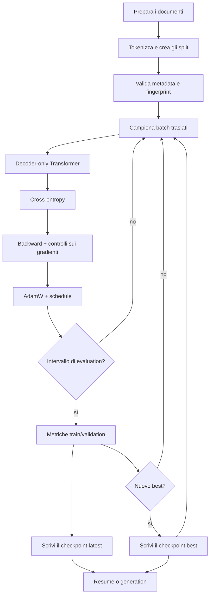

#### Traccia end-to-end delle shape

| Checkpoint | Tensor | Shape |
|---|---|---|
| token batch | $X,Y$ | `[B,T]` |
| token embedding | $E[X]$ | `[B,T,C]` |
| position embedding | $P$ | `[T,C]` |
| residual stream | $R$ | `[B,T,C]` |
| proiezioni Q/K/V separate per head, percorso predefinito | $Q,K,V'$ | `H` tensor `[B,T,D]` |
| proiezione Q/K/V fusa opzionale | $QKV$ | `[B,T,3C]`, poi split in `[B,H,T,D]` |
| attention score | $S$ | default: `H` tensor `[B,T,T]`; stack concettuale/fuso: `[B,H,T,T]` |
| valori contestuali | $O$ | default: `H` tensor `[B,T,D]`; percorso fuso: `[B,H,T,D]` |
| head ricomposte | $O_{cat}$ | `[B,T,C]` |
| espansione MLP | hidden | `[B,T,4C]` |
| vocabulary logits | $Z$ | `[B,T,V]` nel training; output `[B,1,V]` del modello in generation, poi vista `[B,V]` nel sampler |
| input della loss appiattito | $Z'$ | `[BT,V]` |
| loss | $\mathcal L$ | scalare |

#### Mappa dei parametri per la scala di LearnGPT

Ignorando i bias opzionali, i conteggi dominanti sono:

| Componente | Parametri approssimativi |
|---|---:|
| token embedding / head con weight tying | $VC$ |
| position embedding | $TC$ |
| attention per blocco | $4C^2$ |
| MLP per blocco | $8C^2$ |
| LayerNorm per block | $4C$ con gain e bias |
| tutti i blocchi | approssimativamente $L(12C^2+4C)$ |

Con $V=50{,}257$, $T=256$, $C=256$, $H=4$ e $L=6$, i vocabulary embedding
dominano, mentre ogni block aggiunge capacità di attention e MLP. Questi valori
descrivono il profilo controllato sul subset da 1 GiB documentato in
`docs/FINAL_TRAINING_RUNBOOK.md`, che contiene 17.716.049 parametri
addestrabili. **Non** sono i default istanziati dal breve snippet qui sotto:
poiché quegli argomenti non sono specificati, lo script usa $T=32$, $C=64$,
$H=4$ e $L=2$. In entrambi i casi, il conteggio esatto dipende da bias e weight
tying definiti nell'implementazione.

### Architettura e stato del training

```learngpt-mermaid
flowchart TD
    A["Architettura statica"] --> C["Checkpoint riproducibile"]
    S["Stato appreso"] --> C
    E["Evidenza esterna"] --> C
    C --> R["Ripristina modello e tokenizer"]
    P["Prompt · The"] --> R
    R --> L["Logits dell'ultima posizione · [B,1,V]"]
    L --> ROW["Seleziona l'ultima riga · [B,V]"]
    ROW --> SAMPLE["Campiona il prossimo token ID"]
    SAMPLE --> APPEND["Aggiungi l'ID al contesto"]
    APPEND -->|"ripeti"| L
    APPEND --> IDS["Token ID generati"]
    IDS --> D["Decode"]
    D --> TXT["Testo generato"]
```

### Codice di riferimento aggiunto in questa lezione

```python
tokenizer_config = {"encoding_name": DEFAULT_ENCODING_NAME}
model_config = ModelConfig(
    vocabulary_size=get_vocabulary_size(DEFAULT_ENCODING_NAME),
    output_chunk_size=32768,
)
training_config = TrainingConfig(
    max_grad_norm_before_clip=100.0,
    gradient_retry_attempts=3,
    context_sensitivity_contexts=2,
)
generation_config = GenerationConfig()

model = LanguageModel(**model_config.to_model_kwargs()).to(device)
model = maybe_compile_model(
    model=model,
    compile_model=training_config.compile_model,
)
optimizer = configure_optimizer(
    model=model,
    learning_rate=training_config.base_learning_rate,
    weight_decay=training_config.weight_decay,
    device=device,
)

history, best_checkpoint_path = train_model(
    model=model,
    optimizer=optimizer,
    training_data=training_data,
    validation_data=validation_data,
    batch_size=training_config.batch_size,
    context_size=model_config.context_size,
    training_steps=training_config.training_steps,
    eval_interval=training_config.eval_interval,
    eval_batches=training_config.eval_batches,
    checkpoint_path=CHECKPOINT_PATH,
    model_config=model_config.to_checkpoint_dict(),
    tokenizer_config=tokenizer_config,
    base_learning_rate=training_config.base_learning_rate,
    min_learning_rate=training_config.min_learning_rate,
    warmup_steps=training_config.warmup_steps,
    decay_steps=training_config.decay_steps,
    gradient_clip=training_config.gradient_clip,
    max_grad_norm_before_clip=training_config.max_grad_norm_before_clip,
    gradient_retry_attempts=training_config.gradient_retry_attempts,
    gradient_accumulation_steps=training_config.gradient_accumulation_steps,
    context_sensitivity_contexts=training_config.context_sensitivity_contexts,
    training_config=training_config.to_checkpoint_dict(),
    mixed_precision=training_config.mixed_precision,
    precision_dtype=training_config.precision_dtype,
    device=device,
)

generated_text, checkpoint = generate_text_from_checkpoint(
    checkpoint_path=best_checkpoint_path,
    prompt_text=generation_config.prompt_text,
    max_new_tokens=generation_config.generated_tokens,
    temperature=generation_config.temperature,
    top_k=generation_config.top_k,
    device=device,
    compile_model=training_config.compile_model,
    seed=generation_config.seed,
)
```

L'integrazione eseguibile è `study/lessons/42_final_project.py`. I file in
`final_project/` e `study/snapshots/lesson_42/` sono mantenuti identici.

### Sintassi e logica

- `ModelConfig(...)` raggruppa e convalida le scelte architettoniche come
  vocabulary size e dimensione dei chunk della proiezione di output prima di
  allocare il modello.
- `TrainingConfig(...)` raccoglie ottimizzazione e controlli di integrità, tra
  cui soglia del raw gradient, numero di retry e diagnostica del contesto.
- `tokenizer_config` e `GenerationConfig()` mantengono esplicite identità del
  tokenizer e scelte di sampling, senza ripetere valori letterali di testo e numerici
  nelle chiamate successive.
- `LanguageModel(**model_config.to_model_kwargs()).to(device)` espande soltanto
  i campi accettati dal costruttore, crea la rete e ne sposta lo stato sul
  device selezionato.
- `configure_optimizer(model=model, learning_rate=..., weight_decay=...,
  device=device)` costruisce i parameter group di AdamW dalle impostazioni
  convalidate e dalle capacità del device.
- `history, best_checkpoint_path = train_model(...)` avvia il training loop
  completo e restituisce metriche e path del checkpoint con la migliore
  validation loss.
- I keyword argument di `train_model(...)` rendono esplicito il contratto del
  run: dati, dimensioni di batch e contesto, evaluation cadence, learning-rate
  schedule, controlli sui gradienti, metadata del checkpoint e device.
- `generate_text_from_checkpoint(checkpoint_path=best_checkpoint_path, ...)`
  ricarica l'artefatto selezionato per una prova di generation indipendente,
  invece di riutilizzare il modello ancora in memoria dopo il training;
  prompt, numero di token, temperature, top-k, compile flag e seed provengono
  dai due oggetti di configurazione.
- La proiezione finale può suddividere l'operazione `[C,V]` in chunk del
  vocabulary e concatenarne i logits. Su MPS evita un'unica backward operation
  molto grande, preservando lo stesso risultato matematico.
- `preallocate_gradient_buffers(model)` e `clear_gradient_buffers(model)`
  mantengono allocati i gradient buffer MPS e li azzerano in place. Un warm-up
  scartato e il confronto con CPU verificano la direzione; i raw gradient norm
  sopra soglia vengono ricalcolati prima del clipping, quindi un update
  corrotto non raggiunge AdamW.
- `save_checkpoint(...)` scrive checkpoint atomici best/latest che includono
  config, RNG state, stato di optimizer e GradScaler, metrica best e un campo
  per il dataset fingerprint. La CLI di produzione popola e verifica quel
  campo; lo script compatto della lezione 42 lo lascia `None`, quindi la sua
  identità dati non è verificata. Quando entrambi i fingerprint esistono, il
  resume rifiuta una differenza salvo override esplicito.
- Con `fused_attention=True`, CUDA può usare una proiezione QKV combinata e una
  chiamata SDPA batched per block. I checkpoint legacy mantengono il layout con
  head separate perché i campi mancanti della configurazione assumono `False`.
- `log_interval` mostra loss, learning rate, gradient norm, throughput ed ETA
  senza avviare il percorso di validation e checkpoint governato da
  `eval_interval`.
- `training_steps=45_000` appartiene al profilo controllato separato: stessi
  moduli, subset deterministico da 1 GiB, circa 17,7 milioni di parametri e
  45.000 optimizer step. Il reference script usa invece i default didattici più
  piccoli quando non riceve gli argomenti di scala.

## Modello mentale finale

Un GPT è un classificatore differenziabile del token successivo, riutilizzato in
ogni posizione. Il testo diventa una sequenza di ID categorici; le tabelle
trasformano gli ID in vettori; l'attention causale combina soltanto il prefisso
visibile; gli MLP trasformano ogni posizione; i residual path conservano e
accumulano informazioni; l'output head sul vocabulary produce logits; la cross-entropy
misura l'errore sul token successivo corretto; la backpropagation assegna la
responsabilità attraverso tutte le operazioni tra matrici; AdamW aggiorna i
parametri; i checkpoint preservano l'esperimento; il sampling autoregressivo
trasforma classificazioni ripetute nuovamente in testo.

Il ciclo centrale può essere scritto in una riga:

$$
\text{text}\rightarrow\text{IDs}\rightarrow\text{batches}\rightarrow
\text{vectors}\rightarrow\text{context}\rightarrow\text{logits}
\rightarrow\text{loss}\rightarrow\text{gradients}\rightarrow
\text{better logits}\rightarrow\text{new text}.
$$

## Mappa delle sorgenti

- Narrativa educativa e checkpoint eseguibili: `course_en.md` e
  `study/lessons/01_*.py` fino a `study/lessons/42_*.py`.
- Architettura di produzione: `final_project/model.py`.
- Tokenizer di produzione: `final_project/tokenizer.py`.
- Batching di produzione e identità del dataset: `final_project/batching.py`.
- Training, valutazione, garanzie e checkpoint:
  `final_project/training.py` e `final_project/checkpoint.py`.
- Generation e sampling: `final_project/generate.py`.
- Visualizzazione interattiva ufficiale: [LearnGPT Web](https://learngpt.ferdinandobonsegna.com/)
  nel progetto fratello [`learn-gpt-web`](https://github.com/ferdinandobons/learn-gpt-web).
